Notes on Data Structures and Programming Techniques (CPSC 223, Spring 2022)
===========================================================================

James Aspnes

2023-09-25T21:31:32-0400

*   [1 Course administration](#1-course-administration)
    *   [1.1 Overview](#11-overview)
        *   [1.1.1 License](#111-license)
        *   [1.1.2 Resources](#112-resources)
        *   [1.1.3 Documentation](#113-documentation)
        *   [1.1.4 Questions and comments](#114-questions-and-comments)
    *   [1.2 Lecture schedule](#12-lecture-schedule)
    *   [1.3 Syllabus](#13-syllabus)
        *   [1.3.1 On-line course information](#131-on-line-course-information)
        *   [1.3.2 Meeting times](#132-meeting-times)
        *   [1.3.3 Course synopsis](#133-course-synopsis)
        *   [1.3.4 Prerequisites](#134-prerequisites)
        *   [1.3.5 Textbook](#135-textbook)
        *   [1.3.6 Course requirements](#136-course-requirements)
        *   [1.3.7 Staff](#137-staff)
            *   [1.3.7.1 Instructor](#1371-instructor)
            *   [1.3.7.2 Undergraduate Learning Assistants](#1372-undergraduate-learning-assistants)
        *   [1.3.8 Use of outside help](#138-use-of-outside-help)
        *   [1.3.9 Clarifications for homework assignments](#139-clarifications-for-homework-assignments)
        *   [1.3.10 Late assignments](#1310-late-assignments)
    *   [1.4 Introduction](#14-introduction)
        *   [1.4.1 Why should you learn to program in C?](#141-why-should-you-learn-to-program-in-c)
        *   [1.4.2 Why should you learn about data structures and programming techniques?](#142-why-should-you-learn-about-data-structures-and-programming-techniques)
*   [2 The Zoo](#2-the-zoo)
    *   [2.1 Getting an account](#21-getting-an-account)
    *   [2.2 Getting into the room](#22-getting-into-the-room)
    *   [2.3 Remote use](#23-remote-use)
        *   [2.3.1 Terminal access](#231-terminal-access)
        *   [2.3.2 GUI access](#232-gui-access)
    *   [2.4 Developing on your own machine](#24-developing-on-your-own-machine)
        *   [2.4.1 Linux](#241-linux)
        *   [2.4.2 OSX](#242-osx)
        *   [2.4.3 Windows](#243-windows)
    *   [2.5 How to compile and run programs](#25-how-to-compile-and-run-programs)
        *   [2.5.1 Creating the program](#251-creating-the-program)
        *   [2.5.2 Compiling and running a program](#252-compiling-and-running-a-program)
        *   [2.5.3 Some notes on what the program does](#253-some-notes-on-what-the-program-does)
*   [3 The Linux programming environment](#3-the-linux-programming-environment)
    *   [3.1 The shell](#31-the-shell)
        *   [3.1.1 Getting a shell prompt in the Zoo](#311-getting-a-shell-prompt-in-the-zoo)
        *   [3.1.2 The Unix filesystem](#312-the-unix-filesystem)
        *   [3.1.3 Unix command-line programs](#313-unix-command-line-programs)
        *   [3.1.4 Stopping and interrupting programs](#314-stopping-and-interrupting-programs)
        *   [3.1.5 Running your own programs](#315-running-your-own-programs)
        *   [3.1.6 Redirecting input and output](#316-redirecting-input-and-output)
    *   [3.2 Text editors](#32-text-editors)
        *   [3.2.1 Writing C programs with Emacs](#321-writing-c-programs-with-emacs)
            *   [3.2.1.1 My favorite Emacs commands](#3211-my-favorite-emacs-commands)
        *   [3.2.2 Using Vi instead of Emacs](#322-using-vi-instead-of-emacs)
            *   [3.2.2.1 My favorite Vim commands](#3221-my-favorite-vim-commands)
                *   [3.2.2.1.1 Normal mode](#32211-normal-mode)
                *   [3.2.2.1.2 Insert mode](#32212-insert-mode)
            *   [3.2.2.2 Settings](#3222-settings)
    *   [3.3 Compilation tools](#33-compilation-tools)
        *   [3.3.1 The GNU C compiler `gcc`](#331-the-gnu-c-compiler-gcc)
        *   [3.3.2 Make](#332-make)
            *   [3.3.2.1 Make gotchas](#3321-make-gotchas)
    *   [3.4 Debugging tools](#34-debugging-tools)
        *   [3.4.1 Debugging in general](#341-debugging-in-general)
        *   [3.4.2 Assertions](#342-assertions)
        *   [3.4.3 The GNU debugger `gdb`](#343-the-gnu-debugger-gdb)
            *   [3.4.3.1 My favorite gdb commands](#3431-my-favorite-gdb-commands)
            *   [3.4.3.2 Debugging strategies](#3432-debugging-strategies)
            *   [3.4.3.3 Common applications of `gdb`](#3433-common-applications-of-gdb)
                *   [3.4.3.3.1 Watching your program run](#34331-watching-your-program-run)
                *   [3.4.3.3.2 Dealing with failed assertions](#34332-dealing-with-failed-assertions)
                *   [3.4.3.3.3 Dealing with segmentation faults](#34333-dealing-with-segmentation-faults)
                *   [3.4.3.3.4 Dealing with infinite loops](#34334-dealing-with-infinite-loops)
                *   [3.4.3.3.5 Mysterious variable changes](#34335-mysterious-variable-changes)
        *   [3.4.4 Valgrind](#344-valgrind)
            *   [3.4.4.1 Compilation flags](#3441-compilation-flags)
            *   [3.4.4.2 Automated testing](#3442-automated-testing)
            *   [3.4.4.3 Examples of some common valgrind errors](#3443-examples-of-some-common-valgrind-errors)
                *   [3.4.4.3.1 Uninitialized values](#34431-uninitialized-values)
                *   [3.4.4.3.2 Bytes definitely lost](#34432-bytes-definitely-lost)
                *   [3.4.4.3.3 Invalid write or read operations](#34433-invalid-write-or-read-operations)
        *   [3.4.5 Not recommended: debugging output](#345-not-recommended-debugging-output)
    *   [3.5 Performance tuning](#35-performance-tuning)
        *   [3.5.1 Timing under Linux](#351-timing-under-linux)
        *   [3.5.2 Profiling with `valgrind`](#352-profiling-with-valgrind)
        *   [3.5.3 Profiling with `gprof`](#353-profiling-with-gprof)
            *   [3.5.3.1 Effect of optimization during compilation](#3531-effect-of-optimization-during-compilation)
    *   [3.6 Version control](#36-version-control)
        *   [3.6.1 Setting up Git](#361-setting-up-git)
        *   [3.6.2 Editing files](#362-editing-files)
        *   [3.6.3 Renaming files](#363-renaming-files)
        *   [3.6.4 Adding and removing files](#364-adding-and-removing-files)
        *   [3.6.5 Recovering files from the repository](#365-recovering-files-from-the-repository)
        *   [3.6.6 Undoing bad commits](#366-undoing-bad-commits)
        *   [3.6.7 Looking at old versions](#367-looking-at-old-versions)
        *   [3.6.8 More information about Git](#368-more-information-about-git)
    *   [3.7 Submitting assignments](#37-submitting-assignments)
*   [4 The C programming language](#4-the-c-programming-language)
    *   [4.1 Structure of a C program](#CProgramStructure)
    *   [4.2 Numeric data types](#numericTypes)
        *   [4.2.1 Integer types in C](#integerTypes)
            *   [4.2.1.1 Basic integer types](#4211-basic-integer-types)
            *   [4.2.1.2 Overflow and the C standards](#overflow-and-the-c-standards)
            *   [4.2.1.3 C99 fixed-width types](#C99_fixed-width_types)
        *   [4.2.2 `size_t` and `ptrdiff_t`](#sizeTypes)
            *   [4.2.2.1 Integer constants](#integerConstants)
                *   [4.2.2.1.1 Naming constants](#naming-constants)
            *   [4.2.2.2 Integer operators](#integerOperators)
                *   [4.2.2.2.1 Arithmetic operators](#arithmeticOperators)
                *   [4.2.2.2.2 Bitwise operators](#Bitwise_operators)
                *   [4.2.2.2.3 Logical operators](#Logical_operators)
                *   [4.2.2.2.4 Relational operators](#Relational_operators)
            *   [4.2.2.3 Converting to and from strings](#integerStringConversion)
        *   [4.2.3 Floating-point types](#423-floating-point-types)
            *   [4.2.3.1 Floating point basics](#Floating_point_basics)
            *   [4.2.3.2 Floating-point constants](#Floating-point_constants)
            *   [4.2.3.3 Operators](#operators)
            *   [4.2.3.4 Conversion to and from integer types](#Conversion_to_and_from_integer_types)
            *   [4.2.3.5 The IEEE-754 floating-point standard](#The_IEEE-754_floating-point_standard)
            *   [4.2.3.6 Round-off error](#Round-off-error)
            *   [4.2.3.7 Reading and writing floating-point numbers](#Reading_and_writing_floating-point_numbers)
            *   [4.2.3.8 Non-finite numbers in C](#Non-finite_numbers_in_C)
            *   [4.2.3.9 The math library](#mathLibrary)
    *   [4.3 Operator precedence](#operatorPrecedence)
    *   [4.4 Programming style](#programmingStyle)
    *   [4.5 Variables](#variables)
        *   [4.5.1 Memory](#MachineMemory)
        *   [4.5.2 Variables as names](#variablesAsNames)
            *   [4.5.2.1 Variable declarations](#Variable_declarations)
            *   [4.5.2.2 Variable names](#Variable_names)
        *   [4.5.3 Using variables](#usingVariables)
        *   [4.5.4 Initialization](#initializers)
        *   [4.5.5 Storage class qualifiers](#qualifiers)
            *   [4.5.5.1 Scope and extent](#scopeAndExtent)
                *   [4.5.5.1.1 Additional qualifiers for global variables](#additional-qualifiers-for-global-variables)
        *   [4.5.6 Marking variables as constant](#const)
            *   [4.5.6.1 Pointers to `const`](#pointers-to-const)
    *   [4.6 Input and output](#IO)
        *   [4.6.1 Character streams](#Character_streams)
        *   [4.6.2 Reading and writing single characters](#characterIO)
        *   [4.6.3 Formatted I/O](#Formatted_IO)
        *   [4.6.4 Rolling your own I/O routines](#Rolling_your_own_IO_routines)
        *   [4.6.5 Recursive descent parsing](#recursiveDescentParsing)
        *   [4.6.6 File I/O](#FileIO)
    *   [4.7 Statements and control structures](#47-statements-and-control-structures)
        *   [4.7.1 Simple statements](#Simple_statements)
        *   [4.7.2 Compound statements](#Compound_statements)
            *   [4.7.2.1 Conditionals](#conditionals)
            *   [4.7.2.2 Loops](#Loops)
                *   [4.7.2.2.1 The while loop](#The_while_loop)
                *   [4.7.2.2.2 The do..while loop](#The_do..while_loop)
                *   [4.7.2.2.3 The for loop](#forLoop)
                *   [4.7.2.2.4 Loops with break, continue, and goto](#gotoLikeStatements)
            *   [4.7.2.3 Choosing where to put a loop exit](#Choosing_where_to_put_a_loop_exit)
    *   [4.8 Functions](#functions)
        *   [4.8.1 Function definitions](#functionDefinitions)
        *   [4.8.2 When to write a function](#functionIdeology)
        *   [4.8.3 Calling a function](#Calling_a_function)
        *   [4.8.4 The return statement](#return)
        *   [4.8.5 Function declarations and modules](#modules)
        *   [4.8.6 Static functions](#staticFunctions)
        *   [4.8.7 Local variables](#Local_variables)
        *   [4.8.8 Mechanics of function calls](#Mechanics_of_function_calls)
    *   [4.9 Pointers](#pointers)
        *   [4.9.1 Memory and addresses](#addressSpace)
        *   [4.9.2 Pointer variables](#Pointer_variables)
            *   [4.9.2.1 Declaring a pointer variable](#Declaring_a_pointer_variable)
            *   [4.9.2.2 Assigning to pointer variables](#Assigning_to_pointer_variables)
            *   [4.9.2.3 Using a pointer](#Using_a_pointer)
            *   [4.9.2.4 Printing pointers](#Printing_pointers)
        *   [4.9.3 The null pointer](#The_null_pointer)
        *   [4.9.4 Pointers and functions](#Pointers_and_functions)
        *   [4.9.5 Pointer arithmetic and arrays](#pointerArithmetic)
            *   [4.9.5.1 Arrays](#arrays)
            *   [4.9.5.2 Arrays and functions](#arraysAndFunctions)
            *   [4.9.5.3 Multidimensional arrays](#multidimensionalArrays)
                *   [4.9.5.3.1 Using built-in C arrays](#multidimensionalStandard)
                *   [4.9.5.3.2 Using an array of pointers to rows](#arrayOfPointersToRows)
                *   [4.9.5.3.3 Using a one-dimensional array](#packedTwoDimensionalArray)
            *   [4.9.5.4 Variable-length arrays](#variableLengthArrays)
                *   [4.9.5.4.1 Why you shouldn’t use variable-length arrays](#why-you-shouldnt-use-variable-length-arrays)
        *   [4.9.6 Pointers to void](#voidPointers)
            *   [4.9.6.1 Alignment](#alignment)
        *   [4.9.7 Run-time storage allocation using `malloc`](#malloc)
        *   [4.9.8 Function pointers](#functionPointers)
            *   [4.9.8.1 Function pointer declarations](#Function_pointer_declarations)
            *   [4.9.8.2 Callbacks](#Callbacks)
            *   [4.9.8.3 Dispatch tables](#Dispatch_tables)
        *   [4.9.9 The restrict keyword](#The_restrict_keyword)
    *   [4.10 Strings](#strings)
        *   [4.10.1 C strings](#C_strings)
        *   [4.10.2 String constants](#String_constants)
            *   [4.10.2.1 String encodings](#string-encodings)
        *   [4.10.3 String buffers](#String_buffers)
            *   [4.10.3.1 String buffers and the perils of `gets`](#string-buffers-and-the-perils-of-gets)
        *   [4.10.4 Operations on strings](#Operations_on_strings)
        *   [4.10.5 Finding the length of a string](#Finding_the_length_of_a_string)
            *   [4.10.5.1 The strlen tarpit](#The_strlen_tarpit)
        *   [4.10.6 Comparing strings](#Comparing_strings)
        *   [4.10.7 Formatted output to strings](#Formatted_output_to_strings)
        *   [4.10.8 Dynamic allocation of strings](#Dynamic_allocation_of_strings)
        *   [4.10.9 Command-line arguments](#argv)
    *   [4.11 Structured data types](#structuredDataTypes)
        *   [4.11.1 Structs](#structs)
            *   [4.11.1.1 Operations on structs](#operations-on-structs)
            *   [4.11.1.2 Layout in memory](#structLayout)
            *   [4.11.1.3 Bit fields](#Bit_fields)
        *   [4.11.2 Unions](#unions)
        *   [4.11.3 Enums](#enums)
            *   [4.11.3.1 Specifying particular values](#specifying-particular-values)
            *   [4.11.3.2 What most people do](#what-most-people-do)
            *   [4.11.3.3 Using `enum` with `union`](#enumTagsForUnion)
    *   [4.12 Type aliases using `typedef`](#typedef)
        *   [4.12.1 Opaque structs](#opaqueStructs)
    *   [4.13 Macros](#macros)
        *   [4.13.1 Macros with arguments](#Macros_with_arguments)
            *   [4.13.1.1 Multiple arguments](#Multiple_arguments)
            *   [4.13.1.2 Perils of repeating arguments](#Perils_of_repeating_arguments)
            *   [4.13.1.3 Variable-length argument lists](#Variable-length_argument_lists)
            *   [4.13.1.4 Macros vs. inline functions](#macros-vs.-inline-functions)
        *   [4.13.2 Macros that include other macros](#Multiple_macros)
        *   [4.13.3 More specialized macros](#Macro_tricks)
            *   [4.13.3.1 Multiple expressions in a macro](#Multiple_expressions_in_a_macro)
            *   [4.13.3.2 Non-syntactic macros](#nonSyntacticMacros)
            *   [4.13.3.3 Multiple statements in one macro](#Multiple_statements_in_one_macro)
            *   [4.13.3.4 String expansion](#String_expansion)
            *   [4.13.3.5 Big macros](#Big_macros)
        *   [4.13.4 Conditional compilation](#ifdef)
        *   [4.13.5 Defining macros on the command line](#defining-macros-on-the-command-line)
        *   [4.13.6 The `#if` directive](#the-if-directive)
        *   [4.13.7 Debugging macro expansions](#Debugging_macro_expansions)
        *   [4.13.8 Can a macro call a preprocessor command?](#Can_a_macro_call_a_preprocessor_command.3F)
*   [5 Data structures and programming techniques](#dataStructuresAndProgrammingTechniques)
    *   [5.1 Asymptotic notation](#asymptoticNotation)
        *   [5.1.1 Two sorting algorithms](#two-sorting-algorithms)
        *   [5.1.2 Big-O to the rescue](#big-o-to-the-rescue)
        *   [5.1.3 Asymptotic cost of programs](#asymptotic-cost-of-programs)
        *   [5.1.4 Other variants of asymptotic notation](#other-variants-of-asymptotic-notation)
    *   [5.2 Dynamic arrays](#dynamicArrays)
    *   [5.3 Recursion](#recursion)
        *   [5.3.1 Example of recursion in C](#Example_of_recursion_in_C)
        *   [5.3.2 Common problems with recursion](#Common_problems_with_recursion)
            *   [5.3.2.1 Omitting the base case](#Omitting_the_base_case)
            *   [5.3.2.2 Blowing out the stack](#Blowing_out_the_stack)
            *   [5.3.2.3 Failure to make progress](#Failure_to_make_progress)
        *   [5.3.3 Tail-recursion and iteration](#tailRecursion)
            *   [5.3.3.1 Binary search: recursive and iterative versions](#binarySearch)
        *   [5.3.4 Mergesort: a recursive sorting algorithm](#mergesort)
        *   [5.3.5 Asymptotic complexity of recursive functions](#asymptotic-complexity-of-recursive-functions)
    *   [5.4 Linked lists](#linkedLists)
        *   [5.4.1 Stacks](#stacks)
            *   [5.4.1.1 Building a stack out of an array](#Building_a_stack_out_of_an_array)
        *   [5.4.2 Queues](#queues)
        *   [5.4.3 Looping over a linked list](#Looping_over_a_linked_list)
        *   [5.4.4 Looping over a linked list backwards](#Looping_over_a_linked_list_backwards)
        *   [5.4.5 Deques and doubly-linked lists](#deques)
            *   [5.4.5.1 Alternate implementation using a ring buffer](#ringBuffers)
        *   [5.4.6 Circular linked lists](#Circular_linked_lists)
        *   [5.4.7 What linked lists are and are not good for](#What_linked_lists_are_and_are_not_good_for)
        *   [5.4.8 Further reading](#Further_reading)
    *   [5.5 Abstract data types](#abstractDataTypes)
        *   [5.5.1 Boxed vs unboxed types](#boxedVsUnboxedTypes)
            *   [5.5.1.1 A danger with unboxed types](#a-danger-with-unboxed-types)
        *   [5.5.2 A sequence type](#abstractDataTypeExample)
            *   [5.5.2.1 Interface](#Interface)
            *   [5.5.2.2 Implementation](#adtImplementation)
            *   [5.5.2.3 Compiling and linking](#Compiling_and_linking)
        *   [5.5.3 Designing abstract data types](#Designing_abstract_data_types)
            *   [5.5.3.1 Parnas’s Principle](#Parnas.27s_Principle)
            *   [5.5.3.2 When to build an abstract data type](#When_to_build_an_abstract_data_type)
    *   [5.6 Hash tables](#hashTables)
        *   [5.6.1 Dictionary data types](#dictionaries)
        *   [5.6.2 Basics of hashing](#Basics_of_hashing)
        *   [5.6.3 Resolving collisions](#Resolving_collisions)
            *   [5.6.3.1 Chaining](#Chaining)
            *   [5.6.3.2 Open addressing](#Open_addressing)
        *   [5.6.4 Choosing a hash function](#Choosing_a_hash_function)
            *   [5.6.4.1 Division method](#Division_method)
            *   [5.6.4.2 Multiplication method](#Multiplication_method)
            *   [5.6.4.3 Universal hashing](#Universal_hashing)
        *   [5.6.5 Maintaining a constant load factor](#Maintaining_a_constant_load_factor)
        *   [5.6.6 Examples](#Examples)
            *   [5.6.6.1 A low-overhead hash table using open addressing](#A_low-overhead_hash_table_using_open_addressing)
            *   [5.6.6.2 A string to string dictionary using chaining](#A_string_to_string_dictionary_using_chaining)
    *   [5.7 Generic containers](#genericContainers)
        *   [5.7.1 Generic dictionary: interface](#Generic_dictionary:_interface)
        *   [5.7.2 Generic dictionary: implementation](#genericDictionaryImplementation)
    *   [5.8 Object-oriented programming](#objectOrientedProgramming)
    *   [5.9 Trees](#trees)
        *   [5.9.1 Tree basics](#Tree_basics)
        *   [5.9.2 Tree-structured data](#treeStructuredData)
        *   [5.9.3 Binary trees](#binaryTrees)
        *   [5.9.4 The canonical binary tree algorithm](#The_canonical_binary_tree_algorithm)
        *   [5.9.5 Nodes vs leaves](#Nodes_vs_leaves)
        *   [5.9.6 Special classes of binary trees](#Special_classes_of_binary_trees)
    *   [5.10 Heaps](#heaps)
        *   [5.10.1 Priority queues](#priorityQueues)
        *   [5.10.2 Expensive implementations of priority queues](#Expensive_implementations_of_priority_queues)
        *   [5.10.3 Structure of a heap](#heapStructure)
        *   [5.10.4 Packed heaps](#Packed_heaps)
        *   [5.10.5 Bottom-up heapification](#Bottom-up_heapification)
        *   [5.10.6 Heapsort](#heapSort)
        *   [5.10.7 More information](#heapMoreInformation)
    *   [5.11 Binary search trees](#binarySearchTrees)
        *   [5.11.1 Searching for a node](#Searching_for_a_node)
        *   [5.11.2 Inserting a new node](#Inserting_a_new_node)
        *   [5.11.3 Deleting a node](#deleting-a-node)
        *   [5.11.4 Costs](#Costs)
    *   [5.12 Augmented trees](#augmentedTrees)
        *   [5.12.1 Applications](#applications)
    *   [5.13 Balanced trees](#balancedTrees)
        *   [5.13.1 Tree rotations](#treeRotations)
        *   [5.13.2 Treaps](#treaps)
        *   [5.13.3 AVL trees](#AVLtrees)
            *   [5.13.3.1 Sample implementation](#avlTreeImplementation)
        *   [5.13.4 2–3 trees](#A2.2BIBM-3_trees)
        *   [5.13.5 Red-black trees](#redBlackTrees)
        *   [5.13.6 B-trees](#B-trees)
        *   [5.13.7 Splay trees](#splayTrees)
            *   [5.13.7.1 How splaying works](#how-splaying-works)
            *   [5.13.7.2 Analysis](#splayTreeAnalysis)
            *   [5.13.7.3 Other operations](#other-operations)
            *   [5.13.7.4 Top-down splaying](#top-down-splaying)
            *   [5.13.7.5 An implementation](#splayTreeImplementation)
            *   [5.13.7.6 More information](#splayTreesMoreInformation)
        *   [5.13.8 Scapegoat trees](#scapegoatTrees)
        *   [5.13.9 Skip lists](#skip-lists)
        *   [5.13.10 Implementations](#treeImplementations)
    *   [5.14 Graphs](#graphs)
        *   [5.14.1 Basic definitions](#graphDefinitions)
        *   [5.14.2 Why graphs are useful](#Why_graphs_are_useful)
        *   [5.14.3 Operations on graphs](#Operations_on_graphs)
        *   [5.14.4 Representations of graphs](#Representations_of_graphs)
            *   [5.14.4.1 Adjacency matrices](#Adjacency_matrices)
            *   [5.14.4.2 Adjacency lists](#Adjacency_lists)
                *   [5.14.4.2.1 An implementation](#An_implementation)
            *   [5.14.4.3 Implicit representations](#Implicit_representations)
        *   [5.14.5 Searching for paths in a graph](#graphSearch)
            *   [5.14.5.1 Implementation of depth-first and breadth-first search](#graphSearchImplementation)
            *   [5.14.5.2 Combined implementation of depth-first and breadth-first search](#combinedDFSBFS)
            *   [5.14.5.3 Other variations on the basic algorithm](#Other_variations_on_the_basic_algorithm)
    *   [5.15 Dynamic programming](#dynamicProgramming)
        *   [5.15.1 Memoization](#Memoization)
        *   [5.15.2 Dynamic programming](#Dynamic_programming)
            *   [5.15.2.1 More examples](#More_examples)
                *   [5.15.2.1.1 Longest increasing subsequence](#Longest_increasing_subsequence)
                *   [5.15.2.1.2 All-pairs shortest paths](#All-pairs_shortest_paths)
                *   [5.15.2.1.3 Longest common subsequence](#longestCommonSubsequence)
    *   [5.16 Randomization](#randomization)
        *   [5.16.1 Generating random values in C](#Generating_random_values_in_C)
            *   [5.16.1.1 The `rand` function from the standard library](#The_rand_function_from_the_standard_library)
                *   [5.16.1.1.1 Supplying a seed with `srand`](#supplying-a-seed-with-srand)
            *   [5.16.1.2 Better pseudorandom number generators](#Better_pseudorandom_number_generators)
            *   [5.16.1.3 Random numbers without the pseudo](#Random_numbers_without_the_pseudo)
            *   [5.16.1.4 Range issues](#RANDMAX)
        *   [5.16.2 Randomized algorithms](#Randomized_algorithms)
            *   [5.16.2.1 Randomized search](#Randomized_search)
            *   [5.16.2.2 Quickselect and quicksort](#quicksort)
        *   [5.16.3 Randomized data structures](#randomizedDataStructures)
            *   [5.16.3.1 Skip lists](#skipLists)
            *   [5.16.3.2 Universal hash families](#Universal_hash_families)
    *   [5.17 String processing](#stringProcessing)
        *   [5.17.1 Radix search](#radixSearch)
            *   [5.17.1.1 Tries](#Tries)
                *   [5.17.1.1.1 Searching a trie](#Searching_a_trie)
                *   [5.17.1.1.2 Inserting a new element into a trie](#Inserting_a_new_element_into_a_trie)
                *   [5.17.1.1.3 Implementation](#trieImplementation)
            *   [5.17.1.2 Patricia trees](#Patricia_trees)
            *   [5.17.1.3 Ternary search trees](#ternarySearchTrees)
            *   [5.17.1.4 More information](#treesMoreInformation)
        *   [5.17.2 Radix sort](#radixSort)
            *   [5.17.2.1 Bucket sort](#Bucket_sort)
            *   [5.17.2.2 Classic LSB radix sort](#Classic_LSB_radix_sort)
            *   [5.17.2.3 MSB radix sort](#MSB_radix_sort)
                *   [5.17.2.3.1 Issues with recursion depth](#Issues_with_recursion_depth)
                *   [5.17.2.3.2 Implementing the buckets](#Implementing_the_buckets)
                *   [5.17.2.3.3 Further optimization](#Further_optimization)
                *   [5.17.2.3.4 Sample implementation](#radixSortImplementation)
*   [6 Other topics](#other-topics)
    *   [6.1 More applications of function pointers](#more-applications-of-function-pointers)
        *   [6.1.1 Iterators](#iterators)
            *   [6.1.1.1 Option 1: Function that returns a sequence](#Option_1:_Function_that_returns_a_sequence)
            *   [6.1.1.2 Option 2: Iterator with first/done/next operations](#Option_2:_Iterator_with_first.2Fdone.2Fnext_operations)
            *   [6.1.1.3 Option 3: Iterator with function argument](#Option_3:_Iterator_with_function_argument)
        *   [6.1.2 Closures](#closures)
        *   [6.1.3 Objects](#Objects)
    *   [6.2 Suffix arrays](#suffixArrays)
        *   [6.2.1 Why do we want to do this?](#Why_do_we_want_to_do_this.3F)
        *   [6.2.2 String search algorithms](#String_search_algorithms)
        *   [6.2.3 Suffix trees and suffix arrays](#Suffix_trees_and_suffix_arrays)
            *   [6.2.3.1 Building a suffix array](#Building_a_suffix_array)
            *   [6.2.3.2 Searching a suffix array](#Searching_a_suffix_array)
    *   [6.3 Burrows-Wheeler transform](#Burrows-Wheeler_transform)
        *   [6.3.1 Suffix arrays and the Burrows-Wheeler transform](#Suffix_arrays_and_the_Burrows-Wheeler_transform)
        *   [6.3.2 Sample implementation](#sample-implementation)
    *   [6.4 C++](#cplusplus)
        *   [6.4.1 Hello world](#Hello_world)
        *   [6.4.2 References](#References)
        *   [6.4.3 Function overloading](#Function_overloading)
        *   [6.4.4 Classes](#Classes)
        *   [6.4.5 Operator overloading](#Operator_overloading)
        *   [6.4.6 Templates](#Templates)
        *   [6.4.7 Exceptions](#Exceptions)
        *   [6.4.8 Storage allocation](#Storage_allocation)
            *   [6.4.8.1 Storage allocation inside objects](#Storage_allocation_inside_objects)
        *   [6.4.9 Standard library](#Standard_library)
        *   [6.4.10 Things we haven’t talked about](#Things_we_haven.27t_talked_about)
    *   [6.5 Testing during development](#testingDuringDevelopment)
        *   [6.5.1 Unit tests](#unitTests)
            *   [6.5.1.1 What to put in the test code](#what-to-put-in-the-test-code)
            *   [6.5.1.2 Example](#example)
        *   [6.5.2 Test harnesses](#test-harnesses)
            *   [6.5.2.1 Module interface](#Module_interface)
                *   [6.5.2.1.1 stack.h](#stack.h)
            *   [6.5.2.2 Test code](#Test_code)
                *   [6.5.2.2.1 test-stack.c](#test-stack.c)
            *   [6.5.2.3 Makefile](#Makefile)
                *   [6.5.2.3.1 Makefile](#Makefile-1)
        *   [6.5.3 Stub implementation](#Stub_implementation)
            *   [6.5.3.1 stack.c](#stack.c)
        *   [6.5.4 Bounded-space implementation](#Bounded-space_implementation)
            *   [6.5.4.1 stack.c](#stack.c-1)
        *   [6.5.5 First fix](#First_fix)
        *   [6.5.6 Final version](#Final_version)
            *   [6.5.6.1 stack.c](#stack.c-2)
        *   [6.5.7 Moral](#Moral)
        *   [6.5.8 Appendix: Test macros](#Appendix:_Test_macros)
    *   [6.6 Algorithm design techniques](#algorithmDesignTechniques)
        *   [6.6.1 Basic principles of algorithm design](#Basic_principles_of_algorithm_design)
        *   [6.6.2 Specific techniques](#algorithmDesignTechniquesClassification)
        *   [6.6.3 Example: Finding the maximum](#Example:_Finding_the_maximum)
        *   [6.6.4 Example: Sorting](#algorithmDesignSorting)
    *   [6.7 Bit manipulation](#bitManipulation)
    *   [6.8 Persistence](#persistence)
        *   [6.8.1 A simple solution using text files](#A_simple_solution_using_text_files)
        *   [6.8.2 Using a binary file](#Using_a_binary_file)
        *   [6.8.3 A version that updates the file in place](#A_version_that_updates_the_file_in_place)
        *   [6.8.4 An even better version using mmap](#An_even_better_version_using_mmap)
        *   [6.8.5 Concurrency and fault-tolerance issues: ACIDity](#Concurrency_and_fault-tolerance_issues:_ACIDity)
*   [7 What next?](#whatNext)
    *   [7.1 What’s wrong with C](#What.27s_wrong_with_C)
    *   [7.2 What C++ fixes](#What_C.2B-.2B-_fixes)
    *   [7.3 Other C-like languages](#other-c-like-languages)
    *   [7.4 Scripting languages](#Scripting_languages)
*   [8 Assignments](#assignments)
    *   [8.1 Assignment 1, due 2022-02-03 at 17:00](#hw1-2022)
        *   [8.1.1 Bureaucratic part](#bureaucratic-part)
        *   [8.1.2 Hello, world: A program in honor of Georges Perec](#hello-world-a-program-in-honor-of-georges-perec)
        *   [8.1.3 Submitting your assignment](#submitting-your-assignment)
        *   [8.1.4 Sample solution](#sample-solution)
    *   [8.2 Assignment 2, due 2022-02-10 at 17:00](#hw2-2022)
        *   [8.2.1 Recognizing lowercase letters](#recognizing-lowercase-letters)
        *   [8.2.2 Non-ASCII characters](#non-ascii-characters)
        *   [8.2.3 Testing your assignment](#testing-your-assignment)
        *   [8.2.4 Clarifications](#clarifications)
        *   [8.2.5 Submitting your assignment](#submitting-your-assignment-1)
        *   [8.2.6 Sample solution](#sample-solution-1)
    *   [8.3 Assignment 3, due 2022-02-17 at 17:00](#hw3-2022)
        *   [8.3.1 Testing your assignment](#testing-your-assignment-1)
        *   [8.3.2 Submitting your assignment](#submitting-your-assignment-2)
        *   [8.3.3 Notes](#notes)
        *   [8.3.4 Clarifications](#clarifications-1)
        *   [8.3.5 Sample solution](#sample-solution-2)
    *   [8.4 Assignment 4, due 2022-02-24 at 17:00](#hw4-2022)
        *   [8.4.1 Testing your assignment](#testing-your-assignment-2)
        *   [8.4.2 Submitting your assignment](#submitting-your-assignment-3)
        *   [8.4.3 Notes](#notes-1)
        *   [8.4.4 Sample solution](#sample-solution-3)
    *   [8.5 Assignment 5, due 2022-03-03 at 23:59](#hw5-2022)
        *   [8.5.1 Your task](#your-task)
        *   [8.5.2 Submitting your assignment](#submitting-your-assignment-4)
        *   [8.5.3 Sample solutions](#sample-solutions)
    *   [8.6 Assignment 6, due 2022-03-10 at 23:59](#hw6-2022)
        *   [8.6.1 A macro processor](#a-macro-processor)
        *   [8.6.2 Unexpanded delimiters](#unexpanded-delimiters)
        *   [8.6.3 Directories](#directories)
        *   [8.6.4 Recursion depth](#recursion-depth)
        *   [8.6.5 Bad arguments](#bad-arguments)
        *   [8.6.6 Submitting your assignment](#submitting-your-assignment-5)
        *   [8.6.7 Sample solution](#sample-solution-4)
    *   [8.7 Assignment 7, due 2022-03-17 at 23:59](#hw7-2022)
        *   [8.7.1 A maze of twisty little pointers](#a-maze-of-twisty-little-pointers)
        *   [8.7.2 Submitting your assignment](#submitting-your-assignment-6)
        *   [8.7.3 Testing your assignment](#testing-your-assignment-3)
        *   [8.7.4 Sample solution](#sample-solution-5)
    *   [8.8 Assignment 8, due 2022-03-31 at 23:59](#hw8-2022)
        *   [8.8.1 Your task](#your-task-1)
        *   [8.8.2 Submitting your assignment](#submitting-your-assignment-7)
        *   [8.8.3 Sample solution](#sample-solution-6)
    *   [8.9 Assignment 9, due 2022-04-07 at 23:59](#hw9-2022)
        *   [8.9.1 An infinite stream data structure](#an-infinite-stream-data-structure)
        *   [8.9.2 Submitting your assignment](#submitting-your-assignment-8)
        *   [8.9.3 Sample solution](#sample-solution-7)
    *   [8.10 Assignment 10, due 2022-04-14 at 23:59](#hw10-2022)
        *   [8.10.1 Greedy trash collecting](#greedy-trash-collecting)
        *   [8.10.2 Example](#example-1)
        *   [8.10.3 Submitting your assignment](#submitting-your-assignment-9)
        *   [8.10.4 Sample solution](#sample-solution-8)
    *   [8.11 Assignment 11, due 2022-04-21 at 23:59](#hw11-2022)
        *   [8.11.1 An expandable vector type](#an-expandable-vector-type)
        *   [8.11.2 Efficiency](#efficiency)
        *   [8.11.3 Submitting your assignment](#submitting-your-assignment-10)
        *   [8.11.4 Testing your assignment](#testing-your-assignment-4)
        *   [8.11.5 Sample solution](#sample-solution-9)
    *   [8.12 Assignment 12, due 2022-04-28 at 23:59](#hw12-2022)
        *   [8.12.1 A simulator for majority dynamics](#a-simulator-for-majority-dynamics)
        *   [8.12.2 Input format](#input-format)
        *   [8.12.3 Output format](#output-format)
        *   [8.12.4 Examples](#examples)
        *   [8.12.5 Submitting your assignment](#submitting-your-assignment-11)
        *   [8.12.6 Testing your assignment](#testing-your-assignment-5)
        *   [8.12.7 Sample solution](#sample-solution-10)
*   [9 Sample assignments from Spring 2021](#sample-assignments-from-spring-2021)
    *   [9.1 Assignment 1, due 2021-02-18 at 17:00 Eastern US time](#hw1-2021)
        *   [9.1.1 Bureaucratic part](#bureaucratic-part-1)
        *   [9.1.2 Run-length encoding](#run-length-encoding)
        *   [9.1.3 Testing your assignment](#testing-your-assignment-6)
        *   [9.1.4 Submitting your assignment](#submitting-your-assignment-12)
        *   [9.1.5 Sample solution](#hw1solution-2021)
    *   [9.2 Assignment 2, due 2021-02-25 at 17:00 Eastern US time](#hw2-2021)
        *   [9.2.1 Output format](#output-format-1)
        *   [9.2.2 Input range](#input-range)
        *   [9.2.3 Testing your assignment](#testing-your-assignment-7)
        *   [9.2.4 Submitting your assignment](#submitting-your-assignment-13)
        *   [9.2.5 Sample solution](#hw2solution-2021)
    *   [9.3 Assignment 3, due 2021-03-04 at 17:00 Eastern US time](#hw3-2021)
        *   [9.3.1 Pancake instruction set](#pancake-instruction-set)
            *   [9.3.1.1 Undefined behavior](#undefined-behavior)
            *   [9.3.1.2 Example](#example-2)
        *   [9.3.2 Testing your program](#testing-your-program)
        *   [9.3.3 Submitting your assignment](#submitting-your-assignment-14)
        *   [9.3.4 Sample solution](#hw3solution-2021)
    *   [9.4 Assignment 4, due 2021-03-11 at 17:00 Eastern US time](#hw4-2021)
        *   [9.4.1 Details](#details)
        *   [9.4.2 Testing your assignment](#testing-your-assignment-8)
        *   [9.4.3 Submitting your assignment](#submitting-your-assignment-15)
        *   [9.4.4 Sample solution](#hw4solution-2021)
    *   [9.5 Assignment 5, due 2021-03-18 at 17:00 Eastern US time](#hw5-2021)
        *   [9.5.1 Testing your assignment](#testing-your-assignment-9)
        *   [9.5.2 Sample solution](#hw5solution-2021)
        *   [9.5.3 Submitting your assignment](#submitting-your-assignment-16)
    *   [9.6 Assignment 6, due 2021-03-26 at 17:00 Eastern US time](#hw6-2021)
        *   [9.6.1 Testing your assignment](#testing-your-assignment-10)
        *   [9.6.2 Submitting your assignment](#submitting-your-assignment-17)
        *   [9.6.3 Sample solution](#hw6solution-2021)
    *   [9.7 Assignment 7, due 2021-04-01 at 17:00 Eastern US time](#hw7-2021)
        *   [9.7.1 Password files](#password-files)
        *   [9.7.2 Decryption](#decryption)
        *   [9.7.3 Hints](#hints)
        *   [9.7.4 Submitting your assignment](#submitting-your-assignment-18)
        *   [9.7.5 Testing your assignment](#testing-your-assignment-11)
        *   [9.7.6 Sample solution](#hw7solution-2021)
    *   [9.8 Assignment 8, due 2021-04-07 at 23:59 Eastern US time](#hw8-2021)
        *   [9.8.1 Compression scheme](#compression-scheme)
        *   [9.8.2 Choice of dictionary](#choice-of-dictionary)
        *   [9.8.3 Decompressor (provided)](#decompressor-provided)
        *   [9.8.4 Compressor (to be submitted)](#compressor-to-be-submitted)
        *   [9.8.5 Testing your assignment](#testing-your-assignment-12)
        *   [9.8.6 Sample solution](#hw8solution-2021)
    *   [9.9 Assignment 9, due 2021-04-15 at 17:00 Eastern US time](#hw9-2021)
        *   [9.9.1 The Pancake Flipper Markup Language](#the-pancake-flipper-markup-language)
        *   [9.9.2 Your task](#your-task-2)
        *   [9.9.3 Submitting your assignment](#submitting-your-assignment-19)
        *   [9.9.4 Testing your assignment](#testing-your-assignment-13)
        *   [9.9.5 Sample solution](#hw9solution-2021)
    *   [9.10 Assignment 10, due 2021-04-22 at 17:00 Eastern US time](#hw10-2021)
        *   [9.10.1 Behavior](#behavior)
        *   [9.10.2 Interface](#interface)
        *   [9.10.3 Test program](#test-program)
        *   [9.10.4 Submitting your assignment](#submitting-your-assignment-20)
        *   [9.10.5 Testing your assignment](#testing-your-assignment-14)
        *   [9.10.6 Sample solution](#sample-solution-11)
    *   [9.11 Assignment 11, due 2021-04-29 at 17:00 Eastern US time](#hw11-2021)
        *   [9.11.1 The `Inserter` data type](#the-inserter-data-type)
        *   [9.11.2 Interface](#interface-1)
        *   [9.11.3 Test program](#test-program-1)
        *   [9.11.4 Submitting your assignment](#submitting-your-assignment-21)
        *   [9.11.5 Sample solution](#hw11solution-2021)
    *   [9.12 Assignment 12, due 2021-05-06 at 17:00 Eastern US time](#hw12-2021)
        *   [9.12.1 Distance-2 colorings](#distance-2-colorings)
        *   [9.12.2 Your task](#your-task-3)
        *   [9.12.3 Submitting your assignment](#submitting-your-assignment-22)
        *   [9.12.4 Testing your assignment](#testing-your-assignment-15)
        *   [9.12.5 Implementation hints](#implementation-hints)
        *   [9.12.6 Sample solution](#hw12solution-2021)
*   [10 Sample assignments from Spring 2018](#sample-assignments-from-spring-2018)
    *   [10.1 Assignment 1, due Thursday 2018-02-08, at 11:00pm](#hw1-2018)
        *   [10.1.1 Bureaucratic part](#bureaucratic-part-2)
        *   [10.1.2 Pig Esperanto](#pig-esperanto)
        *   [10.1.3 Your task](#your-task-4)
        *   [10.1.4 Testing your assignment](#testing-your-assignment-16)
        *   [10.1.5 Submitting your assignment](#submitting-your-assignment-23)
        *   [10.1.6 Sample solution](#sample-solution-12)
    *   [10.2 Assignment 2, due Thursday 2018-02-15, at 11:00pm](#hw2-2018)
        *   [10.2.1 Your task](#your-task-5)
        *   [10.2.2 Submitting your assignment](#submitting-your-assignment-24)
        *   [10.2.3 Sample solution](#sample-solution-13)
    *   [10.3 Assignment 3, due Thursday 2018-02-22, at 11:00pm](#hw3-2018)
        *   [10.3.1 Your task](#your-task-6)
        *   [10.3.2 Submitting your assignment](#submitting-your-assignment-25)
        *   [10.3.3 Clarifications added after the original assignment was posted](#clarifications-added-after-the-original-assignment-was-posted)
        *   [10.3.4 Sample solution](#sample-solution-14)
    *   [10.4 Assignment 4, due Thursday 2018-03-01, at 11:00pm](#hw4_2018)
        *   [10.4.1 Your task](#your-task-7)
        *   [10.4.2 Interface](#hw4_2018_interface)
        *   [10.4.3 Submitting your assignment](#submitting-your-assignment-26)
        *   [10.4.4 Sample solution](#sample-solution-15)
    *   [10.5 Assignment 5, due Thursday 2018-03-29, at 11:00pm](#hw5-2018)
        *   [10.5.1 Your task](#your-task-8)
        *   [10.5.2 List of commands and their effects](#list-of-commands-and-their-effects)
        *   [10.5.3 Examples](#examples-1)
        *   [10.5.4 Submitting your assignment](#submitting-your-assignment-27)
        *   [10.5.5 Sample solution](#sample-solution-16)
    *   [10.6 Assignment 6, due Thursday 2018-04-05, at 11:00pm](#hw6-2018)
        *   [10.6.1 Text representation of a tree](#text-representation-of-a-tree)
        *   [10.6.2 Examples](#examples-2)
        *   [10.6.3 Depth](#depth)
        *   [10.6.4 Submitting your assignment](#submitting-your-assignment-28)
        *   [10.6.5 Sample solution](#sample-solution-17)
    *   [10.7 Assignment 7, due Thursday 2018-04-12, at 11:00pm](#hw7-2018)
        *   [10.7.1 Interface](#interface-2)
        *   [10.7.2 Your task](#your-task-9)
        *   [10.7.3 Combining elements](#combining-elements)
        *   [10.7.4 Testing your program](#testing-your-program-1)
        *   [10.7.5 Submitting your program](#submitting-your-program)
        *   [10.7.6 Sample solution](#sample-solution-18)
    *   [10.8 Assignment 8, due Thursday 2018-04-19, at 11:00pm](#hw8-2018)
        *   [10.8.1 The game](#the-game)
        *   [10.8.2 Examples](#examples-3)
        *   [10.8.3 Your task](#your-task-10)
        *   [10.8.4 Efficiency](#efficiency-1)
        *   [10.8.5 Bad inputs](#bad-inputs)
        *   [10.8.6 Submitting your assignment](#submitting-your-assignment-29)
        *   [10.8.7 Sample solution](#sample-solution-19)
*   [11 Sample assignments from Spring 2015](#sample-assignments-from-spring-2015)
    *   [11.1 Assignment 1, due Thursday 2015-01-29, at 11:00pm](#hw1-2015)
        *   [11.1.1 Bureaucratic part](#bureaucratic-part-3)
        *   [11.1.2 A rotten cipher](#a-rotten-cipher)
        *   [11.1.3 Your task](#your-task-11)
        *   [11.1.4 Hints](#hints-1)
        *   [11.1.5 Testing your assignment](#testing-your-assignment-17)
        *   [11.1.6 Submitting your assignment](#submitting-your-assignment-30)
        *   [11.1.7 Sample solution](#hw1Solution)
    *   [11.2 Assignment 2, due Wednesday 2015-02-04, at 11:00pm](#hw2-2015)
        *   [11.2.1 Opening a safe](#opening-a-safe)
        *   [11.2.2 Submitting your assignment](#submitting-your-assignment-31)
        *   [11.2.3 Valgrind](#hw2valgrind)
        *   [11.2.4 Sample solution](#hw2Solution)
    *   [11.3 Assignment 3, due Wednesday 2015-02-11, at 11:00pm](#hw3-2015)
        *   [11.3.1 Quadratic letter sequences](#quadratic-letter-sequences)
        *   [11.3.2 Your task](#your-task-12)
        *   [11.3.3 Submitting your assignment](#submitting-your-assignment-32)
        *   [11.3.4 Sample solution](#hw3Solution)
    *   [11.4 Assignment 4, due Wednesday 2015-02-18, at 11:00pm](#hw4-2015)
        *   [11.4.1 An ASCII art compositor](#an-ascii-art-compositor)
        *   [11.4.2 Submitting your assignment](#submitting-your-assignment-33)
        *   [11.4.3 Notes](#notes-2)
            *   [11.4.3.1 Input](#input)
            *   [11.4.3.2 Output](#output)
            *   [11.4.3.3 General](#general)
        *   [11.4.4 Sample solution](#hw4Solution)
    *   [11.5 Assignment 5, due Wednesday 2015-02-25, at 11:00pm](#hw5-2015)
        *   [11.5.1 Build a Turing machine!](#build-a-turing-machine)
        *   [11.5.2 Example](#example-3)
        *   [11.5.3 Your task](#your-task-13)
        *   [11.5.4 Submitting your assignment](#submitting-your-assignment-34)
        *   [11.5.5 Sample solution](#hw5Solution)
    *   [11.6 Assignment 6, due Wednesday 2015-03-25, at 11:00pm](#hw6-2015)
        *   [11.6.1 Sinking ships](#sinking-ships)
        *   [11.6.2 Things to watch out for](#things-to-watch-out-for)
        *   [11.6.3 The `testShips` program](#the-testships-program)
        *   [11.6.4 Submitting your assignment](#submitting-your-assignment-35)
        *   [11.6.5 Provided source files](#hw6-2015-source-files)
        *   [11.6.6 Sample solution](#hw6Solution)
    *   [11.7 Assignment 7, due Wednesday 2015-04-01, at 11:00pm](#hw7-2015)
        *   [11.7.1 Solitaire with big cards](#solitaire-with-big-cards)
        *   [11.7.2 Explanation of the testing program](#explanation-of-the-testing-program)
        *   [11.7.3 Submitting your assignment](#submitting-your-assignment-36)
        *   [11.7.4 Sample solution](#hw7Solution)
    *   [11.8 Assignment 8, due Wednesday 2015-04-08, at 11:00pm](#hw8-2015)
        *   [11.8.1 An ordered set](#an-ordered-set)
        *   [11.8.2 The `testOrderedSet` wrapper](#the-testorderedset-wrapper)
        *   [11.8.3 Submitting your assignment](#hw8submission)
        *   [11.8.4 Sample solution](#hw8Solution)
    *   [11.9 Assignment 9, due Wednesday 2015-04-15, at 11:00pm](#hw9-2015)
        *   [11.9.1 Finding a cycle in a maze](#finding-a-cycle-in-a-maze)
        *   [11.9.2 Input and output format](#input-and-output-format)
        *   [11.9.3 Submitting and testing your program](#submitting-and-testing-your-program)
        *   [11.9.4 Sample solution](#hw9solution)
*   [12 Various student contributions](#various-student-contributions)
    *   [12.1 Common C coding and debugging issues](#codingHints)
    *   [12.2 223 Office Hours Bingo](#122-223-office-hours-bingo)

1 Course administration
=======================

1.1 Overview
------------

This is the course information for CPSC 223: _Data Structures and Programming Techniques_ for the Spring 2022 semester. This document is available in HTML format at the URL [https://www.cs.yale.edu/homes/aspnes/classes/223/notes.html](https://www.cs.yale.edu/homes/aspnes/classes/223/notes.html).

Code examples can be downloaded from links in the text, or can be found in the [examples directory](https://www.cs.yale.edu/homes/aspnes/classes/223/examples/).

This document is a work in progress, and is likely to change frequently as the semester progresses.

### 1.1.1 License

Copyright © 2001–2021 by James Aspnes. Distributed under a Creative Commons Attribution-ShareAlike 4.0 International license: [https://creativecommons.org/licenses/by-sa/4.0/](https://creativecommons.org/licenses/by-sa/4.0/).

### 1.1.2 Resources

*   [Schedule](#schedule): list of lectures and events. Includes reading assignments and pointers to lecture notes.
*   [Calendar](https://www.cs.yale.edu/homes/aspnes/#calendar): shows office hours, lectures, and assignment deadlines.
*   [Assignments](#assignments): list of homeworks and exams.
*   [Notes](notes.html): notes on various topics relevant to the course.
*   [Syllabus](#syllabus).
*   [Data structure visualizations](http://www.cs.usfca.edu/~galles/visualization/Algorithms.html). Much better than the ASCII art (at best) illustrations you will find in this document.[1](#fn1)

### 1.1.3 Documentation

*   [How to use the Zoo](#zoo)
*   [Zoo help](http://zoo.cs.yale.edu/help/)
*   [Coding hints](#codingHints)
*   GNU [Online Documentation](http://www.delorie.com/gnu/docs/),
    *   [gcc](http://www.delorie.com/gnu/docs/gcc/gcc_toc.html)
    *   [gdb](http://www.delorie.com/gnu/docs/gdb/gdb_toc.html)
    *   [ddd](http://www.gnu.org/software/ddd/manual/html_mono/ddd.html)
    *   [emacs](http://www.delorie.com/gnu/docs/emacs/emacs_toc.html)
*   Frequently-asked questions (FAQ) for
    *   [C](http://www.eskimo.com/~scs/C-faq.top.html)
    *   [C (abridged)](http://www.faqs.org/faqs/C-faq/abridged/)
    *   [Unix](http://www.faqs.org/faqs/unix-faq/faq/)
    *   [Emacs](http://www.faqs.org/faqs/GNU-Emacs-FAQ/)
*   [Programming in C](http://www.lysator.liu.se/c/)
*   [Valgrind documentation](http://valgrind.org/docs/)
*   [UNIXhelp for Users](http://www.mcsr.olemiss.edu/unixhelp/)

### 1.1.4 Questions and comments

Please feel free to send questions or comments on the class or anything connected to it to [james.aspnes@gmail.com](mailto:james.aspnes@gmail.com).

1.2 Lecture schedule
--------------------

K&R refers to the Kernighan and Ritchie book. Examples from lecture can be found in the [examples directory](examples) under [2022/lecture](examples/2022/lecture) if the links below have not been updated yet.

2022-01-25

Introduction. What the course is about. Getting started with C: running the compiler, the `main` function, program structure, basic integer data types. Reading: [Course administration](#courseAdministration), [The Zoo](#zoo), [The Linux programming environment](#linux), a little bit about [developing on your own machine](#developingOnYourOwnMachine), [Structure of a C program](#CProgramStructure), [Basic integer types](#basicIntegerTypes); K&R §§1.1, 1.2. [Examples from lecture](examples/2022/lecture/2022-01-26): [hello.c](examples/2022/lecture/2022-01-26/hello.c).

2022-01-28

Arithmetic in C. Reading: [Integer types in C](#integerTypes), [Floating-point types](#floatingPointTypes); K&R §§2.2, 2.3, 2.5. [Examples from lecture](examples/2022/lecture/2022-01-28): [arithmetic.c](examples/2022/lecture/2022-01-28/arithmetic.c).

2022-01-31

Statements and control flow: `if`, `while`, `for`, `do`..`while`. Relational and logical operators: `<`, `<=`, `==`, `!=`, `>=`, `>`, `&&`, `||`, `!`, `?:`, and `,`. More assignment operators: `+=` and friends, `++` and `--`. Reading: [Statements](#statements); K&R §§1.5, 2.6, 2.8, 2.10, 2.12, 3.1, 3.2, 3.3, 3.5, and 3.6.

2022-02-02

Character I/O using `getchar`, `putchar`, and `ungetc`. Goto-like statements: `switch`, `break`, `continue`, and `goto`. Reading: [Reading and writing single characters](#characterIO); K&R §§1.5, 3.7, and 3.8.

2022-02-07

Functions. Reading: [Functions](#functions); K&R §§4.1–4.5.

2022-02-09

Start of pointers and arrays: pointer types and pointer variables. The `&` and `*` operators. Using a pointer to get a value out of a function. Array declarations. Reading: [Pointers](#pointers) up through [Arrays](#arrays); K&R 5.1–5.4. Examples from lecture: [pointers.c](examples/2022/lecture/2022-02-09/pointers.c).

2022-02-14

Strings: basic idea of null-terminated strings, how C interacts with Unicode, `char *` vs. `const char *`, `argv`, various pointer hackery involving `*` and `++`. Reading: [Strings](#strings); K&R 5.5. Examples from lecture: [strings.c](examples/2022/lecture/2022-02-14/strings.c).

2022-02-16

Storage allocation: `malloc`, `calloc`, `free`, and `realloc`. The `void *` pointer type. Finding storage allocation bugs using [`valgrind`](#valgrind). Reading: [Run-time storage allocation using `malloc`](#malloc), [Valgrind](#valgrind). [Examples from lecture](examples/2022/lecture/2022-02-16/). The easiest way to compile all of these is to download everything then run `make all` or `make test`.

2022-02-21

Using `realloc` to deal with data of unknown size. Basics of debugging with `gdb` and `valgrind`. Reading: [Debugging](#debugging), [Dynamic arrays](#dynamicArrays) for a bit more about use of `realloc`. [Examples from lecture](examples/2022/lecture/2022-02-21).

2022-02-23

Structured data types: `struct`s, `union`s, and `enum`s. Reading: [Structured data types](#structuredDataTypes); K&R Chapter 6, §2.5 (for `enum`s).

2022-02-28

Managing large C programs. More on source files vs header files. Controlling information with typedefs. Linking and `make`. The `stdio.h` library and file I/O. Reading: [Function declarations and modules](#modules), [Static functions](#staticFunctions), [Make](#make), [File I/O](#FileIO). [Examples from lecture](examples/2022/lecture/2022-02-28).

2022-03-02

Recursion. Reading: [Recursion](#recursion). [Examples form lecture](examples/2022/lecture/2022-03-02).

2022-03-07

Worst-case and amortized efficiency of data structures. Linked lists and stacks. Reading: [Asymptotic notation](#asymptoticNotation), [Linked lists](#linkedLists).

2022-03-09

Designing and implementing abstract data types: abtraction barriers, information hiding principle, representations invariants, and abstraction functions. Examples of abstract data types often implemented with linked lists: bags, stacks. queues, and deques. Doubly-linked lists. Reading: [Abstract data types](#abstractDataTypes). [Examples from lecture](examples/2022/lecture/2022-03-09). The examples were intended to compare implementing a deque as a circular doubly-linked list (straightforward but slower) vs a dynamic array (error-prone but faster). Unfortunately, the dynamic-array version was so error-prone that I did not manage to debug it by the end of class. The example version linked here fixes the errors. The overall speedup on my machine for large _n_ is about 30%, at the cost of substantial added code complexity and debugging effort. This is small enough that I may need to retract some of my negative comments about the practicality of linked lists.

2022-03-14

Set and map abstract data types. Hash tables. A very small preview of using function pointers for iteration. Reading: [Hash tables](#hashTables). [Examples from lecture](examples/2022/lecture/2022-03-14).

2022-03-16

Function pointers and applications: `qsort`, dispatch tables, callbacks, closures. Reading: [Function pointers](#functionPointers); K&R §5.11. [Examples from lecture](examples/2022/lecture/2022-03-16).

2022-03-28

Generic containers; object-oriented programming in C. Reading: [Generic containers](#genericContainers), [Object-oriented programming](#objectOrientedProgramming). [Examples from lecture](examples/2022/lecture/2022-03-28).

2022-03-30

Trees. Structure of trees. Standard tree algorithms. Parse trees and recursive descent parsing. Reading: [Trees](#trees), [Recursive descent parsing](#recursiveDescentParsing). [Examples from lecture](examples/2022/lecture/2022-03-30).

2022-04-04

Heaps. Reading: [Heaps](#heaps). [Examples from lecture](examples/2022/lecture/2022-04-04): [heapsort.c](examples/2022/lecture/2022-04-04/heapsort.c).

2022-04-06

Start of binary search trees. Basic binary search tree algorithms. Preview of tree rotation. Reading: [Binary search trees](#binarySearchTrees). [Examples from lecture](examples/2022/lecture/2022-04-06): [tree.c](examples/2022/lecture/2022-04-06/tree.c).

2022-04-11

Balanced binary search trees: Treaps . Reading: [Treaps](#treaps). [Examples from lecture](examples/2022/lecture/2022-04-11): [treap.c](examples/2022/lecture/2022-04-06/treap.c). (This version fixes the size bug.)

2022-04-13

Augmented trees (carrying over from previous lecture; added improved `treeSize` and `treeDepth` functions). Timing and profiling. Optimizing for performance. Reading: [Augmented trees](#AugmentedTrees), [Performance tuning](#performanceTuning). [Examples from lecture](examples/2022/lecture/2022-04-13).

2022-04-18

Graphs: structure and representations. Reading: [Graphs](#graphs) up to start of [Graph search](#graphSearch). [Examples from lecture](examples/2022/lecture/2022-04-18).

2022-04-20

Graph search: DFS and BFS algorithms. Reading: [Graph search](#graphSearch). [Examples from lecture](examples/2022/lecture/2022-04-20).

2022-04-25

Data structures for strings: tries and TSTs; radix sort. Reading: [String processing](#stringProcessing). [Examples from lecture](examples/2022/lecture/2022-04-25).

2022-04-27

Dynamic programming: basics, all-pairs shortest paths, longest increasing subsequence, longest common subsequence. Reading: [Dynamic programming](#dynamicProgramming). [Examples from lecture](examples/2022/lecture/2022-04-27).

1.3 Syllabus
------------

Computer Science 223b, Data Structures and Programming Techniques.

Instructor: James Aspnes.

### 1.3.1 On-line course information

On-line information about the course, including the lecture schedule, lecture notes, and information about assignments, can be found at [https://www.cs.yale.edu/homes/aspnes/classes/223/notes.html](https://www.cs.yale.edu/homes/aspnes/classes/223/notes.html). This document will be updated frequently during the semester, and is also available in [PDF](https://www.cs.yale.edu/homes/aspnes/classes/223/notes.pdf) format.

### 1.3.2 Meeting times

Lectures are MW 13:00–14:15 in the 53 Wall Street Auditorium (WALL53 AUD).

The [lecture schedule](#schedule) can be found in the course notes. A [calendar](https://www.cs.yale.edu/homes/aspnes/#calendar) is also available.

### 1.3.3 Course synopsis

Topics include programming in C; data structures (arrays, stacks, queues, lists, trees, heaps, graphs); sorting and searching; storage allocation and management; data abstraction; programming style; testing and debugging; writing efficient programs.

### 1.3.4 Prerequisites

CPSC 201, or equivalent background. See me if you aren’t sure.

### 1.3.5 Textbook

The textbook for this course is:

*   _The C Programming Language (2nd Edition),_ by Brian W. Kernighan and Dennis M. Ritchie. Prentice Hall, 1988. ISBN 0131103628. The definitive introduction to C. You should memorize this book.

If you are on the Yale campus or are using VPN to get to Yale’s network, you can access this book at [http://proquest.safaribooksonline.com/book/programming/c/9780133086249](http://proquest.safaribooksonline.com/book/programming/c/9780133086249). You do not need to buy a physical copy of this book unless you want to.

### 1.3.6 Course requirements

Twelve homework assignments. For each student, the lowest two assignment grades will be dropped, and the remaining ten assignments will together count for 100% of the semester grade. Due to the size of the class and the issues of managing exams during an ongoing pandemic, there will be no exams.

### 1.3.7 Staff

See the [calendar](https://www.cs.yale.edu/homes/aspnes/#calendar) for open office hours.

#### 1.3.7.1 Instructor

James Aspnes ([james.aspnes@gmail.com](mailto:james.aspnes@gmail.com), [http://www.cs.yale.edu/homes/aspnes/](http://www.cs.yale.edu/homes/aspnes/)). Office hours are listed in the calendar on my home page. If my open office hours don’t work for you, please send email to make an appointment.

#### 1.3.7.2 Undergraduate Learning Assistants

*   Andre Braga
*   Alec Buffi
*   Jeffrey Chen
*   Eric Chien
*   Benjamin Cifu
*   Dylan Fernandez de Lara
*   Benjamin Goldstein
*   Harry Jain
*   Bradley Lewis
*   Neal Ma
*   Anushka Nijhawan
*   Dion Ong
*   Andy Pantoja Valerio
*   Adin Ring
*   Zhemin Shao
*   Dylan Vroon
*   James Wang
*   Alan Xu
*   Irene Xu
*   Kevin Zhou

### 1.3.8 Use of outside help

Students are free to discuss homework problems and course material with each other, and to consult with the instructor or a TA. Solutions handed in, however, should be the student’s own work.

As a practical guide to applying this policy, you should not look at other student’s solutions or show them your own. Any code that is directly copied (even with trivial modifications) will result in sanctions on both the provider and the recipient. To avoid the appearance of impropriety, it is recommended that if you discuss your assignment with another student, that you take some time performing some unrelated activity before generating your own code, so that you can be confident that what you are doing reflects your own understanding and not someone else’s remembered suggestions.

### 1.3.9 Clarifications for homework assignments

From time to time, ambiguities and errors may creep into homework assignments. Questions about the interpretation of homework assignments should be sent to the instructor at [james.aspnes@gmail.com](mailto:james.aspnes@gmail.com). Clarifications will appear in the on-line version of the assignment.

### 1.3.10 Late assignments

Assignments submitted after the deadline without a Dean’s Extension are automatically assessed a 2%/hour penalty.

1.4 Introduction
----------------

There are two purposes to this course: to teach you to program in the C programming language, and to teach you how to choose, implement, and use data structures and standard programming techniques.

### 1.4.1 Why should you learn to program in C?

*   It is the _de facto_ substandard of programming languages.
    *   C runs on everything.
    *   C lets you write programs that use very few resources.
    *   C gives you near-total control over the system, down to the level of pushing around individual bits with your bare hands.
    *   C imposes very few constraints on programming style: unlike higher-level languages, C doesn’t have much of an ideology. There are very few programs you can’t write in C.
    *   Many of the programming languages people actually use (Visual Basic, perl, python, ruby, PHP, etc.) are executed by interpreters written in C (or [C++](#cplusplus), an extension to C).
*   You will learn discipline.
    *   C makes it easy to shoot yourself in the foot.
    *   You can learn to avoid this by being careful about where you point it.
    *   Pain is a powerful teacher of caution.
*   You will fail CPSC 323 if you don’t learn C really well in CPSC 223 (CS majors only).

On the other hand, there are many reasons why you might not want to use C later in life. It’s missing a lot of features of modern program languages, including:

*   A garbage collector.
*   Minimal programmer-protection features like array bounds-checking or a strong type system.
*   Non-trivial built-in data structures.
*   Language support for exceptions, namespaces, object-oriented programming, etc.

For most problems where minimizing programmer time and maximizing robustness are more important than minimizing runtime, other languages are a better choice. But for this class, we’ll be using C.

If you want to read a lot of flaming about what C is or is not good for, see [http://c2.com/cgi/wiki?CeeLanguage](http://c2.com/cgi/wiki?CeeLanguage).

### 1.4.2 Why should you learn about data structures and programming techniques?

For small programs, you don’t need much in the way of data structures. But as soon as you are representing reasonably complicated data, you need some place to store it. Thinking about how you want to store and organize this data can be a good framework for organizing the rest of your program.

Many programming environments will give you a rich collection of built-in data structures as part of their standard library. C does not: unless you use third-party libraries, any data structure you want in C you will have to build yourself. For most data structures this will require an understanding of pointers and storage allocation, mechanisms often hidden in other languages. Understanding these concepts will give you a deeper understanding of how computers actually work, and will both let you function in minimalist environments where you don’t have a lot of support and let you understand what more convenient environments are doing under their abstraction barriers.

The same applies to the various programming techniques we will discuss in this class. While some of the issues that come up are specific to C and similar low-level languages (particular issues involving disciplined management of storage), some techniques will apply no matter what kinds of programs you are writing and all will help in understanding what your computer systems are doing even if some of the details are hidden.

2 The Zoo
=========

The main undergraduate computing facility for Computer Science is the Zoo, located on the third floor of AKW. The Zoo contains a large number of Linux workstations.

You don’t need to do your work for this class in the Zoo, but that is where your assignments will be submitted and tested, so if you do development elsewhere, you will need to copy your files over and make sure that they work there as well.

The best place for information about the Zoo is at [http://zoo.cs.yale.edu/](http://zoo.cs.yale.edu/). Below are some points that are of particular relevance for CS223 students.

2.1 Getting an account
----------------------

You should already have an account for the Zoo if you have registered for the class. You login is your NetID. If this doesn’t work, you will need to contact ITS at [cs.support@yale.edu](mailto:cs.support@yale.edu) to figure out what went wrong.

If you have a Zoo account but do not have a directory under `/c/cs223/class` (required to submit assignments), create this directory with the command `sudo register cs223`.

2.2 Getting into the room
-------------------------

The Zoo is located on the third floor of Arthur K Watson Hall, toward the front of the building. If you are a Yale student, your ID should get you into the building and the room. If you are not a student, you will need to get your ID validated in AKW 008a to get in after hours.

2.3 Remote use
--------------

There are several options for remote use of the Zoo. The simplest is to use `ssh` as described in the following section. This will give you a terminal session, which is enough to run anything you need to if you are not trying to do anything fancy. The related program `scp` can be used to upload and download files.

### 2.3.1 Terminal access

The best part of Unix is that nothing ever changes. The instructions below still work, and will get you a terminal window in the Zoo. The only update is that if you are on a Windows machine you can probably now skip using puttySSH and use the built-in ssh client instead.

    Date: Mon, 13 Dec 2004 14:34:19 -0500 (EST)
    From: Jim Faulkner <james.faulkner@yale.edu>
    Subject: Accessing the Zoo
    
    Hello all,
    
    I've been asked to write up a quick guide on how to access the Linux 
    computers in the Zoo.  For those who need this information, please read 
    on.
    
    There are 2 ways of accessing the Zoo nodes, by walking up to one and 
    logging in on the console (the computers are located on the 3rd floor of 
    AKW), or by connecting remotely via SSH.  Telnet access is not allowed. 
    SSH clients for various operating systems are available here:
    
    http://www.yale.edu/software/
    
    Mac OSX comes with an SSH client by default.  A good choice for an SSH 
    client if you run Microsoft Windows is PuTTY:
    
    http://www.chiark.greenend.org.uk/~sgtatham/putty/
    
    With the exception of a few legacy accounts, the Zoo uses your campus-wide 
    NetID and password for login access.  However, you must sign up for a Zoo
    account before access is allowed.  To sign up for a Zoo account, go to 
    this web page:
    
    http://zoo.cs.yale.edu/accounts.html
    
    Then login with your campus-wide NetID and password.  You may choose a 
    different shell, or set up your account to be enrolled in a class if that 
    is appropriate for you, but neither is necessary.  Just click "Submit".  
    Within an hour, your Zoo account will be created, and you will receive 
    more information via e-mail about how to access the Zoo.
    
    Users cannot log into zoo.cs.yale.edu (the central file server) directly, 
    they must log into one of the Zoo nodes.  Following is the list of Zoo 
    nodes:
    
    aphid.zoo.cs.yale.edu               lion.zoo.cs.yale.edu
    bumblebee.zoo.cs.yale.edu           macaw.zoo.cs.yale.edu
    cardinal.zoo.cs.yale.edu            monkey.zoo.cs.yale.edu
    chameleon.zoo.cs.yale.edu           newt.zoo.cs.yale.edu
    cicada.zoo.cs.yale.edu              peacock.zoo.cs.yale.edu
    cobra.zoo.cs.yale.edu               perch.zoo.cs.yale.edu
    cricket.zoo.cs.yale.edu             python.zoo.cs.yale.edu
    frog.zoo.cs.yale.edu                rattlesnake.zoo.cs.yale.edu
    gator.zoo.cs.yale.edu               rhino.zoo.cs.yale.edu
    giraffe.zoo.cs.yale.edu             scorpion.zoo.cs.yale.edu
    grizzly.zoo.cs.yale.edu             swan.zoo.cs.yale.edu
    hare.zoo.cs.yale.edu                termite.zoo.cs.yale.edu
    hippo.zoo.cs.yale.edu               tick.zoo.cs.yale.edu
    hornet.zoo.cs.yale.edu              tiger.zoo.cs.yale.edu
    jaguar.zoo.cs.yale.edu              tucan.zoo.cs.yale.edu
    koala.zoo.cs.yale.edu               turtle.zoo.cs.yale.edu
    ladybug.zoo.cs.yale.edu             viper.zoo.cs.yale.edu
    leopard.zoo.cs.yale.edu             zebra.zoo.cs.yale.edu
    
    If you have already created an account, you can SSH directly to one of 
    the above computers and log in with your campus-wide NetID and 
    password.  You can also SSH to node.zoo.cs.yale.edu, which will connect 
    you to a random Zoo node.
    
    Feel free to contact me if you have any questions about the Zoo.
    
    thanks,
    Jim Faulkner
    Zoo Systems Administrator

### 2.3.2 GUI access

If for some reason you really want to replicate the full Zoo experience on your own remote machine, you can try running an X server and forwarding your connection.

The first step is to get an X server on your local machine.

    - If you are running Linux, you probably already have an X server running.
    - For OSX, you will probably need to install [XQuartz](https://xquarz.org/).
    - For Windows, some options are [XMing](http://www.straightrunning.com/XmingNotes/) or XWin-32, which is available through the Yale Software Library.

The second step is to use ssh to forward an X connection. Typing “ssh -X netID@node.zoo.cs.yale.edu” to a Linux, OSX, or WSL terminal window should forward an X connection, allowing you to run X clients from the command line on the Zoo and have the windows show up on your local machine. But I’ve only had limited success with this myself, so no promises.

2.4 Developing on your own machine
----------------------------------

Because C is highly portable, there is a good chance you can develop assignment solutions on your own machine and just upload to the Zoo for final testing and submission. Because there are many different kinds of machines out there, I can only offer very general advice about how to do this.[2](#fn2)

You will need a text editor. I like [Vim](http://www.vim.org/), which will run on pretty much anything, but you should use whatever you are comfortable with.

You will also need a C compiler that can handle at least C99. Ideally you will have an environment that looks enough like Linux that you can also run other command-line tools like `gdb`, `make`, and possibly `git`. How you get this depends on your underlying OS.

### 2.4.1 Linux

Pretty much any Linux distribution will give you this out of the box. You may need to run your package manager to install missing utilities like the `gcc` C compiler.

### 2.4.2 OSX

OSX is not Linux, but it is Unix under the hood. You will need a terminal emulator (the built-in Terminal program works, but I like [iTerm2](https://www.iterm2.com). You will also need to set up XCode to get command-line developer tools. The method for doing this seems to vary depending on which version of XCode you have.

You may end up with `gcc` being an alias for `clang` instead of the GNU version of `gcc`. Most likely the only difference you will see is the details of the error messages. Remember to test with `gcc` on the Zoo.

Other packages can be installed using Homebrew. If you are a Mac person you probably already know more about this than I do.

### 2.4.3 Windows

What you can do here depends on your version of Windows.

*   For Windows 10, you can install [Windows Subsystem for Linux](https://docs.microsoft.com/en-us/windows/wsl/install-win10). This gives you the ability to type `bash` in a console window and get a full-blown Linux installation. You will need to choose a Linux distribution: if you don’t have a preference, I recommend Ubuntu.
    *   You will need to use the `apt` program to install things like `gcc`. If you use Ubuntu, it will suggest which packages to install if you type a command it doesn’t recognize.
    *   You can also run `ubuntu.exe` from Windows to get a nicer terminal emulator than the default console window.
*   For other versions of Windows, you can install a virtualization program like [VirtualBox](https://www.virtualbox.org/wiki/Downloads) or [VMware](https://www.vmware.com/) and run Linux inside it.
*   You may also be able to develop natively in Windows using [Cygwin](https://www.cygwin.com/), but this is probably harder than the other options and may produce surprising portability issues when moving your code to Linux.

2.5 How to compile and run programs
-----------------------------------

See the chapter on [how to use the Zoo](#zoo) for details of particular commands. The basic steps are

*   Creating the program with a text editor of your choosing. (I like `vim` for long programs and `cat` for very short ones.)
*   Compiling it with `gcc`.
*   Running it.

If any of these steps fail, the next step is debugging. We’ll talk about debugging elsewhere.

### 2.5.1 Creating the program

Use your favorite text editor. The program file should have a name of the form `foo.c`; the `.c` at the end tells the C compiler the contents are C source code. Here is a typical C program:

    #include <stdio.h>
    
    /* print the numbers from 1 to 10 */
    
    int
    main(int argc, char **argv)
    {
        int i;
    
        puts("Now I will count from 1 to 10");
        for(i = 1; i <= 10; i++) {
            printf("%d\n", i);
        }
    
        return 0;
    }

[examples/count.c](examples/count.c)

### 2.5.2 Compiling and running a program

Here’s what happens when I compile and run it on the Zoo:

    $ gcc -g3 -o count count.c
    $ ./count
    Now I will count from 1 to 10
    1
    2
    3
    4
    5
    6
    7
    8
    9
    10
    $

The first line is the command to compile the program. The dollar sign is my **prompt**, which is printed by the system to tell me it is waiting for a command. The command calls `gcc` with arguments `-g3` (enable maximum debugging info), `-o` (specify executable file name, otherwise defaults to `a.out`), `count` (the actual executable file name), and `count.c` (the source file to compile). This tells `gcc` that we should compile `count.c` to `count` with maximum debugging info included in the executable file.

The second line runs the output file `count`. Calling it `./count` is necessary because by default the shell (the program that interprets what you type) only looks for programs in certain standard system directories. To make it run a program in the current directory, we have to include the directory name.

### 2.5.3 Some notes on what the program does

Noteworthy features of this program include:

*   The `#include <stdio.h>` in line 1. This is standard C boilerplate, and will appear in any program you see that does input or output. The meaning is to tell the compiler to include the text of the file `/usr/include/stdio.h` in your program as if you had typed it there yourself. This particular file contains declarations for the standard I/O library functions like `puts` (put string) and `printf` (print formatted), as used in the program. If you don’t put it in, your program may or may not still compile. Do it anyway.
*   Line 3 is a comment; its beginning and end is marked by the `/*` and `*/` characters. Comments are ignored by the compiler but can be helpful for other programmers looking at your code (including yourself, after you’ve forgotten why you wrote something).
*   Lines 5 and 6 declare the `main` function. Every C program has to have a `main` function declared in exactly this way—it’s what the operating system calls when you execute the program. The `int` on Line 3 says that main returns a value of type `int` (we’ll describe this in more detail later in the chapter on [functions](#functions)), and that it takes two arguments: `argc` of type `int`, the number of arguments passed to the program from the command line, and `argv`, of a [pointer](#pointers) type that we will get to eventually, which is an array of the arguments (essentially all the words on the command line, including the program name). Note that it would also work to do this as one line (as K&R typically does); the C compiler doesn’t care about whitespace, so you can format things however you like, subject to the constraint that consistency will make it easier for people to read your code.
*   Everything inside the curly braces is the body of the `main` function. This includes
    
    *   The declaration `int i;`, which says that `i` will be a variable that holds an `int` (see the chapter on [Integer Types](#integerTypes)).
    *   Line 10, which prints an informative message using `puts` (discussed in the chapter on [input and output](#IO)).
    *   The `for` loop on Lines 11–13, which executes its body for each value of `i` from 1 to 10. We’ll explain how `for` loops work [later](#forLoop). Note that the body of the loop is enclosed in curly braces just like the body of the `main` function. The only statement in the body is the call to `printf` on Line 12; this includes a format string that specifies that we want a decimal-formatted integer followed by a newline (the `\n`).
    *   The `return 0;` on Line 15 tells the operating system that the program worked (the convention in Unix is that 0 means success). If the program didn’t work for some reason, we could have returned something else to signal an error.

3 The Linux programming environment
===================================

The Zoo runs a Unix-like operating system called Linux. Most people run Unix with a command-line interface provided by a **shell**. Each line typed to the shell tells it what program to run (the first word in the line) and what arguments to give it (remaining words). The interpretation of the arguments is up to the program.

3.1 The shell
-------------

When you sign up for an account in the Zoo, you are offered a choice of possible shell programs. The examples below assume you have chosen `bash`, the [Bourne-again shell](http://www.gnu.org/software/bash/) written by the GNU project. Other shells behave similarly for basic commands.

### 3.1.1 Getting a shell prompt in the Zoo

When you log in to a Zoo node directly, you may not automatically get a shell window. If you use the default login environment (which puts you into the KDE window manager), you need to click on the picture of the display with a shell in from of it in the toolbar at the bottom of the screen. If you run Gnome instead (you can change your startup environment using the popup menu in the login box), you can click on the foot in the middle of the toolbar. Either approach will pop up a terminal emulator from which you can run emacs, gcc, and so forth.

The default login shell in the Zoo is `bash`, and all examples of shell command lines given in these notes will assume `bash`. You can choose a different login shell on the account sign-up page if you want to, but you are probably best off just learning to like `bash`.

### 3.1.2 The Unix filesystem

Most of what one does with Unix programs is manipulate the filesystem. Unix files are unstructured blobs of data whose names are given by paths consisting of a sequence of directory names separated by slashes: for example `/home/accts/some-user/cs223/hw1.c`. At any time you are in a current working directory (type `pwd` to find out what it is and `cd new-directory` to change it). You can specify a file below the current working directory by giving just the last part of the pathname. The special directory names `.` and `..` can also be used to refer to the current directory and its parent. So `/home/accts/some-user/cs223/hw1.c` is just `hw1.c` or `./hw1.c` if your current working directory is `/home/accts/some-user/cs223`, `cs223/hw1.c` if your current working directory is `/home/accts/some-user`, and `../cs223/hw1.c` if your current working directory is `/home/accts/some-user/illegal-downloads`.

All Zoo machines share a common filesystem, so any files you create or change on one Zoo machine will show up in the same place on all the others.

### 3.1.3 Unix command-line programs

Here are some handy Unix commands:

man

`man` _program_ will show you the on-line documentation (the _man page_) for a program (e.g., try `man man` or `man ls`). Handy if you want to know what a program does. On Linux machines like the ones in the Zoo you can also get information using `info program`, which has an Emacs-like interface.

You can also use `man` _function_ to see documentation for standard library functions. The command `man -k` _string_ will search for man pages whose titles contain _string_.

Sometimes there is more than one man page with the same name. In this case `man -k` will distingiush them by different manual section numbers, e.g., `printf (1)` (a shell command) vs. `printf (3)` (a library routine). To get a man page from a specific section, use `man` _section_ _name_, e.g. `man 3 printf`.

ls

`ls` lists all the files in the current directory. Some useful variants:

*   `ls /some/other/dir`; list files in that directory instead.
*   `ls -l`; long output format showing modification dates and owners.

mkdir

`mkdir dir` will create a new directory in the current directory named `dir`.

rmdir

`rmdir dir` deletes a directory. It only works on directories that contain no files.

cd

`cd dir` changes the current working directory. With no arguments, `cd` changes back to your home directory.

pwd

`pwd` (“print working directory”) shows what your current directory is.

mv

`mv old-name new-name` changes the name of a file. You can also use this to move files between directories.

cp

`cp old-name new-name` makes a copy of a file.

rm

`rm file` deletes a file. Deleted files cannot be recovered. Use this command carefully.

chmod

`chmod` changes the permissions on a file or directory. See the man page for the full details of how this works. Here are some common `chmod`’s:

*   `chmod 644 file`; owner can read or write the file, others can only read it.
*   `chmod 600 file`; owner can read or write the file, others can’t do anything with it.
*   `chmod 755 file`; owner can read, write, or execute the file, others can read or execute it. This is typically used for programs or for directories (where the execute bit has the special meaning of letting somebody find files in the directory).
*   `chmod 700 file`; owner can read, write, or execute the file, others can’t do anything with it.

`emacs`, `gcc`, `make`, `gdb`, `git`

See corresponding sections.

### 3.1.4 Stopping and interrupting programs

Sometimes you may have a running program that won’t die. Aside from costing you the use of your terminal window, this may be annoying to other Zoo users, especially if the process won’t die even if you close the terminal window or log out.

There are various control-key combinations you can type at a terminal window to interrupt or stop a running program.

ctrl-C

Interrupt the process. Many processes (including any program you write unless you trap SIGINT using the `sigaction` system call) will die instantly when you do this. Some won’t.

ctrl-Z

Suspend the process. This will leave a stopped process lying around. Type `jobs` to list all your stopped processes, `fg` to restart the last process (or `fg %1` to start process `%1` etc.), `bg` to keep running the stopped process in the background, `kill %1` to attempt to end process `%1` politely, `kill -KILL %1` to end process `%1` even if it is intercepting normal kills.

ctrl-D

Send end-of-file to the process. Useful if you are typing test input to a process that expects to get EOF eventually or writing programs using `cat > program.c` (not really recommmended). For test input, you are often better putting it into a file and using input redirection (`./program < test-input-file`); this way you can redo the test after you fix the bugs it reveals.

ctrl-\\

Quit the process. Sends a SIGQUIT, which asks a process to quit and dump core. Mostly useful if ctrl-C and ctrl-Z don’t work.

If you have a runaway process that you can’t get rid of otherwise, you can use `ps g` to get a list of all your processes and their process ids. The `kill` command can then be used on the offending process, e.g. `kill -KILL 6666` if your evil process has process id 6666. Sometimes the `killall` command can simplify this procedure, e.g. `killall -KILL evil` halts all process with command name `evil`.

### 3.1.5 Running your own programs

If you compile your own program, you will need to prefix it with `./` on the command line to tell the shell that you want to run a program in the current directory (called ‘`.`’) instead of one of the standard system directories. So for example, if I’ve just built a program called `count`, I can run it by typing

    $ ./count

Here the “`$` ” is standing in for whatever your prompt looks like; you should not type it.

Any words after the program name (separated by **whitespace**—spaces and/or tabs) are passed in as arguments to the program. Sometimes you may wish to pass more than one word as a single argument. You can do so by wrapping the argument in single quotes, as in

    $ ./count 'this is the first argument' 'this is the second argument'

### 3.1.6 Redirecting input and output

Some programs take input from **standard input** (typically the terminal). If you are doing a lot of testing, you will quickly become tired of typing test input at your program. You can tell the shell to **redirect** standard input from a file by putting the file name after a `<` symbol, like this:

    $ ./count < huge-input-file

A ‘>’ symbol is used to redirect **standard output**, in case you don’t want to read it as it flies by on your screen:

    $ ./count < huge-input-file > huger-output-file

A useful file for both input and output is the special file `/dev/null`. As input, it looks like an empty file. As output, it eats any characters sent to it:

    $ ./sensory-deprivation-experiment < /dev/null > /dev/null

You can also **pipe** programs together, connecting the output of one to the input of the next. Good programs to put at the end of a pipe are `head` (eats all but the first ten lines), `tail` (eats all but the last ten lines), `more` (lets you page through the output by hitting the space bar, and `tee` (shows you the output but also saves a copy to a file). A typical command might be something like `./spew | more` or `./slow-but-boring | tee boring-output`. Pipes can consist of a long train of programs, each of which processes the output of the previous one and supplies the input to the next. A typical case might be:

    $ ./do-many-experiments | sort | uniq -c | sort -nr

which, if `./do-many-experiments` gives the output of one experiment on each line, produces a list of distinct experimental outputs sorted by decreasing frequency. Pipes like this can often substitute for hours of real programming.

3.2 Text editors
----------------

To write your programs, you will need to use a text editor, preferably one that knows enough about C to provide tools like automatic indentation and syntax highlighting. There are two reasonable choices for this in the Zoo: `emacs`, and `vim` (which can also be run as `vi`). [Emacs](http://en.wikipedia.org/wiki/Emacs "WikiPedia") and [Vi](http://en.wikipedia.org/wiki/Vi "WikiPedia") have been the two contenders for the [One True Editor](http://en.wikipedia.org/wiki/Editor_war "WikiPedia") since the 1970s—if you learn one (or both) you will be able to use the resulting skills everywhere. My personal preference is to use Vi, but Emacs has the advantage of using the same editing commands as the shell and `gdb` command-line interfaces.

If you are not editing directly on the Zoo machines, you have more options. Some other popular text editors that work well with C are [VS Code](https://code.visualstudio.com/), [Atom](https://atom.io/), and [Sublime Text](https://www.sublimetext.com/). The main downside to these editors is that they are relatively new, and so they don’t necessarily show up everywhere the way Emacs or Vi will. The other downside is that their relative novelty means that they won’t necessarily have the same longevity as your grandfather’s text editor: by the time you read this, there is a reasonably good chance that one or more of these popular editors is no longer very popular. But you should feel free to use whatever you are comfortable with as long as it works.

### 3.2.1 Writing C programs with Emacs

To start Emacs, type `emacs` at the command line. If you are actually sitting at a Zoo node it should put up a new window. If not, Emacs will take over the current window. If you have never used Emacs before, you should immediately type `C-h t` (this means hold down the Control key, type `h`, then type `t` without holding down the Control key). This will pop you into the Emacs built-in tutorial.

#### 3.2.1.1 My favorite Emacs commands

General note: `C-x` means hold down Control and press `x`; `M-x` means hold down Alt (Emacs calls it “Meta”) and press `x`. For `M-x` you can also hit Esc and then `x`.

C-h

Get help. Everything you could possibly want to know about Emacs is available through this command. Some common versions: `C-h t` puts up the tutorial, `C-h b` lists every command available in the current mode, `C-h k` tells you what a particular sequence of keystrokes does, and `C-h l` tells you what the last 50 or so characters you typed were (handy if Emacs just garbled your file and you want to know what command to avoid in the future).

C-x u

Undo. Undoes the last change you made to the current buffer. Type it again to undo more things. A lifesaver. Note that it can only undo back to the time you first loaded the file into Emacs—if you want to be able to back out of bigger changes, use `git` (described below).

C-x C-s

Save. Saves changes to the current buffer out to its file on disk.

C-x C-f

Edit a different file.

C-x C-c

Quit out of Emacs. This will ask you if you want to save any buffers that have been modified. You probably want to answer yes (`y`) for each one, but you can answer no (`n`) if you changed some file inside Emacs but want to throw the changes away.

C-f

Go forward one character.

C-b

Go back one character.

C-n

Go to the next line.

C-p

Go to the previous line.

C-a

Go to the beginning of the line.

C-k

Delete the rest of the line starting with the current position. Useful Emacs idiom: `C-a C-k`.

C-y

“Yank.” Get back what you just deleted.

TAB

Re-indent the current line. In C mode this will indent the line according to Emacs’s notion of how C should be indented.

M-x compile

Compile a program. This will ask you if you want to save out any unsaved buffers and then run a compile command of your choice (see the section on compiling programs below). The exciting thing about `M-x compile` is that if your program has errors in it, you can type `` C-x ` `` to jump to the next error, or at least where `gcc` thinks the next error is.

### 3.2.2 Using Vi instead of Emacs

If you don’t find yourself liking Emacs very much, you might want to try Vim instead. Vim is a vastly enhanced reimplementation of the classic `vi` editor, which I personally find easier to use than Emacs. Type `vimtutor` to run the tutorial.

One annoying feature of Vim is that it is hard to figure out how to quit. If you don’t mind losing all of your changes, you can always get out by hitting the Escape key a few times and then typing ~~~\\\\\\ :qa!\\\\\\ ~~~

To run Vim, type `vim` or `vim filename` from the command line. Or you can use the graphical version `gvim`, which pops up its own window.

Vim is a _modal_ editor, meaning that at any time you are in one of several modes (normal mode, insert mode, replace mode, operator-pending mode, etc.), and the interpretation of keystrokes depends on which mode you are in. So typing `jjjj` in normal mode moves the cursor down four lines, while typing `jjjj` in insert mode inserts the string `jjjj` at the current position. Most of the time you will be in either normal mode or insert mode. There is also a command mode entered by hitting `:` that lets you type longer commands, similar to the Unix command-line or M-x in Emacs.

#### 3.2.2.1 My favorite Vim commands

##### 3.2.2.1.1 Normal mode

:h

Get help. (Hit Enter at the end of any command that starts with a colon.) Escape

Get out of whatever strange mode you are in and go back to normal mode. You will need to use this whenever you are done typing code and want to get back to typing commands.

i

Enter insert mode. You will need to do this to type anything. The command `a` also enters insert mode, but puts new text after the current cursor position instead of before it.

u

Undo. Undoes the last change you made to the current buffer. Type it again to undo more things. If you undid something by mistake, c-`R` (control `R`) will redo the last undo (and can also be repeated).

:w

Write the current file to disk. Use `:w filename` to write it to `filename`. Use `:wa` to write all files that you have modified. The command `ZZ` does the same thing without having to hit Enter at the end.

:e filename

Edit a different file.

:q

Quit. Vi will refuse to do this if you have unwritten files. See `:wa` for how to fix this, or use `:q!` if you want to throw away your changes and quit anyway. The shortcuts `:x` and `:wq` do a write of the current file followed by quitting.

h, j, k, l

Move the cursor left, down, up, or right. You can also use the arrow keys (in both normal mode and insert mode).

x

Delete the current character.

D

Delete to end of line.

dd

Delete all of the current line. This is a special case of a more general `d` command. If you precede it with a number, you can delete multiple lines: `5dd` deletes the next 5 lines. If you replace the second `d` with a motion command, you delete until wherever you land: `d$` deletes to end of line (`D` is faster), `dj` deletes this line and the line after it, `d%` deletes the next matching group of parentheses/braces/brackets and whatever is between them, `dG` deletes to end of file—there are many possibilities. All of these save what you deleted into register `""` so you can get them back with `p`.

yy

Like `dd`, but only saves the line to register `""` and doesn’t delete it. (Think _copy_). All the variants of `dd` work with `yy`: `5yy`, `y$`, `yj`, `y%`, etc.

p

Pull whatever is in register `""`. (Think _paste_).

<< and >>

Outdent or indent the current line one tab stop.

:make

Run `make` in the current directory. You can also give it arguments, e.g., `:make myprog`, `:make test`. Use `:cn` to go to the next error if you get errors.

:!

Run a command, e.g., `:! echo hello world` or `:! gdb myprogram`. Returns to Vim when the command exits (control-C can sometimes be helpful if your command isn’t exiting when it should). This works best if you ran Vim from a shell window; it doesn’t work very well if Vim is running in its own window.

##### 3.2.2.1.2 Insert mode

control-P and control-N

These are completion commands that attempt to expand a partial word to something it matches elsewhere in the buffer. So if you are a good person and have named a variable `informativeVariableName` instead of `ivn`, you can avoid having to type the entire word by typing `inf`<control-P> if it’s the only word in your buffer that starts with `inf`.

control-O and control-I

Jump to the last cursor position before a big move / back to the place you jumped from.

ESC

Get out of insert mode!

#### 3.2.2.2 Settings

Unlike Emacs, Vim’s default settings are not very good for editing C programs. You can fix this by creating a file called `.vimrc` in your home directory with the following commands:

    set shiftwidth=4
    set autoindent
    set backup
    set cindent
    set hlsearch
    set incsearch
    set showmatch
    set number
    syntax on
    filetype plugin on
    filetype indent on
    

[examples/sample.vimrc](examples/sample.vimrc)

(You can download this file by clicking on the link.)

In Vim, you can type e.g. `:help backup` to find out what each setting does. Note that because `.vimrc` starts with a `.`, it won’t be visible to `ls` unless you use `ls -a` or `ls -A`.

3.3 Compilation tools
---------------------

### 3.3.1 The GNU C compiler `gcc`

A C program will typically consist of one or more files whose names end with `.c`. To compile `foo.c`, you can type `gcc foo.c`. Assuming `foo.c` contains no errors egregious enough to be detected by the extremely forgiving C compiler, this will produce a file named `a.out` that you can then execute by typing `./a.out`.

If you want to debug your program using `gdb` or give it a different name, you will need to use a longer command line. Here’s one that compiles `foo.c` to `foo` (run it using `./foo`) and includes the information that `gdb` needs: `gcc -g3 -o foo foo.c`

By default, `gcc` doesn’t check everything that might be wrong with your program. But if you give it a few extra arguments, it will warn you about many (but not all) potential problems: `gcc -g3 -Wall -o foo foo.c`.

### 3.3.2 Make

For complicated programs involving multiple source files, you are probably better off using `make` than calling `gcc` directly. Make is a “rule-based expert system” that figures out how to compile programs given a little bit of information about their components.

For example, if you have a file called `foo.c`, try typing `make foo` and see what happens.

In general you will probably want to write a `Makefile`, which is named `Makefile` or `makefile` and tells `make` how to compile programs in the same directory. Here’s a typical Makefile:

    # Any line that starts with a sharp is a comment and is ignored
    # by Make.
    
    # These lines set variables that control make's default rules.
    # We STRONGLY recommend putting "-g3 -Wall" in your CFLAGS.
    CC=gcc
    CFLAGS=-g3 -Wall
    
    # The next line is a dependency line.
    # It says that if somebody types "make all"
    # make must first make "hello-world".
    # By default the left-hand-side of the first dependency is what you
    # get if you just type "make" with no arguments.
    all: hello-world
    
    # How do we make hello-world?
    # The dependency line says you need to first make hello-world.o
    # and hello-library.o
    hello-world: hello-world.o hello-library.o
    	# Subsequent lines starting with a TAB character give
    	# commands to execute.
    	# This command uses make built-in variables to avoid
    	# retyping (and getting things wrong):
    	#  $@ = target hello-world
    	#  $^ = dependencies hello-world.o and hello-library.o
    	$(CC) $(CFLAGS) -o $@ $^
    	# You can put whatever commands you want.
    	echo "I just built hello-world!  Hooray!"
    
    # Here we are saying that hello-world.o and hello-library.o
    #  should be rebuilt whenever their corresponding source file
    #  or hello-library.h changes.
    # There are no commands attached to these dependency lines, so
    #  make will have to figure out how to do that somewhere else
    #  (probably from the builtin .c -> .o rule).
    hello-world.o: hello-world.c hello-library.h
    hello-library.o: hello-library.c hello-library.h
    
    # Command lines can do more than just build things.  For example,
    # "make test" will rebuild hello-world (if necessary) and then run it.
    test: hello-world
    	./hello-world
    
    # This lets you type "make clean" and get rid of anything you can
    # rebuild.  The $(RM) variable is predefined to "rm -f"
    clean:
    	$(RM) hello-world *.o

[examples/usingMake/Makefile](examples/usingMake/Makefile)

Given a Makefile, make looks at each dependency line and asks: (a) does the target on the left hand side exist, and (b) is it older than the files it depends on. If so, it looks for a set of commands for rebuilding the target, after first rebuilding any of the files it depends on; the commands it runs will be underneath some dependency line where the target appears on the left-hand side. It has built-in rules for doing common tasks like building `.o` files (which contain machine code) from `.c` files (which contain C source code). If you have a fake target like `all` above, it will try to rebuild everything `all` depends on because there is no file named `all` (one hopes).

#### 3.3.2.1 Make gotchas

Make really really cares that the command lines start with a TAB character. TAB looks like eight spaces in Emacs and other editors, but it isn’t the same thing. If you put eight spaces in (or a space and a TAB), Make will get horribly confused and give you an incomprehensible error message about a “missing separator”. This misfeature is so scary that I avoided using make for years because I didn’t understand what was going on. Don’t fall into that trap—make really is good for you, especially if you ever need to recompile a huge program when only a few source files have changed.

If you use GNU Make (on a zoo node), note that beginning with version 3.78, GNU Make prints a message that hints at a possible SPACEs-vs-TAB problem, like this:

    $ make
    Makefile:23:*** missing separator (did you mean TAB instead of 8 spaces?).  Stop.

If you need to repair a Makefile that uses spaces, one way of converting leading spaces into TABs is to use the `unexpand` program:

    $ mv Makefile Makefile.old
    $ unexpand Makefile.old > Makefile

3.4 Debugging tools
-------------------

The standard debugger on the Zoo is `gdb`. Also useful is the memory error checker `valgrind`. Below are some notes on debugging in general and using these programs in particular.

### 3.4.1 Debugging in general

Basic method of all debugging:

1.  Know what your program is supposed to do.
2.  Detect when it doesn’t.
3.  Fix it.

A tempting mistake is to skip step 1, and just try randomly tweaking things until the program works. Better is to see what the program is doing internally, so you can see exactly where and when it is going wrong. A second temptation is to attempt to intuit where things are going wrong by staring at the code or the program’s output. Avoid this temptation as well: let the computer tell you what it is really doing inside your program instead of guessing.

### 3.4.2 Assertions

Every non-trivial C program should include `<assert.h>`, which gives you the `assert` macro (see Appendix B6 of K&R). The `assert` macro tests if a condition is true and halts your program with an error message if it isn’t:

    #include <assert.h>
    
    int
    main(int argc, char **argv)
    {
        assert(2+2 == 5);
        return 0;
    }

[examples/debugging/no.c](examples/debugging/no.c)

Compiling and running this program produces the following output:

    $ gcc -o no no.c
    $ ./no
    no: no.c:6: main: Assertion `2+2 == 5' failed.

Line numbers and everything, even if you compile with the optimizer turned on. Much nicer than a mere segmentation fault, and if you run it under the debugger, the debugger will stop exactly on the line where the `assert` failed so you can poke around and see why.

### 3.4.3 The GNU debugger `gdb`

The standard debugger on Linux is called `gdb`. This lets you run your program under remote control, so that you can stop it and see what is going on inside.

You can also use `ddd`, which is a graphical front-end for `gdb`. There is an [extensive tutorial](http://www.gnu.org/software/ddd/manual/html_mono/ddd.html) available for `ddd`, so we will concentrate on the command-line interface to `gdb` here.

Warning: Though `gdb` is rock-solid when running on an actual Linux kernel, if you are running on a different underlying operating system like Windows (including Windows Subsystem for Linux) or OS X, it may not work as well, either missing errors that it should catch or in some cases not starting at all. In either case you can try debugging on the Zoo machines instead. For OS X, you might also have better results using the standard OS X debugger `lldb`, which is similar enough to `gdb` to do everything `gdb` can do while being different enough that you will need to learn its own set of commands. Most IDEs that support C also include debugging tools.

Getting back to `gdb`, we’ll look at a contrived example. Suppose you have the following program `bogus.c`:

    #include <stdio.h>
    
    /* Print the sum of the integers from 1 to 1000 */
    int
    main(int argc, char **argv)
    {
        int i;
        int sum;
    
        sum = 0;
        for(i = 0; i -= 1000; i++) {
            sum += i;
        }
        printf("%d\n", sum);
        return 0;
    }

[examples/debugging/bogus.c](examples/debugging/bogus.c)

Let’s compile and run it and see what happens. Note that we include the flag `-g3` to tell the compiler to include debugging information. This allows `gdb` to translate machine addresses back into identifiers and line numbers in the original program for us.

    $ gcc -g3 -o bogus bogus.c
    $ ./bogus
    -34394132
    $

That doesn’t look like the sum of 1 to 1000. So what went wrong? If we were clever, we might notice that the test in the for loop is using the mysterious `-=` operator instead of the `<=` operator that we probably want. But let’s suppose we’re not so clever right now—it’s four in the morning, we’ve been working on `bogus.c` for twenty-nine straight hours, and there’s a `-=` up there because in our befuddled condition we know in our bones that it’s the right operator to use. We need somebody else to tell us that we are deluding ourselves, but nobody is around this time of night. So we’ll have to see what we can get the computer to tell us.

The first thing to do is fire up `gdb`, the debugger. This runs our program in stop-motion, letting us step through it a piece at a time and watch what it is actually doing. In the example below gdb is run from the command line. You can also run it directly from Emacs with `M-x gdb`, which lets Emacs track and show you where your program is in the source file with a little arrow, or (if you are logged in directly on a Zoo machine) by running `ddd`, which wraps `gdb` in a graphical user interface.

    $ gdb bogus
    GNU gdb 4.17.0.4 with Linux/x86 hardware watchpoint and FPU support
    Copyright 1998 Free Software Foundation, Inc.
    GDB is free software, covered by the GNU General Public License, and you are
    welcome to change it and/or distribute copies of it under certain conditions.
    Type "show copying" to see the conditions.
    There is absolutely no warranty for GDB.  Type "show warranty" for details.
    This GDB was configured as "i386-redhat-linux"...
    (gdb) run
    Starting program: /home/accts/aspnes/tmp/bogus 
    -34394132
    
    Program exited normally.

So far we haven’t learned anything. To see our program in action, we need to slow it down a bit. We’ll stop it as soon as it enters `main`, and step through it one line at a time while having it print out the values of the variables.

    (gdb) break main
    Breakpoint 1 at 0x8048476: file bogus.c, line 9.
    (gdb) run
    Starting program: /home/accts/aspnes/tmp/bogus 
    
    Breakpoint 1, main (argc=1, argv=0xbffff9ac) at bogus.c:9
    9           sum = 0;
    (gdb) display sum
    1: sum = 1
    (gdb) n
    10          for(i = 0; i -= 1000; i++)
    1: sum = 0
    (gdb) display i
    2: i = 0
    (gdb) n
    11              sum += i;
    2: i = -1000
    1: sum = 0
    (gdb) n
    10          for(i = 0; i -= 1000; i++)
    2: i = -1000
    1: sum = -1000
    (gdb) n
    11              sum += i;
    2: i = -1999
    1: sum = -1000
    (gdb) n
    10          for(i = 0; i -= 1000; i++)
    2: i = -1999
    1: sum = -2999
    (gdb) quit
    The program is running.  Exit anyway? (y or n) y
    $

Here we are using `break main` to tell the program to stop as soon as it enters `main`, `display` to tell it to show us the value of the variables `i` and `sum` whenever it stops, and `n` (short for `next`) to execute the program one line at a time.

When stepping through a program, gdb displays the line it will execute _next_ as well as any variables you’ve told it to display. This means that any changes you see in the variables are the result of the _previous_ displayed line. Bearing this in mind, we see that `i` drops from 0 to -1000 the very first time we hit the top of the `for` loop and drops to -1999 the next time. So something bad is happening in the top of that `for` loop, and if we squint at it a while we might begin to suspect that `i -= 1000` is not the nice simple test we might have hoped it was.

#### 3.4.3.1 My favorite gdb commands

help

Get a description of gdb’s commands.

run

Runs your program. You can give it arguments that get passed in to your program just as if you had typed them to the shell. Also used to restart your program from the beginning if it is already running.

quit

Leave gdb, terminating your program if necessary.

break

Set a breakpoint, which is a place where gdb will automatically stop your program. Some examples: - `break somefunction` stops before executing the first line `somefunction`. - `break 117` stops before executing line number 117.

list

Show part of your source file with line numbers (handy for figuring out where to put breakpoints). Examples: - `list somefunc` lists all lines of `somefunc`. - `list 117-123` lists lines 117 through 123.

next

Execute the next line of the program, including completing any procedure calls in that line.

step

Execute the next step of the program, which is either the next line if it contains no procedure calls, or the entry into the called procedure.

finish

Continue until you get out of the current procedure (or hit a breakpoint). Useful for getting out of something you stepped into that you didn’t want to step into.

cont

(Or `continue`). Continue until (a) the end of the program, (b) a fatal error like a Segmentation Fault or Bus Error, or (c) a breakpoint. If you give it a numeric argument (e.g., `cont 1000`) it will skip over that many breakpoints before stopping.

print

Print the value of some expression, e.g. `print i`.

display

Like `print`, but runs automatically every time the program stops. Useful for watching values that change often.

backtrace

Show all the function calls on the stack, with arguments. Can be abbreviated as `bt`. Do `bt full` if you also want to see local variables in each function.

set disable-randomization off

Not something you will need every day, but you should try this before running your program if it is producing segmentation faults outside of `gdb` but not inside. Normally the Linux kernel randomizes the position of bits of your program before running it, to make its response to buffer overflow attacks less predictable. By default, `gdb` turns this off so that the behavior of your program is consistent from one execution to the next. But sometimes this means that a pointer that had been bad with address randomization (causing a segmentation fault) turns out not to be bad without. This option will restore the standard behavior even inside `gdb` and give you some hope of finding what went wrong.

#### 3.4.3.2 Debugging strategies

In general, the idea behind debugging is that a bad program starts out OK, but after executing for a while it gets confused and starts misbehaving. If you can find the exact moment in its execution where it first starts acting up, you can see exactly what piece of code is causing the problem and have a reasonably good chance of being able to fix it. So a typical debugging strategy is to put in a breakpoint (using `break`) somewhere before the confusion hits, “instrument” the program (using `display`) so that you can watch it getting confused, and step through it (using `next`, `step`, or breakpoints and `cont`) until you find the point of failure. Sometimes this process requires restarting the program (using `run`) if you skip over this point without noticing it immediately.

For large or long-running programs, it often makes sense to do binary search to find the point of failure. Put in a breakpoint somewhere (say, on a function that is called many times or at the top of a major loop) and see what the state of the program is after going through the breakpoint 1000 times (using something like `cont 1000`). If it hasn’t gone off the rails yet, try restarting and going through 2000 times. Eventually you bracket the error as occurring (for example) somewhere between the 4000th and 8000th occurrence of the breakpoint. Now try stepping through 6000 times; if the program is looking good, you know the error occurs somewhere between the 6000th and 8000th breakpoint. Adding a dozen or so more experiments like this should be enough isolate the bug to a specific line of code.

_The key to all debugging_ is knowing what your code is supposed to do. If you don’t know this, then you can’t tell the cases where it is working from the cases where it isn’t. If you’re confused about what your code is supposed to be doing, you need to figure out what exactly you want it to do. If you can figure that out, often it will be obvious what is going wrong. If it isn’t obvious, you can always go back to `gdb`.

#### 3.4.3.3 Common applications of `gdb`

Here are some typical classes of bugs and how to squish them with `gdb`. (The same instructions usually work for `ddd`.)

##### 3.4.3.3.1 Watching your program run

1.  Compile your program with the `-g3` flag. You can still run `gdb` if you don’t do this, but it won’t be able to show you variable names or source lines.
2.  Run `gdb` with `gdb` _programname_.
3.  Type `break main` to stop at the start of the `main` routine.
4.  Run your program with `run` _arguments_. The `run` command stands in for the program name. You can also redirect input as in the shell with `run` _arguments_ < _filename_.
5.  When the program stops, you can display variables in the current function or expressions involving these variables using `display`, as in `display x`, `display a[i]`, `display z+17`. In `ddd`, double-clicking on a variable name will have the same effect. Use `undisplay` to get rid of any displays you don’t want.
6.  To step through your program, use `next` (always goes to next line in the current function, not dropping down into function calls), `step` (go to the next executed line, even if it is inside a called function), `finish` (run until the current function returns), and `cont` (run until the end of the program or the next breakpoint).

This can be handy if you don’t particularly know what is going on in your program and want to see.

##### 3.4.3.3.2 Dealing with failed assertions

Run the program as described above. When you hit the bad `assert`, you will stop several functions deep from where it actually happened. Use `up` to get up to the function that has the call to `assert` then use `print` or `display` to figure out what is going on.

Example program:

    #include <stdio.h>
    #include <stdlib.h>
    #include <assert.h>
    
    int
    main(int argc, char **argv)
    {
        int x;
    
        x = 3;
    
        assert(x+x == 4);
    
        return 0;
    }

[examples/debugging/assertFailed.c](examples/debugging/assertFailed.c)

With `gdb` in action:

    $ gcc -g3 -o assertFailed assertFailed.c 
    $ gdb assertFailed
    GNU gdb (Ubuntu 7.7.1-0ubuntu5~14.04.2) 7.7.1
    Copyright (C) 2014 Free Software Foundation, Inc.
    License GPLv3+: GNU GPL version 3 or later <http://gnu.org/licenses/gpl.html>
    This is free software: you are free to change and redistribute it.
    There is NO WARRANTY, to the extent permitted by law.  Type "show copying"
    and "show warranty" for details.
    This GDB was configured as "i686-linux-gnu".
    Type "show configuration" for configuration details.
    For bug reporting instructions, please see:
    <http://www.gnu.org/software/gdb/bugs/>.
    Find the GDB manual and other documentation resources online at:
    <http://www.gnu.org/software/gdb/documentation/>.
    For help, type "help".
    Type "apropos word" to search for commands related to "word"...
    Reading symbols from assertFailed...done.
    (gdb) run
    Starting program: /home/aspnes/g/classes/223/notes/examples/debugging/assertFailed 
    assertFailed: assertFailed.c:12: main: Assertion `x+x == 4' failed.
    
    Program received signal SIGABRT, Aborted.
    0xb7fdd416 in __kernel_vsyscall ()
    (gdb) up
    #1  0xb7e43577 in __GI_raise (sig=sig@entry=6) at ../nptl/sysdeps/unix/sysv/linux/raise.c:56
    56  ../nptl/sysdeps/unix/sysv/linux/raise.c: No such file or directory.
    (gdb) up
    #2  0xb7e469a3 in __GI_abort () at abort.c:89
    89  abort.c: No such file or directory.
    (gdb) up
    #3  0xb7e3c6c7 in __assert_fail_base (fmt=0xb7f7a8b4 "%s%s%s:%u: %s%sAssertion `%s' failed.\n%n", 
        assertion=assertion@entry=0x804850f "x+x == 4", file=file@entry=0x8048500 "assertFailed.c", 
        line=line@entry=12, function=function@entry=0x8048518 <__PRETTY_FUNCTION__.2355> "main") at assert.c:92
    92  assert.c: No such file or directory.
    (gdb) up
    #4  0xb7e3c777 in __GI___assert_fail (assertion=0x804850f "x+x == 4", file=0x8048500 "assertFailed.c", line=12, 
        function=0x8048518 <__PRETTY_FUNCTION__.2355> "main") at assert.c:101
    101 in assert.c
    (gdb) up
    #5  0x0804845d in main (argc=1, argv=0xbffff434) at assertFailed.c:12
    12      assert(x+x == 4);
    (gdb) print x
    $1 = 3

Here we see that `x` has value 3, which may or may not be the right value, but certainly violates the assertion.

##### 3.4.3.3.3 Dealing with segmentation faults

Very much like the previous case. Run `gdb` until the segmentation fault hits, then look around for something wrong.

    #include <stdio.h>
    #include <stdlib.h>
    #include <assert.h>
    
    int
    main(int argc, char **argv)
    {
        int a[1000];
        int i;
    
        i = -1771724;
    
        printf("%d\n", a[i]);
    
        return 0;
    }

[examples/debugging/segmentationFault.c](examples/debugging/segmentationFault.c)

    $ gcc -g3 -o segmentationFault segmentationFault.c 
    $ gdb segmentationFault
    GNU gdb (Ubuntu 7.7.1-0ubuntu5~14.04.2) 7.7.1
    [...]
    Reading symbols from segmentationFault...done.
    (gdb) run
    Starting program: /home/aspnes/g/classes/223/notes/examples/debugging/segmentationFault 
    
    Program received signal SIGSEGV, Segmentation fault.
    0x08048435 in main (argc=1, argv=0xbffff434) at segmentationFault.c:13
    13      printf("%d\n", a[i]);
    (gdb) print a[i]
    $1 = 0
    (gdb) print i
    $2 = -1771724

Curiously, `gdb` has no problem coming up with a value for `a[i]`. But `i` looks pretty suspicious.

##### 3.4.3.3.4 Dealing with infinite loops

Run `gdb`, wait a while, then hit control-C. This will stop `gdb` wherever it is. If you have an infinite loop, it’s likely that you will be in it, and that the index variables will be doing something surprising. Use `display` to keep an eye on them and do `next` a few times.

    
    $ gcc -g3 -o infiniteLoop infiniteLoop.c
    $ gdb infiniteLoop
    GNU gdb (Ubuntu 7.7.1-0ubuntu5~14.04.2) 7.7.1
    [...]
    Reading symbols from infiniteLoop...done.
    (gdb) run
    Starting program: /home/aspnes/g/classes/223/notes/examples/debugging/infiniteLoop 
    ^C
    Program received signal SIGINT, Interrupt.
    main (argc=1, argv=0xbffff434) at infiniteLoop.c:11
    11          i *= 37;
    (gdb) display i
    1: i = 0
    (gdb) n
    10      for(i = 0; i < 10; i += 0) {
    1: i = 0
    (gdb) n
    11          i *= 37;
    1: i = 0
    (gdb) n
    10      for(i = 0; i < 10; i += 0) {
    1: i = 0
    (gdb) n
    11          i *= 37;
    1: i = 0
    (gdb) n
    10      for(i = 0; i < 10; i += 0) {
    1: i = 0
    (gdb) n
    11          i *= 37;
    1: i = 0

##### 3.4.3.3.5 Mysterious variable changes

Sometimes pointer botches don’t manifest as good, honest segmentation faults but instead as mysterious changes to seemingly unrelated variables. You can catch these in the act using conditional breakpoints. The downside is that you can only put conditional breakpoints on particular lines.

Here’s a program that violates array bounds (which C doesn’t detect):

    #include <stdio.h>
    #include <stdlib.h>
    #include <assert.h>
    
    int
    main(int argc, char **argv)
    {
        int x;
        int a[10];
        int i;
    
        x = 5;
    
        for(i = -1; i < 11; i++) {
            a[i] = 37;
        }
    
        assert(x == 5);
    
        return 0;
    }

[examples/debugging/mysteryChange.c](examples/debugging/mysteryChange.c)

In the debugging session below, it takes a couple of attempts to catch the change in `x` before hitting the failed assertion.

    $ gcc -g3 -o mysteryChange mysteryChange.c 
    $ gdb mysteryChange
    GNU gdb (Ubuntu 7.7.1-0ubuntu5~14.04.2) 7.7.1
    [...]
    Reading symbols from mysteryChange...done.
    (gdb) run
    Starting program: /home/aspnes/g/classes/223/notes/examples/debugging/mysteryChange 
    mysteryChange: mysteryChange.c:18: main: Assertion `x == 5' failed.
    
    Program received signal SIGABRT, Aborted.
    0xb7fdd416 in __kernel_vsyscall ()
    (gdb) list main
    2   #include <stdlib.h>
    3   #include <assert.h>
    4   
    5   int
    6   main(int argc, char **argv)
    7   {
    8       int x;
    9       int a[10];
    10      int i;
    11  
    (gdb) list
    12      x = 5;
    13  
    14      for(i = -1; i < 11; i++) {
    15          a[i] = 37;
    16      }
    17  
    18      assert(x == 5);
    19  
    20      return 0;
    21  }
    (gdb) break 14 if x != 5
    Breakpoint 1 at 0x804842e: file mysteryChange.c, line 14.
    (gdb) run
    The program being debugged has been started already.
    Start it from the beginning? (y or n) y
    
    Starting program: /home/aspnes/g/classes/223/notes/examples/debugging/mysteryChange 
    mysteryChange: mysteryChange.c:18: main: Assertion `x == 5' failed.
    
    Program received signal SIGABRT, Aborted.
    0xb7fdd416 in __kernel_vsyscall ()
    (gdb) break 15 if x != 5
    Breakpoint 2 at 0x8048438: file mysteryChange.c, line 15.
    (gdb) run
    The program being debugged has been started already.
    Start it from the beginning? (y or n) y
    
    Starting program: /home/aspnes/g/classes/223/notes/examples/debugging/mysteryChange 
    
    Breakpoint 2, main (argc=1, argv=0xbffff434) at mysteryChange.c:15
    15          a[i] = 37;
    (gdb) print i
    $1 = 0
    (gdb) print a[0]
    $2 = 134520832
    (gdb) print a[-1]
    $3 = 37
    (gdb) print x
    $4 = 37

One thing to note is that a breakpoint stops before the line it is on executes. So when we hit the breakpoint on line 15 (`gdb` having observed that `x != 5` is true), `i` has the value 0, but the damage happened in the previous interation when `i` was -1. If we want to see exactly what happened then, we’d need to go back in time. We can’t do this, but we could set an earlier breakpoint and run the program again.

### 3.4.4 Valgrind

The `valgrind` program can be used to detect some (but not all) common errors in C programs that use pointers and dynamic storage allocation. On the Zoo, you can run `valgrind` on your program by putting `valgrind` at the start of the command line:

    valgrind ./my-program arg1 arg2 < test-input

This will run your program and produce a report of any allocations and de-allocations it did. It will also warn you about common errors like using unitialized memory, dereferencing pointers to strange places, writing off the end of blocks allocated using `malloc`, or failing to free blocks.

You can suppress all of the output except errors using the `-q` option, like this:

    valgrind -q ./my-program arg1 arg2 < test-input

You can also turn on more tests, e.g.

    valgrind -q --tool=memcheck --leak-check=yes ./my-program arg1 arg2 < test-input

See `valgrind --help` for more information about the (many) options, or look at the documentation at [http://valgrind.org/](http://valgrind.org/) for detailed information about what the output means. For some common `valgrind` messages, see the examples section below.

If you want to run `valgrind` on your own machine, you may be able to find a version that works at [http://valgrind.org](http://valgrind.org). Unfortunately, this is only likely to work if you are running a Unix-like operating system. This does include Linux (either on its own or inside Windows Subsystem for Linux) and OSX, but it does not include stock Windows.

#### 3.4.4.1 Compilation flags

You can run `valgrind` on any program (try `valgrind ls`); it does not require special compilation. However, the output of `valgrind` will be more informative if you compile your program with debugging information turned on using the `-g` or `-g3` flags (this is also useful if you plan to watch your program running using `gdb`, ).

#### 3.4.4.2 Automated testing

Unless otherwise specified, automated testing of your program will be done using the script in `/c/cs223/bin/vg`; this runs `/c/cs223/bin/valgrind` with the `--tool=memcheck`, `--leak-check=yes`, and `-q` options, throws away your program’s output, and replaces it with `valgrind`’s output. If you have a program named `./prog`, running `/c/cs223/bin/vg ./prog` should produce no output.

#### 3.4.4.3 Examples of some common valgrind errors

Here are some examples of `valgrind` output. In each case the example program is compiled with `-g3` so that `valgrind` can report line numbers from the source code.

You may also find it helpful to play with [this demo program](examples/valgrindErrors/valgrind_errors.c) written by the Spring 2018 course staff.

##### 3.4.4.3.1 Uninitialized values

Consider this unfortunate program, which attempts to compare two strings, one of which we forgot to ensure was null-terminated:

    #include <stdio.h>
    
    int
    main(int argc, char **argv)
    {
        char a[2];
    
        a[0] = 'a';
    
        if(!strcmp(a, "a")) {
            puts("a is \"a\"");
        }
    
        return 0;
    }

[examples/valgrindErrors/uninitialized.c](examples/valgrindErrors/uninitialized.c)

Run without valgrind, we see no errors, because we got lucky and it turned out our hand-built string was null-terminated anyway:

    $ ./uninitialized 
    a is "a"

But `valgrind` is not fooled:

    $ valgrind -q ./uninitialized 
    ==4745== Conditional jump or move depends on uninitialised value(s)
    ==4745==    at 0x4026663: strcmp (mc_replace_strmem.c:426)
    ==4745==    by 0x8048435: main (uninitialized.c:10)
    ==4745== 
    ==4745== Conditional jump or move depends on uninitialised value(s)
    ==4745==    at 0x402666C: strcmp (mc_replace_strmem.c:426)
    ==4745==    by 0x8048435: main (uninitialized.c:10)
    ==4745== 
    ==4745== Conditional jump or move depends on uninitialised value(s)
    ==4745==    at 0x8048438: main (uninitialized.c:10)
    ==4745== 

Here we get a lot of errors, but they are all complaining about the same call to `strcmp`. Since it’s unlikely that `strcmp` itself is buggy, we have to assume that we passed some uninitialized location into it that it is looking at. The fix is to add an assignment `a[1] = '\0'` so that no such location exists.

##### 3.4.4.3.2 Bytes definitely lost

Here is a program that calls `malloc` but not `free`:

    #include <stdio.h>
    #include <stdlib.h>
    
    int
    main(int argc, char **argv)
    {
        char *s;
    
        s = malloc(26);
    
        return 0;
    }

[examples/valgrindErrors/missing\_free.c](examples/valgrindErrors/missing_free.c)

With no extra arguments, `valgrind` will not look for this error. But if we turn on `--leak-check=yes`, it will complain:

    $ valgrind -q --leak-check=yes ./missing_free
    ==4776== 26 bytes in 1 blocks are definitely lost in loss record 1 of 1
    ==4776==    at 0x4024F20: malloc (vg_replace_malloc.c:236)
    ==4776==    by 0x80483F8: main (missing_free.c:9)
    ==4776== 

Here the stack trace in the output shows where the bad block was allocated: inside `malloc` (specifically the paranoid replacement `malloc` supplied by `valgrind`), which was in turn called by `main` in line 9 of `missing_free.c`. This lets us go back and look at what block was allocated in that line and try to trace forward to see why it wasn’t freed. Sometimes this is as simple as forgetting to include a `free` statement anywhere, but in more complicated cases it may be because I somehow lose the pointer to the block by overwriting the last variable that points to it or by embedding it in some larger structure whose components I forget to free individually.

##### 3.4.4.3.3 Invalid write or read operations

These are usually operations that you do off the end of a block from `malloc` or on a block that has already been freed.

An example of the first case:

    #include <stdio.h>
    #include <stdlib.h>
    #include <assert.h>
    
    int
    main(int argc, char **argv)
    {
        char *s;
    
        s = malloc(1);
        s[0] = 'a';
        s[1] = '\0';
    
        puts(s);
    
        return 0;
    }

[examples/valgrindErrors/invalid\_operations.c](examples/valgrindErrors/invalid_operations.c)

    ==7141== Invalid write of size 1
    ==7141==    at 0x804843B: main (invalid_operations.c:12)
    ==7141==  Address 0x419a029 is 0 bytes after a block of size 1 alloc'd
    ==7141==    at 0x4024F20: malloc (vg_replace_malloc.c:236)
    ==7141==    by 0x8048428: main (invalid_operations.c:10)
    ==7141== 
    ==7141== Invalid read of size 1
    ==7141==    at 0x4026063: __GI_strlen (mc_replace_strmem.c:284)
    ==7141==    by 0x409BCE4: puts (ioputs.c:37)
    ==7141==    by 0x8048449: main (invalid_operations.c:14)
    ==7141==  Address 0x419a029 is 0 bytes after a block of size 1 alloc'd
    ==7141==    at 0x4024F20: malloc (vg_replace_malloc.c:236)
    ==7141==    by 0x8048428: main (invalid_operations.c:10)
    ==7141== 

An example of the second:

    #include <stdio.h>
    #include <stdlib.h>
    #include <assert.h>
    
    int
    main(int argc, char **argv)
    {
        char *s;
    
        s = malloc(2);
        free(s);
    
        s[0] = 'a';
        s[1] = '\0';
    
        puts(s);
    
        return 0;
    }

[examples/valgrindErrors/freed\_block.c](examples/valgrindErrors/freed_block.c)

    ==7144== Invalid write of size 1
    ==7144==    at 0x804846D: main (freed_block.c:13)
    ==7144==  Address 0x419a028 is 0 bytes inside a block of size 2 free'd
    ==7144==    at 0x4024B3A: free (vg_replace_malloc.c:366)
    ==7144==    by 0x8048468: main (freed_block.c:11)
    ==7144== 
    ==7144== Invalid write of size 1
    ==7144==    at 0x8048477: main (freed_block.c:14)
    ==7144==  Address 0x419a029 is 1 bytes inside a block of size 2 free'd
    ==7144==    at 0x4024B3A: free (vg_replace_malloc.c:366)
    ==7144==    by 0x8048468: main (freed_block.c:11)
    ==7144== 
    ==7144== Invalid read of size 1
    ==7144==    at 0x4026058: __GI_strlen (mc_replace_strmem.c:284)
    ==7144==    by 0x409BCE4: puts (ioputs.c:37)
    ==7144==    by 0x8048485: main (freed_block.c:16)
    [... more lines of errors deleted ...]

In both cases the problem is that we are operating on memory that is not guaranteed to be allocated to us. For short programs like these, we might get lucky and have the program work anyway. But we still want to avoid bugs like this because we might not get lucky.

How do we know which case is which? If I write off the end of an existing block, I’ll see something like `Address 0x419a029 is 0 bytes after a block of size 1 alloc'd`, telling me that I am working on an address after a block that is still allocated. When I try to write to a freed block, the message changes to `Address 0x419a029 is 1 bytes inside a block of size 2 free'd`, where the `free'd` part tells me I freed something I probably shouldn’t have. Fixing the first class of bugs is usually just a matter of allocating a bigger block (but don’t just do this without figuring out _why_ you need a bigger block, or you’ll just be introducing random mutations into your code that may cause other problems elsewhere). Fixing the second class of bugs usually involves figuring out why you freed this block prematurely. In some cases you may need to re-order what you are doing so that you don’t free a block until you are completely done with it.

### 3.4.5 Not recommended: debugging output

A tempting but usually bad approach to debugging is to put lots of `printf` statements in your code to show what is going on. The problem with this compared to using `assert` is that there is no built-in test to see if the output is actually what you’d expect. The problem compared to `gdb` is that it’s not flexible: you can’t change your mind about what is getting printed out without editing the code. A third problem is that the output can be misleading: in particular, `printf` output is usually buffered, which means that if your program dies suddenly there may be output still in the buffer that is never flushed to `stdout`. This can be very confusing, and can lead you to believe that your program fails earlier than it actually does.

If you really need to use `printf` or something like it for debugging output, here are a few rules of thumb to follow to mitigate the worst effects:

1.  Use `fprintf(stderr, ...)` instead of `printf(...)`; this allows you to redirect your program’s regular output somewhere that keeps it separate from the debugging output (but beware of misleading interleaving of the two streams—buffering may mean that output to `stdout` and `stderr` appears to arrive out of order). It also helps that output to `stderr` is usually unbuffered, avoiding the problem of lost output.
2.  If you must output to `stdout`, put `fflush(stdout)` after any output operation you suspect is getting lost in the buffer. The `fflush` function forces any buffered output to be emitted immediately.
3.  Keep all arguments passed to `printf` as simple as possible and beware of faults in your debugging code itself. If you write `printf("a[key] == %d\n", a[key])` and `key` is some bizarre value, you will never see the result of this `printf` because your program will segfault while evaluating `a[key]`. Naturally, this is more likely to occur if the argument is `a[key]->size[LEFTOVERS].cleanupFunction(a[key])` than if it’s just `a[key]`, and if it happens it will be harder to figure out where in this complex chain of array indexing and pointer dereferencing the disaster happened. Better is to wait for your program to break in `gdb`, and use the `print` statement on increasingly large fragments of the offending expression to see where the bogus array index or surprising null pointer is hiding.
4.  Wrap your debugging output in an `#ifdef` so you can turn it on and off easily.

Bearing in mind that this is a bad idea, here is an example of how one might do it as well as possible:

    #include <stdio.h>
    #include <stdlib.h>
    #include <assert.h>
    
    /* initialize the application */
    void
    init(void)
    {
        int x;
    
        x = *((int *) 0xbad1dea); /* if we are lucky, maybe the optimizer will remove it? */
    }
    
    int
    main(int argc, char **argv)
    {
        init();
    
    #ifdef DEBUGGING_OUTPUT
        /*
         * this type of debugging output is not recommended
         * but if you do it anyway:
         *
         * 1. Use stderr, which flushes automatically.
         * 2. Be wary of buffered data on stdout.
         * 3. Wrap your debugging statement in an #ifdef,
         *    so it is not active by default.
         */
        fputs("Returned from init() in main()\n", stderr);
    #endif
    
        return 0;
    }

[examples/debugging/usingPrintf.c](examples/debugging/usingPrintf.c)

Note that we get much more useful information if we run this under `gdb` (which will stop exactly on the bad line in `init`), but not seeing the result of the `fputs` at least tells us something.

3.5 Performance tuning
----------------------

Chapter 7 of Kernighan and Pike, _The Practice of Programming_ (Addison-Wesley, 1998) gives an excellent overview of performance tuning. This page will be limited to some Linux-specific details and an example.

### 3.5.1 Timing under Linux

Use `time`, e.g.

    $ time wc /usr/share/dict/words
     45378  45378 408865 /usr/share/dict/words
    
    real    0m0.010s
    user    0m0.006s
    sys     0m0.004s

This measures “real time” (what it sounds like), “user time” (the amount of time the program runs), and “system time” (the amount of time the operating system spends supporting your program, e.g. by loading it from disk and doing I/O). Real time need not be equal to the sum of user time and system time, since the operating system may be simultaneously running other programs.

Particularly for fast programs, times can vary from one execution to the next, e.g.

    $ time wc /usr/share/dict/words
     45378  45378 408865 /usr/share/dict/words
    
    real    0m0.009s
    user    0m0.008s
    sys     0m0.001s
    $ time wc /usr/share/dict/words
     45378  45378 408865 /usr/share/dict/words
    
    real    0m0.009s
    user    0m0.007s
    sys     0m0.002s

This arises because of measurement errors and variation in how long different operations take. But usually the variation will not be much.

Note also that `time` is often a builtin operation of your shell, so the output format may vary depending on what shell you use.

### 3.5.2 Profiling with `valgrind`

The problem with `time` is that it only tells you how much time your whole program took, but not where it spent its time. This is similar to looking at a program without a debugger: you can’t see what’s happening inside. If you want to see where your program is spending its time, you need to use a _profiler_.

The specific profiler we will use in this section is `callgrind`, a tool built into `valgrind`, which we’ve been using elsewhere to detect pointer disasters and storage leaks. Full documentation for `callgrind` can be found at [http://valgrind.org/docs/manual/cl-manual.html](http://valgrind.org/docs/manual/cl-manual.html), but we’ll give an example of typical use here.

Here is an example of a program that is unreasonably slow for what it is doing.

    #include <stdio.h>
    #include <stdlib.h>
    #include <assert.h>
    
    #include <string.h>
    
    /* concatenate n copies of src into dest */
    /* returns dest */
    /* caller is responsible for making dest large enough */
    char *
    replicate(char *dest, const char *src, int n)
    {
        /* truncate dest */
        dest[0] = '\0';
    
        /* BAD: each call to strcat requires walking across dest */
        for(int i = 0; i < n; i++) {
            strcat(dest, src);
        }
    
        return dest;
    }
    
    /* like strcpy, but only copies characters at indices 0, 2, 4, ...
       from src to dest */
    char *
    copyEvenCharacters(char *dest, const char *src)
    {
        int i;
        int j;
    
        /* BAD: Calls strlen on every pass through the loop */
        for(i = 0, j = 0; i < strlen(src); i += 2, j++) {
            dest[j] = src[i];
        }
    
        dest[j] = '\0';
    
        return dest;
    }
    
    /* like puts, but stops after maxChars characters */
    void
    putsRestricted(const char *s, int maxChars)
    {
        for(int i = 0; s[i]; i++) {
            if(i >= maxChars) {
                printf("[%zu more]\n", strlen(s) - i);
                return;
            } else {
                putchar(s[i]);
            }
        }
    
        putchar('\n');
    }
    
    #define SMALL (10)
    #define BIG (100000)
    #define PATTERN "abcd"
    
    #define BUFFER_SIZE (BIG * strlen(PATTERN) + 1)
    
    /* how many characters to print at once */
    #define MAX_CHARS (40)
    
    int
    main(int argc, char **argv)
    {
        char *buffer;
        char *half;
    
        buffer = malloc(BUFFER_SIZE);
        half = malloc(BUFFER_SIZE);
    
        putsRestricted(replicate(buffer, PATTERN, SMALL), MAX_CHARS);
        putsRestricted(copyEvenCharacters(half, buffer), MAX_CHARS);
    
        putsRestricted(replicate(buffer, PATTERN, BIG), MAX_CHARS);
        putsRestricted(copyEvenCharacters(half, buffer), MAX_CHARS);
    
        free(half);
        free(buffer);
    
        return 0;
    }

[examples/profiling/slow.c](examples/profiling/slow.c)

This program defines several functions for processing null-terminated strings: `replicate`, which concatenates many copies of some string together, and `copyEvenCharacters`, which copies every other character in a string to a given buffer. Unfortunately, both functions contain a hidden inefficiency arising from their use of the standard C library string functions.

The runtime of the program is not terrible, but not as sprightly as we might expect given that we are working on less than half a megabyte of text:

    $ time ./slow
    abcdabcdabcdabcdabcdabcdabcdabcdabcdabcd
    acacacacacacacacacac
    abcdabcdabcdabcdabcdabcdabcdabcdabcdabcd[399960 more]
    acacacacacacacacacacacacacacacacacacacac[199960 more]
    
    real    0m3.171s
    user    0m3.164s
    sys     0m0.001s

So we’d like to make it faster.

In this particular case, the programmer was kind enough to identify the problems in the original code in comments, but we can’t always count on that. But we can use the `callgrind` tool built into `valgrind` to find out where our program is spending most of its time.

To run `callgrind`, call `valgrind` with the `--tool=callgrind` option, like this:

    $ time valgrind --tool=callgrind ./slow
    ==5714== Callgrind, a call-graph generating cache profiler
    ==5714== Copyright (C) 2002-2017, and GNU GPL'd, by Josef Weidendorfer et al.
    ==5714== Using Valgrind-3.13.0 and LibVEX; rerun with -h for copyright info
    ==5714== Command: ./slow
    ==5714== 
    ==5714== For interactive control, run 'callgrind_control -h'.
    abcdabcdabcdabcdabcdabcdabcdabcdabcdabcd
    acacacacacacacacacac
    abcdabcdabcdabcdabcdabcdabcdabcdabcdabcd[399960 more]
    acacacacacacacacacacacacacacacacacacacac[199960 more]
    ==5714== 
    ==5714== Events    : Ir
    ==5714== Collected : 15339385208
    ==5714== 
    ==5714== I   refs:      15,339,385,208
    
    real    1m31.965s
    user    1m31.515s
    sys 0m0.037s

I’ve include `time` at the start of the command line to make it clear just how much of a slowdown you can expect from using `valgrind` for this purpose. Note that `valgrind` only prints a bit of summary data while executing. To get a full report, we use a separate program `callgrind_annotate`:

    $ callgrind_annotate --auto=yes --inclusive=yes > slow.callgrind

Here I sent the output to a file [slow.callgrind](examples/profiling/slow.callgrind) so I could look at it in more detail in my favorite text editor, since the actual report is pretty huge. The `--auto=yes` argument tells `callgrind_annotate` to show how many instructions were executed as part of each line of source code, and the `--inclusive=yes` argument tells use that in its report it should charge instructions executed in some function both to that function and to all functions responsible for calling it. This is usually what you want to figure out where things are going wrong.

The first thing to look at in [slow.callgrind](examples/profiling/slow.callgrind) is the table showing which functions are doing most of the work:

    --------------------------------------------------------------------------------
                Ir  file:function
    --------------------------------------------------------------------------------
    15,339,385,208  ???:0x0000000000000dd0 [/usr/lib64/ld-2.25.so]
    15,339,274,304  ???:_start [/home/accts/aspnes/g/classes/223/notes/examples/profiling/slow]
    15,339,274,293  /usr/src/debug/glibc-2.25-123-gedcf13e25c/csu/../csu/libc-start.c:(below main) [/usr/lib64/libc-2.25.so]
    15,339,273,103  slow.c:main [/home/accts/aspnes/g/classes/223/notes/examples/profiling/slow]
    15,339,273,103  /home/accts/aspnes/g/classes/223/notes/examples/profiling/slow.c:main
    11,264,058,263  slow.c:copyEvenCharacters [/home/accts/aspnes/g/classes/223/notes/examples/profiling/slow]
    11,260,141,740  /usr/src/debug/glibc-2.25-123-gedcf13e25c/string/../sysdeps/x86_64/strlen.S:strlen [/usr/lib64/ld-2.25.so]
     4,075,049,055  slow.c:replicate [/home/accts/aspnes/g/classes/223/notes/examples/profiling/slow]
     4,074,048,083  /usr/src/debug/glibc-2.25-123-gedcf13e25c/string/../sysdeps/x86_64/multiarch/strcat-ssse3.S:__strcat_ssse3 [/usr/lib64/libc-2.25.so]
           108,795  /usr/src/debug/glibc-2.25-123-gedcf13e25c/elf/rtld.c:_dl_start [/usr/lib64/ld-2.25.so]

Since each function is charged for work done by its children, the top of the list includes various setup functions included automatically by the C compiler, followed by `main`. Inside `main`, we see that the majority of the work is done in `copyEvenCharacters`, with a substantial chunk in `replicate`. The suspicious similarity in numbers suggests that most of these instructions in `copyEvenCharacters` are accounted for by calls to `strlen` and in `replicate` by calls to `__strcat_sse3`, which happens to be an assembly-language implementation of `strcat` (hence the `.S` in the source file name) that uses the special [SSE](https://en.wikipedia.org/wiki/Streaming_SIMD_Extensions) instructions in the x86 instruction set to speed up copying.

We can confirm this suspicion by looking at later parts of the file, which annotate the source code with instruction counts.

The annotated version of `slow.c` includes this annotated version of `replicate`, showing roughly 4 billion instructions executed in `__strcat_sse3`:

            .  char *
            .  replicate(char *dest, const char *src, int n)
           12  {
            .      /* truncate dest */
            4      dest[0] = '\0';
            .  
            .      /* BAD: each call to strcat requires walking across dest */
      400,050      for(int i = 0; i < n; i++) {
      600,064          strcat(dest, src);
          836  => /usr/src/debug/glibc-2.25-123-gedcf13e25c/elf/../sysdeps/x86_64/dl-trampoline.h:_dl_runtime_resolve_xsave (1x)
    4,074,048,083  => /usr/src/debug/glibc-2.25-123-gedcf13e25c/string/../sysdeps/x86_64/multiarch/strcat-ssse3.S:__strcat_ssse3 (100009x)
            .      }
            .  
            2      return dest;
            4  }

Similarly, the annotated version of `copyEvenCharacters` shows that 11 billion instructions were executed in `strlen`:

            .  char *
            .  copyEvenCharacters(char *dest, const char *src)
           12  {
            .      int i;
            .      int j;
            .  
            .      /* BAD: Calls strlen on every pass through the loop */
    2,000,226      for(i = 0, j = 0; i < strlen(src); i += 2, j++) {
    11,260,056,980  => /usr/src/debug/glibc-2.25-123-gedcf13e25c/string/../sysdeps/x86_64/strlen.S:strlen (200021x)
          825  => /usr/src/debug/glibc-2.25-123-gedcf13e25c/elf/../sysdeps/x86_64/dl-trampoline.h:_dl_runtime_resolve_xsave (1x)
    2,000,200          dest[j] = src[i];
            .      }
            .  
           10      dest[j] = '\0';
            .  
            2      return dest;
            8  }

This gives a very strong hint for fixing the program: cut down on the cost of calling `strlen` and `strcat`.

Fixing `copyEvenCharacters` is trivial. Because the length of `src` doesn’t change, we can call `strlen` once and save the value in a variable:

    char *
    copyEvenCharacters(char *dest, const char *src)
    {
        int i;
        int j;
        size_t len;
    
        /* GOOD: Calls strlen only once */
        len = strlen(src);
        for(i = 0, j = 0; i < len; i += 2, j++) {
            dest[j] = src[i];
        }
    
        dest[j] = '\0';
    
        return dest;
    }

Fixing `replicate` is trickier. The trouble with using `strcat` is that every time we call `strcat(dest, src)`, `strcat` has to scan down the entire `dest` string to find the end, which (a) gets more expensive as `dest` gets longer, and (b) involves passing over the same non-null initial characters over and over again each time we want to add a few more characters. The effect of this is that we turn what should be an _O_(_n_)\-time process of generating a string of _n_ characters into something that looks more like _O_(_n_2). We can fix this by using pointer arithmetic to keep track of the end of `dest` ourselves, which also allows us to replace `strcat` with `memcpy`, which is likely to be faster since it doesn’t have to check for nulls. Here’s the improved version:

    char *
    replicate(char *dest, const char *src, int n)
    {
        size_t len = strlen(src);
        char *tail = dest;
    
        /* GOOD: each call to memcpy only copies n*strlen(src) bytes */
        for(int i = 0; i < n; i++, tail += len) {
            memcpy(tail, src, len);
        }
    
        /* tack on final null */
        *tail = '\0';
    
        return dest;
    }

The result of applying both of these fixes can be found in [fast.c](examples/profiling/fast.c). This runs much faster than `slow`:

    abcdabcdabcdabcdabcdabcdabcdabcdabcdabcd
    acacacacacacacacacac
    abcdabcdabcdabcdabcdabcdabcdabcdabcdabcd[399960 more]
    acacacacacacacacacacacacacacacacacacacac[199960 more]
    
    real    0m0.003s
    user    0m0.001s
    sys     0m0.001s

### 3.5.3 Profiling with `gprof`

If you can’t use `valgrind` for profiling, don’t like the output you get from it, or are annoyed by the huge slowdown when profiling your program, you may be able to get similar results from an older program `gprof`, which is closely tied to the `gcc` compiler. Unlike `valgrind`, which simulates an x86 CPU one machine-code instruction at a time, `gprof` works by having `gcc` add extra code to your program to track function calls and do sampling at runtime to see where your program is spending its time. The cost of this approach is that you get a bit less accuracy. I have also found `gprof` to be tricky to get working right on some operating systems.

Here’s a short but slow program for calculating the number of primes less than some limit passed as `argv[1]`:

    #include <stdio.h>
    #include <stdlib.h>
    
    /* return 1 if n is prime, 0 otherwise */
    int
    isPrime(int n)
    {
        int factor;
    
        if(n < 2) return 0;
        /* else */
        for(factor = 2; factor < n; factor++) {
            if(n % factor == 0) return 0;
        }
        /* else */
        return 1;
    }
    
    /* return number of primes < n */
    int
    countPrimes(int n)
    {
        int i;
        int count;
    
        count = 0;
    
        for(i = 0; i < n; i++) {
            if(isPrime(i)) count++;
        }
    
        return count;
    }
    
    int
    main(int argc, char **argv)
    {
        if(argc != 2) {
            fprintf(stderr, "Usage: %s n\n", argv[0]);
            return 1;
        }
    
        printf("%d\n", countPrimes(atoi(argv[1])));
    
        return 0;
    }

[examples/profiling/countPrimes.c](examples/profiling/countPrimes.c)

And now we’ll time `countPrimes 100000`:

    $ gcc -g3 -o countPrimes countPrimes.c 
    $ time ./countPrimes 100000
    9592
    
    real    0m4.711s
    user    0m4.608s
    sys 0m0.004s

This shows that the program took just under five seconds of real time, of which most was spent in user mode and a very small fraction was spent in kernel (sys) mode. The user-mode part corresponds to the code we wrote and any library routines we call that don’t require special privileges from the operation system. The kernel-mode part will mostly be I/O (not much in this case). Real time is generally less useful than CPU time, because it depends on how loaded the CPU is. Also, none of these times are especially precise, because the program only gets charged for time on a context switch (when it switches between user and kernel mode or some other program takes over the CPU for a bit) or when the kernel decides to see what it is up to (typically every 10 milliseconds).

The overall cost is not too bad, but the reason I picked 100000 and not some bigger number was that it didn’t finish fast enough for larger inputs. We’d like to see why it is taking so long, to have some idea what to try to speed up. So we’ll compile it with the `-pg` option to `gcc`, which inserts **profiling** code that counts how many times each function is called and how long (on average) each call takes.

Because the profile is not very smart about shared libraries, we also including the `--static` option to force the resulting program to be statically linked. This means that all the code that is used by the program is baked into the executable instead of being linked in at run-time. (Normally we don’t do this because it makes for big executables and big running programs, since statically-linked libraries can’t be shared between more than one running program.)

    $ gcc -pg --static -g3 -o countPrimes countPrimes.c 
    $ time ./countPrimes 100000
    9592
    
    real    0m4.723s
    user    0m4.668s
    sys 0m0.000s

Hooray! We’ve made the program slightly slower. But we also just produced a file `gmon.out` that we can read with `gprof`. Note that we have to pass the name of the program so that `gprof` can figure out which executable generated `gmon.out`.

    $ gprof countPrimes
    Flat profile:
    
    Each sample counts as 0.01 seconds.
      %   cumulative   self              self     total           
     time   seconds   seconds    calls   s/call   s/call  name    
    100.00      4.66     4.66   100000     0.00     0.00  isPrime
      0.00      4.66     0.00        1     0.00     4.66  countPrimes
      0.00      4.66     0.00        1     0.00     4.66  main
    
    [...much explanatory text deleted]

It looks like we are spending all of our time in `isPrime`, at least if we read the columns on the left. The per-call columns are not too helpful because of granularity: `isPrime` is too fast for the profiler to wake up and detect how long it runs for. The total columns are less suspicious because they are obtained by sampling: from time to time, the profiler looks and sees what function it’s in, and charges each function a fraction of the total CPU time proportional to how often it gets sampled. So we probable aren’t really spending zero time in `countPrimes` and `main`, but the amount of time we do spend is small enough not to be detected.

This is handy because it means we don’t need to bother trying to speed up the rest of the program. We have two things we can try:

1.  Call `isPrime` less.
2.  Make `isPrime` faster.

Let’s start by seeing if we can make `isPrime` faster.

What `isPrime` is doing is testing if a number `n` is prime by the most direct way possible: dividing by all numbers less than `n` until it finds a factor. That’s a lot of divisions: if `n` is indeed prime, it’s linear in `n`. Since division is a relatively expensive operation, the first thing to try is to get rid of some.

Here’s a revised version of `isPrime`:

    /* return 1 if n is prime, 0 otherwise */
    int
    isPrime(int n)
    {
        int factor;
    
        if(n < 2) { return 0; }
        if(n % 2 == 0) {
            /* special case for the only even prime */
            return n == 2;
        }
        /* else */
        for(factor = 3; factor < n; factor+=2) {
            if(n % factor == 0) return 0;
        }
        /* else */
        return 1;
    }

[examples/profiling/countPrimesSkipEvenFactors.c](examples/profiling/countPrimesSkipEvenFactors.c)

The trick is to check first if `n` is divisible by `2`, and only test odd potential factors thereafter. This requires some extra work to handle 2, but maybe the extra code complexity will be worth it.

Let’s see how the timing goes:

    $ gcc -pg --static -g3 -o countPrimes ./countPrimesSkipEvenFactors.c 
    $ time ./countPrimes 100000
    9592
    
    real    0m2.608s
    user    0m2.400s
    sys 0m0.004s
    $ gprof countPrimes
    Flat profile:
    
    Each sample counts as 0.01 seconds.
      %   cumulative   self              self     total           
     time   seconds   seconds    calls   s/call   s/call  name    
    100.00      2.29     2.29   100000     0.00     0.00  isPrime
      0.00      2.29     0.00        1     0.00     2.29  countPrimes
      0.00      2.29     0.00        1     0.00     2.29  main
    
    [...]

Twice as fast! And the answer is still the same, too—this is important.

Can we test even fewer factors? Suppose `n` has a non-trivial factor `x`. Then `n` equals `x*y` for some `y` which is also nontrivial. One of `x` or `y` will be no bigger than the square root of `n`. So perhaps we can stop when we reach the square root of `n`,

Let’s try it:

    #include <math.h>
    
    /* return 1 if n is prime, 0 otherwise */
    int
    isPrime(int n)
    {
        int factor;
    
        if(n < 2) { return 0; }
        if(n % 2 == 0) {
            /* special case for the only even prime */
            return n == 2;
        }
        /* else */
        for(factor = 3; factor < sqrt(n)+1; factor+=2) {
            if(n % factor == 0) return 0;
        }
        /* else */
        return 1;
    }
    }

[examples/profiling/countPrimesSqrt.c](examples/profiling/countPrimesSqrt.c)

I added `+1` to the return value of `sqrt` both to allow for `factor` to be equal to the square root of `n`, and because the output of `sqrt` is not exact, and it would be embarrassing if I announced that 25 was prime because I stopped at 4.9999999997.

Using the math library not only requires including `<math.h>` but also requires compiling with the `-lm` flag after all `.c` or `.o` files, to link in the library routines:

    $ gcc -pg --static -g3 -o countPrimes ./countPrimesSqrt.c -lm
    $ time ./countPrimes 1000000
    78498
    
    real    0m1.008s
    user    0m0.976s
    sys 0m0.000s
    $ gprof countPrimes
    Flat profile:
    
    Each sample counts as 0.01 seconds.
      %   cumulative   self              self     total           
     time   seconds   seconds    calls  ms/call  ms/call  name    
     50.00      0.02     0.02   100000     0.00     0.00  isPrime
     50.00      0.04     0.02                             __sqrt_finite
      0.00      0.04     0.00        1     0.00    20.00  countPrimes
      0.00      0.04     0.00        1     0.00    20.00  main
    
    [...]

Whoosh!

Can we optimize further? Let’s see what happens on a bigger input:

    $ time ./countPrimes 1000000
    78498
    
    real    0m0.987s
    user    0m0.960s
    sys 0m0.000s
    $ gprof countPrimes
    Flat profile:
    
    Each sample counts as 0.01 seconds.
      %   cumulative   self              self     total           
     time   seconds   seconds    calls  ms/call  ms/call  name    
     51.04      0.49     0.49                             __sqrt_finite
     44.79      0.92     0.43  1000000     0.00     0.00  isPrime
      3.65      0.96     0.04                             sqrt
      0.52      0.96     0.01        1     5.00   435.00  main
      0.00      0.96     0.00        1     0.00   430.00  countPrimes
    
    [...]

This is still very good, although we’re spending a lot of time in `sqrt` (more specifically, its internal helper routine `__sqrt_finite`). Can we do better?

Maybe moving the `sqrt` out of the loop in `isPrime` will make a difference:

    /* return 1 if n is prime, 0 otherwise */
    int
    isPrime(int n)
    {
        int factor;
        int sqrtValue;
    
        if(n < 2) { return 0; }
        if(n % 2 == 0) {
            /* special case for the only even prime */
            return n == 2;
        }
        /* else */
        sqrtValue = sqrt(n) + 1;
        for(factor = 3; factor < sqrtValue; factor+=2) {
            if(n % factor == 0) return 0;
        }
        /* else */
        return 1;
    }

[examples/profiling/countPrimesSqrtOutsideLoop.c](examples/profiling/countPrimesSqrtOutsideLoop.c)

    $ gcc -pg --static -g3 -o countPrimes ./countPrimesSqrtOutsideLoop.c -lm
    $ time ./countPrimes 1000000
    78498
    
    real    0m0.413s
    user    0m0.392s
    sys 0m0.000s
    $ gprof countPrimes
    Flat profile:
    
    Each sample counts as 0.01 seconds.
      %   cumulative   self              self     total           
     time   seconds   seconds    calls  ms/call  ms/call  name    
     97.44      0.38     0.38  1000000     0.00     0.00  isPrime
      2.56      0.39     0.01        1    10.00   390.00  countPrimes
      0.00      0.39     0.00        1     0.00   390.00  main
    
    [...]

This worked! We are now spending so little time in `sqrt` that the profiler doesn’t notice it.

What if we get rid of the call to `sqrt` and test if `factor * factor <= n` instead? This way we could dump the math library:

    /* return 1 if n is prime, 0 otherwise */
    int
    isPrime(int n)
    {
        int factor;
    
        if(n < 2) { return 0; }
        if(n % 2 == 0) {
            /* special case for the only even prime */
            return n == 2;
        }
        /* else */
        for(factor = 3; factor*factor <= n; factor+=2) {
            if(n % factor == 0) return 0;
        }
        /* else */
        return 1;
    }

[examples/profiling/countPrimesSquaring.c](examples/profiling/countPrimesSquaring.c)

    $ gcc -pg --static -g3 -o countPrimes ./countPrimesSquaring.c
    $ time ./countPrimes 1000000
    78498
    
    real    0m0.450s
    user    0m0.428s
    sys 0m0.000s

This is slower, but not much slower. We might need to decide how much we care about avoiding floating-point computation in our program.

At this point we could decide that `countPrimes` is fast enough, or maybe we could look for further improvements, say, by testing out many small primes at the beginning instead of just `2`, calling `isPrime` only on odd values of `i`, or reading a computational number theory textbook to find out how the cool kids do this.

Note that in some cases going all-out to improve performance may be more trouble than it’s worth. A reasonable strategy for code for your own use might be to start running one version and make improvements on a separate copy while it’s running. If the first version finishes before you are done writing new code, it’s probably fast enough.

#### 3.5.3.1 Effect of optimization during compilation

We didn’t use any optimization flags for this example, because the optimizer can do a lot of rewriting that can make the output of the profiler confusing. For example, at high optimization levels, the compiler will often avoid function-call overhead by inserting the body of a helper function directly into its caller. But this can make a big difference in performance, so in real life you will want to compile with optimization turned on. Here’s how the performance of `countPrimes 100000` is affected by optimization level:

Version

No optimization

With -O1

With -O2

With -O3

`countPrimes.c`

4.600

4.060

3.928

3.944

`countPrimesSkipEvenFactors.c`

2.260

1.948

1.964

1.984

`countPrimesSqrt.c`

0.036

0.028

0.028

0.028

`countPrimesSqrtOutsideLoop.c`

0.012

0.012

0.008

0.008

`countPrimesSquaring.c`

0.012

0.012

0.008

0.012

In each case, the reported time is the sum of user and system time in seconds.[3](#fn3)

For the smarter routines, more optimization doesn’t necessarily help, although some of this may be experimental error since I was too lazy to get a lot of samples by running each program more than once, and the times for the faster programs are so small that granularity is going to be an issue.

Here’s the same table using `countPrimes 10000000` on the three fastest programs:

Version

No optimization

With -O1

With -O2

With -O3

`countPrimesSqrt.c`

24.236

18.840

18.720

18.564

`countPrimesSqrtOutsideLoop.c`

9.388

9.364

9.368

9.360

`countPrimesSquaring.c`

9.748

9.248

9.236

9.160

Again there are the usual caveats that I am a lazy person and should probably be doing more to deal with sampling and granularity issues, but if you believe these numbers, we actually win by going to `countPrimesSquaring` once the optimizer is turned on. I suspect that it is benefiting from [strength reduction](http://en.wikipedia.org/wiki/Strength_reduction), which would generate the product `factor*factor` in `isPrime` incrementally using addition rather than multiplying from scratch each time.

It’s also worth noting that the optimizer works better if we leave a lot of easy optimization lying around. For `countPrimesSqrt.c`, my guess is that most of the initial gains are from avoiding function call overhead on `sqrt` by compiling it in-line. But even the optimizer is not smart enough to recognize that we are computing the same value over and over again, so we still win by pulling `sqrt` out of the loop in `countPrimesSqrtOutsideLoop.c`.

If I wanted to see if my guesses about the optimizer were correct, I could use `gcc -S` and look at the assembler code. But see earlier comments about laziness.

3.6 Version control
-------------------

When you are programming, you will make mistakes. If you program long enough, these will eventually include true acts of boneheadedness like accidentally deleting all of your source files. You are also likely to spend some of your time trying out things that don’t work, at the end of which you’d like to go back to the last version of your program that did work. All these problems can be solved by using a **version control system**.

There are at least five respectable version control systems installed on the Zoo: `rcs`, `cvs`, `svn`, `hg`, and `git`. If you are familiar with any of them, you should use that. If you have to pick one from scratch, I recommend using `git`. A brief summary of `git` is given below. For more details, see the tutorials available at [http://git-scm.com](http://git-scm.com).

### 3.6.1 Setting up Git

Typically you run `git` inside a directory that holds some project you are working on (say, `hw1`). Before you can do anything with `git`, you will need to create the _repository_, which is a hidden directory `.git` that records changes to your files:

    $ mkdir git-demo
    $ cd git-demo
    $ git init
    Initialized empty Git repository in /home/classes/cs223/class/aspnes.james.ja54/git-demo/.git/

Now let’s create a file and add it to the repository:

    $ echo 'int main(int argc, char **argv) { return 0; }' > tiny.c
    $ git add tiny.c

The `git status` command will tell us that Git knows about `tiny.c`, but hasn’t commited the changes to the repository yet:

    $ git status
    # On branch master
    #
    # Initial commit
    #
    # Changes to be committed:
    #   (use "git rm --cached <file>..." to unstage)
    #
    #       new file:   tiny.c
    #

The `git commit` command will commit the actual changes, along with a message saying what you did. For short messages, the easiest way to do this is to include the message on the command line:

    $ git commit -a -m"add very short C program"
    [master (root-commit) 5393616] add very short C program
     Committer: James Aspnes <ja54@tick.zoo.cs.yale.edu>
    Your name and email address were configured automatically based
    on your username and hostname. Please check that they are accurate.
    You can suppress this message by setting them explicitly:
    
        git config --global user.name "Your Name"
        git config --global user.email you@example.com
    
    If the identity used for this commit is wrong, you can fix it with:
    
        git commit --amend --author='Your Name <you@example.com>'
    
     1 files changed, 1 insertions(+), 0 deletions(-)
     create mode 100644 tiny.c

The `-a` argument tells Git to include any changes I made to files it already knows about. The `-m` argument sets the commit message.

Because this is the first time I ever did a commit, and because I didn’t tell Git who I was before, it complains that its guess for my name and email address may be wrong. It also tells me what to do to get it to shut up about this next time:

    $ git config --global user.name "James Aspnes"
    $ git config --global user.email "aspnes@cs.yale.edu"
    $ git commit --amend --author="James Aspnes <aspnes@cs.yale.edu>" -m"add a very short C program"
    [master a44e1e1] add a very short C program
     1 files changed, 1 insertions(+), 0 deletions(-)
     create mode 100644 tiny.c

Note that I repeated the `-m` business to `git commit --amend`; if I hadn’t, it would have run the default editor (`vim`) to let me edit my commit message. If I don’t like `vim`, I can change the default using `git config --global core.editor`, e.g.:

    $ git config --global core.editor "emacs -nw"

I can see what commits I’ve done so far using `git log`:

    $ git log
    commit a44e1e195de4ce785cd95cae3b93c817d598a9ee
    Author: James Aspnes <aspnes@cs.yale.edu>
    Date:   Thu Dec 29 20:21:21 2011 -0500
    
        add a very short C program

### 3.6.2 Editing files

Suppose I edit `tiny.c` using my favorite editor to turn it into the classic hello-world program:

    #include <stdio.h>
    
    int 
    main(int argc, char **argv)
    {
        puts("hello, world");
        return 0;
    }

I can see what files have changed using `git status`:

    $ git status
    # On branch master
    # Changed but not updated:
    #   (use "git add <file>..." to update what will be committed)
    #   (use "git checkout -- <file>..." to discard changes in working directory)
    #
    #       modified:   tiny.c
    #
    no changes added to commit (use "git add" and/or "git commit -a")

Notice how Git reminds me to use `git commit -a` to include these changes in my next commit. I can also do `git add tiny.c` if I just want include the changes to `tiny.c` (maybe I made changes to a different file that I want to commit separately), but usually that’s too much work.

If I want to know the details of the changes since my last commit, I can do `git diff`:

    $ git diff
    diff --git a/tiny.c b/tiny.c
    index 0314ff1..f8d9dcd 100644
    --- a/tiny.c
    +++ b/tiny.c
    @@ -1 +1,8 @@
    -int main(int argc, char **argv) { return 0; }
    +#include <stdio.h>
    +
    +int 
    +main(int argc, char **argv)
    +{
    +    puts("hello, world");
    +    return 0;
    +}

Since I like these changes, I do a commit:

    $ git commit -a -m"expand previous program to hello world"
    [master 13a73be] expand previous program to hello world
     1 files changed, 8 insertions(+), 1 deletions(-)

Now there are two commits in my log:

    $ git log | tee /dev/null
    commit 13a73bedd3a48c173898d1afec05bd6fa0d7079a
    Author: James Aspnes <aspnes@cs.yale.edu>
    Date:   Thu Dec 29 20:34:06 2011 -0500
    
        expand previous program to hello world
    
    commit a44e1e195de4ce785cd95cae3b93c817d598a9ee
    Author: James Aspnes <aspnes@cs.yale.edu>
    Date:   Thu Dec 29 20:21:21 2011 -0500
    
        add a very short C program

### 3.6.3 Renaming files

You can rename a file with `git mv`. This is just like regular `mv`, except that it tells Git what you are doing.

    $ git mv tiny.c hello.c
    $ git status
    # On branch master
    # Changes to be committed:
    #   (use "git reset HEAD <file>..." to unstage)
    #
    #       renamed:    tiny.c -> hello.c
    #

These changes don’t get written to the repository unless you do another `git commit`:

    $ git commit -a -m"give better name to hello program"
    [master 6d2116c] give better name to hello program
     1 files changed, 0 insertions(+), 0 deletions(-)
     rename tiny.c => hello.c (100%)

### 3.6.4 Adding and removing files

To add a file, create it and then call `git add`:

    $ cp hello.c goodbye.c
    $ git status
    # On branch master
    # Untracked files:
    #   (use "git add <file>..." to include in what will be committed)
    #
    #       goodbye.c
    nothing added to commit but untracked files present (use "git add" to track)
    $ git add goodbye.c
    $ git commit -a -m"we need a second program to say goodbye"
    [master 454b24c] we need a second program to say goodbye
     1 files changed, 8 insertions(+), 0 deletions(-)
     create mode 100644 goodbye.c

To remove a file, use `git rm`:

    $ git rm goodbye.c 
    $ git status
    # On branch master
    # Changed but not updated:
    #   (use "git add/rm <file>..." to update what will be committed)
    #   (use "git checkout -- <file>..." to discard changes in working directory)
    #
    #       deleted:    goodbye.c
    #
    no changes added to commit (use "git add" and/or "git commit -a")
    $ git commit -a -m"no, goodbye.c was a bad idea"
    [master defa0e0] no, goodbye.c was a bad idea
     1 files changed, 0 insertions(+), 8 deletions(-)
     delete mode 100644 goodbye.c

### 3.6.5 Recovering files from the repository

If you make a mistake, you can back out using the repository. Here I will delete my `hello.c` file and then get it back using `git checkout -- hello.c`:

    $ rm hello.c
    $ ls
    $ git checkout -- hello.c
    $ ls
    hello.c

I can also get back old versions of files by putting the commit id before the `--`:

    $ git checkout a44e1 -- tiny.c
    $ ls
    hello.c  tiny.c

The commit id can be any unique prefix of the ridiculously long hex name shown by `git log`.

Having recovered `tiny.c`, I will keep it around by adding it to a new commit:

    $ git commit -a -m"keep tiny.c around"
    [master 23d6219] keep tiny.c around
     1 files changed, 1 insertions(+), 0 deletions(-)
     create mode 100644 tiny.c

### 3.6.6 Undoing bad commits

Suppose I commit a change that I didn’t want to make. For example, let’s suppose I decide to add some punctuation to the greeting in `hello.c` but botch my edit:

    $ vim hello.c
    $ git commit -a -m"add exclamation point"
    [master f40d8d3] add exclamation point
     1 files changed, 1 insertions(+), 1 deletions(-)

Only now does it occur to me to test my program:

    $ gcc -o hello hello.c
    $ ./hello
    hello, wolrd!

Disaster!

I can use `git diff` to see what went wrong. The command below compares the current working directory to `HEAD^`, the commit before the most recent commit:[4](#fn4)

    $ git diff HEAD^ | tee /dev/null
    diff --git a/hello.c b/hello.c
    index f8d9dcd..dc227a8 100644
    --- a/hello.c
    +++ b/hello.c
    @@ -3,6 +3,6 @@
     int 
     main(int argc, char **argv)
     {
    -    puts("hello, world");
    +    puts("hello, wolrd!");
         return 0;
     }

And I see my mistake leaping out at me on the new line I added (which `git diff` puts a `+` in front of). But now what do I do? I already commited the change, which means that I can’t get it out of the history.[5](#fn5)

Instead, I use `git revert` on `HEAD`, the most recent commit:

    $ git revert HEAD
    [master fca3166] Revert "add exclamation point"
     1 files changed, 1 insertions(+), 1 deletions(-)

(Not shown here is where it popped up a `vim` session to let me edit the commit message; I just hit `:x`<ENTER> to get out of it without changing the default.)

Now everything is back to the way it was before the bad commit:

    $ ./hello
    hello, world

### 3.6.7 Looking at old versions

Running `git log` will now show me the entire history of my project, newest commits first:

    fca3166a697c6d72fb9e8aec913bb8e36fb5fe4e Revert "add exclamation point"
    f40d8d386890103abacd0bf4142ecad62eed5aeb add exclamation point
    23d6219c9380ba03d9be0672f0a7b25d18417731 keep tiny.c around
    defa0e0430293ca910f077d5dd19fccc47ab0521 no, goodbye.c was a bad idea
    454b24c307121b5a597375a99a37a825b0dc7e81 we need a second program to say goodbye
    6d2116c4c72a6ff92b8b276eb88ddb556d1b8fdd give better name to hello program
    13a73bedd3a48c173898d1afec05bd6fa0d7079a expand previous program to hello world
    a44e1e195de4ce785cd95cae3b93c817d598a9ee add a very short C program

If I want to look at an old version (say, after I created `goodbye.c`), I can go back to it using `git checkout`:

    $ git checkout 454b2
    Note: checking out '454b2'.
    
    You are in 'detached HEAD' state. You can look around, make experimental
    changes and commit them, and you can discard any commits you make in this
    state without impacting any branches by performing another checkout.
    
    If you want to create a new branch to retain commits you create, you may
    do so (now or later) by using -b with the checkout command again. Example:
    
      git checkout -b new_branch_name
    
    HEAD is now at 454b24c... we need a second program to say goodbye
    $ ls
    goodbye.c  hello  hello.c

Now I have both `goodbye.c` and `hello.c`, as well as my compiled program `hello`, since I didn’t tell Git about it. Note that I also got lots of horrendous warnings about the fact that I am living in the past and shouldn’t expect to make any permanent changes here.

To go back to the last commit, use `git checkout master`:

    $ git checkout master
    Previous HEAD position was 454b24c... we need a second program to say goodbye
    Switched to branch 'master'
    $ ls
    hello  hello.c  tiny.c

### 3.6.8 More information about Git

All Git commands take a `--help` argument that brings up their manual page. There is also extensive documentation at [http://git-scm.com](http://git-scm.com/).

3.7 Submitting assignments
--------------------------

The submit command is is found in `/c/cs223/bin` on the Zoo. Here is the documentation (adapted from comments in the script):

    submit    assignment-number file(s)
    unsubmit  assignment-number file(s)
    check     assignment-number
    makeit    assignment-number [file]
    protect   assignment-number file(s)
    unprotect assignment-number file(s)
    retrieve  assignment-number file(s)
    testit    assignment-number test
    diffit    assignment-number file(s)
    revert    assignment-number -r[version number] file(s)
    results   assignment-number
    
    The submit program can be invoked in eleven different ways:
    
        /c/cs223/bin/submit 1 Makefile tokenize.c unique.c time.log
    
    submits the named source files as your solution to Homework #1;
    
        /c/cs223/bin/check 2
    
    lists the files that you have submitted for Homework #2;
    
        /c/cs223/bin/unsubmit 3 error.submit bogus.solution
    
    deletes the named files that you had submitted previously for Homework #3
    (i.e., withdraws them from submission, which is useful if you accidentally
    submit the wrong file);
    
        /c/cs223/bin/makeit 4 tokenize unique
    
    runs "make" on the files that you submitted previously for Homework #4;
    
        /c/cs223/bin/protect 5 tokenize.c time.log
    
    protects the named files that you submitted previously for Homework #5 (so
    they cannot be deleted accidentally);
    
        /c/cs223/bin/unprotect 6 unique.c time.log
    
    unprotects the named files that you submitted previously for Homework #6
    (so they can be deleted);
    
         /c/cs223/bin/retrieve 7 Csquash.c
    
    retrieves copies of the named files that you submitted previously for Homework #7;
    
         /c/cs223/bin/testit 8 BigTest
    
    runs the test script /c/cs223/Hwk8/test.BigTest on the submission directory;
    
        /c/cs223/bin/diffit 9 erroneous.c
    
    compares the submitted version of a file with the version in the local directory;
    
        /c/cs223/bin/revert 10 -r1.1 overWritten.c
    
    reverts a submitted file to a previous version 1.1; and
    
        /c/cs223/bin/results 11
    
    shows the grading results for Homework #11, once it has been graded.

The `retrieve` command supports a `-d` argument that can be used to retrieve the version of a file as of a particular time, as in

        /c/cs223/bin/retrieve 7 -d"2020/03/01 17:57" Csquash.c

This will also display the version used by the internal RCS version control script for use with `revert`. Note that `retrieve` makes a copy of the file in the current working directory, while `revert` updates the copy in the submission directory (including restoring its modification time). This can be used to avoid late penalties if you forget to use `protect` and accidentally overwrite a file in your submission directory after the assignment deadline.

The `submit` program will only work if there is a directory with your name and login on it under `/c/cs223/class`.

4 The C programming language
============================

The C programming language was developed at Bell Laboratories in the early 1970s as the system programming language for Unix, based on the earlier and even more primitive languages BCPL and B. When originally developed, it was targeted at machines that were extremely limited by modern standards: the first Unix implementation (and the B compiler that supported it) ran on a DEC PDP-7 with only 8192 18-bit words of memory (Dennis M. Ritchie, The development of the C language, in Thomas J. Bergin, Jr., and Richard G. Gibson, Jr., History of Programming Languages-II ed., ACM Press, 1996). So using as few resources as possible, both in the compiler and in the resulting code, was a priority.

This priority is reflected in the features (and lack of features) of C, and is partly responsible for its success. Programs written in C place almost no demands on the system they run on and give the programmer nearly complete control over their execution: this allows programs that were previously written in assembly language, like operating system kernels and device drivers, to be implemented in C. So C is often the first language ported to any new architecture, and many higher-level languages are either executed using interpreters written in C or use C as in intermediate language in the compilation process.

Since its initial development, C has gone through four major versions:

*   The original **K&R C** defined in the 1978 first edition of Kernighan and Ritchie’s book _The C Programming Language_;
*   **ANSI C**, from 1988, which fixed some oddities in the syntax and which is documented in the 1988 second edition of _The C Programming Language_;
*   **C99**, from 1999, the ISO/IEC 9899:1999 standard for C, which added some features from C++ and many new features for high-performance numerical computing;
*   **C11**, from 2011, the ISO/IEC 9899:2011 standard for C, which relaxed some of the requirements of C99 that most compilers hadn’t bothered implementing and which added a few extra features.

Unfortunately, C99 and C11 both exemplify the uselessness of standards committees in general and the [ISO](http://www.iso.org) in particular. Because the ISO has no power to enforce standards on compiler writers, and because they will charge you CHF 198 just to look at the C11 standard, many compiler writers have ignored much of C99 and C11. In particular, Microsoft pretty much gave up on adding any features after ANSI C, and support for C99 and C11 is spotty in `gcc` and `clang`, the two dominant open source C compilers. So if you want to write portable C code, it is safest to limit yourself to features in ANSI C.

For this class, we will permit you to use any feature of C that `gcc` supports, which includes all features of ANSI C and most features of later standards.

4.1 Structure of a C program
----------------------------

A C program consists of one or more files (which act a little bit like modules in more structured programming languages, each of which typically contains **definitions** of **functions**, each of which consists of **statements**, which are either **compound statements** like `if`, `while`, etc. or **expressions** that typically perform some sort of arithmetic or call other functions. Files may also include **declarations** of global variables (not recommended), and functions will often contain declarations of local variables that can only be used inside that function.

Here is a typical small C program that sums a range of integers. Since this is our first real program, it’s a little heavy on the comments (shown between `/*` and `*/`).

    #include <stdio.h>    /* This is needed to get the declarations of fprintf and printf */
    #include <stdlib.h>   /* This is needed to get the declaration of atoi */
    
    /* Return the sum of all integers i
     * such that start <= i and i < end. */
    int
    sumRange(int start, int end)
    {
        int i;    /* loop variable */
        int sum;  /* sum of all values so far */
    
        /* a mathematician would use a formula for this,
         * but we are computer programmers! */
        sum = 0;
    
        /* The three parts of the header for this loop mean:
         * 1. Set i to start initially.
         * 2. Keep doing the loop as long as i is less than end.
         * 3. After each iteration, add 1 to i.
         */
        for(i = start; i < end; i++) {
            sum += i;  /* This adds i to sum */
        }
    
        /* This exits the function immediately,
         * sending the value of sum back to the caller. */
        return sum;
    }
    
    int
    main(int argc, char **argv)
    {
        int start;    /* initial value in range */
        int end;      /* one past the last value in the range */
    
        /* This tests for the wrong number of arguments.
         * The != operator returns true (1) if its arguments are not equal,
         * and false (0) otherwise.
         * Note that the program name itself counts as an argument
         * (which is why we want the argument count to be 3)
         * and appears in position 0 in the argument vector
         * (which means we can get it using argv[0]). */
        if(argc != 3) {
            fprintf(stderr, "Usage: %s\n start end", argv[0]);
            return 1;
        }
    
        /* Convert start and end positions from strings to ints */
        start = atoi(argv[1]);
        end = atoi(argv[2]);
    
        /* Call sumRange and print the result */
        printf("sumRange(%d, %d) = %d\n", start, end, sumRange(start, end));
    
        return 0;
    }

[examples/sumRange.c](examples/sumRange.c)

This is what the program does if we compile and run it:

    $ gcc -g -Wall -o sumRange sumRange.c
    $ ./sumRange 1 100
    sumRange(1, 100) = 4950

The `sumRange.c` program contains two functions, `sumRange` and `main`. The `sumRange` function does the actual work, while `main` is the main routine of the program that gets called with the command-line arguments when the program is run. Every C program must have a routine named `main` with these particular arguments.

In addition, `main` may call three library functions, `fprintf` (which in this case is used to generate error messages), `printf` (which generates ordinary output), and `atoi` (which is used to translate the command-line arguments into numerical values). These functions must all be declared before they can be used. In the case of `sumRange`, putting the definition of `sumRange` before the definition of `main` is enough. For the library routines, the **include files** `stdio.h` and `stdlib.h` contain declarations of the functions that contain enough information about there return types and arguments that the compiler knows how to generate machine code to call them. These files are included in `sumRange.c` by the **C preprocessor**, which pastes in the contents of any file specified by the `#include` command, strips out any comments (delimited by `/*` and `*/`, or by `//` and the end of the line if you are using C99), and does some other tricks that allow you to muck with the source code before the actual compiler sees it (see [Macros](#macros)). You can see what the output of the preprocessor looks like by calling the C compiler with the `-E` option, as in `gcc -E sumRange.c`.

The **body** of each function consists of some **variable declarations** followed by a sequence of **statements** that tell the computer what to do. Unlike some languages, every variable used in a C program must be declared. A declaration specifies the **type** of a variable, which tells the compiler how much space to allocate for it and how to interpret some operations on its value. Statements may be **compound statements** like the `if` statement in `main` that executes its body only if the program is called with the wrong number of command-line arguments or the `for` loop in `sumRange` that executes its body as long as the test in its header remains true; or they may be **simple statements** that consist of a single **expression** followed by a semicolon.

An **expression** is usually either a bare function call whose value is discarded (for example, the calls to `fprintf` and `printf` in `main`), or an arithmetic expression (which may include function calls, like the calls to `atoi` or in `main`) whose value is assigned to some variable using the **assignment operator** `=` or sometimes variants like `+=` (which is shorthand for adding a value to an existing variable: `x += y` is equivalent to `x = x+y`).

When you compile a C program, after running the preprocessor, the compiler generates **assembly language** code that is a human-readable description of the ultimate machine code for your target CPU. Assembly language strips out all the human-friendly features of your program and reduces it to simple instructions usually involving moving things from one place to the other or performing a single arithmetic operation. For example, the C line

        x = y + 1;  /* add 1 to y, store result in x */

gets translated into x86 assembly as

            movl    -24(%rbp), %edi
            addl    $1, %edi
            movl    %edi, -28(%rbp)

These three operations copy the value of `y` into the CPU register `%edi`, add 1 to the `%edi` register, and then copy the value back into `x`. This corresponds directly to what you would have to do to evaluate `x = y + 1` if you could only do one very basic operation at a time and couldn’t do arithmetic operations on memory locations: fetch `y`, add 1, store `x`. Note that the CPU doesn’t know about the names `y` and `x`; instead, it computes their addresses by adding -24 and -28 respectively to the base pointer register `%rbp`. This is why it can be hard to debug compiled code unless you tell the compiler to keep around extra information.

For an arbitrary C program, if you are using `gcc`, you can see what your code looks like in assembly language using the `-S` option. For example, `gcc -S sumRange.c` will create a file `sumRange.s` that looks like this:

    	.file	"sumRange.c"
    	.text
    	.globl	sumRange
    	.type	sumRange, @function
    sumRange:
    .LFB0:
    	.cfi_startproc
    	pushl	%ebp
    	.cfi_def_cfa_offset 8
    	.cfi_offset 5, -8
    	movl	%esp, %ebp
    	.cfi_def_cfa_register 5
    	subl	$16, %esp
    	movl	$0, -4(%ebp)
    	movl	8(%ebp), %eax
    	movl	%eax, -8(%ebp)
    	jmp	.L2
    .L3:
    	movl	-8(%ebp), %eax
    	addl	%eax, -4(%ebp)
    	addl	$1, -8(%ebp)
    .L2:
    	movl	-8(%ebp), %eax
    	cmpl	12(%ebp), %eax
    	jl	.L3
    	movl	-4(%ebp), %eax
    	leave
    	.cfi_restore 5
    	.cfi_def_cfa 4, 4
    	ret
    	.cfi_endproc
    .LFE0:
    	.size	sumRange, .-sumRange
    	.section	.rodata
    .LC0:
    	.string	"Usage: %s\n start end"
    .LC1:
    	.string	"sumRange(%d, %d) = %d\n"
    	.text
    	.globl	main
    	.type	main, @function
    main:
    .LFB1:
    	.cfi_startproc
    	pushl	%ebp
    	.cfi_def_cfa_offset 8
    	.cfi_offset 5, -8
    	movl	%esp, %ebp
    	.cfi_def_cfa_register 5
    	andl	$-16, %esp
    	subl	$32, %esp
    	cmpl	$3, 8(%ebp)
    	je	.L6
    	movl	12(%ebp), %eax
    	movl	(%eax), %edx
    	movl	stderr, %eax
    	movl	%edx, 8(%esp)
    	movl	$.LC0, 4(%esp)
    	movl	%eax, (%esp)
    	call	fprintf
    	movl	$1, %eax
    	jmp	.L7
    .L6:
    	movl	12(%ebp), %eax
    	addl	$4, %eax
    	movl	(%eax), %eax
    	movl	%eax, (%esp)
    	call	atoi
    	movl	%eax, 24(%esp)
    	movl	12(%ebp), %eax
    	addl	$8, %eax
    	movl	(%eax), %eax
    	movl	%eax, (%esp)
    	call	atoi
    	movl	%eax, 28(%esp)
    	movl	28(%esp), %eax
    	movl	%eax, 4(%esp)
    	movl	24(%esp), %eax
    	movl	%eax, (%esp)
    	call	sumRange
    	movl	%eax, 12(%esp)
    	movl	28(%esp), %eax
    	movl	%eax, 8(%esp)
    	movl	24(%esp), %eax
    	movl	%eax, 4(%esp)
    	movl	$.LC1, (%esp)
    	call	printf
    	movl	$0, %eax
    .L7:
    	leave
    	.cfi_restore 5
    	.cfi_def_cfa 4, 4
    	ret
    	.cfi_endproc
    .LFE1:
    	.size	main, .-main
    	.ident	"GCC: (Ubuntu 4.8.2-19ubuntu1) 4.8.2"
    	.section	.note.GNU-stack,"",@progbits

[examples/sumRange.s](examples/sumRange.s)

You usually don’t need to look at assembly language, but it can sometimes be enlightening to see what the compiler is doing with your code. One thing that I find interesting about this particular code (which is for the x86 architecture) is that most of the instructions are `movl`, the x86 instruction for copying a 32-bit quantity from one location to another. So most of what this program is doing is copying data into the places expected by the library functions it is calling. Also noteworthy is that the beautiful compound statements like `if` and `for` that so eloquently express the intent of the programmer get turned into a pile of jump (`jmp`) and conditional jump (`jl`, `je`) instructions, the machine code versions of the often dangerous and confusing `goto` statement. This is because CPUs are dumb: they don’t know how to carry out an `if` branch or a loop, and all they can do instead is be told to replace the value of their program counter register with some new value instead of just incrementing it as they usually do.

Assembly language is not the last stage in this process. The **assembler** (`as`) is a program that translates the assembly language in `sumRange.s` into machine code (which will be stored in `sumRange.o` if we aren’t compiling a single program all at once). Machine code is not human-readable, and is close to the raw stream of bytes that gets stored in the computer’s memory to represent a running program. The missing parts are that the addresses of each function and global variables are generally left unspecified, so that they can be moved around to make room for other functions and variables coming from other files and from system libraries. The job of stitching all of these pieces together, putting everything in the right place, filling in any placeholder addresses, and generating the **executable file** `sumRange` that we can actually run is given to the **linker** `ld`.

The whole process looks like this:

    sumRange.c (source code)
       |
       v
    [preprocessor (cpp)]
       |
       v
    preprocessed version of sumRange.c
       |
       v
    [compiler (gcc)]
       |
       v
    sumRange.s (assembly code)
       |
       v
    [assembler (as)]
       |
       v
    sumRange.o (machine code)
       |
       v
    [linker (ld)] <- system library (glibc.a)
       |
       v
    sumRange (executable)

The good news is, you don’t actually have to run all of these steps yourself; instead, `gcc` will take care of everything for you, particularly for simple programs like `sumRange.c` that fit in a single file.

4.2 Numeric data types
----------------------

All data stored inside a computer is ultimately represented as a sequence of **bits**, 0 or 1 values, typically organized into **words** consisting of several 8-bit **bytes**.[6](#fn6)

A typical desktop computer might have enough RAM to store 232 bytes (4 gigabytes); the Zoo machines store 235 bytes (32 gigabytes). However, the **address space** of a process might be much larger: on a 64-bit machine, the address space is 264 bytes. There’s no way to store 264 different addresses in 235 bytes of RAM; instead, a **memory mapper**, typically built in to the CPU, translates the large addresses of the parts of the address space that are actually used into smaller addresses corresponding to actual RAM locations. In some cases, regions of memory that have not been used in a while will be **swapped out** to disk, leaving more RAM free for other parts of the process (or other processes). This technique is known as **virtual memory** and is usually invisible to the programmer. The use of virtual memory can increase the available space beyond the size of the RAM a little bit, but if you try to run a process that is actively using significantly more space that can be stored in RAM, it will slow down dramatically, because disk drives are roughly ten million times slower than memory.

The most basic kind of data represents integer values from some bounded range. C supports several **integer data types**, varying in their size (and thus range), and whether or not they are considered to be signed. These are described in more detail [below](#integerTypes).

For numerical computation, integer data types can be inconvenient. So C also supports **floating-point types** that consist of a fixed-size **mantissa**, which is essentially an integer, together with an **exponent** that is used to multiply the mantissa by 2_x_ for some _x_. These allow very small or very large values to be represented with small relative error, but do not allow exact computation because of the limited precision of the mantissa. Floating-point types are also described [below](#floatingPointTypes).

All other data is represented by converting it to either integer or floating-point numbers. For example, text characters in C are represented as small integer values, so that the character constant `'z'` representation a lower-case “z” is exactly the same as the integer constant `122` (which is the [ASCII](http://en.wikipedia.org/wiki/ASCII) code for “z”). A string like `"hi there"` is represented by a sequence of 8-bit ASCII characters, with a special 0 character to mark the end of the string. Strings that go beyond the English characters available in the ASCII encoding are typically represented using [Unicode](http://www.unicode.org/) and encoded as sequences of bytes using a particular representation called UTF-8. The color of a pixel in an image might be represented as three 8-bit integers representing the intensity of red, green, and blue in the color, while an image itself might be a long sequence of such 3-byte RGB values. At the bottom, every operation applied to these more complex data types translates into a whole lot of copies and arithmetic operations on individual bytes and words.

From the CPU’s point of view, even much of this manipulation consists of operating on integers that happen to represent addresses instead of data. So when a C program writes a zero to the 19th entry in a sequence of 4-byte integers, somewhere in the implementation of this operation the CPU will be adding 4 ⋅ 19 to a base address for the sequence to computer where to write this value. Unlike many higher-level languages, C allows the program direct access to address computations via **pointer types**, which are tricky enough to get [their own chapter](#pointers). Indeed, most of the structured types that C provides for representing more complicated data can best be understood as a thin layer of abstraction on top of pointers. We will see examples of these in later chapters as well.

For now, we concentrate on integer and floating-point types, and on the operations that can be applied to them.

### 4.2.1 Integer types in C

Most variables in C programs tend to hold integer values, and indeed most variables in C programs tend to be the default-width integer type `int`. Declaring a variable to have a particular integer type controls how much space is used to store the variable (any values too big to fit will be truncated) and specifies that the arithmetic on the variable is done using integer operations.

#### 4.2.1.1 Basic integer types

The standard C integer types are:

  

Name

Typical size

Signed by default?

`char`

8 bits

unspecified

`short`

16 bits

signed

`int`

32 bits

signed

`long`

32 bits

signed

`long long`

64 bits

signed

The typical size is for architectures like the Intel x86, which is the architecture used in most desktop and server machines. Some 64-bit machines might have 64-bit `int`s and `long`s, and some microcontrollers have 16-bit `int`s. Particularly bizarre architectures might have even wilder sizes, but you are not likely to see this unless you program vintage 1970s supercomputers. The general convention is that `int` is the most convenient size for whatever computer you are using and should be used by default.

Many compilers also support a `long long` type that is usually twice the length of a long (making it 64 bits on x86 machines). This type was not officially added to the C standard prior to C99, so it may or may not be available if you insist on following the ANSI specification strictly.

If you need to know the exact size of each type, you can use the `sizeof` operator, which returns the number of `char`s in a type. For example, on a typical machine, `sizeof(int)` will evaluate to `4`, and `sizeof(long long)` will evaluate to `8`. You can multiply by the constant `CHAR_BIT`, usually defined in `/usr/include/limits.h`, to translate these number to bits. However, if you are looking for a type that holds a particular number of bits, you are better off using a [C99 fixed-width type](#C99_fixed-width_types) like `int32_t`.

Each of these types comes in signed and unsigned variants.  
This controls the interpretation of some operations (mostly comparisons and shifts) and determines the range of the type: for example, an `unsigned char` holds values in the range 0 through 255 while a `signed char` holds values in the range -128 through 127, and in general an unsigned _n_\-bit type runs from 0 through 2_n_ − 1 while the signed version runs from  − 2_n_ − 1 through 2_n_ − 1 − 1. The representation of signed integers uses **two’s-complement** notation, which means that a positive value _x_ is represented as the unsigned value _x_ while a negative value  − _x_ is represented as the unsigned value 2_n_ − _x_. For example, if we had a peculiar implementation of C that used 3-bit `int`s, the binary values and their interpretation as `int` or `unsigned int` would look like this:

  

bits

as `unsigned int`

as `int`

000

0

0

001

1

1

010

2

2

011

3

3

100

4

\-4

101

5

\-3

110

6

\-2

111

7

\-1

The reason we get one extra negative value for a signed integer type is this allows us to interpret the first bit as the sign, which makes life a little easier for whoever is implementing our CPU. Two useful features of this representation are:

1.  We can convert freely between signed and unsigned values as long as we are in the common range of both, and
2.  Addition and subtraction work exactly the same we for both signed and unsigned values. For example, on our hypothetical 3-bit machine, 1 + 5 represented as 001 + 101 = 110 gives the same answer as 1 + ( − 3) = 001 + 101 = 110. In the first case we interpret 110 as 6, while in the second we interpret it as  − 2, but both answers are right in their respective contexts.

Note that in order to make this work, we can’t detect overflow: when the CPU adds two 3-bit integers, it doesn’t know if we are adding 7 + 6 = 111 + 110 = 1101 = 13 or ( − 1) + ( − 2) = 111 + 110 = 101 = ( − 3). In both cases the result is truncated to 101, which gives the incorrect answer 5 when we are adding unsigned values.

This can often lead to surprising uncaught errors in C programs, although using more than 3 bits will make overflow less likely. It is usually a good idea to pick a size for a variable that is substantially larger than the largest value you expect the variable to hold (although most people just default to `int`), unless you are very short on space or time (larger values take longer to read and write to memory, and may make some arithmetic operations take longer).

Taking into account signed and unsigned versions, the full collection of integer types looks like this:

  

`char`

`signed char`

`unsigned char`

`short`

`unsigned short`

`int`

`unsigned int`

`long`

`unsigned long`

`long long`

`unsigned long long`

So these are all examples of declarations of integer variables:

        int i;
        char c;
        signed char temperature; /* degrees Celsius, only valid for Earth's surface */
        long netWorthInPennies;
        long long billGatesNetWorthInPennies;
        unsigned short shaveAndAHaircutTwoBytes;

For `char`s, whether the character is signed ( − 128…127) or unsigned (0…255) is at the whim of the compiler. If it matters, declare your variables as `signed char` or `unsigned char`. For storing actual 8-bit characters that you aren’t doing arithmetic on, it shouldn’t matter.

There is a slight gotcha with character processing with the input functions `getchar` and `getc`. These return the special value `EOF` (defined in `stdio.h` to be  − 1) to indicate end of file. But 255, which represents `'ÿ'` in the ISO Latin-1 alphabet and in Unicode, and which may also appear quite often in binary files, will map to  − 1 if you put it in a `char`. So you should store the output of these functions in an `int` if you need to test for end of file. After you have done this test, it’s safe to store a non-end-of-file character in a `char`.

        /* right */
        int c;
    
        while((c = getchar()) != EOF) {
            putchar(c);
        }

        /* WRONG */
        char c;
    
        while((c = getchar()) != EOF) {  /* <- DON'T DO THIS! */
            putchar(c);
        }

#### 4.2.1.2 Overflow and the C standards

So far we have been assuming that overflow implicitly applies a (mod 2_b_) operation, where _b_ is the number of bits in our integer data type. This works on many machines, but as of the C11 standard, this is defined behavior only for _unsigned_ integer types. For _signed_ integer types, the effect of overflow is **undefined**. This means that the result of adding two very large signed `int`s could be arbitrary, and not only might depend on what CPU, compiler, and compiler options you are using, but might even vary from one execution of your program to another. In many cases this is not an issue, but undefined behavior is often exploited by compilers to speed up compiled code by omitting otherwise necessary instructions to force a particular outcome. This is especially true if you turn on the optimizer using the `-O` flag.

This means that you should not depend on reasonable behavior for overflow of signed types. Usually this is not a problem, because signed computations often represent real-world values where overflow will produce bad results anyway. For unsigned computations, the implicit modulo operation applied to overflow can be useful for some applications.

#### 4.2.1.3 C99 fixed-width types

C99 provides a `stdint.h` header file that defines integer types with known size independent of the machine architecture. So in C99, you can use `int8_t` instead of `signed char` to guarantee a signed type that holds exactly 8 bits, or `uint64_t` instead of `unsigned long long` to get a 64-bit unsigned integer type. The full set of types typically defined are `int8_t`, `int16_t`, `int32_t`, and `int64_t` for signed integers and `uint8_t`, `uint16_t`, `uint32_t`, and `uint64_t` for unsigned integers. There are also types for integers that contain the fewest number of bits greater than some minimum (e.g., `int_least16_t` is a signed type with at least 16 bits, chosen to minimize space) or that are the fastest type with at least the given number of bits (e.g., `int_fast16_t` is a signed type with at least 16 bits, chosen to minimize time). The `stdint.h` file also defines constants giving the minimum and maximum values of these and standard integer types; for example, `INT_MIN` and `INT_MAX` give the smallest and largest values that can be stored in an `int`.

All of these types are defined as aliases for standard integer types using [`typedef`](#typedef); the main advantage of using `stdint.h` over defining them yourself is that if somebody ports your code to a new architecture, `stdint.h` should take care of choosing the right types automatically. The main disadvantage is that, like many C99 features, `stdint.h` is not universally available on all C compilers. Also, because these fixed-width types are a late addition to the language, the built-in routines for printing and parsing integers, as well as the mechanisms for specifying the size of an integer constant, are not adapted to deal with them.

If you do need to print or parse types defined in `stdint.h`, the larger `inttypes.h` header defines macros that give the corresponding format strings for `printf` and `scanf`. The `inttypes.h` file includes `stdint.h`, so you do not need to include both. Below is an example of a program that uses the various features provided by `inttypes.h` and `stdint.h`.

    #include <stdio.h>
    #include <stdlib.h>
    #include <assert.h>
    
    #include <inttypes.h>
    
    /* example of using fixed-width types */
    
    /* largest value we can apply 3x+1 to without overflow */
    #define MAX_VALUE ((UINT64_MAX - 1) / 3)
            
    int
    main(int argc, char **argv)
    {
        uint64_t big;
    
        if(argc != 2) {
            fprintf(stderr, "Usage: %s number\n", argv[0]);
            return 1;
        }
    
        /* parse argv[1] as a uint64_t */
        /* SCNu64 expands to the format string for scanning uint64_t (without the %) */
        /* We then rely on C concatenating adjacent string constants. */
        sscanf(argv[1], "%" SCNu64, &big);
    
        /* do some arithmetic on big */
        while(big != 1) {
            /* PRIu64 expands to the format string for printing uint64_t */
            printf("%" PRIu64 "\n", big);
    
            if(big % 2 == 0) {
                big /= 2;
            } else if(big <= MAX_VALUE) {
                big = 3*big + 1;
            } else {
                /* overflow! */
                puts("overflow");
                return 1;
            }
        }
    
        puts("Reached 1");
        return 0;
    }

[examples/integerTypes/fixedWidth.c](examples/integerTypes/fixedWidth.c)

### 4.2.2 `size_t` and `ptrdiff_t`

The type aliases `size_t` and `ptrdiff_t` are provided in `stddef.h` to represent the return types of the `sizeof` operator and [pointer subtraction](#pointerArithmetic). On a 32-bit architecture, `size_t` will be equivalent to the unsigned 32-bit integer type `uint32_t` (or just `unsigned int`) and `ptrdiff_t` will be equivalent to the signed 32-bit integer type `int32_t` (`int`). On a 64-bit architecture, `size_t` will be equivalent to `uint64_t` and `ptrdiff_t` will be equivalent to `int64_t`.

The place where you will most often see `size_t` is as an argument to [`malloc`](#malloc), where it gives the number of bytes to allocate.

Because `stdlib.h` includes `stddef.h`, it is often not necessary to include `stddef.h` explicitly.

#### 4.2.2.1 Integer constants

Constant integer values in C can be written in any of four different ways:

*   In the usual decimal notation, e.g. `0`, `1`, `-127`, `9919291`, `97`.
*   In **octal** or base 8, when the leading digit is `0`, e.g. `01` for 1, `010` for 8, `0777` for 511, `0141` for 97. Octal is not used much any more, but it is still conventional for representing Unix file permissions.
*   In **hexadecimal** or base 16, when prefixed with `0x`. The letters `a` through `f` are used for the digits 10 through 15. For example, `0x61` is another way to write 97.
*   Using a **character constant**, which is a single [ASCII](http://en.wikipedia.org/wiki/ASCII "WikiPedia") character or an **escape sequence** inside single quotes. The value is the ASCII value of the character: `'a'` is 97.[7](#fn7) Unlike languages with separate character types, C characters are identical to integers; you can (but shouldn’t) calculate 972 by writing `'a'*'a'`. You can also store a character in a location with any integer type.

Except for character constants, you can insist that an integer constant is unsigned or long by putting a `u` or `l` after it. So `1ul` is an `unsigned long` version of 1. By default integer constants are (signed) `int`s. For `long long` constants, use `ll`, e.g., the `unsigned long long` constant `0xdeadbeef01234567ull`. It is also permitted to write the `l` as `L`, which can be less confusing if the `l` looks too much like a `1`.

Some examples:

 

`'a'`

`int`

`97`

`int`

`97u`

`unsigned int`

`0xbea00d1ful`

`unsigned long`, written in hexadecimal

`0777s`

`short`, written in octal

A curious omission is that there is no way to write a binary integer directly in C. So if you want to write the bit pattern 00101101, you will need to encode it in hexadecimal as `0x2d` (or octal as `055`). Another potential trap is that leading zeros matter: `012` is an octal value representing the number most people call 10.

##### 4.2.2.1.1 Naming constants

Having a lot of numeric constants in your program—particularly if the same constant shows up in more than one place—is usually a sign of bad programming. There are a few constants, like 0 and 1, that make sense on their own, but many constant values are either mostly arbitrary, or might change if the needs of the program change. It’s helpful to assign these constants names that explain their meaning, instead of requiring the user to guess why there is a `37` here or an `0x1badd00d` there. This is particularly important if the constants might change in later versions of the program, since even though you could change every `37` in your program into a `38`, this might catch other `37` values that have different intended meanings.

For example, suppose that you have a function (call it `getchar`) that needs to signal that sometimes it didn’t work. The usual way is to return a value that the function won’t normally return. Now, you could just tell the user what value that is:

    /* get a character (as an `int` ASCII code) from `stdin` */
    /* return -1 on end of file */
    int getchar(void);

and now the user can write

        while((c = getchar()) != -1) {
            ...
        }

But then somebody reading the code has to remember that `-1` means “end of file” and not “signed version of `0xff`” or “computer room on fire, evacuate immediately.” It’s much better to define a constant `EOF` that happens to equal `-1`, because among other things if you change the special return value from `getchar` later then this code will still work (assuming you fixed the definition of `EOF`):

        while((c = getchar()) != EOF) {
            ...
        }

So how do you declare a constant in C? The traditional approach is to use the C preprocessor, the same tool that gets run before the compiler to expand out `#include` directives. To define `EOF`, the file `/usr/include/stdio.h` includes the text

    #define EOF (-1)

What this means is that whenever the characters `EOF` appear in a C program as a separate word (e.g. in `1+EOF*3` but not in `appurtenancesTherEOF`), then the preprocessor will replace them with the characters `(-1)`. The parentheses around the `-1` are customary to ensure that the `-1` gets treated as a separate constant and not as part of some larger expression. So from the compiler’s perspective, `EOF` really is `-1`, but from the programmer’s perspective, it’s end-of-file. This is a special case of the C preprocessor’s [macro](#macros) mechanism.

In general, any time you have a non-trivial constant in a program, it should be `#define`d. Examples are things like array dimensions, special tags or return values from functions, maximum or minimum values for some quantity, or standard mathematical constants (for example, `/usr/include/math.h` defines `M_PI` as the mathematical constant pi to umpteen digits). This allows you to write

        char buffer[MAX_FILENAME_LENGTH+1];
        
        area = M_PI*r*r;
    
        if(status == COMPUTER_ROOM_ON_FIRE) {
            evacuate();
        }

instead of

        char buffer[513];
        
        area = 3.141592319*r*r;   /* not the correct value of pi */
    
        if(status == 136) {
            evacuate();
        }

which is just an invitation to errors (including the one in the area computation).

Like `typedef`s, `#define`s that are intended to be globally visible are best done in header files; in large programs you will want to `#include` them in many source files. The usual convention is to write `#define`d names in all-caps to remind the user that they are macros and not real variables.

#### 4.2.2.2 Integer operators

##### 4.2.2.2.1 Arithmetic operators

The usual `+` (addition), `-` (negation or subtraction), and `*` (multiplication) operators work on integers pretty much the way you’d expect. The only caveat is that if the result lies outside of the range of whatever variable you are storing it in, it will be truncated instead of causing an error:

        unsigned char c;
    
        c = -1;             /* sets c = 255 */
        c = 255 + 255;      /* sets c = 254 */
        c = 256 * 1772717;  /* sets c = 0 */

This can be a source of subtle bugs if you aren’t careful. The usual giveaway is that values you thought should be large positive integers come back as random-looking negative integers.

Division (`/`) of two integers also truncates: `2/3` is 0, `5/3` is 1, etc. For positive integers it will always round down.

Prior to C99, if either the numerator or denominator was negative, the behavior was unpredictable and depended on what your processor chose to do. In practice this meant you should never use `/` if one or both arguments might be negative. The C99 standard specified that integer division always removes the fractional part, effectively rounding toward 0; so `(-3)/2` is `-1`, `3/-2` is `-1`, and `(-3)/-2` is `1`.

There is also a remainder operator `%` with e.g. `2%3` = 2, `5%3` = 2, `27 % 2` = 1, etc. The sign of the modulus is ignored, so `2%-3` is also `2`. The sign of the dividend carries over to the remainder: `(-3)%2` and `(-3)%(-2)` are both `-1`. The reason for this rule is that it guarantees that `y == x*(y/x) + y%x` is always true.

##### 4.2.2.2.2 Bitwise operators

In addition to the arithmetic operators, integer types support **bitwise logical** operators that apply some Boolean operation to all the bits of their arguments in parallel. What this means is that the i-th bit of the output is equal to some operation applied to the i-th bit(s) of the input(s). The bitwise logical operators are `~` (bitwise negation: used with one argument as in `~0` for the all-1’s binary value), `&` (bitwise AND), ‘|’ (bitwise OR), and ‘^’ (bitwise XOR, i.e. sum mod 2). These are mostly used for manipulating individual bits or small groups of bits inside larger words, as in the expression `x & 0x0f`, which strips off the bottom four bits stored in `x`.

Examples:

   

`x`

`y`

expression

value

0011

0101

`x&y`

0001

0011

0101

`x|y`

0111

0011

0101

`x^y`

0110

0011

0101

`~x`

1100

The shift operators `<<` and `>>` shift the bit sequence left or right: `x << y` produces the value _x_ ⋅ 2_y_ (ignoring overflow); this is equivalent to shifting every bit in `x` `y` positions to the left and filling in `y` zeros for the missing positions. In the other direction, `x >> y` produces the value ⌊_x_ ⋅ 2−_y_⌋ by shifting `x` `y` positions to the right. The behavior of the right shift operator depends on whether `x` is unsigned or signed; for unsigned values, it shifts in zeros from the left end always; for signed values, it shifts in additional copies of the leftmost bit (the sign bit). This makes `x >> y` have the same sign as `x` if `x` is signed.

If `y` is negative, the behavior of the shift operators is undefined.

Examples (`unsigned char x`):

   

`x`

`y`

`x << y`

`x >> y`

00000001

1

00000010

00000000

11111111

3

11111000

00011111

Examples (`signed char x`):

   

`x`

`y`

`x << y`

`x >> y`

00000001

1

00000010

00000000

11111111

3

11111000

11111111

Shift operators are often used with bitwise logical operators to set or extract individual bits in an integer value. The trick is that `(1 << i)` contains a 1 in the `i`\-th least significant bit and zeros everywhere else. So `x & (1<<i)` is nonzero if and only if `x` has a 1 in the `i`\-th place. This can be used to print out an integer in binary format (which standard `printf` won’t do).

The following program gives an example of this technique. For example, when called as `./testPrintBinary 123`, it will print `00000000000000000000000001111011` followed by a newline.

    #include <stdio.h>
    #include <stdlib.h>
    
    /* print out all bits of n */
    void
    print_binary(unsigned int n)
    {
        unsigned int mask = 0;
    
        /* this grotesque hack creates a bit pattern 1000... */
        /* regardless of the size of an unsigned int */
        mask = ~mask ^ (~mask >> 1);
    
        for(; mask != 0; mask >>= 1) {
            putchar((n & mask) ? '1' : '0');
        }
    }
    
    int
    main(int argc, char **argv)
    {
        if(argc != 2) {
            fprintf(stderr, "Usage: %s n\n", argv[0]);
            return 1;
        }
    
        print_binary(atoi(argv[1]));
        putchar('\n');
    
        return 0;
    }

[examples/integerTypes/testPrintBinary.c](examples/integerTypes/testPrintBinary.c)

In the other direction, we can set the `i`\-th bit of `x` to 1 by doing `x | (1 << i)` or to 0 by doing `x & ~(1 << i)`. See the section on [bit manipulation](#bitManipulation). for applications of this to build arbitrarily-large bit vectors.

##### 4.2.2.2.3 Logical operators

To add to the confusion, there are also three **logical** operators that work on the **truth-values** of integers, where 0 is defined to be false and anything else is defined by be true. These are `&&` (logical AND), `||`, (logical OR), and `!` (logical NOT). The result of any of these operators is always 0 or 1 (so `!!x`, for example, is 0 if `x` is 0 and 1 if `x` is anything else). The `&&` and `||` operators evaluate their arguments left-to-right and ignore the second argument if the first determines the answer (this is the only place in C where argument evaluation order is specified); so

        0 && executeProgrammer();
        1 || executeProgrammer();

is in a very weak sense perfectly safe code to run.

Watch out for confusing `&` with `&&`. The expression `1 & 2` evaluates to 0, but `1 && 2` evaluates to 1. The statement `0 & executeProgrammer();` is also unlikely to do what you want.

Yet another logical operator is the **ternary operator** `?:`, where `x ? y : z` equals the value of `y` if `x` is nonzero and `z` if `x` is zero. Like `&&` and `||`, it only evaluates the arguments it needs to:

        fileExists(badFile) ? deleteFile(badFile) : createFile(badFile);

Most uses of `?:` are better done using an [if-then-else statement](#conditionals).

The convention that Boolean values in C are represented by integers means that C traditionally did not have an explicit Boolean type. If you want to use explicit Boolean types, you can include the `stdbool.h` header file (added in C99) with `#include <stdbool.h>`. This doesn’t give you much: it makes `bool` an integer type that can hold Boolean values, and defines `false` and `true` to be constants 0 and 1. Since `bool` is just another integer type, nothing prevents you from writing `x = 12 / true` or similar insults to the type system. But having explicit `bool`, `false`, and `true` keywords might make the intent of your code more explicit than the older `int`/`0`/`1` approach.

##### 4.2.2.2.4 Relational operators

Logical operators usually operate on the results of **relational operators** or comparisons: these are `==` (equality), `!=` (inequality), `<` (less than), `>` (greater than), `<=` (less than or equal to) and `>=` (greater than or equal to). So, for example,

        if(size >= MIN_SIZE && size <= MAX_SIZE) {
            puts("just right");
        }

tests if `size` is in the (inclusive) range \[`MIN_SIZE`..`MAX_SIZE`\].

Beware of confusing `==` with `=`. The code

        /* DANGER! DANGER! DANGER! */
        if(x = 5) {
            ...

is perfectly legal C, and will set `x` to 5 rather than testing if it’s equal to 5. Because 5 happens to be nonzero, the body of the `if` statement will always be executed. This error is so common and so dangerous that `gcc` will warn you about any tests that look like this if you use the `-Wall` option. Some programmers will go so far as to write the test as `5 == x` just so that if their finger slips, they will get a syntax error on `5 = x` even without special compiler support.

#### 4.2.2.3 Converting to and from strings

To input or output integer values, you will need to convert them from or to strings. Converting from a string is easy using the `atoi` or `atol` functions declared in `stdlib.h`; these take a string as an argument and return an `int` or `long`, respectively. C99 also provides `atoll` for converting to `long long`. These routines have no ability to signal an error other than returning 0, so if you do `atoi("Sweden")`, 0 is what you will get.

Output is usually done using `printf` (or `sprintf` if you want to write to a string without producing output). Use the `%d` format specifier for `int`s, `short`s, and `char`s that you want the numeric value of, `%ld` for `long`s, and `%lld` for `long long`s.

A contrived program that uses all of these features is given below:

    #include <stdio.h>
    #include <stdlib.h>
    
    /* This program can be used to show how atoi etc. handle overflow. */
    /* For example, try "overflow 1000000000000". */
    int
    main(int argc, char **argv)
    {
        char c;
        int i;
        long l;
        long long ll;
        
        if(argc != 2) {
            fprintf(stderr, "Usage: %s n\n", argv[0]);
            return 1;
        }
        
        c = atoi(argv[1]);
        i = atoi(argv[1]);
        l = atol(argv[1]);
        ll = atoll(argv[1]);
    
        printf("char: %d  int: %d  long: %ld  long long: %lld", c, i, l, ll);
    
        return 0;
    }

[examples/integerTypes/overflow.c](examples/integerTypes/overflow.c)

### 4.2.3 Floating-point types

Real numbers are represented in C by the **floating point** types `float`, `double`, and `long double`. Just as the integer types can’t represent all integers because they fit in a bounded number of bytes, so also the floating-point types can’t represent all real numbers. The difference is that the integer types can represent values within their range exactly, while floating-point types almost always give only an approximation to the correct value, albeit across a much larger range. The three floating point types differ in how much space they use (32, 64, or 80 bits on x86 CPUs; possibly different amounts on other machines), and thus how much precision they provide. Most math library routines expect and return `double`s (e.g., `sin` is declared as `double sin(double)`, but there are usually `float` versions as well (`float sinf(float)`).

#### 4.2.3.1 Floating point basics

The core idea of floating-point representations (as opposed to **fixed point representations** as used by, say, `int`s), is that a number _x_ is written as _m_ ⋅ _b__e_ where _m_ is a **mantissa** or fractional part, _b_ is a **base**, and _e_ is an **exponent**. On modern computers the base is almost always 2, and for most floating-point representations the mantissa will be scaled to be between 1 and _b_. This is done by adjusting the exponent, e.g.

1 = 1 ⋅ 20

2 = 1 ⋅ 21

0.375 = 1.5 ⋅ 2 − 2

etc.

The mantissa is usually represented in base 2, as a binary fraction. So (in a very low-precision format), $1 would be 1.000 ⋅ 20, 2 would be 1.000 ⋅ 21, and 0.375 = 3/8 would be 1.100 ⋅ 2 − 2, where the first 1 after the decimal point counts as 1/2, the second as 1/4, etc. Note that for a properly-scaled (or **normalized**) floating-point number in base 2 the digit before the decimal point is always 1. For this reason it is usually dropped to save space (although this requires a special representation for 0).

Negative values are typically handled by adding a **sign bit** that is 0 for positive numbers and 1 for negative numbers.

#### 4.2.3.2 Floating-point constants

Any number that has a decimal point in it will be interpreted by the compiler as a floating-point number. Note that you have to put at least one digit after the decimal point: `2.0`, `3.75`, `-12.6112`. You can specific a floating point number in scientific notation using `e` for the (base 10) exponent: `6.022e23`.

#### 4.2.3.3 Operators

Floating-point types in C support most of the same arithmetic and relational operators as integer types; `x > y`, `x / y`, `x + y` all make sense when `x` and `y` are `float`s. If you mix two different floating-point types together, the less-precise one will be extended to match the precision of the more-precise one; this also works if you mix integer and floating point types as in `2 / 3.0`. Unlike integer division, floating-point division does not discard the fractional part (although it may produce round-off error: `2.0/3.0` gives `0.66666666666666663`, which is not quite exact). Be careful about accidentally using integer division when you mean to use floating-point division: `2/3` is `0`. Casts can be used to convert integer values to floating-point values to force floating-point division (see below).

Some operators that work on integers will _not_ work on floating-point types. These are `%` (use `fmod` from the math library if you really need to get a floating-point remainder) and all of the bitwise operators `~`, `<<`, `>>`, `&`, `^`, and `|`.

#### 4.2.3.4 Conversion to and from integer types

Mixed uses of floating-point and integer types will convert the integers to floating-point. So `1 / 2.0` will give `0.5`.

You can convert floating-point numbers to and from integer types explicitly using casts. A typical use might be:

    /* return the average of a list */
    double
    average(int n, int a[])
    {
        int sum = 0;
        int i;
    
        for(i = 0; i < n; i++) {
            sum += a[i];
        }
    
        return (double) sum / n;
    }

If we didn’t put in the `(double)` to convert `sum` to a `double`, we’d end up doing integer division, which would truncate the fractional part of our average. Note that casts bind tighter than arithmetic operations, so the `(double)` applies to just `sum`, and not the whole expression `sum / n`.

In the other direction, we can write:

       i = (int) f;

to convert a `float f` to `int i`. This conversion loses information by throwing away the fractional part of `f`: if `f` was `3.2`, `i` will end up being just `3`.

The math library contains a pile of functions for converting values of type `double` to integer values of type `double` that give more control over the rounding: see for example the descriptions of `floor`, `ceil`, `round`, `trunc`, and `nearbyint` in the [GNU libc reference manual](http://www.gnu.org/software/libc/manual/html_node/Rounding-Functions.html).

#### 4.2.3.5 The IEEE-754 floating-point standard

C does not require a specific implementation of floating-point numbers, but unless you are running on very old or very odd hardware, you will probably find that `float`, `double`, and `long double` types are represented using the [IEEE-754 floating-point standard](https://en.wikipedia.org/wiki/IEEE_754). The standard is designed so that floating-point operations generally behave the way one would expect. This means that for most applications, you don’t need to know the details of the representation, but it is worth knowing about limits on accuracy of results, and about some extra floating-point values provided by IEEE-754 like `NaN` (“not a number”) or `inf` (positive infinity).

IEEE-754 defines several standard representations of floating-point numbers, all of which have the following basic pattern (the specific layout here is for a 32-bit `float`):

    bit  31 30    23 22                    0
         S  EEEEEEEE MMMMMMMMMMMMMMMMMMMMMMM

The bit numbers are counting from the least-significant bit. The first bit is the sign (0 for positive, 1 for negative). The following 8 bits are the exponent in **excess-127** binary notation; this means that the binary pattern 01111111 = 127 represents an exponent of 0, 10000000 = 128 represents 1, 01111110 = 126 represents -1, and so forth. The mantissa fits in the remaining 24 bits, with its leading 1 stripped off as described above.

Certain numbers have a special representation. Because 0 cannot be represented in the standard form (there is no 1 before the decimal point), it is given the special representation `0 00000000 00000000000000000000000`. (There is also a -0 = `1 00000000 00000000000000000000000`, which looks equal to +0 but prints differently.) Numbers with exponents of 11111111 = 255 = 2128 represent non-numeric quantities such as “not a number” (`NaN`), returned by operations like (`0.0/0.0`) and positive or negative infinity. A table of some typical floating-point numbers (generated by the program [float.c](examples/floatingPoint/float.c)) is given below:

             0 =                        0 = 0 00000000 00000000000000000000000
            -0 =                       -0 = 1 00000000 00000000000000000000000
         0.125 =                    0.125 = 0 01111100 00000000000000000000000
          0.25 =                     0.25 = 0 01111101 00000000000000000000000
           0.5 =                      0.5 = 0 01111110 00000000000000000000000
             1 =                        1 = 0 01111111 00000000000000000000000
             2 =                        2 = 0 10000000 00000000000000000000000
             4 =                        4 = 0 10000001 00000000000000000000000
             8 =                        8 = 0 10000010 00000000000000000000000
         0.375 =                    0.375 = 0 01111101 10000000000000000000000
          0.75 =                     0.75 = 0 01111110 10000000000000000000000
           1.5 =                      1.5 = 0 01111111 10000000000000000000000
             3 =                        3 = 0 10000000 10000000000000000000000
             6 =                        6 = 0 10000001 10000000000000000000000
           0.1 =      0.10000000149011612 = 0 01111011 10011001100110011001101
           0.2 =      0.20000000298023224 = 0 01111100 10011001100110011001101
           0.4 =      0.40000000596046448 = 0 01111101 10011001100110011001101
           0.8 =      0.80000001192092896 = 0 01111110 10011001100110011001101
         1e+12 =             999999995904 = 0 10100110 11010001101010010100101
         1e+24 =   1.0000000138484279e+24 = 0 11001110 10100111100001000011100
         1e+36 =   9.9999996169031625e+35 = 0 11110110 10000001001011111001110
           inf =                      inf = 0 11111111 00000000000000000000000
          -inf =                     -inf = 1 11111111 00000000000000000000000
           nan =                      nan = 0 11111111 10000000000000000000000

What this means in practice is that a 32-bit floating-point value (e.g. a `float`) can represent any number between `1.17549435e-38` and `3.40282347e+38`, where the `e` separates the (base 10) exponent. Operations that would create a smaller value will underflow to 0 (slowly—IEEE 754 allows “denormalized” floating point numbers with reduced precision for very small values) and operations that would create a larger value will produce `inf` or `-inf` instead.

For a 64-bit `double`, the size of both the exponent and mantissa are larger; this gives a range from `1.7976931348623157e+308` to `2.2250738585072014e-308`, with similar behavior on underflow and overflow.

Intel processors internally use an even larger 80-bit floating-point format for all operations. Unless you declare your variables as `long double`, this should not be visible to you from C except that some operations that might otherwise produce overflow errors will not do so, provided all the variables involved sit in registers (typically the case only for local variables and function parameters).

#### 4.2.3.6 Round-off error

In general, floating-point numbers are not exact: they are likely to contain **round-off error** because of the truncation of the mantissa to a fixed number of bits. This is particularly noticeable for large values (e.g. `1e+12` in the table above), but can also be seen in fractions with values that aren’t powers of 2 in the denominator (e.g. `0.1`). Round-off error is often invisible with the default float output formats, since they produce fewer digits than are stored internally, but can accumulate over time, particularly if you subtract floating-point quantities with values that are close (this wipes out the mantissa without wiping out the error, making the error much larger relative to the number that remains).

The easiest way to avoid accumulating error is to use high-precision floating-point numbers (this means using `double` instead of `float`). On modern CPUs there is little or no time penalty for doing so, although storing `double`s instead of `float`s will take twice as much space in memory.

Note that a consequence of the internal structure of IEEE 754 floating-point numbers is that small integers and fractions with small numerators and power-of-2 denominators can be represented _exactly_—indeed, the IEEE 754 standard carefully defines floating-point operations so that arithmetic on such exact integers will give the same answers as integer arithmetic would (except, of course, for division that produces a remainder). This fact can sometimes be exploited to get higher precision on integer values than is available from the standard integer types; for example, a `double` can represent any integer between  − 253 and 253 exactly, which is a much wider range than the values from 2 − 31 to 231 − 1 that fit in a 32-bit `int` or `long`. (A 64-bit `long long` does better.) So `double` should be considered for applications where large precise integers are needed (such as calculating the net worth in pennies of a billionaire.)

One consequence of round-off error is that it is very difficult to test floating-point numbers for equality, unless you are sure you have an exact value as described above. It is generally not the case, for example, that `(0.1+0.1+0.1) == 0.3` in C. This can produce odd results if you try writing something like `for(f = 0.0; f <= 0.3; f += 0.1)`: it will be hard to predict in advance whether the loop body will be executed with `f = 0.3` or not. (Even more hilarity ensues if you write `for(f = 0.0; f != 0.3; f += 0.1)`, which after not quite hitting `0.3` exactly keeps looping for much longer than I am willing to wait to see it stop, but which I suspect will eventually converge to some constant value of `f` large enough that adding `0.1` to it has no effect.) Most of the time when you are tempted to test floats for equality, you are better off testing if one lies within a small distance from the other, e.g. by testing `fabs(x-y) <= fabs(EPSILON * y)`, where `EPSILON` is usually some application-dependent tolerance. This isn’t quite the same as equality (for example, it isn’t transitive), but it usually closer to what you want.

#### 4.2.3.7 Reading and writing floating-point numbers

Any numeric constant in a C program that contains a decimal point is treated as a `double` by default. You can also use `e` or `E` to add a base-10 exponent (see the table for some examples of this.) If you want to insist that a constant value is a `float` for some reason, you can append `F` on the end, as in `1.0F`.

For I/O, floating-point values are most easily read and written using `scanf` (and its relatives `fscanf` and `sscanf`) and `printf`. For `printf`, there is an elaborate variety of floating-point format codes; the easiest way to find out what these do is experiment with them. For `scanf`, pretty much the only two codes you need are `"%lf"`, which reads a `double` value into a `double *`, and `"%f"`, which reads a `float` value into a `float *`. Both these formats are exactly the same in `printf`, since a `float` is promoted to a `double` before being passed as an argument to `printf` (or any other function that doesn’t declare the type of its arguments). But you have to be careful with the arguments to `scanf` or you will get odd results as only 4 bytes of your 8-byte `double` are filled in, or—even worse—8 bytes of your 4-byte `float` are.

#### 4.2.3.8 Non-finite numbers in C

The values `nan`, `inf`, and `-inf` can’t be written in this form as floating-point constants in a C program, but `printf` will generate them and `scanf` seems to recognize them. With some machines and compilers you may be able to use the macros `INFINITY` and `NAN` from `<math.h>` to generate non-finite quantities. The macros `isinf` and `isnan` can be used to detect such quantities if they occur.

#### 4.2.3.9 The math library

(See also K&R Appendix B4.)

Many mathematical functions on floating-point values are not linked into C programs by default, but can be obtained by linking in the math library. Examples would be the trigonometric functions `sin`, `cos`, and `tan` (plus more exotic ones), `sqrt` for taking square roots, `pow` for exponentiation, `log` and `exp` for base-e logs and exponents, and `fmod` for when you really want to write `x%y` but one or both variables is a `double`. The standard math library functions all take `double`s as arguments and return `double` values; most implementations also provide some extra functions with similar names (e.g., `sinf`) that use `float`s instead, for applications where space or speed is more important than accuracy.

There are two parts to using the math library. The first is to include the line

    #include <math.h>

somewhere at the top of your source file. This tells the preprocessor to paste in the declarations of the math library functions found in `/usr/include/math.h`.

The second step is to link to the math library when you compile. This is done by passing the flag `-lm` to `gcc` _after_ your C program source file(s). A typical command might be:

    gcc -o program program.c -lm

If you don’t do this, you will get errors from the compiler about missing functions. The reason is that the math library is not linked in by default, since for many system programs it’s not needed.

4.3 Operator precedence
-----------------------

**Operator precedence** in C controls the interpretation of ambiguous expressions like `2+3*4`, which could in principle be parsed either as `2+(3*4)` (the right way) or as `(2+3)*4` (the cheap calculator way). For the most part, C parses unparenthesized expressions the right way, but if you are not sure what it will do with an expression, you can always put in parentheses to force it to do the right thing.

There is a table on page 53 of Kernighan and Ritchie that shows the precedence of all operators in C, which we reproduce below.

The interpretation of this table is that higher entries bind tighter than lower ones; so the fact that `*` has higher precedence that `+` and both have higher precedence than `>` means that `2+3*4 > 5` gets parsed as `(2+(3*4)) > 5`.

Associativity controls how an expression with multiple operators of the same precedence is interpreted. The fact that `+` and `-` associate left-to-right means that the expression `2+3-4-5` is interpreted as `(((2+3)-4)-5)`: the leftmost operation is done first. Unary operators, ternary `?:` and assignment operators are the only ones that associate right-to-left. For assignment operators, this is so `x = y = 0` is interpreted as `x = (y = 0)` (assigning `0` to both `x` and `y`) and not `(x = y) = 0` (which would give an error because `(x = y)` isn’t something you can assign to). For unary operators, this mostly affects expressions like `*p++`, which is equivalent to `*(p++)` (increment the pointer first then dereference it) rather than `(*p)++` (increment the thing that `p` points to).

 

`()` `[]` `->` `.`

function calls and indexing

`!` `~` `-` (unary) `*` (unary) `&`(unary) `++` `--` `(`_type_`)` `sizeof`

unary operators (associate right-to-left)

`*` (binary) `/` `%`

multiplication and division

`+` (binary) `-` (binary)

addition and subtraction

`<<` `>>`

shifts

`<` `<=` `>=` `>`

inequalities

`==` `!=`

equality

`&` (binary)

bitwise AND

`^`

bitwise XOR

`|`

bitwise OR

`&&`

logical AND

`||`

logical OR

`?:`

ternary if (associates right-to-left)

`=` `+=` `-=` `*=` `/=` `%=` `&=` `^=` `|=` `<<=` `>>=`

assignment (associate right-to-left)

`,`

comma

4.4 Programming style
---------------------

The C programming language imposes very few constraints on how programs are formatted and organized. Both of the following are legitimate C programs, which compile to exactly the same machine code using `gcc` with a high enough optimization level:

    /*
     * Count down from COUNTDOWN_START (defined below) to 0.
     * Prints all numbers in the range including both endpoints.
     */
    
    #include <stdio.h>
    
    #define COUNTDOWN_START (10)
    
    int
    main(int argc, char **argv)
    {
        for(int i = COUNTDOWN_START; i >= 0; i--) {
            printf("%d\n", i);
        }
    
        return 0;
    }

[examples/style/countdown.c](examples/style/countdown.c)

    #include <stdio.h>
    int main(int _,char**xb){_=0xb;while(_--)printf("%d\n",_);return ++_;}

[examples/style/badCountdown.c](examples/style/badCountdown.c)

The difference between these programs is that the first is designed to be easy to read and understand while the second is not. Though the compiler can’t tell the difference between them, the second will be much harder to debug or modify to accomplish some new task.

Certain formatting and programming conventions have evolved over the years to make C code as comprehensible as possible, and as we introduce various features of C, we will talk about how best to use them to make your programs understood by both computers and humans.

Submitted assignments may be graded for style in addition to correctness. Below is a checklist that has been used in past versions of the course to identify some of the more egregious violations of reasonable coding practice. For more extreme examples of what not to do, see the [International Obfuscated C Code Contest](http://www.ioccc.org).

    Style grading checklist
    Score is 20 points minus 1 for each box checked (but never less than 0)
    
    Comments
    
    [ ] Undocumented module.
    [ ] Undocumented function other than main.
    [ ] Underdocumented function: return value or args not described.
    [ ] Undocumented program input and output (when main is provided).
    [ ] Undocumented struct or union components.
    [ ] Undocumented #define.
    [ ] Failure to cite code taken from other sources.
    [ ] Insufficient comments.
    [ ] Excessive comments.
    
    Naming
    
    [ ] Meaningless function name.
    [ ] Confusing variable name.
    [ ] Inconsistent variable naming style (UgLyName, ugly_name, NAME___UGLY_1).
    [ ] Inconsistent use of capitalization to distinguish constants.
    
    Whitespace
    
    [ ] Inconsistent or misleading indentation.
    [ ] Spaces not used or used misleadingly to break up complicated expressions.
    [ ] Blank lines not used or used misleadingly to break up long function bodies.
    
    Macros
    
    [ ] Non-trivial constant with no symbolic name.
    [ ] Failure to parenthesize expression in macro definition.
    [ ] Dependent constant not written as expression of earlier constant.
    [ ] Underdocumented parameterized macro.
    
    Global variables
    
    [ ] Inappropriate use of a global variable.
    
    Functions
    
    [ ] Kitchen-sink function that performs multiple unrelated tasks.
    [ ] Non-void function that returns no useful value.
    [ ] Function with too many arguments.
    
    Code organization
    
    [ ] Lack of modularity.
    [ ] Function used in multiple source files but not declared in header file.
    [ ] Internal-use-only function not declared static.
    [ ] Full struct definition in header files when components should be hidden.
    [ ] #include "file.c"
    [ ] Substantial repetition of code.
    
    Miscellaneous
    
    [ ] Other obstacle to readability not mentioned above.

4.5 Variables
-------------

Variables in C are a direct abstraction of physical memory locations. To understand how variables work, it helps to start by understanding how computer memory works.

### 4.5.1 Memory

Memory consists of many bytes of storage, each of which has an address which is itself a sequence of bits. Though the actual memory architecture of a modern computer is complex, from the point of view of a C program we can think of as simply a large **address space** that the CPU can store things in (and load things from), provided it can supply an address to the memory. Because we don’t want to have to type long strings of bits all the time, the C compiler lets us give names to particular regions of the address space, and will even find free space for us to use.

### 4.5.2 Variables as names

A **variable** is a name given in a program for some region of memory. Each variable has a **type**, which tells the compiler how big the region of memory corresponding to it is and how to treat the bits stored in that region when performing various kinds of operations (e.g. integer variables are added together by very different circuitry than floating-point variables, even though both represent numbers as bits). In modern programming languages, a variable also has a **scope** (a limit on where the name is meaningful, which allows the same name to be used for different variables in different parts of the program) and an **extent** (the duration of the variable’s existence, controlling when the program allocates and deallocates space for it).

#### 4.5.2.1 Variable declarations

Before you can use a variable in C, you must **declare** it. Variable declarations show up in three places:

*   Outside a function. These declarations declare **global variables** that are visible throughout the program (i.e. they have **global scope**). Use of global variables is almost always a mistake.
*   In the argument list in the header of a function. These variables are **parameters** to the function. They are only visible inside the function body (**local scope**), exist only from when the function is called to when the function returns (**bounded extent**—note that this is different from what happens in some garbage-collected languages like Scheme), and get their initial values from the arguments to the function when it is called.
*   Inside a function. (Before C99, only at the start of a block delimited by curly braces.) Such variables are visible only within the block in which they are declared (local scope again) and exist only when the containing function is active (bounded extent). The convention in C is has generally been to declare all such **local variables** at the top of a function; this is different from the convention in [C++](#cplusplus) or Java, which encourage variables to be declared when they are first used. This convention may be less strong in C99 code, since C99 adopts the C++ rule of allowing variables to be declared anywhere (which can be particularly useful for index variables in `for` loops).

Another feature of function parameters and local variables is that if a function is called more than once (even if the function [calls itself](#recursion)), each copy of the function gets its own local variables.

Variable declarations consist of a type name followed by one or more variable names separated by commas and terminated by a semicolon (except in argument lists, where each declaration is terminated by a comma). I personally find it easiest to declare variables one per line, to simplify documenting them. It is also possible for global and local variables (but not function arguments) to assign an initial value to a variable by putting in something like `= 0` after the variable name. It is good practice to put a comment after each variable declaration that explains what the variable does (with a possible exception for conventionally-named loop variables like `i` or `j` in short functions). Below is an example of a program with some variable declarations in it:

    #include <stdio.h>
    #include <ctype.h>
    
    /* This program counts the number of digits in its input. */
    
    /*
     *This global variable is not used; it is here only to demonstrate
     * what a global variable declaration looks like.
     */
    unsigned long SpuriousGlobalVariable = 127;
    
    int
    main(int argc, char **argv)
    {
        int c;              /* character read */
        int count = 0;      /* number of digits found */
    
        while((c = getchar()) != EOF) {
            if(isdigit(c)) {
                count++;
            }
        }
    
        printf("%d\n", count);
    
        return 0;
    }

[examples/variables/countDigits.c](examples/variables/countDigits.c)

#### 4.5.2.2 Variable names

C is pretty generous about what you can use in a variable name: generally any sequence of digits, letters, and the underscore character `_` can be used, so long as the first character is not a digit. Very old versions of C may limit the length of **external variables** (those that can be reference from other files, like library routines) to 6 characters, but modern versions don’t. (This explains the compact form of many standard library routine names like `malloc`, `printf`, or `strlen`.)

Older languages were more restrictive, and variable names have evolved over the years:

11101001001001

Physical addresses represented as bits.

`#FC27`

Typical assembly language address represented in hexadecimal to save typing (and because it’s easier for humans to distinguish #A7 from #B6 than to distinguish 10100111 from 10110110.)

`A1$`

A string variable in BASIC, back in the old days where BASIC variables were one uppercase letter, optionally followed by a number, optionally followed by $ for a string variable and % for an integer variable. These type tags were used because BASIC interpreters didn’t have a mechanism for declaring variable types.

`IFNXG7`

A typical FORTRAN variable name, back in the days of 6-character all-caps variable names. The `I` at the start means it’s an integer variable. The rest of the letters probably abbreviate some much longer description of what the variable means. The default type based on the first letter was used because FORTRAN programmers were lazy, but it could be overridden by an explicit declaration.

`i`, `j`, `c`, `count`, `top_of_stack`, `accumulatedTimeInFlight`

Typical names from modern C programs. There is no type information contained in the name; the type is specified in the declaration and remembered by the compiler elsewhere. Note that there are two different conventions for representing multi-word names: the first is to replace spaces with underscores (**[snake case](https://en.wikipedia.org/wiki/Snake_case)**), and the second is to capitalize the first letter of each word after the first (**[camel case](https://en.wikipedia.org/wiki/Camel_case)**). You should pick **one** of these two conventions and stick to it.

`prgcGradeDatabase`

An example of **Hungarian notation**, a style of variable naming in which the type of the variable is encoded in the first few character. The type is now back in the variable name again. This is _not_ enforced by the compiler: even though `iNumberOfStudents` is supposed to be an `int`, there is nothing to prevent you from declaring `float iNumberOfStudents` if you are teaching a class on improper chainsaw handling and want to allow for the possibility of fractional students. See [this MSDN page](http://msdn.microsoft.com/en-us/library/aa260976(v=vs.60).aspx) for a much more detailed explanation of the system.

Not clearly an improvement on standard naming conventions, but it is popular in some programming shops.

In C, variable names are called **identifiers**. These are also used to identify things that are not variables, like functions and user-defined types.

An identifier in C must start with a lower or uppercase letter or the underscore character `_`. Typically variables starting with underscores are used internally by system libraries, so it’s dangerous to name your own variables this way. Subsequent characters in an identifier can be letters, digits, or underscores. So for example `a`, `____a___a_a_11727_a`, `AlbertEinstein`, `aAaAaAaAaAAAAAa`, and `______` are all legal identifiers in C, but `$foo` and `01` are not.

The basic principle of variable naming is that a variable name is a substitute for the programmer’s memory. It is generally best to give identifiers names that are easy to read and describe what the variable is used for. Such variables are called **self-documenting**. None of the variable names in the preceding list are any good by this standard. Better names would be `total_input_characters`, `dialedWrongNumber`, or `stepsRemaining`. Non-descriptive single-character names are acceptable for certain conventional uses, such as the use of `i` and `j` for loop iteration variables, or `c` for an input character. Such names should only be used when the scope of the variable is small, so that it’s easy to see all the places where it is used at the same time.

C identifiers are case-sensitive, so `aardvark`, `AArDvARK`, and `AARDVARK` are all different variables. Because it is hard to remember how you capitalized something before, it is important to pick a standard convention and stick to it. The traditional convention in C goes like this:

*   Ordinary variables and functions are lowercased or camel-cased: `count`, `countOfInputBits`.
*   User-defined types (and in some conventions global variables) are capitalized: `Stack`, `TotalBytesAllocated`.
*   Constants created with `#define` or `enum` are written in all-caps: `MAXIMUM_STACK_SIZE`, `BUFFER_LIMIT`.

### 4.5.3 Using variables

Ignoring [pointers](#pointers) for the moment, there are essentially two things you can do to a variable. You can assign a value to it using the `=` operator, as in:

        x = 2;      /* assign 2 to x */
        y = 3;      /* assign 3 to y */

or you can use its value in an expression:

        x = y+1;    /* assign y+1 to x */

The assignment operator is an ordinary operator, and assignment expressions can be used in larger expressions:

        x = (y=2)*3; /* sets y to 2 and x to 6 */

This feature is usually only used in certain standard idioms, since it’s confusing otherwise.

There are also shorthand operators for expressions of the form _variable_ `=` _variable_ _operator_ _expression_. For example, writing `x += y` is equivalent to writing `x = x + y`, `x /= y` is the same as `x = x / y`, etc.

For the special case of adding or subtracting 1, you can abbreviate still further with the `++` and `--` operators. These come in two versions, depending on whether you want the result of the expression (if used in a larger expression) to be the value of the variable before or after the variable is incremented:

        x = 0;
        y = x++;    /* sets x to 1 and y to 0 (the old value) */
        y = ++x;    /* sets x to 2 and y to 2 (the new value) */
        y = x--;    /* sets x to 1 and y to 2 (the old value) */
        y = --x;    /* sets x to 0 and y to 0 (the new value) */

The intuition is that if the `++` comes before the variable, the increment happens before the value of the variable is read (a **preincrement**; if it comes after, it happens after the value is read (a **postincrement**). This is confusing enough that it is best not to use the value of preincrement or postincrement operations except in certain standard idioms. But using `x++` or `++x` by itself as a substitute for `x = x+1` is perfectly acceptable style.[8](#fn8)

### 4.5.4 Initialization

It is a serious error to use the value of a variable that has never been assigned to, because you will get whatever junk is sitting in memory at the address allocated to the variable, and this might be some arbitrary leftover value from a previous function call that doesn’t even represent the same type.[9](#fn9)

Fortunately, C provides a way to guarantee that a variable is initialized as soon as it is declared. Many of the examples in the notes do not use this mechanism, because of bad habits learned by the instructor using early versions of C that imposed tighter constraints on initialization. But initializing variables is a good habit to get in the practice of doing.

For variables with simple types (that is, not [arrays](#arrays), [structs](#structs), or [unions](#unions)), an initializer looks like an assignment:

        int sum = 0;
        int n = 100;
        int nSquared = n*n;
        double gradeSchoolPi = 3.14;
        const char * const greeting = "Hi!";
        const int greetingLength = strlen(greeting);

For ordinary local variables, the initializer value can be any expression, including expressions that call other functions. There is an exception for variables allocated when the program starts (which includes global variables outside functions and `static` variables inside functions), which can only be initialized to constant expressions.

The last two examples show how initializers can set the values of variables that are declared to be [`const`](#const) (the variable `greeting` is both constant itself, because of `const greeting`, and points to data that is also constant, because it is of type `const char`). This is the only way to set the values of such variables without cheating, because the compiler will complain if you try to do an ordinary assignment to a variable declared to be constant.

For fixed-size [arrays](#arrays) and [structs](#structs), it is possible to supply an initializer for each component, by enclosing the initializer values in braces, separated by commas. For example:

        int threeNumbers[3] = { 1, 2, 3 };
    
        struct numericTitle {
            int number;
            const char *name;
        };
    
        struct numericTitle s = { 7, "Samurai" };
        struct numericTitle n = { 3, "Ninjas" };

### 4.5.5 Storage class qualifiers

It is possible to specify additional information about how a variable can be used using **storage class qualifiers**, which usually go before the type of a variable in a declaration.

#### 4.5.5.1 Scope and extent

Most variables that you will use in C are either parameters to [functions](#functions) or local variables inside functions. These have **local scope**, meaning the variable names can only be used in the function in which they are declared, and **automatic extent**, meaning the space for the variable is allocated, typically on the stack, when the function is called, and reclaimed when the function exits. (If the function calls itself, you get another copy of all the local variables; see [recursion](#recursion).)

On _very rare_ occasions you might want to have a variable that survives the entire execution of a program (has **static extent**) or that is visible throughout the program (has **global scope**). C provides a mechanism for doing this _that you shold never use under normal circumstances_. Pretty much the only time you are going to want to have a variable with static extent is if you are keeping track of some piece of information that (a) you only need one instance of, (b) you need to survive between function calls, and (c) it would be annoying to pass around as an extra argument to any function that uses it. An example would be the internal data structures used by [`malloc`](#malloc), or the count variable in the function below:

    /* returns the number of times this function has previously been called */
    /* this can be used to generate unique numerical identifiers */
    unsigned long long
    ticketMachine(void)
    {
        static unsigned long long count = 0;
    
        return count++;
    }

To declare a local variable with static extent, use the `static` qualifier as in the above example. To declare a global variable with static extent, declare it outside a function. In both cases you should provide an [initializer](#initializers) for the variable.

##### 4.5.5.1.1 Additional qualifiers for global variables

It is possible to put some additional constraints on the visibility of global variables. By default, a global variable will be visible everywhere, but functions files other than the one in which it is defined won’t necessarily know what type it has. This latter problem can be fixed using an `extern` declaration, which says that there is a variable somewhere else of a particular type that we are declaring (but not defining, so no space is allocated). In contrast, the `static` keyword (on a global variable) specifies that it will only be visible in the current file, even if some other file includes a declaration of a global variable of the same name.

Here are three variable declarations that illustrate how this works:

        unsigned short Global = 5;    /* global variable, can be used anywhere */
    
        extern float GlobalFloat;     /* this global variable, defined somewhere else, has type float */
    
        static char Character = 'c';  /* global variable, can only be used by functions in this file */

(Note the convention of putting capital letters on global variables to distinguish them from local variables.)

Typically, an `extern` definition would appear in a header file so that it can be included in any function that uses the variable, while an ordinary global variable definition would appear in a C file so it only occurs once.

### 4.5.6 Marking variables as constant

The **const** qualifier declares a variable to be constant:

        const int three = 3;   /* this will always be 3 */

It is an error to apply any sort of assignment (`=`, `+=`, `++`, etc.) to a variable qualified as `const`.

#### 4.5.6.1 Pointers to `const`

A [pointer](#pointers) to a region that should not be modified should be declared with `const` type:

        const char *string = "You cannot modify this string.";

The `const` in the declaration above applies to the characters that `string` points to: `string` is not `const` itself, but is instead a _pointer to `const`_. It is still possible to make `string` point somewhere else, say by doing an assignment:

        string = "You cannot modify this string either."

If you want to make it so that you can’t assign to `string`, put `const` right before the variable name:

        /* prevent assigning to string as well */
        const char * const string = "You cannot modify this string.";

Now `string` is a `const` pointer to `const`: you can neither modify `string` nor the values it points to.

Note that `const` only restricts what you can do using this particular variable name. If you can get at the memory that something points to by some other means, say through another pointer, you may be able to change the values in these memory locations anyway:

        int x = 5;
        const int *p = &x;
        int *q;
    
        *p = 1; /* will cause an error at compile time */
        x = 3;  /* also changes *p, but will not cause an error */

4.6 Input and output
--------------------

Input and output from C programs is typically done through the **standard I/O library**, whose functions etc. are declared in `stdio.h`. A detailed descriptions of the functions in this library is given in Appendix B of Kernighan and Ritchie. We’ll talk about some of the more useful functions and about how input-output (I/O) works on Unix-like operating systems in general.

### 4.6.1 Character streams

The standard I/O library works on **character streams**, objects that act like long sequences of incoming or outgoing characters. What a stream is connected to is often not apparent to a program that uses it; an output stream might go to a terminal, to a file, or even to another program (appearing there as an input stream).

Three standard streams are available to all programs: these are `stdin` (standard input), `stdout` (standard output), and `stderr` (standard error). Standard I/O functions that do not take a stream as an argument will generally either read from `stdin` or write to `stdout`. The `stderr` stream is used for error messages. It is kept separate from `stdout` so that you can see these messages even if you redirect output to a file:

    $ ls no-such-file > /tmp/output
    ls: no-such-file: No such file or directory

### 4.6.2 Reading and writing single characters

To read a single character from `stdin`, use `getchar`:

        int c;
    
        c = getchar();

The `getchar` routine will return the special value `EOF` (usually -1; short for _end of file_) if there are no more characters to read, which can happen when you hit the end of a file or when the user types the end-of-file key control-D to the terminal. Note that the return value of `getchar` is declared to be an `int` since `EOF` lies outside the normal character range.

To write a single character to `stdout`, use `putchar`:

        putchar('!');

Even though `putchar` can only write single bytes, it takes an `int` as an argument. Any value outside the range 0..255 will be truncated to its last byte, as in the usual conversion from `int` to `unsigned char`.

Both `getchar` and `putchar` are wrappers for more general routines `getc` and `putc` that allow you to specify which stream you are using. To illustrate `getc` and `putc`, here’s how we might define `getchar` and `putchar` if they didn’t exist already:

    int
    getchar2(void)
    {
        return getc(stdin);
    }
    
    int
    putchar2(int c)
    {
        return putc(c, stdout);
    }

Note that `putc`, `putchar2` as defined above, and the original `putchar` all return an `int` rather than `void`; this is so that they can signal whether the write succeeded. If the write succeeded, `putchar` or `putc` will return the value written. If the write failed (say because the disk was full), then `putc` or `putchar` will return `EOF`.

Here’s another example of using `putc` to make a new function `putcerr` that writes a character to `stderr`:

    int
    putcerr(int c)
    {
        return putc(c, stderr);
    }

A rather odd feature of the C standard I/O library is that if you don’t like the character you just got, you can put it back using the `ungetc` function. The limitations on `ungetc` are that (a) you can only push one character back, and (b) that character can’t be `EOF`. The `ungetc` function is provided because it makes certain high-level input tasks easier; for example, if you want to parse a number written as a sequence of digits, you need to be able to read characters until you hit the first non-digit. But if the non-digit is going to be used elsewhere in your program, you don’t want to eat it. The solution is to put it back using `ungetc`.

Here’s a function that uses `ungetc` to peek at the next character on `stdin` without consuming it:

    /* return the next character from stdin without consuming it */
    int
    peekchar(void)
    {
        int c;
    
        c = getchar();
        if(c != EOF) ungetc(c, stdin);      /* puts it back */
        
        return c;
    }

### 4.6.3 Formatted I/O

Reading and writing data one character at a time can be painful. The C standard I/O library provides several convenient routines for reading and writing formatted data. The most commonly used one is `printf`, which takes as arguments a format string followed by zero or more values that are filled in to the format string according to patterns appearing in it.

Here are some typical `printf` statements:

        printf("Hello\n");          /* print "Hello" followed by a newline */
        printf("%c", c);            /* equivalent to putchar(c) */
        printf("%d", n);            /* print n (an int) formatted in decimal */
        printf("%u", n);            /* print n (an unsigned int) formatted in decimal */
        printf("%o", n);            /* print n (an unsigned int) formatted in octal */
        printf("%x", n);            /* print n (an unsigned int) formatted in hexadecimal */
        printf("%f", x);            /* print x (a float or double) */
    
        /* print total (an int) and average (a double) on two lines with labels */
        printf("Total: %d\nAverage: %f\n", total, average);

For a full list of formatting codes see Table B-1 in Kernighan and Ritchie, or run `man 3 printf`.

The inverse of `printf` is `scanf`. The `scanf` function reads formatted data from `stdin` according to the format string passed as its first argument and stuffs the results into variables whose _addresses_ are given by the later arguments. This requires prefixing each such argument with the `&` operator, which takes the address of a variable.

Format strings for `scanf` are close enough to format strings for `printf` that you can usually copy them over directly. However, because `scanf` arguments don’t go through argument promotion (where all small integer types are converted to `int` and `float`s are converted to `double`), you have to be much more careful about specifying the type of the argument correctly. For example, while `printf("%f", x)` will work whether `x` is a `float` or a `double`, `scanf("%f", &x)` will work only if `x` is a `float`, which means that `scanf("%lf", &x)` is needed if `x` is in fact a `double`.

Some examples:

        scanf("%c", &c);            /* like c = getchar(); c must be a char; will NOT put EOF in c */
        scanf("%d", &n);            /* read an int formatted in decimal */
        scanf("%u", &n);            /* read an unsigned int formatted in decimal */
        scanf("%o", &n);            /* read an unsigned int formatted in octal */
        scanf("%x", &n);            /* read an unsigned int formatted in hexadecimal */
        scanf("%f", &x);            /* read a float */
        scanf("%lf", &x);           /* read a double */
    
        /* read total (an int) and average (a float) on two lines with labels */
        /* (will also work if input is missing newlines or uses other whitespace, see below) */
        scanf("Total: %d\nAverage: %f\n", &total, &average);

For a full list of formatting codes, run `man 3 scanf`.

The `scanf` routine usually eats whitespace (spaces, tabs, newlines, etc.) in its input whenever it sees a conversion specification or a whitespace character in its format string. The one exception is that a `%c` conversion specifier will not eat whitespace and will instead return the next character whether it is whitespace or not. Non-whitespace characters that are not part of conversion specifications must match exactly. To detect if `scanf` parsed everything successfully, look at its return value; it returns the number of values it filled in, or `EOF` if it hits end-of-file before filling in any values.

The `printf` and `scanf` routines are wrappers for `fprintf` and `fscanf`, which take a stream as their first argument, e.g.:

        fprintf(stderr, "BUILDING ON FIRE, %d%% BURNT!!!\n", percentage);

This sends the output to the standard error output handle `stderr`. Note the use of “%%” to print a single percent in the output.

### 4.6.4 Rolling your own I/O routines

Since we can write our own functions in C, if we don’t like what the standard routines do, we can build our own on top of them. For example, here’s a function that reads in integer values without leading minus signs and returns the result. It uses the `peekchar` routine we defined above, as well as the `isdigit` routine declared in `ctype.h`.

    /* read an integer written in decimal notation from stdin until the first
     * non-digit and return it.  Returns 0 if there are no digits. */
    int
    readNumber(void)
    {
        int accumulator;    /* the number so far */
        int c;              /* next character */
    
        accumulator = 0;
    
        while((c = peekchar()) != EOF && isdigit(c)) {
            c = getchar();                  /* consume it */
            accumulator *= 10;              /* shift previous digits over */
            accumulator += (c - '0');       /* add decimal value of new digit */
        }
    
        return accumulator;
    }

Here’s another implementation that does _almost_ the same thing:

    int
    readNumber2(void)
    {
        int n;
    
        if(scanf("%u", &n) == 1) {
            return n;
        } else {
            return 0;
        }
    }

The difference is that `readNumber2` will consume any whitespace before the first digit, which may or may not be what we want.

### 4.6.5 Recursive descent parsing

More complex routines can be used to parse more complex input. For example, here’s a routine that uses `readNumber` to parse simple arithmetic expressions, where each expression is either a number or of the form `(`_expression_`+`_expression_`)` or `(`_expression_`*`_expression_`)`. The return value is the value of the expression after adding together or multiplying all of its subexpressions. (A complete program including this routine and the others defined earlier that it uses can be found [examples/IO/calc.c](examples/IO/calc.c).

    #define EXPRESSION_ERROR (-1)
    
    /* read an expression from stdin and return its value */
    /* returns EXPRESSION_ERROR on error */
    int
    readExpression(void)
    {
        int e1;             /* value of first sub-expression */
        int e2;             /* value of second sub-expression */
        int c;
        int op;             /* operation: '+' or '*' */
    
        c = peekchar();
    
        if(c == '(') {
            c = getchar();
    
            e1 = readExpression();
            op = getchar();
            e2 = readExpression();
    
            c = getchar();  /* this had better be ')' */
            if(c != ')') return EXPRESSION_ERROR;
    
            /* else */
            switch(op) {
            case '*':
                return e1*e2;
                break;
            case '+':
                return e1+e2;
                break;
            default:
                return EXPRESSION_ERROR;
                break;
            }
        } else if(isdigit(c)) {
            return readNumber();
        } else {
            return EXPRESSION_ERROR;
        }
    }

Because this routine calls itself recursively as it works its way down through the input, it is an example of a [recursive descent parser](http://en.wikipedia.org/wiki/Recursive_descent_parser "WikiPedia"). Parsers for more complicated languages like C are usually not written by hand like this, but are instead constructed mechanically using a [parser generator](http://en.wikipedia.org/wiki/Parser_generator "WikiPedia").

### 4.6.6 File I/O

Reading and writing files is done by creating new streams attached to the files. The function that does this is `fopen`. It takes two arguments: a filename, and a flag that controls whether the file is opened for reading or writing. The return value of `fopen` has type `FILE *` and can be used in `putc`, `getc`, `fprintf`, etc. just like `stdin`, `stdout`, or `stderr`. When you are done using a stream, you should close it using `fclose`.

Here’s a program that reads a list of numbers from a file whose name is given as `argv[1]` and prints their sum:

    #include <stdio.h>
    #include <stdlib.h>
    
    /*
     * Sum integers in a file.
     *
     * 2018-01-24 Includes bug fixes contributed by Zhe Hua.
     */
    
    int
    main(int argc, char **argv)
    {
        FILE *f;
        int x;
        int sum;
    
        if(argc != 2) {
            fprintf(stderr, "Usage: %s filename\n", argv[0]);
            exit(1);
        }
    
        f = fopen(argv[1], "r");
        if(f == 0) {
            /* perror is a standard C library routine */
            /* that prints a message about the last failed library routine */
            /* prepended by its argument */
            perror(argv[1]);
            exit(2);
        }
    
        /* else everything is ok */
        sum = 0;
        while(fscanf(f, "%d", &x) == 1) {
            sum += x;
        }
    
        printf("%d\n", sum);
    
        /* not strictly necessary but it's polite */
        fclose(f);
    
        return 0;
    }

[examples/IO/sum.c](examples/IO/sum.c)

To write to a file, open it with `fopen(filename, "w")`. Note that as soon as you call `fopen` with the `"w"` flag, any previous contents of the file are erased. If you want to append to the end of an existing file, use `"a"` instead. You can also add `+` onto the flag if you want to read and write the same file (this will probably involve using `fseek`).

Some operating systems (Windows) make a distinction between text and binary files. For text files, use the same arguments as above. For binary files, add a `b`, e.g. `fopen(filename, "wb")` to write a binary file.

    /* leave a greeting in the current directory */
    
    #include <stdio.h>
    #include <stdlib.h>
    
    #define FILENAME "hello.txt"
    #define MESSAGE "hello world"
    
    int
    main(int argc, char **argv)
    {
        FILE *f;
    
        f = fopen(FILENAME, "w");
        if(f == 0) {
            perror(FILENAME);
            exit(1);
        }
    
        /* unlike puts, fputs doesn't add a newline */
        fputs(MESSAGE, f);
        putc('\n', f);
    
        fclose(f);
    
        return 0;
    }

[examples/IO/helloFile.c](examples/IO/helloFile.c)

4.7 Statements and control structures
-------------------------------------

The bodies of C functions (including the `main` function) are made up of **statements**. These can either be **simple statements** that do not contain other statements, or **compound statements** that have other statements inside them. **Control structures** are compound statements like if/then/else, while, for, and do..while that control how or whether their component statements are executed.

### 4.7.1 Simple statements

The simplest kind of statement in C is an expression (followed by a semicolon, the terminator for all simple statements). Its value is computed and discarded. Examples:

        x = 2;              /* an assignment statement */
        x = 2+3;            /* another assignment statement */
        2+3;                /* has no effect---will be discarded by smart compilers */
        puts("hi");         /* a statement containing a function call */
        root2 = sqrt(2);    /* an assignment statement with a function call */

Most statements in a typical C program are simple statements of this form.

Other examples of simple statements are the jump statements `return`, `break`, `continue`, and `goto`. A `return` statement specifies the return value for a function (if there is one), and when executed it causes the function to exit immediately. The `break` and `continue` statements jump immediately to the end of a loop (or `switch`; see below) or the next iteration of a loop; we’ll talk about these more when we talk about loops. The `goto` statement jumps to another location in the same function, and exists for the rare occasions when it is needed. Using it in most circumstances is a sin.

### 4.7.2 Compound statements

Compound statements come in two varieties: conditionals and loops.

#### 4.7.2.1 Conditionals

These are compound statements that test some condition and execute one or another block depending on the outcome of the condition. The simplest is the `if` statement:

        if(houseIsOnFire) {
            /* ouch! */
            scream();
            runAway();
        }

The **body** of the `if` statement is executed only if the expression in parentheses at the top evaluates to true (which in C means any value that is not 0).

The braces are not strictly required, and are used only to group one or more statements into a single statement. If there is only one statement in the body, the braces can be omitted:

        if(programmerIsLazy) omitBraces();

This style is recommended only for very simple bodies. Omitting the braces makes it harder to add more statements later without errors.

        if(underAttack)
            launchCounterAttack();   /* executed only when attacked */
            hideInBunker();          /* ### DO NOT INDENT LIKE THIS ### executed always */

In the example above, the lack of braces means that the `hideInBunker()` statement is _not_ part of the `if` statement, despite the misleading indentation. This sort of thing is why I generally always put in braces in an `if`.

An `if` statement may have an `else` clause, whose body is executed if the test is false (i.e. equal to 0).

        if(happy) {
            smile();
        } else {
            frown();
        }

A common idiom is to have a chain of `if` and `else if` branches that test several conditions:

        if(temperature < 0) {
            puts("brrr");
        } else if(temperature < 100) {
            puts("hooray");
        } else {
            puts("ouch!");
        }

This can be inefficient if there are a lot of cases, since the tests are applied sequentially. For tests of the form _<expression>_ `==` _<small constant>_, the `switch` statement may provide a faster alternative. Here’s a typical `switch` statement:

        /* print plural of cow, maybe using the obsolete dual number construction */
        switch(numberOfCows) {
        case 1:
            puts("cow");
            break;
        case 2:
            puts("cowen");
            break;
        default:
            puts("cows");
            break;
        }

This prints the string “cow” if there is one cow, “cowen” if there are two cowen, and “cows” if there are any other number of cows. The `switch` statement evaluates its argument and jumps to the matching `case` label, or to the `default` label if none of the cases match. Cases must be constant integer values.

The `break` statements inside the block jump to the end of the block. Without them, executing the `switch` with `numberOfCows` equal to 1 would print all three lines. This can be useful in some circumstances where the same code should be used for more than one case:

        switch(c) {
        case 'a':
        case 'e':
        case 'i':
        case 'o':
        case 'u':
            type = VOWEL;
            break;
        default:
            type = CONSONANT;
            break;
        }

or when a case “falls through” to the next:

        switch(countdownStart) {
        case 3:
            puts("3");
        case 2:
            puts("2");
        case 1:
            puts("1")
        case 0:
            puts("KABLOOIE!");
            break;
        default:
            puts("I can't count that high!");
            break;
        }

Note that it is customary to include a `break` on the last case even though it has no effect; this avoids problems later if a new case is added. It is also customary to include a `default` case even if the other cases supposedly exhaust all the possible values, as a check against bad or unanticipated inputs.

        switch(oliveSize) {
        case JUMBO:
            eatOlives(SLOWLY);
            break;
        case COLLOSSAL:
            eatOlives(QUICKLY);
            break;
        case SUPER_COLLOSSAL:
            eatOlives(ABSURDLY);
            break;
        default:
            /* unknown size! */
            abort();
            break;
        }

Though `switch` statements are better than deeply nested if/else-if constructions, it is often even better to organize the different cases as data rather than code. We’ll see examples of this when we talk about [function pointers](#functionPointers).

Nothing in the C standards prevents the `case` labels from being buried inside other compound statements. One rather hideous application of this fact is [Duff’s device](http://en.wikipedia.org/wiki/Duff%27s_device "WikiPedia").

#### 4.7.2.2 Loops

There are three kinds of loops in C.

##### 4.7.2.2.1 The while loop

A `while` loop tests if a condition is true, and if so, executes its body. It then tests the condition is true again, and keeps executing the body as long as it is. Here’s a program that deletes every occurrence of the letter `e` from its input.

    #include <stdio.h>
    
    int
    main(int argc, char **argv)
    {
        int c;
    
        while((c = getchar()) != EOF) {
            switch(c) {
            case 'e':
            case 'E':
                break;
            default:
                putchar(c);
                break;
            }
        }
    
        return 0;
    }

Note that the expression inside the `while` argument both assigns the return value of `getchar` to `c` and tests to see if it is equal to `EOF` (which is returned when no more input characters are available). This is a very common idiom in C programs. Note also that even though `c` holds a single character, it is declared as an `int`. The reason is that `EOF` (a constant defined in `stdio.h`) is outside the normal character range, and if you assign it to a variable of type `char` it will be quietly truncated into something else. Because C doesn’t provide any sort of exception mechanism for signalling unusual outcomes of function calls, designers of library functions often have to resort to extending the output of a function to include an extra value or two to signal failure; we’ll see this a lot when the null pointer shows up in the chapter on [pointers](#pointers).

##### 4.7.2.2.2 The do..while loop

The `do`..`while` statement is like the `while` statement except the test is done at the end of the loop instead of the beginning. This means that the body of the loop is always executed at least once.

Here’s a loop that does a random walk until it gets back to 0 (if ever). If we changed the `do`..`while` loop to a `while` loop, it would never take the first step, because `pos` starts at 0.

    #include <stdio.h>
    #include <stdlib.h>
    #include <time.h>
    
    int
    main(int argc, char **argv)
    {
        int pos = 0;       /* position of random walk */
    
        srandom(time(0));  /* initialize random number generator */
    
        do {
            pos += random() & 0x1 ? +1 : -1;
            printf("%d\n", pos);
        } while(pos != 0);
    
        return 0;
    }

[examples/statements/randomWalk.c](examples/statements/randomWalk.c)

The `do`..`while` loop is used much less often in practice than the `while` loop.

It is theoretically possible to convert a `do`..`while` loop to a `while` loop by making an extra copy of the body in front of the loop, but this is not recommended since it’s almost always a bad idea to duplicate code.

##### 4.7.2.2.3 The for loop

The `for` loop is a form of [syntactic sugar](http://en.wikipedia.org/wiki/Syntactic_sugar) that is used when a loop iterates over a sequence of values stored in some variable (or variables). Its argument consists of three expressions: the first initializes the variable and is called once when the statement is first reached. The second is the test to see if the body of the loop should be executed; it has the same function as the test in a `while` loop. The third sets the variable to its next value. Some examples:

        /* count from 0 to 9 */
        for(i = 0; i < 10; i++) {
            printf("%d\n", i);
        }
        
        /* and back from 10 to 0 */
        for(i = 10; i >= 0; i--) {
            printf("%d\n", i);
        }
    
        /* this loop uses some functions to move around */
        for(c = firstCustomer(); c != END_OF_CUSTOMERS; c = customerAfter(c)) {
            helpCustomer(c);
        }
    
        /* this loop prints powers of 2 that are less than n*/
        for(i = 1; i < n; i *= 2) {
            printf("%d\n", i);
        }
    
        /* this loop does the same thing with two variables by using the comma operator */
        for(i = 0, power = 1; power < n; i++, power *= 2) {
            printf("2^%d = %d\n", i, power);
        }
    
        /* Here are some nested loops that print a times table */
        for(i = 0; i < n; i++) {
            for(j = 0; j < n; j++) {
                printf("%d*%d=%d ", i, j, i*j);
            }
            putchar('\n');
        }

A `for` loop can always be rewritten as a `while` loop.

        for(i = 0; i < 10; i++) {
            printf("%d\n", i);
        }
    
        /* is exactly the same as */
    
        i = 0;
        while(i < 10) {
            printf("%d\n", i);
            i++;
        }

##### 4.7.2.2.4 Loops with break, continue, and goto

The `break` statement immediately exits the innermmost enclosing loop or `switch` statement.

        for(i = 0; i < n; i++) {
            openDoorNumber(i);
            if(boobyTrapped()) {
                break;
            }
        }

The `continue` statement skips to the next iteration. Here is a program with a loop that iterates through all the integers from -10 through 10, skipping 0:

    #include <stdio.h>
    
    /* print a table of inverses */
    #define MAXN (10)
    
    int
    main(int argc, char **argv)
    {
        int n;
    
        for(n = -MAXN; n <= MAXN; n++) {
            if(n == 0) continue;
            printf("1.0/%3d = %+f\n", n, 1.0/n);
        }
    
        return 0;
    }

[examples/statements/inverses.c](examples/statements/inverses.c)

Occasionally, one would like to break out of more than one nested loop. The way to do this is with a `goto` statement.

        for(i = 0; i < n; i++) {
            for(j = 0; j < n; j++) {
                doSomethingTimeConsumingWith(i, j);
                if(checkWatch() == OUT_OF_TIME) {
                    goto giveUp;
                }
            }
        }
    giveUp:
        puts("done");

The target for the `goto` is a **label**, which is just an identifier followed by a colon and a statement (the empty statement `;` is ok).

The `goto` statement can be used to jump anywhere within the same function body, but breaking out of nested loops is widely considered to be its only genuinely acceptable use in normal code.

#### 4.7.2.3 Choosing where to put a loop exit

Choosing where to put a loop exit is usually pretty obvious: you want it after any code that you want to execute at least once, and before any code that you want to execute only if the termination test fails.

If you know in advance what values you are going to be iterating over, you will most likely be using a `for` loop:

    for(i = 0; i < n; i++) {
        a[i] = 0;
    }

Most of the rest of the time, you will want a `while` loop:

    while(!done()) {
        doSomething();
    }

The `do`..`while` loop comes up mostly when you want to try something, then try again if it failed:

    do {
        result = fetchWebPage(url);
    } while(result == 0);

Finally, leaving a loop in the middle using `break` can be handy if you have something extra to do before trying again:

    for(;;) {
        result = fetchWebPage(url);
        if(result != 0) {
            break;
        }
        /* else */
        fprintf(stderr, "fetchWebPage failed with error code %03d\n", result);
        sleep(retryDelay);  /* wait before trying again */
    }

(Note the empty `for` loop header means to loop forever; `while(1)` also works.)

4.8 Functions
-------------

A **function**, **procedure**, or **subroutine** encapsulates some complex computation as a single operation. Typically, when we **call** a function, we pass as **arguments** all the information this function needs, and any effect it has will be reflected in either its **return value** or (in some cases) in changes to values pointed to by the arguments. Inside the function, the arguments are copied into local variables, which can be used just like any other local variable—they can even be assigned to without affecting the original argument.

### 4.8.1 Function definitions

A typical function definition looks like this:

    /* Returns the square of the distance between two points separated by 
       dx in the x direction and dy in the y direction. */
    int
    distSquared(int dx, int dy)
    {
        return dx*dx + dy*dy;
    }

[examples/functions/distSquaredNoHeader.c](examples/functions/distSquaredNoHeader.c)

The part outside the braces is called the **function declaration**; the braces and their contents is the **function body**.

Like most complex declarations in C, once you delete the type names the declaration looks like how the function is used: the name of the function comes before the parentheses and the arguments inside. The `int`s scattered about specify the type of the return value of the function (before the function name) and of the parameters (inside the parentheses after the function name); these are used by the compiler to determine how to pass values in and out of the function and (usually for more complex types, since numerical types will often convert automatically) to detect type mismatches.

If you want to define a function that doesn’t return anything, declare its return type as `void`. You should also declare a parameter list of `void` if the function takes no arguments.

    /* Prints "hi" to stdout */
    void
    helloWorld(void)
    {
        puts("hi");
    }

[examples/functions/helloWorld.c](examples/functions/helloWorld.c)

It is not strictly speaking an error to omit the second `void` here. Putting `void` in for the parameters tells the compiler to enforce that no arguments are passed in. If we had instead declared `helloWorld` as

    /* Prints "hi" to stdout */
    void
    helloWorld()    /* DANGER! */
    {
        puts("hi");
    }

it would be possible to call it as

        helloWorld("this is a bogus argument");

without causing an error. The reason is that a function declaration with no arguments means that the function can take an unspecified number of arguments, and it’s up to the user to make sure they pass in the right ones. There are good historical reasons for what may seem like obvious lack of sense in the design of the language here, and fixing this bug would break most C code written before 1989. But you shouldn’t ever write a function declaration with an empty argument list, since you want the compiler to know when something goes wrong.

### 4.8.2 When to write a function

As with any kind of abstraction, there are two goals to making a function:

*   **Encapsulation:** If you have some task to carry out that is simple do describe from the outside but messy to understand from the inside, wrapping it in a function lets somebody carry out this task without having to know the details. This is also useful if you want to change the implementation later.
*   **Code re-use:** If you find yourself writing the same lines of code in several places (or worse, are tempted to copy a block of code to several places), you should probably put this code in a function (or perhaps more than one function, if there is no succinct way to describe what this block of code is doing).

Both of these goals may be trumped by the goal of making your code understandable. If you can’t describe what a function is doing in a single, simple sentence, this is a sign that maybe you need to restructure your code. Having a function that does more than one thing (or does different thing depending on its arguments) is likely to lead to confusion. So, for example, this is not a good function definition:

    /*** ### UGLY CODE AHEAD ### ***/
    
    /*
     * If getMaximum is true, return maximum of x and y,
     * else return minimum.
     */
    int
    computeMaximumOrMinimum(int x, int y, int getMaximum)
    {
        if(x > y) {
            if(getMaximum) {
                return x;
            } else {
                return y;
            }
        } else {
            if(getMaximum) {
                return y;
            } else {
                return x;
            }
        }
    }

Better would be to write two functions:

    /* return the maximum of x and y */
    int
    maximum(int x, int y)
    {
        if(x > y) {
            return x;
        } else {
            return y;
        }
    }
    
    /* return the minimum of x and y */
    int
    minimum(int x, int y)
    {
        if(x < y) {
            return x;
        } else {
            return y;
        }
    }

At the same time, it’s possible for a function to be too simple. Suppose I write the function

    /* print x to stdout followed by a newline */
    void
    printIntWithNewline(int x)
    {
        printf("%d\n", x);
    }

It’s pretty clear from the name what this function does. But since anybody who has been using C for a while has seen `printf("%d\n", ...)` over and over again, it’s usually more clear to expand out the definition:

        printIntWithNewline(2+5);   /* this could do anything */
        printf("%d\n", 2+7);        /* this does exactly what it says */

As with all caveats, this caveat comes with its own caveat: what might justify a function like this is if you want to be able to do some kind of specialized formatting that should be consistent for all values of a particular form. So you might write a `printDistance` function like the above as a stub for a fancier function that might use different units at different scales or something.

A similar issue will come up with [non-syntactic macros](#nonSyntacticMacros), which also tend to fail the “does this make my code more or less understandable” test. Usually it is a bad idea to try to replace common C idioms.

### 4.8.3 Calling a function

A function call consists of the function followed by its arguments (if any) inside parentheses, separated by comments. For a function with no arguments, call it with nothing between the parentheses. A function call that returns a value can be used in an expression just like a variable. A call to a `void` function can only be used as an expression by itself:

        totalDistance += distSquared(x1 - x2, y1 - y2);
        helloWorld();
        greetings += helloWorld();  /* ERROR */

### 4.8.4 The return statement

To return a value from a function, write a `return` statement, e.g.

        return 172;

The argument to `return` can be any expression. Unlike the expression in, say, an `if` statement, you do not need to wrap it in parentheses. If a function is declared `void`, you can do a `return` with no expression, or just let control reach the end of the function.

Executing a `return` statement immediately terminates the function. This can be used like `break` to get out of loops early.

    /* returns 1 if n is prime, 0 otherwise */
    int
    isPrime(int n)
    {
        int i;
    
        if (n < 2) return 0;   /* special case for 0, 1, negative n */
     
        for(i = 2; i < n; i++) {
            if (n % i == 0) {
                /* found a factor */
                return 0;
            }
        }
    
        /* no factors */
        return 1;
    }

[examples/functions/isPrime.c](examples/functions/isPrime.c)

### 4.8.5 Function declarations and modules

By default, functions have **global scope**: they can be used anywhere in your program, even in other files. If a file doesn’t contain a declaration for a function `someFunc` before it is used, the compiler will assume that it is declared like `int someFunc()` (i.e., return type `int` and unknown arguments). This can produce infuriating complaints later when the compiler hits the real declaration and insists that your function `someFunc` should be returning an `int` and you are a bonehead for declaring it otherwise.

The solution to such insulting compiler behavior errors is to either (a) move the function declaration before any functions that use it; or (b) put in a declaration without a body before any functions that use it, in addition to the declaration that appears in the function definition. (Note that this violates the **no separate but equal** rule, but the compiler should tell you when you make a mistake.) Option (b) is generally preferred, and is the only option when the function is used in a different file.

To make sure that all declarations of a function are consistent, the usual practice is to put them in an include file. For example, if `distSquared` is used in a lot of places, we might put it in its own file `distSquared.c`:

    #include "distSquared.h"
    
    int
    distSquared(int dx, int dy)
    {
        return dx*dx + dy*dy;
    }

[examples/functions/distSquared.c](examples/functions/distSquared.c)

The file `distSquared.c` above uses `#include` to include a copy of the following header file `distSquared.h`:

    /* Returns the square of the distance between two points separated by 
       dx in the x direction and dy in the y direction. */
    int distSquared(int dx, int dy);

[examples/functions/distSquared.h](examples/functions/distSquared.h)

Note that the declaration in `distSquared.h` doesn’t have a body. Instead, it’s terminated by a semicolon, like a variable declaration. It’s also worth noting that we moved the documenting comment to `distSquared.h`: the idea is that `distSquared.h` is the public face of this (very small one-function) module, and so the explanation of how to use the function should be there.

The reason `distSquared.c` includes `distSquared.h` is to get the compiler to verify that the declarations in the two files match. But to use the `distSquared` function, we also put `#include "distSquared.h"` at the top of the file that uses it:

    #include "distSquared.h"
    
    #define THRESHOLD (100)
    
    int
    tooClose(int x1, int y1, int x2, int y2)
    {
        return distSquared(x1 - x2, y1 - y2) < THRESHOLD;
    }

[examples/functions/tooClose.c](examples/functions/tooClose.c)

The `#include` on line 1 uses double quotes instead of angle brackets; this tells the compiler to look for `distSquared.h` in the current directory instead of the system include directory (typically `/usr/include`).

### 4.8.6 Static functions

By default, all functions are global; they can be used in any file of your program whether or not a declaration appears in a header file. To restrict access to the current file, declare a function `static`, like this:

    static void
    helloHelper(void)
    {
        puts("hi!");
    }
    
    void
    hello(int repetitions)
    {
        int i;
    
        for(i = 0; i < repetitions; i++) {
            helloHelper();
        }
    }

[examples/functions/staticHello.c](examples/functions/staticHello.c)

The function `hello` will be visible everywhere. The function `helloHelper` will only be visible in the current file.

It’s generally good practice to declare a function static unless you intend to make it available, since not doing so can cause **namespace conflicts**, where the presence of two functions with the same name either prevent the program from linking or—even worse—cause the wrong function to be called. The latter can happen with library functions, since C allows the programmer to override library functions by defining a new function with the same name. Early on in my career as a C programmer, I once had a program fail in a spectacularly incomprehensible way because I’d written a `select` function without realizing that `select` is a core library function in Unix.

### 4.8.7 Local variables

A function may contain definitions of **local variables**, which are visible only inside the function and which survive only until the function returns. These may be declared at the start of any block (group of statements enclosed by braces), but it is conventional to declare all of them at the outermost block of the function.

    /* Given n, compute n! = 1*2*...*n */
    /* Warning: will overflow on 32-bit machines if n > 12 */
    int
    factorial(int n)
    {
        int i;
        int product;
    
        if(n < 2) return n;
        /* else */
    
        product = 1;
    
        for(i = 2; i <= n; i++) {
            product *= i;
        }
    
        return product;
    }

[examples/functions/factorial.c](examples/functions/factorial.c)

### 4.8.8 Mechanics of function calls

Several things happen under the hood when a function is called. Since a function can be called from several different places, the CPU needs to store its previous state to know where to go back. It also needs to allocate space for function arguments and local variables.

Some of this information will be stored in **registers**, memory locations built into the CPU itself, but most will go on the **stack**, a region of memory that on typical machines grows downward, even though the most recent additions to the stack are called the “top” of the stack. The location of the top of the stack is stored in the CPU in a special register called the **stack pointer**.

So a typical function call looks like this internally:

1.  The current **instruction pointer** or **program counter** value, which gives the address of the next line of machine code to be executed, is pushed onto the stack.
2.  Any arguments to the function are copied either into specially designated registers or onto new locations on the stack. The exact rules for how to do this vary from one CPU architecture to the next, but a typical convention might be that the first few arguments are copied into registers and the rest (if any) go on the stack.
3.  The instruction pointer is set to the first instruction in the code for the function.
4.  The code for the function allocates additional space on the stack to hold its local variables (if any) and to save copies of the values of any registers it wants to use (so that it can restore their contents before returning to its caller).
5.  The function body is executed until it hits a `return` statement.
6.  Returning from the function is the reverse of invoking it: any saved registers are restored from the stack, the return value is copied to a standard register, and the values of the instruction pointer and stack pointer are restored to what they were before the function call.

From the programmer’s perspective, the important point is that both the arguments and the local variables inside a function are stored in freshly-allocated locations that are thrown away after the function exits. So after a function call the state of the CPU is restored to its previous state, except for the return value. Any arguments that are passed to a function are passed as copies, so changing the values of the function arguments inside the function has no effect on the caller. Any information stored in local variables is lost.

Under very rare circumstances, it may be useful to have a variable local to a function that persists from one function call to the next. You can do so by declaring the variable `static`. For example, here is a function that counts how many times it has been called:

    /* return the number of times the function has been called */
    int
    counter(void)
    {
        static count = 0;
    
        return ++count;
    }

[examples/functions/staticCounter.c](examples/functions/staticCounter.c)

Static local variables are stored outside the stack with global variables, and have unbounded extent. But they are only visible inside the function that declares them. This makes them slightly less dangerous than global variables—there is no fear that some foolish bit of code elsewhere will quietly change their value—but it is still the case that they usually aren’t what you want. It is also likely that operations on static variables will be slightly slower than operations on ordinary (“automatic”) variables, since making them persistent means that they have to be stored in (slow) main memory instead of (fast) registers.

4.9 Pointers
------------

Pointers provided an abstraction for memory addresses. A pointer value specifies a location, but also has a type associated with it at compile time that allows the compiler to keep track of what is stored at that memory address. C uses pointers for a variety of tasks that are handled more abstractly in other programming languages, like returning extra values from functions or constructing arrays.

### 4.9.1 Memory and addresses

Memory in a typical modern computer is divided into two classes: a small number of **registers**, which live on the CPU chip and perform specialized functions like keeping track of the location of the next machine code instruction to execute or the current stack frame, and **main memory**, which (mostly) lives outside the CPU chip and which stores the code and data of a running program. When the CPU wants to fetch a value from a particular location in main memory, it must supply an address: a 32-bit or 64-bit unsigned integer on typical current architectures, referring to one of up to 232 or 264 distinct 8-bit locations in the memory. These integers can be manipulated like any other integer; in C, they appear as **pointers**, a family of types that can be passed as arguments, stored in variables, returned from functions, etc.

### 4.9.2 Pointer variables

A **pointer variable** is a variable that holds a pointer, just like an `int` variable is a variable that holds an `int`.

#### 4.9.2.1 Declaring a pointer variable

The convention is C is that the declaration of a complex type looks like its use. To declare a pointer-valued variable, write a declaration for the thing that it points to, but include a `*` before the variable name:

        int *pointerToInt;
        double *pointerToDouble;
        char *pointerToChar;
        char **pointerToPointerToChar;

These declarations create four pointer variables, named `pointerToInt`, `pointerToDouble`, `pointerToChar`, and `pointerToPointerToChar`. On a typical 64-bit machine, each will be allocated 8 bytes, enough to represent an address in memory.

The contents of these variables are initially arbitrary. To use them safely, you will need to compute the address of something and assign it to the variable.

#### 4.9.2.2 Assigning to pointer variables

Declaring a pointer-valued variable allocates space to hold the pointer but _not_ to hold anything it points to. Like any other variable in C, a pointer-valued variable will initially contain garbage—in this case, the address of a location that might or might not contain something important. To initialize a pointer variable, you have to assign to it the address of something that already exists. Typically this is done using the `&` (**address-of**) operator:

        int n;              /* an int variable */
        int *p;             /* a pointer to an int */
    
        p = &n;             /* p now points to n */

#### 4.9.2.3 Using a pointer

Pointer variables can be used in two ways. The simplest way is to get their value as with any other variable. This value will be an address, which can be stored in another pointer variable of the same type.

        int n;              /* an int variable */
        int *p;             /* a pointer to an int */
        int *q;             /* another pointer to an int */
    
        p = &n;             /* p now points to n */
        q = p;              /* q now points to n as well */

But more often you will want to work on the value stored at the location pointed to. You can do this by using the `*` (**dereference**) operator, which acts as an inverse of the address-of operator:

        int n;              /* an int variable */
        int *p;             /* a pointer to an int */
    
        p = &n;             /* p now points to n */
    
        *p = 2;             /* sets n to 2 */
        *p = *p + *p;       /* sets n to 4 */

The `*` operator binds very tightly, so you can usually use `*p` anywhere you could use the variable it points to without worrying about parentheses. However, a few operators, such as the `--` and `++` operators and the `.` operator used to unpack [structs](#structs), bind tighter. These require parentheses if you want the `*` to take precedence.

        (*p)++;             /* increment the value pointed to by p */
        *p++;               /* WARNING: increments p itself */

#### 4.9.2.4 Printing pointers

You can print a pointer value using `printf` with the `%p` format specifier. To do so, you should convert the pointer to the [generic pointer type](#voidPointers) `void *` first using a cast, although on machines that don’t have different representations for different pointer types, this may not be necessary.

Here is a short program that prints out some pointer values:

    #include <stdio.h>
    #include <stdlib.h>
    
    int G = 0;   /* a global variable, stored in BSS segment */
    
    int
    main(int argc, char **argv)
    {
        static int s;  /* static local variable, stored in BSS segment */
        int a;         /* automatic variable, stored on stack */
        int *p;        /* pointer variable for malloc below */
    
        /* obtain a block big enough for one int from the heap */
        p = malloc(sizeof(int));
    
        printf("&G   = %p\n", (void *) &G);
        printf("&s   = %p\n", (void *) &s);
        printf("&a   = %p\n", (void *) &a);
        printf("&p   = %p\n", (void *) &p);
        printf("p    = %p\n", (void *) p);
        printf("main = %p\n", (void *) main);
    
        free(p);
    
        return 0;
    }

[examples/pointers/lookingAtPointers.c](examples/pointers/lookingAtPointers.c)

When I run this on a Mac OS X 10.6 machine after compiling with `gcc`, the output is:

    &G   = 0x100001078
    &s   = 0x10000107c
    &a   = 0x7fff5fbff2bc
    &p   = 0x7fff5fbff2b0
    p    = 0x100100080
    main = 0x100000e18

The interesting thing here is that we can see how the compiler chooses to allocate space for variables based on their storage classes. The global variable `G` and the static local variable `s` both persist between function calls, so they get placed in the BSS segment (see [.bss](http://en.wikipedia.org/wiki/.bss "WikiPedia")) that starts somewhere around `0x100000000`, typically after the code segment containing the actual code of the program. Local variables `a` and `p` are allocated on the stack, which grows down from somewhere near the top of the address space. The block returned from `malloc` that `p` points to is allocated off the heap, a region of memory that may also grow over time and starts after the BSS segment. Finally, `main` appears at 0x100000e18; this is in the code segment, which is a bit lower in memory than all the global variables.

### 4.9.3 The null pointer

The special value `0`, known as the **null pointer**, may be assigned to a pointer of any type. It may or may not be represented by the actual address `0`, but it will act like `0` in all contexts where an integer value is expected (e.g., it has the value false in an `if` or `while` statement). Null pointers are often used to indicate missing data or failed functions. Attempting to dereference a null pointer can have catastrophic effects, so it’s important to be aware of when you might be supplied with one.

### 4.9.4 Pointers and functions

A simple application of pointers is to get around C’s limit on having only one return value from a function. Because C arguments are copied, assigning a value to an argument inside a function has no effect on the outside. So the `doubler` function below doesn’t do much:

    #include <stdio.h>
    
    /* doesn't work */
    void
    doubler(int x)
    {
        x *= 2;
    }
    
    int
    main(int argc, char **argv)
    {
        int y;
    
        y = 1;
    
        doubler(y);                 /* no effect on y */
    
        printf("%d\n", y);          /* prints 1 */
    
        return 0;
    }

[examples/pointers/badDoubler.c](examples/pointers/badDoubler.c)

However, if instead of passing the value of `y` into `doubler` we pass a pointer to `y`, then the `doubler` function can reach out of its own stack frame to manipulate `y` itself:

    #include <stdio.h>
    
    void
    doubler(int *x)
    {
        *x *= 2;
    }
    
    int
    main(int argc, char **argv)
    {
        int y;
    
        y = 1;
    
        doubler(&y);                /* sets y to 2 */
    
        printf("%d\n", y);          /* prints 2 */
    
        return 0;
    }

[examples/pointers/goodDoubler.c](examples/pointers/goodDoubler.c)

Generally, if you pass the value of a variable into a function (with no `&`), you can be assured that the function can’t modify your original variable. When you pass a pointer, you should assume that the function can and will change the variable’s value. If you want to write a function that takes a pointer argument but promises not to modify the target of the pointer, use `const`, like this:

    void
    printPointerTarget(const int *p)
    {
        printf("%d\n", *p);
    }

The `const` qualifier tells the compiler that the target of the pointer shouldn’t be modified. This will cause it to return an error if you try to assign to it anyway:

    void
    printPointerTarget(const int *p)
    {
        *p = 5;  /* produces compile-time error */
        printf("%d\n", *p);
    }

Passing `const` pointers is mostly used when passing large structures to functions, where copying a 32-bit pointer is cheaper than copying the thing it points to.

If you really want to modify the target anyway, C lets you “cast away `const`”:

    void
    printPointerTarget(const int *p)
    {
        *((int *) p) = 5;  /* no compile-time error */
        printf("%d\n", *p);
    }

There is usually no good reason to do this. The one exception might be if the target of the pointer represents an [abstract data type](#abstractDataTypes), and you want to modify its representation during some operation to optimize things somehow in a way that will not be visible outside the abstraction barrier, making it appear to leave the target constant.

Note that while it is safe to pass pointers down into functions, it is very dangerous to pass pointers up. The reason is that the space used to hold any local variable of the function will be reclaimed when the function exits, but the pointer will still point to the same location, _even though something else may now be stored there_. So this function is very dangerous:

    int *
    dangerous(void)
    {
        int n;
    
        return &n;          /* NO! */
    }
    
    ...
    
        *dangerous() = 12;  /* writes 12 to some unknown location */

An exception is when you can guarantee that the location pointed to will survive even after the function exits, e.g. when the location is dynamically allocated using `malloc` (see below) or when the local variable is declared `static`:

    int *
    returnStatic(void)
    {
        static int n;
    
        return &n;
    }
    
    ...
    
        *returnStatic() = 12;       /* writes 12 to the hidden static variable */

Usually returning a pointer to a `static` local variable is not good practice, since the point of making a variable local is to keep outsiders from getting at it. If you find yourself tempted to do this, a better approach is to allocate a new block using `malloc` (see below) and return a pointer to that. The downside of the `malloc` method is that the caller has to promise to call `free` on the block later, or you will get a storage leak.

### 4.9.5 Pointer arithmetic and arrays

Because pointers are just numerical values, one can do arithmetic on them. Specifically, it is permitted to

*   Add an integer to a pointer or subtract an integer from a pointer. The effect of `p+n` where `p` is a pointer and `n` is an integer is to compute the address equal to `p` plus `n` times the size of whatever `p` points to (this is why `int *` pointers and `char *` pointers aren’t the same).
*   Subtract one pointer from another. The two pointers must have the same type (e.g. both `int *` or both `char *`). The result is a signed integer value of type [`ptrdiff_t`](#sizeTypes), equal to the numerical difference between the addresses divided by the size of the objects pointed to.
*   Compare two pointers using `==`, `!=`, `<`, `>`, `<=`, or `>=`.
*   Increment or decrement a pointer using `++` or `--`.

#### 4.9.5.1 Arrays

The main application of pointer arithmetic in C is in **arrays**. An array is a block of memory that holds one or more objects of a given type. It is declared by giving the type of object the array holds followed by the array name and the size in square brackets:

        int a[50];          /* array of 50 ints */
        char *cp[100];      /* array of 100 pointers to char */

Declaring an array allocates enough space to hold the specified number of objects (e.g. 200 bytes for `a` above and 400 for `cp`—note that a `char *` is an address, so it is much bigger than a `char`). The number inside the square brackets must be a constant whose value can be determined at compile time.

The array name acts like a constant pointer to the zeroth element of the array. It is thus possible to set or read the zeroth element using `*a`. But because the array name is constant, you can’t assign to it:

       1     *a = 12;            /* sets zeroth element to 12 */
       2 
       3     a = &n;             /* #### DOESN'T WORK #### */

More common is to use square brackets to refer to a particular element of the array. The expression `a[n]` is defined to be equivalent to `*(a+n)`; the **index** `n` (an integer) is added to the base of the array (a pointer), to get to the location of the `n`\-th element of `a`. The implicit `*` then dereferences this location so that you can read its value (in a normal expression) or assign to it (on the left-hand side of an assignment operator). The effect is to allow you to use `a[n]` just as you would any other variable of type `int` (or whatever type `a` was declared as).

Note that C doesn’t do any sort of bounds checking. Given the declaration `int a[50];`, only indices from `a[0]` to `a[49]` can be used safely. However, the compiler will not blink at `a[-12]` or `a[10000]`. If you read from such a location you will get garbage data; if you write to it, you will overwrite god-knows-what, possibly trashing some other variable somewhere else in your program or some critical part of the stack (like the location to jump to when you return from a function). It is up to you as a programmer to avoid such **buffer overruns**, which can lead to very mysterious (and in the case of code that gets input from a network, security-damaging) bugs. The [valgrind](#valgrind) program can help detect such overruns in some cases.

Another curious feature of the definition of `a[n]` as identical to `*(a+n)` is that it doesn’t actually matter which of the array name or the index goes inside the braces. So all of `a[0]`, `*a`, and `0[a]` refer to the zeroth entry in `a`. Unless you are deliberately trying to obfuscate your code, it’s best to write what you mean.

#### 4.9.5.2 Arrays and functions

Because array names act like pointers, they can be passed into functions that expect pointers as their arguments. For example, here is a function that computes the sum of all the values in an array `a` of size `n`:

    /* compute the sum of the first n elements of array a */
    int
    sumArray(int n, const int *a)
    {
        int i;
        int sum;
    
        sum = 0;
        for(i = 0; i < n; i++) {
            sum += a[i];
        }
    
        return sum;
    }

[examples/pointers/sumArray.c](examples/pointers/sumArray.c)

Note the use of `const` to promise that `sumArray` won’t modify the contents of `a`.

Another way to write the function header is to declare `a` as an array of unknown size:

    /* return the sum of the values in a, an array of size n */
    int
    sumArray(int n, const int a[])
    {
        ...
    }

This has _exactly_ the same meaning to the compiler as the previous definition. Even though normally the declarations `int a[10]` and `int *a` mean very different things (the first one allocates space to hold 10 `int`s, and prevents assigning a new value to `a`), in a function argument `int a[]` is just [syntactic sugar](http://en.wikipedia.org/wiki/Syntactic_sugar) for `int *a`. You can even modify what `a` points to inside `sumArray` by assigning to it. This will allow you to do things that you usually don’t want to do, like write this hideous routine:

    /* return the sum of the first n values in a */
    int
    sumArray(int n, const int a[])
    {
        const int *an;      /* pointer to first element not in a */
        int sum;
    
        sum = 0;
        an = a+n;
    
        while(a < an) {
            sum += *a++;
        }
    
        return sum;
    }

#### 4.9.5.3 Multidimensional arrays

Arrays can themselves be members of arrays. The result is a multidimensional array, where a value in row `i` and column `j` is accessed by `a[i][j]`.

There are actually two different ways to do this that both support the `a[i][j]` syntax. With [standard C multidimensional arrays](#multidimensionalStandard), the array is an array of one-dimensional arrays, each of which has the same fixed size. With an [array of pointers](#arrayOfPointersToRows), the array is an array of pointers, each of which points to the first element of a one-dimensional array. The standard approach is simpler to set up and avoids some extra time and space complexity, but it breaks down for very large arrays or when the rows of the array may have different lengths. We’ll describe how to do both, as well as a third option that [represents a two-dimensional array directly as a one-dimensional array](#packedTwoDimensionalArray), at the cost of losing the standard `a[i][j]` lookup syntax.

##### 4.9.5.3.1 Using built-in C arrays

Declaration is similar to one-dimensional arrays:

        int a[3][6];    /* declares an array of 3 rows of 6 ints each */

This declaration produces an array of 18 `int` values, packed contiguously in memory. The interpretation is that `a` is an array of 3 objects, each of which is an array of 6 `int`s.

If we imagine the array to contain increasing values like this:

     0  1  2  3  4  5
     6  7  8  9 10 11
    12 13 14 15 16 17

the actual positions in memory will look like this:

     0  1  2  3  4  5  6  7  8  9 10 11 12 13 14 15 16 17
     ^                 ^                 ^
    a[0]              a[1]              a[2]

To look up a value, we do the usual array-indexing magic. Suppose we want to find `a[1][4]`. The name `a` acts as a pointer to the base of the array.The name `a[1]` says to skip ahead 1 times the size of the things pointed to by `a`, which are arrays of 6 `int`s each, for a total size of 24 bytes assuming 4-byte `int`s. For `a[1][4]`, we start at `a[1]` and move forward 4 times the size of the thing pointed to by `a[1]`, which is an `int`; this puts us 24+16 bytes from `a`, the position of 10 in the picture above.

It’s useful to understand what is happening in this example, and for small arrays of fixed size there is no particular reason not to use C’s built-in arrays, but as soon as you start dealing with large arrays or arrays whose size is not fixed, you are better off doing something else. (This is true even if you use C99-style [variable-length arrays](#variableLengthArrays).) Two possible approaches that you could try are [using an malloc’d array of pointers to malloc’d rows](#arrayOfPointersToRows), which has the advantage of preserving the `a[i][j]` syntax; and [packing a two-dimensional array into a malloc’d one-dimensonal array](#packedTwoDimensionalArray), which has the advantage of preserving contiguity. Both approaches are described below.

##### 4.9.5.3.2 Using an array of pointers to rows

Here we allocate each row separately using `malloc` and building a master list of pointers to rows, of type `int **`. The downside of this approach is that the array is no longer contiguous (which may affect cache performance) and it requires reading a pointer to find the location of a particular value, instead of just doing address arithmetic starting from the base address of the array. But elements can still be accessed using the `a[i][j]` syntax.

The naive way to do this is to allocate each row with a separate call to `malloc`. But since we know the total size of all of the rows, we can save both time and space by allocating one giant block and partitioning this block into rows ourselves. This may also help with cache performance since the array contents are all stored in one place, although we still have to follow a row pointer.

Note this can work even if the rows have different lengths (for example, if each is a null-terminated string), as long as we are careful to add up the lengths correctly and set the pointers to the right places.

Two examples of this approach are given below. The first builds a two-dimensional array of `int`s for any given number of rows and columns, while the second copies a collection of null-terminated strings into a single `malloc`’d block.

    /* Demo program for malloc'd two-dimensional arrays */
    
    #include <stdio.h>
    #include <stdlib.h>
    
    /* frees a 2d array created by malloc2d */
    void
    free2d(void **a)
    {
        /* free the rows */
        free(a[0]);
    
        /* then free array of pointers */
        free(a);
    }
    
    /* returns a two-dimensional array with numRows rows and 
     * rowSize bytes per row, or 0 on allocation failure.
     * The caller is responsible for freeing the result with free2d. */
    void **
    malloc2d(size_t numRows, size_t rowSize)
    {
        void **a;
        size_t i;
    
        /* a is an array of void * pointers that point to the rows */
        a = malloc(sizeof(void *) * numRows);
        if(a == 0) {
            /* malloc failed */
            return 0;
        }
    
        /* now allocate the actual rows */
        /* the trick here is that we only allocate one big block */
        a[0] = malloc(rowSize * numRows);
        if(a[0] == 0) {
            free(a);
            return 0;
        }
    
        // fill in remaining row pointers
        for(i = 1; i < numRows; i++) {
            // compute offset to start of row i by hand
            a[i] = a[0] + rowSize * i;
        }
    
        return a;
    }
    
    int
    main(int argc, char **argv)
    {
        int rows;
        int cols;
        int **a;
        int i;
        int j;
    
        if(argc != 3) {
            fprintf(stderr, "Usage: %s rows cols\n", argv[0]);
            return 1;
        }
        /* else */
    
        rows = atoi(argv[1]);
        cols = atoi(argv[2]);
    
        /* note that void ** is not converted automatically,
         * so we need an explicit cast */
        a = (int **) malloc2d(rows, cols * sizeof(int));
        if(a == 0) {
            fprintf(stderr, "malloc2d failed, exiting\n");
            return 2;
        }
    
        for(i = 0; i < rows; i++) {
            for(j = 0; j < cols; j++) {
                a[i][j] = i - j;
            }
        }
    
        for(i = 0; i < rows; i++) {
            for(j = 0; j < cols; j++) {
                printf("%4d", a[i][j]);
            }
            putchar('\n');
        }
    
        free2d((void **) a);                        /* always clean up */
    
        return 0;
    }

[examples/pointers/malloc2d.c](examples/pointers/malloc2d.c)

    #include <stdio.h>
    #include <stdlib.h>
    #include <string.h>
    
    // given n pointers to strings, pack copies of them
    // into a single malloc'd block that can be accessed 
    // using bracket syntax
    char **
    packStrings(size_t n, char *s[])
    {
      size_t length = 0;
      
      // compute total length including nulls
      for(size_t i = 0; i < n; i++) {
        length += strlen(s[i]) + 1;
      }
      
      // allocate a block big enough for pointers and strings
      char **s2 = malloc(sizeof(char *) * n + length);
      
      // this is a pointer to where the strings are copied
      // after the n pointers
      char *top = (char *) (s2 + n);
      
      // copy the strings and fill in the pointer array
      for(size_t i = 0; i < n; i++) {
        strcpy(top, s[i]);
        s2[i] = top;
        top += strlen(s[i]) + 1;
      }
      
      return s2;
    }
    
    void
    freePackedStrings(char **s)
    {
        free(s);
    }
    
    int
    main(int argc, char **argv)
    {
        // pack argv, then print it out from the copied version
        char **argv2 = packStrings(argc, argv);
    
        for(int i = 0; i < argc; i++) {
            puts(argv2[i]);
        }
    
        freePackedStrings(argv2);
    
        return 0;
    }

[examples/pointers/packStrings.c](examples/pointers/packStrings.c)

##### 4.9.5.3.3 Using a one-dimensional array

A third approach is to store a two-dimensional array in a one-dimensional array, and do the indexing arithmetic ourselves. Since this requires keeping track of the dimensions of the array as well as the contents, it helps to be able to wrap up these values in a `struct` (see [Structs](#structs)), and possibly even hide the details of the construction behind an [abstract data type](#abstractDataTypes). Typically we will provide operations to create an array with given dimensions, to destroy an array (freeing any space we malloc’d), and to obtain a pointer to a particular location in an array, which we can then use to operate on that location.

The advantages of this approach are that the contents of the array are packed contiguously and that address lookup doesn’t require following multiple pointers, which becomes particularly helpful if we generalize to more than two dimensions. We can also enforce bounds checking for safety (although at the cost of some time). The main disadvantage is that we lose access to the `a[i][j]` syntax.

An example of a simple implementation of a two-dimensional array is given below.

    /* Demo program for packed two-dimensional arrays */
    
    #include <stdio.h>
    #include <stdlib.h>
    #include <assert.h>
    
    struct flat2d {
        size_t rows;  // number of rows
        size_t cols;  // number of columns
        int data[];   // data, stored at end of struct
    };
    
    // malloc and return flat2d of given dimensions
    // array is not initialized!
    struct flat2d *
    flat2dCreate(size_t rows, size_t cols)
    {
        struct flat2d *a;
    
        a = malloc(sizeof(struct flat2d) + sizeof(int) * rows * cols);
    
        assert(a);
    
        a->rows = rows;
        a->cols = cols;
    
        return a;
    }
    
    // free space used by a
    void
    flat2dDestroy(struct flat2d *a)
    {
        free(a);
    }
    
    // return a pointer to a[i][j]
    // or 0 if i or j is out of bounds
    int *
    flat2dRef(struct flat2d *a, size_t i, size_t j)
    {
        if(i >= a->rows || j >= a->cols) {
            return 0;
        } else {
            return &a->data[i * a->cols + j];
        }
    }
    
    int
    main(int argc, char **argv)
    {
        int rows;
        int cols;
        struct flat2d *a;
        int i;
        int j;
    
        if(argc != 3) {
            fprintf(stderr, "Usage: %s rows cols\n", argv[0]);
            return 1;
        }
        /* else */
    
        rows = atoi(argv[1]);
        cols = atoi(argv[2]);
    
        a = flat2dCreate(rows, cols);
    
        for(i = 0; i < rows; i++) {
            for(j = 0; j < cols; j++) {
                *flat2dRef(a, i, j) = i - j;
            }
        }
    
        for(i = 0; i < rows; i++) {
            for(j = 0; j < cols; j++) {
                printf("%4d", *flat2dRef(a, i, j));
            }
            putchar('\n');
        }
    
        flat2dDestroy(a);
    
        return 0;
    }

[examples/pointers/flat2d.c](examples/pointers/flat2d.c)

#### 4.9.5.4 Variable-length arrays

C99 adds the feature of **variable-length arrays**, where the size of the array is determined at run-time. These can only appear as local variables in procedures (_automatic variables_) or in argument lists. In the case of variable-length arrays in argument lists, it is also necessary that the length of the array be computable from previous arguments.

For example, we could make the length of the array explicit in our `sumArray` function:

    /* return the sum of the values in a, an array of size n */
    int
    sumArray(int n, const int a[n])
    {
        int i;
        int sum;
    
        sum = 0;
        for(i = 0; i < n; i++) {
            sum += a[i];
        }
    
        return sum;
    }

This doesn’t accomplish much, because the length of the array is not used. However, it does become useful if we have a two-dimensional array, as otherwise there is no way to compute the length of each row:

    int
    sumMatrix(int rows, int cols, const int m[rows][cols])
    {
        int i;
        int j;
        int sum;
    
        sum = 0;
        for(i = 0; i < rows; i++) {
            for(j = 0; j < cols; j++) {
                sum += a[i][j];
            }
        }
    
        return sum;
    }

Here the fact that each row of `m` is known to be an array of `cols` many `int`s makes the implicit pointer computation in `a[i][j]` actually work. It is considerably more difficult to to this in ANSI C; the simplest approach is to pack `m` into a one-dimensional array and do the address computation explicitly:

    int
    sumMatrix(int rows, int cols, const int a[])
    {
        int i;
        int j;
        int sum;
    
        sum = 0;
        for(i = 0; i < rows; i++) {
            for(j = 0; j < cols; j++) {
                sum += a[i*cols + j];
            }
        }
    
        return sum;
    }

Variable-length arrays can sometimes be used for run-time storage allocation, as an alternative to `malloc` and `free` (see below). A variable-length array allocated as a local variable will be deallocated when the containing scope (usually a function body, but maybe just a compound statement marked off by braces) exits. One consequence of this is that you can’t return a variable-length array from a function.

Here is an example of code using this feature:

    /* reverse an array in place */
    void
    reverseArray(int n, int a[n])
    {
        /* algorithm: copy to a new array in reverse order */
        /* then copy back */
    
        int i;
        int copy[n];
    
        for(i = 0; i < n; i++) {
            /* the -1 is needed to that a[0] goes to a[n-1] etc. */
            copy[n-i-1] = a[i];
        }
    
        for(i = 0; i < n; i++) {
            a[i] = copy[i];
        }
    }

##### 4.9.5.4.1 Why you shouldn’t use variable-length arrays

While using variable-length arrays can simplify code in some cases, as a general programming practice it is **extremely dangerous**. The reason is that, unlike allocations through `malloc`, variable-length array allocations are typically allocated on the stack (which is often more constrainted than the heap) and have no way of reporting failure. So if there isn’t enough room for your variable-length array, odds are you won’t find out until a segmentation fault occurs somewhere later in your code when you try to use it.

(As an additional annoyance, `gdb` is confused by two-dimensional variable-length arrays.)

Here’s a safer version of the above routine, using `malloc` and `free`.

    /* reverse an array in place */
    void
    reverseArray(int n, int a[n])
    {
        /* algorithm: copy to a new array in reverse order */
        /* then copy back */
    
        int i;
        int *copy;
    
        copy = (int *) malloc(n * sizeof(int));
        assert(copy);  /* or some other error check */
    
        for(i = 0; i < n; i++) {
            /* the -1 is needed to that a[0] goes to a[n-1] etc. */
            copy[n-i-1] = a[i];
        }
    
        for(i = 0; i < n; i++) {
            a[i] = copy[i];
        }
    
        free(copy);
    }

### 4.9.6 Pointers to void

A special pointer type is `void *`, a “pointer to `void`”. Such pointers are declared in the usual way:

        void *nothing;      /* pointer to nothing */

Unlike ordinary pointers, you can’t dereference a `void *` pointer or do arithmetic on it, because the compiler doesn’t know what type it points to. However, you are allowed to use a `void *` as a kind of “raw address” pointer value that you can store arbitrary pointers in. It is permitted to assign to a `void *` variable from an expression of any pointer type; conversely, a `void *` pointer value can be assigned to a pointer variable of any type. An example is the return value of `malloc` or the argument to `free`, both of which are declared as `void *`. (Note that K&R suggests using an explicit cast for the return value of `malloc`. This has since been acknowledged by the authors to be an error, which arose from the need for a cast prior to the standardization of `void *` in ANSI C.)

        int *block;
    
        block = malloc(sizeof(int) * 12);  /* void * converted to int * before assignment */
        free(block);                       /* int * converted to void * before passing to free */

If you need to use a `void *` pointer as a pointer of a particular type in an expression, you can **cast** it to the appropriate type by prefixing it with a type name in parentheses, like this:

        int a[50];          /* typical array of ints */
        void *p;            /* dangerous void pointer */
    
        a[12] = 17;         /* save that valuable 17 */
        p = a;              /* p now holds base address of a */
    
        printf("%d\n", ((int *) p)[12]);  /* get 17 back */

Usually if you have to start writing casts, it’s a sign that you are doing something wrong, and you run the danger of **violating the type system**—say, by tricking the compiler into treating a block of bits that are supposed to be an `int` as four `char`s. But violating the type system like this will be necessary for some applications, because even the weak type system in C turns out to be too restrictive for writing certain kinds of “generic” code that work on values of arbitrary types.

#### 4.9.6.1 Alignment

One issue with casting pointers to and from `void *` is that you may violate the **alignment restrictions** for a particular kind of pointer on some architectures.

Back in the 8-bit era of the 1970s, a single load or store operation would access a single byte of memory, and because some data (`char`s) are still only one byte wide, C pointers retain the ability to address individual bytes. But present-day memory architectures typically have a wider data path, and the CPU may load or store as many as 8 bytes (64 bits) in a single operation. This makes it natural to organize memory into 4-byte or 8-byte words even though addresses still refer to individual bytes. The effect of the memory architecture is that the address of memory words must be **aligned** to a multiple of the word size: so with 4-byte words, the address `0x1037ef44` (a multiple of 4) could refer to a full word, but `0x1037ef45` (one more than a multiple of 4) could only be used to refer to a byte within a word.

What this means for a C program depends on your particular CPU and compiler. If you try to use something like `0x1037ef45` as an `int *`, one of three things might happen:

1.  The CPU might load the 4 bytes starting at this address, using two accesses to memory to piece together the full `int` out of fragments of words. This is done on Intel architectures, but costs performance.
2.  The CPU might quietly zero out the last two bits of the address, loading from `0x1037ef44` even though you asked for `0x1037ef45`. This happens on some other architectures, notably ARM.
3.  The CPU might issue a run-time exception.

All of these outcomes are bad, and the C standard does not specify what happens if you try to dereference a pointer value that does not satisfy the alignment restrictions of its target type. Fortunately, unless you are doing very nasty things with casts, this is unlikely to come up, because any pointer value you will see in a typical program is likely to arise in one of three ways:

1.  By taking the address of some variable. This pointer will be appropriately aligned, because the compiler allocates space for each variable (including fields within `struct`s) with appropriate alignment.
2.  By computing an offset address using pointer arithmetic either explicitly (`p + n`) or implicitly (`p[n]`). In either case, as long as the base pointer is correctly aligned, the computed pointer will also be correctly aligned.
3.  By obtaining a pointer to an allocated block of memory using `malloc` or a similar function. Here `malloc` is designed to always return blocks with the maximum possible required alignment, just to avoid problems when you use the results elsewhere.

On many compilers, you can use `__alignof(`_type_`)` to get the alignment restriction for a particular type. This was formalized in C11 without the underscores: `alignof`. Usually if your code needs to include `__alignof` or `alignof` something has already gone wrong.

The other place where alignment can create issues is that if you make a [`struct`](#structs) with components with different alignment restrictions, you may end up with some empty space. For example, on a machine that enforces 4-byte alignment for `int`s, building a `struct` that contains a `char` and an `int` will give you something bigger than you might expect:

    #include <stdio.h>
    
    struct ci {
        char c;  /* offset 0 */
                 /* 3 unused bytes go here */
        int i;   /* offset 4 */
    };
    
    struct ic {
        int i;   /* offset 0 */
        char c;  /* offset 4 */
                 /* 3 unused bytes go here */
    };
    
    int
    main(int argc, char **argv)
    {
        printf("sizeof(struct ci) == %lu\n", sizeof(struct ci));
        printf("sizeof(struct ic) == %lu\n", sizeof(struct ic));
    
        return 0;
    }

[examples/alignment/structPacking.c](examples/alignment/structPacking.c)

    $ gcc -Wall -o structPacking structPacking.c
    $ ./structPacking
    sizeof(struct ci) == 8
    sizeof(struct ic) == 8

In both cases, the compiler packs in an extra 3 bytes to make the size of the struct a multiple of the worst alignment of any of its components. If it didn’t do this, you would have trouble as soon as you tried to make an array of these things.

### 4.9.7 Run-time storage allocation using `malloc`

C does not generally permit arrays to be declared with variable sizes. C also doesn’t let local variables outlive the function they are declared in. Both features can be awkward if you want to build data structures at run time that have unpredictable (perhaps even changing) sizes and that are intended to persist longer than the functions that create them. To build such structures, the standard C library provides the `malloc` routine, which returns a otherwise-unused block of space of a given size (in bytes).

Unlike local variables that expire when their function returns, you can use this space for whatever you want for as long as you want. When you are done with it, you should call the `free` routine to give it back. The `malloc` and `free` routines together act as brokers for space on the heap, which `malloc` will grow as needed by asking for more space from the operating system.

To use `malloc`, you must include `stdlib.h` at the top of your program. The declaration for `malloc` is

    void *malloc(size_t);

where `size_t` is an integer type (often `unsigned long`). Calling `malloc` with an argument of _n_ allocates and returns a pointer to the start of a block of _n_ bytes if possible. If the system can’t give you the space you asked for (maybe you asked for more space than it has), `malloc` returns a null pointer. It is good practice to test the return value of `malloc` whenever you call it.

Because the return type of `malloc` is `void *`, its return value can be assigned to any variable with a pointer type. Computing the size of the block you need is your responsibility—and you will be punished for any mistakes with difficult-to-diagnose buffer overrun errors—but this task is made slightly easier by the built-in `sizeof` operator that allows you to compute the size in bytes of any particular data type. A typical call to `malloc` might thus look something like this:

    #include <stdlib.h>
    
    /* allocate and return a new integer array with n elements */
    /* calls abort() if there isn't enough space */
    int *
    makeIntArray(int n)
    {
        int *a;
    
        a = malloc(sizeof(int) * n);
    
        if(a == 0) abort();                 /* die on failure */
    
        return a;
    }

[examples/pointers/makeIntArray.c](examples/pointers/makeIntArray.c)

If you don’t want to do the multiplication yourself, or if you want to guarantee that the allocated data is initialized to zero, you can use `calloc` instead of `malloc`. The `calloc` function is also declared in `stdlib.h` and takes two arguments: the number of things to allocate, and the size of each thing. Here’s a version of `makeIntArray` that uses `calloc`.

    #include <stdlib.h>
    
    /* allocate and return a new integer array with n elements */
    /* initializes array to zero */
    /* calls abort() if there isn't enough space */
    int *
    makeIntArray(int n)
    {
        int *a;
    
        a = calloc(n, sizeof(int));
    
        if(a == 0) abort();                 /* die on failure */
    
        return a;
    }

[examples/pointers/calloc.c](examples/pointers/calloc.c)

If you know that you want to initialize your data to zero (which means all zero bytes, which will translate to a zero or null value for typical C data types), `calloc` can be significantly more efficient than `malloc`. The reason is that zero-value memory pages can often be requested from the operating system without actually allocating space for them until they are written, so allocating huge blocks using `calloc` doesn’t take much more time than allocating small ones. If we used `malloc` and then initialized the blocks by hand, we would have to pay both the time cost of filling in all the initial values and the space cost of allocating pages that we might not actually need. So `calloc` is often a better choice in these cases. However, if you are planning on filling in all the data eventually, `calloc` just shifts the cost to the time when you write to the pages, so the difference mostly just affects whether you pay a big cost up front or spread it out over the execution of your program.

Whichever of `malloc` or `calloc` you use, when you are done with a block, you should return its space to the storage allocator using the `free` routine, also defined in `stdlib.h`. If you don’t do this, your program may quickly run out of space. The `free` routine takes a `void *` as its argument and returns nothing. It is good practice to write a matching **destructor** that de-allocates an object for each **constructor** (like `makeIntArray`) that makes one.

    void
    destroyIntArray(int *a)
    {
        free(a);
    }

It is a serious error to do anything at all with a block after it has been `free`d. This is not necessarily because `free` modifies the contents of the block (although it might), but because when you free a block you are granting the storage allocator permission to hand the same block out in response to a future call to `malloc`, and you don’t want to step on whatever other part of your program is now trying to use that space.

It is also possible to grow or shrink a previously allocated block. This is done using the `realloc` function, which is declared as

    void *realloc(void *oldBlock, size_t newSize);

The `realloc` function returns a pointer to the resized block. It may or may not allocate a new block. If there is room, it may leave the old block in place and return its argument. But it may allocate a new block and copy the contents of the old block, so you should assume that the old pointer has been `free`d.

Here’s a typical use of `realloc` to build an array that grows as large as it needs to be:

    /* read numbers from stdin until there aren't any more */
    /* returns an array of all numbers read, or null on error */
    /* returns the count of numbers read in *count */
    int *
    readNumbers(int *count /* RETVAL */)
    {
        int mycount;        /* number of numbers read */
        int size;           /* size of block allocated so far */
        int *a;             /* block */
        int n;              /* number read */
    
        mycount = 0;
        size = 1;
    
        a = malloc(sizeof(int) * size);     /* allocating zero bytes is tricky */
        if(a == 0) return 0;
    
        while(scanf("%d", &n) == 1) {
            /* is there room? */
            while(mycount >= size) {
                /* double the size to avoid calling realloc for every number read */
                size *= 2;
                a = realloc(a, sizeof(int) * size);
                if(a == 0) return 0;
            }
    
            /* put the new number in */
            a[mycount++] = n;
        }
    
        /* now trim off any excess space */
        a = realloc(a, sizeof(int) * mycount);
        /* note: if a == 0 at this point we'll just return it anyway */
    
        /* save out mycount */
        *count = mycount;
    
        return a;
    }

[examples/pointers/readNumbers.c](examples/pointers/readNumbers.c)

Because errors involving `malloc` and its friends can be very difficult to spot, it is recommended to test any program that uses `malloc` using [valgrind](#valgrind).

### 4.9.8 Function pointers

A **function pointer**, internally, is just the numerical address for the code for a function. When a function name is used by itself without parentheses, the value is a pointer to the function, just as the name of an array by itself is a pointer to its zeroth element. Function pointers can be stored in variables, `struct`s, `union`s, and arrays and passed to and from functions just like any other pointer type. They can also be called: a variable of type function pointer can be used in place of a function name.

Function pointers are not used as much in C as in functional languages, but there are many common uses even in C code.

#### 4.9.8.1 Function pointer declarations

A function pointer declaration looks like a function declaration, except that the function name is wrapped in parentheses and preceded by an asterisk. For example:

    /* a function taking two int arguments and returning an int */
    int function(int x, int y);
    
    /* a pointer to such a function */
    int (*pointer)(int x, int y);

As with function declarations, the names of the arguments can be omitted.

Here’s a short program that uses function pointers:

    /* Functional "hello world" program */
    
    #include <stdio.h>
    
    int
    main(int argc, char **argv)
    {
        /* function for emitting text */
        int (*say)(const char *);
    
        say = puts;
    
        say("hello world");
    
        return 0;
    }

#### 4.9.8.2 Callbacks

A **callback** is when we pass a function pointer into a function so that that function can call our function when some event happens or it needs to compute something.

A classic example is the comparison argument to `qsort`, from the standard library:

    /* defined in stdlib.h */
    void 
    qsort(
        void *base, 
        size_t n, 
        size_t size,
        int (*cmp)(const void *key1, const void *key2)
    );

This is a generic sorting routine that will sort any array in place. It needs to know (a) the base address of the array; (b) how many elements there are; (c) how big each element is; and (d) how to compare two elements. The only tricky part is supplying the comparison, which could involve arbitrarily-complex code. So we supply this code as a function with an interface similar to `strcmp`.

    static int
    compare_ints(void *key1, void *key2)
    {
        return *((int *) key1) - *((int *) key2);
    }
    
    int
    sort_int_array(int *a, int n)
    {
        qsort(a, n, sizeof(*a), compare_ints);
    }

Other examples might include things like registering an error handler for a library, instead of just having it call `abort()` or something equally catastrophic, or providing a cleanup function for freeing data passed into a data structure.

#### 4.9.8.3 Dispatch tables

**Dispatch tables** are an alternative to gigantic `if/else if` or `switch` statements. The idea is to build an array of function pointers (or, more generally, some sort of [dictionary data structure](#dictionaries)), and use the value we might otherwise be feeding to `switch` as an index into this array. Here is a simple example, which echoes most of the characters in its input intact, except for echoing every lowercase vowel twice:

    #include <stdio.h>
    #include <stdlib.h>
    #include <assert.h>
    #include <limits.h>
    
    /*
     * Demonstrate use of dispatch tables.
     */
    
    /* print a character twice */
    /* like putchar, returns character if successful or EOF on error */
    int
    putcharTwice(int c)
    {
        if(putchar(c) == EOF || putchar(c) == EOF) {
            return EOF;
        } else {
            return c;
        }
    }
    
    #define NUM_CHARS (UCHAR_MAX + 1) /* UCHAR_MAX is in limits.h */
    
    int
    main(int argc, char **argv)
    {
        /* this declares table as an array of function pointers */
        int (*table[UCHAR_MAX+1])(int);
        int i;
        int c;
    
        for(i = 0; i < UCHAR_MAX; i++) {
            /* default is to call putchar */
            table[i] = putchar;
        }
    
        /* but lower-case vowels show up twice */
        table['a'] = putcharTwice;
        table['e'] = putcharTwice;
        table['i'] = putcharTwice;
        table['o'] = putcharTwice;
        table['u'] = putcharTwice;
    
        while((c = getchar()) != EOF) {
            table[c](c);
        }
    
        return 0;
    }

[examples/pointers/dispatchTable.c](examples/pointers/dispatchTable.c)

And here is the program translating Shakespeare into mock-Swedish:

    $ gcc -Wall -g3 -o dispatchTable dispatchTable.c 
    $ echo Now is the winter of our discontent made glorious summer by this sun of York. | ./dispatchTable 
    Noow iis thee wiinteer oof oouur diiscoonteent maadee glooriioouus suummeer by thiis suun oof Yoork.

In this particular case, we did a lot of work to avoid just writing a `switch` statement. But being able to build a dispatch table dynamically can be very useful sometimes. An example might be a graphical user interface where each button has an associated function. If buttons can be added by different parts of the program, using a table mapping buttons to functions allows a single dispatch routine to figure out where to route button presses.

(For some applications, we might want to pass additional information in to the function to change its behavior. This can be done by replacing the function pointers with [closures](#closures).)

### 4.9.9 The restrict keyword

In C99, it is possible to declare that a pointer variable is the only way to reach its target as long as it is in scope. This is not enforced by the compiler; instead, it is a promise from the programmer _to_ the compiler that any data reached through this point will not be changed by other parts of the code, which allows the compiler to optimize code in ways that are not possible if pointers might point to the same place (a phenomenon called **pointer aliasing**). For example, consider the following short function:

    // write 1 + *src to *dst and return *src
    int
    copyPlusOne(int * restrict dst, int * restrict src)
    {
        *dst = *src + 1;
        return *src;
    }

For this function, the output of `gcc -O3 -S` includes one more instruction if the `restrict` qualifiers are removed. The reason is that if `dst` and `src` may point to the same location, `src` needs to be re-read for the `return` statement, in case it changed. But if they are guaranteed to point to different locations, the compiler can re-use the previous value it already has in one of the CPU registers.

For most code, this feature is useless, and potentially dangerous if someone calls your routine with aliased pointers. However, it may sometimes be possible to increase performance of time-critical code by adding a `restrict` keyword. The cost is that the code might no longer work if called with aliased pointers.

Curiously, C assumes that two pointers are never aliased if you have two arguments with different pointer types, neither of which is `char *` or `void *`.[10](#fn10) This is known as the **strict aliasing rule** and cannot be overridden from within the program source code: there is no `unrestrict` keyword. You probably only need to worry about this if you are casting pointers to different types and then passing the cast pointers around in the same context as the original pointers.

4.10 Strings
------------

Processing strings of characters is one of the oldest application of mechanical computers, arguably predating numerical computation by at least fifty years. Assuming you’ve already solved the problem of how to represent characters in memory (e.g. as the C `char` type encoded in [ASCII](http://en.wikipedia.org/wiki/ASCII "WikiPedia")), there are two standard ways to represent strings:

*   As a **delimited string**, where the end of a string is marked by a special character. The advantages of this method are that only one extra byte is needed to indicate the length of an arbitrarily long string, that strings can be manipulated by simple pointer operations, and in some cases that common string operations that involve processing the entire string can be performed very quickly. The disadvantage is that the delimiter can’t appear inside any string, which limits what kind of data you can store in a string.
*   As a **counted string**, where the string data is prefixed or supplemented with an explicit count of the number of characters in the string. The advantage of this representation is that a string can hold arbitrary data (including delimiter characters) and that one can quickly jump to the end of the string without having to scan its entire length. The disadvantage is that maintaining a separate count typically requires more space than adding a one-byte delimiter (unless you limit your string length to 255 characters) and that more care needs to be taken to make sure that the count is correct.

### 4.10.1 C strings

Because delimited strings are simpler and take less space, C went for delimited strings. A string is a sequence of characters terminated by a null character `'\0'`. Looking back from almost half a century later, this choice [may have been a mistake in the long run](http://queue.acm.org/detail.cfm?id=2010365), but we are pretty much stuck with it.

Note that the null character is _not_ the same as a null pointer, although both appear to have the value `0` when used in integer contexts. A string is represented by a variable of type `char *`, which points to the zeroth character of the string. The programmer is responsible for allocating and managing space to store strings, except for explicit **string constants**, which are stored in a special non-writable string space by the compiler.

If you want to use counted strings instead, you can build your own using a [`struct`](#structs). Most scripting languages written in C (e.g. [Perl](http://en.wikipedia.org/wiki/Perl "WikiPedia"), [Python\_programming\_language](http://en.wikipedia.org/wiki/Python_programming_language "WikiPedia"), [PHP](http://en.wikipedia.org/wiki/PHP "WikiPedia"), etc.) use this approach internally. ([Tcl](http://en.wikipedia.org/wiki/Tcl "WikiPedia") is an exception, which is one of many good reasons not to use Tcl).

### 4.10.2 String constants

A string constant in C is represented by a sequence of characters within double quotes. Standard C character escape sequences like `\n` (newline), `\r` (carriage return), `\a` (bell), `\0x17` (character with hexadecimal code `0x17`), `\\` (backslash), and `\"` (double quote) can all be used inside string constants. The value of a string constant has type `const char *`, and can be assigned to variables and passed as function arguments or return values of this type.

Two string constants separated only by whitespace will be concatenated by the compiler as a single constant: `"foo" "bar"` is the same as `"foobar"`. This feature is not much used in normal code, but shows up sometimes in [macros](#macros).

#### 4.10.2.1 String encodings

Standard C strings are assumed to be in [ASCII](https://en.wikipedia.org/ASCII), a 7-bit code developed in the 1960s to represent English-language text. If you want to write text that includes any letters not in the usual 26-letter Latin alphabet, you will need to use a different encoding. C does not provide very good support for this, but for fixed strings, you can often get away with using [Unicode](https://unicode.org) as long as both your text editor and your terminal are set to use the [UTF-8](https://en.wikipedia.org/UTF-8) encoding.

The reason this works is that UTF-8 encodes each Unicode character as one or more 8-bit characters, and does this in a way that guarantees that you never accidentally create a null or any other standard ASCII character. So a C string containing UTF-8 characters looks like an ordinary C string to all the C library routines. This also works if you include a Unicode string with a UTF-8 encoding in a comment or `printf` format string, as illustrated in the file [unicode.c](examples/strings/unicode.c). But this use of Unicode in C is very limited.

Some issues you will quickly run into if you are trying to do something more sophisticated:

1.  You cannot use non-ASCII letters anywhere outside a string constant or comment without confusing the C compiler. So variable names that use non-ASCII characters are forbidden.
2.  If you include a UTF-8 encoded string somewhere, even though both your text editor and terminal are likely to display the multi-byte characters correctly, they are still spread across multiple bytes in the encoded string. This can be trouble if you try to change some letter in a UTF-8-encoded string to something else whose encoding has a different width.
3.  You can’t generally put a multibyte character into a `char` variable, or write it as a `char` constant.
4.  You may find out that some other tools have their own ideas about what encodings to expect, causing Unicode characters to turn into gibberish or cause other errors.

There exists libraries for working with Unicode strings in C, but they are clunky. If you need to handle a lot of non-ASCII text, you may be better of working with a different language. However, even moving away from C is not always a panacea, and Unicode support in other tools may be hit-or-miss.

### 4.10.3 String buffers

The problem with string constants is that you can’t modify them. If you want to build strings on the fly, you will need to allocate space for them. The traditional approach is to use a **buffer**, an array of `char`s. Here is a particularly painful hello-world program that builds a string by hand:

    #include <stdio.h>
    
    int
    main(int argc, char **argv)
    {
        char hi[3];
    
        hi[0] = 'h';
        hi[1] = 'i';
        hi[2] = '\0';
    
        puts(hi);
    
        return 0;
    }

[examples/strings/hi.c](examples/strings/hi.c)

Note that the buffer needs to have size at least 3 in order to hold all three characters. A common error in programming with C strings is to forget to leave space for the null at the end (or to forget to add the null, which can have comical results depending on what you are using your surprisingly long string for).

#### 4.10.3.1 String buffers and the perils of `gets`

Fixed-size buffers are a common source of errors in older C programs, particularly ones written with the library routine `gets`. The problem is that if you do something like

        strcpy(smallBuffer, bigString);

the `strcpy` function will happily keep copying characters across memory long after it has passed the end of `smallBuffer`. While you can avoid this to a certain extent when you control where `bigString` is coming from, the situation becomes particularly fraught if the string you are trying to store comes from the input, where it might be supplied by anybody, including somebody who is trying to execute a **buffer overrun attack** to seize control of your program.

If you do need to read a string from the input, you should allocate the receiving buffer using `malloc` and expand it using `realloc` as needed. Below is a program that shows how to do this, with some bad alternatives commented out:

    #include <stdio.h>
    #include <stdlib.h>
    #include <assert.h>
    
    #define NAME_LENGTH (2)
    
    #define INITIAL_LINE_LENGTH (2)
    
    /* return a freshly-malloc'd line with next line of input from stdin */
    char *
    getLine(void)
    {
        char *line;
        int size;   /* how much space do I have in line? */
        int length; /* how many characters have I used */
        int c;
    
        size = INITIAL_LINE_LENGTH;
        line = malloc(size);
        assert(line);
    
        length = 0;
    
        while((c = getchar()) != EOF && c != '\n') {
            if(length >= size-1) {
                /* need more space! */
                size *= 2;
    
                /* make length equal to new size */
                /* copy contents if necessary */
                line = realloc(line, size);
            }
    
            line[length++] = c;
        }
    
        line[length] = '\0';
    
        return line;
    }
    
    int
    main(int argc, char **argv)
    {
        int x = 12;
        /* char name[NAME_LENGTH]; */
        char *line;
        int y = 17;
    
        puts("What is your name?");
    
        /* gets(name); */                        /* may overrun buffer */
        /* scanf("%s\n", name); */               /* may overrun buffer */
        /* fgets(name, NAME_LENGTH, stdin); */   /* may truncate input */
        line = getLine();                        /* has none of these problems */
        
        printf("Hi %s!  Did you know that x == %d and y == %d?\n", line, x, y);
    
        free(line);  /* but we do have to free line when we are done with it */
    
        return 0;
    }

[examples/strings/getLine.c](examples/strings/getLine.c)

### 4.10.4 Operations on strings

Unlike many programming languages, C provides only a rudimentary string-processing library. The reason is that many common string-processing tasks in C can be done very quickly by hand.

For example, suppose we want to copy a string from one buffer to another. The library function `strcpy` declared in `string.h` will do this for us (and is usually the right thing to use), but if it didn’t exist we could write something very close to it using a famous C idiom.

    void
    strcpy2(char *dest, const char *src)
    {
        /* This line copies characters one at a time from *src to *dest. */
        /* The postincrements increment the pointers (++ binds tighter than *) */
        /*  to get to the next locations on the next iteration through the loop. */
        /* The loop terminates when *src == '\0' == 0. */
        /* There is no loop body because there is nothing to do there. */
        while(*dest++ = *src++);
    }

The externally visible difference between `strcpy2` and the original `strcpy` is that `strcpy` returns a `char *` equal to its first argument. It is also likely that any implementation of `strcpy` found in a recent C library takes advantage of the width of the memory data path to copy more than one character at a time.

Most C programmers will recognize the `while(*dest++ = *src++);` from having seen it before, although experienced C programmers will generally be able to figure out what such highly abbreviated constructions mean. Exposure to such constructions is arguably a form of hazing.

Because C pointers act exactly like array names, you can also write `strcpy2` using explicit array indices. The result is longer but may be more readable if you aren’t a C fanatic.

    char *
    strcpy2a(char *dest, const char *src)
    {
        int ;
    
        i = 0;
        for(i = 0; src[i] != '\0'; i++) {
            dest[i] = src[i];
        }
    
        /* note that the final null in src is not copied by the loop */
        dest[i] = '\0';
    
        return dest;
    }

An advantage of using a separate index in `strcpy2a` is that we don’t trash `dest`, so we can return it just like `strcpy` does. (In fairness, `strcpy2` could have saved a copy of the original location of `dest` and done the same thing.)

Note that nothing in `strcpy2`, `strcpy2a`, or the original `strcpy` will save you if `dest` points to a region of memory that isn’t big enough to hold the string at `src`, or if somebody forget to tack a null on the end of `src` (in which case `strcpy` will just keep going until it finds a null character somewhere). As elsewhere, it’s your job as a programmer to make sure there is enough room. Since the compiler has no idea what `dest` points to, this means that you have to remember how much room is available there yourself.

If you are worried about overrunning `dest`, you could use `strncpy` instead. The `strncpy` function takes a third argument that gives the maximum number of characters to copy; however, if `src` doesn’t contain a null character in this range, the resulting string in `dest` won’t either. Usually the only practical application to `strncpy` is to extract the first `k` characters of a string, as in

    /* copy the substring of src consisting of characters at positions
        start..end-1 (inclusive) into dest */
    /* If end-1 is past the end of src, copies only as many characters as 
        available. */
    /* If start is past the end of src, the results are unpredictable. */
    /* Returns a pointer to dest */
    char *
    copySubstring(char *dest, const char *src, int start, int end)
    {
        /* copy the substring */
        strncpy(dest, src + start, end - start);
    
        /* add null since strncpy probably didn't */
        dest[end - start] = '\0';
    
        return dest;
    }

Another quick and dirty way to extract a substring of a string you don’t care about (and can write to) is to just drop a null character in the middle of the sacrificial string. This is generally a bad idea unless you are certain you aren’t going to need the original string again, but it’s a surprisingly common practice among C programmers of a certain age.

A similar operation to `strcpy` is `strcat`. The difference is that `strcat` concatenates `src` on to the end of `dest`; so that if `dest` previous pointed to `"abc"` and `src` to `"def"`, `dest` will now point to `"abcdef"`. Like `strcpy`, `strcat` returns its first argument. A no-return-value version of `strcat` is given below.

    void
    strcat2(char *dest, const char *src)
    {
        while(*dest) dest++;
        while(*dest++ = *src++);
    }

Decoding this abomination is left as an exercise for the reader. There is also a function `strncat` which has the same relationship to `strcat` that `strncpy` has to `strcpy`.

As with `strcpy`, the actual implementation of `strcat` may be much more subtle, and is likely to be faster than rolling your own.

### 4.10.5 Finding the length of a string

Because the length of a string is of fundamental importance in C (e.g., when deciding if you can safely copy it somewhere else), the standard C library provides a function `strlen` that counts the number of non-null characters in a string. Note that if you are allocating space for a copy of a string, you will need to add one to the value returned by `strlen` to account for the null.

Here’s a possible implementation:

    int
    strlen(const char *s)
    {
        int i;
    
        for(i = 0; *s; i++, s++);
    
        return i;
    }

Note the use of the comma operator in the increment step. The comma operator applied to two expressions evaluates both of them and discards the value of the first; it is usually used only in `for` loops where you want to initialize or advance more than one variable at once.

Like the other string routines, using `strlen` requires including `string.h`.

#### 4.10.5.1 The strlen tarpit

A common mistake is to put a call to `strlen` in the header of a loop; for example:

    /* like strcpy, but only copies characters at indices 0, 2, 4, ...
       from src to dest */
    char *
    copyEvenCharactersBadVersion(char *dest, const char *src)
    {
        int i;
        int j;
    
        /* BAD: Calls strlen on every pass through the loop */
        for(i = 0, j = 0; i < strlen(src); i += 2, j++) {
            dest[j] = src[i];
        }
    
        dest[j] = '\0';
    
        return dest;
    }

The problem is that `strlen` has to scan all of `src` every time the test is done, which adds time proportional to the length of `src` to each iteration of the loop. So `copyEvenCharactersBadVersion` takes time proportional to the _square_ of the length of `src`.

Here’s a faster version:

    /* like strcpy, but only copies characters at indices 0, 2, 4, ...
       from src to dest */
    char *
    copyEvenCharacters(char *dest, const char *src)
    {
        int i;
        int j;
        int len;    /* length of src */
    
        len = strlen(src);
    
        /* GOOD: uses cached value of strlen(src) */
        for(i = 0, j = 0; i < len; i += 2, j++) {
            dest[j] = src[i];
        }
    
        dest[j] = '\0';
    
        return dest;
    }

Because it doesn’t call `strlen` all the time, this version of `copyEvenCharacters` will run much faster than the original even on small strings, and several million times faster if `src` is megabytes long.

### 4.10.6 Comparing strings

If you want to test if strings `s1` and `s2` contain the same characters, writing `s1 == s2` won’t work, since this tests instead whether `s1` and `s2` point to the same address. Instead, you should use `strcmp`, declared in `string.h`. The `strcmp` function walks along both of its arguments until it either hits a null on both and returns 0, or hits two different characters, and returns a positive integer if the first string’s character is bigger and a negative integer if the second string’s character is bigger (a typical implementation will just subtract the two characters). A straightforward implementation might look like this:

    int
    strcmp(const char *s1, const char *s2)
    {
        while(*s1 && *s2 && *s1 == *s2) {
            s1++;
            s2++;
        }
    
        return *s1 - *s2;
    }

To use `strcmp` to test equality, test if the return value is `0`:

        if(strcmp(s1, s2) == 0) {
            /* strings are equal */
            ...
        }

You may sometimes see this idiom instead:

        if(!strcmp(s1, s2)) {
            /* strings are equal */
            ...
        }

My own feeling is that the first version is more clear, since `!strcmp` always suggested to me that you were testing for the negation of some property (e.g. not equal). But if you think of `strcmp` as telling you when two strings are different rather than when they are equal, this may not be so confusing.

### 4.10.7 Formatted output to strings

You can write formatted output to a string buffer with `sprintf` just like you can write it to `stdout` with `printf` or to a file with `fprintf`. Make sure when you do so that there is enough room in the buffer you are writing to, or the usual bad things will happen.

### 4.10.8 Dynamic allocation of strings

When allocating space for a copy of a string `s` using `malloc`, the required space is `strlen(s)+1`. Don’t forget the `+1`, or bad things may happen.[11](#fn11)

Because allocating space for a copy of a string is such a common operation, many C libraries provide a `strdup` function that does exactly this. If you don’t have one (it’s not required by the C standard), you can write your own like this:

    /* return a freshly-malloc'd copy of s */
    /* or 0 if malloc fails */
    /* It is the caller's responsibility to free the returned string when done. */
    char *
    strdup(const char *s)
    {
        char *s2;
    
        s2 = malloc(strlen(s)+1);
    
        if(s2 != 0) {
            strcpy(s2, s);
        }
    
        return s2;
    }

Exercise: Write a function `strcatAlloc` that returns a freshly-malloc’d string that concatenates its two arguments. Exactly how many bytes do you need to allocate?

### 4.10.9 Command-line arguments

Now that we know about strings, we can finally do something with `argc` and `argv`.

Recall that `argv` in `main` is declared as `char **`; this means that it is a pointer to a pointer to a `char`, or in this case the base address of an array of pointers to `char`, where each such pointer references a string. These strings correspond to the command-line arguments to your program, with the program name itself appearing in `argv[0]`[12](#fn12)

The count `argc` counts all arguments including `argv[0]`; it is `1` if your program is called with no arguments and larger otherwise.

Here is a program that prints its arguments. If you get confused about what `argc` and `argv` do, feel free to compile this and play with it:

    #include <stdio.h>
    
    int
    main(int argc, char **argv)
    {
        int i;
    
        printf("argc = %d\n\n", argc);
    
        for(i = 0; i < argc; i++) {
    	printf("argv[%d] = %s\n", i, argv[i]);
        }
    
        return 0;
    }

[examples/strings/printArgs.c](examples/strings/printArgs.c)

Like strings, C terminates `argv` with a null: the value of `argv[argc]` is always 0 (a null pointer to `char`). In principle this allows you to recover `argc` if you lose it.

4.11 Structured data types
--------------------------

C has two kinds of structured data types: `struct`s and `union`s. A `struct` holds multiple values in consecutive memory locations, called **fields**, and implements what in type theory is called a **product type**: the set of possible values is the Cartesian product of the sets of possible values for its fields. In contrast, a `union` has multiple fields but they are all stored in the same location: effectively, this means that only one field at a time can hold a value, making a `union` a **sum type** whose set of possible values is the union of the sets of possible values for each of its fields. Unlike what happens in more sensible programming languages, `union`s are not tagged: unless you keep track of this information somewhere else, you can’t tell which field in a union is being used, and you can store a value of one type in a `union` and try to read it back as a different type, and C won’t complain.[13](#fn13)

### 4.11.1 Structs

A `struct` is a way to define a type that consists of one or more other types pasted together. Here’s a typical `struct` definition:

    struct string {
        int length;
        char *data;
    };

This defines a new type `struct string` that can be used anywhere you would use a simple type like `int` or `float`. When you declare a variable with type `struct string`, the compiler allocates enough space to hold both an `int` and a `char *`.

Note that this declaration has a semicolon after the close brace. This can be confusing, since most close braces in C appear at the end of function bodies or compound statements, and are not followed by a semicolon. If you get strange error messages for lines following a `struct` definition, it’s worth checking to make sure that the semicolon is there.

You can get at the individual components of a `struct` using the `.` operator, like this:

    struct string {
        int length;
        char *data;
    };
    
    int
    main(int argc, char **argv)
    {
        struct string s;
    
        s.length = 4;
        s.data = "this string is a lot longer than you think";
    
        puts(s.data);
    
        return 0;
    }

[examples/structs/structExample.c](examples/structs/structExample.c)

Variables of type `struct` can be assigned to, passed into functions, returned from functions, just like any other type. Each such operation is applied componentwise; for example, `s1 = s2;` is equivalent to `s1.length = s2.length; s1.data = s2.data;`.

These operations are not used as often as you might think: typically, instead of copying around entire structures, C programs pass around pointers, as is done with arrays. Pointers to `struct`s are common enough in C that a special syntax is provided for dereferencing them.[14](#fn14) Suppose we have:

        struct string s;            /* a struct */
        struct string *sp;          /* a pointer to a struct */
    
        s.length = 4;
        s.data = "another overly long string";
    
        sp = &s;                    /* sp now points to s */

We can then refer to elements of the `struct string` that `sp` points to (i.e. `s`) in either of two ways:

        puts((*sp).data);
        puts(sp->data);

The second is more common, since it involves typing fewer parentheses. It is an error to write `*sp.data` in this case; since `.` binds tighter than `*`, the compiler will attempt to evaluate `sp.data` first and generate an error, since `sp` doesn’t have a `data` field.

Pointers to `struct`s are commonly used in defining [abstract data types](#abstractDataTypes), since it is possible to declare that a function returns e.g. a `struct string *` without specifying the components of a `struct string`. (All pointers to `struct`s in C have the same size and structure, so the compiler doesn’t need to know the components to pass around the address.) Hiding the components discourages code that shouldn’t look at them from doing so, and can be used, for example, to enforce consistency between fields.

For example, suppose we wanted to define a `struct string *` type that held counted strings that could only be accessed through a restricted interface that prevented (for example) the user from changing the string or its length. We might create a file `myString.h` that contained the declarations:

    /* make a struct string * that holds a copy of s */
    /* returns 0 if malloc fails */
    struct string *makeString(const char *s);
    
    /* destroy a struct string * */
    void destroyString(struct string *);
    
    /* return the length of a struct string * */
    int stringLength(struct string *);
    
    /* return the character at position index in the struct string * */
    /* or returns -1 if index is out of bounds */
    int stringCharAt(struct string *s, int index);

[examples/myString/myString.h](examples/myString/myString.h)

and then the actual implementation in `myString.c` would be the only place where the components of a `struct string` were defined:

    #include <stdlib.h>
    #include <string.h>
    
    #include "myString.h"
    
    struct string {
        int length;
        char *data;
    };
    
    struct string *
    makeString(const char *s)
    {
        struct string *s2;
    
        s2 = malloc(sizeof(struct string));
        if(s2 == 0) { return 0; }  /* let caller worry about malloc failures */
    
        s2->length = strlen(s);
    
        s2->data = malloc(s2->length);
        if(s2->data == 0) {
    	free(s2);
    	return 0;
        }
    
        strncpy(s2->data, s, s2->length);
    
        return s2;
    }
    
    void
    destroyString(struct string *s)
    {
        free(s->data);
        free(s);
    }
    
    int
    stringLength(struct string *s)
    {
        return s->length;
    }
    
    int
    stringCharAt(struct string *s, int index)
    {
        if(index < 0 || index >= s->length) {
    	return -1;
        } else {
    	return s->data[index];
        }
    }

[examples/myString/myString.c](examples/myString/myString.c)

In practice, we would probably go even further and replace all the `struct string *` types with a new name declared with `typedef`.

#### 4.11.1.1 Operations on structs

What you can do to structs is pretty limited: you can look up or set individual components in a struct, you can pass structs to functions or as return values from functions (which makes a copy of the original struct), and you can assign the contents of one struct to another using `s1 = s2` (which is equivalent to copying each component separately).

One thing that you _can’t_ do is test two structs for equality using `==`; this is because structs may contain extra space holding junk data. If you want to test for equality, you will need to do it componenti by component.

#### 4.11.1.2 Layout in memory

The C99 standard guarantees that the components of a `struct` are stored in memory in the same order that they are defined in: that is, later components are placed at higher address. This allows sneaky tricks like truncating a structure if you don’t use all of its components. Because of [alignment restrictions](#alignment), the compiler may add padding between components to put each component on its prefered alignment boundary.

You can find the position of a component within a `struct` using the `offsetof` macro, which is defined in `stddef.h`. This returns the number of bytes from the base of the struct that the component starts at, and can be used to do various terrifying non-semantic things with pointers.

    #include <stdio.h>
    #include <stdlib.h>
    #include <stddef.h>
    #include <assert.h>
    
    int
    main(int argc, char **argv)
    {
        struct foo {
            int i;
            char c;
            double d;
            float f;
            char *s;
        };
    
        printf("i is at %lu\n", offsetof(struct foo, i));
        printf("c is at %lu\n", offsetof(struct foo, c));
        printf("d is at %lu\n", offsetof(struct foo, d));
        printf("f is at %lu\n", offsetof(struct foo, f));
        printf("s is at %lu\n", offsetof(struct foo, s));
    
        return 0;
    }

[examples/structs/offsetof.c](examples/structs/offsetof.c)

#### 4.11.1.3 Bit fields

It is possible to specify the exact number of bits taken up by a member of a `struct` of integer type. This is seldom useful, but may in principle let you pack more information in less space. Bit fields are sometimes used to unpack data from an external source that uses this trick, but this is dangerous, because there is no guarantee that the compiler will order the bit fields in your `struct` in any particular order (at the very least, you will need to worry about [endianness](http://en.wikipedia.org/wiki/Endianness).

Example:

    struct color {
        unsigned int red   : 2;
        unsigned int green : 2;
        unsigned int blue  : 2;
        unsigned int alpha : 2;
    };

This defines a `struct` that (probably) occupies only one byte, and supplies four 2-bit fields, each of which can hold values in the range 0-3.

### 4.11.2 Unions

A `union` is just like a `struct`, except that instead of allocating space to store all the components, the compiler only allocates space to store the largest one, and makes all the components refer to the same address. This can be used to save space if you know that only one of several components will be meaningful for a particular object. An example might be a type representing an object in a LISP-like language like Scheme:

    struct lispObject {
        int type;           /* type code */
        union {
            int     intVal;
            double  floatVal;
            char *  stringVal;
            struct {
                struct lispObject *car;
                struct lispObject *cdr;
            } consVal;
        } u;
    };

Now if you wanted to make a `struct lispObject` that held an integer value, you might write

        lispObject o;
    
        o.type = TYPE_INT;
        o.u.intVal = 27;

Here `TYPE_INT` has presumably been defined somewhere. Note that nothing then prevents you from writing

        x = 2.7 * o.u.floatVal;        /* BAD */

The effects of this will be strange, since it’s likely that the bit pattern representing 27 as an `int` represents something very different as a `double`. Avoiding such mistakes is your responsibility, which is why most uses of `union` occur inside larger `struct`s that contain enough information to figure out which variant of the `union` applies.

### 4.11.3 Enums

C provides the `enum` construction for the special case where you want to have a sequence of named constants of type `int`, but you don’t care what their actual values are, as in

    enum color { RED, BLUE, GREEN, MAUVE, TURQUOISE };

This will assign the value `0` to `RED`, `1` to `BLUE`, and so on. These values are effectively of type `int`, although you can declare variables, arguments, and return values as type `enum color` to indicate their intended interpretation.

Despite declaring a variable `enum color c` (say), the compiler will still allow `c` to hold arbitrary values of type `int`.  
So the following ridiculous code works just fine:

    #include <stdio.h>
    #include <stdlib.h>
    
    enum foo { FOO };
    enum apple { MACINTOSH, CORTLAND, RED_DELICIOUS };
    enum orange { NAVEL, CLEMENTINE, TANGERINE };
    
    int
    main(int argc, char **argv)
    {
        enum foo x;
    
        if(argc != 1) {
            fprintf(stderr, "Usage: %s\n", argv[0]);
            return 1;
        }
    
        printf("FOO = %d\n", FOO);
        printf("sizeof(enum foo) = %d\n", sizeof(enum foo));
    
        x = 127;
    
        printf("x = %d\n", x);
    
        /* note we can add apples and oranges */
        printf("%d\n", RED_DELICIOUS + TANGERINE);
    
        return 0;
    }

[examples/definitions/enumsAreInts.c](examples/definitions/enumsAreInts.c)

#### 4.11.3.1 Specifying particular values

It is also possible to specify particular values for particular enumerated constants, as in

    enum color { RED = 37, BLUE = 12, GREEN = 66, MAUVE = 5, TURQUOISE };

Anything that doesn’t get a value starts with one plus the previous value; so the above definition would set `TURQUOISE` to `6`. This may result in two names mapping to the same value.

#### 4.11.3.2 What most people do

In practice, `enum`s are seldom used, and you will more commonly see a stack of `#define`s:

    #define RED     (0)
    #define BLUE    (1)
    #define GREEN   (2)
    #define MAUVE   (3)
    #define TURQUOISE (4)

The reason for this is partly historical—`enum` arrived late in the evolution of C—but partly practical: a table of `#define`s makes it much easier to figure out which color is represented by 3, without having to count through a list. But if you never plan to use the numerical values, `enum` may be a better choice, because it guarantees that all the values will be distinct.

#### 4.11.3.3 Using `enum` with `union`

A natural place to use an `enum` is to tag a `union` with the type being used. For example, a Lisp-like language might implement the following multi-purpose data type:

    enum TypeCode { TYPE_INT, TYPE_DOUBLE, TYPE_STRING };
    
    struct LispValue {
        enum TypeCode typeCode;
        union {
            int i;
            double d;
            char *s;
        } value;
    };

Here we don’t care what the numeric values of `TYPE_INT`, `TYPE_DOUBLE`, and `TYPE_STRING` are, as long as we can apply `switch` to `typeCode` to figure out what to do with one of these things.

4.12 Type aliases using `typedef`
---------------------------------

Suppose that you want to represent character strings as

    struct string {
        int length;
        char *data;         /* malloc'd block */
    };
    
    int stringLength(const struct string *s);

If you later change the representation to, say, traditional null-terminated `char *` strings or some even more complicated type (`union string **some_string[2];`), you will need to go back and replace ever occurrence of `struct string *` in every program that uses it with the new type. Even if you don’t expect to change the type, you may still get tired of typing `struct string *` all the time, especially if your fingers slip and give you `struct string` sometimes.

The solution is to use a `typedef`, which defines a new type name:

    typedef struct string *String;
    
    int stringLength(const String s);

The syntax for `typedef` looks like a variable declaration preceded by `typedef`, except that the variable is replaced by the new type name that acts like whatever type the defined variable would have had. You can use a name defined with `typedef` anywhere you could use a normal type name, as long as it is later in the source file than the `typedef` definition. Typically `typedef`s are placed in a header file (`.h` file) that is then included anywhere that needs them.

You are not limited to using `typedef`s only for complex types. For example, if you were writing numerical code and wanted to declare overtly that a certain quantity was not just any `double` but actually a length in meters, you could write

    typedef double LengthInMeters;
    typedef double AreaInSquareMeters;
    
    AreaInSquareMeters rectangleArea(LengthInMeters height, LengthInMeters width);

Unfortunately, C does not do type enforcement on `typedef`’d types: it is perfectly acceptable to the compiler if you pass a value of type `AreaInSquareMeters` as the first argument to `rectangleArea`, since by the time it checks it has replaced by `AreaInSquareMeters` and `LengthInMeters` by `double`. So this feature is not as useful as it might be, although it does mean that you can write `rectangleArea(2.0, 3.0)` without having to do anything to convert `2.0` and `3.0` to type `LengthInMeters`.

### 4.12.1 Opaque structs

There are certain cases where the compiler needs to know the definition of a `struct`:

1.  When the program accesses its components.
2.  When the compiler needs to know its size. This may be because you are building an array of these `struct`s, because they appear in a larger `struct`, when you are passing the `struct` as an argument or assigning it to a variable, or just because you applied `sizeof` to the `struct`.

But the compiler does _not_ need to know the definition of a `struct` to know how create a pointer to it. This is because all `struct` pointers have the same size and structure.

This allows a trick called an **opaque struct**, which can be used for **information hiding**, where one part of your program is allowed to see the definition of a `struct` but other parts are not.

The idea is to create a header file that defines all the functions that might be used to access the `struct`, but does not define the `struct` itself. For example, suppose we want to create a counter, where the user can call a function `increment` that acts like `++` in the sense that it increments the counter and returns the new value, but we don’t want to allow the user to change the value of the counter in any other way. This header file defines the **interface** to the counter.

Here is the header file:

    /* Create a new counter, initialized to 0.  Call counterDestroy to get rid of it. */
    struct counter * counterCreate(void);
    
    /* Free space used by a counter. */
    void counterDestroy(struct counter *);
    
    /* Increment a counter and return new value. */
    int counterIncrement(struct counter *);

[examples/structs/opaqueStructs/counter.h](examples/structs/opaqueStructs/counter.h)

We can now write code that uses the `struct counter *` type without knowing what it is actually pointing to:

    #include <stdio.h>
    #include <stdlib.h>
    #include <assert.h>
    
    #include "counter.h"
    
    int
    main(int argc, char **argv)
    {
        struct counter *c;
        int value;
    
        c = counterCreate();
    
        while((value = counterIncrement(c)) < 10) {
            printf("%d\n", value);
        }
    
        counterDestroy(c);
    
        return 0;
    }

[examples/structs/opaqueStructs/testCounter.c](examples/structs/opaqueStructs/testCounter.c)

To make this work, we do have to provide an **implementation**. The obvious way to do it is have a `struct counter` store the counter value in an `int`, but one could imagine other (probably bad) implementations that did other things, as long as from the outside they acted like we expect.

We only put the definition of a `struct counter` in this file. This means that only functions in this file can access a counter’s components, compute the size of a counter, and so forth. While we can’t absolutely prevent some other function from extracting or modifying the contents of a counter (C doesn’t provide that kind of memory protection), we can at least hint very strongly that the programmer shouldn’t be doing this.

    #include <stdlib.h>
    #include <assert.h>
    
    #include "counter.h"
    
    struct counter {
        int value;
    };
    
    struct counter *
    counterCreate(void)
    {
        struct counter *c;
    
        c = malloc(sizeof(struct counter));
        assert(c);
    
        c->value = 0;
    
        return c;
    }
    
    void
    counterDestroy(struct counter *c)
    {
        free(c);
    }
    
    int
    counterIncrement(struct counter *c)
    {
        return ++(c->value);
    }

[examples/structs/opaqueStructs/counter.c](examples/structs/opaqueStructs/counter.c)

We will see this trick used over and over again when we build [abstract data types](#abstractDataTypes).

4.13 Macros
-----------

See K&R Appendix A12.3 for full details on macro expansion in ANSI C and [http://gcc.gnu.org/onlinedocs/cpp/Macros.html](http://gcc.gnu.org/onlinedocs/cpp/Macros.html) for documentation on what `gcc` supports.

The short version: the command

    #define FOO (12)

causes any occurrence of the word `FOO` in your source file to be replaced by `(12)` by the preprocessor. To count as a word, `FOO` can’t be adjacent to other alphanumeric characters, so for example `FOOD` will _not_ expand to `(12)D`.

### 4.13.1 Macros with arguments

To create a macro with arguments, put them in parentheses separated by commas after the macro name, e.g.

    #define Square(x) ((x)*(x))

Now if you write `Square(foo)` it will expand as `((foo)*(foo))`. Note the heavy use of parentheses inside the macro definition to avoid trouble with operator precedence; if instead we had written

    #define BadSquare(x) x*x

then `BadSquare(3+4)` would give `3+4*3+4`, which evaluates to `19`, which is probably not what we intended. The general rule is that macro arguments should always be put in parentheses if you are using them in an expression where precedence might be an issue.

#### 4.13.1.1 Multiple arguments

You can have multiple arguments to a macro, e.g.

    #define Average(x,y) (((x)+(y))/2.0)

The usual caveats about using lots of parentheses apply.

#### 4.13.1.2 Perils of repeating arguments

Macros can have odd effects if their arguments perform side-effects. For example, `Square(++x)` expands to `((++x)*(++x))`; if `x` starts out equal to `1`, this expression may evaluate to any of `2`, `6`, or `9` depending on when the `++` operators are evaluated, and will definitely leave `3` in `x` instead of the `2` the programmer probably expects. For this reason it is generally best to avoid side-effects in macro arguments, and to mark macro names (e.g. by capitalization) to clearly distinguish them from function names, where this issue doesn’t come up.

#### 4.13.1.3 Variable-length argument lists

C99 added **variadic macros** that may have a variable number of arguments; these are mostly useful for dealing with variadic functions (like `printf`) that also take a variable number of arguments.

To define a variadic macro, define a macro with arguments where the last argument is three periods: `...` . The macro `__VA_ARGS__` then expands to whatever arguments matched this ellipsis in the macro call.

For example:

    #include <stdio.h>
    
    #define Warning(...) fprintf(stderr, __VA_ARGS__)
    
    int
    main(int argc, char **argv)
    {
        Warning("%s: this program contains no useful code\n", argv[0]);
        
        return 1;
    }

It is possible to mix regular arguments with `...`, as long as `...` comes last:

    #define Useless(format, ...) printf(format, __VA_ARGS__)

#### 4.13.1.4 Macros vs. inline functions

It is sometimes tempting to use a macro to avoid having to retype some small piece of code that does not seem big enough to justify a full-blown function, especially if the cost of the body of the function is small relative to the cost of a function call. **Inline functions** are a mechanism that is standard in C99 (and found in some compilers for older variants of C) that give you the ability to write a function that will never pay this function call overhead; instead, any call to an inline function is effectively replaced by the body of the function. Unlike parameterized macros, inline functions do not suffer from issues with duplicated parameters or weird text-substitution oddities.

To take a simple example, the `distSquared` function that we used to illustrate [function definitions](#functionDefinitions) doesn’t do very much: just two multiplications and an addition. If we are doing a lot of `distSquared` computations, we could easily double the cost of each computation with function call overhead. One alternative might be to use a macro:

    #define DistSquared(x,y) ((x)*(x)+(y)*(y))

but this suffers from the parameter-duplication problem, which could be particularly unfortunate if we compute `DistSquared(expensiveFunctionWithManySideEffects(), 12)`. A better alternative is to use an inline function.

Like macros, inline functions should be defined in header files. Ordinary functions always go in C files because (a) we only want to compile them once, and (b) the linker will find them in whatever `.o` file they end up in anyway. But inline functions generally don’t get compiled independently, so this doesn’t apply.

Here is a header file for an inline version of `distSquared`:

    /* Returns the square of the distance between two points separated by 
       dx in the x direction and dy in the y direction. */
    static inline int
    distSquared(int dx, int dy)
    {
        return dx*dx + dy*dy;
    }

[examples/functions/distSquaredInline.h](examples/functions/distSquaredInline.h)

This looks exactly like the original `distSquared`, except that we added `static inline`. We want this function to be declared `static` because otherwise some compilers will try to emit a non-inline definition for it in ever C file this header is included in, which could have bad results.[15](#fn15)

The nice thing about this approach is that if we do decide to make `distSquared` an ordinary function (maybe it will make debugging easier, or we realize we want to be able to take its address), then we can just move the definition into a `.c` file and take the `static inline` off. Indeed, this is probably the safest thing to start with, since we can also do the reverse if we find that function call overhead on this particular function really does account for a non-trivial part of our running time (see [profiling](#profiling)).

### 4.13.2 Macros that include other macros

One macro can expand to another; for example, after defining

    #define FOO BAR
    #define BAR (12)

it will be the case that `FOO` will expand to `BAR` which will then expand to `(12)`. For obvious reasons, it is a bad idea to have a macro expansion contain the original macro name.

### 4.13.3 More specialized macros

Some standard idioms have evolved over the years to deal with issues that come up in defining complex macros. Usually, having a complex macro is a sign of bad design, but these tools can be useful in some situations.

#### 4.13.3.1 Multiple expressions in a macro

Use the comma operator, e.g.

    #define NoisyInc(x) (puts("incrementing"), (x)++)

The comma operator evaluates both of its operands and returns the value of the one on the right-hand side.

You can also choose between alternatives using the ternary `?:` operator, as in

    #define Max(a,b) ((a) > (b) ? (a) : (b))

(but see the warning about repeated parameters above).

#### 4.13.3.2 Non-syntactic macros

Suppose you get tired of writing

        for(i = 0; i < n; i++) ...

all the time. In principle, you can write a macro

    #define UpTo(i, n) for((i) = 0; (i) < (n); (i)++)

and then write

        UpTo(i, 10) ...

in place of your former `for` loop headers. This is generally a good way to make your code completely unreadable. Such macros are called **non-syntactic** because they allow code that doesn’t look like syntactically correct C.

Sometimes, however, it makes sense to use non-syntactic macros when you want something that writes to a variable without having to pass it to a function as a pointer. An example might be something like this `malloc` wrapper:

    #define TestMalloc(x) ((x) = malloc(sizeof(*x)), assert(x))

(Strictly speaking, this is probably more of a “non-semantic” macro.)

Whether the confusion of having a non-syntactic macro is worth the gain in safety or code-writing speed is a judgment call that can only be made after long and painful experience. If in doubt, it’s probably best not to do it.

#### 4.13.3.3 Multiple statements in one macro

If you want to write a macro that looks like a function call but contains multiple statements, the correct way to do it is like

    #define HiHi() do { puts("hi"); puts("hi"); } while(0)

This can safely be used in place of single statements, like this:[16](#fn16)

        if(friendly) 
            HiHi();
        else
            snarl();

Note that no construct except `do..while` will work here. Just using braces will cause trouble with the semicolon before the `else`, and no other compound statement besides `do..while` expects to be followed by a semicolon in this way.

#### 4.13.3.4 String expansion

Let’s rewrite `NoisyInc` to include the variable name:

    #define BadNoisyInc2(x) (puts("Incrementing x"), x++)

Will this do what we want? No. The C preprocessor is smart enough not to expand macro parameters inside strings, so `BadNoisyInc2(y)` will expand to `(puts("Incrementing x"), y++)`. Instead, we have to write

    #define NoisyInc2(x) (puts("Incrementing " #x), x++)

Here `#x` expands to whatever the value of `x` is wrapped in double quotes. The resulting string constant is then concatenated with the adjacent string constant according to standard C string constant concatenation rules.

To concatenate things that aren’t strings, use the `##` operator, as in

    #define FakeArray(n) fakeArrayVariableNumber ## n

This lets you write `FakeArray(12)` instead of `fakeArrayVariableNumber12`. Note that there is generally no good reason to ever do this.

Where this feature does become useful is if you want to be able to refer to part of the source code of your program. For example, here is short program that includes a macro that prints the source code and value of an expression:

    #include <stdio.h>
    
    #define PrintExpr(x) (printf("%s = %d\n", #x, (x)))
    
    int
    main(int argc, char **argv)
    {
        PrintExpr(2+2);
        return 0;
    }

[examples/macros/printExpr.c](examples/macros/printExpr.c)

When run, this program prints

    2+2 = 4

Without using a macro, there is no way to capture the text string `"2+2"` so we can print it.

This sort of trickery is mostly used in debugging. The `assert` macro is a more sophisticated version, which uses the built-in macros `__FILE__` (which expands to the current source file as a quoted string) and `__LINE__` (which expands to the current source line number, not quoted) to not only print out an offending expression, but also the location of it in the source.

#### 4.13.3.5 Big macros

Nothing restricts a macro expansion to a single line, although you must put a backslash at the end of each line to keep it going. Here is a macro that declares a specialized sorting routine for any type that supports `<`:

    #define DeclareSort(prefix, type) \
    static int \
    _DeclareSort_ ## prefix ## _Compare(const void *a, const void *b) \
    { \
        const type *aa; const type *bb; \
        aa = a; bb = b; \
        if(*aa < *bb) return -1; \
        else if(*bb < *aa) return 1; \
        else return 0; \
    } \
    \
    void \
    prefix ## _sort(type *a, int n)\
    { \
        qsort(a, n, sizeof(type), _DeclareSort_ ## prefix ## _Compare); \
    }

[examples/macros/declareSort.h](examples/macros/declareSort.h)

A typical use might be

    #include <stdio.h>
    #include <stdlib.h>
    
    #include "declareSort.h"
    
    /* note: must appear outside of any function, and has no trailing semicolon */
    DeclareSort(int, int)
    
    #define N (50)
    
    int
    main(int argc, char **argv)
    {
        int a[N];
        int i;
    
        for(i=0; i < N; i++) {
            a[i] = N-i;
        }
    
        int_sort(a, N);
    
        for(i=0; i < N; i++) {
            printf("%d ", a[i]);
        }
        putchar('\n');
    
        return 0;
    }

[examples/macros/useDeclareSort.c](examples/macros/useDeclareSort.c)

Do this too much and you will end up reinventing C++ templates, which are a more or less equivalent mechanism for generating polymorphic code that improve on C macros like the one above by letting you omit the backslashes.

### 4.13.4 Conditional compilation

In addition to generating code, macros can be used for **conditional compiliation**, where a section of the source code is included only if a particular macro is defined. This is done using the `#ifdef` and `#ifndef` preprocessor directives. In its simplest form, writing `#ifdef NAME` includes all code up to the next `#endif` if and only if `NAME` is defined. Similarly, `#ifndef NAME` includes all code up to the next `#endif` if and only if `NAME` is _not_ defined.

Like regular C `if` statements, `#ifdef` and `#ifndef` directives can be nested, and can include else cases, which are separated by an `#else` directive.

    #include <stdio.h>
    #include <assert.h>
    
    int
    main(int argc, char **argv)
    {
    #ifdef SAY_HI
        puts("Hi.");
    #else  /* matches #ifdef SAY_HI */
    #ifndef BE_POLITE
        puts("Go away!");
    #else  /* matches #ifndef BE_POLITE */
        puts("I'm sorry, I don't feel like talking today.");
    #endif /* matches #ifndef BE_POLITE */
    #endif /* matches #ifdfe SAY_HI */
    
    #ifdef DEBUG_ARITHMETIC
        assert(2+2 == 5);
    #endif
    
        return 0;
    }

[examples/macros/ifdef.c](examples/macros/ifdef.c)

### 4.13.5 Defining macros on the command line

You can turn these conditional compilation directives on and off at compile time by passing the `-D` flag to `gcc`. Here is the program above, running after compiling with different choices of options:

    $ gcc -DSAY_HI -o ifdef ifdef.c
    $ ./ifdef
    Hi.
    $ gcc -DBE_POLITE -DDEBUG_ARITHMETIC -o ifdef ifdef.c
    $ ./ifdef
    I'm sorry, I don't feel like talking today.
    ifdef: ifdef.c:18: main: Assertion `2+2 == 5' failed.
    Aborted

An example of how this mechanism can be useful is the `NDEBUG` macro: if you define this before including `assert.h`, it turns every `assert` in your code into a no-op. This can be handy if you are pretty sure your code works and you want to speed it up in its final shipped version, or if you are pretty sure your code doesn’t work but you want to hide the evidence. (It also means you should not perform side-effects inside an `assert` unless you are happy with them not happening.)

Using the flag `-DNAME` defines `NAME` to be `1`. If you want something else, use `-DNAME=VALUE`. This can be used to bake useful information into your program at compile time, and is often used to specify filenames. Below is a simple example.

    #include <stdio.h>
    
    int
    main(int argc, char **argv)
    {
    #ifdef MESSAGE
        puts(MESSAGE);
    #endif
    
        return 0;
    }

[examples/macros/message.c](examples/macros/message.c)

    $ gcc -DMESSAGE='"Hi there!"' -o message message.c
    $ ./message
    Hi there!

Note that we had to put an extra layer of single quotes in the command line to keep the shell from stripping off the double quotes. This is unavoidable: had we written `puts("MESSAGE")` in the code, the preprocessor would have recognized that `MESSAGE` appeared inside a string and would not have replaced it.[17](#fn17)

### 4.13.6 The `#if` directive

The preprocessor also includes a more general `#if` directive that evaluates simple arithmetic expressions. The limitations are that it can only do integer arithmetic (using the widest signed integer type available to the compiler) and can only do it to integer and character constants and the special operator `defined(NAME)`, which evaluates to 1 if `NAME` is defined and 0 otherwise. The most common use of this is to combine several `#ifdef`\-like tests into one:

    #include <stdio.h>
    
    int
    main(int argc, char **argv)
    {
    #if VERBOSITY >= 3 && defined(SAY_HI)
        puts("Hi!");
    #endif
    
        return 0;
    }

[examples/macros/if.c](examples/macros/if.c)

### 4.13.7 Debugging macro expansions

One problem with using a lot of macros is that you can end up with no idea what input is actually fed to the compiler after the preprocessor is done with it. You can tell `gcc` to tell you how everything expands using `gcc -E source_file.c`. If your source file contains any `#include` statements it is probably a good idea to send the output of `gcc -E` to a file so you can scroll down past the thousands of lines of text they may generate.

### 4.13.8 Can a macro call a preprocessor command?

E.g., can you write something like

    #define DefinePlus1(x, y)  #define x ((y)+1)
    #define IncludeLib(x)      #include "lib/" #x

The answer is **no**. C preprocessor commands are only recognized in unexpanded text. If you want self-modifying macros you will need to use a fancier macro processor like [m4](http://en.wikipedia.org/wiki/M4_(computer_language)).

5 Data structures and programming techniques
============================================

Up until this point we have mostly concentrated on the details of the C programming language. In this part of the notes, we will be looking more at how to construct data structures and how to organize a program. In principle, these techniques can be applied to any programming language that supports the appropriate low-level data types, but we will continue to emphasize issues involved with implementation in C.

5.1 Asymptotic notation
-----------------------

**Asymptotic notation** is a tool for measuring the growth rate of functions, which for program design usually means the way in which the time or space costs of a program scale with the size of the input. We’ll start with an example of why this is important.

### 5.1.1 Two sorting algorithms

Suppose we want to sort in increasing order a deck of _n_ cards, numbered 1 through _n_. Here are two algorithms for doing this.

In the **mergesort** algorithm, we start with _n_ piles of one card each. We then take pairs of piles and merge them together, by repeatedly pulling the smaller of the two smallest cards off the top of the pile and putting it on the bottom of our output pile. After the first round of this, we have _n_/2 piles of two cards each. After another round, _n_/4 piles of four cards each, and so on until we get one pile with _n_ cards after roughly log2_n_ rounds of merging.

Here’s a picture of this algorithm in action on 8 cards:

    5 7 1 2 3 4 8 6
    
    57 12 34 68
    
    1257 3468
    
    12345678

Suppose that we want to estimate the cost of this algorithm without actually coding it up. We might observe that each time a card is merged into a new pile, we need to do some small, fixed number of operations to decide that it’s the smaller card, and then do an additional small, fixed number of operations to physically move it to a new place. If we are really clever, we might notice that since the size of the pile a card is in doubles with each round, there can be at most ⌈log2_n_⌉ rounds until all cards are in the same pile. So the cost of getting a single card in the right place will be at most _c_log _n_ where _c_ counts the “small, fixed” number of operations that we keep mentioning, and the cost of getting every card in the right place will be at most _c__n_log _n_.

In the ’‘’selection sort’’’ algorithm, we look through all the cards to find the smallest one, swap it to the beginning of the list, then look through the remaining cards for the second smallest, swap it to the next position, and so on.

Here’s a picture of this algorithm in action on 8 cards:

    57123486
    
    17523486
    
    12573486
    
    12375486
    
    12345786
    
    12345786
    
    12345687
    
    12345678

This is a simpler algorithm to implement that mergesort, but it is usually slower on large inputs. We can formalize this by arguing that each time we scan _k_ cards to find the smallest, it’s going to take some small, fixed number of operations to test each card against the best one we found so far, and an additional small, fixed number of operations to swap the smallest card to the right place. To compute the total cost we have to add these costs for all cards, which will give us a total cost that looks something like (_c_1_n_ + _c_2) + (_c_1(_n_ − 1) + _c_2) + (_c_1(_n_ − 2) + _c_2) + … + (_c_11 + _c_2) = _c_1_n_(_n_ + 1)/2 + _c_2_n_.

For large _n_, it looks like this is going to cost more than mergesort. But how can we make this claim cleanly, particularly if we don’t know the exact values of _c_, _c_1, and _c_2?

### 5.1.2 Big-O to the rescue

The idea is to replace complex running time formulae like _c__n_log _n_ or _c_1_n_(_n_ + 1)/2 + _c_2_n_ with an asymptotic growth rate _O_(_n_log _n_) or _O_(_n_2). These asymptotic growth rates omit the specific details of exactly how fast our algorithms run (which we don’t necessarily know without actually coding them up) and concentrate solely on how the cost scales as the size of the input _n_ becomes large.

This avoids two issues:

1.  Different computers run at different speeds, and we’d like to be able to say that one algorithm is better than another without having to measure its running time on specific hardware.
2.  Performance on large inputs is more important than performance on small inputs, since programs running on small inputs are usually pretty fast.

The idea of ’‘’asymptotic notation’’’ is to consider the shape of the worst-case cost _T_(_n_) to process an input of size _n_. Here, worst-case means we consider the input that gives the greatest cost, where cost is usually time, but may be something else like space. To formalize the notion of shape, we define classes of functions that behave like particular interesting functions for large inputs. The definition looks much like a limit in calculus:

_O_(_g_(_n_))

A function _f_(_n_) is in the class _O_(_g_(_n_)) if there exist constants _N_ and _c_ such that _f_(_n_) < _c_ ⋅ _g_(_n_) when _n_ > _N_.

If _f_(_n_) is in _O_(_g_(_n_)) we say _f_(_n_) is ’‘’big-O’’’ of _g_(_n_) or just _f_(_n_) = _O_(_g_(_n_)).[18](#fn18)

Unpacked, this definition says that _f_(_n_) is less than a constant times _g_(_n_) when _n_ is large enough.

Some examples:

*   Let _f_(_n_) = 3_n_ + 12, and let _g_(_n_) = _n_. To show that _f_(_n_) is in _O_(_g_(_n_)) = _O_(_n_), we can pick whatever constants we want for _c_ and _N_ (as long as they work). So let’s make _N_ be 100 and _c_ be 4. Then we need to show that if _n_ > 100, 3_n_ + 12 < 4_n_. But 3_n_ + 12 < 4_n_ holds precisely when 12 < _n_, which is implied by our assumption that _n_ > 100.
*   Let _f_(_n_) = 4_n_2 + 23_n_ + 15, and let _g_(_n_) = _n_2. Now let _N_ be 100 again and _c_ be 5. So we need 4_n_2 + 23_n_ + 15 < 5_n_2, or 23_n_ + 15 < _n_2. But _n_ > 100 means that _n_2 > 100_n_ = 50_n_ + 50_n_ > 50_n_ + 5000 > 23_n_ + 15, which proves that _f_(_n_) is in _O_(_n_2).
*   Let _f_(_n_) < 146 for all _n_, and let _g_(_n_) = 1. Then for _N_ = 0 and _c_ = 146, _f_(_n_) < 146 = 146_g_(_n_), and _f_(_n_) is in _O_(1).

Writing proofs like this over and over again is a nuisance, so we can use some basic rules of thumb to reduce messy functions _f_(_n_) to their asymptotic forms:

*   If _c_ is a constant (doesn’t depend on _n_), then _c_ ⋅ _f_(_n_) = _O_(_f_(_n_)). This follows immediately from being able to pick _c_ in the definition. So we can always get rid of constant factors: 137_n_5 = _O_(_n_5).
*   If _f_(_n_) = _g_(_n_) + _h_(_n_), then the bigger of _g_(_n_) or _h_(_n_) wins. This is because if _g_(_n_) ≤ _h_(_n_), then _g_(_n_) + _h_(_n_) ≤ 2_g_(_n_), and then big-O eats the 2. So 12_n_2 + 52_n_ + 3 = _O_(_n_2) because _n_2 dominates all the other terms.
*   To figure out which of two terms dominates, the rule is
    *   Bigger exponents win: If _a_ < _b_, then _O_(_n__a_) + _O_(_n__b_) = _O_(_n__b_).
    *   Polynomials beat logarithms: For any _a_ and any _b_ > 0, _O_(log_a__n_) + _O_(_n__b_) = _O_(_n__b_).
    *   Exponentials beat polynomials: For any _a_ and any _b_ > 1, _O_(_n__a_) + _O_(_b__n_) = _O_(_b__n_).
    *   The distributive law works: Because _O_(log _n_) dominates _O_(1), _O_(_n_log _n_) dominates _O_(_n_).

This means that almost any asymptotic bound can be reduced down to one of a very small list of common bounds. Ones that you will typically see in practical algorithms, listed in increasing order, are _O_(1), _O_(log _n_), _O_(_n_), _O_(_n_log _n_), or _O_(_n_2).

Applying these rules to mergesort and selection sort gives us asymptotic bounds of _c__n_log _n_ = _O_(_n_log _n_) (the constant vanishes) and _c_1_n_(_n_ + 1)/2 + _c_2_n_ = _c_1_n_2/2 + _c_1_n_/2 + _c_2_n_ = _O_(_n_2) + _O_(_n_) + _O_(_n_) = _O_(_n_2) (the constants vanish and then _O_(_n_2) dominates). Here we see that no matter how fast our machine is at different low-level operations, for large enough inputs mergesort will beat selection sort.

### 5.1.3 Asymptotic cost of programs

To compute the asymptotic cost of a program, the rule of thumb is that any simple statement costs _O_(1) time to evaluate, and larger costs are the result of loops or calls to expensive functions, where a loop multiplies the cost by the number of iterations in the loop. When adding costs together, the biggest cost wins:

So this function takes _O_(1) time:

    /* return the sum of the integers i with 0 <= i  and i < n */
    int
    sumTo(int n)
    {
        return n*(n-1)/2;
    }

But this function, which computes exactly the same value, takes _O_(_n_) time:

    /* return the sum of the integers i with 0 <= i  and i < n */
    int
    sumTo(int n)
    {
        int i;
        int sum = 0;
    
        for(i = 0; i < n; i++) {
            sum += i;
        }
    
        return sum;
    }

The reason it takes so long is that each iteration of the loop takes only _O_(1) time, but we execute the loop _n_ times, and _n_ ⋅ _O_(1) = _O_(_n_).

Here’s an even worse version that takes _O_(_n_2) time:

    /* return the sum of the integers i with 0 <= i  and i < n */
    int
    sumTo(int n)
    {
        int i;
        int j;
        int sum = 0;
    
        for(i = 0; i < n; i++) {
            for(j = 0; j < i; j++) {
                sum++;
            }
        }
    
        return sum;
    }

Here we have two nested loops. The outer loop iterates exactly _n_ times, and for each iteration the inner loop iterates at most _n_ times, and the innermost iteration costs _O_(1) each time, so the total is at most _O_(_n_2). (In fact, it’s no better than this, because at least _n_/2 times we execute the inner loop, we do at least _n_/2 iterations.)

So even if we knew that the constant on the first implementation was really large (maybe our CPU is bad at dividing by 2?), for big values of _n_ it’s still likely to be faster than the other two.

(This example is a little misleading, because _n_ is not the size of the input but the actual input value. More typical might be a statement that the cost of `strlen` is _O_(_n_) where _n_ is the length of the string.)

### 5.1.4 Other variants of asymptotic notation

Big-O notation is good for upper bounds, but the inequality in the definition means that it can’t be used for anything else: it is the case that 12 = _O_(_n_67) just because 12 < _n_67 when _n_ is large enough. There is an alternative definition, called ’‘’big-Omega’’’, that works in the other direction:

_Ω_(_g_(_n_))

A function _f_(_n_) is in the class _Ω_(_g_(_n_)) if there exist constants _N_ and _c_ such that _f_(_n_) > _c_ ⋅ _g_(_n_) when _n_ > _N_.

This is exactly the same as the definition of _O_(_g_(_n_)) except that the inequality goes in the other direction. So if we want to express that some algorithm is very expensive, we might write that it’s _Ω_(_n_2), which says that once the size of the input is big enough, then the cost grows at least as fast as _n_2.

If you want to claim that your bound is **tight**—both an upper and a lower bound—use **big-Theta**: _f_(_n_) is _Θ_(_g_(_n_)) if it is both _O_(_f_(_n_)) and _Ω_(_g_(_n_)).

Mostly we will just use big-O, with the understanding that when we say that a particular algorithm is _O_(_n_), that’s the best bound we could come up with.

5.2 Dynamic arrays
------------------

Standard C arrays have fixed size, but for many applications, we’d like to be able to grow or shrink an array as needed. This can be done efficiently with careful use of `realloc`. The resulting data structure is called a **dynamic array** and includes enough information beyond the contents of the array itself to allow resizing to be handled mostly automatically.

The pointer returned by `malloc` doesn’t give us access to the size of the block, so we are going to need to keep track of this for ourselves. We can do this with a `struct` that holds a pointer to the block and the size as fields. For some applications, it may be convenient to keep track of a separate count of the number of locations we actually use. This allows use to increase the size of the block to more than we are asked for, so we don’t have to resize every time the user wants to expand it. The usual strategy is that when we grow the block, we guarantee that its new size is at least twice its old size. This gives a trade-off between wasting space (by allocating a block that is up to twice as big as what the user asked for) and wasting time (doubling means that by the time we allocate another _n_ elements, we’ve increased the size of the array by at least _n_, so the cost per element is _O_(1)).

A typical `struct` implementing a dynamic array might look like this:

    struct array {
        size_t n;    // number of elements used
        size_t size; // size of data block
        int *data;   // data block
    };

The functions implementing the array will be responsible for maintaining the invariants that `n <= size` and `size` is in fact the number of `int`s that can be stored in `data`.

Below is a simplified implementation of a dynamic array of `int`s. This implementation skips the `n` component by not allowing the user to specify the size of the array. Instead, the provided `arrayGet` and `arraySet` functions automatically resize the array so that any position the user asks for will be available. This makes the array effectively infinite from the user’s perspective, although available memory may eventually put a constraint on how infinite the array is in practice.

    // Basic dynamic array type.
    //
    // This acts like an unboundedly large array
    // of ints, all initialized to zero.
    //
    // The trick is to resize the underlying array
    // whenever the caller asks for a location that
    // isn't in the array already.
    
    // Create a new array initialized to 0.
    struct array *arrayCreate(void);
    
    // Return the value in an array at given position.
    int arrayGet(struct array *, size_t position);
    
    // Set the value in an array at given position.
    // Returns new value.
    int arraySet(struct array *, size_t position, int value);
    
    // Free all space used by an array.
    void arrayDestroy(struct array *);

[examples/dynamicArray/array.h](examples/dynamicArray/array.h)

    #include <stdio.h>
    #include <stdlib.h>
    #include <stdint.h>
    #include <assert.h>
    #include <string.h>
    
    #include "array.h"
    
    // Invariant: size == number of elements in data
    struct array {
        size_t size; // number of elements in data;
        int *data;   // malloc'd block
    };
    
    #define SIZE_INITIAL (16)
    #define SIZE_MULTIPLIER (2)    // Minimum ratio to grow by.
    
    // Create a new array initialized to 0.
    struct array *
    arrayCreate(void)
    {
        struct array *a = malloc(sizeof(struct array));
        assert(a);
    
        a->size = SIZE_INITIAL;
    
        // calloc zeroes out the array
        a->data = calloc(a->size, sizeof(int));
    
        assert(a->data);
    
        return a;
    }
    
    // Expand array if needed to include position.
    static void
    arrayExpand(struct array *a, size_t position)
    {
        if(position >= a->size) {
            // expansion needed
            size_t bigger = a->size * SIZE_MULTIPLIER;
    
            if(position >= bigger) {
                // even more expansion needed
                bigger = position + 1;
            }
    
            // Breaks invariant, we will fix later
            // after using a->size to zero out new space.
            a->data = realloc(a->data, sizeof(int) * bigger);
    
            memset(&a->data[a->size], 0, sizeof(int) * (bigger - a->size));
    
            a->size = bigger;
        }
    }
    
    // Return the value in an array at given position.
    int
    arrayGet(struct array *a, size_t position)
    {
        if(position >= a->size) {
            // No need to expand, just return the default value.
            return 0;
        } else {
            return a->data[position];
        }
    }
    
    // Set the value in an array at given position.
    int
    arraySet(struct array *a, size_t position, int value)
    {
        arrayExpand(a, position);
    
        return a->data[position] = value;
    }
    
    // Free all space used by an array.
    void 
    arrayDestroy(struct array *a)
    {
        free(a->data);
        free(a);
    }

[examples/dynamicArray/array.c](examples/dynamicArray/array.c)

Here is a simple test program [testArray.c](examples/dynamicArray/testArray.c) and [Makefile](examples/dynamicArray/Makefile).

5.3 Recursion
-------------

**Recursion** is when a function calls itself. Some programming languages (particularly functional programming languages like [Scheme](http://en.wikipedia.org/wiki/Scheme_%28programming_language%29 "WikiPedia"), [ML](http://en.wikipedia.org/wiki/ML_%28programming_language%29 "WikiPedia"), or [Haskell](http://www.haskell.org/) use recursion as a basic tool for implementing algorithms that in other languages would typically be expressed using **iteration** (loops). Procedural languages like C tend to emphasize iteration over recursion, but can support recursion as well.

### 5.3.1 Example of recursion in C

Here are a bunch of routines that print the numbers from 0 to 9:

    #include <stdio.h>
    #include <stdlib.h>
    #include <assert.h>
    
    /* all of these routines print numbers i where start <= i < stop */
    
    void
    printRangeIterative(int start, int stop)
    {
        int i;
    
        for(i = start; i < stop; i++) {
            printf("%d\n", i);
        }
    }
    
    void
    printRangeRecursive(int start, int stop)
    {
        if(start < stop) {
            printf("%d\n", start);
            printRangeRecursive(start+1, stop);
        }
    }
    
    void
    printRangeRecursiveReversed(int start, int stop)
    {
        if(start < stop) {
            printRangeRecursiveReversed(start+1, stop);
            printf("%d\n", start);
        }
    }
    
    void
    printRangeRecursiveSplit(int start, int stop)
    {
        int mid;
    
        if(start < stop) {
            mid = (start + stop) / 2;
    
            printRangeRecursiveSplit(start, mid);
            printf("%d\n", mid);
            printRangeRecursiveSplit(mid+1, stop);
        }
    }
    
    #define Noisy(x) (puts(#x), x)
    
    int
    main(int argc, char **argv)
    {
    
        if(argc != 1) {
            fprintf(stderr, "Usage: %s\n", argv[0]);
            return 1;
        }
    
        Noisy(printRangeIterative(0, 10));
        Noisy(printRangeRecursive(0, 10));
        Noisy(printRangeRecursiveReversed(0, 10));
        Noisy(printRangeRecursiveSplit(0, 10));
    
        return 0;
    }

[examples/recursion/recursion.c](examples/recursion/recursion.c)

And here is the output:

    printRangeIterative(0, 10)
    0
    1
    2
    3
    4
    5
    6
    7
    8
    9
    printRangeRecursive(0, 10)
    0
    1
    2
    3
    4
    5
    6
    7
    8
    9
    printRangeRecursiveReversed(0, 10)
    9
    8
    7
    6
    5
    4
    3
    2
    1
    0
    printRangeRecursiveSplit(0, 10)
    0
    1
    2
    3
    4
    5
    6
    7
    8
    9

The first function `printRangeIterative` is simple and direct: it’s what we’ve been doing to get loops forever. The others are a bit more mysterious.

The function `printRangeRecursive` is an example of solving a problem using a [divide and conquer](#algorithmDesignTechniquesClassification) approach. If we don’t know how to print a range of numbers 0 through 9, maybe we can start by solving a simpler problem of printing the first number 0. Having done that, we have a new, smaller problem: print the numbers 1 through 9. But then we notice we already have a function `printRangeRecursive` that will do that for us. So we’ll call it.

If you aren’t used to this, it has the feeling of trying to make yourself fly by pulling very hard on your shoelaces.[19](#fn19) But in fact the computer will happily generate the eleven nested instances of `printRangeRecursive` to make this happen. When we hit the bottom, the call stack will look something like this:

    printRangeRecursive(0, 10)
     printRangeRecursive(1, 10)
      printRangeRecursive(2, 10)
       printRangeRecursive(3, 10)
        printRangeRecursive(4, 10)
         printRangeRecursive(5, 10)
          printRangeRecursive(6, 10)
           printRangeRecursive(7, 10)
            printRangeRecursive(8, 10)
             printRangeRecursive(9, 10)
              printRangeRecursive(10, 10)

This works because each call to `printRangeRecursive` gets its own parameters and its own variables separate from the others, even the ones that are still in progress. So each will print out `start` and then call another copy in to print `start+1` etc. In the last call, we finally fail the test `start < stop`, so the function exits, then its parent exits, and so on until we unwind all the calls on the stack back to the first one.

In `printRangeRecursiveReversed`, the calling pattern is exactly the same, but now instead of printing `start` on the way down, we print `start` on the way back up, after making the recursive call. This means that in `printRangeRecursiveReversed(0, 10)`, 0 is printed only after the results of `printRangeRecursiveReversed(1, 10)`, which gives us the countdown effect.

So far these procedures all behave very much like ordinary loops, with increasing values on the stack standing in for the loop variable. More exciting is `printRangeRecursiveSplit`. This function takes a much more aggressive approach to dividing up the problem: it splits a range \[0, 10) as two ranges \[0, 5) and \[6, 10) separated by a midpoint 5. (The notation \[_x_, _y_) means all numbers _z_ such that _x_ ≤ _z_ < _y_.) We want to print the midpoint in the middle, of course, and we can use `printRangeRecursiveSplit` recursively to print the two ranges. Following the execution of this procedure is more complicated, with the start of the sequence of calls looking something like this:

    printRangeRecursiveSplit(0, 10)
     printRangeRecursiveSplit(0, 5)
      printRangeRecursiveSplit(0, 2)
       printRangeRecursiveSplit(0, 1)
        printRangeRecursiveSplit(0, 0)
        printRangeRecursiveSplit(1, 1)
       printRangeRecursiveSplit(2, 2)
      printRangeRecursiveSplit(3, 5)
       printRangeRecursiveSplit(3, 4)
        printRangeRecursiveSplit(3, 3)
        printRangeRecursiveSplit(4, 4)
       printRangeRecursiveSplit(5, 5)
     printRangeRecursiveSplit(6, 10)
      ... etc.

Here the computation has the structure of a tree instead of a list, so it is not so obvious how one might rewrite this procedure as a loop.

### 5.3.2 Common problems with recursion

Like iteration, recursion is a powerful tool that can cause your program to do much more than expected. While it may seem that errors in recursive functions would be harder to track down than errors in loops, most of the time there are a few basic causes.

#### 5.3.2.1 Omitting the base case

Suppose we leave out the `if` statement in `printRangeRecursive`:

    void
    printRangeRecursiveBad(int start, int stop)
    {
        printf("%d\n", start);
        printRangeRecursiveBad(start+1, stop);
    }

This will still work, in a sense. When called as `printRangeRecursiveBad(0, 10)`, it will print 0, call itself with `printRangeRecursiveBad(1, 10)`, print 1, 2, 3, etc., but there is nothing to stop it at 10 (or anywhere else). So our output will be a long string of numbers, followed by a segmentation fault when we blow out the stack.

This is the recursive version of an infinite loop: the same thing happens if we forget a loop test and write

    void
    printRangeIterativeBad(int start, int stop)
    {
        for(i = 0; ; i++) {
            printf("%d\n", i);
        }
    }

except that now the program just runs forever, since it never runs out of resources. This is an example of how iteration is more efficient than recursion, at least in C.

#### 5.3.2.2 Blowing out the stack

Blowing out the stack is what happens when a recursion is too deep. Typically, the operating system puts a hard limit on how big the stack can grow, on the assumption that any program that grows the stack too much has gone wrong and needs to be stopped before it does more damage. One of the ways this can happen is if we forget the base case as above, but it can also happen if we just try to use a recursive function to do too much. For example, if we call `printRangeRecursive(0, 1000000)`, we will probably get a segmentation fault after the first 100,000 numbers or so.

For this reason, it’s best to try to avoid linear recursions like the one in `printRangeRecursive`, where the depth of the recursion is proportional to the number of things we are doing. Much safer are even splits like `printRangeRecursiveSplit`, since the depth of the stack will now be only logarithmic in the number of things we are doing. Fortunately, linear recursions are often **tail-recursive**, where the recursive call is the last thing the recursive function does; in this case, we can use a [standard transformation](#tailRecursion) to convert the tail-recursive function into an iterative function.

#### 5.3.2.3 Failure to make progress

Sometimes we end up blowing out the stack because we thought we were recursing on a smaller instance of the problem, but in fact we weren’t. Consider this broken version of `printRangeRecursiveSplit`:

    void
    printRangeRecursiveSplitBad(int start, int stop)
    {
        int mid;
    
        if(start == stop) {
            printf("%d\n", start);
        } else {
            mid = (start + stop) / 2;
    
            printRangeRecursiveSplitBad(start, mid);
            printRangeRecursiveSplitBad(mid, stop);
        }
    }

This will get stuck on as simple a call as `printRangeRecursiveSplitBad(0, 1)`; it will set `mid` to 0, and while the recursive call to `printRangeRecursiveSplitBad(0, 0)` will work just fine, the recursive call to `printRangeRecursiveSplitBad(0, 1)` will put us back where we started, giving an infinite recursion.

Detecting these errors is usually not too hard (segmentation faults that produce huge piles of stack frames when you type `where` in gdb are a dead give-away). Figuring out how to make sure that you do in fact always make progress can be trickier.

### 5.3.3 Tail-recursion and iteration

**Tail recursion** is when a recursive function calls itself only once, as the last thing it does. The `printRangeRecursive` function is an example of a tail-recursive function:

    void
    printRangeRecursive(int start, int stop)
    {
        if(start < stop) {
            printf("%d\n", start);
            printRangeRecursive(start+1, stop);
        }
    }

The nice thing about tail-recursive functions is that we can always translate them directly into iterative functions. The reason is that when we do the tail call, we are effectively replacing the current copy of the function with a new copy with new arguments. So rather than keeping around the old zombie parent copy—which has no purpose other than to wait for the child to return and then return itself—we can reuse it by assigning new values to its arguments and jumping back to the top of the function.

Done literally, this produces this `goto`\-considered-harmful monstrosity:

    void
    printRangeRecursiveGoto(int start, int stop)
    {
        topOfFunction:
    
        if(start < stop) {
            printf("%d\n", start);
    
            start = start+1;
            goto topOfFunction;
        }
    }

But we can almost always remove `goto` statements using less dangerous control structures. In this particular case, the pattern of jumping back to just before an `if` matches up exactly with what we get from a `while` loop:

    void
    printRangeRecursiveNoMore(int start, int stop)
    {
        while(start < stop) {
            printf("%d\n", start);
    
            start = start+1;
        }
    }

In functional programming languages, this transformation is usually done in the other direction, to unroll loops into recursive functions. Since C doesn’t like recursive functions so much (they blow out the stack!), we usually do this transformation got get rid of recursion instead of adding it.

#### 5.3.3.1 Binary search: recursive and iterative versions

**Binary search** is an algorithm for searching a sorted array for a particular target element, similar to playing Twenty Questions when the answer is a number (hopefully in a range that includes at most 220 numbers). The algorithm starts by picking an value in the middle of the array. If the target is less than this value, we recurse on the bottom half of the array; else we recurse on the top half.

Here is an interface for binary search on an array of `int`s:

    /* returns 1 if target is present in sorted array */
    int binarySearch(int target, const int *a, size_t length);

[examples/binarySearch/binarySearch.h](examples/binarySearch/binarySearch.h)

Written recursively, we might implement the algorithm like this:

    #include <stddef.h>
    
    #include "binarySearch.h"
    
    int
    binarySearch(int target, const int *a, size_t length)
    {
        size_t index;
    
        index = length/2;
    
        if(length == 0) {
            /* nothing left */
            return 0;
        } else if(target == a[index]) {
            /* got it */
            return 1;
        } else if(target < a[index]) {
            /* recurse on bottom half */
            return binarySearch(target, a, index);
        } else {
            /* recurse on top half */
            /* we throw away index+1 elements (including a[index]) */
            return binarySearch(target, a+index+1, length-(index+1));
        }
    }

[examples/binarySearch/binarySearchRecursive.c](examples/binarySearch/binarySearchRecursive.c)

This will work just fine, and indeed it finds the target element (or not) in _O_(log _n_) time, because we can only recurse _O_(log _n_) times before running out of elements and we only pay _O_(1) cost per recursive call to `binarySearch`. But we do have to pay function call overhead for each recursive call, and there is a potential to run into stack overflow if our stack is very constrained.

Fortunately, we don’t do anything with the return value from `binarySearch` but pass it on up the stack: the function is tail-recursive. This means that we can get rid of the recursion by reusing the stack from from the initial call. The mechanical way to do this is wrap the body of the routine in a `for(;;)` loop (so that we jump back to the top whenever we hit the bottom), and replace each recursive call with one or more assignments to update any parameters that change in the recursive call. The result looks like this:

    #include <stddef.h>
    
    #include "binarySearch.h"
    
    int
    binarySearch(int target, const int *a, size_t length)
    {
        size_t index;
    
        /* direct translation of recursive version */
        /* hence the weird organization of the loop */
        for(;;) {
            index = length/2;
    
            if(length == 0) {
                /* nothing left */
                return 0;
            } else if(target == a[index]) {
                /* got it */
                return 1;
            } else if(target < a[index]) {
                /* recurse on bottom half */
                length = index;
            } else {
                /* recurse on top half */
                /* we throw away index+1 elements (including a[index]) */
                a = a + index + 1;
                length = length - (index + 1);
            }
        }
    }

[examples/binarySearch/binarySearchIterative.c](examples/binarySearch/binarySearchIterative.c)

Here’s some simple test code to demonstrate that these two implementations in fact do the same thing: [Makefile](examples/binarySearch/Makefile), [testBinarySearch.c](examples/binarySearch/testBinarySearch.c).

### 5.3.4 Mergesort: a recursive sorting algorithm

So far the examples we have given have not been very useful, or have involved recursion that we can easily replace with iteration. Here is an example of a recursive procedure that cannot be turned into an iterative version so easily.

We are going to implement the [mergesort](http://en.wikipedia.org/wiki/Mergesort "WikiPedia") algorithm on arrays. This is a classic [divide and conquer](#algorithmDesignTechniquesClassification) sorting algorithm that splits an array into two pieces, sorts each piece (recursively!), then merges the results back together. Here is the code, together with a simple test program.

    #include <stdio.h>
    #include <stdlib.h>
    #include <string.h>
    
    /* merge sorted arrays a1 and a2, putting result in out */
    void
    merge(int n1, const int a1[], int n2, const int a2[], int out[])
    {
        int i1;
        int i2;
        int iout;
    
        i1 = i2 = iout = 0;
    
        while(i1 < n1 || i2 < n2) {
            if(i2 >= n2 || ((i1 < n1) && (a1[i1] < a2[i2]))) {
                /* a1[i1] exists and is smaller */
                out[iout++] = a1[i1++];
            }  else {
                /* a1[i1] doesn't exist, or is bigger than a2[i2] */
                out[iout++] = a2[i2++];
            }
        }
    }
    
    /* sort a, putting result in out */
    /* we call this mergeSort to avoid conflict with mergesort in libc */
    void
    mergeSort(int n, const int a[], int out[])
    {
        int *a1;
        int *a2;
    
        if(n < 2) {
            /* 0 or 1 elements is already sorted */
            memcpy(out, a, sizeof(int) * n);
        } else {
            /* sort into temp arrays */
            a1 = malloc(sizeof(int) * (n/2));
            a2 = malloc(sizeof(int) * (n - n/2));
    
            mergeSort(n/2, a, a1);
            mergeSort(n - n/2, a + n/2, a2);
    
            /* merge results */
            merge(n/2, a1, n - n/2, a2, out);
    
            /* free the temp arrays */
            free(a1);
            free(a2);
        }
    }
    
    #define N (20)
    
    int
    main(int argc, char **argv)
    {
        int a[N];
        int b[N];
        int i;
    
        for(i = 0; i < N; i++) {
            a[i] = N-i-1;
        }
    
        for(i = 0; i < N; i++) {
            printf("%d ", a[i]);
        }
        putchar('\n');
    
        mergeSort(N, a, b);
    
        for(i = 0; i < N; i++) {
            printf("%d ", b[i]);
        }
        putchar('\n');
    
        return 0;
    }

[examples/sorting/mergesort.c](examples/sorting/mergesort.c)

The cost of this is pretty cheap: _O_(_n_log _n_), since each element of `a` is processed through `merge` once for each array it gets put in, and the recursion only goes _O_(log _n_) layers deep before we hit 1-element arrays.

The reason that we can’t easily transform this into an iterative version is that the `mergeSort` function is not tail-recursive: not only does it call itself twice, but it also needs to free the temporary arrays at the end. Because the algorithm has to do these tasks on the way back up the stack, we need to keep the stack around to track them.

### 5.3.5 Asymptotic complexity of recursive functions

One issue with a recursive functions is that it becomes harder to estimate its asymptotic complexity. Unlike loops, where we can estimate the cost by simply multiplying the number of iterations by the cost of each iteration, the cost of a recursive function depends on the cost of its recursive calls. This would make it seem that we would need to be able to compute the cost of the function before we could compute the cost of the function.

Fortunately, for most recursive functions, the size of the input drops whenever we recurse. So the cost can be expressed in terms of a **recurrence**, a formula for the cost _T_(_n_) on an input of size _n_ in terms of the cost on smaller inputs. Some examples:

_T_(_n_) = _O_(1) + _T_(_n_/2)

This is the cost of binary search. To search an array of _n_ elements, look up the middle element (_O_(1) time) and, in the worst case, recurse on an array of _n_/2 elements.

_T_(_n_) = 2_T_(_n_/2) + _O_(_n_)

This is the cost of mergesort. Sort two half-size arrays recursively, then merge them in _O_(_n_) time.

_T_(_n_) = _O_(1) + _T_(_n_ − 1)

This is the cost of most simple loops, if we think of them as a recursive process. Do _O_(1) work on the first element, then do _T_(_n_ − 1) work on the rest.

There are [standard tools](http://en.wikipedia.org/wiki/Master_theorem) for solving many of the recurrences that arise in common algorithms, but these are not usually needed for our purposes, since there are only a handful of recurrences that are likely to come up in practice and we already solved most of them. Here is a table of some of the more common possibilities:

Recurrence

Solution

Example

_T_(_n_) = _T_(_n_ − 1) + _O_(1)

_T_(_n_) = _O_(_n_)

Finding a maximum

_T_(_n_) = _T_(_n_ − 1) + _O_(_n_)

_T_(_n_) = _O_(_n_2)

Selection sort

_T_(_n_) = _T_(_n_/2) + _O_(1)

_T_(_n_) = _O_(log _n_)

Binary search

_T_(_n_) = 2_T_(_n_/2) + _O_(_n_)

_T_(_n_) = _O_(_n_log _n_)

Mergesort

5.4 Linked lists
----------------

Linked lists are about the simplest data structure beyond arrays. They aren’t very efficient for many purposes, but have very good performance for certain specialized applications.

The basic idea is that instead of storing _n_ items in one big array, we store each item in its own `struct`, and each of these `structs` includes a pointer to the next `struct` in the list (with a null pointer to indicate that there are no more elements). If we follow the pointers we can eventually reach all of the elements.

For example, if we declare the struct holding each element like this:

    struct elt {
        struct elt *next;  /* pointer to next element in the list */
        int contents;      /* contents of this element */
    };

We can build a structure like this:

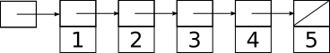  

The box on the far left is not a `struct elt`, but a `struct elt *`; in order to keep track of the list we need a pointer to the first element. As usual in C, we will have to do all the work of allocating these elements and assigning the right pointer values in the right places ourselves.

### 5.4.1 Stacks

The selling point of linked lists in comparison to arrays is that inserting or removing elements can be cheap: at the front of the list, inserting a new element just requires allocating another `struct` and hooking up a few pointers, while removing an element just requires moving the pointer to the first element to point to the second element instead, and then freeing the first element.

For example here’s what happens the linked list above looks like after we insert a new element at the front:

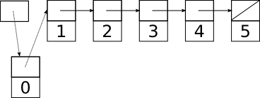  

To make this work, we need to change two pointers: the head pointer and the `next` pointer in the new element holding 0. These operations aren’t affected by the size of the rest of the list and so take _O_(1) time.

Removal is the reverse of installation: We patch out the first element by shifting the head pointer to the second element, then deallocate it with `free`. (We do have to be careful to get any data we need out of it before calling free). This is also an _O_(1) operation.

The fact that we can add and remove elements at the start of linked lists for cheap makes them particularly useful for implementing a **stack**, an abstract data type that supports operations **push** (insert a new element on the top of the stack) and **pop** (remove and return the element at the top of the stack. Here is an example of a simple linked-list implementation of a stack, together with some test code:

    #include <stdio.h>
    #include <stdlib.h>
    #include <assert.h>
    
    struct elt {
        struct elt *next;
        int value;
    };
    
    /* 
     * We could make a struct for this,
     * but it would have only one component,
     * so this is quicker.
     */
    typedef struct elt *Stack;
    
    #define STACK_EMPTY (0)
    
    /* push a new value onto top of stack */
    void
    stackPush(Stack *s, int value)
    {
        struct elt *e;
    
        e = malloc(sizeof(struct elt));
        assert(e);
    
        e->value = value;
        e->next = *s;
        *s = e;
    }
    
    int
    stackEmpty(const Stack *s)
    {
        return (*s == 0);
    }
    
    int
    stackPop(Stack *s)
    {
        int ret;
        struct elt *e;
    
        assert(!stackEmpty(s));
    
        ret = (*s)->value;
    
        /* patch out first element */
        e = *s;
        *s = e->next;
    
        free(e);
    
        return ret;
    }
    
    /* print contents of stack on a single line */
    void
    stackPrint(const Stack *s)
    {
        struct elt *e;
    
        for(e = *s; e != 0; e = e->next) {
            printf("%d ", e->value);
        }
        
        putchar('\n');
    }
    
    int
    main(int argc, char **argv)
    {
        int i;
        Stack s;
    
        s = STACK_EMPTY;
    
        for(i = 0; i < 5; i++) {
            printf("push %d\n", i);
            stackPush(&s, i);
            stackPrint(&s);
        }
    
        while(!stackEmpty(&s)) {
            printf("pop gets %d\n", stackPop(&s));
            stackPrint(&s);
        }
    
        return 0;
    }

[examples/linkedLists/stack.c](examples/linkedLists/stack.c)

Unlike most of our abstract data types, we do not include a `struct` representing the linked list itself. This is because the only thing we need to keep track of a linked list is the head pointer, and it feels a little silly to have a `struct` with just one component. But we might choose to do this if we wanted to make the linked list implementation opaque or allow for including more information later.

    struct stack {
        struct elt *head;
    };

#### 5.4.1.1 Building a stack out of an array

When the elements of a stack are small, or when a maximum number of elements is known in advance, it often makes sense to build a stack from an array (with a variable storing the index of the top element) instead of a linked list. The reason is that pushes and pops only require updating the stack pointer instead of calling `malloc` or `free` to allocate space, and pre-allocating is almost always faster than allocating as needed. This is the strategy used to store the function call stack in almost all programs (the exception is in languages like Scheme, where the call stack is allocated on the heap because stack frames may outlive the function call that creates them).

### 5.4.2 Queues

Stacks are last-in-first-out (LIFO) data structures: when we pop, we get the last item we pushed. What if we want a first-in-first-out (FIFO) data structure? Such a data structure is called a **queue** and can also be implemented by a linked list. The difference is that if we want _O_(1) time for both the **enqueue** (push) and **dequeue** (pop) operations, we must keep around pointers to both ends of the linked list.

So now we get something that looks like this:

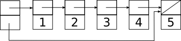  

Enqueuing a new element typically requires (a) allocating a new `struct` to hold it; (b) making the old tail `struct` point at the new `struct`; and (c) updating the `tail` pointer to also point to the new `struct`. There is a minor complication when the stack is empty; in this case instead of updating `tail->next` we must put a pointer to the new `struct` in `head`. Dequeuing an element involves updating the head pointer and freeing the removed `struct`, exactly like a stack pop.

Here is the queue above after enqueuing a new element 6. The updated pointers are indicated by dotted lines:

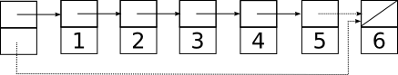  

Because we are only changing two pointers, each of which we can reach by following a constant number of pointers from the main `struct`, we can do this in _O_(1) time.

There is a slight complication when we enqueue the very first element, because we need to update the head pointer instead of the pointer in the previous tail (which doesn’t yet exist). This requires testing for an empty queue in the enqueue routine, which we’ll do in the sample code below.

Dequeuing is easier because it requires updating only one pointer:

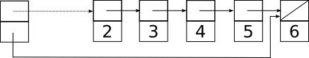  

If we adopt the convention that a null in `head` means an empty queue, and use this property to check if the queue is empty when enqueuing, we don’t even have to clear out `tail` when we dequeue the last element.

Here is a simple implementation of a queue holding `int`s, together with some test code showing how its behavior differs from a stack:

    #include <stdio.h>
    #include <stdlib.h>
    #include <assert.h>
    
    /* standard linked list element */
    struct elt {
        struct elt *next;
        int value;
    };
    
    struct queue {
        struct elt *head;  /* dequeue this next */
        struct elt *tail;  /* enqueue after this */
    };
    
    /* create a new empty queue */
    struct queue *
    queueCreate(void)
    {
        struct queue *q;
    
        q = malloc(sizeof(struct queue));
    
        q->head = q->tail = 0;
    
        return q;
    }
    
    /* add a new value to back of queue */
    void
    enq(struct queue *q, int value)
    {
        struct elt *e;
    
        e = malloc(sizeof(struct elt));
        assert(e);
    
        e->value = value;
    
        /* Because I will be the tail, nobody is behind me */
        e->next = 0;
    
        if(q->head == 0) {
            /* If the queue was empty, I become the head */
            q->head = e;
        } else {
            /* Otherwise I get in line after the old tail */
            q->tail->next = e;
        }
    
        /* I become the new tail */
        q->tail = e;
    }
    
    int
    queueEmpty(const struct queue *q)
    {
        return (q->head == 0);
    }
    
    /* remove and return value from front of queue */
    int
    deq(struct queue *q)
    {
        int ret;
        struct elt *e;
    
        assert(!queueEmpty(q));
    
        ret = q->head->value;
    
        /* patch out first element */
        e = q->head;
        q->head = e->next;
    
        free(e);
    
        return ret;
    }
    
    /* print contents of queue on a single line, head first */
    void
    queuePrint(struct queue *q)
    {
        struct elt *e;
    
        for(e = q->head; e != 0; e = e->next) {
            printf("%d ", e->value);
        }
        
        putchar('\n');
    }
    
    /* free a queue and all of its elements */
    void
    queueDestroy(struct queue *q)
    {
        while(!queueEmpty(q)) {
            deq(q);
        }
    
        free(q);
    }
    
    int
    main(int argc, char **argv)
    {
        int i;
        struct queue *q;
    
        q = queueCreate();
    
        for(i = 0; i < 5; i++) {
            printf("enq %d\n", i);
            enq(q, i);
            queuePrint(q);
        }
    
        while(!queueEmpty(q)) {
            printf("deq gets %d\n", deq(q));
            queuePrint(q);
        }
    
        queueDestroy(q);
    
        return 0;
    }

[examples/linkedLists/queue.c](examples/linkedLists/queue.c)

It is a bit trickier to build a queue out of an array than to build a stack. The difference is that while a stack pointer can move up and down, leaving the base of the stack in the same place, a naive implementation of a queue would have head and tail pointers both marching ever onward across the array leaving nothing but empty cells in their wake. While it is possible to have the pointers wrap around to the beginning of the array when they hit the end, if the queue size is unbounded the tail pointer will eventually catch up to the head pointer. At this point (as in a stack that overflows), it is necessary to allocate more space and copy the old elements over. See the section on [ring buffers](#ringBuffers) for an example of how to do this.

### 5.4.3 Looping over a linked list

Looping over a linked list is not hard if you have access to the `next` pointers. (For a more abstract way to do this see [iterators](#iterators).)

Let’s imagine somebody gave us a pointer to the first `struct stack` in a list; call this pointer `first`. Then we can write a loop like this that prints the contents of the stack:

    void
    stackPrint(struct stack *first)
    {
        struct stack *elt;
    
        for(elt = first; elt != 0; elt = elt->next) {
            puts(elt->book);
        }
    }

There’s not a whole lot to notice here except that `for` is perfectly happy to iterate over something that isn’t a range of integers. The running time is linear in the length of the list (_O_(_n_)).

### 5.4.4 Looping over a linked list backwards

What if we want to loop over a linked list backwards? The `next` pointers all go the wrong way, so we have to save a trail of breadcrumbs to get back. The safest way to do this is to reverse the original list into an auxiliary list:

    void
    stackPrintReversed(struct stack *first)
    {
        struct stack *elt;
        Stack s2;                   /* uses imperative implementation */
    
        s2 = stackCreate();
    
        for(elt = first; elt != 0; elt = elt->next) {
            s2 = stackPush(s2, elt->book);
        }
    
        stackPrint(s2);
        stackDestroy(s2);
    }

Pushing all the elements from the first list onto `s2` puts the first element on the bottom, so when we print `s2` out, it’s in the reverse order of the original stack.

We can also write a recursive function that prints the elements backwards. This function effectively uses the function call stack in place of the extra stack `s2` above.

    void
    stackPrintReversedRecursive(struct stack *first)
    {
        if(first != 0) {
            /* print the rest of the stack */
            stackPrintReversedRecursive(first->next);
    
            /* then print the first element */
            puts(first->book);
        }
    }

The code in `stackPrintReversedRecursive` is shorter than the code in `stackPrintReversed`, and it is likely to be faster since it doesn’t require allocating a second stack and copying all the elements. But it will only work for small stacks: because the function call stack is really a fixed-size array, if the input to `stackPrintReversedRecursive` is too big the recursion will go too deep cause a _stack overflow_.

If we want to do this sort of thing a lot, we should build a **doubly-linked list**, with a pointer in each element both to the next element and the previous element instead of a singly-linked list (see below for more).

### 5.4.5 Deques and doubly-linked lists

Suppose we want a data structure that represents a line of elements where we can push or pop elements at either end. Such a data structure is known as a **deque** (pronounced like “deck”), and can be implemented with all operations taking _O_(1) time by a **doubly-linked list**, where each element has a pointer to both its successor and its predecessor.

An ordinary singly-linked list is not good enough. The reason is that even if we keep a pointer to both ends as in a queue, when it comes time to pop an element off the tail, we have no pointer to its predecessor ready to hand; the best we can do is scan from the head until we get to an element whose successor is the tail, which takes _O_(_n_) time.

So instead we need a doubly-linked list, where each node points to both its successor and predecessor. The most straightforward way to build this is to make it circular, and use an extra node whose value isn’t used to represent the head of the list. The resulting data structure might look something like this:

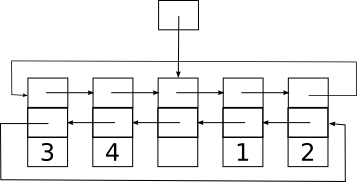  

Below is an implementation of this structure. We have separated the interface in `deque.h` from the implementation in `deque.c`. This will allow us to change the implementation if we decide we don’t like it, without affecting any other code in the system.

A nice feature of this data structure is that we don’t need to use null pointers to mark the ends of the deque. Instead, each end is marked by a pointer to the extra head element. For an empty deque, this just means that the head points to itself. The cost of this is that to detect an empty deque we have to test for equality with the head (which might be slightly more expensive that just testing for null) and the head may contain some wasted space for its missing value if we allocate it like any other element.[20](#fn20)

To keep things symmetric, we implement the pointers as an array, indexed by the directions `DEQUE_FRONT` and `DEQUE_BACK` (defined in `deque.h`). This means we can use the same code to push or pop on either end of the deque.

    typedef struct deque Deque;
    
    #define DEQUE_FRONT (0)
    #define DEQUE_BACK (1)
    
    #define DEQUE_EMPTY (-1)  /* returned by dequePop if deque is empty */
    
    /* return a new empty deque */
    Deque *dequeCreate(void);
    
    /* push new value onto direction side of deque d */
    void dequePush(Deque *d, int direction, int value);
    
    /* pop and return first value on direction side of deque d */
    /* returns DEQUE_EMPTY if deque is empty */
    int dequePop(Deque *d, int direction);
    
    /* return 1 if deque contains no elements, 0 otherwise */
    int dequeIsEmpty(const Deque *d);
    
    /* free space used by a deque */
    void dequeDestroy(Deque *d);

[examples/linkedLists/deque/deque.h](examples/linkedLists/deque/deque.h)

    #include <stdlib.h>
    #include <assert.h>
    #include <stddef.h>  /* for offsetof */
    
    #include "deque.h"
    
    #define NUM_DIRECTIONS (2)
    
    struct deque {
        struct deque *next[NUM_DIRECTIONS];
        int value;
    };
    
    Deque *
    dequeCreate(void)
    {
        Deque *d;
    
        /*
         * We don't allocate the full space for this object
         * because we don't use the value field in the dummy head.
         *
         * Saving these 4 bytes doesn't make a lot of sense here,
         * but it might be more significant if the value field was larger.
         */
        d = malloc(offsetof(struct deque, value));
    
        /* test is to deal with malloc failure */
        if(d) {
            d->next[DEQUE_FRONT] = d->next[DEQUE_BACK] = d;
        } 
    
        return d;
    }
    
    void
    dequePush(Deque *d, int direction, int value)
    {
        struct deque *e;  /* new element */
    
        assert(direction == DEQUE_FRONT || direction == DEQUE_BACK);
    
        e = malloc(sizeof(struct deque));
        assert(e);
        
        e->next[direction] = d->next[direction];
        e->next[!direction] = d;
        e->value = value;
    
        d->next[direction] = e;
        e->next[direction]->next[!direction] = e;  /* preserves invariant */
    }
    
    int
    dequePop(Deque *d, int direction)
    {
        struct deque *e;
        int retval;
    
        assert(direction == DEQUE_FRONT || direction == DEQUE_BACK);
    
        e = d->next[direction];
    
        if(e == d) {
            return DEQUE_EMPTY;
        }
    
        /* else remove it */
        d->next[direction] = e->next[direction];
        e->next[direction]->next[!direction] = d;
    
        retval = e->value;
    
        free(e);
    
        return retval;
    }
    
    int
    dequeIsEmpty(const Deque *d)
    {
        return d->next[DEQUE_FRONT] == d;
    }
    
    void
    dequeDestroy(Deque *d)
    {
        while(!dequeIsEmpty(d)) {
            dequePop(d, DEQUE_FRONT);
        }
    
        free(d);
    }

[examples/linkedLists/deque/deque.c](examples/linkedLists/deque/deque.c)

And here is some test code:

[testDeque.c](examples/linkedLists/deque/testDeque.c).

#### 5.4.5.1 Alternate implementation using a ring buffer

The `deque.h` file carefully avoids revealing any details of the implementation of a deque. This allows us to replace the implementation with a different implementation that is more efficient in its use of both time and space, at the cost of additional code complexity. Below is a replacement for `deque.c` that uses a **ring buffer** in place of the circular linked list.

The idea of a ring buffer is to store the deque elements in an array, with a pointer to the first element and a length field that says how many elements are in the deque. The information needed to manage the array (which is allocated using `malloc`) is stored in a `struct`.

The sequence of elements wraps around the endpoints of the array, leaving a gap somewhere in the middle. Deque pushes extend the sequence into this gap from one side or another, while pops increase the size of the gap. If the user wants to do a push and the array is full, we build a new, larger deque, move all the elements there, and then transplant all the bits of the new `struct deque` into the old one. This transplant trick avoids changing the address of the `struct deque` that the user needs to access it.

    #include <stdlib.h>
    #include <assert.h>
    
    #include "deque.h"
    
    /*
     * Alternative implementation of a deque using a ring buffer.
     *
     * Conceptually, this is an array whose indices wrap around at
     * the endpoints. 
     *
     * The region in use is specified by a base index pointing
     * to the first element, and a length count giving the number
     * of elements.  A size field specifies the number of slots
     * in the block.
     *
     * Picture:
     *
     *  ---------------------------------------------------
     *  |7|8|9| | | | | | | | | | | | | | | | |1|2|3|4|5|6|
     *  ---------------------------------------------------
     *       ^                                 ^
     *       |                                 |
     *       base + length - 1                 base
     *
     */
    
    struct deque {
        size_t base;     /* location of front element */
        size_t length;   /* length of region in use */
        size_t size;     /* total number of positions in contents */
        int *contents; 
    };
    
    #define INITIAL_SIZE (8)
    
    /* create a new deque of the given size */
    static Deque *
    dequeCreateInternal(size_t size)
    {
        struct deque *d;
    
        d = malloc(sizeof(struct deque));
        assert(d);
    
        d->base = 0;
        d->length = 0;
        d->size = size;
    
        d->contents = malloc(sizeof(int) * d->size);
        assert(d->contents);
    
        return d;
    }
    
    /* return a new empty deque */
    Deque *
    dequeCreate(void)
    {
        return dequeCreateInternal(INITIAL_SIZE);
    }
    
    void 
    dequePush(Deque *d, int direction, int value)
    {
        struct deque *d2;     /* replacement deque if we grow */
        int *oldContents;     /* old contents of d */
        
        /*
         * First make sure we have space.
         */
    
        if(d->length == d->size) {
            /* nope */
            d2 = dequeCreateInternal(d->size * 2);
    
            /* evacuate d */
            while(!dequeIsEmpty(d)) {
                dequePush(d2, DEQUE_BACK, dequePop(d, DEQUE_FRONT));
            }
            
            /* do a transplant from d2 to d */
            /* but save old contents so we can free them */
            oldContents = d->contents;
            *d = *d2;    /* this is equivalent to copying the components one by one */
    
            /* these are the pieces we don't need any more */
            free(oldContents);
            free(d2);
        }
    
        /*
         * This requires completely different code 
         * depending on the direction, which is 
         * annoying.
         */
        if(direction == DEQUE_FRONT) {
            /* d->base is unsigned, so we have to check for zero first */
            if(d->base == 0) {
                d->base = d->size - 1;
            } else {
                d->base--;
            }
    
            d->length++;
    
            d->contents[d->base] = value;
        } else {
            d->contents[(d->base + d->length++) % d->size] = value;
        }
    }
    
    /* pop and return first value on direction side of deque d */
    /* returns DEQUE_EMPTY if deque is empty */
    int
    dequePop(Deque *d, int direction)
    {
        int retval;
        
        if(dequeIsEmpty(d)) {
            return DEQUE_EMPTY;
        }
    
        /* else */
        if(direction == DEQUE_FRONT) {
            /* base goes up by one, length goes down by one */
            retval = d->contents[d->base];
    
            d->base = (d->base+1) % d->size;
            d->length--;
    
            return retval;
        } else {
            /* length goes down by one */
            return d->contents[(d->base + --d->length) % d->size];
        }
    }
    
    int 
    dequeIsEmpty(const Deque *d)
    {
        return d->length == 0;
    }
    
    void 
    dequeDestroy(Deque *d)
    {
        free(d->contents);
        free(d);
    }

[examples/linkedLists/deque/ringBuffer.c](examples/linkedLists/deque/ringBuffer.c)

Here is a `Makefile` that compiles `testDeque.c` against both the linked list and the ring buffer implementations. You can do `make time` to race them against each other.

    CC=gcc
    CFLAGS=-Wall -O3 -g3
    
    # how many iterations for test
    ITERATIONS=10000000
    VALGRIND_ITERATIONS=100
    
    all: testDeque testRingBuffer
    
    test: all
    	./testDeque $(ITERATIONS)
    	valgrind -q --leak-check=yes ./testDeque $(VALGRIND_ITERATIONS)
    	./testRingBuffer $(ITERATIONS)
    	valgrind -q --leak-check=yes ./testRingBuffer $(VALGRIND_ITERATIONS)
    
    time: all
    	time ./testDeque $(ITERATIONS)
    	time ./testRingBuffer $(ITERATIONS)
    
    testDeque: testDeque.o deque.o
    	$(CC) $(CFLAGS) -o $@ $^
    
    testRingBuffer: testDeque.o ringBuffer.o
    	$(CC) $(CFLAGS) -o $@ $^
    
    
    clean:
    	$(RM) testDeque testRingBuffer *.o

[examples/linkedLists/deque/Makefile](examples/linkedLists/deque/Makefile)

### 5.4.6 Circular linked lists

For some applications, there is no obvious starting or ending point to a list, and a circular list (where the last element points back to the first) may be appropriate. Circular doubly-linked lists can also be used to build deques; a single pointer into the list tracks the head of the deque, with some convention adopted for whether the head is an actual element of the list (at the front, say, with its left neighbor at the back) or a extra element that is not considered to be part of the list.

The selling point of circular doubly-linked lists as a concrete data structure is that insertions and deletions can be done anywhere in the list with only local information. For example, here are some routines for manipulating a doubly-linked list directly. We’ll make our lives easy and assume (for the moment) that the list has no actual contents to keep track of.

    #include <stdlib.h>
    
    /* directions for doubly-linked list next pointers */
    #define RIGHT (0)
    #define LEFT (1)
    
    struct elt {
        struct elt *next[2];
    };
    
    typedef struct elt *Elt;
    
    /* create a new circular doubly-linked list with 1 element */
    /* returns 0 on allocation error */
    Elt
    listCreate(void)
    {
        Elt e;
    
        e = malloc(sizeof(*e));
        if(e) {
            e->next[LEFT] = e->next[RIGHT] = e;
        }
    
        return e;
    }
    
    /* remove an element from a list */
    /* Make sure you keep a pointer to some other element! */
    /* does not free the removed element */
    void
    listRemove(Elt e)
    {
        /* splice e out */
        e->next[RIGHT]->next[LEFT] = e->next[LEFT];
        e->next[LEFT]->next[RIGHT] = e->next[RIGHT];
    }
        
    /* insert an element e into list in direction dir from head */
    void
    listInsert(Elt head, int dir, Elt e)
    {
        /* fill in e's new neighbors */
        e->next[dir] = head->next[dir];
        e->next[!dir] = head;
    
        /* make neigbhors point back at e */
        e->next[dir]->next[!dir] = e;
        e->next[!dir]->next[dir] = e;
    }
    
    /* split a list, removing all elements between e1 and e2 */
    /* e1 is the leftmost node of the removed subsequence, e2 rightmost */
    /* the removed elements are formed into their own linked list */
    /* comment: listRemove could be implemented as listSplit(e,e) */
    void
    listSplit(Elt e1, Elt e2)
    {
        /* splice out the new list */
        e2->next[RIGHT]->next[LEFT] = e1->next[LEFT];
        e1->next[LEFT]->next[RIGHT] = e2->next[RIGHT];
    
        /* fix up the ends */
        e2->next[RIGHT] = e1;
        e1->next[LEFT] = e2;
    }
    
    /* splice a list starting at e2 after e1 */
    /* e2 becomes e1's right neighbor */
    /* e2's left neighbor becomes left neighbor of e1's old right neighbor */
    void
    listSplice(Elt e1, Elt e2)
    {
        /* fix up tail end */
        e2->next[LEFT]->next[RIGHT] = e1->next[RIGHT];
        e1->next[RIGHT]->next[LEFT] = e2->next[LEFT];
    
        /* fix up e1 and e2 */
        e1->next[RIGHT] = e2;
        e2->next[LEFT] = e1;
    }
    
    /* free all elements of the list containing e */
    void
    listDestroy(Elt e)
    {
        Elt target;
        Elt next;
    
        /* we'll free elements until we get back to e, then free e */
        /* note use of pointer address comparison to detect end of loop */
        for(target = e->next[RIGHT]; target != e; target = next) {
            next = target->next[RIGHT];
            free(target);
        }
    
        free(e);
    }

[examples/linkedLists/circular.c](examples/linkedLists/circular.c)

The above code might or might not actually work. What if it doesn’t? It may make sense to include some consistency testing code that we can run to see if our pointers are all going to the right place:

    /* assert many things about correctness of the list */
    /* Amazingly, this is guaranteed to abort or return no matter
       how badly screwed up the list is. */
    void
    listConsistencyTest(Elt e)
    {
        Elt check;
    
        assert(e != 0);
    
        check = e;
    
        do {
    
            /* are our pointers consistent with our neighbors? */
            assert(check->next[RIGHT]->next[LEFT] == check);
            assert(check->next[LEFT]->next[RIGHT] == check);
    
            /* on to the next */
            check = check->next[RIGHT];
    
        } while(check != e);
    }

What if we want to store something in this list? The simplest approach is to extend the definition of `struct elt`:

    struct elt {
        struct elt *next[2];
        char *name;
        int socialSecurityNumber;
        int gullibility;
    };

But then we can only use the code for one particular type of data. An alternative approach is to define a new `Elt`\-plus struct:

    struct fancyElt {
        struct elt *next[2];
        char *name;
        int socialSecurityNumber;
        int gullibility;
    };

and then use pointer casts to convert the fancy structs into `Elt`s:

        struct fancyElt *e;
    
        e = malloc(sizeof(*e));
    
        /* fill in fields on e */
    
        listInsert(someList, (Elt) e);

The trick here is that as long as the initial part of the `struct fancyElt` looks like a `struct elt`, any code that expects a `struct elt` will happily work with it and ignore the fields that happen to be sitting later in memory. (This is how [C++](#cplusplus) inheritance works.)

The downside is that if something needs to be done with the other fields (e.g freeing `e->name` if `e` is freed), then the `Elt` functions won’t know to do this. So if you use this trick you should be careful.

A similar technique using `void *` pointers can be used to implement [generic containers](#genericContainers).

### 5.4.7 What linked lists are and are not good for

Linked lists are good for any task that involves inserting or deleting elements next to an element you already have a pointer to; such operations can usually be done in _O_(1) time. They generally beat arrays (even resizeable arrays) if you need to insert or delete in the middle of a list, since an array has to copy any elements above the insertion point to make room; if inserts or deletes always happen at the end, an array may be better.

Linked lists are not good for any operation that requires random access, since reaching an arbitrary element of a linked list takes as much as _O_(_n_) time. For such applications, arrays are better if you don’t need to insert in the middle; if you do, you should use some sort of [tree](#trees).

Linked lists are often the primary data structure in **functional programming languages**. The reason of this is that the functional programming style tries to avoid modifying data, which makes arrays expensive since changing one value might mean creating a new copy of the entire array. With linked lists, it may be possible for some operations to create a new list that shares most of its structure with the old list; an example would be pushing or popping the top of a stack. This kind of sharing is awkward in languages like C because it means that a struct implementing part of a list might have multiple pointers to it, making it tricky to detect when it is safe to free the struct.

### 5.4.8 Further reading

A description of many different kinds of linked lists with pictures can be found in [the WikiPedia article on the subject](http://en.wikipedia.org/wiki/Linked_list).

Animated versions can be found at [http://www.cs.usfca.edu/~galles/visualization/Algorithms.html](http://www.cs.usfca.edu/~galles/visualization/Algorithms.html).

5.5 Abstract data types
-----------------------

One of the hard parts about computer programming is that, in general, _programs are bigger than brains_. Unless you have an unusally capacious brain, it is unlikely that you will be able to understand even a modestly large program in its entirety. So in order to be able to write and debug large programs, it is important to be able to break it up into pieces, where each piece can be treated as a tool whose use and description is simpler (and therefor fits in your brain better) than its actual code. Then you can forget about what is happening inside that piece, and just concentrate on how to use it from the outside.

This process of wrapping functionality up in a box and forgetting about its internals is called **abstraction**, and it is the single most important concept in computer science. In these notes we will describe a particular kind of abstraction, the construction of **abstract data types** or ADTs. Abstract data types are data types whose implementation is not visible to their user; from the outside, all the user knows about an ADT is what operations can be performed on it and what those operations are supposed to do.

ADTs have an outside and an inside. The outside is called the **interface**; it consists of the minimal set of type and function declarations needed to use the ADT. The inside is called the **implementation**; it consists of type and function definitions, and sometime auxiliary data or helper functions, that are _not_ visible to users of the ADT. This separation between interface and implementation is called the **abstraction barrier**, and allows the implementation to change without affecting the rest of the program.

What joins the implementation to the interface is an **abstraction function**. This is a function (in the mathematical sense) that takes any state of the implementation and trims off any irrelevant details to leave behind an idealized pictures of what the data type is doing. For example, a linked list implementation translates to a sequence abstract data type by forgetting about the pointers used to hook up the elements and just keeping the sequence of elements themselves. To exclude bad states of the implementation (for example, a singly-linked list that loops back on itself instead of having a terminating null pointer), we may have a **representation invariant**, which is just some property of the implementation that is always true. Representation invariants are also useful for detecting when we’ve bungled our implementation, and a good debugging strategy for misbehaving abstract data type implementations is often to look for the first point at which they violated some property that we thought was an invariant.

Some programming language include very strong mechanisms for enforcing abstraction barriers. C relies somewhat more on politeness, and as a programmer you violate an abstraction barrier (by using details of an implementation that are supposed to be hidden) at your peril. In C, the interface will typically consist of function and type declarations contained in a header file, with implementation made up of the corresponding function definitions (and possibly a few extra `static` functions) in one or more `.c` files. The [opaque struct](#opaqueStructs) technique can be used to hide implementation details of the type.

### 5.5.1 Boxed vs unboxed types

Object-oriented languages like Java make a distinction between **boxed types**, which are allocated on the heap and accessed through pointers, and **unboxed types** or **primitive types**, which are small enough to be passed around directly.

In C terms, a boxed type would typically be implemented as a `struct` allocated using `malloc`, often by a **constructor** function that takes responsibility for doing the allocation, initializing the underlying `struct` as appropriate, and returning a pointer to the new `struct`. This gives an **instance** of the type that lives until we decide to free it. A separate **destructor** function will need to be provided to free any space used by the `struct`; this is especially important if the data structure requires more than one call to `malloc`, although in simple cases it may be enough for the destructor to just be a simple wrapper around `free`. When passing an instance of a boxed type to or from a function, we copy a pointer to the heap-allocated structure. This structure is not itself copied, which is more efficient than copying if the structure is large, and which allows the function to modify the structure if needed without having to explicitly return an updated version. Typically the functions only expected to modify the underlying structure will be the **mutators** provided by the abstract data type interface, and other functions that wish to operate on the structure will use these mutators to apply their changes. Similarly, the interface will often provide **accessor** functions to allow other functions the ability to obtain information about an instance without breaking the abstraction barrier that hides the actual implementation.

An unboxed type doesn’t use the heap, and an instance of an unboxed type is typically not a pointer but an actual C type that implements an instance directly. The built-in types like `int` and `double` are examples of unboxed types, but we can also construct unboxed types on top of `struct`s. This works best when the `struct`s are small enough that copying them around is a cheap operation and where the intended interpretation of an instance is as a constant value. An example might be an [RGBA](https://en.wikipedia.org/wiki/RGBA_color_model) color value packed into a 32-bit struct:

    struct rgba {
        uint8_t red;
        uint8_t green;
        uint8_t blue;
        uint8_t alpha;
    };

This has the same size as an `int` on a typical machine, so allocating in on the heap and passing around a pointer to it would add a lot of unnecessary space overhead. Depending on how much abstraction we want to enforce, we might still expect the user to access values of this type only through functions provided by a library. For example, we might expect that the user only creates new RGBA colors through functions we provide, as in:

    struct rgba c;
    
    c = RBGAfromValues(122, 11, 13, 255);  // good
    c = RGBAfromName("orange");            // good
    
    c.red = 12;                            // please don't do this

Unfortunately, we can’t apply the [opaque struct](#opaqueStructs) trick to unboxed `struct`s, so there is no mechanism in the C language to exclude the bad case above. This makes unboxed types preferable if we want a (somewhat) enforceable abstraction barrier.

Even without the issue of abstraction barriers, most of the data structures we will build will be large enough and complex enough that it makes sense to implement them as boxed types just to avoid copying costs. But there may be occasions where the overhead of a boxed type is too much, so using an unboxed type makes more sense.

#### 5.5.1.1 A danger with unboxed types

It is technically possible to have an unboxed type that includes pointers to instances of boxed types. This is almost always a mistake, as it may lead to multiple instances of the unboxed type all pointing to a single instance of the boxed type. An example would be if we defined a sized byte string as follows:

        struct bytes {
            size_t size; // size of data
            char *data;  // malloc'd block
        };
    
        // bad approach
        struct bytes b;
        b = bytesFromString("hi there");  // returns struct bytes
        struct bytes b2;
        b2 = b;
    
        // add some more text to the end
        bytesAppendString(&b2, ", world!");

This is legal C, but now we start with at least two `struct bytes` instances floating around that point to the same data block. So we will have to be vary careful to decide which one to call a destructor on, as calling a destructor on one of the instances will invalidate all the others. The issue is further confused if we have mutators (like `bytesAppendString`) that can replace the `data` field or change the `size` field in an instance: what happens to `b` when we call `bytesAppendString` on `b2`?

A safer approach is to make our `bytes` type boxed:

        struct bytes {
            size_t size; // size of data
            char *data;  // malloc'd block
        };
    
        // better approach
        struct bytes *b;
        b = bytesFromString("hi there");  // returns struct bytes *
        struct bytes *b2;
        b2 = b;
    
        // add some more text to the end
        bytesAppendString(b2, ", world!");

Now there is just a single instance of `struct bytes` that we happen to have two pointers to. We will still need to be careful about invalidating one of these pointers when we call a destructor on the other, but calling `bytesAppendString` will have the expected effect on the single underlying object.

### 5.5.2 A sequence type

Too much abstraction at once can be hard to take, so let’s look at a concrete example of an abstract data type. This ADT will represent an infinite sequence of `int`s. Each instance of the `Sequence` type supports a single operation `seq_next` that returns the next `int` in the sequence. We will also need to provide one or more constructor functions to generate new `Sequence`s, and a destructorfunction to tear them down.

Here is an example of a typical use of a `Sequence`:

    void
    seq_print(Sequence s, int limit)
    {
        int i;
    
        for(i = seq_next(s); i < limit; i = seq_next(s)) {
            printf("%d\n", i);
        }
    }

Note that `seq_print` doesn’t need to know anything at all about what a `Sequence` is or how `seq_next` works in order to print out all the values in the sequence until it hits one greater than or equal to limit. This is a good thing— it means that we can use with any implementation of `Sequence` we like, and we don’t have to change it if `Sequence` or `seq_next` changes.

#### 5.5.2.1 Interface

In C, the interface of an abstract data type will usually be declared in a header file, which is included both in the file that implements the ADT (so that the compiler can check that the declarations match up with the actual definitions in the implementation. Here’s a header file for sequences:

    /* opaque struct: hides actual components of struct sequence,
     * which are defined in sequence.c */
    typedef struct sequence *Sequence;
    
    /* constructors */
    /* all our constructors return a null pointer on allocation failure */
    
    /* returns a Sequence representing init, init+1, init+2, ... */
    Sequence seq_create(int init);
    
    /* returns a Sequence representing init, init+step, init+2*step, ... */
    Sequence seq_create_step(int init, int step);
    
    /* destructor */
    /* destroys a Sequence, recovering all interally-allocated data */
    void seq_destroy(Sequence);
    
    /* accessor */
    /* returns the first element in a sequence not previously returned */
    int seq_next(Sequence);

[examples/ADT/sequence/sequence.h](examples/ADT/sequence/sequence.h)

Here we have defined two different constructors for `Sequence`s, one of which gives slightly more control over the sequence than the other. If we were willing to put more work into the implementation, we could imagine building a very complicated `Sequence` type that supported a much wider variety of sequences (for example, sequences generated by functions or sequences read from files); but we’ll try to keep things simple for now. We can always add more functionality later, since the users won’t notice if the `Sequence` type changes internally.

#### 5.5.2.2 Implementation

The implementation of an ADT in C is typically contained in one (or sometimes more than one) `.c` file. This file can be compiled and linked into any program that needs to use the ADT. Here is our implementation of `Sequence`:

    #include <stdlib.h>
    
    #include "sequence.h"
    
    struct sequence {
        int next;   /* next value to return */
        int step;   /* how much to increment next by */
    };
    
    Sequence
    seq_create(int init)
    {
        return seq_create_step(init, 1);
    }
    
    Sequence
    seq_create_step(int init, int step)
    {
        Sequence s;
    
        s = malloc(sizeof(*s));
        if(s == 0) return 0;
        s->next = init;
        s->step = step;
        return s;
    }
    
    void
    seq_destroy(Sequence s)
    {
        free(s);
    }
    
    int
    seq_next(Sequence s)
    {
        int ret;            /* saves the old value before we increment it */
    
        ret = s->next;
        s->next += s->step;
    
        return ret;
    }

[examples/ADT/sequence/sequence.c](examples/ADT/sequence/sequence.c)

Things to note here: the definition of `struct sequence` appears only in this file; this means that only the functions defined here can (easily) access the `next` and `step` components. This protects `Sequence`s to a limited extent from outside interference, and defends against users who might try to “violate the abstraction boundary” by examining the components of a `Sequence` directly. It also means that if we change the components or meaning of the components in `struct sequence`, we only have to fix the functions defined in `sequence.c`.

#### 5.5.2.3 Compiling and linking

Now that we have `sequence.h` and `sequence.c`, how do we use them? Let’s suppose we have a simple main program:

    #include <stdio.h>
    
    #include "sequence.h"
    
    
    void
    seq_print(Sequence s, int limit)
    {
        int i;
    
        for(i = seq_next(s); i < limit; i = seq_next(s)) {
            printf("%d\n", i);
        }
    }
    
    
    int
    main(int argc, char **argv)
    {
        Sequence s;
        Sequence s2;
    
        puts("Stepping by 1:");
    
        s = seq_create(0);
        seq_print(s, 5);
        seq_destroy(s);
    
        puts("Now stepping by 3:");
    
        s2 = seq_create_step(1, 3);
        seq_print(s2, 20);
        seq_destroy(s2);
    
        return 0;
    }

[examples/ADT/sequence/main.c](examples/ADT/sequence/main.c)

We can compile `main.c` and `sequence.c` together into a single binary with the command `gcc main.c sequence.c`. Or we can build a `Makefile` which will compile the two files separately and then link them. Using `make` may be more efficient, especially for large programs consisting of many components, since if we make any changes `make` will only recompile those files we have changed. So here is our `Makefile`:

    CC=c99
    CFLAGS=-g3 -Wall
    
    all: seqprinter
    
    seqprinter: main.o sequence.o
    	$(CC) $(CFLAGS) -o $@ $^
    
    test: seqprinter
    	./seqprinter
    
    # these rules say to rebuild main.o and sequence.o if sequence.h changes
    main.o: main.c sequence.h
    sequence.o: sequence.c sequence.h
    
    clean:
    	$(RM) -f seqprinter *.o

[examples/ADT/sequence/Makefile](examples/ADT/sequence/Makefile)

And now running `make test` produces this output. Notice how the built-in `make` variables `$@` and `$^` expand out to the left-hand side and right-hand side of the dependency line for building `seqprinter`.

    $ make test
    gcc -g3 -Wall   -c -o main.o main.c
    gcc -g3 -Wall   -c -o sequence.o sequence.c
    gcc -g3 -Wall -o seqprinter main.o sequence.o
    ./seqprinter
    Stepping by 1:
    0
    1
    2
    3
    4
    Now stepping by 3:
    1
    4
    7
    10
    13
    16
    19

### 5.5.3 Designing abstract data types

Now we’ve seen how to implement an abstract data type. How do we choose when to use when, and what operations to give it? Let’s try answering the second question first.

#### 5.5.3.1 Parnas’s Principle

Parnas’s Principle is a statement of the fundamental idea of _information hiding_, which says that abstraction boundaries should be as narrow as possible:

*   The developer of a software component must provide the intended user with all the information needed to make effective use of the services provided by the component, and should provide no other information.
*   The developer of a software component must be provided with all the information necessary to carry out the given responsibilities assigned to the component, and should be provided with no other information.

(David Parnas, “On the Criteria to Be Used in Decomposing Systems into Modules,” _Communications of the ACM_, 15(12): 1059–1062, 1972.)

For ADTs, this means we should provide as few functions for accessing and modifying the ADT as we can get away with. The `Sequence` type we defined early has a particularly narrow interface; the developer of `Sequence` (whoever is writing `sequence.c`) needs to know nothing about what its user wants except for the arguments passed in to `seq_create` or `seq_create_step`, and the user only needs to be able to call `seq_next`. More complicated ADTs might provide larger sets of operations, but in general we know that an ADT provides a successful abstraction when the operations are all “natural” ones given our high-level description. If we find ourselves writing a lot of extra operations to let users tinker with the guts of our implementation, that may be a sign that either we aren’t taking our abstraction barrier seriously enough, or that we need to put the abstraction barrier in a different place.

#### 5.5.3.2 When to build an abstract data type

The short answer: Whenever you can.

A better answer: The best heuristic I know for deciding what ADTs to include in a program is to write down a description of how your program is going to work. For each noun or noun phrase in the description, either identify a built-in data type to implement it or design an abstract data type.

For example: a grade database maintains a list of students, and for each student it keeps a list of grades. So here we might want data types to represent:

*   A list of students,
*   A student,
*   A list of grades,
*   A grade.

If grades are simple, we might be able to make them just be `int`s (or maybe `double`s); to be on the safe side, we should probably create a `Grade` type with a `typedef`. The other types are likely to be more complicated. Each student might have in addition to their grades a long list of other attributes, such as a name, an email address, etc. By wrapping students up as abstract data types we can extend these attributes if we need to, or allow for very general implementations (say, by allowing a student to have an arbitrary list of keyword-attribute pairs). The two kinds of lists are likely to be examples of _sequence_ types; we’ll be seeing a lot of ways to implement these as the course progresses. If we want to perform the same kinds of operations on both lists, we might want to try to implement them as a single list data type, which then is specialized to hold either students or grades; this is not always easy to do in C, but we’ll see examples of how to do this, too.

Whether or not this set of four types is the set we will finally use, writing it down gives us a place to start writing our program. We can start writing interface files for each of the data types, and then evolve their implementations and the main program in parallel, adjusting the interfaces as we find that we have provided too little (or too much) data for each component to do what it must.

5.6 Hash tables
---------------

A **hash table** is a randomized data structure that supports the INSERT, DELETE, and FIND operations in expected _O_(1) time. The core idea behind hash tables is to use a _hash function_ that maps a large keyspace to a smaller domain of array indices, and then use constant-time array operations to store and retrieve the data.

### 5.6.1 Dictionary data types

A hash table is typically used to implement a **dictionary data type**, where keys are mapped to values, but unlike an array, the keys are not conveniently arranged as integers 0, 1, 2, …. Dictionary data types are a fundamental data structure often found in [scripting languages](http://en.wikipedia.org/wiki/Scripting_language "WikiPedia") like [AWK](http://en.wikipedia.org/wiki/AWK "WikiPedia"), [Perl](http://en.wikipedia.org/wiki/Perl "WikiPedia"), [Python](http://en.wikipedia.org/wiki/Python "WikiPedia"), [PHP](http://en.wikipedia.org/wiki/PHP "WikiPedia"), [Lua](http://en.wikipedia.org/wiki/Lua "WikiPedia"), or [Ruby](http://en.wikipedia.org/wiki/Ruby "WikiPedia"). For example, here is some Python code that demonstrates use of a dictionary accessed using an array-like syntax:

    title = {}   # empty dictionary
    title["Barack"] = "President"
    user = "Barack"
    print("Welcome " + title[user] + " " + user)

In C, we don’t have the convenience of reusing `[]` for dictionary lookups (we’d need [C++](#cplusplus) for that), but we can still get the same effect with more typing using functions. For example, using an abstract dictionary in C might look like this:

    Dict *title;
    const char *user;
    
    title = dictCreate();
    dictSet(title, "Barack", "President");
    user = "Barack";
    printf("Welcome %s %s\n", dictGet(title, user), user);

As with other abstract data types, the idea is that the user of the dictionary type doesn’t need to know how it is implemented. For example, we could implement the dictionary as an array of `struct`s that we search through, but that would be expensive: _O_(_n_) time to find a key in the worst case.

Closely related to a dictionary is a **set**, which has keys but no values. It’s usually pretty straightforward to turn an implementation of a dictionary into a set (leave out the values) or vice versa (add values to the end of keys but don’t use them in searching).

### 5.6.2 Basics of hashing

If our keys were conveniently named 0, 1, 2, …, _n_ − 1, we could simply use an array, and be able to find a record given a key in constant time. Unfortunately, naming conventions for most objects are not so convenient, and even enumerations like Social Security numbers are likely to span a larger range than we want to allocate. But we would like to get the constant-time performance of an array anyway.

The solution is to feed the keys through some hash function _H_, which maps them down to array indices. So in a database of people, to find “Smith, Wayland”, we would first compute _H_(“Smith, Wayland”) = 137 (say), and then look in position 137 in the array. Because we are always using the same function _H_, we will always be directed to the same position 137.

### 5.6.3 Resolving collisions

But what if _H_(“Smith, Wayland”) and _H_(“Hephaestos”) both equal 137? Now we have a **collision**, and we have to resolve it by finding some way to either (a) effectively store both records in a single array location, or (b) move one of the records to a new location that we can still find later. Let’s consider these two approaches separately.

#### 5.6.3.1 Chaining

We can’t really store more than one record in an array location, but we can fake it by making each array location be a pointer to a linked list. Every time we insert a new element in a particular location, we simply add it to this list.

Since the cost of scanning a linked list is linear in its size, this means that the worst-case cost of searching for a particular key will be linear in the number of keys in the table that hash to the same location. Under the assumption that the hash function is a random function (which does not mean that it returns random values every time you call it but instead means that we picked one of the many possible hash functions uniformly at random), on average we get _n_/_m_ elements in each list.  
So on average a failed search takes _O_(_n_/_m_) time.

This quantity _n_/_m_ is called the **load factor** of the hash table and is often written as _α_. If we want our hash table to be efficient, we will need to keep this load factor down. If we can guarantee that it’s a constant, then we get constant-time searches.

#### 5.6.3.2 Open addressing

With _open addressing_, we store only one element per location, and handle collisions by storing the extra elements in other unused locations in the array. To find these other locations, we fix some _probe sequence_ that tells us where to look if _A_\[_H_(_x_)\] contains an element that is not _x_. A typical probe sequence (called _linear probing_) is just _H_(_x_), _H_(_x_) + 1, _H_(_x_) + 2, …, wrapping around at the end of the array. The idea is that if we can’t put an element in a particular place, we just keep walking up through the array until we find an empty slot. As long as we follow the same probe sequence when looking for an element, we will be able to find the element again. If we are looking for an element and reach an empty location, then we know that the element is not present in the table.

For open addressing, we always have that _α_ = _n_/_m_ is less than or equal to 1, since we can’t store more elements in the table than we have locations. In fact, we must ensure that the load factor is strictly less than 1, or some searches will never terminate because they never reach an empty location. Assuming _α_ < 1 and that the hash function is uniform, it is possible to calculate the worst-case expected cost of a FIND operation, which as before will occur when we have an unsuccessful FIND. Though we won’t do this calculation here, the result is bounded by 1/(1 − _n_/_m_), which gets pretty bad if _n_/_m_ is very close to 1, but is a constant as long as _n_/_m_ is bounded by a constant (say 3/4, which makes the expected number of probes at most 4).

### 5.6.4 Choosing a hash function

There are many popular hash functions out there. The strongest, such as the [SHA-2 family](https://en.wikipedia.org/wiki/SHA-2), are believed to provide strong cryptographic guarantees such as making it very difficult to find an input that hashes to a particular output value. For building hash tables, these cryptographic hash function are usually excessive. For this we want simpler functions that faster and easier to code.

The essential idea of any hash function is that we want to produce as output a sequence of bits of some fixed length that (a) depends on the entire input, and (b) looks random. The first part means that changing any bit of the input should substantially change the output; the second means that the hash function should in some weak sense appear to be unpredictable. At the same time we would like the function to be something we can compute quickly. Below we will some simple hash functions that seem to work well in practice.

These are probably good enough for anything you will do in this class. If you find yourself writing high-performance code based on hashing, and are not just using some standard library that already does this, some examples of more sophisticated hash functions in widespread use are [SipHash](http://cr.yp.to/siphash/siphash-20120918.pdf), which uses a secret initialization to make it harder to attack, and [xxHash](https://github.com/Cyan4973/xxHash), which gets very high speed by computing several hashes in parallel on different parts of the input stream and combining the results, exploiting parallelism inside the CPU.

#### 5.6.4.1 Division method

We want our hash function to look as close as it can to a random function, but random functions are (provably) expensive to store. So in practice we do something simpler and hope for the best. If the keys are large integers, a typical approach is to just compute the remainder mod _m_. This can cause problems if _m_ is, say, a power of 2, since it may be that the low-order bits of all the keys are similar, which will produce lots of collisions. So in practice with this method _m_ is typically chosen to be a large prime.

What if we want to hash strings instead of integers? The trick is to treat the strings as integers. Given a string _a_1_a_2_a_3…_a__k_, we represent it as ∑_i__a__i__b__i_, where _b_ is a base chosen to be larger than the number of characters. We can then feed this resulting huge integer to our hash function. Typically we do not actually compute the huge integer directly, but instead compute its remainder mod _m_, as in this short C function:

    /* treat strings as base-256 integers */
    /* with digits in the range 1 to 255 */
    #define BASE (256)
    
    size_t
    hash(const char *s, size_t m)
    {
        size_t h;
        unsigned const char *us;
    
        /* cast s to unsigned const char * */
        /* this ensures that elements of s will be treated as having values >= 0 */
        us = (unsigned const char *) s;
    
        h = 0;
        while(*us != '\0') {
            h = (h * BASE + *us) % m;
            us++;
        } 
    
        return h;
    }

The division method works best when _m_ is a prime, as otherwise regularities in the keys can produce clustering in the hash values. (Consider, for example, what happens if _m_ is 256). But this can be awkward for computing hash functions quickly, because computing remainders is a relatively slow operation. However, even if we don’t use the division method explicitly, we often use it implicitly, if only to crunch a large hash value down to the size of our actual table.

#### 5.6.4.2 Multiplication method

To avoid the cost of division, most commonly-used hash functions replace the modulus _m_ with some power of two 2_k_, and replace the base with a prime, relying on the multiplier to break up patterns in the input. This yields the **multiplication method**, of which there are many versions. One of the best is the [Fowler/Noll/Vo hash function](https://tools.ietf.org/html/draft-eastlake-fnv-17.html), which maintains a fixed-size integer hash value, and for each byte of the input, XORs in the byte then scrambles the result by multiplying by a carefully chosen prime number. The resulting function is called FNV-1a, and it looks like this:

    #include <stdint.h>
    #include <stdlib.h>
    
    #define FNV_PRIME_64 ((1ULL<<40)+(1<<8)+0xb3)
    #define FNV_OFFSET_BASIS_64 (14695981039346656037ULL)
    
    uint64_t
    FNV1a(size_t n, const unsigned char *bytes)
    {
        uint64_t h = FNV_OFFSET_BASIS_64;
    
        for(size_t i = 0; i < n; i++) {
            h ^= bytes[i];
            h *= FNV_PRIME_64;
        }
    
        return h;
    }

[examples/hashTables/FNV1a.c](examples/hashTables/FNV1a.c)

There is a distinct FNV prime for different word sizes, each of which is chosen based on number-theoretic magic. The initial starting value or _offset basis_ is chosen arbitrarily but should not be zero.

FNV-1a has been observed to work well for common data sets. However, because it’s fixed, there is no guarantee that an adversary can’t supply a set of _n_ keys that all hash to the same location, giving very bad performance. We can avoid this problem by using a hash function that is generated independently of the keys, as described below.

#### 5.6.4.3 Universal hashing

Universal families of hash functions choose the hash function randomly, from some set of possible functions that is small enough that we can write our random choice down. By using a random choice, we make it hard for an adversary who doesn’t know our choice to force collisions. But by fixing the random choice, we can still use the same hash function for every lookup.

The property that makes a family of hash functions {_H__r_} universal is that, for any distinct keys _x_ and _y_, the probability that _r_ is chosen so that _H__r_(_x_) = _H__r_(_y_) is exactly 1/_m_.

Why is this important? Recall that for chaining, the expected number of collisions between an element _x_ and other elements was just the sum over all particular elements _y_ of the probability that _x_ collides with that particular element. If _H__r_ is drawn from a universal family, this probability is 1/_m_ for each _y_, and we get the same _n_/_m_ expected collisions as if _H__r_ were completely random.

Several universal families of hash functions are known. Here is a simple one, known as tabulation hashing or Zobrist hashing, that works when the size of the keyspace and the size of the output space are both powers of 2. Let the keyspace consist of _n_\-bit strings and let _m_ = 2_k_. Then the random index _r_ consists of _n__k_ independent random bits organized as _n_ _m_\-bit strings _a_1_a_2…_a__n_. To compute the hash function of a particular input _x_, compute the bitwise exclusive or of _a__i_ for each position _i_ where the _i_\-th bit of _x_ is 1.

We can implement this in C as

    /* implements universal hashing using random bit-vectors in x */
    /* assumes number of elements in x is at least BITS_PER_CHAR * MAX_STRING_SIZE */
    
    #define BITS_PER_CHAR (8)       /* not true on all machines! */
    #define MAX_STRING_SIZE (128)   /* we'll stop hashing after this many */
    #define MAX_BITS (BITS_PER_CHAR * MAX_STRING_SIZE)
    
    size_t
    hash(const char *s, size_t x[])
    {
        size_t h;
        unsigned const char *us;
        int i;
        unsigned char c;
        int shift;
    
        /* cast s to unsigned const char * */
        /* this ensures that elements of s will be treated as having values >= 0 */
        us = (unsigned const char *) s;
    
        h = 0;
        for(i = 0; *us != 0 && i < MAX_BITS; us++) {
            c = *us;
            for(shift = 0; shift < BITS_PER_CHAR; shift++, i++) {
                /* is low bit of c set? */
                if(c & 0x1) {
                    h ^= x[i];
                }
                
                /* shift c to get new bit in lowest position */
                c >>= 1;
            }
        }
    
        return h;
    }

As you can see, this requires a lot of bit-fiddling. It also fails if we get a lot of strings that are identical for the first `MAX_STRING_SIZE` characters. Conceivably, the latter problem could be dealt with by growing `x` dynamically as needed. But we also haven’t addressed the question of where we get these random values from—see the section on [randomization](#randomization) for some possibilities.

In practice, universal families of hash functions are seldom used, since a reasonable fixed hash function is unlikely to be correlated with any patterns in the actual input. But they are useful for demonstrating provably good performance.

### 5.6.5 Maintaining a constant load factor

All of the running time results for hash tables depend on keeping the load factor _α_ small. But as more elements are inserted into a fixed-size table, the load factor grows without bound. The usual solution to this problem is rehashing: when the load factor crosses some threshold, we create a new hash table of size 2_n_ or thereabouts and migrate all the elements to it.

This approach raises the worst-case cost of an insertion to _O_(_n_). However, we can bring the _expected_ cost down to _O_(1) by rehashing only with probability _O_(1/_n_) for each insert after the threshold is crossed. Or we can apply **amortized analysis** to argue that the amortized cost (total cost divided by number of operations) is _O_(1) assuming we double the table size on each rehash. Neither the expected-cost nor the amortized-cost approaches actually change the worst-case cost, but they make it look better by demonstrating that we at least don’t incur that cost every time.

With enough machinery, it may be possible to **deamortize** the cost of rehashing by doing a little bit of it with every insertion. The idea is to build the new hash table incrementally, and start moving elements to it once it is fully initialized. This requires keeping around two copies of the hash table and searching both, and for most purposes is more trouble than it’s worth. But a mechanism like this is often used for real-time garbage collection, where it’s important not to have the garbage collector lock up the entire system while it does its work.

### 5.6.6 Examples

#### 5.6.6.1 A low-overhead hash table using open addressing

Here is a very low-overhead hash table based on open addressing. The application is rapidly verifying ID numbers in the range 000000000 to 999999999 by checking them against a list of known good IDs. Since the quantity of valid ID numbers may be very large, a goal of the mechanism is to keep the amount of extra storage used as small as possible. This implementation uses a tunable overhead parameter. Setting the parameter to a high value makes lookups fast but requires more space per ID number in the list. Setting it to a low value can reduce the storage cost arbitrarily close to 4 bytes per ID, at the cost of increasing search times.

Here is the header file giving the interface:

    typedef struct idList *IDList;
    
    #define MIN_ID (0)
    #define MAX_ID (999999999)
    
    /* build an IDList out of an unsorted array of n good ids */
    /* returns 0 on allocation failure */
    IDList IDListCreate(int n, int unsortedIdList[]);
    
    /* destroy an IDList */
    void IDListDestroy(IDList list);
    
    /* check an id against the list */
    /* returns nonzero if id is in the list */
    int IDListContains(IDList list, int id);

[examples/hashTables/idList/idList.h](examples/hashTables/idList/idList.h)

And here is the implementation:

    #include <stdlib.h>
    #include <assert.h>
    
    #include "idList.h"
    
    /* overhead parameter that determines both space and search costs */
    /* must be strictly greater than 1 */
    #define OVERHEAD (1.1)
    #define NULL_ID (-1)
    
    
    struct idList {
        int size;
        int ids[1];         /* we'll actually malloc more space than this */
    };
    
    IDList
    IDListCreate(int n, int unsortedIdList[])
    {
        IDList list;
        int size;
        int i;
        int probe;
    
        size = (int) (n * OVERHEAD + 1);
    
        list = malloc(sizeof(*list) + sizeof(int) * (size-1));
        if(list == 0) return 0;
    
        /* else */
        list->size = size;
    
        /* clear the hash table */
        for(i = 0; i < size; i++) {
            list->ids[i] = NULL_ID;
        }
    
        /* load it up */
        for(i = 0; i < n; i++) {
    
            assert(unsortedIdList[i] >= MIN_ID);
            assert(unsortedIdList[i] <= MAX_ID);
    
            /* hashing with open addressing by division */
            /* this MUST be the same pattern as in IDListContains */
            for(probe = unsortedIdList[i] % list->size;
                list->ids[probe] != NULL_ID;
                probe = (probe + 1) % list->size);
            
            assert(list->ids[probe] == NULL_ID);
    
            list->ids[probe] = unsortedIdList[i];
        }
    
        return list;
    }
    
    void
    IDListDestroy(IDList list)
    {
        free(list);
    }
    
    int
    IDListContains(IDList list, int id)
    {
        int probe;
            
        /* this MUST be the same pattern as in IDListCreate */
        for(probe = id % size;
            list->ids[probe] != NULL_ID;
            probe = (probe + 1) % size) {
            if(list->ids[probe] == id) {
                return 1;
            }
        }
    
        return 0;
    }

[examples/hashTables/idList/idList.c](examples/hashTables/idList/idList.c)

#### 5.6.6.2 A string to string dictionary using chaining

Here is a more complicated string to string dictionary based on chaining.

    typedef struct dict *Dict;
    
    /* create a new empty dictionary */
    Dict DictCreate(void);
    
    /* destroy a dictionary */
    void DictDestroy(Dict);
    
    /* insert a new key-value pair into an existing dictionary */
    void DictInsert(Dict, const char *key, const char *value);
    
    /* return the most recently inserted value associated with a key */
    /* or 0 if no matching key is present */
    const char *DictSearch(Dict, const char *key);
    
    /* delete the most recently inserted record with the given key */
    /* if there is no such record, has no effect */
    void DictDelete(Dict, const char *key);

[examples/hashTables/dict/dict.h](examples/hashTables/dict/dict.h)

    #include <stdint.h>
    #include <stdlib.h>
    #include <assert.h>
    #include <string.h>
    
    #include "dict.h"
    
    struct elt {
        struct elt *next;
        char *key;
        char *value;
    };
    
    struct dict {
        int size;           /* size of the pointer table */
        int n;              /* number of elements stored */
        struct elt **table;
    };
    
    #define INITIAL_SIZE (1024)
    #define GROWTH_FACTOR (2)
    #define MAX_LOAD_FACTOR (1)
    
    /* dictionary initialization code used in both DictCreate and grow */
    Dict
    internalDictCreate(int size)
    {
        Dict d;
        int i;
    
        d = malloc(sizeof(*d));
    
        assert(d != 0);
    
        d->size = size;
        d->n = 0;
        d->table = malloc(sizeof(struct elt *) * d->size);
    
        assert(d->table != 0);
    
        for(i = 0; i < d->size; i++) d->table[i] = 0;
    
        return d;
    }
    
    Dict
    DictCreate(void)
    {
        return internalDictCreate(INITIAL_SIZE);
    }
    
    void
    DictDestroy(Dict d)
    {
        int i;
        struct elt *e;
        struct elt *next;
    
        for(i = 0; i < d->size; i++) {
            for(e = d->table[i]; e != 0; e = next) {
                next = e->next;
    
                free(e->key);
                free(e->value);
                free(e);
            }
        }
    
        free(d->table);
        free(d);
    }
    
    #define FNV_PRIME_64 ((1ULL<<40)+(1<<8)+0xb3)
    #define FNV_OFFSET_BASIS_64 (14695981039346656037ULL)
    
    uint64_t
    hash_function(const char *bytes)
    {
        uint64_t h = FNV_OFFSET_BASIS_64;
    
        for(size_t i = 0; bytes[i] != '\0'; i++) {
            h = h ^ bytes[i];
            h *= FNV_PRIME_64;
        }
    
        return h;
    }
    
    static void
    grow(Dict d)
    {
        Dict d2;            /* new dictionary we'll create */
        struct dict swap;   /* temporary structure for brain transplant */
        int i;
        struct elt *e;
    
        d2 = internalDictCreate(d->size * GROWTH_FACTOR);
    
        for(i = 0; i < d->size; i++) {
            for(e = d->table[i]; e != 0; e = e->next) {
                /* note: this recopies everything */
                /* a more efficient implementation would
                 * patch out the strdups inside DictInsert
                 * to avoid this problem */
                DictInsert(d2, e->key, e->value);
            }
        }
    
        /* the hideous part */
        /* We'll swap the guts of d and d2 */
        /* then call DictDestroy on d2 */
        swap = *d;
        *d = *d2;
        *d2 = swap;
    
        DictDestroy(d2);
    }
    
    /* insert a new key-value pair into an existing dictionary */
    void
    DictInsert(Dict d, const char *key, const char *value)
    {
        struct elt *e;
        unsigned long h;
    
        assert(key);
        assert(value);
    
        e = malloc(sizeof(*e));
    
        assert(e);
    
        e->key = strdup(key);
        e->value = strdup(value);
    
        h = hash_function(key) % d->size;
    
        e->next = d->table[h];
        d->table[h] = e;
    
        d->n++;
    
        /* grow table if there is not enough room */
        if(d->n >= d->size * MAX_LOAD_FACTOR) {
            grow(d);
        }
    }
    
    /* return the most recently inserted value associated with a key */
    /* or 0 if no matching key is present */
    const char *
    DictSearch(Dict d, const char *key)
    {
        struct elt *e;
    
        for(e = d->table[hash_function(key) % d->size]; e != 0; e = e->next) {
            if(!strcmp(e->key, key)) {
                /* got it */
                return e->value;
            }
        }
    
        return 0;
    }
    
    /* delete the most recently inserted record with the given key */
    /* if there is no such record, has no effect */
    void
    DictDelete(Dict d, const char *key)
    {
        struct elt **prev;          /* what to change when elt is deleted */
        struct elt *e;              /* what to delete */
    
        for(prev = &(d->table[hash_function(key) % d->size]); 
            *prev != 0; 
            prev = &((*prev)->next)) {
            if(!strcmp((*prev)->key, key)) {
                /* got it */
                e = *prev;
                *prev = e->next;
    
                free(e->key);
                free(e->value);
                free(e);
    
                return;
            }
        }
    }

[examples/hashTables/dict/dict.c](examples/hashTables/dict/dict.c)

And here is some (very minimal) test code.

    #include <stdio.h>
    #include <assert.h>
    
    #include "dict.h"
    
    int
    main()
    {
        Dict d;
        char buf[512];
        int i;
    
        d = DictCreate();
    
        DictInsert(d, "foo", "hello world");
        puts(DictSearch(d, "foo"));
        DictInsert(d, "foo", "hello world2");
        puts(DictSearch(d, "foo"));
        DictDelete(d, "foo");
        puts(DictSearch(d, "foo"));
        DictDelete(d, "foo");
        assert(DictSearch(d, "foo") == 0);
        DictDelete(d, "foo");
    
        for(i = 0; i < 10000; i++) {
            sprintf(buf, "%d", i);
            DictInsert(d, buf, buf);
        }
    
        DictDestroy(d);
    
        return 0;
    }
    
        

[examples/hashTables/dict/test\_dict.c](examples/hashTables/dict/test_dict.c)

5.7 Generic containers
----------------------

The first rule of programming is that you should never write the same code twice. Suppose that you happen to have lying around a dictionary type whose keys are `int`s and whose values are strings. Tomorrow you realize that what you really want is a dictionary type whose keys are strings and whose values are `int`s, or one whose keys are `int`s but whose values are stacks. If you have _n_ different types that may appear as keys or values, can you avoid writing _n_2 different dictionary implementations to get every possible combination?

Many languages provide special mechanisms to support **generic types**, where part of the type is not specified. It’s as if you could declare an array in C to be an array of some type to be determined later, and then write functions that operate on any such array without knowing what the missing type is going to be (**templates** in C++ are an example of such a mechanism). Unfortunately, C does not provide generic types. But by aggressive use of function pointers and `void *`, it is possible to fake them.

### 5.7.1 Generic dictionary: interface

Below is an example of an interface to a generic dictionary type for storing maps from constant values to constant values. The `void *` pointers are used to avoid having to declare exactly what kinds of keys and values the dictionary will contain.

    /* Set dict[key] = value. */
    /* Both key and value are copied internally. */
    /* If data is the null pointer, remove dict[key]. */
    void dictSet(Dict d, const void *key, const void *value);
    
    /* Return dict[key], or null if dict[key] has not been set. */
    const void *dictGet(Dict d, const void *key);

We’ll also need a constructor and destructor, but we’ll get to those in a moment. First we need to think about what `dictSet` and `dictGet` are supposed to do, and how we might possibly be able to implement them. Suppose we want to build a dictionary with strings as both keys and values. Internally, this might be represented as some sort of hash table or tree. Suppose it’s a hash table. Now, given some `void *key`, we’d like to be able to compute its hash value. But we don’t know what type `key` points to, and if we guess wrong we are likely to end up with segmentation faults or worse. So we need some way to register a hash function for our keys, whatever type they might really be behind that `void *`.

Similarly, we will want to be able to compare keys for equality (since not all keys that hash together will necessarily be the same), and we may want to be able to copy keys and values so that the data inside the dictionary is not modified if somebody changes a value passed in from the outside. So we need a fair bit of information about keys and values. We’ll organize all of this information in a struct made up of function pointers. (This includes a few extra components that came up while writing the implementation.)

    /* Provides operations for working with keys or values */
    struct dictContentsOperations {
        /* hash function */
        unsigned long (*hash)(const void *datum, void *arg);
    
        /* returns nonzero if *datum1 == *datum2 */
        int (*equal)(const void *datum1, const void *datum2, void *arg);
    
        /* make a copy of datum that will survive changes to original */
        void *(*copy)(const void *datum, void *arg);
    
        /* free a copy */
        void (*delete)(void *datum, void *arg);
    
        /* extra argument, to allow further specialization */
        void *arg;
    };

We could write a similar but smaller struct for values, but to save a little bit of effort in the short run we’ll use the same `struct` for both keys and values. We can now write a constructor for our generic dictionary that consumes two such structs that provide operations for working on keys and values, respectively:

    /* create a new dictionary with given key and value operations */
    /* Note: valueOps.hash and valueOps.equal are not used. */
    Dict dictCreate(struct dictContentsOperations keyOps,
                    struct dictContentsOperations valueOps);

So now to create a dict, we just need to fill in two `dictContentsOperations` structures. For convenience, it might be nice if `dict.c` provided some preloaded structures for common types like `int`s and strings. We can also use the `arg` field in `struct dictContentsOperations` to make the keys and values themselves be parameterized types, for example a type of byte-vectors of given length.

We can declare these various convenience structures in `dict.h` as

    /* Some predefined dictContentsOperations structures */
    
    /* 
     * DictIntOps supports int's that have been cast to (void *), e.g.:
     *     d = dictCreate(DictIntOps, DictIntOps);
     *     dictSet(d, (void *) 1, (void * 2));
     *     x = (int) dictGet(d, (void * 1));
     */
    struct dictContentsOperations DictIntOps;
    
    /*
     * Supports null-terminated strings, e.g.:
     *     d = dictCreate(DictStringOps, DictStringOps);
     *     dictSet(d, "foo", "bar");
     *     s = dictGet(d, "foo");
     * Note: no casts are needed since C automatically converts
     * between (void *) and other pointer types.
     */
    struct dictContentsOperations DictStringOps;
    
    /*
     * Supports fixed-size blocks of memory, e.g.:
     *     int x = 1;
     *     int y = 2;
     *     d = dictCreate(dictMemOps(sizeof(int)), dictMemOps(sizeof(int));
     *     dictSet(d, &x, &y);
     *     printf("%d", *dictGet(d, &x);
     */
    struct dictContentsOperations dictMemOps(int size);

We’ll define the operations in `DictIntOps` to expect `int`s cast directly to `void *`, the operations in `DictStringOps` to expect `char *` cast to `void *`, and the operations in `dictMemOps(size)` will expect `void *` arguments pointing to blocks of the given size. There is a subtle difference between a dictionary using `DictIntOps` and `dictMemOps(sizeof(int))`; in the former case, keys and values are the `int`s themselves (after being case), which in the latter, keys and values are pointers to `int`s.

Implementations of these structures can be found [below](#genericDictionaryImplementation).

To make a dictionary that maps strings to ints, we just call:

        d = dictCreate(DictStringOps, DictIntOps);

and then we can do things like:

        dictSet(d, "foo", (void *) 2);
        v = (int) dictGet(d, "foo');

If we find ourselves working with an integer-valued dictionary a lot, we might want to define a few macros or inline functions to avoid having to type casts all the time.

### 5.7.2 Generic dictionary: implementation

To implement our generic dictionary, we just take our favorite non-generic hash table, and replace any calls to fixed hash functions, copier, `free`, etc. with calls to elements of the appropriate structure. The result is shown below.

    typedef struct dict *Dict;
    
    /* Provides operations for working with keys or values */
    struct dictContentsOperations {
        /* hash function */
        unsigned long (*hash)(const void *datum, void *arg);
    
        /* returns nonzero if *datum1 == *datum2 */
        int (*equal)(const void *datum1, const void *datum2, void *arg);
    
        /* make a copy of datum that will survive changes to original */
        void *(*copy)(const void *datum, void *arg);
    
        /* free a copy */
        void (*delete)(void *datum, void *arg);
    
        /* extra argument, to allow further specialization */
        void *arg;
    };
    
    /* create a new dictionary with given key and value operations */
    /* Note: valueOps.hash and valueOps.equal are not used. */
    Dict dictCreate(struct dictContentsOperations keyOps,
                     struct dictContentsOperations valueOps);
    
    /* free a dictionary and all the space it contains */
    /* This will call the appropriate delete function for all keys and */
    /* values. */
    void dictDestroy(Dict d);
    
    /* Set dict[key] = value. */
    /* Both key and value are copied internally. */
    /* If data is the null pointer, remove dict[key]. */
    void dictSet(Dict d, const void *key, const void *value);
    
    /* Return dict[key], or null if dict[key] has not been set. */
    const void *dictGet(Dict d, const void *key);
    
    /* Some predefined dictContentsOperations structures */
    
    /* 
     * DictIntOps supports int's that have been cast to (void *), e.g.:
     *     d = dictCreate(DictIntOps, DictIntOps);
     *     dictSet(d, (void *) 1, (void * 2));
     *     x = (int) dictGet(d, (void * 1));
     */
    struct dictContentsOperations DictIntOps;
    
    /*
     * Supports null-terminated strings, e.g.:
     *     d = dictCreate(DictStringOps, DictStringOps);
     *     dictSet(d, "foo", "bar");
     *     s = dictGet(d, "foo");
     * Note: no casts are needed since C automatically converts
     * between (void *) and other pointer types.
     */
    struct dictContentsOperations DictStringOps;
    
    /*
     * Supports fixed-size blocks of memory, e.g.:
     *     int x = 1;
     *     int y = 2;
     *     d = dictCreate(dictMemOps(sizeof(int)), dictMemOps(sizeof(int));
     *     dictSet(d, &x, &y);
     *     printf("%d", *dictGet(d, &x);
     */
    struct dictContentsOperations dictMemOps(int size);

[examples/generic/dict.h](examples/generic/dict.h)

    #include <stdlib.h>
    #include <string.h>
    #include "dict.h"
    
    struct dictElt {
        unsigned long hash;           /* full hash of key */
        void *key;
        void *value;
        struct dictElt *next;
    };
    
    struct dict {
        int tableSize;          /* number of slots in table */
        int numElements;        /* number of elements */
        struct dictElt **table; /* linked list heads */
        /* these save arguments passed at creation */
        struct dictContentsOperations keyOps;
        struct dictContentsOperations valueOps;
    };
    
    #define INITIAL_TABLESIZE (16)
    #define TABLESIZE_MULTIPLIER (2)
    #define TABLE_GROW_DENSITY (1)
    
    Dict 
    dictCreate(struct dictContentsOperations keyOps,
                struct dictContentsOperations valueOps)
    {
        Dict d;
        int i;
    
        d = malloc(sizeof(*d));
        if(d == 0) return 0;
    
        d->tableSize = INITIAL_TABLESIZE;
        d->numElements = 0;
        d->keyOps = keyOps;
        d->valueOps = valueOps;
        d->table = malloc(sizeof(*(d->table)) * d->tableSize);
        if(d->table == 0) {
            free(d);
            return 0;
        }
    
        for(i = 0; i < d->tableSize; i++) d->table[i] = 0;
    
        return d;
    }
    
    void
    dictDestroy(Dict d)
    {
        int i;
        struct dictElt *e;
        struct dictElt *next;
    
        for(i = 0; i < d->tableSize; i++) {
            for(e = d->table[i]; e != 0; e = next) {
                next = e->next;
                d->keyOps.delete(e->key, d->keyOps.arg);
                d->valueOps.delete(e->value, d->valueOps.arg);
                free(e);
            }
        }
        free(d->table);
        free(d);
    }
    
    /* return pointer to element with given key, if any */
    static struct dictElt *
    dictFetch(Dict d, const void *key)
    {
        unsigned long h;
        int i;
        struct dictElt *e;
    
        h = d->keyOps.hash(key, d->keyOps.arg);
        i = h % d->tableSize;
        for(e = d->table[i]; e != 0; e = e->next) {
            if(e->hash == h && d->keyOps.equal(key, e->key, d->keyOps.arg)) {
                /* found it */
                return e;
            }
        }
        /* didn't find it */
        return 0;
    }
    
    /* increase the size of the dictionary, rehashing all table elements */
    static void
    dictGrow(Dict d)
    {
        struct dictElt **old_table;
        int old_size;
        int i;
        struct dictElt *e;
        struct dictElt *next;
        int new_pos;
    
        /* save old table */
        old_table = d->table;
        old_size = d->tableSize;
    
        /* make new table */
        d->tableSize *= TABLESIZE_MULTIPLIER;
        d->table = malloc(sizeof(*(d->table)) * d->tableSize);
        if(d->table == 0) {
            /* put the old one back */
            d->table = old_table;
            d->tableSize = old_size;
            return;
        }
        /* else */
        /* clear new table */
        for(i = 0; i < d->tableSize; i++) d->table[i] = 0;
    
        /* move all elements of old table to new table */
        for(i = 0; i < old_size; i++) {
            for(e = old_table[i]; e != 0; e = next) {
                next = e->next;
                /* find the position in the new table */
                new_pos = e->hash % d->tableSize;
                e->next = d->table[new_pos];
                d->table[new_pos] = e;
            }
        }
    
        /* don't need this any more */
        free(old_table);
    }
    
    void
    dictSet(Dict d, const void *key, const void *value)
    {
        int tablePosition;
        struct dictElt *e;
    
        e = dictFetch(d, key);
        if(e != 0) {
            /* change existing setting */
            d->valueOps.delete(e->value, d->valueOps.arg);
            e->value = value ? d->valueOps.copy(value, d->valueOps.arg) : 0;
        } else {
            /* create new element */
            e = malloc(sizeof(*e));
            if(e == 0) abort();
    
            e->hash = d->keyOps.hash(key, d->keyOps.arg);
            e->key = d->keyOps.copy(key, d->keyOps.arg);
            e->value = value ? d->valueOps.copy(value, d->valueOps.arg) : 0;
    
            /* link it in */
            tablePosition = e->hash % d->tableSize;
            e->next = d->table[tablePosition];
            d->table[tablePosition] = e;
    
            d->numElements++;
    
            if(d->numElements > d->tableSize * TABLE_GROW_DENSITY) {
                /* grow and rehash */
                dictGrow(d);
            }
        }
    }
    
    const void *
    dictGet(Dict d, const void *key)
    {
        struct dictElt *e;
    
        e = dictFetch(d, key);
        if(e != 0) {
            return e->value;
        } else {
            return 0;
        }
    }
    
    /* int functions */
    /* We assume that int can be cast to void * and back without damage */
    static unsigned long dictIntHash(const void *x, void *arg) { return (int) x; }
    static int dictIntEqual(const void *x, const void *y, void *arg) 
    { 
        return ((int) x) == ((int) y);
    }
    static void *dictIntCopy(const void *x, void *arg) { return (void *) x; }
    static void dictIntDelete(void *x, void *arg) { ; }
    
    struct dictContentsOperations DictIntOps = {
        dictIntHash,
        dictIntEqual,
        dictIntCopy,
        dictIntDelete,
        0
    };
    
    /* common utilities for string and mem */
    static unsigned long hashMem(const unsigned char *s, int len)
    {
        unsigned long h;
        int i;
    
        h = 0;
        for(i = 0; i < len; i++) {
            h = (h << 13) + (h >> 7) + h + s[i];
        }
        return h;
    }
    
    static void dictDeleteFree(void *x, void *arg) { free(x); }
    
    /* string functions */
    static unsigned long dictStringHash(const void *x, void *arg)
    {
        return hashMem(x, strlen(x));
    }
    
    static int dictStringEqual(const void *x, const void *y, void *arg)
    {
        return !strcmp((const char *) x, (const char *) y);
    }    
    
    static void *dictStringCopy(const void *x, void *arg)
    {
        const char *s;
        char *s2;
    
        s = x;
        s2 = malloc(sizeof(*s2) * (strlen(s)+1));
        strcpy(s2, s);
        return s2;
    }
    
    struct dictContentsOperations DictStringOps = {
        dictStringHash,
        dictStringEqual,
        dictStringCopy,
        dictDeleteFree,
        0
    };
    
    /* mem functions */
    static unsigned long dictMemHash(const void *x, void *arg)
    {
        return hashMem(x, (int) arg);
    }
    
    static int dictMemEqual(const void *x, const void *y, void *arg)
    {
        return !memcmp(x, y, (size_t) arg);
    }    
    
    static void *dictMemCopy(const void *x, void *arg)
    {
        void *x2;
    
        x2 = malloc((size_t) arg);
        memcpy(x2, x, (size_t) arg);
        return x2;
    }
    
    struct dictContentsOperations
    dictMemOps(int len)
    {
        struct dictContentsOperations memOps;
    
        memOps.hash = dictMemHash;
        memOps.equal = dictMemEqual;
        memOps.copy = dictMemCopy;
        memOps.delete = dictDeleteFree;
        memOps.arg = (void *) len;
    
        return memOps;
    }

[examples/generic/dict.c](examples/generic/dict.c)

And here is some test code and a Makefile: [test-dict.c](examples/generic/test-dict.c), [tester.h](examples/generic/tester.h), [tester.c](examples/generic/tester.c), [Makefile](examples/generic/Makefile).

5.8 Object-oriented programming
-------------------------------

Generic containers as described in the previous section improve on containers for fixed types, but they are still limited to storing a single type. In some circumstances it makes sense to design data structures or functions to work on any type that supplies the right operations. To make this work, we will attach the functions for manipulating an object to the object itself. This is the central idea behind **object-oriented programming**.

As with most sophisticated programming techniques, C doesn’t provide any direct support for object-oriented programming, but it is possible to make it work anyway by taking advantage of C’s flexibility. We will use two basic ideas: first, we’ll give each object a pointer to a **method table** in the form of a struct full of function pointers, and second we’ll take advantage of the fact that C lays out struct fields in the order we declare them to allow **subtyping**, where some objects are represented by structs that extend the base struct used for all objects. (We could apply a similar technique to the method tables to allow subtypes to add more methods, but for the example in this section we will keep things simple and provide the same methods for all objects.)

Here is the file that declares the base object type. Note that we expose the details of both `struct object` and `struct methods`, since subtypes will need to implement these.

    #ifndef _OBJECT_H
    #define _OBJECT_H
    
    // truncated version of an object
    // real object will have more fields after methods
    // we expose this for implementers
    struct object {
        const struct methods *methods;
    };
    
    typedef struct object Object;
    
    struct methods {
        Object *(*clone)(const Object *self);
        void (*print)(const Object *self);
        void (*destroy)(Object *self);
    };
    
    #endif

[examples/objectOriented/object.h](examples/objectOriented/object.h)

Objects in this system have three methods: `clone`, which makes a copy of the object, `print`, which sends a representation of the object to `stdout`, and `destroy`, which frees the object. Each of these methods takes the object itself as its first argument `self`, since C provides no other mechanism to tell these functions which object to work on. If we needed to pass additional arguments to a method, we would add these after `self`, but for these simple methods this is not needed.

To implement a subtype of object, we extend `struct object` by defining a new struct type that has `methods` as its first field, but may have additional fields to store the state of the object. We also write functions implementing the new type’s methods, and build a constant global struct containing pointers to these functions, which all objects of the new type will point to. Finally, we build a constructor function that allocates and initializes an instance of the new object. This will be the only function that is exported from the module for our subtype, because anything else we want to do to an object, we can do by calling methods. This gives a very narrow interface to each subtype module, which is good, because the narrower the interface, the less likely we run into collisions with other modules.

Here is the very short header file for a subtype of `Object` that holds `int`s. Most of this is just the usual header file boilerplate.

    #ifndef _INTOBJECT_H
    #define _INTOBJECT_H
    
    #include "object.h"
    
    Object *
    intObjectCreate(int value);
    
    #endif

[examples/objectOriented/intObject.h](examples/objectOriented/intObject.h)

And here is the actual implementation. Note that it is only in this file that functions can access the representation `struct intObject` of these objects. Everywhere else, they just look like `Object`s. This does come with a cost: each of the method implementations has to cast in and out of `Object` pointers to work with the underlying `struct intObject`s, and even though this corresponds to precisely zero instructions at run time, if we fail to be disciplined enough to only apply `intObject` methods to `intObject`s, the compiler will not catch the error for us.

    #include <stdio.h>
    #include <stdlib.h>
    #include <assert.h>
    
    #include "intObject.h"
    
    // wrap ints up as objects
    // this extends Object with extra field
    struct intObject {
        struct methods *methods;
        int value;
    };
    
    static void printInt(const Object *s);
    static Object *cloneInt(const Object *s);
    static void destroyInt(Object *s);
    
    static struct methods intObjectMethods = {
        cloneInt,
        printInt,
        destroyInt
    };
    
    static void
    printInt(const Object *self)
    {
        printf("%d", ((struct intObject *) self)->value);
    }
    
    static Object *
    cloneInt(const Object *self)
    {
        return intObjectCreate(((struct intObject *) self)->value);
    }
    
    static void
    destroyInt(Object *self)
    {
        // we don't have any pointers, so we can just free the block
        free(self);
    }
    
    Object *
    intObjectCreate(int value)
    {
        struct intObject *self = malloc(sizeof(struct intObject));
        assert(self);
    
        self->methods = &intObjectMethods;
        self->value = value;
    
        return (Object *) self;
    }

[examples/objectOriented/intObject.c](examples/objectOriented/intObject.c)

Having implemented these objects, we can use them in any context where the three provided methods are enough to work with them. For example, here is the interface to a stack that works on arbitrarily `Object`s.

    #ifndef _STACK_H
    #define _STACK_H
    
    #include "object.h"
    
    // basic stack implementation
    // stack is a pointer to its first element
    // caller will keep a pointer to this
    typedef struct elt *Stack;
    
    // create and destroy stacks
    Stack *stackCreate(void);
    void stackDestroy(Stack *);
    
    // usual functions
    void stackPush(Stack *s, Object *);
    
    // don't call this on an empty stack
    Object *stackPop(Stack *s);
    
    // returns true if not empty
    int stackNotEmpty(const Stack *s);
    
    // print the elements of a stack to stdout
    // using function print
    void stackPrint(const Stack *s);
    
    #endif

[examples/objectOriented/stack.h](examples/objectOriented/stack.h)

Internally, this stack will use the `clone` method to ensure that it gets its own copy of anything pushed onto the stack in `stackPush`, to protect against the caller later destroying or modifying the object being pushed; the `print` method to print objects in `stackPrint`; and the `destroy` method to clean up in `stackDestroy`. The implementation looks like this:

    #include <stdio.h>
    #include <stdlib.h>
    #include <assert.h>
    
    #include "stack.h"
    
    struct elt {
        struct elt *next;
        Object *value;
    };
    
    // create and destroy stacks
    Stack *
    stackCreate(void) {
        Stack *s;
    
        s = malloc(sizeof(Stack));
        assert(s);
        *s = 0;  // empty stack
        return s;
    }
    
    void
    stackDestroy(Stack *s) {
        Object *o;
        while(stackNotEmpty(s)) {
            o = stackPop(s);
            o->methods->destroy(o);
        }
        free(s);
    }
    
    // usual functions
    void 
    stackPush(Stack *s, Object *value) {
        struct elt *e = malloc(sizeof(struct elt));
        e->next = *s;
        e->value = value->methods->clone(value);
        *s = e;
    }
    
    // don't call this on an empty stack
    Object *
    stackPop(Stack *s) {
        assert(stackNotEmpty(s));
    
        struct elt *e = *s;
        Object *ret = e->value;
    
        *s = e->next;
        free(e);
    
        return ret;
    }
    
    // returns true if not empty
    int
    stackNotEmpty(const Stack *s) {
        return *s != 0;
    }
    
    // print the elements of a stack to stdout
    void
    stackPrint(const Stack *s) {
        for(struct elt *e = *s; e; e = e->next) {
            e->value->methods->print(e->value);
            putchar(' ');
        }
        putchar('\n');
    }

[examples/objectOriented/stack.c](examples/objectOriented/stack.c)

Because we are working in C, method calls are a little verbose, since we have to follow the method table pointer and supply the self argument ourself. Object-oriented programming languages generally provide syntactic sugar to simplify this task (and avoid possible errors). So a messy line in C like

        e->value->methods->print(e->value);

would look in C++ like

        e->value.print();

Something similar would happen in other object-oriented languages like Python or Java.

Because [stack.c](examples/object-oriented/stack.c) accesses objects only through their methods, it will work on any objects, even objects of different types mixed together. Below is a program that mixes `int` objects as defined above with string objects defined in [string.h](examples/objectOriented/string.h) and [string.c](examples/objectOriented/string.c):

    #include <stdio.h>
    #include <stdlib.h>
    #include <assert.h>
    #include <string.h>
    
    #include "object.h"
    #include "intObject.h"
    #include "stringObject.h"
    
    #include "stack.h"
    
    #define N (3)
    
    // do some stack stuff
    int
    main(int argc, char **argv)
    {
        char str[] = "hi";
        Object *o;
    
        int n = N;
        if(argc >= 2) {
            n = atoi(argv[1]);
        }
    
        Stack *s = stackCreate();
    
        for(int i = 0; i < n; i++) {
            // push a string onto the stack
            str[0] = 'a' + i;
            o = stringObjectCreate(str);
            stackPush(s, o);
            o->methods->destroy(o);
            stackPrint(s);
    
            // push an int onto the stack
            o = intObjectCreate(i);
            stackPush(s, o);
            o->methods->destroy(o);
            stackPrint(s);
        }
    
        while(stackNotEmpty(s)) {
            o = stackPop(s);
            putchar('[');
            o->methods->print(o);
            o->methods->destroy(o);
            fputs("] ", stdout);
            stackPrint(s);
        }
    
        stackDestroy(s);
    
        return 0;
    }

[examples/objectOriented/testStack.c](examples/objectOriented/testStack.c)

This pushes an alternating pile of ints and strings onto the stack, printing the stack after each push, then pops and prints these objects, again printing the stack after each push. Except for having to choose between `intObjectCreate` and `stringObjectCreate` at creation time, nothing in [testStack.c](examples/objectOriented/testStack.c) depends on which of these two subtypes each object is.

Of course, to build `testStack` we need to link together a lot of files, which we can do with this [Makefile](examples/objectOriented/Makefile). Running `make test` gives the following output, demonstrating that we are in fact successfully mixing ints with strings:

    gcc -std=c99 -Wall -g3   -c -o testStack.o testStack.c
    gcc -std=c99 -Wall -g3   -c -o stack.o stack.c
    gcc -std=c99 -Wall -g3   -c -o intObject.o intObject.c
    gcc -std=c99 -Wall -g3   -c -o stringObject.o stringObject.c
    gcc -std=c99 -Wall -g3 -o testStack testStack.o stack.o intObject.o stringObject.o
    for i in ; do ./$i; done
    for i in testStack; do valgrind -q --leak-check=full ./$i; done
    ai 
    0 ai 
    bi 0 ai 
    1 bi 0 ai 
    ci 1 bi 0 ai 
    2 ci 1 bi 0 ai 
    [2] ci 1 bi 0 ai 
    [ci] 1 bi 0 ai 
    [1] bi 0 ai 
    [bi] 0 ai 
    [0] ai 
    [ai] 

As with generic containers, the nice thing about this approach is that if we want to add more subtypes of object, we can do so the same way we did with `intObject` and `stringObject`, without having to ask anybody’s permission to change any of the code in [object.h](examples/objectOriented/object.h), [stack.h](examples/objectOriented/stack.h), [stack.c](examples/objectOriented/stack.c), or [testStack.c](examples/objectOriented/testStack.c). This is very different from what would happen, for example, if an `Object` was implemented as a tagged union, where adding a new type would require rewriting the code for `Object`. The cost is that we have to follow function pointers and be disciplined in how we use them.

5.9 Trees
---------

[Divide and conquer](#algorithmDesignTechniquesClassification) yields algorithms whose execution has a tree structure. Sometimes we build data structures that are also trees. It is probably not surprising that divide and conquer is the natural way to build algorithms that use such trees as inputs.

### 5.9.1 Tree basics

Here is a typical binary tree. It is binary because every node has at most two children; not all trees will have this property, but it is common for tree data structures that implement divide-and-conquer, because it yields simpler code.

This particular tree is also **complete** because the nodes consist only of **internal nodes** with exactly two children and **leaves** with no children. Not all binary trees will be complete.

         0
        / \
       1   2
          / \
         3   4
        / \
       5   6
      / \
     7   8

Structurally, a complete binary tree consists of either a single node (a leaf) or a root node with a left and right **subtree**, each of which is itself either a leaf or a root node with two subtrees. The set of all nodes underneath a particular node x is called the subtree rooted at x.

The **size** of a tree is the number of nodes; a leaf by itself has size 1. The **height** of a tree is the length of the longest path; 0 for a leaf, at least one in any larger tree. The **depth** of a node is the length of the path from the root to that node. The **height** of a node is the height of the subtree of which it is the root, i.e. the length of the longest path from that node to some leaf below it. A node _u_ is an **ancestor** of a node _v_ if _v_ is contained in the subtree rooted at _u_; we may write equivalently that _v_ is a **descendant** of _u_. Note that every node is both an ancestor and a descendant of itself. If we wish to exclude the node itself, we refer to a **proper ancestor** or **proper descendant**.

Trees arise in programs in two ways:

*   Because we are dealing with _tree-structured data_. Family trees, HTML documents, parse trees — these are all examples of data that is already organized as a tree. In this case the data structure in the program reflects the structure of the data. Such trees are often not binary, since we don’t have control over how many children each node has. See [Tree-structured data](#treeStructuredData) below.
*   Because we are dealing with _tree data structures_. These are data structures that are organized by splitting the data in half recursively. Examples are [heaps](#heaps) and [binary search trees](#binarySearchTrees).

We’ll start by talking about general trees and then concentrate mostly on binary trees.

### 5.9.2 Tree-structured data

Data from the outside world is often organized in trees. This is particularly true for code of various kinds.

For example, HTML explicitly encodes a tree, where each node in the tree is either a formatting tag or raw text. Formatting tags translate into internal nodes, and the contents between the opening and closing tag translate to the children of these nodes. For example, the short HTML file

    <HTML>
        <HEAD>
            <TITLE>Title!</TITLE>
        </HEAD>
        <BODY>
            
This paragraph has <EM>emphasized text.</EM>

            
This paragraph has <B>bold.</B>

        </BODY>

[examples/trees/html/sample.html](examples/trees/html/sample.html)

turns into the tree

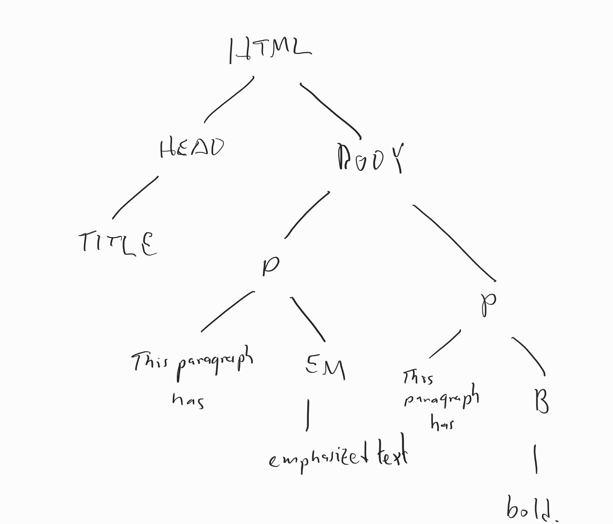

HTML tree

To represent a tree like this in C, we need a recursive data structure that includes enough information to identify the type and contents of each node, as well as pointers to all the children of each internal node. Something like this might work:

    struct htmlNode {
        enum { TYPE_TAG, TYPE_TEXT } type;
        char *value;             // tag name or text contents
        struct htmlNode **kids;  // if non-null, null-terminated sequence of pointers
    };

Similar _parse tree_ data structures are often used in programming language compilers and interpreters to represent source code. This allows the compiler/interpreter to concentrate on the structure of the code instead of having to worry about unstructured sequences of characters. A simple example is given in .

Because of the complexity of handling arbitrary numbers of children, if we aren’t forced to do it, we will often instead use a binary tree, where each node has at most two children.

### 5.9.3 Binary trees

A binary tree typically looks like a linked list with an extra outgoing pointer from each element, as in

    struct node {
        int key;
        struct node *left;  /* left child */
        struct node *right; /* right child */
    };

An alternative is to put the pointers to the children in an array. This lets us loop over both children, pass in which child we are interested in to a function as an argument, or even change the number of children:

    #define NUM_CHILDREN (2)
    
    struct node {
        int key;
        struct node *child[NUM_CHILDREN];
    };

Which approach we take is going to be a function of how much we like writing `left` and `right` vs `child[0]` and `child[1]`. A possible advantage of `left` and `right` is that it is harder to make mistakes that are not caught by the compiler (`child[2]`). Using the preprocessor, it is in principle possible to have your cake and eat it too (`#define left child[0]`), but I would not recommend this unless you are deliberately trying to confuse people.

Missing children (and the empty tree) are represented by null pointers. Typically, individual tree nodes are allocated separately using `malloc`; however, for high-performance use it is not unusual for tree libraries to do their own storage allocation out of large blocks obtained from `malloc`.

Optionally, the `struct` may be extended to include additional information such as a pointer to the node’s parent, hints for [balancing](#balancedTrees), or aggregate information about the subtree rooted at the node such as its size or the sum/max/average of the keys of its nodes.

When it is not important to be able to move large subtrees around simply by adjusting pointers, a tree may be represented implicitly by packing it into an array. This is a standard approach for implementing [heaps](#heaps), which we will see soon.

### 5.9.4 The canonical binary tree algorithm

Pretty much every [divide and conquer](#algorithmDesignTechniquesClassification) algorithm for binary trees looks like this:

    void
    doSomethingToAllNodes(struct node *root)
    {
        if(root) {
            doSomethingTo(root);
            doSomethingToAllNodes(root->left);
            doSomethingToAllNodes(root->right);
        }
    }

The function processes all nodes in what is called a **preorder traversal**, where the “preorder” part means that the root of any tree is processed first. Moving the call to `doSomethingTo` in between or after the two recursive calls yields an **inorder** or **postorder** traversal, respectively.

In practice we usually want to extract some information from the tree. For example, this function computes the size of a tree:

    int
    treeSize(struct node *root)
    {
        if(root == 0) {
            return 0;
        } else {
            return 1 + treeSize(root->left) + treeSize(root->right);
        }
    }

and this function computes the height:

    int
    treeHeight(struct node *root)
    {
        int lh;     /* height of left subtree */
        int rh;     /* height of right subtree */
    
        if(root == 0) {
            return -1;
        } else {
            lh = treeHeight(root->left);
            rh = treeHeight(root->right);
            return 1 + (lh > rh ? lh : rh);
        }
    }

Since both of these algorithms have the same structure, they both have the same asymptotic running time. We can compute this running time by observing that each recursive call to `treeSize` or `treeHeight` that does not get a null pointer passed to it gets a different node (so there are _n_ such calls), and each call that does get a null pointer passed to it is called by a routine that doesn’t, and that there are at most two such calls per node. Since the body of each call itself costs _O_(1) (no loops), this gives a total cost of _Θ_(_n_).

So these are all _Θ_(_n_) algorithms.

### 5.9.5 Nodes vs leaves

For some binary trees we don’t store anything interesting in the internal nodes, using them only to provide paths to the leaves. We might reasonably ask if an algorithm that runs in _O_(_n_) time where _n_ is the total number of nodes still runs in _O_(_m_) time, where _m_ counts only the leaves. For _complete_ binary trees, we can show that we get the same asymptotic performance whether we count leaves only, internal nodes only, or both leaves and internal nodes.

Let _T_(_n_) be the number of internal nodes in a complete binary tree with _n_ leaves. It is easy to see that _T_(1) = 0 and _T_(2) = 1, but for larger trees there are multiple structures and so it makes sense to write a recurrence: _T_(_n_) = 1 + _T_(_k_) + _T_(_n_ − _k_).

We can show by induction that the solution to this recurrence is exactly _T_(_n_) = _n_ − 1. We already have the base case _T_(1) = 0. For larger _n_, we have _T_(_n_) = 1 + _T_(_k_) + _T_(_n_ − _k_) = 1 + (_k_ − 1) + (_n_ − _k_ − 1) = _n_ − 1.

So a complete binary tree with _Θ_(_n_) nodes has _Θ_(_n_) internal nodes and _Θ_(_n_) leaves; if we don’t care about constant factors, we won’t care which number we use.

### 5.9.6 Special classes of binary trees

So far we haven’t specified where particular nodes are placed in the binary tree. Most applications of binary trees put some constraints on how nodes relate to one another. Some possibilities:

*   [Heaps](#heaps): Each node has a key that is less than the keys of both of its children. These allow for a very simple implementation using arrays, so we will look at these first.
*   [BinarySearchTrees](#binarySearchTrees): Each node has a key, and a node’s key must be greater than all keys in the subtree of its left-hand child and less than all keys in the subtree of its right-hand child.

5.10 Heaps
----------

A **heap** is a [binary tree](#trees) in which each element has a key (or sometimes **priority**) that is less than the keys of its children. Heaps are used to implement the **priority queue** [abstract data type](#abstractDataTypes), which we’ll talk about first.

### 5.10.1 Priority queues

In a standard queue, elements leave the queue in the same order as they arrive. In a priority queue, elements leave the queue in order of decreasing priority: the DEQUEUE operation becomes a DELETE-MIN operation (or DELETE-MAX, if higher numbers mean higher priority), which removes and returns the highest-priority element of the priority queue, regardless of when it was inserted. Priority queues are often used in operating system schedulers to determine which job to run next: a high-priority job (e.g., turn on the fire suppression system) runs before a low-priority job (floss the cat) even if the low-priority job has been waiting longer.

### 5.10.2 Expensive implementations of priority queues

Implementing a priority queue using an array or linked list is likely to be expensive. If the array or list is unsorted, it takes _O_(_n_) time to find the minimum element; if it is sorted, it takes _O_(_n_) time (in the worst case) to add a new element. So such implementations are only useful when the numbers of INSERT and DELETE-MIN operations are very different. For example, if DELETE-MIN is called only rarely but INSERT is called often, it may actually be cheapest to implement a priority queue as an unsorted linked list with _O_(1) INSERTs and _O_(_n_) DELETE-MINs. But if we expect that every element that is inserted is eventually removed, we want something for which both INSERT and DELETE-MIN are cheap operations.

### 5.10.3 Structure of a heap

A heap is a binary tree in which each node has a smaller key than its children; this property is called the **heap property** or **heap invariant**.

To insert a node in the heap, we add it as a new leaf, which may violate the heap property if the new node has a lower key than its parent. But we can restore the heap property (at least between this node and its parent) by swapping either the new node or its sibling with the parent, where in either case we move up the node with the smaller key. This may still leave a violation of the heap property one level up in the tree, but by continuing to swap small nodes with their parents we eventually reach the top and have a heap again. The time to complete this operation is proportional to the depth of the heap, which will typically be _O_(log _n_) (we will see how to enforce this in a moment).

To implement DELETE-MIN, we can easily find the value to return at the top of the heap. Unfortunately, removing it leaves a vacuum that must be filled in by some other element. The easiest way to do this is to grab a leaf (which probably has a very high key), and then float it down to where it belongs by swapping it with its smaller child at each iteration. After time proportional to the depth (again _O_(log _n_) if we are doing things right), the heap invariant is restored.

Similar local swapping can be used to restore the heap invariant if the priority of some element in the middle changes; we will not discuss this in detail.

### 5.10.4 Packed heaps

It is possible to build a heap using `struct`s and pointers, where each element points to its parent and children. In practice, heaps are instead stored in arrays, with an implicit pointer structure determined by array indices. For zero-based arrays as in C, the rule is that a node at position `i` has children at positions `2*i+1` and `2*i+2`; in the other direction, a node at position `i` has a parent at position `(i-1)/2` (which rounds down in C). This is equivalent to storing a heap in an array by reading through the tree in [breadth-first search](#graphSearch) order:

       0
      / \
     1   2
    / \ / \
    3 4 5 6

becomes

    0 1 2 3 4 5 6

This approach works best if there are no gaps in the array. So to maximize efficiency we make this “no gaps” policy part of the invariant. We can do so because we don’t care which leaf gets added when we do an INSERT, so we can make it be whichever leaf is at the end of the array. Similarly, in a DELETE-MIN operation, we can promote the element at the end of the array to the root before floating it down. Both these operations change the number of elements in the array, and INSERTs in particular might force us to reallocate eventually. So in the worst case INSERT can be an expensive operation, although as with growing hash tables, the amortized cost may still be small.

### 5.10.5 Bottom-up heapification

If we are presented with an unsorted array, we can turn it into a heap more quickly than the _O_(_n_log _n_) time required to do _n_ INSERTs. The trick is to build the heap from the bottom up. This means starting with position _n_ − 1 and working back to position 0, so that when it comes time to fix the heap invariant at position _i_, we have already fixed it at all later positions (this is a form of [dynamic programming](#dynamicProgramming)). Unfortunately, it is not quite enough simply to swap `a[i]` with its smaller child when we get there, because we could find that `a[0]` (say) was the largest element in the heap. But the cost of floating `a[i]` down to its proper place will be proportional to its own height rather than the height of the entire heap. Since most of the elements of the heap are close to the bottom, the total cost will turn out to be _O_(_n_).

### 5.10.6 Heapsort

Bottom-up heapification is used in the Heapsort algorithm, which first does bottom-up heapification in _O_(_n_) time and then repeatedly calls DELETE-MAX to extract the largest remaining element. This is no faster than the _O_(_n_log _n_) cost of [mergesort](#mergesort) or [quicksort](#quicksort) in typical use, but requires very little auxiliary storage since we can maintain the heap in the bottom part of the same array whose top part stores the max elements extracted so far.

Here is a simple implementation of heapsort, that demonstrates how both bottom-up heapification and the DELETE-MAX procedure work by floating elements down to their proper places:

    #include <stdio.h>
    #include <stdlib.h>
    #include <assert.h>
    
    /* max heap implementation */
    
    /* compute child 0 or 1 */
    #define Child(x, dir) (2*(x)+1+(dir))
    
    /* float value at position pos down */
    static void
    floatDown(int n, int *a, int pos)
    {
        int x;
    
        /* save original value once */
        x = a[pos];
    
        for(;;) {
            if(Child(pos, 1) < n && a[Child(pos, 1)] > a[Child(pos, 0)]) {
                /* maybe swap with Child(pos, 1) */
                if(a[Child(pos, 1)] > x) {
                    a[pos] = a[Child(pos, 1)];
                    pos = Child(pos, 1);
                } else {
                    /* x is bigger than both kids */
                    break;
                }
            } else if(Child(pos, 0) < n && a[Child(pos, 0)] > x) {
                /* swap with Child(pos, 0) */
                a[pos] = a[Child(pos, 0)];
                pos = Child(pos, 0);
            } else {
                /* done */
                break;
            }
        }
    
        a[pos] = x;
    }
    
    /* construct a heap bottom-up */
    static void
    heapify(int n, int *a)
    {
        int i;
    
        for(i = n-1; i >= 0; i--) {
            floatDown(n, a, i);
        }
    }
    
    /* sort an array */
    void
    heapSort(int n, int *a)
    {
        int i;
        int tmp;
    
        heapify(n, a);
    
        for(i = n-1; i > 0; i--) {
            /* swap max to a[i] */
            tmp = a[0];
            a[0] = a[i];
            a[i] = tmp;
    
            /* float new a[0] down */
            floatDown(i, a, 0);
        }
    }
    
    #define N (100)
    #define MULTIPLIER (17)
    
    int
    main(int argc, char **argv)
    {
        int a[N];
        int i;
    
        if(argc != 1) {
            fprintf(stderr, "Usage: %s\n", argv[0]);
            return 1;
        }
    
        for(i = 0; i < N; i++) { a[i] = (i*MULTIPLIER) % N; }
    
        for(i = 0; i < N; i++) { printf("%d ", a[i]); }
        putchar('\n');
    
        heapSort(N, a);
    
        for(i = 0; i < N; i++) { printf("%d ", a[i]); }
        putchar('\n');
    
        return 0;
    }

[examples/sorting/heapsort.c](examples/sorting/heapsort.c)

### 5.10.7 More information

*   [Priority\_queue](http://en.wikipedia.org/wiki/Priority_queue "WikiPedia")
*   [Binary\_heap](http://en.wikipedia.org/wiki/Binary_heap "WikiPedia")
*   [http://mathworld.wolfram.com/Heap.html](http://mathworld.wolfram.com/Heap.html)

5.11 Binary search trees
------------------------

A **binary search tree** is a [binary tree](#trees) in which each node has a **key**, and a node’s key must be greater than all keys in the subtree of its left-hand child and less than all keys in the subtree of its right-hand child. This allows a node to be searched for using essentially the same binary search algorithm used on sorted arrays.

### 5.11.1 Searching for a node

    /* returns pointer to node with given target key */
    /* or 0 if no such node exists */
    struct node *
    treeSearch(struct node *root, int target)
    {
        if(root == 0 || root->key == target) {
            return root;
        } else if(root->key > target) {
            return treeSearch(root->left, target);
        } else {
            return treeSearch(root->right, target);
        }
    }

This procedure can be rewritten iteratively, which avoids stack overflow and is likely to be faster:

    struct node *
    treeSearch(struct node *root, int target)
    {
        while(root != 0 && root->key != target) {
            if(root->key > target) {
                root = root->left;
            } else {
                root = root->right;
            }
        }
    
        return root;
    }

These procedures can be modified in the obvious way to deal with keys that aren’t `int`s, as long as they can be compared (e.g., by using `strcmp` on strings).

### 5.11.2 Inserting a new node

As in a [hash table](#hashTables), the insertion procedure mirrors the search procedure. We must be a little careful to avoid actually walking all the way down to a null pointer, since a null pointer now indicates a missing space for a leaf that we can fill with our new node. So the code is a little more complex.

    // Insert a new key into a tree whose root is pointed to
    // by *parent, which should be 0 if tree is empty.  May modify *parent.
    void
    treeInsert(struct tree **parent, int key)
    {
        struct tree *newNode;
    
        for(;;) {
            if(*parent == 0) {
                // put it here
                *parent = malloc(sizeof(*newNode));
                assert(*parent);
    
                (*parent)->key = key;
                (*parent)->left = 0;
                (*parent)->right = 0;
    
                return;
            } else if(key == (*parent)->key) {
                // already present
                return;
            } else if(key < (*parent)->key) {
                // insert in left subtree
                parent = &(*parent)->left;
            } else {
                // insert in right subtree
                parent = &(*parent)->right;
            }
        }
    }

Note that this function makes not attempt to keep the tree balanced. This may lead to very long paths if new keys are inserted in strictly increasing or strictly decreasing order.

### 5.11.3 Deleting a node

Deletion is more complicated. If a node has no children, we can just remove it, and the rest of the tree stays the same. A node with one child can be spliced out, connecting its parent directly to its child. But with two children, we can’t do this.

The trick is to find the leftmost node in our target’s right subtree (or vice versa). This node exists assuming the target has two children. As in a hash table, we can then swap our target node with this more convenient node. Because it is the leftmost node, it has no left child, so we can delete it using the no-children or one-child case.

### 5.11.4 Costs

Searching for or inserting a node in a binary search tree with _n_ nodes takes time proportional to the depth of the node. In [balanced trees](#balancedTrees), where the nodes in each subtree are divided roughly evenly between the two child subtrees, this will be _O_(log _n_), but for a badly unbalanced tree, this might be as much as _O_(_n_). So making a binary search tree work efficiently requires keeping it balanced.

5.12 Augmented trees
--------------------

An **augmented** data structure stores additional information in each of its nodes that caches values that might otherwise be expensive to compute. For trees, this might include information like the size of a subtree (which can be useful for **ranking** values, where we want to determine how many elements of the tree are smaller), the height of a subtree, or other summary information like the sum of all the keys in a subtree.

Augmented data structures, in a sense, violate the no-separate-but-equal rule that says we shouldn’t store the same information in different places. The reason we try to avoid this is that it’s trouble if the two copies diverge, and by not having two copies in the first place there is no possibility that they contradict each other. But in this case the reduced cost justifies breaking this rule.

The idea is that when we insert a new element into an augmented tree, it only changes the height/size/sum/etc. values for nodes on the path from the root to the new value. Since each of these aggregate values can be computed for a node in _O_(1) time from the values in its children, we can update all the aggregate values on our way back up the stack after doing the insertion at a cost of _O_(1) per node. This will give a total cost of _O_(log _n_) assuming our tree is reasonably balanced.

### 5.12.1 Applications

Storing the height field can be useful for balancing, as in [AVL trees](#avlTrees).

Storing the size allows ranking (computing the number of elements less than a given target value) and unraking (find an element with a particular rank). Sample code for doing this is given in the [AVL tree sample implementation](#avlTreeImplementation) below.

Storing other aggregates like the sum of keys or values allows **range queries**, where we ask, for example, for some aggregate statistic (like the sum or average) of all the elements between some given minimum and maximum.

Assuming we keep the tree balanced and correctly maintain the aggregate data or each subtree, all of these operations can be done in _O_(log _n_) time.

5.13 Balanced trees
-------------------

[Binary search trees](#binarySearchTrees) are a fine idea, but they only work if they are **balanced**—if moving from a tree to its left or right subtree reduces the size by a constant fraction. Balanced binary trees add some extra mechanism to the basic binary search tree to ensure balance. Finding efficient ways to balance a tree has been studied for decades, and several good mechanisms are known. We’ll try to hit the high points of all of them.

### 5.13.1 Tree rotations

The problem is that as we insert new nodes, some paths through the tree may become very long. So we need to be able to shrink the long paths by moving nodes elsewhere in the tree.

But how do we do this? The idea is to notice that there may be many binary search trees that contain the same data, and that we can transform one into another by a local modification called a _rotation_:

        y            x
       / \   <==>   / \
      x   C        A   y
     / \              / \
    A   B            B   C
    
    Single rotation on x-y edge

If _A_ < _x_ < _B_ < _y_ < _C_, then both versions of this tree have the binary search tree property. By doing the rotation in one direction, we move _A_ up and _C_ down; in the other direction, we move _A_ down and _C_ up. So rotations can be used to transfer depth from the leftmost grandchild of a node to the rightmost and vice versa.

But what if it’s the middle grandchild _B_ that’s the problem? A single rotation as above doesn’t move _B_ up or down. To move _B_, we have to reposition it so that it’s on the end of something. We do this by splitting _B_ into two subtrees _B_1 and _B_2, and doing two rotations that split the two subtrees while moving both up. For this we need to do two rotations:

        z              z                y
       / \   ===>     / \     ===>     / \
      x   C          y   C            x   z
     / \            / \              /|   |\
    A   y          x  B2            A B1 B2 C
       / \        / \
      B1 B2      A  B1
    
    Double rotation: rotate xy then zy

Rotations in principle let us rebalance a tree, but we still need to decide when to do them. If we try to keep the tree in perfect balance (all paths nearly the same length), we’ll spend so much time rotating that we won’t be able to do anything else. So we need a scheme that keeps a tree balanced enough that we get paths of length _O_(log _n_) while still doing _O_(log _n_) rotations per operations.

### 5.13.2 Treaps

One of the simplest balanced tree data structures is the **treap**, a randomized tree that combines the invariants of a binary search tree and a heap. The idea is to give each node two keys: a tree key used for searching, and a heap key, which is chosen at random and used to decide which nodes rise to the top. If we ignore the heap keys, a treap is a binary search tree: the tree keys store the contents of the tree, and the tree key in each node is greater than all keys in its left subtree and less than all keys in its right subtree. If we ignore the tree keys: a treap is a heap: each node has a heap key that is larger than all heap keys in is descendants.

It is not immediately obvious that we can preserve both invariants at once, but if we are presented with an unorganized pile of nodes already assigned tree and heap keys, we can build a treap by making the node with the largest _heap_ key the root, putting all the nodes with smaller _tree_ heap keys in the left subtree and all the nodes with larger _tree_ keys in the right subtree, then organizing both subtrees recursively in the same way. This tells use that for any assignment of tree and heap keys, a treap exists (and is in fact unique!), so the only trick is to make sure that it doesn’t cost too much to preserve the treap property when we insert a new element.

To insert a new node, we assign it a random heap key and insert it at a leaf using the usual method for a binary search tree. Because the new node’s random key may be large, this may violate the heap property. But we can rotate it up until the heap property is restored.

For deletions, we first have to search for a node with the key we want to delete, then remove it from the tree. If the node has has most one child, we can just patch it out, by changing its parent’s pointer to point to the child (or to null, if there is no child). If the node has two children, we pick the bigger one and rotate it up. Repeating this process will eventually rotate the node we are deleting down until it either has one child or is a leaf.

It’s not hard to see that the cost of any of these operations is proportional to length of some path in the treap. If all nodes have random heap keys, then the root node will be equally likely to be any of the nodes. This doesn’t guarantee that we get a good split, but a very bad split requires picking a root node close to one side or the other, which is unlikely. People smarter than I am have analyzed the expected height of a tree constructed in this way and show that the length of the longest path converges to (4.311…)log _n_ in the limit (Devroye, A note on the height of binary search trees, JACM 1986; the upper bound is due to Robson, The height of binary search trees, Australian Computer Journal, 1979). This gives an _O_(log _n_) bound for the expected height in practice. However, we do have to be careful to make sure that whoever is supplying our inputs can’t see what heap keys we pick, or they will be able to generate an unbalanced tree by repeatedly inserting and deleting nodes until they draw bad heap keys.

Below is an example of a binary search tree implemented as a treap. You can also find much more about treaps on the web page of [Cecilia Aragon](http://vis.lbl.gov/~aragon/treaps.html), one of the inventors of treaps.

    #include <stdio.h>
    #include <stdlib.h>
    #include <assert.h>
    #include <time.h>
    #include <limits.h>
    
    #define NUM_CHILDREN (2)
    
    #define LEFT (0)
    #define RIGHT (1)
    
    // Invariants: 
    // - Every key below child[LEFT] < key < every key below child[RIGHT]
    // - Every heapKey in both subtreaps < heapKey.
    // heapKeys are chosen randomly to ensure balance with high probability.
    struct treap {
        int key;
        int heapKey;
        struct treap *child[NUM_CHILDREN];
    };
    
    void
    treapDestroy(struct treap *t)
    {
        if(t) {
            for(int dir = LEFT; dir <= RIGHT; dir++) {
                treapDestroy(t->child[dir]);
            }
            free(t);
        }
    }
    
    void
    treapPrintHelper(const struct treap *t, int depth)
    {
        if(t == 0) {
            return;
        }
    
        treapPrintHelper(t->child[LEFT], depth+1);
    
        // print indented root
        for(int i = 0; i < depth; i++) {
            putchar(' ');
        }
    
        printf("%d [%d]\n", t->key, t->heapKey);
    
        treapPrintHelper(t->child[RIGHT], depth+1);
    }
    
    void
    treapPrint(const struct treap *t)
    {
        treapPrintHelper(t, 0);
    }
    
    // return 1 if it finds key, 0 otherwise
    int
    treapSearch(const struct treap *t, int key)
    {
        if(t == 0) {
            // no key!
            return 0;
        } else if(key == t->key) {
            // found it
            return 1;
        } else if(key < t->key) {
            // look in left
            return treapSearch(t->child[LEFT], key);
        } else {
            // look in right
            return treapSearch(t->child[RIGHT], key);
        }
    }
    
    // return largest element <= key
    // or INT_MIN if there is no such element.
    int
    treapSearchMaxLE(const struct treap *t, int key)
    {
        if(t == 0) {
            // no key!
            return INT_MIN;
        } else if(key == t->key) {
            // found it
            return key;
        } else if(key < t->key) {
            // look in left
            return treapSearchMaxLE(t->child[LEFT], key);
        } else {
            // look in right
            int result = treapSearchMaxLE(t->child[RIGHT], key);
    
            if(result == INT_MIN) {
                // didn't find it
                return t->key;
            } else {
                return result;
            }
        }
    }
    
    // rotate the treap pointed to by parent
    // so that child in direction moves up
    void
    treapRotateUp(struct treap **parent, int dir)
    {
        // get pointers to anything that might move
        assert(parent);
        struct treap *child = *parent;
        assert(child);
        struct treap *grandchild = child->child[dir];
        assert(grandchild);
        struct treap *middleSubtreap = grandchild->child[!dir];
    
        // do the move
        *parent = grandchild;
        grandchild->child[!dir] = child;
        child->child[dir] = middleSubtreap;
    }
    
    
    // insert key into treap pointed to by parent
    // if not already present
    void
    treapInsert(struct treap **parent, int key)
    {
        if(*parent == 0) {
            // no key!
            *parent = malloc(sizeof(struct treap));
            (*parent)->key = key;
            (*parent)->heapKey = rand();
            (*parent)->child[LEFT] = (*parent)->child[RIGHT] = 0;
        } else if(key == (*parent)->key) {
            // found it
            return;
        } else if(key < (*parent)->key) {
            // look in left
            treapInsert(&(*parent)->child[LEFT], key);
        } else {
            // look in right
            treapInsert(&(*parent)->child[RIGHT], key);
        }
    
        // check heap property
        for(int dir = LEFT; dir <= RIGHT; dir++) {
            if((*parent)->child[dir] != 0 && (*parent)->child[dir]->heapKey > (*parent)->heapKey) {
                treapRotateUp(parent, dir);
            }
        }
    }
    
    // delete a node from a treap (if present)
    void
    treapDelete(struct treap **parent, int key)
    {
        // first we look for it
        if(*parent == 0) {
            // not there
            return;
        } else if(key == (*parent)->key) {
            // got it; rotate down until we have a missing kid
            for(;;) {
                // do we have a missing child?
                for(int dir = LEFT; dir <= RIGHT; dir++) {
                    if((*parent)->child[dir] == 0) {
                        // yes; free this node and promote other kid
                        struct treap *toDelete = *parent;
                        *parent = toDelete->child[!dir];
                        free(toDelete);
                        return;
                    }
                }
    
                // no missing child, have to rotate down
                int biggerKid;
                if((*parent)->child[LEFT]->heapKey > (*parent)->child[RIGHT]->heapKey) {
                    biggerKid = LEFT;
                } else {
                    biggerKid = RIGHT;
                }
    
                // rotate up the bigger kid
                treapRotateUp(parent, biggerKid);
    
                // node to delete is now on opposite side
                parent = &(*parent)->child[!biggerKid];
            }
        } else {
            treapDelete(&(*parent)->child[key < (*parent)->key ? LEFT : RIGHT], key);
        }
    }
    
    #define TEST_THRESHOLD (10)
    
    int
    main(int argc, char **argv)
    {
        if(argc != 1) {
            fprintf(stderr, "Usage: %s\n", argv[0]);
            return 1;
        }
    
        struct treap *t = 0;
        int key;
    
        while(scanf("%d", &key) == 1) {
            if(key >= 0) {
                treapInsert(&t, key);
            } else {
                treapDelete(&t, -key);
            }
    
            treapPrint(t);
            printf("--- largest <= %d is %d\n", TEST_THRESHOLD, treapSearchMaxLE(t, TEST_THRESHOLD));
        }
    
        treapDestroy(t);
    
        return 0;
    }

[examples/trees/treap/treap.c](examples/trees/treap/treap.c)

### 5.13.3 AVL trees

AVL trees solve the balancing problem by enforcing the invariant that the heights of the two subtrees sitting under each node differ by at most one. This does not guarantee perfect balance, but it does get close. Let _S_(_k_) be the size of the smallest AVL tree with height _k_. This tree will have at least one subtree of height _k_ − 1, but its other subtree can be of height _k_ − 2 (and should be, to keep it as small as possible). We thus have the recurrence _S_(_k_) = 1 + _S_(_k_ − 1) + _S_(_k_ − 2), which is very close to the Fibonacci recurrence.

It is possible to solve this exactly using generating functions. But we can get close by guessing that _S_(_k_) ≥ _a__k_ for some constant _a_. This clearly works for _S_(0) = _a_0 = 1. For larger _k_, compute

*   _S_(_k_) = 1 + _a__k_ − 1 + _a__k_ − 2 = 1 + _a__k_(1/_a_ + 1/_a_2) > _a__k_(1/_a_ + 1/_a_2).

This last quantity is at least _a__k_ provided (1/_a_ + 1/_a_2) is at least 1. We can solve exactly for the largest _a_ that makes this work, but a very quick calculation shows that _a_ = 3/2 works: 2/3 + 4/9 = 10/9 > 1. It follows that any AVL tree with height _k_ has at least (3/2)_k_ nodes, or conversely that any AVL tree with (3/2)_k_ nodes has height at most _k_. So the height of an arbitrary AVL tree with _n_ nodes is no greater than log3/2_n_ = _O_(log _n_).

How do we maintain this invariant? The first thing to do is add extra information to the tree, so that we can tell when the invariant has been violated. AVL trees store in each node the difference between the heights of its left and right subtrees, which will be one of  − 1, 0, or 1. In an ideal world this would require log23 ≈ 1.58 bits per node, but since fractional bits are difficult to represent on modern computers a typical implementation uses two bits. Inserting a new node into an AVL tree involves

1.  Doing a standard binary search tree insertion.
2.  Updating the balance fields for every node on the insertion path.
3.  Performing a single or double rotation to restore balance if needed.

Implementing this correctly is tricky. Intuitively, we can imagine a version of an AVL tree in which we stored the height of each node (using _O_(log log _n_) bits). When we insert a new node, only the heights of its ancestors change—so step 2 requires updating _O_(log _n_) height fields. Similarly, it is only these ancestors that can be too tall. It turns out that fixing the closest ancestor fixes all the ones above it (because it shortens their longest paths by one as well). So just one single or double rotation restores balance.

Deletions are also possible, but are uglier: a deletion in an AVL tree may require as many as _O_(log _n_) rotations. The basic idea is to use the standard [binary search tree](#binarySearchTrees) deletion trick of either splicing out a node if it has no right child, or replacing it with the minimum value in its right subtree (the node for which is spliced out); we then have to check to see if we need to rebalance at every node above whatever node we removed.

Which rotations we need to do to rebalance depends on how some pair of siblings are unbalanced. Below, we show the possible cases.

Zig-zig case: This can occur after inserting in A or deleting in C. Here we rotate A up:

        y            x
       / \   ===>   / \
      x   C        A   y
     / \           |  / \
    A   B          # B   C
    |
    #

Zig-zag case: This can occur after inserting in B or deleting in C. This requires a double rotation.

        z              z                y
       / \   ===>     / \     ===>     / \
      x   C          y   C            x   z
     / \            / \              /|   |\
    A   y          x  B2            A B1 B2 C
       / \        / \
      B1 B2      A  B1

Zig-zag case, again: This last case comes up after deletion if both nephews of the short node are too tall. The same double rotation we used in the previous case works here, too. Note that one of the subtrees is still one taller than the others, but that’s OK.

        z              z                y
       / \   ===>     / \     ===>     / \
      x   C          y   C            x   z
     / \            / \              /|   |\
    A   y          x  B2            A B1 B2 C
    |  / \        / \               |
    # B1 B2      A  B1              #
                 |
                 #

#### 5.13.3.1 Sample implementation

If we are not fanatical about space optimization, we can just keep track of the heights of all nodes explicitly, instead of managing the  − 1, 0, 1 balance values. Below, we give a not-very-optimized example implementation that uses this approach to store a set of `int`s. This is pretty much our standard unbalanced BST (although we have to make sure that the insert and delete routines are recursive, so that we can fix things up on the way back out), with a layer on top, implemented in the `treeFix` function, that tracks the height and size of each subtree (although we don’t use size), and another layer on top of that, implemented in the `treeBalance` function, that fixes any violations of the AVL balance rule.

    /*
     * Basic binary search tree data structure without balancing info.
     *
     * Convention: 
     *
     * Operations that update a tree are passed a struct tree **,
     * so they can replace the argument with the return value.
     *
     * Operations that do not update the tree get a const struct tree *.
     */
    
    #define LEFT (0)
    #define RIGHT (1)
    #define TREE_NUM_CHILDREN (2)
    
    struct tree {
        /* we'll make this an array so that we can make some operations symmetric */
        struct tree *child[TREE_NUM_CHILDREN];
        int key;
        int height;    /* height of this node */
        size_t size;   /* size of subtree rooted at this node */
    };
    
    #define TREE_EMPTY (0)
    #define TREE_EMPTY_HEIGHT (-1)
    
    /* free all elements of a tree, replacing it with TREE_EMPTY */
    void treeDestroy(struct tree **root);
    
    /* insert an element into a tree pointed to by root */
    void treeInsert(struct tree **root, int newElement);
    
    /* return 1 if target is in tree, 0 otherwise */
    /* we allow root to be modified to allow for self-balancing trees */
    int treeContains(const struct tree *root, int target);
    
    /* delete minimum element from the tree and return its key */
    /* do not call this on an empty tree */
    int treeDeleteMin(struct tree **root);
    
    /* delete target from the tree */
    /* has no effect if target is not in tree */
    void treeDelete(struct tree **root, int target);
    
    /* return height of tree */
    int treeHeight(const struct tree *root);
    
    /* return size of tree */
    size_t treeSize(const struct tree *root);
    
    /* pretty-print the contents of a tree */
    void treePrint(const struct tree *root);
    
    /* return the number of elements in tree less than target */
    size_t treeRank(const struct tree *root, int target);
    
    /* return an element with the given rank */
    /* rank must be less than treeSize(root) */
    int treeUnrank(const struct tree *root, size_t rank);
    
    /* check that aggregate data is correct throughout the tree */
    void treeSanityCheck(const struct tree *root);

[examples/trees/AVL/tree.h](examples/trees/AVL/tree.h)

    #include <stdio.h>
    #include <stdlib.h>
    #include <assert.h>
    #include <stdint.h>
    #include <stdlib.h>
    
    #include "tree.h"
    
    int
    treeHeight(const struct tree *root)
    {
        if(root == 0) {
            return TREE_EMPTY_HEIGHT;
        } else {
            return root->height;
        }
    }
    
    /* recompute height from height of kids */
    static int
    treeComputeHeight(const struct tree *root)
    {
        int childHeight;
        int maxChildHeight;
        int i;
    
        if(root == 0) {
            return TREE_EMPTY_HEIGHT;
        } else {
            maxChildHeight = TREE_EMPTY_HEIGHT;
    
            for(i = 0; i < TREE_NUM_CHILDREN; i++) {
                childHeight = treeHeight(root->child[i]);
                if(childHeight > maxChildHeight) {
                    maxChildHeight = childHeight;
                }
            }
    
            return maxChildHeight + 1;
        }
    }
    
    size_t
    treeSize(const struct tree *root)
    {
        if(root == 0) {
            return 0;
        } else {
            return root->size;
        }
    } 
    
    /* recompute size from size of kids */
    static int
    treeComputeSize(const struct tree *root)
    {
        int size;
        int i;
    
        if(root == 0) {
            return 0;
        } else {
            size = 1;
    
            for(i = 0; i < TREE_NUM_CHILDREN; i++) {
                size += treeSize(root->child[i]);
            }
    
            return size;
        }
    }
    
    /* fix aggregate data in root */
    /* assumes children are correct */
    static void
    treeAggregateFix(struct tree *root)
    {
        if(root) {
            root->height = treeComputeHeight(root);
            root->size = treeComputeSize(root);
        }
    }
    
    /* rotate child in given direction to root */
    static void
    treeRotate(struct tree **root, int direction)
    {
        struct tree *x;
        struct tree *y;
        struct tree *b;
    
        /*
         *      y           x 
         *     / \         / \
         *    x   C  <=>  A   y
         *   / \             / \
         *  A   B           B   C
         */
    
        y = *root;                  assert(y);
        x = y->child[direction];    assert(x);
        b = x->child[!direction];
    
        /* do the rotation */
        *root = x;
        x->child[!direction] = y;
        y->child[direction] = b;
    
        /* fix aggregate data for y then x */
        treeAggregateFix(y);
        treeAggregateFix(x);
    }
    
    /* restore AVL property at *root after an insertion or deletion */
    /* assumes subtrees already have AVL property */
    static void
    treeRebalance(struct tree **root)
    {
        int tallerChild;
    
        if(*root) {
            for(tallerChild = 0; tallerChild < TREE_NUM_CHILDREN; tallerChild++) {
                if(treeHeight((*root)->child[tallerChild]) >= treeHeight((*root)->child[!tallerChild]) + 2) {
    
                    /* which grandchild is the problem? */
                    if(treeHeight((*root)->child[tallerChild]->child[!tallerChild]) 
                                > treeHeight((*root)->child[tallerChild]->child[tallerChild])) {
                        /* opposite-direction grandchild is too tall */
                        /* rotation at root will just change its parent but not change height */
                        /* so we rotate it up first */
                        treeRotate(&(*root)->child[tallerChild], !tallerChild);
                    }
    
                    /* now rotate up the taller child */
                    treeRotate(root, tallerChild);
    
                    /* don't bother with other child */
                    break;
                }
            }
    
            /* test that we actually fixed it */
            assert(abs(treeHeight((*root)->child[LEFT]) - treeHeight((*root)->child[RIGHT])) <= 1);
    
    #ifdef PARANOID_REBALANCE
            treeSanityCheck(*root);
    #endif
        }
    }
    
    
    /* free all elements of a tree, replacing it with TREE_EMPTY */
    void 
    treeDestroy(struct tree **root)
    {
        int i;
    
        if(*root) {
            for(i = 0; i < TREE_NUM_CHILDREN; i++) {
                treeDestroy(&(*root)->child[i]);
            }
            free(*root);
            *root = TREE_EMPTY;
        }
    }
    
    
    
    /* insert an element into a tree pointed to by root */
    void
    treeInsert(struct tree **root, int newElement)
    {
        struct tree *e;
    
        if(*root == 0) {
            /* not already there, put it in */
    
            e = malloc(sizeof(*e));
            assert(e);
    
            e->key = newElement;
            e->child[LEFT] = e->child[RIGHT] = 0;
    
            *root = e;
        } else if((*root)->key == newElement) {
            /* already there, do nothing */
            return;
        } else {
            /* do this recursively so we can fix data on the way back out */
            treeInsert(&(*root)->child[(*root)->key < newElement], newElement);
        }
    
        /* fix the aggregate data */
        treeAggregateFix(*root);
        treeRebalance(root);
    }
    
    /* return 1 if target is in tree, 0 otherwise */
    int
    treeContains(const struct tree *t, int target)
    {
        while(t && t->key != target) {
            t = t->child[t->key < target];
        }
    
        return t != 0;
    }
    
    /* delete minimum element from the tree and return its key */
    /* do not call this on an empty tree */
    int
    treeDeleteMin(struct tree **root)
    {
        struct tree *toFree;
        int retval;
    
        assert(*root);  /* can't delete min from empty tree */
    
        if((*root)->child[LEFT]) {
            /* recurse on left subtree */
            retval = treeDeleteMin(&(*root)->child[LEFT]);
        } else {
            /* delete the root */
            toFree = *root;
            retval = toFree->key;
            *root = toFree->child[RIGHT];
            free(toFree);
        }
    
        /* fix the aggregate data */
        treeAggregateFix(*root);
        treeRebalance(root);
    
        return retval;
    }
    
    /* delete target from the tree */
    /* has no effect if target is not in tree */
    void 
    treeDelete(struct tree **root, int target)
    {
        struct tree *toFree;
    
        /* do nothing if target not in tree */
        if(*root) {
            if((*root)->key == target) {
                if((*root)->child[RIGHT]) {
                    /* replace root with min value in right subtree */
                    (*root)->key = treeDeleteMin(&(*root)->child[RIGHT]);
                } else {
                    /* patch out root */
                    toFree = *root;
                    *root = toFree->child[LEFT];
                    free(toFree);
                }
            } else {
                treeDelete(&(*root)->child[(*root)->key < target], target);
            }
    
            /* fix the aggregate data */
            treeAggregateFix(*root);
            treeRebalance(root);
        }
    }
    
    
    /* how far to indent each level of the tree */
    #define INDENTATION_LEVEL (2)
    
    /* print contents of a tree, indented by depth */
    static void
    treePrintIndented(const struct tree *root, int depth)
    {
        int i;
    
        if(root != 0) {
            treePrintIndented(root->child[LEFT], depth+1);
    
            for(i = 0; i < INDENTATION_LEVEL*depth; i++) {
                putchar(' ');
            }
            printf("%d Height: %d Size: %zu (%p)\n", root->key, root->height, root->size, (void *) root);
    
            treePrintIndented(root->child[RIGHT], depth+1);
        }
    }
    
    /* print the contents of a tree */
    void 
    treePrint(const struct tree *root)
    {
        treePrintIndented(root, 0);
    }
    
    size_t
    treeRank(const struct tree *t, int target)
    {
        size_t rank = 0;
    
        while(t && t->key != target) {
            if(t->key < target) {
                /* go right */
                /* root and left subtree are all less than target */
                rank += (1 + treeSize(t->child[LEFT]));
                t = t->child[RIGHT];
            } else {
                /* go left */
                t = t->child[LEFT];
            }
        }
    
        /* we must also count left subtree */
        return rank + treeSize(t->child[LEFT]);
    }
    
    int
    treeUnrank(const struct tree *t, size_t rank)
    {
        size_t leftSize;
    
        /* basic idea: if rank < treeSize(child[LEFT]), recurse in left child */
        /* if it's equal, return the root */
        /* else recurse in right child with rank = rank - treeSize(child[LEFT]) - 1 */
        while(rank != (leftSize = treeSize(t->child[LEFT]))) {
            if(rank < leftSize) {
                t = t->child[LEFT];
            } else {
                t = t->child[RIGHT];
                rank -= (leftSize + 1);
            }
        }
    
        return t->key;
    }
    
    /* check that aggregate data is correct throughout the tree */
    void
    treeSanityCheck(const struct tree *root)
    {
        int i;
    
        if(root) {
            assert(root->height == treeComputeHeight(root));
            assert(root->size == treeComputeSize(root));
    
            assert(abs(treeHeight(root->child[LEFT]) - treeHeight(root->child[RIGHT])) < 2);
    
            for(i = 0; i < TREE_NUM_CHILDREN; i++) {
                treeSanityCheck(root->child[i]);
            }
        }
    }
    
    #ifdef TEST_MAIN
    int
    main(int argc, char **argv)
    {
        int key;
        int i;
        const int n = 10;
        const int randRange = 1000;
        const int randTrials = 10000;
        struct tree *root = TREE_EMPTY;
    
        if(argc != 1) {
            fprintf(stderr, "Usage: %s\n", argv[0]);
            return 1;
        }
    
        /* original test */
        for(i = 0; i < n; i++) {
            assert(!treeContains(root, i));
            treeInsert(&root, i);
            assert(treeContains(root, i));
            treeSanityCheck(root);
    #ifdef PRINT_AFTER_OPERATIONS
            treePrint(root);
            puts("---");
    #endif
        }
    
        /* check ranks */
        for(i = 0; i < n; i++) {
            assert(treeRank(root, i) == i);
            assert(treeUnrank(root, i) == i);
        }
    
        treeSanityCheck(root);
    
        /* now delete everything */
        for(i = 0; i < n; i++) {
            assert(treeContains(root, i));
            treeDelete(&root, i);
            assert(!treeContains(root, i));
            treeSanityCheck(root);
    #ifdef PRINT_AFTER_OPERATIONS
            treePrint(root);
            puts("---");
    #endif
        }
    
        treeSanityCheck(root);
        treeDestroy(&root);
    
        /* random test */
        srand(1);
    
        for(i = 0; i < randTrials; i++) {
            treeInsert(&root, rand() % randRange);
            treeDelete(&root, rand() % randRange);
        }
    
        treeSanityCheck(root);
        treeDestroy(&root);
    
    #ifdef TEST_USE_STDIN
        while(scanf("%d", &key) == 1) {
            /* insert if positive, delete if negative */
            if(key > 0) {
                treeInsert(&root, key);
                assert(treeContains(root, key));
            } else if(key < 0) {
                treeDelete(&root, -key);
                assert(!treeContains(root, key));
            } 
            /* else ignore 0 */
    
    #ifdef PRINT_AFTER_OPERATIONS
            treePrint(root);
            puts("---");
    #endif
        }
    
        treeSanityCheck(root);
    
        treeDestroy(&root);
    #endif /* TEST_USE_STDIN */
        return 0;
    }
    #endif /* TEST_MAIN */

[examples/trees/AVL/tree.c](examples/trees/AVL/tree.c)

This [Makefile](examples/trees/AVL/Makefile) will compile and run some demo code in `tree.c` if run with `make test`.

(An older implementation can be found in the directory [examples/trees/oldAvlTree](examples/trees/oldAvlTree).)

### 5.13.4 2–3 trees

An early branch in the evolution of balanced trees was the 2–3 tree. Here all paths have the same length, but internal nodes have either 2 or 3 children. So a 2–3 tree with height _k_ has between 2_k_ and 3_k_ leaves and a comparable number of internal nodes. The maximum path length in a tree with _n_ nodes is at most ⌈lg _n_⌉, as in a perfectly balanced binary tree.

An internal node in a 2–3 tree holds one key if it has two children (including two nil pointers) and two if it has three children. A search that reaches a three-child node must compare the target with both keys to decide which of the three subtrees to recurse into. As in binary trees, these comparisons take constant time, so we can search a 2–3 tree in _O_(log _n_) time.

Insertion is done by expanding leaf nodes. This may cause a leaf to split when it acquires a third key. When a leaf splits, it becomes two one-key nodes and the middle key moves up into its parent. This may cause further splits up the ancestor chain; the tree grows in height by adding a new root when the old root splits. In practice only a small number of splits are needed for most insertions, but even in the worst case this entire process takes _O_(log _n_) time.

It follows that 2–3 trees have the same performance as AVL trees. Conceptually, they are simpler, but having to write separate cases for 2-child and 3-child nodes doubles the size of most code that works on 2–3 trees. The real significance of 2–3 trees is as a precursor to two other kinds of trees, the _red-black tree_ and the _B-tree_.

### 5.13.5 Red-black trees

A red-black tree is a 2–3–4 tree (i.e. all nodes have 2, 3, or 4 children and 1, 2, or 3 internal keys) where each node is represented by a little binary tree with a black root and zero, one, or two red extender nodes as follows:

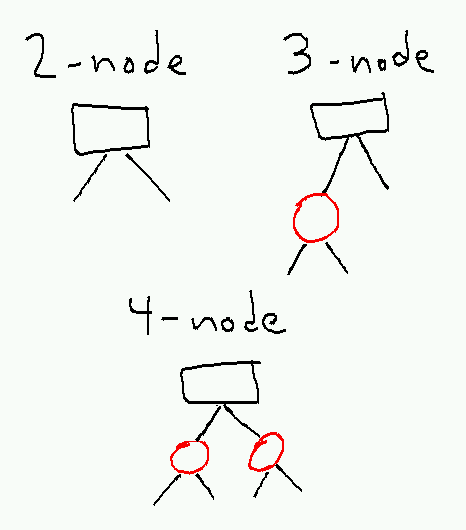

redblacknodes.png

The invariant for a red-black tree is that

1.  No two red nodes are adjacent.
2.  Every path contains the same number of black nodes.

For technical reasons, we include the null pointers at the bottom of the tree as black nodes; this has no effect on the invariant, but simplifies the description of the rebalancing procedure.

From the invariant it follows that every path has between _k_ and 2_k_ nodes, where _k_ is the _black-height_, the common number of black nodes on each path. From this we can prove that the height of the tree is _O_(log _n_).

Searching in a red-black tree is identical to searching in any other binary search tree; we simply ignore the color bit on each node. So search takes _O_(log _n_) time. For insertions, we use the standard binary search tree insertion algorithm, and insert the new node as a red node. This may violate the first part of the invariant (it doesn’t violate the second because it doesn’t change the number of black nodes on any path). In this case we need to fix up the constraint by recoloring nodes and possibly performing a single or double rotation.

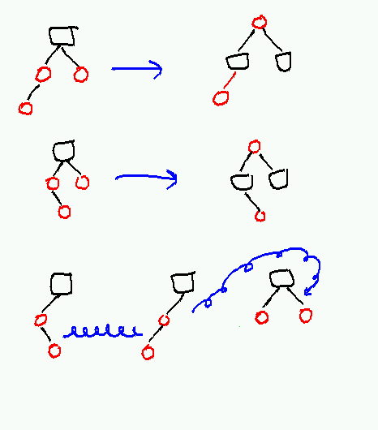

redblackrebalance.png

Which operations we need to do depend on the color of the new node’s uncle. If the uncle is red, we can recolor the node’s parent, uncle, and grandparent and get rid of the double-red edge between the new node and its parent without changing the number of black nodes on any path. In this case, the grandparent becomes red, which may create a new double-red edge which must be fixed recursively. Thus up to _O_(log _n_) such recolorings may occur at a total cost of _O_(log _n_).

If the uncle is black (which includes the case where the uncle is a null pointer), a rotation (possibly a double rotation) and recoloring is necessary. In this case (depicted at the bottom of the picture above), the new grandparent is always black, so there are no more double-red edges. So at most two rotations occur after any insertion.

Deletion is more complicated but can also be done in _O_(log _n_) recolorings and _O_(1) (in this case up to 3) rotations. Because deletion is simpler in red-black trees than in AVL trees, and because operations on red-black trees tend to have slightly smaller constants than corresponding operation on AVL trees, red-black trees are more often used that AVL trees in practice.

### 5.13.6 B-trees

Neither is used as much as a B-tree, a specialized data structure optimized for storage systems where the cost of reading or writing a large block (of typically 4096 or 8192 bytes) is no greater than the cost of reading or writing a single bit. Such systems include typical disk drives, where the disk drive has to spend so long finding data on disk that it tries to amortize the huge (tens of millions of CPU clock cycles) seek cost over many returned bytes.

A B-tree is a generalization of a 2–3 tree where the root has at most _M_ − 1 keys, and each node has between _M_/2 and _M_ − 1 keys, where _M_ is some large constant chosen so that a node (including up to _M_ pointers and up to _M_ − 1 keys) will just fit inside a single block. When a node would otherwise end up with _M_ keys, it splits into two nodes with _M_/2 keys each, and moves its middle key up into its parent. As in 2–3 trees this may eventually require the root to split and a new root to be created; in practice, _M_ is often large enough that a small fixed height is enough to span as much data as the storage system is capable of holding.

Searches in B-trees require looking through log_M__n_ nodes, at a cost of _O_(_M_) time per node. If _M_ is a constant the total time is asymptotically _O_(log _n_). But the reason for using B-trees is that the _O_(_M_) cost of reading a block is trivial compare to the much larger constant time to find the block on the disk; and so it is better to minimize the number of disk accesses (by making _M_ large) than reduce the CPU time.

Deletions in B-trees are a nuisance. Deleting a key within a node that has only _M_/2 keys requires are _rotation_ that steals a key from one of its siblings. If this would cause the sibling to drop below _M_/2 as well, the two nodes are merged. Merging two siblings steals a key from the parent, which may require further tinkering higher up in the tree. This means that deleting a key from a B-tree will require modifying _O_(log _n_) nodes in the worst case.

Below is a rudimentary B-tree implementation that provides only insert and search. For practical use you should probably for an existing B-tree library that has been tuned for whatever programming environment and system you are working on.

    /* implementation of a B-tree */
    typedef struct btNode *bTree;
    
    /* create a new empty tree */
    bTree btCreate(void);
    
    /* free a tree */
    void btDestroy(bTree t);
    
    /* return nonzero if key is present in tree */
    int btSearch(bTree t, int key);
    
    /* insert a new element into a tree */
    void btInsert(bTree t, int key);
    
    /* print all keys of the tree in order */
    void btPrintKeys(bTree t);

[examples/trees/bTree/bTree.h](examples/trees/bTree/bTree.h)

    #include <stdio.h>
    #include <stdlib.h>
    #include <assert.h>
    #include <string.h>
    
    #include "bTree.h"
    
    #define MAX_KEYS (1024)
    
    struct btNode {
        int isLeaf;     /* is this a leaf node? */
        int numKeys;    /* how many keys does this node contain? */
        int keys[MAX_KEYS];
        struct btNode *kids[MAX_KEYS+1];  /* kids[i] holds nodes < keys[i] */
    };
    
    bTree
    btCreate(void)
    {
        bTree b;
    
        b = malloc(sizeof(*b));
        assert(b);
    
        b->isLeaf = 1;
        b->numKeys = 0;
    
        return b;
    }
    
    void
    btDestroy(bTree b)
    {
        int i;
    
        if(!b->isLeaf) {
            for(i = 0; i < b->numKeys + 1; i++) {
                btDestroy(b->kids[i]);
            }
        }
    
        free(b);
    }
    
    /* return smallest index i in sorted array such that key <= a[i] */
    /* (or n if there is no such index) */
    static int
    searchKey(int n, const int *a, int key)
    {
        int lo;
        int hi;
        int mid;
    
        /* invariant: a[lo] < key <= a[hi] */
        lo = -1;
        hi = n;
    
        while(lo + 1 < hi) {
            mid = (lo+hi)/2;
            if(a[mid] == key) {
                return mid;
            } else if(a[mid] < key) {
                lo = mid;
            } else {
                hi = mid;
            }
        }
    
        return hi;
    }
    
    int
    btSearch(bTree b, int key)
    {
        int pos;
    
        /* have to check for empty tree */
        if(b->numKeys == 0) {
            return 0;
        }
    
        /* look for smallest position that key fits below */
        pos = searchKey(b->numKeys, b->keys, key);
    
        if(pos < b->numKeys && b->keys[pos] == key) {
            return 1;
        } else {
            return(!b->isLeaf && btSearch(b->kids[pos], key));
        }
    }
    
    /* insert a new key into a tree */
    /* returns new right sibling if the node splits */
    /* and puts the median in *median */
    /* else returns 0 */
    static bTree
    btInsertInternal(bTree b, int key, int *median)
    {
        int pos;
        int mid;
        bTree b2;
    
        pos = searchKey(b->numKeys, b->keys, key);
    
        if(pos < b->numKeys && b->keys[pos] == key) {
            /* nothing to do */
            return 0;
        }
    
        if(b->isLeaf) {
    
            /* everybody above pos moves up one space */
            memmove(&b->keys[pos+1], &b->keys[pos], sizeof(*(b->keys)) * (b->numKeys - pos));
            b->keys[pos] = key;
            b->numKeys++;
    
        } else {
    
            /* insert in child */
            b2 = btInsertInternal(b->kids[pos], key, &mid);
            
            /* maybe insert a new key in b */
            if(b2) {
    
                /* every key above pos moves up one space */
                memmove(&b->keys[pos+1], &b->keys[pos], sizeof(*(b->keys)) * (b->numKeys - pos));
                /* new kid goes in pos + 1*/
                memmove(&b->kids[pos+2], &b->kids[pos+1], sizeof(*(b->kids)) * (b->numKeys - pos));
    
                b->keys[pos] = mid;
                b->kids[pos+1] = b2;
                b->numKeys++;
            }
        }
    
        /* we waste a tiny bit of space by splitting now
         * instead of on next insert */
        if(b->numKeys >= MAX_KEYS) {
            mid = b->numKeys/2;
    
            *median = b->keys[mid];
    
            /* make a new node for keys > median */
            /* picture is:
             *
             *      3 5 7
             *      A B C D
             *
             * becomes
             *          (5)
             *      3        7
             *      A B      C D
             */
            b2 = malloc(sizeof(*b2));
    
            b2->numKeys = b->numKeys - mid - 1;
            b2->isLeaf = b->isLeaf;
    
            memmove(b2->keys, &b->keys[mid+1], sizeof(*(b->keys)) * b2->numKeys);
            if(!b->isLeaf) {
                memmove(b2->kids, &b->kids[mid+1], sizeof(*(b->kids)) * (b2->numKeys + 1));
            }
    
            b->numKeys = mid;
    
            return b2;
        } else {
            return 0;
        }
    }
    
    void
    btInsert(bTree b, int key)
    {
        bTree b1;   /* new left child */
        bTree b2;   /* new right child */
        int median;
    
        b2 = btInsertInternal(b, key, &median);
    
        if(b2) {
            /* basic issue here is that we are at the root */
            /* so if we split, we have to make a new root */
    
            b1 = malloc(sizeof(*b1));
            assert(b1);
    
            /* copy root to b1 */
            memmove(b1, b, sizeof(*b));
    
            /* make root point to b1 and b2 */
            b->numKeys = 1;
            b->isLeaf = 0;
            b->keys[0] = median;
            b->kids[0] = b1;
            b->kids[1] = b2;
        }
    }

[examples/trees/bTree/bTree.c](examples/trees/bTree/bTree.c)

### 5.13.7 Splay trees

Yet another approach to balancing is to do it dynamically. Splay trees, described by Sleator and Tarjan in the paper “[Self-adjusting binary search trees](https://www.cs.cmu.edu/~sleator/papers/self-adjusting.pdf)” (JACM 32(3):652–686, July 1985) are binary search trees in which every search operation rotates the target to the root. If this is done correctly, the **amortized cost** of each tree operation is _O_(log _n_), although particular rare operations might take as much as _O_(_n_) time. Splay trees require no extra space because they store no balancing information; however, the constant factors on searches can be larger because every search requires restructuring the tree. For some applications this additional cost is balanced by the splay tree’s ability to adapt to data access patterns; if some elements of the tree are hit more often than others, these elements will tend to migrate to the top, and the cost of a typical search will drop to _O_(log _m_), where _m_ is the size of the “working set” of frequently-accessed elements.

#### 5.13.7.1 How splaying works

The basic idea of a splay operation is that we move some particular node to the root of the tree, using a sequence of rotations that tends to fix the balance of the tree if the node starts out very deep. So while we might occasionally drive the tree into a state that is highly unbalanced, as soon as we try to exploit this by searching for a deep node, we’ll start balancing the tree so that we can’t collect too much additional cost. In fact, in order to set up the bad state in the first place we will have to do a lot of cheap splaying operations: the missing cost of these cheap splays ends up paying for the cost of the later expensive search.

Splaying a node to the root involves performing rotations two layers at a time. There are two main cases, depending on whether the node’s parent and grandparent are in the same direction (zig-zig) or in opposite directions (zig-zag), plus a third case when the node is only one step away from the root. At each step, we pick one of these cases and apply it, until the target node reaches the root of the tree.

This is probably best understood by looking at a figure from the original paper:

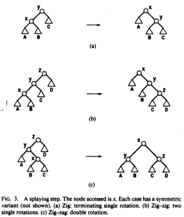

The bottom two cases are the ones we will do most of the time.

Just looking at the picture, it doesn’t seem like zig-zig will improve balance much. But if we have a long path made up of zig-zig cases, each operation will push at least one node off of this path, cutting the length of the path in half. So the rebalancing happens as much because we are pushing nodes off of the long path as because the specific rotation operations improve things locally.

#### 5.13.7.2 Analysis

Sleator and Tarjan show that any sequence of _m_ splay operations on an _n_\-node splay tree has total cost at most _O_((_m_ + _n_)log _n_ + _m_). For large _m_ (at least linear in _n_), the _O_(_m_log _n_) term dominates, giving an amortized cost per operation of _O_(log _n_), the same as we get from any balanced binary tree. This immediately gives a bound on search costs, because the cost of plunging down the tree to find the node we are looking for is proportional to the cost of splaying it up to the root.

Splay trees have a useful “caching” property in that they pull frequently-accessed nodes to the to the top and push less-frequently-accessed nodes down. The authors show that if only _k_ of the _n_ nodes are accessed, the long-run amortized cost per search drops to _O_(log _k_). For more general access sequences, it is conjectured that the cost to perform a sufficiently long sequence of searches using a splay tree is in fact optimal up to a constant factor (the “dynamic optimality conjecture”), but no one has yet been able to prove this conjecture (or provide a counterexample).[21](#fn21)

#### 5.13.7.3 Other operations

A search operation consists of a standard binary tree search followed by splaying the target node to the root (if present) or the last non-null node we reached to the root instead (if not).

Insertion and deletion are built on top of procedures to split and join trees.

A split divides a single splay tree into two splay trees, consisting of all elements less than or equal to some value _x_ and all elements greater than _x_. This is done by searching for _x_, which brings either _x_ or the first element less than or greater than _x_ to the root, then breaking the link between the root and its left or right child depending on whether the root should go in the right or left tree.

A join merges two splay trees _L_ and _R_, where every element in _L_ is less than every element in _R_. This involves splaying the largest element in _L_ to the root, and then making the root of _R_ the right child of this element.

To do an insert of _x_, we do a split around _x_, then make the roots of the two trees the children of a new element holding _x_ (unless _x_ is already present in the tree, in which case we stop before breaking the trees apart).

To do a delete of an element _x_, we splay _x_ to the root, remove it, then join the two orphaned subtrees.

For each operation, we are doing a constant number of splays (amortized cost _O_(log _n_) each), plus _O_(1) additional work. A bit of work is needed to ensure that the joins and splits don’t break the amortized cost analysis, but this is done in the paper, so we will sweep it under the carpet with the rest of the analysis.

#### 5.13.7.4 Top-down splaying

There are a few remaining details that we need to deal with before trying to implement a splay trees. Because the splay tree could become very deep, we probably don’t want to implement a splay recursively in a language like C, because we’ll blow out our stack. We also have a problem if we are trying to rotate our target up from the bottom of figuring out what its ancestors are. We could solve both of these problems by including parent pointers in our tree, but this would add a lot of complexity and negate the space improvement over AVL trees of not having to store heights.

The solution given in the Sleator-Tarjan paper is to replace the bottom-up splay procedure with a top-down splay procedure that accomplishes the same task. The idea is that rotating a node up from the bottom effectively splits the tree above it into two new left and right subtrees by pushing ancestors sideways according to the zig-zig and zig-zag patters. But we can recognize these zig-zig and zig-zag patterns from the top as well, and so we can construct these same left and right subtrees from the top down instead of the bottom up. When we do this, instead of adding new nodes to the tops of the trees, we will be adding new nodes to the bottoms, as the right child of the rightmost node in the left tree or the left child of the rightmost node in the left tree.

Here’s the picture, from the original paper:

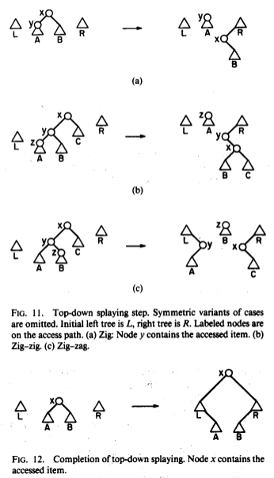  

To implement this, we need to keep track of the roots of the three trees, as well as the locations in the left and right trees where we will be adding new vertices. The roots we can just keep pointers to. For the lower corners of the trees, it makes sense to store instead a pointer to the pointer location, so that we can modify the pointer in the tree (and then move the pointer to point to the pointer in the new corner). Initially, these corner pointers will just point to the left and right tree roots, which will start out empty.

The last step (shown as Figure 12 from the paper) pastes the tree back together by inserting the left and right trees between the new root and its children.

#### 5.13.7.5 An implementation

Here is an implementation of a splay tree, with an interface similar to the previous [AVL tree implementation](#avlTreeImplementation).

    /*
     * Basic binary search tree data structure without balancing info.
     *
     * Convention: 
     *
     * Operations that update a tree are passed a struct tree **,
     * so they can replace the argument with the return value.
     *
     * Operations that do not update the tree get a const struct tree *.
     */
    
    #define LEFT (0)
    #define RIGHT (1)
    #define TREE_NUM_CHILDREN (2)
    
    struct tree {
        /* we'll make this an array so that we can make some operations symmetric */
        struct tree *child[TREE_NUM_CHILDREN];
        int key;
    };
    
    #define TREE_EMPTY (0)
    
    /* free all elements of a tree, replacing it with TREE_EMPTY */
    void treeDestroy(struct tree **root);
    
    /* insert an element into a tree pointed to by root */
    void treeInsert(struct tree **root, int newElement);
    
    /* return 1 if target is in tree, 0 otherwise */
    /* we allow root to be modified to allow for self-balancing trees */
    int treeContains(struct tree **root, int target);
    
    /* delete target from the tree */
    /* has no effect if target is not in tree */
    void treeDelete(struct tree **root, int target);
    
    /* pretty-print the contents of a tree */
    void treePrint(const struct tree *root);

[examples/trees/splay/tree.h](examples/trees/splay/tree.h)

    #include <stdio.h>
    #include <stdlib.h>
    #include <assert.h>
    #include <limits.h>
    
    #include "tree.h"
    
    /* free all elements of a tree, replacing it with TREE_EMPTY */
    void 
    treeDestroy(struct tree **root)
    {
        /* we want to avoid doing this recursively, because the tree might be deep */
        /* so we will repeatedly delete the root until the tree is empty */
        while(*root) {
            treeDelete(root, (*root)->key);
        }
    }
    
    /* rotate child in given direction to root */
    void
    treeRotate(struct tree **root, int direction)
    {
        struct tree *x;
        struct tree *y;
        struct tree *b;
    
        /*
         *      y           x 
         *     / \         / \
         *    x   C  <=>  A   y
         *   / \             / \
         *  A   B           B   C
         */
    
        y = *root;                  assert(y);
        x = y->child[direction];    assert(x);
        b = x->child[!direction];
    
        /* do the rotation */
        *root = x;
        x->child[!direction] = y;
        y->child[direction] = b;
    }
    
    /* link operations for top-down splay */
    /* this pastes a node in as !d-most node in subtree on side d */
    static inline void
    treeLink(struct tree ***hook, int d, struct tree *node)
    {
        *hook[d] = node;
        /* strictly speaking we don't need to do this, but it allows printing the partial trees */
        node->child[!d] = 0;
        hook[d] = &node->child[!d];
    }
    
    /* splay last element on path to target to root */
    static void
    treeSplay(struct tree **root, int target)
    {
        struct tree *t;
        struct tree *child;
        struct tree *grandchild;
        struct tree *top[TREE_NUM_CHILDREN];   /* accumulator trees that will become subtrees of new root */
        struct tree **hook[TREE_NUM_CHILDREN]; /* where to link new elements into accumulator trees */
        int d;
        int dChild;        /* direction of child */                   
        int dGrandchild;   /* direction of grandchild */
    
        /* we don't need to keep following this pointer, we'll just fix it at the end */
        t = *root;
    
        /* don't do anything to an empty tree */
        if(t == 0) { return; }
    
        /* ok, tree is not empty, start chopping it up */
        for(d = 0; d < TREE_NUM_CHILDREN; d++) {
            top[d] = 0;
            hook[d] = &top[d];
        }
    
        /* keep going until we hit the key or we would hit a null pointer in the child */
        while(t->key != target && (child = t->child[dChild = t->key < target]) != 0) {
            /* child is not null */
            grandchild = child->child[dGrandchild = child->key < target];
    
    #ifdef DEBUG_SPLAY
            treePrint(top[0]);
            puts("---");
            treePrint(t);
            puts("---");
            treePrint(top[1]);
            puts("===");
    #endif
    
            if(grandchild == 0 || child->key == target) {
                /* zig case; paste root into opposite-side hook */
                treeLink(hook, !dChild, t);
                t = child;
                /* we can break because we know we will hit child == 0 next */
                break;
            } else if(dChild == dGrandchild) {
                /* zig-zig case */
                /* rotate and then hook up child */
                /* grandChild becomes new root */
                treeRotate(&t, dChild);
                treeLink(hook, !dChild, child);
                t = grandchild;
            } else {
                /* zig-zag case */
                /* root goes to !dChild, child goes to dChild, grandchild goes to root */
                treeLink(hook, !dChild, t);
                treeLink(hook, dChild, child);
                t = grandchild;
            }
        }
    
        /* now reassemble the tree */
        /* t's children go in hooks, top nodes become t's new children */
        for(d = 0; d < TREE_NUM_CHILDREN; d++) {
            *hook[d] = t->child[d];
            t->child[d] = top[d];
        }
    
        /* and put t back in *root */
        *root = t;
    }
    
    /* return 1 if target is in tree, 0 otherwise */
    int
    treeContains(struct tree **root, int target)
    {
        treeSplay(root, target);
        return *root != 0 && (*root)->key == target;
    }
    
    
    /* insert an element into a tree pointed to by root */
    void
    treeInsert(struct tree **root, int newElement)
    {
        struct tree *e;
        struct tree *t;
        int d;             /* which side of e to put old root on */
    
        treeSplay(root, newElement);
    
        t = *root;
    
        /* skip if already present */
        if(t && t->key == newElement) { return; }
    
        /* otherwise split the tree */
        e = malloc(sizeof(*e));
        assert(e);
    
        e->key = newElement;
    
        if(t == 0) {
            e->child[LEFT] = e->child[RIGHT] = 0;
        } else {
            /* split tree and put e on top */
            /* we know t is closest to e, so we don't have to move anything else */
            d = (*root)->key > newElement;
            e->child[d] = t;
            e->child[!d] = t->child[!d];
            t->child[!d] = 0;
        }
    
        /* either way we stuff e in *root */
        *root = e;
    }
    
    /* delete target from the tree */
    /* has no effect if target is not in tree */
    void 
    treeDelete(struct tree **root, int target)
    {
        struct tree *left;
        struct tree *right;
    
        treeSplay(root, target);
    
        if(*root && (*root)->key == target) {
            /* save pointers to kids */
            left = (*root)->child[LEFT];
            right = (*root)->child[RIGHT];
    
            /* free the old root */
            free(*root);
    
            /* if left is empty, just return right */
            if(left == 0) {
                *root = right;
            } else {
                /* first splay max element in left to top */
                treeSplay(&left, INT_MAX);
    
                /* now paste in right subtree */
                left->child[RIGHT] = right;
    
                /* return left */
                *root = left;
            }
        }
    }
    
    /* how far to indent each level of the tree */
    #define INDENTATION_LEVEL (2)
    
    /* print contents of a tree, indented by depth */
    static void
    treePrintIndented(const struct tree *root, int depth)
    {
        int i;
    
        if(root != 0) {
            treePrintIndented(root->child[LEFT], depth+1);
    
            for(i = 0; i < INDENTATION_LEVEL*depth; i++) {
                putchar(' ');
            }
            printf("%d (%p)\n", root->key, (void *) root);
    
            treePrintIndented(root->child[RIGHT], depth+1);
        }
    }
    
    /* print the contents of a tree */
    void 
    treePrint(const struct tree *root)
    {
        treePrintIndented(root, 0);
    }
    
    
    #ifdef TEST_MAIN
    int
    main(int argc, char **argv)
    {
        int i;
        const int n = 10;
        struct tree *root = TREE_EMPTY;
    
        if(argc != 1) {
            fprintf(stderr, "Usage: %s\n", argv[0]);
            return 1;
        }
    
        for(i = 0; i < n; i++) {
            assert(!treeContains(&root, i));
            treeInsert(&root, i);
            assert(treeContains(&root, i));
            treePrint(root);
            puts("===");
        }
    
        /* now delete everything */
        for(i = 0; i < n; i++) {
            assert(treeContains(&root, i));
            treeDelete(&root, i);
            assert(!treeContains(&root, i));
            treePrint(root);
            puts("===");
        }
    
        treeDestroy(&root);
    
        return 0;
    }
    #endif

[examples/trees/splay/tree.c](examples/trees/splay/tree.c)

[Makefile](examples/trees/splay/Makefile). The file [speedTest.c](examples/trees/splay/speedTest.c) can be used to do a simple test of the efficiency of inserting many random elements. On my machine, the splay tree version is about 10% slower than the AVL tree for this test on a million elements. This probably indicates a bigger slowdown for `treeInsert` itself, because some of the time will be spent in `rand` and `treeDestroy`, but I was too lazy to actually test this further.

#### 5.13.7.6 More information

For more details on splay trees, see [the original paper](http://dl.acm.org/citation.cfm?id=3835), or any number of demos, animations, and other descriptions that can be found via [Google](http://www.google.com/search?q=splay+trees).

### 5.13.8 Scapegoat trees

**Scapegoat trees** are another amortized balanced tree data structure. The idea of a scapegoat tree is that if we ever find ourselves doing an insert at the end of a path that is too long, we can find some subtree rooted at a node along this path that is particularly imbalanced and rebalance it all at once at a cost of _O_(_k_) where _k_ is the size of the subtree. These were shown by Galperin and Rivest (SODA 1993) to give _O_(log _n_) amortized cost for inserts, while guaranteeing _O_(log _n_) depth, so that inserts also run in _O_(log _n_) worst-case time; they also came up with the name “scapegoat tree”, although it turns out the same data structure had previously been published by Andersson in 1989. Unlike splay trees, scapegoat trees do not require modifying the tree during a search, and unlike AVL trees, scapegoat trees do not require tracking any information in nodes (although they do require tracking the total size of the tree and, to allow for rebalancing after many deletes, the maximum size of the tree since the last time the entire tree was rebalanced).

Unfortunately, scapegoat trees are not very fast, so one is probably better off with an AVL tree.

### 5.13.9 Skip lists

[Skip lists](#skipLists) are yet another balanced tree data structure, where the tree is disguised as a tower of linked lists. Since they use randomization for balance, we describe them with other [randomized data structures](#randomizedDataStructures).

### 5.13.10 Implementations

AVL trees and red-black trees have been implemented for every reasonable programming language you’ve ever heard of. For C implementations, a good place to start is at [http://adtinfo.org/](http://adtinfo.org/).

5.14 Graphs
-----------

These are notes on implementing **graphs** and graph algorithms in C.

### 5.14.1 Basic definitions

A **graph** consists of a set of **nodes** or **vertices** together with a set of **edges** or **arcs** where each edge joins two vertices. Unless otherwise specified, a graph is **undirected**: each edge is an unordered pair {_u_, _v_} of vertices, and we don’t regard either of the two vertices as having a distinct role from the other. However, it is more common in computing to consider **directed graphs** or **digraphs** in which edges are _ordered_ pairs (_u_, _v_); here the vertex _u_ is the **source** of the edge and vertex v is the **sink** or **target** of the edge. Directed edges are usually drawn as arrows and undirected edges as curves or line segments. It is always possible to represent an undirected graph as a directed graph where each undirected edge {_u_, _v_} becomes two oppositely directed edges (_u_, _v_) and (_v_, _u_).

Here is an example of a small graph, drawn using [this file](images/graphs/graph.dot) using the `circo` program from the [GraphViz](http://graphviz.org) library:

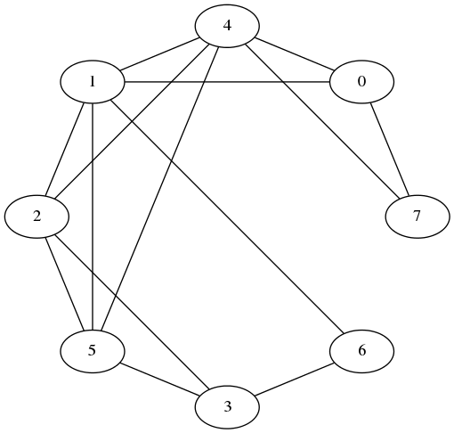

Here is a similar directed graph, drawn using [this file](images/graphs/digraph.dot):

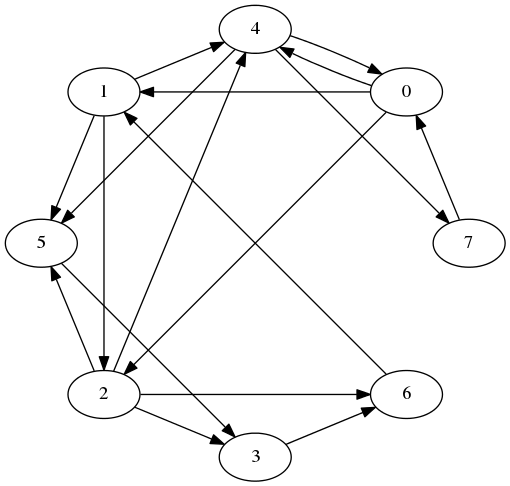

A directed graph

Given an edge (_u_, _v_), the vertices _u_ and _v_ are said to be **incident** to the edge and **adjacent** to each other. The number of vertices adjacent to a given vertex _u_ is the **degree** of _u_; this can be divided into the **out-degree** (number of vertices _v_ such that (_u_, _v_) is an edge) and the **in-degree** (number of vertices _v_ such that (_v_, _u_) is an edge). A vertex _v_ adjacent to _u_ is called a **neighbor** of _u_, and (in a directed graph) is a **predecessor** of _u_ if (_v_, _u_) is an edge and a **successor** of _u_ if (_u_, _v_) is an edge. We will allow a node to be its own predecessor and successor.

### 5.14.2 Why graphs are useful

Graphs can be used to model any situation where we have things that are related to each other in pairs; for example, all of the following can be represented by graphs:

Family trees

Nodes are members, with an edge from each parent to each of their children.

Transportation networks

Nodes are airports, intersections, ports, etc. Edges are airline flights, one-way roads, shipping routes, etc.

Assignments

Suppose we are assigning classes to classrooms. Let each node be either a class or a classroom, and put an edge from a class to a classroom if the class is assigned to that room. This is an example of a **bipartite graph**, where the nodes can be divided into two sets _S_ and _T_ and all edges go from _S_ to _T_.

### 5.14.3 Operations on graphs

What would we like to do to graphs? Generally, we first have to build a graph by starting with a set of nodes and adding in any edges we need, and then we want to extract information from it, such as “Is this graph connected?”, “What is the shortest path in this graph from _s_ to _t_?”, or “How many edges can I remove from this graph before some nodes become unreachable from other nodes?” There are standard algorithms for answering all of these questions; the information these algorithms need is typically (a) given a vertex _u_, what successors does it have; and sometimes (b) given vertices _u_ and _v_, does the edge (_u_, _v_) exist in the graph?

### 5.14.4 Representations of graphs

A good graph representation will allow us to answer one or both of these questions quickly. There are generally two standard representations of graphs that are used in graph algorithms, depending on which question is more important.

For both representations, we simplify the representation task by insisting that vertices be labeled 0, 1, 2, …, _n_ − 1, where _n_ is the number of vertices in the graph. If we have a graph with different vertex labels (say, airport codes), we can enforce an integer labeling by a preprocessing step where we assign integer labels, and then translate the integer labels back into more useful user labels afterwards. The preprocessing step can usually be done using a [hash table](#hashTables) in _O_(_n_) time, which is likely to be smaller than the cost of whatever algorithm we are running on our graph, and the savings in code complexity and running time from working with just integer labels will pay this cost back many times over.

#### 5.14.4.1 Adjacency matrices

An **adjacency matrix** is just a matrix `a` where `a[i][j]` is `1` if (i,j) is an edge in the graph and `0` otherwise. It’s easy to build an adjacency matrix, and adding or testing for the existence of an edges takes _O_(1) time. The downsides of adjacency matrices are that finding all the outgoing edges from a vertex takes _O_(_n_) time even if there aren’t very many, and the _O_(_n_2) space cost is high for “sparse graphs,” those with much fewer than _n_2 edges.

#### 5.14.4.2 Adjacency lists

An **adjacency list** representation of a graph creates a list of successors for each node _u_. These lists may be represented as linked lists (the typical assumption in algorithms textbooks), or in languages like C may be represented by variable-length arrays. The cost for adding an edge is still _O_(1), but testing for the existence of an edge (_u_, _v_) rises to _O_(_d_+(_u_)), where _d_+(_u_) is the out-degree of _u_ (i.e., the length of the list of _u_’s successors). The cost of enumerating the successors of _u_ is also _O_(_d_+(_u_)), which is clearly the best possible since it takes that long just to write them all down. Finding predecessors of a node _u_ is extremely expensive, requiring looking through every list of every node in time _O_(_n_ + _m_), where _m_ is the total number of edges, although if this is something we actually need to do often we can store a second copy of the graph with the edges reversed.

Adjacency lists are thus most useful when we mostly want to enumerate outgoing edges of each node. This is common in search tasks, where we want to find a path from one node to another or compute the distances between pairs of nodes. If other operations are important, we can optimize them by augmenting the adjacency list representation; for example, using sorted arrays for the adjacency lists reduces the cost of edge existence testing to _O_(log (_d_+(_u_))), and adding a second copy of the graph with reversed edges lets us find all predecessors of u in _O_(_d_−(_u_)) time, where _d_−(_u_) is _u_’s in-degree.

Adjacency lists also require much less space than adjacency matrices for sparse graphs: _O_(_n_ + _m_) vs _O_(_n_2) for adjacency matrices. For this reason adjacency lists are more commonly used than adjacency matrices.

##### 5.14.4.2.1 An implementation

Here is an implementation of a basic graph type using adjacency lists.

    /* basic directed graph type */
    
    typedef struct graph *Graph;
    
    /* create a new graph with n vertices labeled 0..n-1 and no edges */
    Graph graphCreate(int n);
    
    /* free all space used by graph */
    void graphDestroy(Graph);
    
    /* add an edge to an existing graph */
    /* doing this more than once may have unpredictable results */
    void graphAddEdge(Graph, int source, int sink);
    
    /* return the number of vertices/edges in the graph */
    int graphVertexCount(Graph);
    int graphEdgeCount(Graph);
    
    /* return the out-degree of a vertex */
    int graphOutDegree(Graph, int source);
    
    /* return 1 if edge (source, sink) exists), 0 otherwise */
    int graphHasEdge(Graph, int source, int sink);
    
    /* invoke f on all edges (u,v) with source u */
    /* supplying data as final parameter to f */
    /* no particular order is guaranteed */
    void graphForeach(Graph g, int source,
            void (*f)(Graph g, int source, int sink, void *data),
            void *data);

[examples/graphs/graph.h](examples/graphs/graph.h)

    #include <stdlib.h>
    #include <assert.h>
    
    #include "graph.h"
    
    /* basic directed graph type */
    /* the implementation uses adjacency lists
     * represented as variable-length arrays */
    
    /* these arrays may or may not be sorted: if one gets long enough
     * and you call graphHasEdge on its source, it will be */
    
    struct graph {
        int n;              /* number of vertices */
        int m;              /* number of edges */
        struct successors {
            int d;          /* number of successors */
            int len;        /* number of slots in array */
            int isSorted; /* true if list is already sorted */
            int list[];    /* actual list of successors starts here */
        } *alist[];
    };
    
    /* create a new graph with n vertices labeled 0..n-1 and no edges */
    Graph
    graphCreate(int n)
    {
        Graph g;
        int i;
    
        g = malloc(sizeof(struct graph) + sizeof(struct successors *) * n);
        assert(g);
    
        g->n = n;
        g->m = 0;
    
        for(i = 0; i < n; i++) {
            g->alist[i] = malloc(sizeof(struct successors));
            assert(g->alist[i]);
    
            g->alist[i]->d = 0;
            g->alist[i]->len = 0;
            g->alist[i]->isSorted= 1;
        }
        
        return g;
    }
    
    /* free all space used by graph */
    void
    graphDestroy(Graph g)
    {
        int i;
    
        for(i = 0; i < g->n; i++) free(g->alist[i]);
        free(g);
    }
    
    /* add an edge to an existing graph */
    void
    graphAddEdge(Graph g, int u, int v)
    {
        assert(u >= 0);
        assert(u < g->n);
        assert(v >= 0);
        assert(v < g->n);
    
        /* do we need to grow the list? */
        while(g->alist[u]->d >= g->alist[u]->len) {
            g->alist[u]->len = g->alist[u]->len * 2 + 1;   /* +1 because it might have been 0 */
            g->alist[u] =
                realloc(g->alist[u], 
                    sizeof(struct successors) + sizeof(int) * g->alist[u]->len);
        }
    
        /* now add the new sink */
        g->alist[u]->list[g->alist[u]->d++] = v;
        g->alist[u]->isSorted = 0;
    
        /* bump edge count */
        g->m++;
    }
    
    /* return the number of vertices in the graph */
    int
    graphVertexCount(Graph g)
    {
        return g->n;
    }
    
    /* return the number of vertices in the graph */
    int
    graphEdgeCount(Graph g)
    {
        return g->m;
    }
    
    /* return the out-degree of a vertex */
    int
    graphOutDegree(Graph g, int source)
    {
        assert(source >= 0);
        assert(source < g->n);
    
        return g->alist[source]->d;
    }
    
    /* when we are willing to call bsearch */
    #define BSEARCH_THRESHOLD (10)
    
    static int
    intcmp(const void *a, const void *b)
    {
        return *((const int *) a) - *((const int *) b);
    }
    
    /* return 1 if edge (source, sink) exists), 0 otherwise */
    int
    graphHasEdge(Graph g, int source, int sink)
    {
        int i;
    
        assert(source >= 0);
        assert(source < g->n);
        assert(sink >= 0);
        assert(sink < g->n);
    
        if(graphOutDegree(g, source) >= BSEARCH_THRESHOLD) {
            /* make sure it is sorted */
            if(! g->alist[source]->isSorted) {
                qsort(g->alist[source]->list,
                        g->alist[source]->d,
                        sizeof(int),
                        intcmp);
            }
            
            /* call bsearch to do binary search for us */
            return 
                bsearch(&sink,
                        g->alist[source]->list,
                        g->alist[source]->d,
                        sizeof(int),
                        intcmp)
                != 0;
        } else {
            /* just do a simple linear search */
            /* we could call lfind for this, but why bother? */
            for(i = 0; i < g->alist[source]->d; i++) {
                if(g->alist[source]->list[i] == sink) return 1;
            }
            /* else */
            return 0;
        }
    }
    
    /* invoke f on all edges (u,v) with source u */
    /* supplying data as final parameter to f */
    void
    graphForeach(Graph g, int source,
        void (*f)(Graph g, int source, int sink, void *data),
        void *data)
    {
        int i;
    
        assert(source >= 0);
        assert(source < g->n);
    
        for(i = 0; i < g->alist[source]->d; i++) {
            f(g, source, g->alist[source]->list[i], data);
        }
    }

[examples/graphs/graph.c](examples/graphs/graph.c)

And here is some test code: [graphTest.c](examples/graphs/graphTest.c).

#### 5.14.4.3 Implicit representations

For some graphs, it may not make sense to represent them explicitly. An example might be the word-search graph from [CS223/2005/Assignments/HW10](http://www.cs.yale.edu/homes/aspnes/pinewiki/CS223(2f)2005(2f)Assignments(2f)HW10.html), which consists of all words in a dictionary with an edge between any two words that differ only by one letter. In such a case, rather than building an explicit data structure containing all the edges, we might generate edges as needed when computing the neighbors of a particular vertex. This gives us an implicit or procedural representation of a graph.

Implicit representations require the ability to return a vector or list of values from the neighborhood-computing function. There are various way to do this, of which the most sophisticated might be to use an [iterator](#iterators).

### 5.14.5 Searching for paths in a graph

A **path** is a sequence of vertices _v_1, _v_2, …_v__k_ where each pair (_v__i_, _v__i_ + 1) is an edge. Often we want to find a path from a source vertex _s_ to a target vertex _t_, or more generally to detect which vertices are reachable from a given source vertex _s_. We can solve these problems by using any of several standard graph search algorithms, of which the simplest and most commonly used are **depth-first search** and **breadth-first search**.

Both of these search algorithms are a special case of a more general algorithm for growing a directed tree in a graph rooted at a given node _s_. Here we are using _tree_ as a graph theorist would, to mean any set of _k_ nodes joined by _k_ − 1 edges. This is similar to trees used in data structures except that there are no limits on the number of children a node can have and no ordering constraints within the tree.

The general tree-growing algorithm might be described as follows:

1.  Start with a tree consisting of just _s_.
2.  If there is at least one edge that leaves the tree (i.e. goes from a node in the current tree to a node outside the current tree), pick the “best” such edge and add it and its sink to the tree.
3.  Repeat step 2 until no edges leave the tree.

Practically, steps 2 and 3 are implemented by having some sort of data structure that acts as a bucket for unprocessed edges. When a new node is added to the tree, all of its outgoing edges are thrown into the bucket. The “best” outgoing edge is obtained by applying some sort of pop, dequeue, or delete-min operation to the bucket, depending on which it provides; if this edge turns out to be an internal edge of the tree (maybe we added its sink after putting it in the bucket), we throw it away. Otherwise we mark the edge and its sink as belonging to the tree and repeat.

The output of the generic tree-growing algorithm typically consists of (a) marks on all the nodes that are reachable from _s_, and (b) for each such node _v_, a parent pointer back to the source of the edge that brought _v_ into the tree. Often these two values can be combined by using a null parent pointer to represent the absence of a mark (this usually requires making the root point to itself so that we know it’s in the tree). Other values that may be useful are a table showing the order in which nodes were added to the tree.

What kind of tree we get depends on what we use for the bucket—specifically, on what edge is returned when we ask for the “best” edge. Two easy cases are:

1.  The bucket is a stack. When we ask for an outgoing edge, we get the last edge inserted. This has the effect of running along as far as possible through the graph before backtracking, since we always keep going from the last node if possible. The resulting algorithm is called **depth-first search** and yields a **depth-first search tree**. If we don’t care about the lengths of the paths we consider, depth-first search is a perfectly good algorithm for testing connectivity. It can also be implemented without any auxiliary data structures as a recursive procedure, as long as we don’t go so deep as to blow out the system stack.
2.  The bucket is a queue. Now when we ask for an outgoing edge, we get the first edge inserted. This favors edges that are close to the root: we don’t start consider edges from nodes adjacent to the root until we have already added all the root’s successors to the tree, and similarly we don’t start considering edges at distance k until we have already added all the closer nodes to the tree. This gives **breadth-first search**, which constructs a **shortest-path tree** in which every path from the root to a node in the tree has the minimum length.

Structurally, these algorithms are almost completely identical; indeed, if we organize the stack/queue so that it can pop from both ends, we can switch between depth-first search and breadth-first search just by choosing which end to pop from.

Below, we give a [combined implementation](#combinedDFSBFS) of both depth-first search and breadth-first search that does precisely this, although this is mostly for show. Typical implementations of breadth-first search include a further optimization, where we test an edge to see if we should add it to the tree (and possibly add it) before inserting into the queue. This gives the same result as the DFS-like implementation but only requires _O_(_n_) space for the queue instead of _O_(_m_), with a smaller constant as well since don’t need to bother storing source edges in the queue. An example of this approach is given below.

The running time of any of these algorithms is _very_ fast: we pay _O_(1) per vertex in setup costs and _O_(1) per edge during the search (assuming the input is in adjacency-list form), giving a linear _O_(_n_ + _m_) total cost. Often it is more expensive to set up the graph in the first place than to run a search on it.

#### 5.14.5.1 Implementation of depth-first and breadth-first search

Here is a simple implementation of depth-first search, using a recursive algorithm, and breadth-first search, using an iterative algorithm that maintains a queue of vertices. In both cases the algorithm is applied to a sample graph whose vertices are the integers 0 through _n_ − 1 for some _n_, and in which vertex _x_ has edges to vertices _x_/2, 3 ⋅ _x_, and _x_ + 1, whenever these values are also integers in the range 0 through _n_ − 1. For large graphs it may be safer to run an [iterative version of DFS](#combinedDFSBFS) that uses an explicit stack instead of a possibly very deep recursion.

    #include <stdio.h>
    #include <stdlib.h>
    #include <assert.h>
    #include <stdint.h>
    
    typedef int Vertex;
    
    #define VERTEX_NULL (-1)
    
    struct node {
        Vertex *neighbors;   /* array of outgoing edges, terminated by VERTEX_NULL */
        Vertex parent;       /* for search */
    };
    
    struct graph {
        size_t n;            /* number of vertices */
        struct node *v;      /* list of vertices */
    };
    
    void
    graphDestroy(struct graph *g)
    {
        Vertex v;
    
        for(v = 0; v < g->n; v++) {
            free(g->v[v].neighbors);
        }
    
        free(g);
    }
    
    /* this graph has edges from x to x+1, x to 3*x, and x to x/2 (when x is even) */
    struct graph *
    makeSampleGraph(size_t n)
    {
        struct graph *g;
        Vertex v;
        const int allocNeighbors = 4;
        int i;
    
        g = malloc(sizeof(*g));
        assert(g);
    
        g->n = n;
        g->v = malloc(sizeof(struct node) * n);
        assert(g->v);
    
        for(v = 0; v < n; v++) {
            g->v[v].parent = VERTEX_NULL;
    
            /* fill in neighbors */
            g->v[v].neighbors = malloc(sizeof(Vertex) * allocNeighbors);
            i = 0;
            if(v % 2 == 0) { g->v[v].neighbors[i++] = v/2; }
            if(3*v < n) { g->v[v].neighbors[i++] = 3*v; }
            if(v+1 < n) { g->v[v].neighbors[i++] = v+1; }
            g->v[v].neighbors[i++] = VERTEX_NULL;
        }
    
        return g;
    }
    
    /* output graph in dot format */
    void
    printGraph(const struct graph *g)
    {
        Vertex u;
        size_t i;
    
        puts("digraph G {");
    
        for(u = 0; u < g->n; u++) {
            for(i = 0; g->v[u].neighbors[i] != VERTEX_NULL; i++) {
                printf("%d -> %d;\n", u, g->v[u].neighbors[i]);
            }
        }
    
        puts("}");
    }
    
    /* reconstruct path back to root from u */
    void
    printPath(const struct graph *g, Vertex u)
    {
        do {
            printf(" %d", u);
            u = g->v[u].parent;
        } while(g->v[u].parent != u);
    }
    
    /* print the tree in dot format */
    void
    printTree(const struct graph *g)
    {
        Vertex u;
    
        puts("digraph G {");
    
        for(u = 0; u < g->n; u++) {
            if(g->v[u].parent != VERTEX_NULL) {
                printf("%d -> %d;\n", u, g->v[u].parent);
            }
        }
    
        puts("}");
    }
    
    /* compute DFS tree starting at root */
    /* this uses a recursive algorithm and will not work on large graphs! */
    static void
    dfsHelper(struct graph *g, Vertex parent, Vertex child)
    {
        int i;
        Vertex neighbor;
    
        if(g->v[child].parent == VERTEX_NULL) {
            g->v[child].parent = parent;
            for(i = 0; (neighbor = g->v[child].neighbors[i]) != VERTEX_NULL; i++) {
                dfsHelper(g, child, neighbor);
            }
        }
    }
    
    void
    dfs(struct graph *g, Vertex root)
    {
        dfsHelper(g, root, root);
    }
    
    /* compute BFS tree starting at root */
    void
    bfs(struct graph *g, Vertex root)
    {
        Vertex *q;
        int head;   /* deq from here */
        int tail;   /* enq from here */
        Vertex current;
        Vertex nbr;
        int i;
    
        q = malloc(sizeof(Vertex) * g->n);
        assert(q);
    
        head = tail = 0;
    
        /* push root onto q */
        g->v[root].parent = root;
        q[tail++] = root;
    
        while(head < tail) {
            current = q[head++];
    
            for(i = 0; (nbr = g->v[current].neighbors[i]) != VERTEX_NULL; i++) {
                if(g->v[nbr].parent == VERTEX_NULL) {
                    /* haven't seen this guy */
                    /* push it */
                    g->v[nbr].parent = current;
                    q[tail++] = nbr;
                }
            }
        }
    
        free(q);
    }
    
    
    
    int
    main(int argc, char **argv)
    {
        int n;
        struct graph *g;
    
        if(argc != 3) {
            fprintf(stderr, "Usage: %s action n\nwhere action =\n  g - print graph\n  d - print dfs tree\n  b - print bfs tree\n", argv[0]);
            return 1;
        }
    
        n = atoi(argv[2]);
    
        g = makeSampleGraph(n);
    
        switch(argv[1][0]) {
            case 'g':
                printGraph(g);
                break;
            case 'd':
                dfs(g, 0);
                printTree(g);
                break;
            case 'b':
                bfs(g, 0);
                printTree(g);
                break;
            default:
                fprintf(stderr, "%s: unknown action '%c'\n", argv[0], argv[1][0]);
                return 1;
        }
    
        graphDestroy(g);
    
        return 0;
    }

[examples/graphSearch/search.c](examples/graphSearch/search.c)

The output of the program is either the graph, a DFS tree of the graph rooted at 0, or a BFS tree of the graph rooted at 0, in a format suitable for feeding to the [GraphViz](http://graphviz.org) program `dot`, which draws pictures of graphs.

Here are the pictures for _n_ = 20.

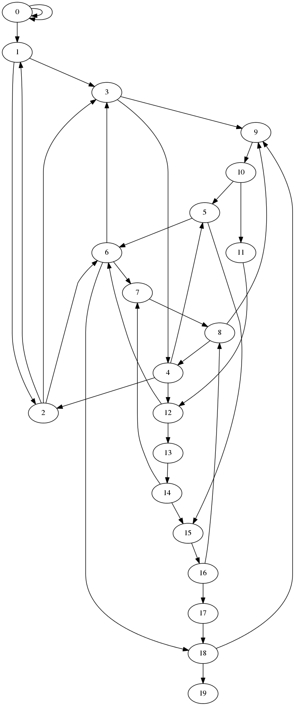

The full graph

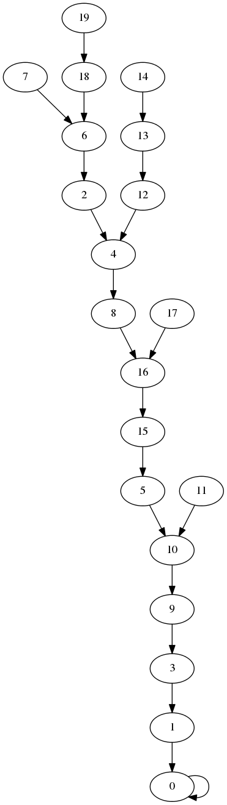

DFS tree

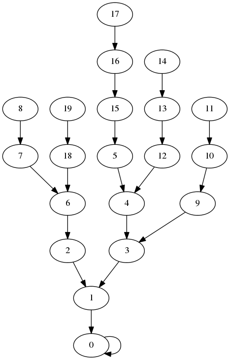

BFS tree

#### 5.14.5.2 Combined implementation of depth-first and breadth-first search

These are some older implementations of BFS and DFS that demonstrate how both can be written using the same code just by changing the behavior of the core data structure. This also demonstrates how to construct DFS iteratively; for BFS, the [preceding implementation](#graphSearchImplementation) is better in every respect.

    /* Typical usage:
     *
     *    struct searchInfo *s;
     *    int n;
     *
     *    s = searchInfoCreate(g);
     *
     *    n = graph_vertices(g);
     *    for(i = 0; i < n; i++) {
     *        dfs(s, i);
     *    }
     *
     *    ... use results in s ...
     *
     *    searchInfoDestroy(s);
     *
     */
    
    /* summary information per node for dfs and bfs */
    /* this is not intended to be opaque---user can read it */
    /* (but should not write it!) */
    
    #define SEARCH_INFO_NULL (-1) /* for empty slots */
    
    struct searchInfo {
        Graph graph;
        int reached;        /* count of reached nodes */
        int *preorder;      /* list of nodes in order first reached */
        int *time;          /* time[i] == position of node i in preorder list */
        int *parent;        /* parent in DFS or BFS forest */
        int *depth;         /* distance from root */
    };
    
    /* allocate and initialize search results structure */
    /* you need to do this before passing it to dfs or bfs */
    struct searchInfo *searchInfoCreate(Graph g);
    
    /* free searchInfo data---does NOT free graph pointer */
    void searchInfoDestroy(struct searchInfo *);
    
    /* perform depth-first search starting at root, updating results */
    void dfs(struct searchInfo *results, int root);
    
    /* perform breadth-first search starting at root, updating results */
    void bfs(struct searchInfo *results, int root);

[examples/graphs/genericSearch.h](examples/graphs/genericSearch.h)

    #include <stdlib.h>
    #include <assert.h>
    
    #include "graph.h"
    #include "genericSearch.h"
    
    /* create an array of n ints initialized to SEARCH_INFO_NULL */
    static int *
    createEmptyArray(int n)
    {
        int *a;
        int i;
    
        a = malloc(sizeof(*a) * n);
        assert(a);
    
        for(i = 0; i < n; i++) {
            a[i] = SEARCH_INFO_NULL;
        }
    
        return a;
    }
    
    /* allocate and initialize search results structure */
    /* you need to do this before passing it to dfs or bfs */
    struct searchInfo *
    searchInfoCreate(Graph g)
    {
        struct searchInfo *s;
        int n;
    
        s = malloc(sizeof(*s));
        assert(s);
    
        s->graph = g;
        s->reached = 0;
    
        n = graphVertexCount(g);
    
        s->preorder = createEmptyArray(n);
        s->time = createEmptyArray(n);
        s->parent = createEmptyArray(n);
        s->depth = createEmptyArray(n);
    
        return s;
    } 
    
    /* free searchInfo data---does NOT free graph pointer */
    void
    searchInfoDestroy(struct searchInfo *s)
    {
        free(s->depth);
        free(s->parent);
        free(s->time);
        free(s->preorder);
        free(s);
    }
    
    /* used inside search routines */
    struct edge {
        int u;          /* source */
        int v;          /* sink */
    };
    
    /* stack/queue */
    struct queue {
        struct edge *e;
        int bottom;
        int top;
    };
    
    static void
    pushEdge(Graph g, int u, int v, void *data)
    {
        struct queue *q;
    
        q = data;
    
        assert(q->top < graphEdgeCount(g) + 1);
    
        q->e[q->top].u = u;
        q->e[q->top].v = v;
        q->top++;
    }
    
    /* this rather horrible function implements dfs if useQueue == 0 */
    /* and bfs if useQueue == 1 */
    static void
    genericSearch(struct searchInfo *r, int root, int useQueue)
    {
        /* queue/stack */
        struct queue q;
    
        /* edge we are working on */
        struct edge cur;
    
        /* start with empty q */
        /* we need one space per edge */
        /* plus one for the fake (root, root) edge */
        q.e = malloc(sizeof(*q.e) * (graphEdgeCount(r->graph) + 1));
        assert(q.e);
    
        q.bottom = q.top = 0;
    
        /* push the root */
        pushEdge(r->graph, root, root, &q);
    
        /* while q.e not empty */
        while(q.bottom < q.top) {
            if(useQueue) {
                cur = q.e[q.bottom++];
            } else {
                cur = q.e[--q.top];
            }
    
            /* did we visit sink already? */
            if(r->parent[cur.v] != SEARCH_INFO_NULL) continue;
    
            /* no */
            assert(r->reached < graphVertexCount(r->graph));
            r->parent[cur.v] = cur.u;
            r->time[cur.v] = r->reached;
            r->preorder[r->reached++] = cur.v;
            if(cur.u == cur.v) {
                /* we could avoid this if we were certain SEARCH_INFO_NULL */
                /* would never be anything but -1 */
                r->depth[cur.v] = 0;
            } else {
                r->depth[cur.v] = r->depth[cur.u] + 1;
            }
    
            /* push all outgoing edges */
            graphForeach(r->graph, cur.v, pushEdge, &q);
        }
    
        free(q.e);
    }
    
    void
    dfs(struct searchInfo *results, int root)
    {
        genericSearch(results, root, 0);
    }
    
    void
    bfs(struct searchInfo *results, int root)
    {
        genericSearch(results, root, 1);
    }

[examples/graphs/genericSearch.c](examples/graphs/genericSearch.c)

And here is some test code: [genericSearchTest.c](examples/graphs/genericSearchTest.c). You will need to compile `genericSearchTest.c` together with both `genericSearch.c` and `graph.c` to get it to work. This [Makefile](examples/graphs/Makefile) will do this for you.

#### 5.14.5.3 Other variations on the basic algorithm

Stacks and queues are not the only options for the bucket in the generic search algorithm. Some other choices are:

*   A [priority queue](#priorityQueues) keyed by edge weights. If the edges have **weights**, the generic tree-builder can be used to find a tree containing _s_ with minimum total edge weight.[22](#fn22) The basic idea is to always pull out the lightest edge. The resulting algorithm runs in _O_(_n_ + _m_log _m_) time (since each heap operation takes _O_(log _m_) time), and is known as **Prim’s algorithm**. See [Prim’s algorithm](http://en.wikipedia.org/wiki/Prim%27s_algorithm "WikiPedia") for more details.
*   A priority queue keyed by path lengths. Here we assume that edges have **lengths**, and we want to build a shortest-path tree where the length of the path is no longer just the number of edges it contains but the sum of their weights. The basic idea is to keep track of the distance from the root to each node in the tree, and assign each edge a key equal to the sum of the distance to its source and its length. The resulting search algorithm, known as **Dijkstra’s algorithm**, will give a shortest-path tree if all the edge weights are non-negative. See [Dijkstra’s algorithm](http://en.wikipedia.org/wiki/Dijkstra%27s_algorithm "WikiPedia").

5.15 Dynamic programming
------------------------

**Dynamic programming** is a general-purpose [algorithm design technique](#algorithmDesignTechniques) that is most often used to solve **combinatorial optimization** problems, where we are looking for the best possible input to some function chosen from an exponentially large search space.

There are two parts to dynamic programming. The first part is a programming technique: dynamic programming is essentially [divide and conquer](#algorithmDesignTechniquesClassification) run in reverse: we solve a big instance of a problem by breaking it up recursively into smaller instances; but instead of carrying out the computation recursively from the top down, we start from the bottom with the smallest instances of the problem, solving each increasingly large instance in turn and storing the result in a table. The second part is a design principle: in building up our table, we are careful always to preserve alternative solutions we may need later, by delaying commitment to particular choices to the extent that we can.

The bottom-up aspect of dynamic programming is most useful when a straightforward recursion would produce many duplicate subproblems. It is most efficient when we can enumerate a class of subproblems that doesn’t include too many extraneous cases that we don’t need for our original problem.

To take a simple example, suppose that we want to compute the _n_\-th Fibonacci number using the defining recurrence

*   _F_(_n_) = _F_(_n_ − 1) + _F_(_n_ − 2)
*   _F_(1) = _F_(0) = 1.

A naive approach would simply code the recurrence up directly:

    int
    fib(int n)
    {
        if(n < 2) {
            return 1
        } else {
            return fib(n-1) + fib(n-2);
        }
    }

The running time of this procedure is easy to compute. The recurrence is

*   _T_(_n_) = _T_(_n_ − 1) + _T_(_n_ − 2) + _Θ_(1),

whose solution is _Θ_(_a__n_) where _a_ is the golden ratio 1.6180339887498948482…. This is badly exponential.[23](#fn23)

### 5.15.1 Memoization

The problem is that we keep recomputing values of `fib` that we’ve already computed. We can avoid this by **memoization**, where we wrap our recursive solution in a **memoizer** that stores previously-computed solutions in a [hash table](#hashTables). Sensible programming languages will let you write a memoizer once and apply it to arbitrary recursive functions. In less sensible programming languages it is usually easier just to embed the memoization in the function definition itself, like this:

    int
    memoFib(int n)
    {
        int ret;
    
        if(hashContains(FibHash, n)) {
            return hashGet(FibHash, n);
        } else {
            ret = memoFib(n-1) + memoFib(n-2);
            hashPut(FibHash, n, ret);
            return ret;
        }
    }

The assumption here is that `FibHash` is a global hash table that we have initialized to map `0` and `1` to `1`. The total cost of running this procedure is _O_(_n_), because `fib` is called at most twice for each value _k_ in 0…_n_.

Memoization is a very useful technique in practice, but it is not popular with algorithm designers because computing the running time of a complex memoized procedure is often much more difficult than computing the time to fill a nice clean table. The use of a hash table instead of an array may also add overhead (and code complexity) that comes out in the constant factors. But it is always the case that a memoized recursive procedure considers no more subproblems than a table-based solution, and it may consider many fewer if we are sloppy about what we put in our table (perhaps because we can’t easily predict what subproblems will be useful).

### 5.15.2 Dynamic programming

Dynamic programming comes to the rescue. Because we know what smaller cases we have to reduce F(n) to, instead of computing F(n) top-down, we compute it bottom-up, hitting all possible smaller cases and storing the results in an array:

    int
    fib2(int n)
    {
        int *a;
        int i;
        int ret;
        
        if(n < 2) {
            return 1;
        } else {
            a = malloc(sizeof(*a) * (n+1));
            assert(a);
    
            a[1] = a[2] = 1;
    
            for(i = 3; i <= n; i++) {
                a[i] = a[i-1] + a[i-2];
            }
        }
    
        ret = a[n];
        free(a);
        return ret;
    }

Notice the recurrence is exactly the same in this version as in our original recursive version, except that instead of computing F(n-1) and F(n-2) recursively, we just pull them out of the array. This is typical of dynamic-programming solutions: often the most tedious editing step in converting a recursive algorithm to dynamic programming is changing parentheses to square brackets. As with memoization, the effect of this conversion is dramatic; what used to be an exponential-time algorithm is now linear-time.

#### 5.15.2.1 More examples

##### 5.15.2.1.1 Longest increasing subsequence

Suppose that we want to compute the **longest increasing subsequence** of an array. This is a sequence, not necessarily contiguous, of elements from the array such that each is strictly larger than the one before it. Since there are 2_n_ different subsequences of an _n_\-element array, the brute-force approach of trying all of them might take a while.

What makes this problem suitable for dynamic programming is that any prefix of a longest increasing subsequence is a longest increasing subsequence of the part of the array that ends where the prefix ends; if it weren’t, we could make the big sequence longer by choosing a longer prefix. So to find the longest increasing subsequence of the whole array, we build up a table of longest increasing subsequences for each initial prefix of the array. At each step, when finding the longest increasing subsequence of elements 0…_i_, we can just scan through all the possible values for the second-to-last element and read the length of the best possible subsequence ending there out of the table. When the table is complete, we can scan for the best last element and then work backwards to reconstruct the actual subsequence.

This last step requires some explanation. We don’t really want to store in `table[i]` the full longest increasing subsequence ending at position `i`, because it may be very big. Instead, we store the index of the second-to-last element of this sequence. Since that second-to-last element also has a table entry that stores the index of its predecessor, by following the indices we can generate a subsequence of length _O_(_n_), even though we only stored _O_(1) pieces of information in each table entry. This is similar to the parent pointer technique used in [graph search algorithms](#graphSearch).

Here’s what the code looks like:

    /* compute a longest strictly increasing subsequence of an array of ints */
    /* input is array a with given length n */
    /* returns length of LIS */
    /* If the output pointer is non-null, writes LIS to output pointer. */
    /* Caller should provide at least sizeof(int)*n space for output */
    /* If there are multiple LIS's, which one is returned is arbitrary. */
    unsigned long
    longest_increasing_subsequence(const int a[], unsigned long n, int *output);

[examples/dynamicProgramming/lis/lis.h](examples/dynamicProgramming/lis/lis.h)

    #include <stdlib.h>
    #include <assert.h>
    
    #include "lis.h"
    
    unsigned long
    longest_increasing_subsequence(const int a[], unsigned long n, int *output)
    {
        struct lis_data {
            unsigned long length;             /* length of LIS ending at this point */
            unsigned long prev;               /* previous entry in the LIS ending at this point */
        } *table;
    
        unsigned long best;      /* best entry in table */
        unsigned long scan;      /* used to generate output */
    
        unsigned long i;            
        unsigned long j;
        unsigned long best_length;
    
        /* special case for empty table */
        if(n == 0) return 0;
    
        table = malloc(sizeof(*table) * n);
    
        for(i = 0; i < n; i++) {
            /* default best is just this element by itself */
            table[i].length = 1;
            table[i].prev = n;              /* default end-of-list value */
    
            /* but try all other possibilities */
            for(j = 0; j < i; j++) {
                if(a[j] < a[i] && table[j].length + 1 > table[i].length) {
                    /* we have a winner */
                    table[i].length = table[j].length + 1;
                    table[i].prev = j;
                }
            }
        }
    
        /* now find the best of the lot */
        best = 0;
    
        for(i = 1; i < n; i++) {
            if(table[i].length > table[best].length) {
                best = i;
            }
        }
    
        /* table[best].length is now our return value */
        /* save it so that we don't lose it when we free table */
        best_length = table[best].length;
    
        /* do we really have to compute the output? */
        if(output) {
            /* yes :-( */
            scan = best;
            for(i = 0; i < best_length; i++) {
                assert(scan >= 0);
                assert(scan < n);
    
                output[best_length - i - 1] = a[scan];
    
                scan = table[scan].prev;
            }
        }
    
        free(table);
    
        return best_length;
    }

[examples/dynamicProgramming/lis/lis.c](examples/dynamicProgramming/lis/lis.c)

A sample program that runs `longest_increasing_subsequence` on a list of numbers passed in by `stdin` is given in [test\_lis.c](examples/dynamicProgramming/lis/test_lis.c). Here is a [Makefile](examples/dynamicProgramming/lis/Makefile).

Implemented like this, the cost of finding an LIS is _O_(_n_2), because to compute each entry in the array, we have to search through all the previous entries to find the longest path that ends at a value less than the current one. This can be improved by using a more clever data structure. If we use a binary search tree that stores path keyed by the last value, and augment each node with a field that represents the maximum length of any path in the subtree under that node, then we can find the longest feasible path that we can append the current node to in _O_(log _n_) time instead of _O_(_n_) time. This brings the total cost down to only _O_(_n_log _n_).

##### 5.15.2.1.2 All-pairs shortest paths

Suppose we want to compute the distance between any two points in a graph, where each edge _u__v_ has a length ℓ_u__v_ ( + ∞ for edges not in the graph) and the distance between two vertices _s_ and t$ is the minimum over all _s_–_t_ paths of the total length of the edges. There are various algorithms for doing this for a particular _s_ and _t_, but there is also a very simple dynamic programming algorithm known as **Floyd-Warshall** that computes the distance between all _n_2 pairs of vertices in _Θ_(_n_3) time.

The assumption is that the graph does not contain a **negative cycle** (a cycle with total edge weight less than zero), so that for two connected nodes there is always a shortest path that uses each intermediate vertex at most once. If a graph does contain a negative cycle, the algorithm will detect it by reporting the distance from _i_ to _i_ less than zero for some _i_.

Negative cycles don’t generally exist in distance graphs (unless you have the ability to move faster than the speed of light), but they can come up in other contexts. One example would be in currency arbitrage, where each node is some currency, the weight of an edge _u__v_ is the logarithm of the exchange rate from _u_ to _v_, and the total weight of a path from _s_ to _t_ gives the logarithm of the number of units of _t_ you can get for one unit of _s_, since adding the logs along the path corresponds to multiplying all the exchange rates. In this context a negative cycle gives you a way to turn a dollar into less than a dollar by running it through various other currencies, which is not useful, but a _positive cycle_ lets you pay for the supercomputer you bought to find it before anybody else did. If we negate all the edge weights, we turn a positive cycle into a negative cycle, making a fast algorithm for finding this negative cycle potentially valuable.

However, if we don’t have any negative cycles, the idea is that we can create restricted instances of the shortest-path problem by limiting the maximum index of any node used on the path. Let _L_(_i_, _j_, _k_) be the length of a shortest path from _i_ to _j_ that uses only the vertices 0, …, _k_ − 1 along the path (not counting the endpoints _i_ and _j_, which can be anything). When _k_ = 0, this is just the length of the _i_–_j_ edge, or  + ∞ if there is no such edge. So we can start by computing _L_(_i_, _j_, 0) for all _i_. Now given _L_(_i_, _j_, _k_) for all _i_ and some _k_, we can compute _L_(_i_, _j_, _k_ + 1) by observing that any shortest _i_–_j_ path that has intermediate vertices in 0…_k_ either consists of a path with intermediate vertices in 0…_k_ − 1, or consists of a path from _i_ to _k_ followed by a path from _k_ to _j_, where both of these paths have intermediate vertices in 0…_k_ − 1. So we get

*   _L_(_i_, _j_, _k_ + 1) = min (_L_(_i_, _j_, _k_), _L_(_i_, _k_, _k_) + _L_(_k_, _j_, _k_).

Since this takes _O_(1) time to compute if we have previously computed _L_(_i_, _j_, _k_) for all _i_ and _j_, we can fill in the entire table in _O_(_n_3) time.

Implementation details:

*   If we want to reconstruct the shortest path in addition to computing its length, we can store the first vertex for each _i_–_j_ path. This will either be (a) the first vertex in the _i_–_j_ path for the previous _k_, or (b) the first vertex in the _i_–_k_ path.
*   We don’t actually need to use a full three-dimensional array. It’s enough to store one value for each pair _i_, _j_ and let _k_ be implicit. At each step we let _L_\[_i_\]\[_j_\] be min (_L_\[_i_\]\[_j_\], _L_\[_i_\]\[_k_\] + _L_\[_k_\]\[_j_\]). The trick is that we don’t care if _L_\[_i_\]\[_k_\] or _L_\[_k_\]\[_j_\] has already been updated, because that will only give us paths with a few extra _k_ vertices, which won’t be the shortest paths anyway assuming no negative cycles.

##### 5.15.2.1.3 Longest common subsequence

Given sequences of characters _v_ and _w_, _v_ is a _subsequence_ of _w_ if every character in _v_ appears in _w_ in the same order. For example, `aaaaa`, `brac`, and `badar` are all subsequences of `abracadabra`, but `badcar` is not. A longest common subsequence (LCS for short) of two sequences _x_ and _y_ is the longest sequence that is a subsequence of both: two longest common subsequences of `abracadabra` and `badcar` are `badar` and `bacar`.

As with longest increasing subsequence, one can find the LCS of two sequence by brute force, but it will take even longer. Not only are there are 2_n_ subsequences of a sequence of length _n_, but checking each subsequence of the first to see if it is also a subsequence of the second may take some time. It is better to solve the problem using dynamic programming. Having sequences gives an obvious linear structure to exploit: the basic strategy will be to compute LCSs for increasingly long prefixes of the inputs. But with two sequences we will have to consider prefixes of both, which will give us a two-dimensional table where rows correspond to prefixes of sequence _x_ and columns correspond to prefixes of sequence _y_.

The recursive decomposition that makes this technique work looks like this. Let _L_(_x_, _y_) be the length of the longest common subsequence of _x_ and _y_, where _x_ and _y_ are strings. Let _a_ and _b_ be single characters. Then _L_(_x__a_, _y__b_) is the maximum of:

*   _L_(_x_, _y_) + 1, if _a_ = _b_,
*   _L_(_x__a_, _y_), or
*   _L_(_x_, _y__b_).

The idea is that we either have a new matching character we couldn’t use before (the first case), or we have an LCS that doesn’t use one of _a_ or _b_ (the remaining cases). In each case the recursive call to LCS involves a shorter prefix of _x__a_ or _y__b_, with an ultimate base case _L_(_x_, _y_) = 0 if at least one of _x_ or _y_ is the empty string. So we can fill in these values in a table, as long as we are careful to make sure that the shorter prefixes are always filled first. If we are smart about remembering which case applies at each step, we can even go back and extract an actual LCS, by stitching together to places where _a_ = _b_. Here’s a short C program that does this:

    #include <stdio.h>
    #include <stdlib.h>
    #include <assert.h>
    #include <string.h>
    #include <limits.h>
    
    /* compute longest common subsequence of argv[1] and argv[2] */
    
    /* computes longest common subsequence of x and y, writes result to lcs */
    /* lcs should be pre-allocated by caller to 1 + minimum length of x or y */
    void
    longestCommonSubsequence(const char *x, const char *y, char *lcs)
    {
        int xLen;
        int yLen;
        int i;             /* position in x */
        int j;             /* position in y */
    
        xLen = strlen(x);
        yLen = strlen(y);
    
        /* best choice at each position */
        /* length gives length of LCS for these prefixes */
        /* prev points to previous substring */
        /* newChar if non-null is new character */
        struct choice {
            int length;
            struct choice *prev;
            char newChar;
        } best[xLen][yLen];
    
        for(i = 0; i < xLen; i++) {
            for(j = 0; j < yLen; j++) {
                /* we can always do no common substring */
                best[i][j].length = 0;
                best[i][j].prev = 0;
                best[i][j].newChar = 0;
    
                /* if we have a match, try adding new character */
                /* this is always better than the nothing we started with */
                if(x[i] == y[j]) {
                    best[i][j].newChar = x[i];
                    if(i > 0 && j > 0) {
                        best[i][j].length = best[i-1][j-1].length + 1;
                        best[i][j].prev = &best[i-1][j-1];
                    } else {
                        best[i][j].length = 1;
                    }
                }
    
                /* maybe we can do even better by ignoring a new character */
                if(i > 0 && best[i-1][j].length > best[i][j].length) {
                    /* throw away a character from x */
                    best[i][j].length = best[i-1][j].length;
                    best[i][j].prev = &best[i-1][j];
                    best[i][j].newChar = 0;
                }
    
                if(j > 0 && best[i][j-1].length > best[i][j].length) {
                    /* throw away a character from x */
                    best[i][j].length = best[i][j-1].length;
                    best[i][j].prev = &best[i][j-1];
                    best[i][j].newChar = 0;
                }
    
            }
        }
    
        /* reconstruct string working backwards from best[xLen-1][yLen-1] */
        int outPos;        /* position in output string */
        struct choice *p;  /* for chasing linked list */
    
        outPos = best[xLen-1][yLen-1].length;
        lcs[outPos--] = '\0';
    
        for(p = &best[xLen-1][yLen-1]; p; p = p->prev) {
            if(p->newChar) {
                assert(outPos >= 0);
                lcs[outPos--] = p->newChar;
            }
        }
    }
    
    int
    main(int argc, char **argv)
    {
        if(argc != 3) {
            fprintf(stderr, "Usage: %s string1 string2\n", argv[0]);
            return 1;
        }
    
        char output[strlen(argv[1]) + 1];
    
        longestCommonSubsequence(argv[1], argv[2], output);
    
        printf("\"%s\" (%zu characters)\n", output, strlen(output));
    
        return 0;
    }

[examples/dynamicProgramming/lcs/lcs.c](examples/dynamicProgramming/lcs/lcs.c)

The whole thing takes _O_(_n__m_) time where _n_ and _m_ are the lengths of _A_ and _B_.

5.16 Randomization
------------------

Randomization is a fundamental technique in algorithm design, that allows programs to run quickly when the average-case behavior of an algorithm is better than the worst-case behavior. It is also heavily used in games, both in entertainment and gambling. The latter application gives the only example I know of a [programmer who died from writing bad code](http://www.zdnet.com/article/comdex-99-the-mysterious-death-of-larry-volk/), which shows how serious good random-number generation is.

### 5.16.1 Generating random values in C

If you want random values in a C program, there are three typical ways of getting them, depending on how good (i.e. uniform, uncorrelated, and unpredictable) you want them to be.

#### 5.16.1.1 The `rand` function from the standard library

E.g.

    #include <stdio.h>
    #include <stdlib.h>
    
    int
    main(int argc, char **argv)
    {
        printf("%d\n", rand());
        return 0;
    }

[examples/randomization/randOnce.c](examples/randomization/randOnce.c)

The `rand` function, declared in `stdlib.h`, returns a random-looking integer in the range 0 to `RAND_MAX` (inclusive) every time you call it. On machines using the GNU C library `RAND_MAX` is equal to `INT_MAX` which is typically 231 − 1, but `RAND_MAX` may be as small as 32767. There are no particularly strong guarantees about the quality of random numbers that `rand` returns, but it should be good enough for casual use, and it has the advantage that as part of the C standard you can assume it is present almost everywhere.

Note that `rand` is a **pseudorandom number generator**: the sequence of values it returns is predictable if you know its starting state (and is still predictable from past values in the sequence even if you don’t know the starting state, if you are clever enough). It is also the case that the initial seed is fixed, so that the program above will print the same value every time you run it.

This is a feature: it permits debugging randomized programs. As John von Neumann, who proposed pseudorandom number generators in his 1946 talk “Various Techniques Used in Connection With Random Digits,” explained:

> We see then that we could build a physical instrument to feed random digits directly into a high-speed computing machine and could have the control call for these numbers as needed. The real objection to this procedure is the practical need for checking computations. If we suspect that a calculation is wrong, almost any reasonable check involves repeating something done before. At that point the introduction of new random numbers would be intolerable.

##### 5.16.1.1.1 Supplying a seed with `srand`

If you want to get different sequences, you need to **seed** the random number generator using `srand`. A typical use might be:

    #include <stdio.h>
    #include <stdlib.h>
    #include <time.h>
    
    int
    main(int argc, char **argv)
    {
        srand(time(0));
        printf("%d\n", rand());
        return 0;
    }

[examples/randomization/srandFromTime.c](examples/randomization/srandFromTime.c)

Here `time(0)` returns the number of seconds since the epoch (00:00:00 UTC, January 1, 1970, for POSIX systems, not counting leap seconds). Note that this still might give repeated values if you run it twice in the same second, and it’s extremely dangerous if you expect to distribute your code to a lot of people who want different results, since two of your users _are_ likely to run it twice in the same second. See the discussion of `/dev/urandom` below for a better method.

#### 5.16.1.2 Better pseudorandom number generators

There has been quite a bit of research on pseudorandom number generators over the years, and much better pseudorandom number generators than `rand` are available. Currently, the most widely used pseudorandom random number generator is **Mersenne Twister**, which runs about 4 times faster than `rand` in its standard C implementation and passes a much wider battery of statistical tests. Its English-language home page is at [http://www.math.sci.hiroshima-u.ac.jp/~m-mat/MT/emt.html](http://www.math.sci.hiroshima-u.ac.jp/~m-mat/MT/emt.html). As with `rand`, you still need to provide an initial seed value.

There are also **cryptographically secure pseudorandom number generators**, of which the most famous is [Blum Blum Shub](http://en.wikipedia.org/wiki/Blum_Blum_Shub "WikiPedia"). These cannot be predicted based on their output if seeded with a true random value (under certain cryptographic assumptions: hardness of factoring for Blum Blum Shub). Unfortunately, cryptographic PRNGs are usually too slow for day-to-day use.

#### 5.16.1.3 Random numbers without the pseudo

If you really need actual random numbers and are on a Linux or BSD-like operating system, you can use the special device files `/dev/random` and `/dev/urandom`. These can be opened for reading like ordinary files, but the values read from them are a random sequence of bytes (including null characters). A typical use might be:

    #include <stdio.h>
    
    int
    main(int argc, char **argv)
    {
        unsigned int randval;
        FILE *f;
    
        f = fopen("/dev/random", "r");
        fread(&randval, sizeof(randval), 1, f);
        fclose(f);
    
        printf("%u\n", randval);
    
        return 0;
    }

[examples/randomization/devRandom.c](examples/randomization/devRandom.c)

(A similar construction can also be used to obtain a better initial seed for `srand` than `time(0)`.)

Both `/dev/random` and `/dev/urandom` derive their random bits from physically random properties of the computer, like time between keystrokes or small variations in hard disk rotation speeds. The difference between the two is that `/dev/urandom` will always give you some random-looking bits, even if it has to generate extra ones using a cryptographic pseudo-random number generator, while `/dev/random` will only give you bits that it is confident are in fact random. Since your computer only generates a small number of genuinely random bits per second, this may mean that `/dev/random` will exhaust its pool if read too often. In this case, a read on `/dev/random` will block (just like reading a terminal with no input on it) until the pool has filled up again.

Neither `/dev/random` nor `/dev/urandom` is known to be secure against a determined attacker, but they are about the best you can do without resorting to specialized hardware.

#### 5.16.1.4 Range issues

The problem with `rand` is that getting a uniform value between 0 and 231 − 1 may not be what you want. It could be that `RAND_MAX` is be too small; in this case, you may have to call `rand` more than once and paste together the results. But there can be problems with `RAND_MAX` even if it is bigger than the values you want.

For example, suppose you want to simulate a die roll for your video craps machine, but you don’t want to get whacked by Johnny “The Debugger” when the Nevada State Gaming Commission notices that 6-6 is coming up slightly less often than it’s supposed to. A natural thing to try would be to take the output of `rand` mod 6:

    int d6(void) {
        return rand() % 6 + 1;
    }

The problem here is that there are 231 outputs from rand, and 6 doesn’t divide 231. So 1 and 2 are slightly more likely to come up than 3, 4, 5, or 6. This can be particularly noticeable if we want a uniform variable from a larger range, e.g. \[0…⌊(2/3) ⋅ 231⌋\].

We can avoid this with a technique called **rejection sampling**, where we reject excess parts of the output range of `rand`. For rolling a die, the trick is to reject anything in the last extra bit of the range that is left over after the largest multiple of the die size. Here’s a routine that does this, returning a uniform value in the range 0 to n-1 for any positive n, together with a program that demonstrates its use for rolling dice:

    #include <stdio.h>
    #include <stdlib.h>
    #include <assert.h>
    #include <time.h>
    
    /* return a uniform random value in the range 0..n-1 inclusive */
    int
    randRange(int n)
    {
        int limit;
        int r;
    
        limit = RAND_MAX - (RAND_MAX % n);
    
        while((r = rand()) >= limit);
    
        return r % n;
    }
    
    int
    main(int argc, char **argv)
    {
        int i;
    
        srand(time(0));
    
        for(i = 0; i < 40; i++) {
            printf("%d ", randRange(6)+1);
        }
    
        putchar('\n');
    
        return 0;
    }

[examples/randomization/randRange.c](examples/randomization/randRange.c)

More generally, rejection sampling can be used to get random values with particular properties, where it’s hard to generate a value with that property directly. Here’s a program that generates random primes:

    #include <stdio.h>
    #include <stdlib.h>
    #include <assert.h>
    #include <time.h>
    
    /* return 1 if n is prime */
    int
    isprime(int n)
    {
        int i;
    
        if(n % 2 == 0 || n == 1) { return 0; }
    
        for(i = 3; i*i <= n; i += 2) {
            if(n % i == 0) { return 0; }
        }
    
        return 1;
    }
    
    /* return a uniform random value in the range 0..n-1 inclusive */
    int
    randPrime(void)
    {
        int r;
    
        /* extra parens avoid warnings */
        while(!isprime((r = rand())));
    
        return r;
    }
    
    int
    main(int argc, char **argv)
    {
        int i;
    
        srand(time(0));
    
        for(i = 0; i < 10; i++) {
            printf("%d\n", randPrime());
        }
    
        return 0;
    }

[examples/randomization/randPrime.c](examples/randomization/randPrime.c)

One temptation to avoid is to re-use your random values. If, for example, you try to find a random prime by picking a random x and trying x, x+1, x+2, etc., until you hit a prime, some primes are more likely to come up than others.

### 5.16.2 Randomized algorithms

Randomized algorithms typically make random choices to get good average worst-case performance in situations where a similar deterministic algorithm would fail badly for some inputs but perform well on most inputs. The idea is that the randomization scrambles the input space so that the adversary can’t predict which possible input values will be bad for us. This still allows it to make trouble if it gets lucky, but most of the time our algorithm should run quickly.

#### 5.16.2.1 Randomized search

This is essentially rejection sampling in disguise. Suppose that you want to find one of many needles in a large haystack. One approach is to methodically go through the straws/needles one at a time until you find a needle. But you may find that your good friend the adversary has put all the needles at the end of your list. Picking candidate at random is likely to hit a needle faster if there are many of them.

Here is a (silly) routine that quickly finds a number whose high-order bits match a particular pattern:

    int
    matchBits(int pattern)
    {
        int r;
    
        while(((r = rand()) & 0x70000000) != (pattern & 0x70000000));
    
        return r;
    }

This will find a winning value in 8 tries on average. In contrast, this deterministic version will take a lot longer for nonzero patterns:

    int
    matchBitsDeterministic(int pattern)
    {
        int i;
    
        for(i = 0; (i & 0x70000000) != (pattern & 0x70000000); i++);
    
        return i;
    }

The downside of the randomized approach is that it’s hard to tell when to quit if there are no matches; if we stop after some fixed number of trials, we get a [Monte Carlo algorithm](http://en.wikipedia.org/wiki/Monte_Carlo_algorithm "WikiPedia") that may give the wrong answer with small probability. The usual solution is to either accept a small probability of failure, or interleave a deterministic backup algorithm that always works. The latter approach gives a [Las Vegas algorithm](http://en.wikipedia.org/wiki/Las_Vegas_algorithm "WikiPedia") whose running time is variable but whose correctness is not.

#### 5.16.2.2 Quickselect and quicksort

**Quickselect**, or **Hoare’s FIND** (Hoare, C. A. R. Algorithm 65: FIND, CACM 4(7):321–322, July 1961), is an algorithm for quickly finding the _k_\-th largest element in an unsorted array of _n_ elements. It runs in _O_(_n_) time on average, which is the best one can hope for (we have to look at every element of the array to be sure we didn’t miss a small one that changes our answer) and better than the _O_(_n_log _n_) time we get if we sort the array first using a comparison-based sorting algorithm.

The idea is to pick a random pivot and divide the input into two piles, each of which is likely to be roughly a constant fraction of the size of the original input.[24](#fn24) It takes O(n) time to split the input up (we have to compare each element to the pivot once), and in the recursive calls this gives a geometric series. We can even do the splitting up in place if we are willing to reorder the elements of our original array.

If we recurse into both piles instead of just one, we get **quicksort** (Hoare, C. A. R. Algorithm 64: Quicksort. CACM 4(7):321, July 1961), a very fast and simple comparison-based sorting algorithm. Here is an implementation of both algorithms:

    #include <stdio.h>
    #include <stdlib.h>
    #include <assert.h>
    
    /* reorder an array to put elements <= pivot
     * before elements > pivot.
     * Returns number of elements <= pivot */
    static int
    splitByPivot(int n, int *a, int pivot)
    {
        int lo;
        int hi;
        int temp;  /* for swapping */
    
        assert(n >= 0);
    
        /* Dutch Flag algorithm */
        /* swap everything <= pivot to bottom of array */
        /* invariant is i < lo implies a[i] <= pivot */
        /* and i > hi implies a[i] > pivot */
        lo = 0;
        hi = n-1;
    
        while(lo <= hi) {
            if(a[lo] <= pivot) {
                lo++;
            } else {
                temp = a[hi];
                a[hi--] = a[lo];
                a[lo] = temp;
            }
        }
    
        return lo;
    }
    
    /* find the k-th smallest element of an n-element array */
    /* may reorder elements of the original array */
    int
    quickselectDestructive(int k, int n, int *a)
    {
        int pivot;
        int lo;
    
        assert(0 <= k);
        assert(k < n);
    
        if(n == 1) { 
            return a[0];
        }
        
        /* else */
        pivot = a[rand() % n];   /* we will tolerate non-uniformity */
    
        lo = splitByPivot(n, a, pivot);
    
        /* lo is now number of values <= pivot */
        if(k < lo) {
            return quickselectDestructive(k, lo, a);
        } else {
            return quickselectDestructive(k - lo, n - lo, a + lo);
        }
    }
    
    /* sort an array in place */
    void
    quickSort(int n, int *a)
    {
        int pivot;
        int lo;
    
        if(n <= 1) { 
            return;
        }
        
        /* else */
        pivot = a[rand() % n];   /* we will tolerate non-uniformity */
    
        lo = splitByPivot(n, a, pivot);
    
        quickSort(lo, a);
        quickSort(n - lo, a + lo);
    }
    
    
    /* shuffle an array */
    void
    shuffle(int n, int *a)
    {
        int i;
        int r;
        int temp;
    
        for(i = n - 1; i > 0; i--) {
            r = rand() % i;
            temp = a[r];
            a[r] = a[i];
            a[i] = temp;
        }
    }
    
    #define N (1024)
    
    int
    main(int argc, char **argv)
    {
        int a[N];
        int i;
    
        srand(0);  /* use fixed value for debugging */
    
        for(i = 0; i < N; i++) {
            a[i] = i;
        }
    
        shuffle(N, a);
    
        for(i = 0; i < N; i++) {
            assert(quickselectDestructive(i, N, a) == i);
        }
    
        shuffle(N, a);
    
        quickSort(N, a);
    
        for(i = 0; i < N; i++) {
            assert(a[i] == i);
        }
    
        return 0;
    }

[examples/randomization/quick.c](examples/randomization/quick.c)

### 5.16.3 Randomized data structures

Suppose we insert _n_ elements into an initially-empty binary search tree in random order with no rebalancing. Then each element is equally likely to be the root, and all the elements less than the root end up in the left subtree, while all the elements greater than the root end up in the right subtree, where they are further partitioned recursively. This is exactly what happens in quicksort, so the structure of the tree will exactly mirror the structure of an execution of quicksort. In particular, the average depth of a node will be _O_(log _n_), giving us the same expected search cost as in a balanced binary tree.

The problem with this approach is that we don’t have any guarantees that the input will be supplied in random order, and in the worst case we end up with a linked list. The solution is to put the randomization into the algorithm itself, making the structure of the tree depend on random choices made by the program itself.

#### 5.16.3.1 Skip lists

A **skip list** ([Pugh, 1990](ftp://ftp.cs.umd.edu/pub/skipLists/skiplists.pdf)) is a randomized tree-like data structure based on linked lists. It consists of a level 0 list that is an ordinary sorted linked list, together with higher-level lists that contain a random sampling of the elements at lower levels. When inserted into the level i list, an element flips a coin that tells it with probability p to insert itself in the level i+1 list as well.

Searches in a skip list are done by starting in the highest-level list and searching forward for the last element whose key is smaller than the target; the search then continues in the same way on the next level down. The idea is that the higher-level lists act as express lanes to get us to our target value faster. To bound the expected running time of a search, it helps to look at this process backwards; the reversed search path starts at level 0 and continues going backwards until it reaches the first element that is also in a higher level; it then jumps to the next level up and repeats the process. On average, we hit 1 + 1/_p_ nodes at each level before jumping back up; for constant _p_ (e.g. 1/2), this gives us _O_(log _n_) steps for the search.

The space per element of a skip list also depends on _p_. Every element has at least one outgoing pointer (on level 0), and on average has exactly 1/(1 − _p_) expected pointers. So the space cost can also be adjusted by adjusting _p_. For example, if space is at a premium, setting _p_ = 1/10 produces 10/9 pointers per node on average—not much more than in a linked list—but still gives _O_(log _n_) search time.

Below is an implementation of a skip list. To avoid having to allocate a separate array of pointers for each element, we put a length-1 array at the end of `struct skiplist` and rely on C’s lack of bounds checking to make the array longer if necessary. An empty head element stores pointers to all the initial elements in each level of the skip list; it is given the fake key `INT_MIN` so that searches for values less than any in the list will report this value. Aside from these nasty tricks, the code for search and insertion is pretty straightforward. Code for deletion is a little more involved, because we have to make sure that we delete the leftmost copy of a key if there are duplicates (an alternative would be to modify `skiplistInsert` to ignore duplicates).

    #include <stdlib.h>
    #include <assert.h>
    #include <limits.h>
    
    #include "skiplist.h"
    
    #define MAX_HEIGHT (32)
    
    struct skiplist {
        int key;
        int height;                /* number of next pointers */
        struct skiplist *next[1];  /* first of many */
    };
    
    /* choose a height according to a geometric distribution */
    static int
    chooseHeight(void)
    {
        int i;
    
        for(i = 1; i < MAX_HEIGHT && rand() % 2 == 0; i++); 
    
        return i;
    }
    
    /* create a skiplist node with the given key and height */
    /* does not fill in next pointers */
    static Skiplist
    skiplistCreateNode(int key, int height)
    {
        Skiplist s;
    
        assert(height > 0);
        assert(height <= MAX_HEIGHT);
    
        s = malloc(sizeof(struct skiplist) + sizeof(struct skiplist *) * (height - 1));
    
        assert(s);
    
        s->key = key;
        s->height = height;
    
        return s;
    }
    
    /* create an empty skiplist */
    Skiplist
    skiplistCreate(void)
    {
        Skiplist s;
        int i;
    
        /* s is a dummy head element */
        s = skiplistCreateNode(INT_MIN, MAX_HEIGHT);
    
        /* this tracks the maximum height of any node */
        s->height = 1;
    
        for(i = 0; i < MAX_HEIGHT; i++) {
            s->next[i] = 0;
        }
    
        return s;
    }
    
    /* free a skiplist */
    void
    skiplistDestroy(Skiplist s)
    {
        Skiplist next;
    
        while(s) {
            next = s->next[0];
            free(s);
            s = next;
        }
    }
    
    /* return maximum key less than or equal to key */
    /* or INT_MIN if there is none */
    int
    skiplistSearch(Skiplist s, int key)
    {
        int level;
    
        for(level = s->height - 1; level >= 0; level--) {
            while(s->next[level] && s->next[level]->key <= key) {
                s = s->next[level];
            }
        }
    
        return s->key;
    }
    
    /* insert a new key into s */
    void
    skiplistInsert(Skiplist s, int key)
    {
        int level;
        Skiplist elt;
    
        elt = skiplistCreateNode(key, chooseHeight());
    
        assert(elt);
    
        if(elt->height > s->height) {
            s->height = elt->height;
        }
    
        /* search through levels taller than elt */
        for(level = s->height - 1; level >= elt->height; level--) {
            while(s->next[level] && s->next[level]->key < key) {
                s = s->next[level];
            }
        }
    
        /* now level is elt->height - 1, we can start inserting */
        for(; level >= 0; level--) {
            while(s->next[level] && s->next[level]->key < key) {
                s = s->next[level];
            }
    
            /* s is last entry on this level < new element */
            /* do list insert */
            elt->next[level] = s->next[level];
            s->next[level] = elt;
        }
    }
    
    /* delete a key from s */
    void 
    skiplistDelete(Skiplist s, int key)
    {
        int level;
        Skiplist target;
    
        /* first we have to find leftmost instance of key */
        target = s;
    
        for(level = s->height - 1; level >= 0; level--) {
            while(target->next[level] && target->next[level]->key < key) {
                target = target->next[level];
            }
        }
    
        /* take one extra step at bottom */
        target = target->next[0];
    
        if(target == 0 || target->key != key) {
            return;
        }
    
        /* now we found target, splice it out */
        for(level = s->height - 1; level >= 0; level--) {
            while(s->next[level] && s->next[level]->key < key) {
                s = s->next[level];
            }
    
            if(s->next[level] == target) {
                s->next[level] = target->next[level];
            }
        }
    
        free(target);
    }

[examples/trees/skiplist/skiplist.c](examples/trees/skiplist/skiplist.c)

Here is the header file, Makefile, and test code: [skiplist.h](examples/trees/skiplist/skiplist.h), [Makefile](examples/trees/skiplist/Makefile), [test\_skiplist.c](examples/trees/skiplist/test_skiplist.c).

#### 5.16.3.2 Universal hash families

Randomization can also be useful in hash tables. Recall that in building a hash table, we are relying on the hash function to spread out bad input distributions over the indices of our array. But for any fixed hash function, in the worst case we may get inputs where every key hashes to the same location. **Universal hashing** ([Carter and Wegman, 1979](http://dx.doi.org/10.1016%2F0022-0000%2879%2990044-8)) solves this problem by choosing a hash function at random. We may still get unlucky and have the hash function hash all our values to the same location, but now we are relying on the random number generator to be nice to us instead of the adversary. We can also rehash with a new random hash function if we find out that the one we are using is bad.

The problem here is that we can’t just choose a function uniformly at random out of the set of all possible hash functions, because there are too many of them, meaning that we would spend more space representing our hash function than we would on the table. The solution is to observe that we don’t need our hash function h to be truly random; it’s enough if the probability of collision Pr\[h(x) = h(y)\] for any fixed keys _x_ ≠ _y_ is 1/_m_, where _m_ is the size of the hash table. The reason is that the cost of searching for x (with chaining) is linear in the number of keys already in the table that collide with it. The expected number of such collisions is the sum of Pr\[h(x) = h(y)\] over all keys y in the table, or n/m if we have n keys. So this pairwise collision probability bound is enough to get the desired n/m behavior out of our table. A family of hash function with this property is called **universal**.

How do we get a universal hash family? For strings, we can use a table of random values, one for each position and possible character in the string. The hash of a string is then the exclusive or of the random values `hashArray[i][s[i]]` corresponding to the actual characters in the string. If our table has size a power of two, this has the universal property, because if two strings x and y differ in some position i, then there is only one possible value of `hashArray[i][y[i]]` (mod m) that will make the hash functions equal.

Typically to avoid having to build an arbitrarily huge table of random values, we only has an initial prefix of the string. Here is a hash function based on this idea, which assumes that the `d` data structure includes a `hashArray` field that contains the random values for this particular hash table:

    static unsigned long
    hash_function(Dict d, const char *s)
    {
        unsigned const char *us;
        unsigned long h;
        int i;
    
        h = 0;
    
        us = (unsigned const char *) s;
    
        for(i = 0; i < HASH_PREFIX_LENGTH && us[i] != '\0'; i++) {
            h ^= d->hashArray[i][us[i]];
        }
    
        return h;
    }

A modified version of the `Dict` hash table from the [chapter on hash tables](#hashTables) that uses this hash function is given here: [dict.c](examples/hashTables/universal/dict.c), [dict.h](examples/hashTables/universal/dict.h), [test\_dict.c](examples/hashTables/universal/test_dict.c), [Makefile](examples/hashTables/universal/Makefile).

5.17 String processing
----------------------

Most of the time, when we’ve talked about the asymptotic performance of data structures, we have implicitly assumed that the keys we are looking up are of constant size. This means that computing a hash function or comparing two keys (as in a binary search tree) takes _O_(1) time. What if this is not the case?

If we consider an _m_\-character string, any reasonable hash function is going to take _O_(_m_) time since it has to look at all of the characters. Similarly, comparing two _m_\-character strings may also take _O_(_m_) time. If we charge for this (as we should!) then the cost of hash table operations goes from _O_(1) to _O_(_m_) and the cost of binary search tree operations, even in a balanced tree, goes from _O_(log _n_) to _O_(_m_log _n_). Even sorting becomes more expensive: a sorting algorithm that does _O_(_n_log _n_) comparisons may now take _O_(_m__n_log _n_) time. But maybe we can exploit the structure of strings to get better performance.

### 5.17.1 Radix search

**Radix search** refers to a variety of data structures that support searching for strings considered as sequences of digits in some large base (or **radix**). These are generally faster than simple [binary search trees](#binarySearchTrees) because they usually only require examining one byte or less of the target string at each level of the tree, as compared to every byte in the target in a full string comparison. In many cases, the best radix search trees are even faster than [hash tables](#hashTables), because they only need to look at a small part of the target string to identify it.

We’ll describe several radix search trees, starting with the simplest and working up.

#### 5.17.1.1 Tries

A **trie** is a binary tree (or more generally, a _k_\-ary tree where _k_ is the radix) where the root represents the empty bit sequence and the two children of a node representing sequence _x_ represent the extended sequences _x_0 and _x_1 (or generally _x_0, _x_1, …, _x_(_k_ − 1)). So a key is not stored at a particular node but is instead represented bit-by-bit (or digit-by-digit) along some path. Typically a trie assumes that the set of keys is prefix-free, i.e. that no key is a prefix of another; in this case there is a one-to-one correspondence between keys and leaves of the trie. If this is not the case, we can mark internal nodes that also correspond to the ends of keys, getting a slightly different data structure known as a **digital search tree**. For null-terminated strings as in C, the null terminator ensures that any set of strings is prefix-free.

Given this simple description, a trie storing a single long key would have a very large number of nodes. A standard optimization is to chop off any path with no branches in it, so that each leaf corresponds to the shortest unique prefix of a key. This requires storing the key in the leaf so that we can distinguish different keys with the same prefix.

The name _trie_ comes from the phrase “information re_trie_val.” Despite the etymology, _trie_ is now almost always pronounced like _try_ instead of _tree_ to avoid confusion with other tree data structures.

##### 5.17.1.1.1 Searching a trie

Searching a trie is similar to searching a binary search tree, except that instead of doing a comparison at each step we just look at the next bit in the target. The time to perform a search is proportional to the number of bits in the longest path in the tree matching a prefix of the target. This can be very fast for search misses if the target is wildly different from all the keys in the tree.

##### 5.17.1.1.2 Inserting a new element into a trie

Insertion is more complicated for tries than for binary search trees. The reason is that a new element may add more than one new node. There are essentially two cases:

1.  (The simple case.) In searching for the new key, we reach a null pointer leaving a non-leaf node. In this case we can simply add a new leaf. The cost of this case is essentially the same as for search plus _O_(1) for building the new leaf.
2.  (The other case.) In searching for the new key, we reach a leaf, but the key stored there isn’t the same as the new key. Now we have to generate a new path for as long as the old key and the new key have the same bits, branching out to two different leaves at the end. The cost of this operation is within a constant factor of the cost for searching for the new leaf _after_ it is inserted, since that’s how long the newly-built search path will be.

In either case, the cost is bounded by the length of the new key, which is about the best we can hope for in the worst case for any data structure.

##### 5.17.1.1.3 Implementation

A typical trie implementation in C might look like this. It uses a `GET_BIT` macro similar to the one from the [chapter on bit manipulation](#bitManipulation), except that we reverse the bits within each byte to get the right sorting order for keys.

    typedef struct trie_node *Trie;
    
    #define EMPTY_TRIE (0)
    
    /* returns 1 if trie contains target */
    int trie_contains(Trie trie, const char *target);
    
    /* add a new key to a trie */
    /* and return the new trie */
    Trie trie_insert(Trie trie, const char *key);
    
    /* free a trie */
    void trie_destroy(Trie);
    
    /* debugging utility: print all keys in trie */
    void trie_print(Trie);

[examples/trees/trie/trie.h](examples/trees/trie/trie.h)

    #include <stdio.h>
    #include <stdlib.h>
    #include <string.h>
    #include <assert.h>
    
    #include "trie.h"
    
    #define BITS_PER_BYTE (8)
    
    /* extract the n-th bit of x */
    /* here we process bits within bytes in MSB-first order */
    /* this sorts like strcmp */
    #define GET_BIT(x, n) ((((x)[(n) / BITS_PER_BYTE]) & (0x1 << (BITS_PER_BYTE - 1 - (n) % BITS_PER_BYTE))) != 0)
    
    #define TRIE_BASE (2)
    
    struct trie_node {
        char *key;
        struct trie_node *kids[TRIE_BASE];
    };
    
    #define IsLeaf(t) ((t)->kids[0] == 0 && (t)->kids[1] == 0)
    
    /* returns 1 if trie contains target */
    int
    trie_contains(Trie trie, const char *target)
    {
        int bit;
    
        for(bit = 0; trie && !IsLeaf(trie); bit++) {
            /* keep going */
            trie = trie->kids[GET_BIT(target, bit)];
        }
    
        if(trie == 0) {
            /* we lost */
            return 0;
        } else {
            /* check that leaf really contains the target */
            return !strcmp(trie->key, target);
        }
    }
    
    /* gcc -pedantic kills strdup! */
    static char *
    my_strdup(const char *s)
    {
        char *s2;
    
        s2 = malloc(strlen(s) + 1);
        assert(s2);
    
        strcpy(s2, s);
        return s2;
    }
    
    
    /* helper functions for insert */
    static Trie
    make_trie_node(const char *key)
    {
        Trie t;
        int i;
    
        t = malloc(sizeof(*t));
        assert(t);
    
        if(key) {
            t->key = my_strdup(key);
            assert(t->key);
        } else {
            t->key = 0;
        }
    
        for(i = 0; i < TRIE_BASE; i++) t->kids[i] = 0;
    
        return t;
    }
    
    /* add a new key to a trie */
    /* and return the new trie */
    Trie
    trie_insert(Trie trie, const char *key)
    {
        int bit;
        int bitvalue;
        Trie t;
        Trie kid;
        const char *oldkey;
    
        if(trie == 0) {
            return make_trie_node(key);
        }
        /* else */
        /* first we'll search for key */
        for(t = trie, bit = 0; !IsLeaf(t); bit++, t = kid) {
            kid = t->kids[bitvalue = GET_BIT(key, bit)];
            if(kid == 0) {
                /* woohoo! easy case */
                t->kids[bitvalue] = make_trie_node(key);
                return trie;
            }
        }
    
        /* did we get lucky? */
        if(!strcmp(t->key, key)) {
            /* nothing to do */
            return trie;
        }
    
        /* else */
        /* hard case---have to extend the trie */
        oldkey = t->key;
    #ifdef EXCESSIVE_TIDINESS
        t->key = 0;      /* not required but makes data structure look tidier */
    #endif
    
        /* walk the common prefix */
        while(GET_BIT(oldkey, bit) == (bitvalue = GET_BIT(key, bit))) {
            kid = make_trie_node(0);
            t->kids[bitvalue] = kid;
            bit++;
            t = kid;
        }
    
        /* then split */
        t->kids[bitvalue] = make_trie_node(key);
        t->kids[!bitvalue] = make_trie_node(oldkey);
    
        return trie;
    }
    
    /* kill it */
    void
    trie_destroy(Trie trie)
    {
        int i;
    
        if(trie) {
            for(i = 0; i < TRIE_BASE; i++) {
                trie_destroy(trie->kids[i]);
            } 
    
            if(IsLeaf(trie)) {
                free(trie->key);
            }
    
            free(trie);
        }
    }
    
    static void
    trie_print_internal(Trie t, int bit)
    {
        int i;
        int kid;
    
        if(t != 0) {
            if(IsLeaf(t)) {
                for(i = 0; i < bit; i++) putchar(' ');
                puts(t->key);
            } else {
                for(kid = 0; kid < TRIE_BASE; kid++) {
                    trie_print_internal(t->kids[kid], bit+1);
                }
            }
        }
    }
    
    void
    trie_print(Trie t)
    {
        trie_print_internal(t, 0);
    }

[examples/trees/trie/trie.c](examples/trees/trie/trie.c)

Here is a short test program that demonstrates how to use it:

    #include <stdio.h>
    #include <stdlib.h>
    
    #include "trie.h"
    
    /* test for trie.c */
    /* reads lines from stdin and echoes lines that haven't appeared before */
    
    /* read a line of text from stdin
     * and return it (without terminating newline) as a freshly-malloc'd block.
     * Caller is responsible for freeing this block.
     * Returns 0 on error or EOF.
     */
    char *
    getline(void)
    {
        char *line;         /* line buffer */
        int n;              /* characters read */
        int size;           /* size of line buffer */
        int c;
    
        size = 1;
        line = malloc(size);
        if(line == 0) return 0;
        
        n = 0;
    
        while((c = getchar()) != '\n' && c != EOF) {
            while(n >= size - 1) {
                size *= 2;
                line = realloc(line, size);
                if(line == 0) return 0;
            }
            line[n++] = c;
        }
    
        if(c == EOF && n == 0) {
            /* got nothing */
            free(line);
            return 0;
        } else {
            line[n++] = '\0';
            return line;
        }
    }
    
    int
    main(int argc, char **argv)
    {
        Trie t;
        char *line;
    
        t = EMPTY_TRIE;
    
        while((line = getline()) != 0) {
            if(!trie_contains(t, line)) {
                puts(line);
            }
    
            /* try to insert it either way */
            /* this tests that insert doesn't blow up on duplicates */
            t = trie_insert(t, line);
    
            free(line);
        }
    
        puts("===");
    
        trie_print(t);
    
        trie_destroy(t);
    
        return 0;
    }

[examples/trees/trie/test\_trie.c](examples/trees/trie/test_trie.c)

#### 5.17.1.2 Patricia trees

Tries perform well when all keys are short (or are distinguished by short prefixes), but can grow very large if one inserts two keys that have a long common prefix. The reason is that a trie has to store an internal node for every bit of the common prefix until the two keys become distinguishable, leading to long chains of internal nodes each of which has only one child. An optimization (described in [this paper](http://dl.acm.org/citation.cfm?id=321481)) known as a **Patricia tree** eliminates these long chains by having each node store the number of the bit to branch on, like this:

    struct patricia_node {
        char *key;
        int bit;
        struct patricia_node *kids[2];
    };
    
    typedef struct patricia_node *Patricia;

Now when searching for a key, instead of using the number of nodes visited so far to figure out which bit to look at, we just read the bit out of the table. This means in particular that we can skip over any bits that we don’t actually branch on. We do however have to be more careful to make sure we don’t run off the end of our target key, since it is possible that when skipping over intermediate bits we might skip over some that distinguish our target from all keys in the table, including longer keys. For example, a Patricia tree storing the strings `abc` and `abd` will first test bit position 22, since that’s where `abc` and `abd` differ. This can be trouble if we are looking for `x`.

Here’s the search code:

    int
    patricia_contains(Patricia t, const char *key)
    {
        int key_bits;
    
        key_bits = BITS_PER_BYTE * (strlen(key)+1);   /* +1 for the NUL */
    
        while(t && !IsLeaf(t)) {
            if(t->bit >= key_bits) {
                /* can't be there */
                return 0;
            } else {
                t = t->kids[GET_BIT(key, t->bit)];
            }
        }
    
        return t && !strcmp(t->key, key);
    }

The insertion code is similar in many respects to the insertion code for a trie. The differences are that we never construct a long chain of internal nodes when splitting a leaf (although we do have to scan through both the old and new keys to find the first bit position where they differ), but we may sometimes have to add a new internal node between two previously existing nodes if a new key branches off at a bit position that was previously skipped over.

In the worst case Patricia trees are much more efficient than tries, in both space (linear in the number of keys instead of linear in the total size of the keys) and time complexity, often needing to examine only a very small number of bits for misses (hits still require a full scan in `strcmp` to verify the correct key). The only downside of Patricia trees is that since they work on bits, they are not quite perfectly tuned to the byte or word-oriented structure of modern CPUs.

#### 5.17.1.3 Ternary search trees

**Ternary search trees** were described by Jon Bentley and Bob Sedgewick in an article in the April 1988 issue of _Dr. Dobb’s Journal_, available [here](http://www.drdobbs.com/database/ternary-search-trees/184410528).

The basic idea is that each node in the tree stores one character from the key and three child pointers `lt`, `eq`, and `gt`. If the corresponding character in the target is equal to the character in the node, we move to the _next_ character in the target and follow the `eq` pointer out of the node. If the target is less, follow the `lt` pointer but stay at the _same_ character. If the target is greater, follow the `gt` pointer and again stay at the same character. When searching for a string, we walk down the tree until we either reach a node that matches the terminating NUL (a hit), or follow a null pointer (a miss).

A TST acts a bit like a 256-way trie, except that instead of storing an array of 256 outgoing pointers, we build something similar to a small binary search tree for the next character. Note that no explicit balancing is done within these binary search trees. From a theoretical perspective, the worst case is that we get a 256-node deep linked-list equivalent at each step, multiplying our search time by 256 = _O_(1). In practice, only those characters that actual appear in some key at this stage will show up, so the _O_(1) is likely to be a small _O_(1), especially if keys are presented in random order.

TSTs are one of the fastest known data structures for implementing dictionaries using strings as keys, beating both hash tables and tries in most cases. They can be slower than Patricia trees if the keys have many keys with long matching prefixes; however, a Patricia-like optimization can be applied to give a **compressed ternary search tree** that works well even in this case. In practice, regular TSTs are usually good enough.

Here is a simple implementation of an insert-only TST. The C code includes two versions of the insert helper routine; the first is the original recursive version and the second is an iterative version generated by eliminating the tail recursion from the first.

    typedef struct tst_node *TST;
    
    #define EMPTY_TST (0)
    
    /* returns 1 if t contains target */
    int tst_contains(TST t, const char *target);
    
    /* add a new key to a TST */
    /* and return the new TST */
    TST tst_insert(TST t, const char *key);
    
    /* free a TST */
    void tst_destroy(TST);

[examples/trees/tst/tst.h](examples/trees/tst/tst.h)

    #include <stdio.h>
    #include <stdlib.h>
    #include <assert.h>
    
    #include "tst.h"
    
    struct tst_node {
        char key;                   /* value to split on */
        struct tst_node *lt;        /* go here if target[index] < value */
        struct tst_node *eq;        /* go here if target[index] == value */
        struct tst_node *gt;        /* go here if target[index] > value */
    };
    
    /* returns 1 if t contains key */
    int
    tst_contains(TST t, const char *key)
    {
        assert(key);
    
        while(t) {
            if(*key < t->key) {
                t = t->lt;
            } else if(*key > t->key) {
                t = t->gt;
            } else if(*key == '\0') {
                return 1;
            } else {
                t = t->eq;
                key++;
            }
        }
    
        return 0;
    }
    
    /* original recursive insert */
    static void
    tst_insert_recursive(TST *t, const char *key)
    {
        if(*t == 0) {
            *t = malloc(sizeof(**t));
            assert(*t);
            (*t)->key = *key;
            (*t)->lt = (*t)->eq = (*t)->gt = 0;
        }
    
        /* now follow search */
        if(*key < (*t)->key) {
            tst_insert_recursive(&(*t)->lt, key);
        } else if(*key > (*t)->key) {
            tst_insert_recursive(&(*t)->gt, key);
        } else if(*key == '\0') {
            /* do nothing, we are done */
            ;
        } else {
            tst_insert_recursive(&(*t)->eq, key+1);
        }
    }
    
    /* iterative version of above, since somebody asked */
    /* This is pretty much standard tail-recursion elimination: */
    /* The whole function gets wrapped in a loop, and recursive
     * calls get replaced by assignment */
    static void
    tst_insert_iterative(TST *t, const char *key)
    {
        for(;;) {
            if(*t == 0) {
                *t = malloc(sizeof(**t));
                assert(*t);
                (*t)->key = *key;
                (*t)->lt = (*t)->eq = (*t)->gt = 0;
            }
    
            /* now follow search */
            if(*key < (*t)->key) {
                t = &(*t)->lt;
            } else if(*key > (*t)->key) {
                t = &(*t)->gt;
            } else if(*key == '\0') {
                /* do nothing, we are done */
                return;
            } else {
                t = &(*t)->eq;
                key++;
            }
        }
    }
    
    
    /* add a new key to a TST */
    /* and return the new TST */
    TST
    tst_insert(TST t, const char *key)
    {
        assert(key);
    
    #ifdef USE_RECURSIVE_INSERT
        tst_insert_recursive(&t, key);
    #else
        tst_insert_iterative(&t, key);
    #endif
        return t;
    }
    
    /* free a TST */
    void
    tst_destroy(TST t)
    {
        if(t) {
            tst_destroy(t->lt);
            tst_destroy(t->eq);
            tst_destroy(t->gt);
            free(t);
        }
    }

[examples/trees/tst/tst.c](examples/trees/tst/tst.c)

And here is some test code, almost identical to the test code for tries: [test\_tst.c](examples/trees/tst/test_tst.c).

The _Dr. Dobb’s_ article contains additional code for doing deletions and partial matches, plus some optimizations for inserts.

#### 5.17.1.4 More information

*   [http://imej.wfu.edu/articles/2002/2/02/index.asp](http://imej.wfu.edu/articles/2002/2/02/index.asp) has some good Java-based animations of radix tries, Patricia tries, and other tree-like data structures.

### 5.17.2 Radix sort

The standard `quicksort` routine is an example of a **comparison-based sorting algorithm**. This means that the only information the algorithm uses about the items it is sorting is the return value of the `compare` routine. This has a rather nice advantage of making the algorithm very general, but has the disadvantage that the algorithm can extract only one bit of information from every call to `compare`. Since there are _n_! possible ways to reorder the input sequence, this means we need at least log (_n_!) = _O_(_n_log _n_) calls to `compare` to finish the sort. If we are sorting something like strings, this can get particularly expensive, because calls to `strcmp` may take time linear in the length of the strings being compared. In the worst case, sorting _n_ strings of length _m_ each could take _O_(_n__m_log _n_) time.

#### 5.17.2.1 Bucket sort

The core idea of radix sort is that if we want to sort values from a small range, we can do it by making one bucket for each possible value and throw any object with that value into the corresponding bucket. In the old days, when [Solitaire](http://en.wikipedia.org/wiki/Solitaire_%28Windows%29 "WikiPedia") was a game played with physical pieces of cardboard, a player who suspected that that one of these “cards” had fallen under the couch might sort the deck by dividing it up into Spades, Hearts, Diamonds, and Club piles and then sorting each pile recursively. The same trick works in a computer, but there the buckets are typically implemented as an array of some convenient data structure.

If the number of possible values is too big, we may still be able to use bucket sort digit-by-digit. The resulting algorithms are known generally as **radix sort**. These are a class of algorithms designed for sorting strings in lexicographic order—the order used by dictionaries where one string is greater than another if the first character on which they differ is greater. One particular variant, **most-significant-byte radix sort** or MSB radix sort, has the beautiful property that its running time is not only linear in the size of the input in bytes, but is also linear in the smallest number of characters in the input that need to be examined to determine the correct order. This algorithm is so fast that it takes not much more time to sort data than it does to read the data from memory and write it back. But it’s a little trickier to explain that the original **least-significant-byte radix sort** or LSB radix sort.

#### 5.17.2.2 Classic LSB radix sort

This is the variant used for punch cards, and works well for fixed-length strings. The idea is to sort on the least significant position first, then work backwards to the most significant position. This works as long as each sort is _stable_, meaning that it doesn’t reorder values with equal keys. For example, suppose we are sorting the strings:

    sat
    bat
    bad

The first pass sorts on the third column, giving:

    bad
    sat
    bat

The second pass sorts on the second column, producing no change in the order (all the characters are the same). The last pass sorts on the first column. This moves the `s` after the two `b`s, but preserves the order of the two words starting with `b`. The result is:

    bad
    bat
    sat

There are three downsides to LSB radix sort:

1.  All the strings have to be the same length (this is not necessarily a problem if they are really fixed-width data types like `int`s).
2.  The algorithm used to sort each position must be stable, which may require more effort than most programmers would like to take.
3.  It may be that the late positions in the strings don’t affect the order, but we have to sort on them anyway. If we are sorting `aaaaaaaaaaaaaaaaaaaaaaaaaaaaaaaa` and `baaaaaaaaaaaaaaaaaaaaaaaaaaaaaaa`, we spend a lot of time matching up `a`s against each other.

#### 5.17.2.3 MSB radix sort

For these reasons, MSB radix sort is used more often. This is basically the radix sort version of [quicksort](#quicksort), where instead of partitioning our input data into two piles based on whether each element is less than or greater than a random pivot, we partition the input into 256 piles, one for each initial byte. We can then sort each pile recursively using the same algorithm, taking advantage of the fact that we know that the first byte (or later, the first k bytes) are equal and so we only need to look at the next one. The recursion stops when we get down to 1 value, or in practice where we get down to a small enough number of values that the cost of doing a different sorting algorithm becomes lower than the cost of creating and tearing down the data structures for managing the piles.

##### 5.17.2.3.1 Issues with recursion depth

The depth of recursion for MSB radix sort is equal to the length of the second-longest string in the worst case. Since strings can be pretty long, this creates a danger of blowing out the stack. The solution (as in [quicksort](#quicksort)) is to use tail recursion for the largest pile. Now any pile we recurse into with an actual procedure call is at most half the size of the original pile, so we get stack depth at most _O_(log _n_).

##### 5.17.2.3.2 Implementing the buckets

There is a trick we can do analagous to the Dutch flag algorithm where we sort the array in place. The idea is that we first count the number of elements that land in each bucket and assign a block of the array for each bucket, keeping track in each block of an initial prefix of values that belong in the bucket with the rest not yet processed. We then walk through the buckets swapping out any elements at the top of the good prefix to the bucket they are supposed to be in. This procedure puts at least one element in the right bucket for each swap, so we reorder everything correctly in at most _n_ swaps and _O_(_n_) additional work.

To keep track of each bucket, we use two pointers `bucket[i]` for the first element of the bucket and `top[i]` for the first unused element. We could make these be integer array indices, but this slows the code down by about 10%. This seems to be a situation where our use of pointers is complicated enough that the compiler can’t optimize out the array lookups.

##### 5.17.2.3.3 Further optimization

Since we are detecting the heaviest bucket anyway, there is a straightforward optimization that speeds the sort up noticeably on inputs with a lot of duplicates: if everything would land in the same bucket, we can skip the bucket-sort and just go directly to the next character.

##### 5.17.2.3.4 Sample implementation

Here is an implementation of MSB radix sort using the ideas above:

    #include <assert.h>
    #include <limits.h>
    #include <string.h>
    
    #include "radixSort.h"
    
    /* in-place MSB radix sort for null-terminated strings */
    
    /* helper routine for swapping */
    static void
    swapStrings(const char **a, const char **b)
    {
        const char *temp;
    
        temp = *a;
        *a = *b;
        *b = temp;
    }
    
    /* this is the internal routine that assumes all strings are equal for the
     * first k characters */
    static void
    radixSortInternal(int n, const char **a, int k)
    {
        int i;
        int count[UCHAR_MAX+1];  /* number of strings with given character in position k */
        int mode;                /* most common position-k character */
        const char **bucket[UCHAR_MAX+1]; /* position of character block in output */
        const char **top[UCHAR_MAX+1];    /* first unused index in this character block */
    
        /* loop implements tail recursion on most common character */
        while(n > 1) {
    
            /* count occurrences of each character */
            memset(count, 0, sizeof(int)*(UCHAR_MAX+1));
    
            for(i = 0; i < n; i++) {
                count[(unsigned char) a[i][k]]++;
            }
    
            /* find the most common nonzero character */
            /* we will handle this specially */
            mode = 1;
            for(i = 2; i < UCHAR_MAX+1; i++) {
                if(count[i] > count[mode]) {
                    mode = i;
                }
            }
    
            if(count[mode] < n) {
    
                /* generate bucket and top fields */
                bucket[0] = top[0] = a;
                for(i = 1; i < UCHAR_MAX+1; i++) {
                    top[i] = bucket[i] = bucket[i-1] + count[i-1];
                }
    
                /* reorder elements by k-th character */
                /* this is similar to dutch flag algorithm */
                /* we start at bottom character and swap values out until everything is in place */
                /* invariant is that for all i, bucket[i] <= j < top[i] implies a[j][k] == i */
                for(i = 0; i < UCHAR_MAX+1; i++) {
                    while(top[i] < bucket[i] + count[i]) {
                        if((unsigned char) top[i][0][k] == i) {
                            /* leave it in place, advance bucket */
                            top[i]++;
                        } else {
                            /* swap with top of appropriate block */
                            swapStrings(top[i], top[(unsigned char) top[i][0][k]]++);
                        }
                    }
                }
    
                /* we have now reordered everything */
                /* recurse on all but 0 and mode */
                for(i = 1; i < UCHAR_MAX+1; i++) {
                    if(i != mode) {
                        radixSortInternal(count[i], bucket[i], k+1);
                    }
                }
    
                /* tail recurse on mode */
                n = count[mode];
                a = bucket[mode];
                k = k+1;
    
            } else {
    
                /* tail recurse on whole pile */
                k = k+1;
            }
        }
    }
    
    void
    radixSort(int n, const char **a)
    {
        radixSortInternal(n, a, 0);
    }

[examples/sorting/radixSort/radixSort.c](examples/sorting/radixSort/radixSort.c)

Some additional files: [radixSort.h](examples/sorting/radixSort/radixSort.h), [test\_radixSort.c](examples/sorting/radixSort/test_radixSort.c), [Makefile](examples/sorting/radixSort/Makefile), [sortInput.c](examples/sorting/radixSort/sortInput.c). The last is a program that sorts lines on `stdin` and writes the result to `stdout`, similar to the GNU `sort` utility. When compiled with `-O3` and run on my machine, this runs in about the same time as the standard `sort` program when run on a 4.7 million line input file consisting of a random shuffle of 20 copies of `/usr/share/dict/words`, provided `sort` is run with `LANG=C sort < /usr/share/dict/words` to keep it from having to deal with locale-specific collating issues. On other inputs, `sort` is faster. This is not bad given how thoroughly `sort` has been optimized, but is a sign that further optimization is possible.

6 Other topics
==============

These are mostly leftovers from previous versions of the class where different topics were emphasized.

6.1 More applications of function pointers
------------------------------------------

Here we show how to implement various mechanisms often found in more sophisticated programming languages in C using function pointers.

### 6.1.1 Iterators

Suppose we have an abstract data type that represents some sort of container, such as a list or dictionary. We’d like to be able to do something to every element of the container; say, count them up. How can we write operations on the abstract data type to allow this, without exposing the implementation?

To make the problem more concrete, let’s suppose we have an abstract data type that represents the set of all non-negative numbers less than some fixed bound. The core of its interface might look like this:

    /*
     * Abstract data type representing the set of numbers from 0 to
     * bound-1 inclusive, where bound is passed in as an argument at creation.
     */
    typedef struct nums *Nums;
    
    /* Create a Nums object with given bound. */
    Nums nums_create(int bound);
    
    /* Destructor */
    void nums_destroy(Nums);
    
    /* Returns 1 if nums contains element, 0 otherwise */
    int nums_contains(Nums nums, int element);

    #include <stdlib.h>
    #include "nums.h"
    
    struct nums {
        int bound;
    };
    
    Nums nums_create(int bound)
    {
        struct nums *n;
        n = malloc(sizeof(*n));
        n->bound = bound;
        return n;
    }
    
    void nums_destroy(Nums n) { free(n); }
    
    int nums_contains(Nums n, int element)
    {
        return element >= 0 && element < n->bound;
    }

From the outside, a `Nums` acts like the set of numbers from `0` to `bound - 1`; `nums_contains` will insist that it contains any `int` that is in this set and contains no `int` that is not in this set.

Let’s suppose now that we want to loop over all elements of some `Nums`, say to add them together. In particular, we’d like to implement the following pseudocode, where `nums` is some `Nums` instance:

    sum = 0;
    for(each i in nums) {
        sum += i;
    }

One way to do this would be to build the loop into some operation in `nums.c`, including its body. But we’d like to be able to substitute any body for the `sum += i` line. Since we can’t see the inside of a `Nums`, we need to have some additional operation or operations on a `Nums` that lets us write the loop. How can we do this?

#### 6.1.1.1 Option 1: Function that returns a sequence

A data-driven approach might be to add a `nums_contents` function that returns a sequence of all elements of some instance, perhaps in the form of an array or linked list. The advantage of this approach is that once you have the sequence, you don’t need to worry about changes to (or destruction of) the original object. The disadvantage is that you have to deal with storage management issues, and have to pay the costs in time and space of allocating and filling in the sequence. This can be particularly onerous for a “virtual” container like `Nums`, since we could conceivably have a `Nums` instance with billions of elements.

Bearing these facts in mind, let’s see what this approach might look like. We’ll define a new function `nums_contents` that returns an array of `int`s, terminated by a `-1` sentinel:

    int *
    nums_contents(Nums n)
    {
        int *a;
        int i;
        a = malloc(sizeof(*a) * (n->bound + 1));
        for(i = 0; i < n->bound; i++) a[i] = i;
        a[n->bound] = -1;
        return a;
    }

We might use it like this:

        sum = 0;
        contents = nums_contents(nums);
        for(p = contents; *p != -1; p++) {
            sum += *p;
        }
        free(contents);

Despite the naturalness of the approach, returning a sequence in this case leads to the _most_ code complexity of the options we will examine.

#### 6.1.1.2 Option 2: Iterator with first/done/next operations

If we don’t want to look at all the elements at once, but just want to process them one at a time, we can build an _iterator_. An iterator is an object that allows you to step through the contents of another object, by providing convenient operations for getting the first element, testing when you are done, and getting the next element if you are not. In C, we try to design iterators to have operations that fit well in the top of a `for` loop.

For the `Nums` type, we’ll make each `Nums` its own iterator. The new operations are given here:

    int nums_first(Nums n) { return 0; }
    int nums_done(Nums n, int val) { return val >= n->bound; }
    int nums_next(Nums n, int val) { return val+1; }

And we use them like this:

        sum = 0;
        for(i = nums_first(nums); !nums_done(nums, i); i = nums_next(nums, i)) {
            sum += i;
        }

Not only do we completely avoid the overhead of building a sequence, we also get much cleaner code. It helps in this case that all we need to find the next value is the previous one; for a more complicated problem we might have to create and destroy a separate iterator object that holds the state of the loop. But for many tasks in C, the first/done/next idiom is a pretty good one.

#### 6.1.1.3 Option 3: Iterator with function argument

Suppose we have a very complicated iteration, say one that might require several nested loops or even a recursion to span all the elements. In this case it might be very difficult to provide first/done/next operations, because it would be hard to encode the state of the iteration so that we could easily pick up in the next operation where we previously left off. What we’d really like to do is to be able to plug arbitrary code into the innermost loop of our horrible iteration procedure, and do it in a way that is reasonably typesafe and doesn’t violate our abstraction barrier. This is a job for function pointers, and an example of the _functional programming style_ in action.

We’ll define a `nums_foreach` function that takes a function as an argument:

    void nums_foreach(Nums n, void (*f)(int, void *), void *f_data)
    {
        int i;
        for(i = 0; i < n->bound; i++) f(i, f_data);
    }

The `f_data` argument is used to pass extra state into the passed-in function `f`; it’s a `void *` because we want to let `f` work on any sort of extra state it likes.

Now to do our summation, we first define an extra function `sum_helper`, which adds each element to an accumulator pointed to by `f_data`:

    static void sum_helper(int i, void *f_data)
    {
        *((int *) f_data) += i;
    }

We then feed `sum_helper` to the `nums_foreach` function:

        sum = 0;
        nums_foreach(nums, sum_helper, (void *) &sum);

There is a bit of a nuisance in having to define the auxiliary `sum_helper` function and in all the casts to and from `void`, but on the whole the complexity of this solution is not substantially greater than the first/done/next approach. Which you should do depends on whether it’s harder to encapsulate the state of the iterator (in which case the functional approach is preferable) or of the loop body (in which case the first/done/next approach is preferable), and whether you need to bail out of the loop early (which would require special support from the `foreach` procedure, perhaps checking a return value from the function). However, it’s almost always straightforward to encapsulate the state of a loop body; just build a `struct` containing all the variables that it uses, and pass a pointer to this struct as `f_data`.

### 6.1.2 Closures

A **closure** is a function plus some associated state. A simple way to implement closures in C is to use a `static` local variable, but then you only get one. Better is to allocate the state somewhere and pass it around with the function. For example, here’s a simple functional implementation of infinite sequences:

    /* a sequence is an object that returns a new value each time it is called */
    struct sequence {
        int (*next)(void *data);
        void *data;
    };
    
    typedef struct sequence *Sequence;
    
    Sequence
    create_sequence(int (*next)(void *data), void *data)
    {
        Sequence s;
    
        s = malloc(sizeof(*s));
        assert(s);
    
        s->next = next;
        s->data = data;
    
        return s;
    }
    
    int
    sequence_next(Sequence s)
    {
        return s->next(s->data);
    }

And here are some examples of sequences:

    /* make a constant sequence that always returns x */
    static int
    constant_sequence_next(void *data)
    {
        return *((int *) data);
    }
    
    Sequence
    constant_sequence(int x)
    {
        int *data;
    
        data = malloc(sizeof(*data));
        if(data == 0) return 0;
    
        *data = x;
    
        return create_sequence(constant_sequence_next, data);
    }
    
    /* make a sequence x, x+a, x+2*a, x+3*a, ... */
    struct arithmetic_sequence_data {
        int cur;
        int step;
    };
    
    static int
    arithmetic_sequence_next(void *data)
    {
        struct arithmetic_sequence_data *d;
    
        d = data;
        d->cur += d->step;
    
        return d->cur;
    }
    
    Sequence
    arithmetic_sequence(int x, int a)
    {
        struct arithmetic_sequence_data *d;
    
        d = malloc(sizeof(*d));
        if(d == 0) return 0;
    
        d->cur = x - a;             /* back up so first value returned is x */
        d->step = a;
    
        return create_sequence(arithmetic_sequence_next, d);
    }
    
    /* Return the sum of two sequences */
    static int
    add_sequences_next(void *data)
    {
        Sequence *s;
    
        s = data;
        return sequence_next(s[0]) + sequence_next(s[1]);
    }
    
    Sequence
    add_sequences(Sequence s0, Sequence s1)
    {
        Sequence *s;
    
        s = malloc(2*sizeof(*s));
        if(s == 0) return 0;
    
        s[0] = s0;
        s[1] = s1;
    
        return create_sequence(add_sequences_next, s);
    }
    
    /* Return the sequence x, f(x), f(f(x)), ... */
    struct iterated_function_sequence_data {
        int x;
        int (*f)(int);
    }
    
    static int
    iterated_function_sequence_next(void *data)
    {
        struct iterated_function_sequence_data *d;
        int retval;
    
        d = data;
    
        retval = d->x;
        d->x = d->f(d->x);
    
        return retval;
    }
    
    Sequence
    iterated_function_sequence(int (*f)(int), int x0)
    {
        struct iterated_function_sequence_data *d;
    
        d = malloc(sizeof(*d));
        if(d == 0) return 0;
    
        d->x = x0;
        d->f = f;
    
        return create_sequence(iterated_function_sequence_next, d);
    }

Note that we haven’t worried about how to free the `data` field inside a `Sequence`, and indeed it’s not obvious that we can write a generic data-freeing routine since we don’t know what structure it has. The solution is to add more function pointers to a `Sequence`, so that we can get the next value, get the sequence to destroy itself, etc. When we do so, we have gone beyond building a closure to building an **object**.

### 6.1.3 Objects

Here’s an example of a hierarchy of counter objects. Each counter object has (at least) three operations: `reset`, `next`, and `destroy`. To call the `next` operation on counter `c` we include `c` and the first argument, e.g. `c->next(c)` (one could write a wrapper to enforce this).

The main trick is that we define a basic counter structure and then extend it to include additional data, using lots of pointer conversions to make everything work.

    /* use preprocessor to avoid rewriting these */
    #define COUNTER_FIELDS  \
        void (*reset)(struct counter *);    \
        int (*next)(struct counter *);      \
        void (*destroy)(struct counter *);
    
    struct counter {
        COUNTER_FIELDS
    };
    
    typedef struct counter *Counter;
    
    /* minimal counter--always returns zero */
    /* we don't even allocate this, just have one global one */
    static void noop(Counter c) { ; }
    static int return_zero(Counter c) { return 0; }
    static struct counter Zero_counter = { noop, return_zero, noop };
    
    Counter
    make_zero_counter(void)
    {
        return &Zero_counter;
    }
    
    /* a fancier counter that iterates a function sequence */
    /* this struct is not exported anywhere */
    struct ifs_counter {
    
        /* copied from struct counter declaration */
        COUNTER_FIELDS
    
        /* new fields */
        int init;
        int cur;
        int (*f)(int);      /* update rule */
    };
    
    static void
    ifs_reset(Counter c)
    {
        struct ifs_counter *ic;
    
        ic = (struct ifs_counter *) c;
    
        ic->cur = ic->init;
    }
    
    static void
    ifs_next(Counter c)
    {
        struct ifs_counter *ic;
        int ret;
    
        ic = (struct ifs_counter *) c;
    
        ret = ic->cur;
        ic->cur = ic->f(ic->cur);
    
        return ret;
    }
    
    Counter
    make_ifs_counter(int init, int (*f)(int))
    {
        struct ifs_counter *ic;
    
        ic = malloc(sizeof(*ic));
    
        ic->reset = ifs_reset;
        ic->next = ifs_next;
        ic->destroy = (void (*)(struct counter *)) free;
    
        ic->init = init;
        ic->cur = init;
        ic->f = f;
    
        /* it's always a Counter on the outside */
        return (Counter) ic;
    }

A typical use might be

    static int
    times2(int x)
    {
        return x*2;
    }
    
    void
    print_powers_of_2(void)
    {
        int i;
        Counter c;
    
        c = make_ifs_counter(1, times2);
    
        for(i = 0; i < 10; i++) {
            printf("%d\n", c->next(c));
        }
    
        c->reset(c);
    
        for(i = 0; i < 20; i++) {
            printf("%d\n", c->next(c));
        }
    
        c->destroy(c);
    }

6.2 Suffix arrays
-----------------

These are notes on practical implementations of suffix arrays, which are a data structure for searching quickly for substrings of a given large string.

### 6.2.1 Why do we want to do this?

*   Answer from the old days: Fast string searching is the key to dealing with mountains of information. Why, a modern (c. 1960) electronic computer can search the equivalent of hundreds of pages of text in just a few hours…
*   More recent answer:
    *   We still need to search enormous corpuses of text (see [http://www.google.com](http://www.google.com)).
    *   Algorithms for finding long repeated substrings or patterns can be useful for [data compression](http://en.wikipedia.org/wiki/Data_compression "WikiPedia")) or detecting plagiarism.
    *   Finding all occurrence of a particular substring in some huge corpus is the basis of [statistical machine translation](http://en.wikipedia.org/wiki/Statistical_machine_translation "WikiPedia").
    *   We are made out of strings over a particular finite alphabet GATC. String search is a central tool in computational biology.

### 6.2.2 String search algorithms

Without preprocessing, searching an _n_\-character string for an _m_\-character substring can be done using algorithms of varying degrees of sophistication, the worst of which run in time _O_(_n__m_) (run `strncmp` on each position in the big string), and best of which run in time _O_(_n_ + _m_) (run the [Boyer-Moore string search algorithm](http://en.wikipedia.org/wiki/Boyer-Moore_string_search_algorithm "WikiPedia")). But we are interested in the case where we can preprocess our big string into a data structure that will let us do lots of searches for cheap.

### 6.2.3 Suffix trees and suffix arrays

**Suffix trees** and **suffix arrays** are data structures for representing texts that allow substring queries like “where does this pattern appear in the text” or “how many times does this pattern occur in the text” to be answered quickly. Both work by storing all suffixes of a text, where a _suffix_ is a substring that runs to the end of the text. Of course, storing actual copies of all suffixes of an _n_\-character text would take _O_(_n_2) space, so instead each suffix is represented by a pointer to its first character.

A suffix array stores all the suffixes sorted in dictionary order. For example, the suffix array of the string `abracadabra` is shown below. The actual contents of the array are the indices in the left-hand column; the right-hand shows the corresponding suffixes.

    11  \0
    10  a\0
     7  abra\0
     0  abracadabra\0
     3  acadabra\0
     5  adabra\0
     8  bra\0
     1  bracadabra\0
     4  cadabra\0
     6  dabra\0
     9  ra\0
     2  racadabra\0

A suffix tree is similar, but instead using an array, we use some sort of tree data structure to hold the sorted list. A common choice given an alphabet of some fixed size _k_ is a [trie](#radixSearch), in which each node at depth _d_ represents a string of length _d_, and its up to _k_ children represent all (_d_ + 1)\-character extensions of the string. The advantage of using a suffix trie is that searching for a string of length _m_ takes _O_(_m_) time, since we can just walk down the trie at the rate of one node per character in _m_. A further optimization is to replace any long chain of single-child nodes with a _compressed_ edge labeled with the concatenation all the characters in the chain. Such compressed suffix tries can not only be searched in linear time but can also be constructed in linear time with a sufficiently clever algorithm (we won’t actually do this here). Of course, we could also use a simple balanced binary tree, which might be preferable if the alphabet is large.

The disadvantage of suffix trees over suffix arrays is that they generally require more space to store all the internal pointers in the tree. If we are indexing a huge text (or collection of texts), this extra space may be too expensive.

#### 6.2.3.1 Building a suffix array

A straightforward approach to building a suffix array is to run any decent comparison-based sorting algorithm on the set of suffixes (represented by pointers into the text). This will take _O_(_n_log _n_) comparisons, but in the worst case each comparison will take _O_(_n_) time, for a total of _O_(_n_2log _n_) time. This is the approach used in the sample code below.

The original suffix array paper by Manber and Myers (“Suffix arrays: a new method for on-line string searches,” SIAM Journal on Computing 22(5):935-948, 1993) gives an _O_(_n_log _n_) algorithm, somewhat resembling radix sort, for building suffix arrays in place with only a small amount of additional space. They also note that for random text, simple radix sorting works well, since most suffixes become distinguishable after about log_k__n_ characters (where _k_ is the size of the alphabet); this gives a cost of _O_(_n_log _n_) to do the sort, since radix sort only looks at the bytes it needs to once. For a comparison-based sort, the same assumption gives an _O_(_n_log2_n_) running time; this is a factor of log _n_ slower, but this may be acceptable if programmer time is more important.

The fastest approach is to build a suffix tree in _O_(_n_) time and extract the suffix array by traversing the tree. The only complication is that we need the extra space to build the tree, although we get it back when we throw the tree away.

#### 6.2.3.2 Searching a suffix array

Suppose we have a suffix array corresponding to an _n_\-character text and we want to find all occurrences in the text of an _m_\-character pattern. Since the suffixes are ordered, the easiest solution is to do binary search for the first and last occurrences of the pattern (if any) using _O_(log _n_) comparisons. (The code below does something even lazier than this, searching for some match and then scanning linearly for the first and last matches.) Unfortunately, each comparison may take as much as _O_(_m_) time, since we may have to check all _m_ characters of the pattern. So the total cost will be _O_(_m_log _n_) in the worst case.

By storing additional information about the longest common prefix of consecutive suffixes, it is possible to avoid having to re-examine every character in the pattern for every comparison, reducing the search cost to _O_(_m_ + log _n_). With a sufficiently clever algorithm, this information can be computed in linear time, and can also be used to solve quickly such problems as finding the longest duplicate substrings, or most frequently occurring strings. For more details, see (Gusfield, Dan. _Algorithms on Strings, Trees, and Sequences: Computer Science and Computational Biology_. Cambridge University Press, 1997, §7.14.4\]).

Using binary search on the suffix array, most searching tasks are now easy:

*   Finding if a substring appears in the array uses binary search directly.
*   Finding all occurrences requires two binary searches, one for the first occurrence and one for the last. If we only want to count the occurrences and not return their positions, this takes _O_(_m_ + log _n_) time. If we want to return their positions, it takes _O_(_m_ + log _n_ + _k_) time, where _k_ is the number of times the pattern occurs.
*   Finding duplicate substrings of length _m_ or more can be done by looking for adjacent entries in the array with long common prefixes, which takes _O_(_m__n_) time in the worst case if done naively (and _O_(_n_) time if we have already computed longest common prefix information.

6.3 Burrows-Wheeler transform
-----------------------------

Closely related to suffix arrays is the **Burrows-Wheeler transform** (Burrows and Wheeler, _A Block-Sorting Lossless Data Compression Algorithm_, DEC Systems Research Center Technical Report number 124, 1994), which is the basis for some of the best currently known algorithms for text compression (it’s the technique that is used, for example, in [bzip2](http://www.bzip.org/)).

The idea of the Burrows-Wheeler Transform is to construct an array whose rows are all cyclic shifts of the input string in dictionary order, and return the last column of the array. The last column will tend to have long runs of identical characters, since whenever some substring (like `the` appears repeatedly in the input, shifts that put the first character `t` in the last column will put the rest of the substring `he` in the first columns, and the resulting rows will tend to be sorted together. The relative regularity of the last column means that it will compress well with even very simple compression algorithms like run-length encoding.

Below is an example of the Burrows-Wheeler transform in action, with `$` marking end-of-text. The transformed value of `abracadabra$` is `$drcraaaabba`, the last column of the sorted array; note the long run of a’s (and the shorter run of b’s).

    abracadabra$     abracadabra$
    bracadabra$a     abra$abracad
    racadabra$ab     acadabra$abr
    acadabra$abr     adabra$abrac
    cadabra$abra     a$abracadabr
    adabra$abrac     bracadabra$a
    dabra$abraca --> bra$abracada
    abra$abracad     cadabra$abra
    bra$abracada     dabra$abraca
    ra$abracadab     racadabra$ab
    a$abracadabr     ra$abracadab
    $abracadabra     $abracadabra

The most useful property of the Burrows-Wheeler transform is that it can be inverted; this distinguishes it from other transforms that produce long runs like simply sorting the characters. We’ll describe two ways to do this; the first is less efficient, but more easily grasped, and involves rebuilding the array one column at a time, starting at the left. Observe that the leftmost column is just all the characters in the string in sorted order; we can recover it by sorting the rightmost column, which we have to start off with. If we paste the rightmost and leftmost columns together, we have the list of all 2-character substrings of the original text; sorting this list gives the first _two_ columns of the array. (Remember that each copy of the string wraps around from the right to the left.) We can then paste the rightmost column at the beginning of these two columns, sort the result, and get the first three columns. Repeating this process eventually reconstructs the entire array, from which we can read off the original string from any row. The initial stages of this process for `abracadabra$` are shown below:

    $    a       $a    ab       $ab    abr
    d    a       da    ab       dab    abr
    r    a       ra    ac       rac    aca
    c    a       ca    ad       cad    ada
    r    a       ra    a$       ra$    a$a
    a    b       ab    br       abr    bra
    a -> b       ab -> br       abr -> bra
    a    c       ac    ca       aca    cad
    a    d       ad    da       ada    dab
    b    r       br    ra       bra    rac
    b    r       br    ra       bra    ra$
    a    $       a$    $a       a$a    $ab

Rebuilding the entire array in this fashion takes _O_(_n_2) time and _O_(_n_2) space. In their paper, Burrows and Wheeler showed that one can in fact reconstruct the original string from just the first and last columns in the array in _O_(_n_) time.

Here’s the idea: Suppose that all the characters were distinct. Then after reconstructing the first column we would know all pairs of adjacent characters. So we could just start with the last character `$` and regenerate the string by appending at each step the unique successor to the last character so far. If all characters were distinct, we would never get confused about which character comes next.

The problem is what to do with pairs with duplicate first characters, like `ab` and `ac` in the example above. We can imagine that each `a` in the last column is labeled in some unique way, so that we can talk about the first `a` or the third `a`, but how do we know which `a` is the one that comes before `b` or `d`?

The trick is to look closely at how the original sort works. Look at the rows in the original transformation. If we look at all rows that start with `a`, the order they are sorted in is determined by the suffix after `a`. These suffixes also appear as the prefixes of the rows that _end_ with `a`, since the rows that end with `a` are just the rows that start with `a` rotated one position. It follows that _all instances of the same letter occur in the same order in the first and last columns_. So if we use a stable sort to construct the first column, we will correctly match up instances of letters.

This method is shown in action below. Each letter is annotated uniquely with a count of how many identical letters equal or precede it. Sorting recovers the first column, and combining the last and first columns gives a list of unique pairs of adjacent annotated characters. Now start with `$1` and construct the full sequence `$1 a1 b1 r1 a3 c1 a4 d1 a2 b2 r2 a5 $1`. The original string is obtained by removing the end-of-string markers and annotations: `abracadabra`.

    $1     a1
    d1     a2
    r1     a3
    c1     a4
    r2     a5
    a1     b1
    a2 --> b2
    a3     c1
    a4     d1
    b1     r1
    b2     r2
    a5     $1

Because we are only sorting single characters, we can perform the sort in linear time using counting sort. Extracting the original string also takes linear time if implemented reasonably.

### 6.3.1 Suffix arrays and the Burrows-Wheeler transform

A useful property of the Burrows-Wheeler transform is that each row of the sorted array is essentially the same as the corresponding row in the suffix array, except for the rotated string prefix after the `$` marker. This means, among other things, that we can compute the Burrows-Wheeler transform in linear time using suffix trees. Ferragina and Manzini ([http://people.unipmn.it/~manzini/papers/focs00draft.pdf](http://people.unipmn.it/~manzini/papers/focs00draft.pdf)) have further exploited this correspondence (and some very clever additional ideas) to design compressed suffix arrays that compress and index a text at the same time, so that pattern searches can be done directly on the compressed text in time close to that needed for suffix array searches.

### 6.3.2 Sample implementation

As mentioned above, this is a pretty lazy implementation of suffix arrays, that doesn’t include many of the optimizations that would be necessary to deal with huge source texts.

    /* we expose this so user can iterate through it */
    
    struct suffixArray {
        size_t n;               /* length of string INCLUDING final null */
        const char *string;     /* original string */
        const char **suffix;    /* suffix array of length n */
    };
    
    typedef struct suffixArray *SuffixArray;
    
    /* construct a suffix array */
    /* it is a bad idea to modify string before destroying this */
    SuffixArray suffixArrayCreate(const char *string);
    
    /* destructor */
    void suffixArrayDestroy(SuffixArray);
    
    /* return number of occurrences of substring */
    /* if non-null, index of first occurrence is place in first */
    size_t
    suffixArraySearch(SuffixArray, const char *substring, size_t *first);
    
    /* return the Burrows-Wheeler transform of the underlying string 
     * as malloc'd data of length sa->n */
    /* note that this may have a null in the middle somewhere */
    char *suffixArrayBWT(SuffixArray sa);
    
    /* invert BWT of null-terminated string, returning a malloc'd copy of original */
    char *inverseBWT(size_t len, const char *s);

[examples/suffixArray/suffixArray.h](examples/suffixArray/suffixArray.h)

    #include <stdlib.h>
    #include <assert.h>
    #include <string.h>
    #include <limits.h>
    
    #include "suffixArray.h"
    
    static int
    saCompare(const void *s1, const void *s2)
    {
        return strcmp(*((const char **) s1), *((const char **) s2));
    }
    
    SuffixArray
    suffixArrayCreate(const char *s)
    {
        size_t i;
        SuffixArray sa;
    
        sa = malloc(sizeof(*sa));
        assert(sa);
    
        sa->n = strlen(s) + 1;
        sa->string = s;
    
        sa->suffix = malloc(sizeof(*sa->suffix) * sa->n);
        assert(sa->suffix);
    
        /* construct array of pointers to suffixes */
        for(i = 0; i < sa->n; i++) {
            sa->suffix[i] = s+i;
        }
    
        /* this could be a lot more efficient */
        qsort(sa->suffix, sa->n, sizeof(*sa->suffix), saCompare);
    
        return sa;
    }
    
    void
    suffixArrayDestroy(SuffixArray sa)
    {
        free(sa->suffix);
        free(sa);
    }
    
    size_t
    suffixArraySearch(SuffixArray sa, const char *substring, size_t *first)
    {
        size_t lo;
        size_t hi;
        size_t mid;
        size_t len;
        int cmp;
    
        len = strlen(substring);
    
        /* invariant: suffix[lo] <= substring < suffix[hi] */
        lo = 0;
        hi = sa->n;
    
        while(lo + 1 < hi) {
            mid = (lo+hi)/2;
            cmp = strncmp(sa->suffix[mid], substring, len);
    
            if(cmp == 0) {
                /* we have a winner */
                /* search backwards and forwards for first and last */
                for(lo = mid; lo > 0 && strncmp(sa->suffix[lo-1], substring, len) == 0; lo--);
                for(hi = mid; hi < sa->n && strncmp(sa->suffix[hi+1], substring, len) == 0; hi++);
    
                if(first) {
                    *first = lo;
                }
    
                return hi - lo + 1;
            } else if(cmp < 0) {
                lo = mid;
            } else {
                hi = mid;
            }
        }
    
        return 0;
    }
    
    char *
    suffixArrayBWT(SuffixArray sa)
    {
        char *bwt;
        size_t i;
    
        bwt = malloc(sa->n);
        assert(bwt);
    
        for(i = 0; i < sa->n; i++) {
            if(sa->suffix[i] == sa->string) {
                /* wraps around to nul */
                bwt[i] = '\0';
            } else {
                bwt[i] = sa->suffix[i][-1];
            }
        }
    
        return bwt;
    }
    
    char *
    inverseBWT(size_t len, const char *s)
    {
        /* basic trick: stable sort of s gives successor indices */
        /* then we just thread through starting from the nul */
    
        size_t *successor;
        int c;
        size_t count[UCHAR_MAX+1];
        size_t offset[UCHAR_MAX+1];
        size_t i;
        char *ret;
        size_t thread;
    
        successor = malloc(sizeof(*successor) * len);
        assert(successor);
    
        /* counting sort */
        for(c = 0; c <= UCHAR_MAX; c++) {
            count[c] = 0;
        }
    
        for(i = 0; i < len; i++) {
            count[(unsigned char) s[i]]++;
        }
    
        offset[0] = 0;
    
        for(c = 1; c <= UCHAR_MAX; c++) {
            offset[c] = offset[c-1] + count[c-1];
        }
    
        for(i = 0; i < len; i++) {
            successor[offset[(unsigned char) s[i]]++] = i;
        }
    
        /* find the nul */
        for(thread = 0; s[thread]; thread++);
    
        /* thread the result */
        ret = malloc(len);
        assert(ret);
    
        for(i = 0, thread = successor[thread]; i < len; i++, thread = successor[thread]) {
            ret[i] = s[thread];
        }
    
        return ret;
    }

[examples/suffixArray/suffixArray.c](examples/suffixArray/suffixArray.c)

Here is a Makefile and test code: [Makefile](examples/suffixArray/Makefile), [testSuffixArray.c](examples/suffixArray/testSuffixArray.c).

The output of `make test` shows all occurrences of a target string, the Burrows-Wheeler transform of the source string (second-to-last line), and its inversion (last line, which is just the original string):

    $ make test
    /bin/echo -n abracadabra-abracadabra-shmabracadabra | ./testSuffixArray abra
    Count: 6
    abra
    abra-abr
    abra-shm
    abracada
    abracada
    abracada
    aaarrrdddm\x00-rrrcccaaaaaaaaaaaashbbbbbb-
    abracadabra-abracadabra-shmabracadabra

6.4 C++
-------

Here we will describe some basic features of C++ that are useful for implementing abstract data types. Like all programming languages, C++ comes with an ideology, which in this case emphasizes object-oriented features like inheritance. We will be ignoring this ideology and treating C++ as an improved version of C.

The goal here is not to teach you all of C++, which would take a while, but instead to give you some hints for why you might want to learn C++ on your own. If you decide to learn C++ for real, Bjarne Stroustrup’s _The C++ Programming Language_ is the definitive source. A classic tutorial [here](http://www.4p8.com/eric.brasseur/cppcen.html) aimed at C programmers introduces C++ features one at a time (some of these features have since migrated into C). The web site [http://www.cplusplus.com](http://www.cplusplus.com) has extensive tutorials and documentation.

### 6.4.1 Hello world

The C++ version of “hello world” looks like this:

    #include <iostream>
    
    int
    main(int argc, const char **argv)
    {
        std::cout << "hi\n";
    
        return 0;
    }

[examples/c++/helloworld.cpp](examples/c++/helloworld.cpp)

Compile this using `g++` instead of `gcc`. Make shows how it is done:

    $ make helloworld
    g++     helloworld.cpp   -o helloworld

Or we could use an explicit `Makefile`:

    CPP=g++
    CPPFLAGS=-g3 -Wall
    
    helloworld: helloworld.o
            $(CPP) $(CPPFLAGS) -o $@ $^

Now the compilation looks like this:

    $ make helloworld
    g++  -g3 -Wall  -c -o helloworld.o helloworld.cpp
    g++ -g3 -Wall -o helloworld helloworld.o

The main difference from the C version:

1.  `#include <stdio.h>` is replaced by `#include <iostream>`, which gets the C++ version of the `stdio` library.
2.  `printf("hi\n")` is replaced by `std::cout << "hi\n"`. The stream `std::cout` is the C++ wrapper for `stdout`; you should read this variable name as `cout` in the `std` namespace. The `<<` operator is overloaded for streams so that it sends its right argument out on its left argument (see the discussion of operator overloading below). You can also do things like `std::cout << 37`, `std::cout << 'q'`, `std::cout << 4.7`, etc. These all do pretty much what you expect.

If you don’t like typing `std::` before all the built-in functions and variables, you can put `using namespace std` somewhere early in your program, like this:

    #include <iostream>
    
    using namespace std;
    
    int
    main(int argc, const char **argv)
    {
        cout << "hi\n";
    
        return 0;
    }

[examples/c++/helloworld\_using.cpp](examples/c++/helloworld_using.cpp)

### 6.4.2 References

Recall that in C we sometime pass objects into function by reference instead of by value, by using a pointer:

    void increment(int *x)
    {
        (*x)++;
    }

This becomes even more useful in C++, since many of the objects we are dealing with are quite large, and can defend themselves against dangerous modifications by restricting access to their components. So C++ provides a special syntax allowing function parameters to be declared as call-by-reference rather than call-by-value. The function above could be rewritten in C++ as

    void increment(int &x)
    {
        x++;
    }

The `int &x` declaration says that `x` is a **reference** to whatever variable is passed as the argument to `increment`. A reference acts exactly like a pointer that has already had `*` applied to it. You can even write `&x` to get a pointer to the original variable if you want to for some reason.

As with pointers, it’s polite to mark a reference with `const` if you don’t intend to modify the original object:

    void reportWeight(const SumoWrestler &huge)
    {
        cout << huge.getWeight();
    }

References are also used as a return type to chain operators together; in the expression

        cout << "hi" << '\n';

the return type of the first `<<` operator is an `ostream &` reference (as is `cout`); this means that the `'\n'` gets sent to the same object. We could make the return value be just an `ostream`, but then `cout` would be copied, which could be expensive and would mean that the copy was no longer working on the same internal state as the original. This same trick is used when overloading the assignment operator.

### 6.4.3 Function overloading

C++ lets you define multiple functions with the same name, where the choice of which function to call depends on the type of its arguments. Here is a program that demonstrates this feature:

    #include <iostream>
    
    using namespace std;
    
    const char *
    typeName(int x)
    {
        return "int";
    }
    
    const char *
    typeName(double x)
    {
        return "double";
    }
    
    const char *
    typeName(char x)
    {
        return "char";
    }
    
    int
    main(int argc, const char **argv)
    {
        cout << "The type of " << 3 << " is " << typeName(3) << ".\n";
        cout << "The type of " << 3.1 << " is " << typeName(3.1) << ".\n";
        cout << "The type of " << 'c' << " is " << typeName('c') << ".\n";
    
        return 0;
    }

[examples/c++/functionOverloading.cpp](examples/c++/functionOverloading.cpp)

And here is what it looks like when we compile and run it:

    $ make functionOverloading
    g++     functionOverloading.cpp   -o functionOverloading
    $ ./functionOverloading 
    The type of 3 is int.
    The type of 3.1 is double.
    The type of c is char.

Internally, `g++` compiles three separate functions with different (and ugly) names, and when you use `typeName` on an object of a particular type, `g++` picks the one whose type matches. This is similar to what happens with built-in operators in straight C, where `+` means different things depending on whether you apply it to a pair of `int`s, a pair of `double`s, or a pointer and an `int`, but C++ lets you do it with your own functions.

### 6.4.4 Classes

C++ allows you to declare **classes** that look suspiciously like structs. The main differences between a class and a C-style struct are that (a) classes provide **member functions** or **methods** that operate on instances of the class and that are called using a struct-like syntax; and (b) classes can distinguish between private members (only accessible to methods of the class) and public members (accessible to everybody).

In C, we organize abstract data types by putting the representation in a struct and putting the operations on the data type in functions that work on this struct, often giving the functions a prefix that hints at the type of its target (mostly to avoid namespace collisions). Classes in C++ make this connection between a data structure and the operations on it much more explicit.

Here is a simple example of a C++ class in action:

    #include <iostream>
    
    using namespace std;
    
    /* counters can be incremented or read */
    class Counter {
        int value;            /* private value */
    public:
        Counter();            /* constructor with default value */
        Counter(int);         /* constructor with specified value */
        ~Counter();           /* useless destructor */
        int read();           /* get the value of the counter */
        void increment();     /* add one to the counter */
    };
    
    Counter::Counter() { value = 0; }
    Counter::Counter(int initialValue) { value = initialValue; }
    Counter::~Counter() { cerr << "counter de-allocated with value " << value << '\n'; }
    int Counter::read() { return value; }
    void Counter::increment() { value++; }
    
    int
    main(int argc, const char **argv)
    {
        Counter c;
        Counter c10(10);
    
        cout << "c starts at " << c.read() << '\n';
        c.increment();
        cout << "c after one increment is " << c.read() << '\n';
    
        cout << "c10 starts at " << c10.read() << '\n';
        c.increment();
        c.increment();
        cout <<"c10 after two increments is " << c10.read() << '\n';
    
        return 0;
    }

[examples/c++/counter.cpp](examples/c++/counter.cpp)

Things to notice:

1.  In the `class Counter` declaration, the `public:` label introduces the public members of the class. The member `value` is only accessible to member functions of `Counter`. This enforces much stronger information hiding than the default in C, although one can still use `void *` trickery to hunt down and extract supposedly private data in C++ objects.
2.  In addition to the member function declarations in the class declaration, we also need to provide definitions. These look like ordinary function definitions, except that the class name is prepended using `::` as in `Counter::read`.
3.  Member functions are called using `struct` access syntax, as in `c.read()`. Conceptually, each instance of a class has its own member functions, so that `c.read` is the function for reading `c` while `c10.read` is the function for reading `c10`. Inside a member function, names of class members refer to members of the current instance; `value` inside `c.read` is `c.value` (which otherwise is not accessible, since `c.value` is not public).
4.  Two special member functions are `Counter::Counter()` and `Counter::Counter(int)`. These are **constructors**, and are identifiable as such because they are named after the class. A constructor is called whenever a new instance of the class is created. If you create an instance with no arguments (as in the declaration `Counter c;`), you get the constructor with no arguments. If you create an instance with arguments (as in the declaration `Counter c10(10);`), you get the version with the appropriate arguments. This is just another example of function overloading. If you don’t define any constructors, C++ supplies a default constructor that takes no arguments and does nothing. Note that constructors don’t have a return type (you don’t need to preface them with void).
5.  The special member function `Counter::~Counter()` is a **destructor**; it is called when an object of type `Counter` is de-allocated (say, when returning from a function with a local variable of this type). This particular destructor is not very useful. Destructors are mostly important for objects that allocate their own storage that needs to be de-allocated when the object is; see the section on storage allocation below.

Compiling and running this program gives the following output. Note that the last two lines are produced by the destructor.

    c starts at 0
    c after one increment is 1
    c10 starts at 10
    c10 after two increments is 10
    counter de-allocated with value 10
    counter de-allocated with value 3

One subtle difference between C and C++ is that C++ uses empty parentheses `()` for functions with no arguments, where C would use `(void)`. This is a bit of a historical artifact, having to do with C allowing `()` for functions whose arguments are not specified in the declaration (which was standard practice before ANSI C).

Curiously, C++ also allows you to declare `struct`s, with the interpretation that a `struct` is exactly like a `class` except that all members are public by default. So if you change `class` to `struct` in the program above, it will do exactly the same thing. In practice, nobody who codes in C++ does this; the feature is mostly useful to allow C code with `struct`s to mix with C++ code.

### 6.4.5 Operator overloading

Sometimes when you define a new class, you also want to define new interpretations of operators on that class. Here is an example of a class that defines elements of the **max-plus algebra** over `int`s. This gives us objects that act like `int`s, except that the `+` operator now returns the larger of its arguments and the `*` operator now returns the sum.[25](#fn25)

The mechanism in C++ for doing this is to define member functions with names `operator`_something_ where _something_ is the name of the operator we want to define. These member functions take one less argument that the operator they define; in effect, `x + y` becomes syntactic sugar for `x.operator+(y)` (which, amazingly, is actually legal C++). Because these are member functions, they are allowed to access members of other instances of the same class that would normally be hidden.

This same mechanism is also used to define automatic type conversions out of a type: the `MaxPlus::operator int()` function allows C++ to convert a `MaxPlus` object to an `int` whenever it needs to (for example, to feed it to `cout`). (Automatic type conversions _into_ a type happen if you provide an appropriate constructor.)

    #include <iostream>
    #include <algorithm> // for max
    
    using namespace std;
    
    /* act like ints, except + does max and * does addition */
    class MaxPlus {
        int value;
    public:
        MaxPlus(int);
        MaxPlus operator+(const MaxPlus &);
        MaxPlus operator*(const MaxPlus &);
        operator int();
    };
    
    MaxPlus::MaxPlus(int x) { value = x; }
    
    MaxPlus 
    MaxPlus::operator*(const MaxPlus &other)
    {
        return MaxPlus(value + other.value);
    }
    
    MaxPlus 
    MaxPlus::operator+(const MaxPlus &other)
    {
        /* std::max does what you expect */
        return MaxPlus(max(value, other.value));
    }
    
    MaxPlus::operator int() { return value; }
    
    int
    main(int argc, const char **argv)
    {
        cout << "2+3 == " << (MaxPlus(2) + MaxPlus(3)) << '\n';
        cout << "2*3 == " << (MaxPlus(2) * MaxPlus(3)) << '\n';
    
        return 0;
    }

[examples/c++/maxPlus.cpp](examples/c++/maxPlus.cpp)

Avoid the temptation to overuse operator overloading, as it can be dangerous if used to obfuscate what an operator normally does:

    MaxPlus::operator--() { godzilla.eat(tokyo); }

The general rule of thumb is that you should probably only do operator overloading if you really are making things that act like numbers (yes, `cout <<` violates this).

Automatic type conversions can be particularly dangerous. The line

        cout << (MaxPlus(2) + 3) << '\n';

is ambiguous: should the compiler convert `MaxPlus(2)` to an `int` using the `MaxPlus(int)` constructor and use ordinary integer addition or convert `3` to a `MaxPlus` using `MaxPlus::operator int()` and use funky `MaxPlus` addition? Fortunately most C++ compilers will complain about the ambiguity and fail rather than guessing wrong.

### 6.4.6 Templates

One of the things we kept running into in this class was that if we defined a container type like a hash table, binary search tree, or priority queue, we had to either bake in the type of the data it held or do horrible tricks with `void *` pointers to work around the C type system. C++ includes a semi-principled work-around for this problem known as **templates**. These are essentially macros that take a type name as an argument, that are expanded as needed to produce functions or classes with specific types (see [Macros](#macros) for an example of how to do this if you only have C).

Typical use is to prefix a definition with `template <class T>` and then use `T` as a type name throughout:

    template <class T>
    T add1(T x)
    {
        return x + ((T) 1);
    }

Note the explicit cast to `T` of `1`; this avoids ambiguities that might arise with automatic type conversions.

If you put this definition in a program, you can then apply `add1` to any type that has a `+` operator and that you can convert `1` to. For example, the output of this code fragment:

        cout << "add1(3) == " << add1(3) << '\n';
        cout << "add1(3.1) == " << add1(3.1) << '\n';
        cout << "add1('c') == " << add1('c') << '\n';
        cout << "add1(MaxPlus(0)) == " << add1(MaxPlus(0)) << '\n';
        cout << "add1(MaxPlus(2)) == " << add1(MaxPlus(2)) << '\n';

is

    add1(3) == 4
    add1(3.1) == 4.1
    add1('c') == d
    add1(MaxPlus(0)) == 1
    add1(MaxPlus(2)) == 2

By default, C++ will instantiate a template to whatever type fits in its argument. If you want to force a particular version, you can put the type in angle brackets after the name of whatever you defined. For example,

        cout << "add1<int>(3.1) == " << add1<int>(3.1) << '\n';

produces

    add1<int>(3.1) == 4

because `add1<int>` forces its argument to be converted to an `int` (truncating to `3`) before adding one to it.

Because templates are really macros that get expanded as needed, it is common to put templates in header (`.h`) files rather than in `.cpp` files. See the stack implementation below for an example of this.

### 6.4.7 Exceptions

C provides no built-in mechanism for signaling that something bad happened. So C programmers are left to come up with ad-hoc mechanisms like:

1.  Calling `abort` to end the program, either directly or via `assert`.
2.  Calling `exit` with a nonzero exit code.
3.  Returning a special error value from a function. This is often done in library routines, because it’s rude for a library routine not to give the caller a chance to figure out how to deal with the error. But it means coming up with some special error value that won’t be returned normally, and these can vary widely from one routine to another (null pointers, `-1`, etc.)

C++ provides a standard mechanism for signaling unusual events known as **exceptions**. The actual mechanism is similar to `return`: the `throw` statement throws an exception that may be caught by a `try..catch` statement anywhere above it on the execution stack (not necessarily in the same function). Example:

    #include <iostream>
    
    using namespace std;
    
    int fail()
    { 
        throw "you lose";
    
        return 5;
    }
    
    int
    main(int argc, const char **argv)
    {
        try {
            cout << fail() << '\n';
        } 
        catch(const char *s) {
            cerr << "Caught error: " << s << '\n';
        }
    
        return 0;
    }

[examples/c++/exception.cpp](examples/c++/exception.cpp)

In action:

    $ make exception
    g++  -g3 -Wall   exception.cpp   -o exception
    $ ./exception
    Caught error: you lose

Note the use of `cerr` instead of `cout`. This sends the error message to `stderr`.

A `try..catch` statement will catch an exception only if the type matches the type of the argument to the `catch` part of the statement. This can be used to pick and choose which exceptions you want to catch. See [http://www.cplusplus.com/doc/tutorial/exceptions/](http://www.cplusplus.com/doc/tutorial/exceptions/) for some examples and descriptions of some C++ standard library exceptions.

### 6.4.8 Storage allocation

C++ programs generally don’t use `malloc` and `free`, but instead use the built-in C++ operators `new` and `delete`. The advantage of `new` and `delete` is that they know about types: not only does this mean that you don’t have to play games with `sizeof` to figure out how much space to allocate, but if you allocate a new object from a class with a constructor, the constructor gets called to initialize the object, and if you delete an object, its destructor (if it has one) is called.

There are two versions of `new` and `delete`, depending on whether you want to allocate just one object or an array of objects, plus some special syntax for passing constructor arguments:

*   To allocate a single object, use `new` _type_.
*   To allocate an array of objects, use `new` _type_`[`_size_`]`. As with `malloc`, both operations return a pointer to _type_.
*   If you want to pass arguments to a constructor for _type_, use `new` _type_`(`_args_`)`. This only works with the single-object version, so you can’t do `new SomeClass[12]` unless `SomeClass` has a constructor that takes no arguments.
*   To de-allocate a single object, use `delete` _pointer-to-object_.
*   To de-allocate an array, use `delete []` _pointer-to-base-of-array_. Mixing `new` with `delete []` or vice versa is an error that may or may not be detected by the compiler. Mixing either with `malloc` or `free` is a very bad idea.

The program below gives examples of `new` and `delete` in action:

    #include <iostream>
    #include <cassert>
    
    using namespace std;
    
    class Noisy {
        int id;
    public:
        Noisy(int);  // create a noisy object with this id
        ~Noisy();
    };
    
    Noisy::Noisy(int initId) { 
        id = initId;
        cout << "Noisy object created with id " << id << '\n';
    }
    
    Noisy::~Noisy() { 
        cout << "Noisy object destroyed with id " << id << '\n';
    }
    
    int
    main(int argc, const char **argv)
    {
        int *p;
        int *a;
        const int n = 100;
        Noisy n1(1);
        Noisy *n2;
    
        p = new int;
        a = new int[n];
        n2 = new Noisy(2);
    
        *p = 5;
        assert(*p == 5);
    
        for(int i = 0; i < n; i++) {
            a[i] = i;
        }
    
        for(int i = 0; i < n; i++) {
            assert(a[i] == i);
        }
    
        delete [] a;
        delete p;
        delete n2;
    
        return 0;
    }

[examples/c++/allocation.cpp](examples/c++/allocation.cpp)

#### 6.4.8.1 Storage allocation inside objects

Inside objects, storage allocation gets complicated. The reason is that if the object is copied, either by an assignment or by being passed as a call-by-value parameter, the storage pointed to by the object will not be copied. This can lead to two different objects that share the same internal data structures, which is usually not something you want. Furthermore, when the object is deallocated, it’s necessary to also deallocate any space it allocated, which can be done inside the object’s destructor.

To avoid all these problems, any object of type `T` that uses `new` needs to have all of:

1.  A _destructor_ `T::~T()`.
2.  A _copy constructor_ `T::T(const T &)`, which is a constructor that takes a reference to another object of the same type as an argument and copies its contents.
3.  An _overloaded assignment operator_ `T::operator=(const T &)` that does the same thing, but also deallocates any internal storage of the current object before copying new data in place of it (or possibly just copies the contents of internal storage without doing any allocation and deallocation). The overloaded assignment operator is particularly tricky, because you have to make sure it doesn’t destroy the contents of the object if somebody writes the useless self-assignment `a = a`, and you also need to return a reference to `*this` so that you can chain assignments together as in `a = b = c`.

Here is an example of a `Stack` class that includes all of these members. Note that it is defined using templates so we can make a stack of any type we like.

    template <class T>
    class Stack {
        static const int initialSize = 32;   /* static means this is shared across entire class */
        int top;
        int size;
        T* contents;
    public:
        Stack();          /* create a new empty stack */
    
        /* the unholy trinity of complex C++ objects */
        ~Stack();         /* destructor */
        Stack(const Stack &);     /* copy constructor */
        Stack& operator=(const Stack &); /* overloaded assignment */
    
        void push(T);     /* push an element onto the stack */
        int isEmpty();    /* return 1 if empty */
        T pop();          /* pop top element from stack */
    };
    
    template <class T>
    Stack<T>::Stack() 
    { 
        size = initialSize;
        top = 0;
        contents = new T[size];
    }
    
    template <class T> 
    Stack<T>::~Stack()
    { 
        delete [] contents;
    }
    
    template <class T>
    Stack<T>::Stack(const Stack<T> &other)
    {
        size = other.size;
        top = other.top;
        contents = new T[size];
    
        for(int i = 0; i < top; i++) {
            contents[i] = other.contents[i];
        }
    }
    
    template <class T>
    Stack<T> &
    Stack<T>::operator=(const Stack<T> &other)
    {
        if(&other != this) {
            /* this is a real assignment */
    
            delete [] contents;
    
            size = other.size;
            top = other.top;
            contents = new T[size];
    
            for(int i = 0; i < top; i++) {
                contents[i] = other.contents[i];
            }
        }
        
        return *this;
    }
    
    template <class T>
    void 
    Stack<T>::push(T elt)
    {
        if(top >= size) {
            int newSize = 2*size;
            T *newContents = new T[newSize];
    
            for(int i = 0; i < top; i++) {
                newContents[i] = contents[i];
            }
    
            delete [] contents;
    
            contents = newContents;
            size = newSize;
        }
            
        contents[top++] = elt;
    }
    
    template <class T>
    T
    Stack<T>::pop()
    {
        if(top > 0) {
            return contents[--top];
        } else {
            throw "stack empty";
        }
    }

[examples/c++/stack/stack.h](examples/c++/stack/stack.h)

Here is some code demonstrating use of the stack:

    #include <iostream>
    
    #include "stack.h"
    
    using namespace std;
    
    int
    main(int argc, const char **argv)
    {
        Stack<int> s;
        Stack<int> s2;
    
        try {
            s.push(1);
            s.push(2);
            s.push(3);
    
            s2 = s;
    
            cout << s.pop() << '\n';
            cout << s.pop() << '\n';
            cout << s.pop() << '\n';
    
            cout << s2.pop() << '\n';
            cout << s2.pop() << '\n';
            cout << s2.pop() << '\n';
    
            try {
                s2.pop();
            } catch(const char *err) {
                cout << "Caught expected exception " << err << '\n';
            }
    
            for(int i = 0; i < 1000; i++) {
                s.push(i);
            }
    
            cout << s.pop() << '\n';
        } catch(const char *err) {
            cerr << "Caught error " << err << '\n';
        }
    
        return 0;
    }

[examples/c++/stack/testStack.cpp](examples/c++/stack/testStack.cpp)

### 6.4.9 Standard library

C++ has a large standard library that includes implementations of many of the data structures we’ve seen in this class. In most situations, it is easier to use the standard library implementations than roll your own, although you have to be careful to make sure you understand just what the standard library implementations do. For example, here is a reimplementation of the main routine from [testStack.cpp](examples/c++/stack/testStack.cpp) using the `stack` template from `#include <stack>`.

    #include <iostream>
    #include <stack>
    
    using namespace std;
    
    int
    main(int argc, const char **argv)
    {
        stack<int> s;
        stack<int> s2;
    
        s.push(1);
        s.push(2);
        s.push(3);
    
        s2 = s;
    
        cout << s.top() << '\n'; s.pop();
        cout << s.top() << '\n'; s.pop();
        cout << s.top() << '\n'; s.pop();
    
        cout << s2.top() << '\n'; s2.pop();
        cout << s2.top() << '\n'; s2.pop();
        cout << s2.top() << '\n'; s2.pop();
    
        for(int i = 0; i < 1000; i++) {
            s.push(i);
        }
    
        cout << s.top() << '\n';
    
        return 0;
    }

[examples/c++/stack/stdStack.cpp](examples/c++/stack/stdStack.cpp)

One difference between the standard stack and our stack is that `std::stack`’s `pop` member function doesn’t return anything. So we have to use `top` to get the top element before popping it.

There is a chart of all the standard library data structures at [http://www.cplusplus.com/reference/stl/](http://www.cplusplus.com/reference/stl/).

### 6.4.10 Things we haven’t talked about

The main thing we’ve omitted here is any discussion of object-oriented features of C++, particularly inheritance. These are not immediately useful for the abstract-data-type style of programming we’ve used in CS223, but can be helpful for building more complicated systems, where we might want to have various specialized classes of objects that can all be approached using a common interface represented by a class that they inherit from. If you are interested in exploring these tools further, the CS department occasionally offers a class on object-oriented programming; Mike Fischer’s lecture notes from the last time this course was offered can be found at [http://zoo.cs.yale.edu/classes/cs427/2011a/lectures.html](http://zoo.cs.yale.edu/classes/cs427/2011a/lectures.html).

6.5 Testing during development
------------------------------

It is a truth universally acknowledged that test code should be written early in the development process. Unfortunately, most programmers (including me) tend to assume that a program will work on the first attempt and there’s not much point in testing it anyway, so writing and running test code often gets deferred indefinitely. The solution is to write the test code first, and run it directly from your `Makefile` every time you save and compile your program. Not only will this guarantee that your program actually works when you are done (or at least passes the tests you thought of), it allows you to see how the program is improving with each positive change, and prevents you from accidentally making new negative changes that break things that used to work.

Going one step further, we can often write our interface and test code first, build a non-working stub implementation, and then slowly flesh out the missing pieces until the implementation passes all the tests. This way there is always some obvious step to do next, and we don’t find ourselves stuck staring at an empty file.

### 6.5.1 Unit tests

A straightforward approach to testing is to include test code with every **unit** in your program, where a unit is any part of the program that can be sensibly run by itself. Typically, this will be a single function or a group of functions that together implement some data structure.

In C, these will often make up the contents of a single source file. Though this is probably not the best approach if you are building a production-quality testing framework, a simple way to include unit tests in a program is to append to each source file a test `main` function that can be enabled by defining a macro (I like `TEST_MAIN`). You can then build this file by itself with the macro defined to get a stand-alone test program for just this code.

#### 6.5.1.1 What to put in the test code

Ideally, you want to use enough different inputs that every line of code in your program is reached by some test, a goal called **code coverage**. For complex programs, this may be hard to achieve, and there are programs, such as the `gcov` program that comes with `gcc`, that will analyze how much code coverage you get out of your tests. For simple programs, we can just try to come up with a set of inputs that covers all our bases.

Testing can be done as **black-box testing**, where the test code assumes no knowledge of the implementation, or **white-box testing**, where the test code has direct access to the implementation and can observe the effects of its actions. Black-box testing is handy if your implementation may change, and it is generally a good idea to write black-box tests first. White-box testing can be useful if some states of the data structure are hard to reach otherwise, or if black-box testing is not very informative about why a particular operation is failing. The example given below uses both.

#### 6.5.1.2 Example

Here is an example of a simple data structure with some built-in test code conditionally compiled by defining `TEST_MAIN`. The data structure implements a counter with built-in overflow protection. The counter interface does not provide the ability to read the counter value; instead, the user can only tell if it is zero or not.

Because the counter is implemented internally as a `uint64_t`, black-box testing of what happens with too many increments would take centuries. So we include some white-box tests that directly access the counter value to set up this (arguably unnecessary) test case.

The code is given below. We include both the interface file and the implementation, as well as a `Makefile` showing how to build and run the test program. The `Makefile` includes some extra arguments to `gcc` to turn on the `TEST_MAIN` macro and supply the extra information needed to run `gcov`. If you type `make test`, it will make and run `testCounter`, and then run `gcov` to verify that we did in fact hit all lines of code in the program.

    /*
     * Abstract counter type.
     *
     * You can increment it, decrement it, and test for zero.
     *
     * Increment and decrement operations return 1 if successful,
     * 0 if the operation would cause underflow or overflow.
     */
    
    typedef struct counter Counter;
    
    /* make a new counter starting at 0 */
    Counter *counterCreate(void);
    
    /* destroy a counter */
    void counterDestroy(Counter *);
    
    /* return 1 if counter is 0, 0 otherwise */
    int counterIsZero(const Counter *);
    
    /* increment a counter, returns 1 if successful, 0 if increment would cause overflow */
    int counterIncrement(Counter *);
    
    /* decrement a counter, returns 1 if successful, 0 if decrement would cause underflow */
    int counterDecrement(Counter *);

[examples/unitTest/counter.h](examples/unitTest/counter.h)

    #include <stdio.h>
    #include <stdlib.h>
    #include <assert.h>
    #include "counter.h"
    
    #include <stdint.h>
    
    #define COUNTER_MAX (UINT64_MAX)
    
    struct counter {
        uint64_t value;
    };
    
    /* make a new counter starting at 0 */
    Counter *
    counterCreate(void)
    {
        Counter *c;
    
        c = malloc(sizeof(Counter));
        assert(c);
    
        c->value = 0;
    
        return c;
    }
    
    /* destroy a counter */
    void
    counterDestroy(Counter *c)
    {
        free(c);
    }
    
    /* return 1 if counter is 0, 0 otherwise */
    int 
    counterIsZero(const Counter *c)
    {
        return c->value == 0;
    }
    
    /* increment a counter, returns 1 if successful, 0 if increment would cause overflow */
    int
    counterIncrement(Counter *c)
    {
        if(c->value == COUNTER_MAX) {
            return 0;
        } else {
            c->value++;
            return 1;
        }
    }
    
    /* decrement a counter, returns 1 if successful, 0 if decrement would cause underflow */
    int
    counterDecrement(Counter *c)
    {
        if(c->value == 0) {
            return 0;
        } else {
            c->value--;
            return 1;
        }
    }
    
    #ifdef TEST_MAIN
    int
    main(int argc, char **argv)
    {
        Counter *c;
    
        /* black box testing */
        c = counterCreate();                  /* 0 */
    
        assert(counterIsZero(c));
        assert(counterIncrement(c) == 1);     /* 1 */
        assert(!counterIsZero(c));
        assert(counterIncrement(c) == 1);     /* 2 */
        assert(!counterIsZero(c));
        assert(counterDecrement(c) == 1);     /* 1 */
        assert(!counterIsZero(c));
        assert(counterDecrement(c) == 1);     /* 0 */
        assert(counterIsZero(c));
        assert(counterDecrement(c) == 0);     /* 0 */
        assert(counterIsZero(c));
        assert(counterIncrement(c) == 1);     /* 1 */
        assert(!counterIsZero(c));
    
        counterDestroy(c);
    
        /* white box testing */
        c = counterCreate();                  /* 0 */
    
        assert(c->value == 0);
        assert(counterIncrement(c) == 1);     /* 1 */
        assert(c->value == 1);
        assert(counterIncrement(c) == 1);     /* 2 */
        assert(c->value == 2);
        assert(counterDecrement(c) == 1);     /* 1 */
        assert(c->value == 1);
        assert(counterDecrement(c) == 1);     /* 0 */
        assert(c->value == 0);
        assert(counterDecrement(c) == 0);     /* 0 */
        assert(c->value == 0);
        assert(counterIncrement(c) == 1);     /* 1 */
        assert(c->value == 1);
    
        /* force counter value to COUNTER_MAX to test for overflow protection */
        c->value = COUNTER_MAX;               /* COUNTER_MAX */
        assert(counterIncrement(c) == 0);     /* COUNTER_MAX */
        assert(c->value == COUNTER_MAX);
        assert(counterDecrement(c) == 1);     /* COUNTER_MAX-1 */
        assert(c->value == COUNTER_MAX-1);
        assert(counterIncrement(c) == 1);     /* COUNTER_MAX */
        assert(c->value == COUNTER_MAX);
    
        counterDestroy(c);
    
        return 0;
    }
    #endif

[examples/unitTest/counter.c](examples/unitTest/counter.c)

    CC=c99
    CFLAGS=-g3 -Wall
    
    all: seqprinter
    
    seqprinter: main.o sequence.o
    	$(CC) $(CFLAGS) -o $@ $^
    
    test: seqprinter
    	./seqprinter
    
    # these rules say to rebuild main.o and sequence.o if sequence.h changes
    main.o: main.c sequence.h
    sequence.o: sequence.c sequence.h
    
    clean:
    	$(RM) -f seqprinter *.o

[examples/ADT/sequence/Makefile](examples/ADT/sequence/Makefile)

### 6.5.2 Test harnesses

Here are some older notes on testing using a test harness that does some basic tricks like catching segmentation faults so that a program can keep going even if one test fails.

#### 6.5.2.1 Module interface

The module will be a stack for storing integers.

Let’s start with the interface, which we’ll put in a file called `stack.h`:

##### 6.5.2.1.1 stack.h

    /*
     * This is an "opaque struct"; it discourages people from looking at
     * the inside of our structure.  The actual definiton of struct stack
     * is contained in stack.c.
     */
    typedef struct stack *Stack;
    
    /* constructor and destructor */
    Stack stack_create(void);              /* returns 0 on allocation error */
    void stack_destroy(Stack);
    
    /* push a new element onto the stack */
    void stack_push(Stack , int new_element);
    
    /* return 1 if the stack is empty, 0 otherwise */
    int stack_isempty(Stack);
    
    /* remove and return top element of stack */
    /* returns STACK_EMPTY if stack is empty */
    #define STACK_EMPTY (-1)
    int stack_pop(Stack);

Our intent is that an `Stack` acts like a stack— we push things onto it using `stack_push`, and then pull them off again in reverse order using `stack_pop`. Ideally, we don’t ever pop the stack when it’s empty (which we can detect using `stack_isempty`), but if we do, we have `stack_pop` return something well-defined.

#### 6.5.2.2 Test code

Let’s write some test code to try this out. Because our initial stack implementation may be exceptionally bug-ridden, we’ll use a test harness that provides macros for detecting and intercepting segmentation faults and similar disasters. The various testing wrappers are defined in the files `tester.h` and `tester.c`, from the [chapter on testing](#testingDuringDevelopment); you should feel free to use it for your own purposes. I’ve added line numbers in comments to all the TEST lines so we can find them again later.

##### 6.5.2.2.1 test-stack.c

    #include <stdio.h>
    #include <setjmp.h>
    #include <signal.h>
    #include <unistd.h>
    
    #include <stdlib.h>
    
    #include "stack.h"
    #include "tester.h"
    
    #define STRESS_TEST_ITERATIONS (1000000)
    
    int
    main(int argc, char **argv)
    {
        Stack s;
        int i;
    
        tester_init();
    
        /* first we need to build one */
        TRY { s = stack_create(); } ENDTRY;
    
        /* 25 */ TEST_ASSERT(s != 0);
    
        /* now we'll try pushing and popping a bit */
        TRY { stack_push(s, 1); } ENDTRY;
        TRY { stack_push(s, 2); } ENDTRY;
        TRY { stack_push(s, 3); } ENDTRY;
    
        /* 32 */ TEST(stack_isempty(s), 0);
        /* 33 */ TEST(stack_pop(s), 3);
        /* 34 */ TEST(stack_isempty(s), 0);
        /* 35 */ TEST(stack_pop(s), 2);
        /* 36 */ TEST(stack_isempty(s), 0);
        /* 37 */ TEST(stack_pop(s), 1);
        /* 38 */ TEST(stack_isempty(s), 1);
        /* 39 */ TEST(stack_pop(s), STACK_EMPTY);
        /* 40 */ TEST(stack_isempty(s), 1);
        /* 41 */ TEST(stack_pop(s), STACK_EMPTY);
    
        /* can we still push after popping too much? */
        TRY { stack_push(s, 4); } ENDTRY;
        /* 45 */ TEST(stack_isempty(s), 0);
        /* 46 */ TEST(stack_pop(s), 4);
        /* 47 */ TEST(stack_isempty(s), 1);
        /* 48 */ TEST(stack_pop(s), STACK_EMPTY);
        /* 49 */ TEST(stack_isempty(s), 1);
    
        /* let's do some stress testing */
        /* we won't use TEST for this because we might get too much output */
        TRY {
            for(i = 0; i < STRESS_TEST_ITERATIONS; i++) {
                stack_push(s, i);
            }
            for(i = 0; i < STRESS_TEST_ITERATIONS; i++) {
                stack_push(s, 957);
                if(stack_pop(s) != 957) {
                    /* 60 */ FAIL("wanted 957 but didn't get it");
                    abort();
                }
            }
            for(i = STRESS_TEST_ITERATIONS - 1; i >= 0; i--) {
                if(stack_isempty(s)) {
                    /* 66 */ FAIL("stack empty too early");
                    abort();
                }
                if(stack_pop(s) != i) {
                    /* 70 */ FAIL("got wrong value!");
                    abort();
                }
            }
        } ENDTRY; /* 74 */
    
        /* 76 */ TEST(stack_isempty(s), 1);
    
        TRY { stack_destroy(s); } ENDTRY;
    
        tester_report(stdout, argv[0]);
        return tester_result();
    }

There is a lot of test code here. In practice, we might write just a few tests to start off with, and, to be honest, I didn’t write all of this at once. But you can never have too many tests— if nothing else, they give an immediate sense of gratification as the number of failed tests drops.

#### 6.5.2.3 Makefile

*   Finally, we’ll write a `Makefile`:

##### 6.5.2.3.1 Makefile

    CC=gcc
    CFLAGS=-g3 -Wall
    
    all:
    
    test: test-stack
            ./test-stack 
            @echo OK!
    
    test-stack: test-stack.o tester.o stack.o
            $(CC) $(CFLAGS) -o $@ $^
    
    test-stack.o: stack.h tester.h
    stack.o: stack.h

Note that we _don’t_ provide a convenient shortcut for building `test-stack` without running it. That’s because we want to run the test code every single time.

### 6.5.3 Stub implementation

Of course, we still can’t compile anything, because we don’t have any implementation. Let’s fix that. To make it easy to write, we will try to add as little as possible to what we already have in `stack.h`:

#### 6.5.3.1 stack.c

    #include <stdlib.h>     
    #include "stack.h"
    
    struct stack { int placeholder; };
    Stack stack_create(void) { return malloc(sizeof(struct stack)); }
    void stack_destroy(Stack s) { free(s); }
    void stack_push(Stack s, int elem) { ; }
    int stack_pop(Stack s) { return STACK_EMPTY; }
    int stack_isempty(Stack s) { return 1; }

Will this work? Of course not. There’s hardly any code! But maybe it will compile if we run `make test`:

    $ make test
    gcc -g3 -Wall   -c -o test-stack.o test-stack.c
    gcc -g3 -Wall   -c -o tester.o tester.c
    gcc -g3 -Wall   -c -o stack.o stack.c
    gcc -g3 -Wall -o test-stack test-stack.o tester.o stack.o
    ./test-stack 
    test-stack.c:32: TEST FAILED: stack_isempty(s) -> 1 but expected 0
    test-stack.c:33: TEST FAILED: stack_pop(s) -> -1 but expected 3
    test-stack.c:34: TEST FAILED: stack_isempty(s) -> 1 but expected 0
    test-stack.c:35: TEST FAILED: stack_pop(s) -> -1 but expected 2
    test-stack.c:36: TEST FAILED: stack_isempty(s) -> 1 but expected 0
    test-stack.c:37: TEST FAILED: stack_pop(s) -> -1 but expected 1
    test-stack.c:45: TEST FAILED: stack_isempty(s) -> 1 but expected 0
    test-stack.c:46: TEST FAILED: stack_pop(s) -> -1 but expected 4
    test-stack.c:60: wanted 957 but didn't get it
    test-stack.c:74: Aborted (signal 6)
    ./test-stack: errors 8/17, signals 1, FAILs 1
    make[1]: *** [test] Error 8

Hooray! It compiles on the first try! (Well, not really, but let’s pretend it did.) Unfortunately, it only passes any tests at all by pure dumb luck. But now we just need to get the code to pass a few more tests.

### 6.5.4 Bounded-space implementation

Here’s a first attempt at a stack that suffers from some artificial limits. We retain the structure of the original broken implementation, we just put a few more lines of code in and format it more expansively.

#### 6.5.4.1 stack.c

    #include <stdlib.h>     
    #include "stack.h"
    
    #define MAX_STACK_SIZE (100)
    
    struct stack { 
        int top;
        int data[MAX_STACK_SIZE];
    };
    
    Stack 
    stack_create(void)
    {
        struct stack *s;
        
        s = malloc(sizeof(*s));
        s->top = 0;
        return s;
    }
    
    void
    stack_destroy(Stack s)
    {
        free(s);
    }
    
    void
    stack_push(Stack s, int elem)
    {
        s->data[(s->top)++] = elem;
    }
    
    int
    stack_pop(Stack s)
    {
        return s->data[--(s->top)];
    }
    
    int
    stack_isempty(Stack s)
    {
        return s->top == 0;
    }

Let’s see what happens now:

    $ make test
    gcc -g3 -Wall   -c -o test-stack.o test-stack.c
    gcc -g3 -Wall   -c -o tester.o tester.c
    gcc -g3 -Wall   -c -o stack.o stack.c
    gcc -g3 -Wall -o test-stack test-stack.o tester.o stack.o
    ./test-stack 
    test-stack.c:40: TEST FAILED: stack_isempty(s) -> 0 but expected 1
    test-stack.c:41: TEST FAILED: stack_pop(s) -> 409 but expected -1
    test-stack.c:47: TEST FAILED: stack_isempty(s) -> 0 but expected 1
    test-stack.c:48: TEST FAILED: stack_pop(s) -> 0 but expected -1
    test-stack.c:49: TEST FAILED: stack_isempty(s) -> 0 but expected 1
    test-stack.c:74: Segmentation fault (signal 11)
    test-stack.c:76: TEST FAILED: stack_isempty(s) -> 0 but expected 1
    free(): invalid pointer 0x804b830!
    ./test-stack: errors 6/17, signals 1, FAILs 0
    make[1]: *** [test] Error 6

There are still errors, but we get past several initial tests before things blow up. Looking back at the line numbers in `test-stack.c`, we see that the first failed test is the one that checks if the stack is empty after we pop from an empty stack. The code for `stack_isempty` looks pretty clean, so what happened? Somewhere `s->top` got set to a nonzero value, and the only place this can happen is inside `stack_pop`. Aha! There’s no check in `stack_pop` for an empty stack, so it’s decrementing `s->top` past 0. (Exercise: why didn’t the test of `stack_pop` fail?)

### 6.5.5 First fix

If we’re lucky, fixing this problem will make the later tests happier. Let’s try a new version of `stack_pop`. We’ll leave everything else the same.

    int
    stack_pop(Stack s)
    {
        if(stack_isempty(s)) {
            return STACK_EMPTY;
        } else {
            return s->data[--(s->top)];
        }

}

And now we get:

    $ make test
    gcc -g3 -Wall   -c -o test-stack.o test-stack.c
    gcc -g3 -Wall   -c -o tester.o tester.c
    gcc -g3 -Wall   -c -o stack.o stack.c
    gcc -g3 -Wall -o test-stack test-stack.o tester.o stack.o
    ./test-stack 
    test-stack.c:74: Segmentation fault (signal 11)
    test-stack.c:76: TEST FAILED: stack_isempty(s) -> 0 but expected 1
    ./test-stack: errors 1/17, signals 1, FAILs 0
    make[1]: *** [test] Error 1

Which is much nicer. We are still failing the stress test, but that’s not terribly surprising.

### 6.5.6 Final version

After some more tinkering, this is what I ended up with. This version uses a malloc’d data field, and realloc’s it when the stack gets too big.

#### 6.5.6.1 stack.c

    #include <stdlib.h>     
    #include "stack.h"
    
    struct stack { 
        int top;    /* first unused slot in data */
        int size;   /* number of slots in data */
        int *data;  /* stack contents */
    };
    
    #define INITIAL_STACK_SIZE (1)
    #define STACK_SIZE_MULTIPLIER (2)
    
    Stack 
    stack_create(void)
    {
        struct stack *s;
    
        s = malloc(sizeof(*s));
        if(s == 0) return 0;
        
        s->top = 0;
        s->size = INITIAL_STACK_SIZE;
        s->data = malloc(s->size * sizeof(*(s->data)));
        if(s->data == 0) return 0;
    
        /* else everything is ok */
        return s;
    }
    
    void
    stack_destroy(Stack s)
    {
        free(s->data);
        free(s);
    }
    
    void
    stack_push(Stack s, int elem)
    {
        if(s->top == s->size) {
            /* need more space */
            s->size *= STACK_SIZE_MULTIPLIER;
            s->data = realloc(s->data, s->size * sizeof(*(s->data)));
            if(s->data == 0) {
                abort();    /* we have no other way to signal failure :-( */
            }
        }
        /* now there is enough room */
        s->data[s->top++] = elem;
    }
    
    int
    stack_pop(Stack s)
    {
        if(stack_isempty(s)) {
            return STACK_EMPTY;
        } else {
            return s->data[--(s->top)];
        }
    }
    
    int
    stack_isempty(Stack s)
    {
        return s->top == 0;
    }

At last we have a version that passes all tests:

    $ make test
    gcc -g3 -Wall   -c -o test-stack.o test-stack.c
    gcc -g3 -Wall   -c -o tester.o tester.c
    gcc -g3 -Wall   -c -o stack.o stack.c
    gcc -g3 -Wall -o test-stack test-stack.o tester.o stack.o
    ./test-stack 
    OK!

### 6.5.7 Moral

Writing a big program all at once is hard. If you can break the problem down into little problems, it becomes easier. “Test first” is a strategy not just for getting a well-tested program, but for giving you something easy to do at each step— it’s usually not too hard to write one more test, and it’s usually not too hard to get just one test working. If you can keep taking those small, easy steps, eventually you will run out of failed tests and have a working program.

### 6.5.8 Appendix: Test macros

    /*
     * Test macros.
     * 
     * Usage:
     *
     * #include <setjmp.h>
     * #include <stdio.h>
     * #include <signal.h>
     * #include <unistd.h>
     *
     * testerInit();                  -- Initialize internal data structures.
     * testerReport(FILE *, "name");  -- Print report.
     * testerResult();                -- Returns # of failed tests.
     *
     * TRY { code } ENDTRY;
     *
     * Wraps code to catch seg faults, illegal instructions, etc.  May not be
     * nested.
     * Prints a warning if a signal is caught.
     * To enforce a maximum time, set alarm before entering.
     *
     * TEST(expr, expected_value);
     *
     * Evaluates expr (which should yield an integer value) inside a TRY.
     * Prints a warning if evaluating expr causes a fault or returns a value
     * not equal to expected_value.
     *
     * TEST_ASSERT(expr)
     *
     * Equivalent to TEST(!(expr), 0)
     *
     * You can also cause your own failures with FAIL:
     *
     * TRY {
     *     x = 1;
     *     if(x == 2) FAIL("why is x 2?");
     * } ENDTRY;
     *
     * To limit the time taken by a test, call tester_set_time_limit with
     * a new limit in seconds, e.g.
     *
     * tester_set_time_limit(1);
     * TRY { while(1); } ENDTRY;
     *
     * There is an initial default limit of 10 seconds.
     * If you don't want any limit, set the limit to 0.
     *
     */
    
    /* global data used by macros */
    /* nothing in here should be modified directly */
    extern struct tester_global_data {
        jmp_buf escape_hatch;       /* jump here on surprise signals */
        int escape_hatch_active;    /* true if escape hatch is usable */
        int tests;                  /* number of tests performed */
        int errors;                 /* number of tests failed */
        int signals;                /* number of signals caught */
        int expr_value;             /* expression value */
        int setjmp_return;          /* return value from setjmp */
        int try_failed;             /* true if last try failed */
        int user_fails;             /* number of calls to FAIL */
        int time_limit;             /* time limit for TRY */
    } TesterData;
    
    /* set up system; call this before using macros */
    void testerInit(void);
    
    /* prints a summary report of all errors to f, prefixed with preamble */
    /* If there were no errors, nothing is printed */
    void testerReport(FILE *f, const char *preamble);
    
    /* returns number of errors so far. */
    int testerResult(void);
    
    /* set a time limit t for TRY, TEST, TEST_ASSERT etc. */
    /* After t seconds, an ALARM signal will interrupt the test. */
    /* Set t = 0 to have no time limit. */
    /* Default time limit is 10 seconds. */
    void tester_set_time_limit(int t);        
    
    const char *testerStrsignal(int);      /* internal hack; don't use this */
    
    /* gruesome non-syntactic macros */
    #define TRY \
        TesterData.try_failed = 0; \
        alarm(TesterData.time_limit); \
        if(((TesterData.setjmp_return = setjmp(TesterData.escape_hatch)) == 0) \
                && (TesterData.escape_hatch_active = 1) /* one = is correct*/)
    #define ENDTRY else { \
            fprintf(stderr, "%s:%d: %s (signal %d)\n", \
                __FILE__, __LINE__, \
                testerStrsignal(TesterData.setjmp_return), \
                TesterData.setjmp_return); \
            TesterData.signals++; \
            TesterData.try_failed = 1; \
        } \
        alarm(0); \
        TesterData.escape_hatch_active = 0
    
    /* another atrocity */
    #define TEST(expr, expected_value) \
        TesterData.tests++; \
        TesterData.errors++; /* guilty until proven innocent */ \
        TRY { TesterData.expr_value = (expr); \
            if(TesterData.expr_value != expected_value) { \
                fprintf(stderr, "%s:%d: TEST FAILED: %s -> %d but expected %d\n", \
                        __FILE__, __LINE__, __STRING(expr), \
                        TesterData.expr_value, expected_value); \
            } else { \
                TesterData.errors--; \
            } \
        } \
        ENDTRY; \
        if(TesterData.try_failed) \
            fprintf(stderr, "%s:%d: TEST FAILED: %s caught signal\n", \
                    __FILE__, __LINE__, __STRING(expr))
    
    #define TEST_ASSERT(expr) TEST((expr) != 0, 1)
    #define FAIL(msg) \
        (fprintf(stderr, "%s:%d: %s\n", __FILE__, __LINE__, (msg)), \
                 TesterData.user_fails++, \
                 TesterData.try_failed = 1)

[examples/testHarness/tester.h](examples/testHarness/tester.h)

    #define _GNU_SOURCE     /* get strsignal def */
    
    #include <stdio.h>
    #include <signal.h>
    #include <string.h>
    #include <setjmp.h>
    
    #include "tester.h"
    
    struct tester_global_data TesterData;
    
    const char *
    testerStrsignal(int sig)
    {
        return strsignal(sig);
    }
    
    static void
    tester_sighandler(int signal)
    {
        if(TesterData.escape_hatch_active) {
            TesterData.escape_hatch_active = 0;
            longjmp(TesterData.escape_hatch, signal);
        }
    }
    
    void
    testerInit(void)
    {
        TesterData.escape_hatch_active = 0;
        TesterData.tests = 0;
        TesterData.errors = 0;
        TesterData.signals = 0;
        TesterData.user_fails = 0;
    
        signal(SIGSEGV, tester_sighandler);
        signal(SIGILL, tester_sighandler);
        signal(SIGFPE, tester_sighandler);
        signal(SIGALRM, tester_sighandler);
        signal(SIGBUS, tester_sighandler);
        signal(SIGABRT, tester_sighandler);
    }
    
    void
    testerReport(FILE *f, const char *preamble)
    {
        if(TesterData.errors != 0 || TesterData.signals != 0) {
            fprintf(f, "%s: errors %d/%d, signals %d, FAILs %d\n", 
                    preamble,
                    TesterData.errors, 
                    TesterData.tests,
                    TesterData.signals,
                    TesterData.user_fails);
        }
    }
    
    int
    testerResult(void)
    {
        return TesterData.errors;
    }
    
    void
    tester_set_time_limit(int t)
    {
        TesterData.time_limit = t;
    }

[examples/testHarness/tester.c](examples/testHarness/tester.c)

6.6 Algorithm design techniques
-------------------------------

### 6.6.1 Basic principles of algorithm design

The fundamental principle of algorithm design was best expressed by the mathematician [George Polya](http://en.wikipedia.org/wiki/George_Polya "WikiPedia"): “If there is a problem you can’t solve, then there is an easier problem you can solve: find it.” For computers, the situation is even better: if there is any technique to make a problem easier even by a tiny bit, then you can repeat the technique—possibly millions or even billions of times—until the problem becomes trivial.

For example, suppose we want to find the maximum element of an array of _n_ ints, but we are as dumb as bricks, so it doesn’t occur to us to iterate through the array keeping track of the largest value seen so far. We might instead be able to solve the problem by observing that the maximum element is either (a) the last element, or (b) the maximum of the first _n_ − 1 elements, depending on which is bigger. Figuring out (b) is an easier version of the original problem, so we are pretty much done once we’ve realized we can split the problem in this way. Here’s the code:

    /* returns maximum of the n elements in a */
    int
    max_element(int a[], int n)
    {
        int prefix_max;
    
        assert(n > 0);
    
        if(n == 1) {
            return a[0];
        } else {
            prefix_max = max_element(a, n-1);
            if(prefix_max < a[n-1]) {
                return a[n-1];
            } else {
                return prefix_max;
            }
        } 
    }

Note that we need a special case for a 1-element array, because the empty prefix of such an array has no maximum element. We also `assert` that the array contains at least one element, just to avoid mischief.

One problem with this algorithm (at least when coding in C) is that the recursion may get very deep. Fortunately, there is a straightforward way to convert the recursion to a loop. The idea is that instead of returning a value from the recursive call, we put it in a variable that gets used in the next pass through the loop. The result is

    /* returns maximum of the n elements in a */
    int
    max_element(int a[], int n)
    {
        int i;              /* this replaces n-1 from the recursive version */
        int prefix_max;
    
        assert(n > 0);
    
        prefix_max = a[0];  /* this is the i == 0 case */
    
        for(i = 1; i < n; i++) {
            if(prefix_max < a[i]) {
                prefix_max = a[i];  /* was return a[n-1] */
            }
            /* else case becomes prefix_max = prefix_max, a noop */
        }
    
        /* at the end we have to return a value for real */
        return prefix_max;
    }

### 6.6.2 Specific techniques

Algorithm design often requires both creativity and problem-specific knowledge, but there are certain common techniques that appear over and over again. The following classification is adapted from Anany Levitin, _Introduction to the Design & Analysis of Algorithms_, Addison-Wesley, 2003.

Brute force

Try all possible solutions until you find the right one.

Divide and conquer

Split the problem into two or more subproblems, solve the subproblems recursively, and then combine the solutions.

Decrease and conquer

Reduce the problem to a single smaller problem, solve that problem recursively, and then use that solution to solve the original problem.

Transform and conquer

Either (a) transform the input to a form that makes the problem easy to solve, or (b) transform the input into the input to another problem whose solution solves the original problem.

Use space

Solve the problem using some auxiliary data structure.

Dynamic programming

Construct a table of solutions for increasingly large subproblems, where each new entry in the table is computed using previous entries in the table.

Greedy method

Run through your problem one step at a time, keeping track of the single best solution at each step. Hope sincerely that this will not lead you to make a seemingly-good choice early with bad consequences later.

Some of these approaches work better than others—it is the role of algorithm analysis (and experiments with real computers) to figure out which are likely to be both correct and efficient in practice. But having all of them in your toolbox lets you try different possibilities for a given problem.

### 6.6.3 Example: Finding the maximum

Though this classification is not completely well-defined, and is a bit arbitrary for some algorithms, it does provide a useful list of things to try in solving a problem. Here are some examples of applying the different approaches to a simple problem, the problem of finding the maximum of an array of integers.

Brute force

For index _i_, test if _A_\[_i_\] is greater than or equal to every element in the array. When you find such an _A_\[_i_\], return it. For this algorithm, _T_(_n_) = _n_ ⋅ _Θ_(_n_) = _Θ_(_n_2) if implemented in the most natural way.

Divide and conquer

If _A_ has only one element, return it. Otherwise, let _m_1 be the maximum of _A_\[1\]…_A_\[_n_/2\], and let _m_2 be the maximum of _A_\[_n_/2 + 1\]…_A_\[_n_\]. Return the larger of _m_1 and _m_2. The running time is given by $T(n) = 2_T_(_n_/2) + _Θ_(1) = _Θ_(_n_).

Decrease and conquer

If _A_ has only one element, return it. Otherwise, let _m_\* be the maximum of _A_\[2\]…_A_\[_n_\]. Return the larger of _A_\[0\] and _m_. Now the running time is given by _T_(_n_) = _T_(_n_ − 1) + _Θ_(1) = _Θ_(_n_).

Transform and conquer

Sort the array, then return _A_\[_n_\]. Using an optimal comparison-based sort, this takes _Θ_(_n_log _n_) + _Θ_(1) = _Θ_(_n_log _n_) time. The advantage of this approach is that you probably don’t have to code up the sorting routine yourself, since most libraries include sorting.

Use space

Insert all elements into a balanced binary search tree, then return the rightmost element. Cost is _Θ_(_n_log _n_) to do _n_ insertions, plus _Θ_(log _n_) to find the rightmost element, for a total of _Θ_(_n_log _n_). Sorting is equivalent and probably easier.

Dynamic programming

Create an auxiliary array _B_ with indices 1 to _n_. Set _B_\[1\] = _A_\[1\]. As _i_ goes from 2 to _n_, set _B_\[_i_\] to the larger of _B_\[_i_ − 1\] and _A_\[_i_\], so that _B_\[_i_\] is always the maximum among _A_\[1\]…_A_\[_i_\]. Return _B_\[_n_\]. Cost: _Θ_(_n_). As is often the case, one can reduce the space to _O_(1) by throwing away parts of _B_ that we aren’t going to look at again.

Greedy method

Let _m_ = _A_\[1\]. For each element _A_\[_i_\] in _A_\[2…_n_\], if _A_\[_i_\] > _m_, set _m_ to _A_\[_i_\]. Return the final value of _m_. Cost: _Θ_(_n_). This algorithm is pretty much identical to the previous one.

### 6.6.4 Example: Sorting

The sorting problem asks, given as input an array _A_ of _n_ elements in arbitrary order, to produce as output an array containing the same _n_ elements in nondecreasing order, i.e. with _A_\[_i_\] ≤ _A_\[_i_ + 1\] for all _i_. We can apply each of the techniques above to this problem and get a sorting algorithm (though some are not very good).

Brute force

For each of the _n_! permutations of the input, test if it is sorted by checking _A_\[_i_\] ≤ _A_\[_i_ + 1\] for all _i_. Cost if implemented naively: _n_! ⋅ _Θ_(_n_) = _Θ_((_n_ + 1)!). This algorithm is known as **deterministic monkeysort** or **deterministic bogosort**. It also has a randomized variant, where the careful generation of all _n_! permutations is replaced by shuffling. The randomized variant is easier to code and runs at about the same speed as the deterministic variant, but does not guarantee termination if the shuffling is consistently unlucky.

Divide and conquer

Sort _A_\[1…⌊_n_/2⌋ and _A_\[⌊_n_/2 + 1⌋…_n_\] separately, then merge the results (which takes _Θ_(_n_) time and _Θ_(_n_) additional space if implemented in the most straightforward way). Cost: _T_(_n_) = 2_T_(_n_/2) + _Θ_(_n_) = _Θ_(_n_log _n_) by the Master Theorem. This method gives [mergesort](#mergesort), one of the fastest general-purpose sorting algorithms. The merge can be avoided by carefully splitting the array into elements less than and elements greater than some pivot, then sorting the two resulting piles; this gives [quicksort](#quicksort). The performance of [quicksort](#quicksort) is often faster than [mergesort](#mergesort) in practice, but its worst-case performance (when the pivot is chosen badly) is just as bad as the result of insertion sort, which we will look at next.

Decrease and conquer

Remove _A_\[_n_\], sort the remainder, then insert _A_\[_n_\] in the appropriate place. This algorithm is called **insertion sort**. The final insertion step requires finding the right place (which can be done fairly quickly if one is clever) but then moving up to _n_ − 1 elements to make room for _A_\[_n_\]. Total cost is given by _T_(_n_) = _T_(_n_ − 1) + _Θ_(_n_) = _T_(_n_2).

Transform and conquer

I’m not aware of any good general transform-and-conquer approach to sorting (there are some bad ones), but in some cases one can transform seemingly general sorting problem (e.g. sorting strings) into specialized sorting problems that permit faster solutions (e.g. sorting small integers).

Use space

Insert the elements into a balanced binary search tree, then read them out from left to right. Another version: insert them into a heap. Both take _Θ_(_n_log _n_) time, but are more complicated to implement than [mergesort](#mergesort) or [quicksort](#quicksort) unless you have binary search tree or heap code lying around already.

Dynamic programming

Insertion sort may be seen as an example of this.

Greedy method

Find the smallest element, mark it as used, and output it. Repeat until no elements are left. The result is [selection sort](http://en.wikipedia.org/wiki/Selection_Sort)), which runs in a respectable but suboptimal _Θ_(_n_2) time.

6.7 Bit manipulation
--------------------

Sometimes it is convenient to consider a block of `char`s as really being a block of bits. This requires using C’s bit operators to get at individual bits.

Here are some simple macros for extracting a particular bit from a `char` array, thought of as a large vector of bits. These assume that the bytes are stored in **little-endian** order, which means that the least significant bytes come first (see [Endianness](http://en.wikipedia.org/wiki/Endianness "WikiPedia")). This may produce odd results if you feed them a `char *` that has been converted from a larger integer type.

    #define BITS_PER_BYTE (8)
    
    /* extract the n-th bit of x */
    #define GET_BIT(x, n) ((((x)[(n) / BITS_PER_BYTE]) & (0x1 << ((n) % BITS_PER_BYTE))) != 0)
    
    /* set the n-th bit of x to 1 */
    #define SET_BIT(x, n) ((x)[(n) / BITS_PER_BYTE]) |= (0x1 << ((n) % BITS_PER_BYTE))
    
    /* set the n-th bit of x to 0 */
    #define RESET_BIT(x, n) ((x)[(n) / BITS_PER_BYTE]) &= ~(0x1 << ((n) % BITS_PER_BYTE))

If you want to get multiple bits, use the right-shift operator to shift them over to the right end of the word and then mask with bitwise AND. For example:

    #define BITS_PER_BYTE (8)
    
    /* this rather nasty expression constructs an all-ones byte */
    #define BYTE_MASK ((1 << BITS_PER_BYTE) - 1)
    
    /* extract the n-th byte from a word */
    #define GET_BYTE(x, n) (((x) >> BITS_PER_BYTE * (n)) & BYTE_MASK)
    
    /* extract n bits starting at position i from x */
    #define GET_BITS(x, i, j) (((x) >> (i)) & ((1 << n) - 1))
    
    /* another definition of GET_BIT */
    #define GET_BIT2(x, n) GET_BITS(x, n, 1)

Many much more sophisticated techniques for doing bit-fiddling can be found at [http://www.jjj.de/bitwizardry/bitwizardrypage.html](http://www.jjj.de/bitwizardry/bitwizardrypage.html).

6.8 Persistence
---------------

When a C program exits, all of its global variables, local variables, and heap-allocated blocks are lost. Its memory is reclaimed by the operating system, erased, and handed out to other programs. So what happens if you want to keep data around for later?

To make this problem concrete, let’s suppose we want to keep track of a hit counter for web pages. From time to time, the user will run the command `count_hit number` where `number` is an integer value in the range 0 to 99, say. (A real application would probably be using urls, but let’s keep things as simple as possible.) We want `count_hit` to print the number of times the page with the given number has been hit, i.e. `1` the first time it is called, `2` the next time, etc. Where can we store the counts so that they will survive to the next execution of `count_hit`?

### 6.8.1 A simple solution using text files

The simplest solution is probably to store the data in a text file. Here’s a program that reads a file `hits`, increments the appropriate value, and the writes out a new version. To reduce the chances that data is lost (say if `count_hit` blows up halfway through writing the file), the new values are written to a new file `hit~`, which is then renamed to `hit`, taking the place of the previous version.

    #include <stdio.h>
    #include <stdlib.h>
    
    #define NUM_COUNTERS (100)      /* number of counters we keep track of */
    #define COUNTER_FILE "/tmp/hit" /* where they are stored */
    #define NEW_COUNTER_FILE COUNTER_FILE "~"  /* note use of constant string concatenation */
    
    int
    main(int argc, char **argv)
    {
        int c;
        int i;
        int counts[NUM_COUNTERS];
        FILE *f;
    
        if(argc < 2) {
            fprintf(stderr, "Usage: %s number\n", argv[0]);
            exit(1);
        }
        /* else */
    
        c = atoi(argv[1]);
        if(c < 0 || c >= NUM_COUNTERS) {
            fprintf(stderr, "Counter %d not in range 0..%d\n", c, NUM_COUNTERS - 1);
            exit(2);
        }
    
        f = fopen(COUNTER_FILE, "r");
        if(f == 0) {
            perror(COUNTER_FILE);
            exit(3);
        }
    
        /* read them in */
        for(i = 0; i < NUM_COUNTERS; i++) {
            fscanf(f, "%d", &counts[i]);
        }
        fclose(f);
    
        printf("%d\n", ++counts[c]);
    
        /* write them back */
        f = fopen(NEW_COUNTER_FILE, "w");
        for(i = 0; i < NUM_COUNTERS; i++) {
            fprintf(f, "%d\n", counts[i]);
        }
        fclose(f);
    
        rename(NEW_COUNTER_FILE, COUNTER_FILE);
    
        return 0;
    }

[examples/persistence/textFile.c](examples/persistence/textFile.c)

If you want to use this, you will need to create an initial file `/tmp/hit` with `NUM_COUNTERS` zeroes in it.

Using a simple text file like this is the easiest way to keep data around, since you can look at the file with a text editor or other tools if you want to do things to it. But it means that the program has to parse the file every time it runs. We can speed things up a little bit (and simplify the code) by storing the values in binary.

### 6.8.2 Using a binary file

Here’s a version that stores the data as a binary file of exactly `sizeof(int) * NUM_COUNTERS` bytes. It uses the `stdio` routines `fread` and `fwrite` to read and write the file. These are much faster than the loops in the previous program, since they can just slap the bytes directly into `counts` without processing them at all.

The program also supplies and extra flag `b` to `fopen`. This is ignored on Unix-like machines but is needed on Windows machines to tell the operating system that the file contains binary data (such files are stored differently from text files on Windows).

    #include <stdio.h>
    #include <stdlib.h>
    
    #define NUM_COUNTERS (100)      /* number of counters we keep track of */
    #define COUNTER_FILE "/tmp/hit" /* where they are stored */
    #define NEW_COUNTER_FILE COUNTER_FILE "~"  /* note use of constant string concatenation */
    
    int
    main(int argc, char **argv)
    {
        int c;
        int counts[NUM_COUNTERS];
        FILE *f;
    
        if(argc < 2) {
            fprintf(stderr, "Usage: %s number\n", argv[0]);
            exit(1);
        }
        /* else */
    
        c = atoi(argv[1]);
        if(c < 0 || c >= NUM_COUNTERS) {
            fprintf(stderr, "Counter %d not in range 0..%d\n", c, NUM_COUNTERS - 1);
            exit(2);
        }
    
        f = fopen(COUNTER_FILE, "rb");
        if(f == 0) {
            perror(COUNTER_FILE);
            exit(3);
        }
    
        /* read them in */
        fread(counts, sizeof(*counts), NUM_COUNTERS, f);
        fclose(f);
    
        printf("%d\n", ++counts[c]);
    
        /* write them back */
        f = fopen(NEW_COUNTER_FILE, "wb");
        fwrite(counts, sizeof(*counts), NUM_COUNTERS, f);
        fclose(f);
    
        rename(NEW_COUNTER_FILE, COUNTER_FILE);
    
        return 0;
    }

[examples/persistence/binaryFile.c](examples/persistence/binaryFile.c)

Again, you’ll have to initialize `/tmp/hit` to use this; in this case, you want it to contain exactly 400 null characters. On a Linux machine you can do this with the command `dd if=/dev/zero of=/tmp/hit bs=400 count=1`.

The advantage of using binary files is that reading and writing them is both simpler and faster. The disadvantages are (a) you can’t look at or update the binary data with your favorite text editor any more, and (b) the file may no longer be portable from one machine to another, if the different machines have different endianness or different values of `sizeof(int)`. The second problem we can deal with by converting the data to a standard word size and byte order before storing it, but then we lose some advantages of speed.

### 6.8.3 A version that updates the file in place

We still may run into speed problems if `NUM_COUNTERS` is huge. The next program avoids rewriting the entire file just to update one value inside it. This program uses the `fseek` function to position the cursor inside the file. It opens the file using the `"r+b"` flag to `fopen`, which means to open an existing binary file for reading and writing.

    #include <stdio.h>
    #include <stdlib.h>
    
    #define NUM_COUNTERS (100)      /* number of counters we keep track of */
    #define COUNTER_FILE "/tmp/hit" /* where they are stored */
    
    int
    main(int argc, char **argv)
    {
        int c;
        int count;
        FILE *f;
    
        if(argc < 2) {
            fprintf(stderr, "Usage: %s number\n", argv[0]);
            exit(1);
        }
        /* else */
    
        c = atoi(argv[1]);
        if(c < 0 || c >= NUM_COUNTERS) {
            fprintf(stderr, "Counter %d not in range 0..%d\n", c, NUM_COUNTERS - 1);
            exit(2);
        }
    
        f = fopen(COUNTER_FILE, "r+b");
        if(f == 0) {
            perror(COUNTER_FILE);
            exit(3);
        }
    
        /* read counter */
        fseek(f, sizeof(int) * c, SEEK_SET);
        fread(&count, sizeof(int), 1, f);
    
        printf("%d\n", ++count);
    
        /* write it back */
        fseek(f, sizeof(int) * c, SEEK_SET);
        fwrite(&count, sizeof(int), 1, f);
        fclose(f);
    
        return 0;
    }

[examples/persistence/binaryFileFseek.c](examples/persistence/binaryFileFseek.c)

Note that this program is not only shorter than the last one, but it also avoids allocating the `counts` array. It also is less likely to run into trouble with running out of space during writing. If we ignore issues of concurrency, this is the best we can probably do with just `stdio`.

### 6.8.4 An even better version using mmap

We can do even better using the `mmap` routine, available in all POSIX-compliant C libraries. [POSIX](http://en.wikipedia.org/wiki/POSIX "WikiPedia"), which is short for _Portable Standard Unix_, is supported by essentially all Unix-like operating systems and NT-based versions of Microsoft Windows. The `mmap` routine tells the operating system to “map” a file in the filesystem to a region in the process’s address space. Reading bytes from this region will read from the file; writing bytes to this region will write to the file (although perhaps not immediately). Even better, if more than one process calls `mmap` on the same file at once, they will share the memory region, so that updates made by one process will be seen immediately by the others (with some caveats having to do with how concurrent access to memory actually works on real machines).

Here is the program using `mmap`:

    #include <stdio.h>
    #include <stdlib.h>
    #include <sys/types.h>
    #include <sys/stat.h>
    #include <fcntl.h>
    #include <sys/mman.h>   /* For mmap.  I think mman is short for "memory management." */
    
    #define NUM_COUNTERS (100)      /* number of counters we keep track of */
    #define COUNTER_FILE "/tmp/hit" /* where they are stored */
    #define NEW_COUNTER_FILE COUNTER_FILE "~"  /* note use of constant string concatenation */
    
    int
    main(int argc, char **argv)
    {
        int c;
        int *counts;
        int fd;
    
        if(argc < 2) {
            fprintf(stderr, "Usage: %s number\n", argv[0]);
            exit(1);
        }
        /* else */
    
        c = atoi(argv[1]);
        if(c < 0 || c >= NUM_COUNTERS) {
            fprintf(stderr, "Counter %d not in range 0..%d\n", c, NUM_COUNTERS - 1);
            exit(2);
        }
    
        /* open and map the file */
        fd = open(COUNTER_FILE, O_RDWR);
        if(fd < 0) {
            perror(COUNTER_FILE);
            exit(3);
        }
        counts = mmap(0, sizeof(*counts) * NUM_COUNTERS, PROT_READ|PROT_WRITE, MAP_SHARED, fd, 0);
    
        if(counts == 0) {
            perror(COUNTER_FILE);
            exit(4);
        }
    
        printf("%d\n", ++counts[c]);
    
        /* unmap the region and close the file just to be safe */
        munmap(counts, sizeof(*counts) * NUM_COUNTERS);
        close(fd);
    
        return 0;
    }

[examples/persistence/binaryFileMmap.c](examples/persistence/binaryFileMmap.c)

Now the code for actually incrementing `counts[c]` and writing it to the file is trivial. Unfortunately, we have left `stdio` behind, and have to deal with low-level POSIX calls like `open` and `close` to get at the file. Still, this may be the most efficient version we can do, and becomes even better if we plan to do many updates to the same file, since we can just keep the file open.

### 6.8.5 Concurrency and fault-tolerance issues: ACIDity

All of the solutions described so far can fail if you run two copies of `count_hits` simultaneously. The `mmap` solution is probably the least vulnerable to failures, as the worst that can happen is that some update is lost if the same locations is updated at exactly the same time. The other solutions can fail more spectacularly; simultaneous writes to `/tmp/hit~` in the simple text file version, for example, can produce a wide variety of forms of file corruption. For a simple web page hit counter, this may not be a problem. If you are writing a back-end for a bank, you probably want something less vulnerable.

Database writers aim for a property called **ACIDity** from the acronym **ACID** = **Atomicity**, **Consistency**, **Isolation**, and **Durability**. These are defined for a system in which the database is accessed via **transactions** consisting of one or more operations. An example of a transaction might be `++counts[c]`, which we can think of as consisting of two operations: reading `counts[c]`, and writing back `counts[c]+1`.

_Atomicity_ means that either every operation in a transaction is performed or none is. In practice, this means if the transaction fails any partial progress must be undone.

_Consistency_ means that at the end of a transaction the database is in a “consistent” state. This may just mean that no data has been corrupted (e.g. in the text data file we have exactly 100 lines and they’re all integer counts), or it may also extend to integrity constraints enforce by the database (e.g. in a database of airline flights, the fact that flight 2937 lands at HVN at 22:34 on 12/17 implies that flight 2937 exists, has an assigned pilot, etc.).

_Isolation_ says that two concurrent transactions can’t detect each other; the partial progress of one transaction is not visible to others until the transaction commits.

_Durability_ means that the results of any committed transaction are permanent. In practice this means there is enough information physically written to a disk to reconstruct the transaction before the transaction finished.

How can we enforce these requirements for our hit counter? Atomicity is not hard: if I stop a transaction after a read but before the write, no one will be the wiser (although there is a possible problem if only half of my write succeeds). Consistency is enforced by the `fseek` and `mmap` solutions, since they can’t change the structure of the file. Isolation is not provided by any of our solutions, and would require some sort of locking (e.g. using `flock`) to make sure that only one program uses the file at a time. Durability is enforced by not having `count_hits` return until the `fclose` or `close` operation has succeeded (although full durability would require running `fsync` or `msync` to actually guarantee data was written to disk).

Though it would be possible to provide full ACIDity with enough work, this is a situation where using an existing well-debugged tool beats writing our own. Depending on what we are allowed to do to the machine our program is running on, we have many options for getting much better handling of concurrency. Some standard tools we could use are:

*   [gdbm](http://www.gnu.org/software/gdbm/gdbm.html). This is a minimal hash-table-on-disk library that uses simplistic locking to get isolation. The advantage of this system is that it’s probably already installed on any Linux machine. The disadvantage is that it doesn’t provide much functionality beyond basic transactions.
*   [Berkeley DB](http://www.oracle.com/technetwork/database/database-technologies/berkeleydb/downloads/index.html) is a fancier hash-table-on-disk library that provides full ACIDity but not much else. There is a good chance that some version of this is also installed by default on any Linux or BSD machine you run into.
*   Various toy databases like [SQLite](http://www.sqlite.org) or [MySQL](http://www.mysql.com) provide tools that look very much like serious databases with easy installation and little overhead. These are probably the solutions most people choose, especially since MySQL is integrated tightly with PHP and other Web-based scripting languages. Such a solution also allows other programs to access the table without having to know a lot of details about how it is stored, because the [SQL](http://en.wikipedia.org/wiki/SQL "WikiPedia") query language hides the underlying storage format.
*   Production-quality databases like [PostgreSQL](http://www.postgresql.org/), [SQL Server](http://www.microsoft.com/en-us/server-cloud/products/sql-server/), or [Oracle](http://www.oracle.com/index.html) provide very high levels of robustness and concurrency at the cost of requiring non-trivial management and possibly large licensing fees. This is what you pick if you really are running a bank.

7 What next?
============

Congratulations! You now know everything there is to know about programming in C. Now what do you do?

My recommendation would be the following: learn C++, since you know 75% of it already, and you will be able to escape from some (but not all) of the annoying limitations of C. And learn a scripting language you can be comfortable with, for writing programs quickly where performance isn’t the main requirement.

7.1 What’s wrong with C
-----------------------

In this class, we had to work around fundamental limitations in C on several occasions.

C doesn’t have a garbage collector

Many modern program languages will detect and free unreachable data for you automatically. C doesn’t, so the programmer has to spend a lot of time worrying about when and by whom data allocated with `malloc` will be passed to `free`. Not only does this create many possibilities for error, but it also means that certain kinds of data structures in which a single component of the data structure is pointed to by an unpredictable number of other components are difficult to write in C, since it’s hard to tell when it is safe to free a component. Garbage-collected languages avoid all of these problems at a slight cost in performance. Though there exists a garbage collector for C/C++ [http://www.hboehm.info/gc/](http://www.hboehm.info/gc/), it isn’t 100% portable and may not work as well as a built-in collector.

C doesn’t support any kind of polymorphism

Polymorphism is when a function can work on more than one data type. The closest C can do is either parameterized macros (see [Macros](#macros)Macros.html)), heavy use of `void *` and function pointers as in `qsort`, or various nasty hacks where code is automatically generated with type names filled in from a base template (see [Macros](#macros)Macros.html) again). Most modern programming languages have some sort of support for polymorphism, allowing you to write, for example, a generic sorting routine without resorting to `void *`\-like departures from the type system.

C doesn’t have exceptions

Exceptions are a mechanism for doing non-standard returns from a function when something blows up, which get caught using an “exception handler” that is often separate from the code handling the normal return values and which can often be used to catch exceptions from a variety of sources. Instead, C requires function writers to invent and document an ad-hoc protocol for indicating bad outcomes for every function they write, and requires function users to remember to test for bad return values. Most programmers are too lazy to do this all the time, leading to undetected run-time errors. Most modern programming languages fix this.

C doesn’t support object-oriented programming very well

“Object-oriented” is a buzzword with many possible meanings (but see [http://c2.com/cgi/wiki?HeInventedTheTerm](http://c2.com/cgi/wiki?HeInventedTheTerm)). However, at minimum it means that in addition to supporting polymorphism (described above), your language should support strong encapsulation (controlling who can get at the internal data of an object) and inheritance (allowing one abstract data type to be defined by extending another). You can fake most of these things in C if you try hard enough (for example, using [function pointers](#functionPointers)), but it is always possible to muck around with internal bits of things just because of the unlimited control C gives you over the environment. This can quickly become dangerous in large software projects.

C provides only limited support for avoiding namespace collisions

In a large C program, it’s impossible to guarantee that my `eat_leftovers` function exported from `leftovers.c` doesn’t conflict with your `eat_leftovers` function in `cannibalism.c`. A mediocre solution is to use longer names: `leftovers_eat_leftovers` vs `cannibalism_eat_leftovers`, and one can also play games with function pointers and global `struct` variables to allow something like `leftovers.eat_leftovers` vs `cannibalism.eat_leftovers`. Most modern programming languages provide an explicit package or namespace mechanism to allow the programmer to control who sees what names where.

7.2 What C++ fixes
------------------

On the above list, C++ fixes everything except the missing garbage collector. If you want to learn C++, you should get a copy of _The C++ Programming Language_, by Bjarne Stroustrup, which is the definitive reference manual. But you can get a taste of it from several on-line tutorials:

*   [C++ tutorial for C users](http://www.4p8.com/eric.brasseur/cppcen.html), by [Eric Brasseur](http://www.4p8.com/eric.brasseur/index.html). Exactly what it says. Introduces C++ features not found in C in order of increasing complexity.
*   Some other on-line tutorials that assume little or no prior programming experience:
    *   [http://www.cplusplus.com/doc/tutorial/](http://www.cplusplus.com/doc/tutorial/)
    *   [http://www.cprogramming.com/tutorial.html](http://www.cprogramming.com/tutorial.html)

7.3 Other C-like languages
--------------------------

C syntax has become the default for new programming languages targeted at a general audience. Some noteworthy examples of C-like languages are [Java](http://www.oracle.com/technetwork/java/index.html) (used in Android), [Objective-C](https://developer.apple.com/library/mac/documentation/Cocoa/Conceptual/ProgrammingWithObjectiveC/Introduction/Introduction.html) (used in OSX and iOS), and [C#](http://www.ecma-international.org/publications/standards/Ecma-334.htm) (used in Windows).

Each of these fix some of the misfeatures of C (including the lack of a garbage collector and bounds checks on arrays) while retaining much of the flavor of C. Which to choose probably depends on what platform you are interested in developing for.

7.4 Scripting languages
-----------------------

Much current programming is done in so-called **scripting languages** like [Python](https://www.python.org/), [Perl](http://www.perl.org/), [PHP](http://php.net/), [JavaScript](https://developer.mozilla.org/en-US/docs/Web/JavaScript), [Visual Basic](http://msdn.microsoft.com/en-us/library/2x7h1hfk.aspx), [Tcl](http://www.tcl.tk/), etc. These are generally interpreted languages similar to Lisp or Scheme under the hood, with dynamic typing (type information is carried along with values, so type errors are detected only at runtime but polymorphism is provided automatically), garbage collectors, and support for many advanced programming features like objects and anonymous functions. What distinguishes scripting languages from the Lisp-like languages is that the syntax is generally more accessible to newcomers and the language runtime usually comes with very large libraries providing built-in tools for doing practical programming tasks like parsing odd input formats and interfacing to databases and network services. The result is that common programming tasks can be implemented using very few lines of code, at a cost in performance that ranges from slight to horrendous depending on what you are doing.

Let’s look at an example in two common scripting languages, Perl and Python.

Here are some solutions to an old assignment, which find all the palindromes on `stdin` and report the first non-matching character for any non-palindrome.

The original C version looks like this:

    #include <stdio.h>
    #include <stdlib.h>
    #include <string.h>
    
    /* Palindrome detector.
     *
     * For each line of the input, prints PALINDROME if it is a palindrome
     * or the index of the first non-matching character otherwise.
     *
     * Note: does not handle lines containing nulls.
     */
    
    /* read a line of text from stdin
     * and return it (without terminating newline) as a freshly-malloc'd block.
     * Caller is responsible for freeing this block.
     * Returns 0 on error or EOF.
     */
    char *
    getLine(void)
    {
        char *line;		/* line buffer */
        int n;		/* characters read */
        int size; 		/* size of line buffer */
        int c;
    
        size = 1;
        line = malloc(size);
        if(line == 0) return 0;
        
        n = 0;
    
        while((c = getchar()) != '\n' && c != EOF) {
    	while(n >= size - 1) {
    	    size *= 2;
    	    line = realloc(line, size);
    	    if(line == 0) return 0;
    	}
    	line[n++] = c;
        }
    
        if(c == EOF && n == 0) {
    	/* got nothing */
    	free(line);
    	return 0;
        } else {
    	line[n++] = '\0';
    	return line;
        }
    }
    
    #define IS_PALINDROME (-1)
    
    /* returns IS_PALINDROME if s is a palindrome,
     * or index of first unmatched character otherwise. */
    int 
    testPalindrome(const char *s)
    {
        int n;	/* length of s */
        int i;
    
        n = strlen(s);
    
        /* we only have to check up to floor(n/2) */
        for(i = 0; i < n/2; i++) {
    	if(s[i] != s[n-1-i]) {
    	    return i;
    	}
        }
        /* else */
        return IS_PALINDROME;
    }
    
    int
    main(int argc, char **argv)
    {
        char *line;
        int mismatch;
    
        while((line = getLine()) != 0) {
    	mismatch = testPalindrome(line);
    	if(mismatch == IS_PALINDROME) {
    	    puts("PALINDROME");
    	} else {
    	    printf("%d\n", mismatch);
    	}
    
    	free(line);
        }
    
        return 0;
    }
    
    	

[examples/scripting/palindrome.c](examples/scripting/palindrome.c)

This version is written in Perl ([http://www.perl.org](http://www.perl.org)):

    #!/usr/bin/perl
    
    # For each line in stdin, print PALINDROME if it is a palindrome, or index of
    # the first non-matching character otherwise.
    
    while(<>) {
        chomp;              # remove trailing newline
        if($_ eq reverse $_) {
            print "PALINDROME\n";
        } else {
            for $i (0..length($_) - 1) {
                if(substr($_, $i, 1) ne substr($_, length($_) - $i - 1, 1)) {
                    print $i, "\n";
                    last;
                }
            }
        }
    }

[examples/scripting/palindrome.pl](examples/scripting/palindrome.pl)

The things to notice about Perl is that the syntax is deliberately very close to C (with some idiosyncratic extensions like putting `$` on the front of all variable names), and that common tasks like reading all input lines get hidden inside default constructions like `while(<>)` and the `$_` variable that functions with no arguments like `chomp` operate on by default. This can allow for very compact but sometimes very incomprehensible code.

Here’s a version in Python ([https://www.python.org/](https://www.python.org/)):

    #!/usr/bin/python
    
    """For each line in stdin, print PALINDROME if it is a palindrome, or index of
    the first non-matching character otherwise."""
    
    import sys
    
    for line in sys.stdin:
        line = line.rstrip('\n')         # remove trailing newline
        if line == line[::-1]:
            print("PALINDROME")
        else:
            mismatches = [ i for i in range(len(line)) if line[i] != line[-(i+1)] ]
            print(min(mismatches))

[examples/scripting/palindrome.py](examples/scripting/palindrome.py)

Here the syntax is a little more alien if you are used to C: Python doesn’t use curly braces for block structure, using indentation instead. The code above uses some other odd features of the language, such as the ability to take “slices” of sequence variables like strings (the expression `line[::-1]` means "take all elements of `line` starting from the obvious default starting point (the empty string before the first colon) to the obvious default ending point (the empty string before the second colon) stepping backwards one character at a time (the `-1`)), a feature the language adopted from array-processing languages like [MatLab](http://www.mathworks.com); and the ability to do _list comprehensions_ (the large expression assigned to `mismatches`), a feature that Python adopted from [Haskell](http://www.haskell.org) and that Haskell adopted from set theory.

What these gain in short code length they lose in speed; run times on `/usr/share/dict/words` in the Zoo are

 

C

0.107s

Perl

0.580s

Python

2.052s

Note that for Perl and Python some of the cost is the time to start the interpreter and parse the script, but factors of 10–100 are not unusual slowdowns when moving from C to a scripting language. The selling point of these languages is that in many applications run time is not as critical as ease and speed of implementation.

As an even shorter example, if you just want to print all the palindromes in a file, you can do that from the command line in one line of Perl, e.g:

    $ perl -ne 'chomp; print $_, "\n" if($_ eq reverse $_)' < /usr/share/dict/words

8 Assignments
=============

Assignments are generally due Thursdays at 23:59 Eastern US time (the first four assignments were due at an earlier time).

8.1 Assignment 1, due 2022-02-03 at 17:00
-----------------------------------------

The purpose of this assignment is to make sure you can test and submit assignments in the Zoo. The assignment itself is not intended to be very hard but might require a bit of thought.

### 8.1.1 Bureaucratic part

Make sure that you have an account on the Zoo. This should have been created automatically when you registered for the class, but if not, you will need to contact ITS at [cs.support@yale.edu](mailto:cs.support@yale.edu). You will also need a course directory in `/c/cs223/class`. This should also have been created automatically, but if you have a Zoo account but do not have a course directory, you can create one using the command `sudo register cs223` in the Zoo.

You do not need to develop your solution on the Zoo, but you will need to turn it in there, and it will be tested using the compiler on the Zoo. So it’s best to make sure you have access to the Zoo as soon as possible.

### 8.1.2 Hello, world: A program in honor of Georges Perec

For this assignment, you are to write a program `hello.c` that prints the string `"Hello, world!"`, followed by a newline character, to `stdout`. However, because the character `'l'` is easily confused with the characters `'1'` and `'|'`, and the character `'o'` is easily confused with the character `'0'`, your hypothetical employer has forbidden any use of the characters `'l'`, `'L'`, `'1'`, `'|'`, `'o'`, `'O'`, or `'0'` in source files, except in lines starting with `#include`. Your task is to write a program that emits the standard C greeting despite this rule. Your program should also return the standard success code `0` from `main` to indicate that it completed its task successfully.

### 8.1.3 Submitting your assignment

Submit your assignment using the command:

    /c/cs223/bin/submit 1 hello.c

You can test that your submitted program compiles and passes a few basic tests using the command:

    /c/cs223/bin/testit 1 public

This runs the test script in `/c/cs223/Hwk1/test.public` on the submission directory. You can also run the same script by hand on unsubmitted code in your current working directory using

    /c/cs223/Hwk1/test.public

Currently, this script awards up to 100 points according to the following rubric:

*   20 points if `hello.c` exists
*   20 points if `hello.c` compiles without warnings
*   20 points if `hello.c` compiles at all
*   20 points if `hello.c` outputs the correct output
*   20 points if `hello.c` satisfies the forbidden characters rule

This may or may not be the final rubric used to grade this assignment, but you should assume that it is always a good idea to submit something, even if it isn’t perfect.

You can submit your assignment more than once, but any late penalties will be assessed based on the last submission. The command

    /c/cs223/bin/protect 1 hello.c

will protect your assignment against future modification. This is highly recommended to avoid accidentally overwriting your submission and incurring unwanted late penalties. Replace `protect` with `unprotect` if you need to re-enable changes.

For more details about the `submit` script and its capabilities, see [here](#submitScript).

### 8.1.4 Sample solution

There are many ways to do this, most of which involve replacing the forbidden characters and numbers with an appropriate arithmetic expression. Here is one possible approach.

    #include <stdio.h>
    
    // Print standard C greeting despite restricted characters.
    
    int
    main(int argc, char **argv)
    {
        // The names are a Caesar cipher, shifted up
        int m = 2*54;
        int p = 3*37;
        
        printf("He%c%c%c, w%cr%cd!\n", m, m, p, p, m);
                
        // Advertise success!
        // (Even easier: It is permitted that we
        // just skip having a return statement
        // in main starting with C99, which has the
        // same effect.)
        return 2-2;
    }

[examples/2022/hw/1/hello.c](examples/2022/hw/1/hello.c)

8.2 Assignment 2, due 2022-02-10 at 17:00
-----------------------------------------

For this assignment, you are to write a program `garble` that introduces transposition errors that are just frequent enough to be annoying into an input provided on `stdin`, sending the results to `stdout`.

Your program should process the characters in the input in order. When it encounters two consecutive characters that are (a) both lowercase and (b) have numerical ASCII encodings that have the same remainders mod 7, it should swap these characters. All other characters should be passed through intact.

Rule (b) means that most lowercase characters will _not_ be swapped. For example, all of the characters `abcde` have different remainders mod 7, so for an input

    a
    ab
    abc
    abcd
    abcde

the corresponding output should be

    a
    ab
    abc
    abcd
    abcde

On the other hand, `'a'` (ASCII code 97) and `'h'` (ASCII code 104) have the same remainder 6 when divided by 7. So on input

    a
    ah
    aha
    ahah
    ahaha

the output should be

    a
    ha
    haa
    haha
    hahaa

Note that once a pair of characters has been swapped, those characters don’t participate in further swaps.

Non-letters and letters that are not lowercase are never swapped, and separate otherwise-swappable pairs. So

    Haha, thou knave, I say haha!

becomes

    Hhaa, tohu knvae, I say ahah!

One check to see if you are applying the rules correctly is that running an input through your program twice should restore the original input.

### 8.2.1 Recognizing lowercase letters

The easiest way to recognize a lowercase letter is to use the `islower` macro. You will need to put the line `#include <ctype.h>` near the top of your program to get access to this macro. Typical usage:

        if(islower(c)) {
            printf("%c is a lowercase letter\n", c);
        } else {
            printf("%c is not a lowercase letter\n", c);
        }

A subtlety is that `islower` looks at the C locale settings to decide which alphabet it should be using. For example, `'ö'` is a perfectly cromulent lowercase letter if your locale is set to Swedish. The test script used for this assignment will force the locale to `C`, representing the default US English assumptions made in 1970’s-era C, which may cause your program to behave differently from when you run it by hand if your locale is set to something else. If you suspect this is an issue, you can force the locale to C on the command line using

    LC_ALL=C ./garble < someInputFile > someOutputFile

### 8.2.2 Non-ASCII characters

Any sequence of bytes is a possible input to your program, so you should not assume that input characters are restricted to the range 0..127 used for ASCII. One particularly troublesome character is `'ÿ'`, which has numerical value 255 in the common ISO Latin 1 encoding. This will look very much like `EOF` (usually -1) if you assign both to an 8-bit `char` type. If you do the usual thing and store the output of `getchar` in an `int`, this shouldn’t be a problem.

### 8.2.3 Testing your assignment

Some sample inputs and outputs can be found in the directory `/c/cs223/Hwk2/testFiles` in the Zoo, though you should also feel free to create test inputs of your own. Note that some of the sample files contain non-printing characters that may have odd effects if you send them to your screen. A simple way to test if your program produces the same output as the sample output is to use `cmp`, for example:

    $ ./garble < test.in > tmp
    $ cmp tmp test.out

If `tmp` and `test.out` contain the same characters, `cmp` will say nothing. Otherwise it will tell you the first position where they differ.

If you want to examine the characters in a binary file, you can use `od`, as in

    $ echo hi > hi.txt
    $ od -t x1 -t c hi.txt
    0000000  68  69  0a
              h   i  \n
    0000003

### 8.2.4 Clarifications

Two adjacent identical lowercase characters have the same remainder mod 7, and so should be swapped. This swap will not be visible in the output (the characters are identical!) but may block other possible swaps. For example, the input `aah` passes through unchanged: since the two `'a'` characters are swapped, the second `'a'` can’t participate in a swap with the `'h'`.

### 8.2.5 Submitting your assignment

Submit your assignment using the command:

    /c/cs223/bin/submit 2 garble.c

You can test that your submitted program compiles (and passes a few basic tests) using the command:

    /c/cs223/bin/testit 2 public

This runs the test script in `/c/cs223/Hwk2/test.public` on the submission directory. You can also run the same script by hand on your unsubmitted code using

    /c/cs223/Hwk2/test.public

The inputs and outputs this script expects can be found in the directory `/c/cs223/Hwk2/testFiles/`, in case you want to look more closely at what each test is doing.

The unsympathetic robo-grading script used to grade this assignment may or may not use the same tests as this command, so you should make sure your program works on other inputs as well. You may also want to look at the [style grading checklist](#programmingStyle) to see that you haven’t committed any gross atrocities against readability, in case a human being should happen to look at your code.

You can submit your assignment more than once, but any late penalties will be assessed based on the last submission. The command

    /c/cs223/bin/protect 2 garble.c

will protect your assignment against future modification. This is highly recommended to avoid accidentally overwriting your submission and incurring unwanted late penalties. Replace `protect` with `unprotect` if you need to re-enable changes.

For more details about the `submit` script and its capabilities, see [here](#submitScript).

### 8.2.6 Sample solution

    // CPSC 223 HW2 sample solution
    // 
    // Introduce occasional transposition errors.
    //
    // The rule is that we swap each pair of adjacent
    // lower case letters, provided their ASCII codes
    // are equivalent mod 7.
    
    #include <stdio.h>
    #include <stdlib.h>
    #include <stdint.h>
    #include <assert.h>
    #include <ctype.h>
    
    #define MODULUS (7)
    
    int
    main(int argc, char **argv)
    {
        if(argc != 1) {
            fprintf(stderr, "Usage: %s\n", argv[0]);
            return 1;
        }
    
        // previous input character, or EOF if there is none
        int previous = EOF;
    
        // current input character
        int current;
    
        while((current = getchar()) != EOF) {
    
            if(previous == EOF) {
                // don't do anything with this character yet
                previous = current;
            } else if(
                    islower(previous)
                    && islower(current) 
                    && (previous % MODULUS == current % MODULUS)) {
                // swap
                putchar(current);
                putchar(previous);
    
                // reset to starting state
                previous = EOF;
            } else {
                // don't swap, just flush previous and update
                putchar(previous);
                previous = current;
            }
        }
    
        // make sure we output previous if we haven't already
        if(previous != EOF) {
            putchar(previous);
        }
    
        return 0;
    }

[examples/2022/hw/2/garble.c](examples/2022/hw/2/garble.c)

8.3 Assignment 3, due 2022-02-17 at 17:00
-----------------------------------------

The `decimal.h` header file below defines an interface for three functions `decimalAdd`, `decimalSubtract`, and `decimalPrint` for working with binary-coded decimal values stored in arrays of `char`s, where each `char` contains the numeric value of one of the digits, stored in least-significant-digit-first (“little endian”) order.

Your task is to provide a file `decimal.c` that implements these functions so that their behavior matches their description in the comments in `decimal.h`. The arithmetic part of this implementation is likely to be straightforward, but you will need to pay attention to proper handling of errors.

    // Functions for doing arithmetic on
    // arbitrary-precision decimal numbers.
    //
    // Each number is represented as an array
    // of chars, one per digit,
    // with the least significant digit first.
    //
    // For example, 123 would be stored in a[]
    // with a[0] == 3, a[1] == 2, and a[2] == 1.
    
    // Error codes
    #define DECIMAL_OK (0)           // returned if operation succeeds
    #define DECIMAL_OVERFLOW (1)     // returned if operation would overflow
    #define DECIMAL_BAD_DIGIT (2)    // returned for digits outside 0..9
    
    // Used to represent numbers with bad digits in the output.
    #define DECIMAL_BAD_OUTPUT ("BAD")
    
    // Base for arithmetic.
    // This will not change, but is provided for convenience.
    #define DECIMAL_BASE (10)
    
    // Adds addend to augend,
    // leaving result in augend.
    // Argument precision gives size
    // of both augend and addend.
    //
    // Returns DECIMAL_OK with no errors,
    // DECIMAL_OVERFLOW if sum would overflow,
    // DECIMAL_BAD_DIGIT if either argument
    // includes a digit outside the range 0..9.
    //
    // If an error occurs, augend should not be changed.
    int decimalAdd(size_t precision, char augend[], const char addend[]);
    
    // Subtracts subtrahend from minuend,
    // leaving result in minuend.
    // Argument precision gives size of both
    // minuend and subtrahend.
    //
    // Returns DECIMAL_OK with no errors,
    // DECIMAL_OVERFLOW if result would be negative,
    // DECIMAL_BAD_DIGIT if either argument
    // includes a digit outside the range 0..9.
    //
    // If an error occurs, minuend should not be changed.
    int decimalSubtract(size_t precision, char minuend[], const char subtrahend[]);
    
    // Print number with given precision to stdout, omitting leading zeros.
    // If number contains bad digits, print the string DECIMAL_BAD_OUTPUT.
    void decimalPrint(size_t precision, const char number[]);

[examples/2022/hw/3/decimal.h](examples/2022/hw/3/decimal.h)

### 8.3.1 Testing your assignment

We have provided a test harness [testDecimal.c](examples/2022/hw/3/testDecimal.c) that can be compiled together with `decimal.c` to produce a runnable test program. When running this program, the first two arguments specify the precision and the test to run.

Some tests take additional arguments that provide inputs to particular functions. The `print` test takes one argument and calls `testPrint` on it. The `add` and `sub` tests take two arguments and will print the return value of `decimalAdd` or `decimalSubtract`, as well as calling `decimalPrint` on the two arrays after executing `decimalAdd` or `decimalSubtract`. The `addHuge` and `subHuge` tests take no arguments, but instead generate pseudorandom inputs using the precision as a seed. Otherwise their output is similar to the `add` and `sub` tests.

Here is an example of running `testDecimal` on some simple test cases:

    $ ./testDecimal 12 empty
    $ ./testDecimal 12 print 12345
    12345
    $ ./testDecimal 12 print Melville
    BAD
    $ ./testDecimal 12 add 12345 98765
    0
    111110
    98765
    $ ./testDecimal 5 add 12345 98765
    1
    12345
    98765
    ./testDecimal: test add failed
    $ ./testDecimal 12 add 12345 Melville
    2
    12345
    BAD
    ./testDecimal: test add failed
    $ ./testDecimal 12 sub 12345 98765
    1
    12345
    98765
    ./testDecimal: test sub failed
    $ ./testDecimal 12 sub 98765 12345
    0
    86420
    12345
    $ ./testDecimal 50 addHuge
    0
    40245711501906646519292776163101632940323710970989
    22647134177517598577324389047941968387115159664553
    $ ./testDecimal 50 subHuge
    1
    17598577324389047941968387115159664553208551306436
    22647134177517598577324389047941968387115159664553
    ./testDecimal: test subHuge failed

You can also run the public test script in `/c/cs223/Hwk3/test.public`, which will grab `decimal.c` from your current working directory, or run `/c/cs223/bin/testit 3 public` to run the same test script on your submitted solution.

### 8.3.2 Submitting your assignment

Use `/c/cs223/bin/submit 3 decimal.c` to submit your assignment. You do not need to submit `decimal.h` or `testDecimal.c`; these will be supplied by the test script.

### 8.3.3 Notes

There is some similarity between this assignment and [Assignment 3 from 2018](#hw3-2018). If you wanted to, you could perhaps solve this assignment using code from the sample solutions to that assignment, as long as you were careful to provide proper attribution. But there are enough differences between the interfaces in the two assignments that it will probably be much easier to solve this assignment from scratch.

Your code is not responsible for detecting if the value of `precision` provided to any of the functions `decimalAdd`, `decimalSubtract`, or `decimalPrint` matches the actual size of the array arguments. This is an application of the fundamental principle that _with no power comes no responsibility_[26](#fn26). Because the array arguments are just raw addresses that could point to arbitrary locations in memory, there is no mechanism in C to determine how those address were generated and whether they map to an actual array of the appropriate size or not. So you can operate under the assumption that `precision` is correct, and if it isn’t, it’s not your problem.

### 8.3.4 Clarifications

Suppressing leading zeros does not apply to the number 0 itself, which should be printed as `0`. This is also the correct output for `decimalPrint` when `precision` is 0.

The description in the comment for what `decimalPrint` should output for numbers containing bad digits is confusing. In this case, `decimalPrint` should print the _value_ of the macro `DECIMAL_BAD_OUTPUT` defined in `decimal.h`, which is currently `"BAD"`, not the string `"DECIMAL_BAD_OUTPUT"` itself. It is also a good idea to make sure that your code will continue to work if the definition in `decimal.h` changes.

### 8.3.5 Sample solution

    #include <stdio.h>
    #include <stdlib.h>
    #include <stdint.h>
    #include <assert.h>
    
    #include "decimal.h"
    
    #define MAX_DIGIT (DECIMAL_BASE - 1)
    
    // Return 1 if number includes a digit
    // outside range 0..9. Return 0 otherwise.
    static int
    hasBadDigit(size_t precision, const char number[])
    {
        for(size_t i = 0; i < precision; i++) {
            if(number[i] < 0 || number[i] > MAX_DIGIT) {
                return 1;
            }
        }
        // else
        return 0;
    }
    
    int 
    decimalAdd(size_t precision, char augend[], const char addend[])
    {
        // check for bad digits
        if(hasBadDigit(precision, augend) || hasBadDigit(precision, addend)) {
            return DECIMAL_BAD_DIGIT;
        }
    
        // do trial addition to check for overflow
        int carry = 0;
        for(size_t i = 0; i < precision; i++) {
            carry = (addend[i] + augend[i] + carry) / DECIMAL_BASE;
        }
        
        if(carry != 0) {
            return DECIMAL_OVERFLOW;
        }
    
        // no overflow, do the real addition
        carry = 0;
        int digitSum;
    
        for(size_t i = 0; i < precision; i++) {
            digitSum = augend[i] + addend[i] + carry;
            augend[i] = digitSum % DECIMAL_BASE;
            carry = digitSum / DECIMAL_BASE;
        }
    
        return DECIMAL_OK;
    }
    
    int
    decimalSubtract(size_t precision, char minuend[], const char subtrahend[])
    {
        // check for bad digits
        if(hasBadDigit(precision, minuend) || hasBadDigit(precision, subtrahend)) {
            return DECIMAL_BAD_DIGIT;
        }
    
        // do trial subtraction to check for underflow
        // carry is 0 if no carry, 1 if we carried a -1
        int carry = 0;
        for(size_t i = 0; i < precision; i++) {
            carry = (minuend[i] - subtrahend[i] - carry) < 0;
        }
    
        if(carry) {
            return DECIMAL_OVERFLOW;
        }
    
        // do real subtraction
        carry = 0;
        int digitDifference;
    
        for(size_t i = 0; i < precision; i++) {
            digitDifference = minuend[i] - subtrahend[i] - carry;
            
            // The extra parens tell gcc that we really
            // do want an assignment here.
            if((carry = (digitDifference < 0))) {
                digitDifference += DECIMAL_BASE;
            } 
            minuend[i] = digitDifference;
        }
        
        return DECIMAL_OK;
    }
    
    void
    decimalPrint(size_t precision, const char number[])
    {
        if(precision == 0) {
            // annoying corner case, we'll just handle it here
            printf("0");
        } else if(hasBadDigit(precision, number)) {
            printf(DECIMAL_BAD_OUTPUT);
        } else {
    
            size_t i;   // used in both loops, so declared outside
    
            // skip leading zeros
            for(i = precision - 1; number[i] == 0 && i > 0; i--);
    
            // because i is unsigned, we can't test i <= 0;
            // instead, we detect when it wraps around
            for(; i < precision; i--) {
                putchar('0' + number[i]);
            }
        }
    }

[examples/2022/hw/3/decimal.c](examples/2022/hw/3/decimal.c)

8.4 Assignment 4, due 2022-02-24 at 17:00
-----------------------------------------

The `split.h` header file below defines an interface for three functions `join`, `split`, and `freeSplit`.

The `split` function takes as arguments a null-terminated string and a separator character (represented as an `int`), returning an array of strings consisting of the substrings obtained by splitting the input string using the given separator character, followed by a null pointer to mark the end of the array. This can be used, for example, to split up a path name into its components: calling `split("/c/cs223/bin/submit", '/')` should return a six-element array of pointers to the strings `""`, `"c"`, `"cs223"`, `"bin"`, `"submit"`, followed by a null pointer (0). Note that consecutive occurrences of the separator may produce empty strings in the array: `split("////", '/')` should also return a six-element array, in which the last element is 0 and the rest of the elements are empty strings `""`.

The `join` function is the inverse of split: given an array returned by split, or an array with similar structure (like `argv`), it concatenates all the strings in the array together into a new string using the given separator in between each consecutive pair. In the special case where the separator is the null character `'\0'`, the strings are concatenated together with no character between them.

Each of these functions will need to use `malloc` to obtain space to store their return values. The `freeSplit` function should free any data allocated by `split`. A simple call to `free` should free any data allocated by `join`.

Your task is to provide a file `split.c` that implements all three functions in `split.h`.

    // Split and join operations for strings
    
    // Given an array of pointers to strings,
    // terminated by a null pointer, 
    // concatenate them separated by character c,
    // or no character if c is '\0'.
    // Return the result as a malloc'd string.
    //
    // Examples:
    //
    // char *a[] = { "ab", "cd", "efg", 0 };
    // join(a, ':') returns "ab:cd:efg"
    // join(a, '\0') returns "abcdefg"
    //
    char *join(char **a, int c);
    
    // Reverse of join: given a string s containing
    // separators c, construct an array of pointers
    // to copies of substrings of s separated by c.
    // A null pointer is used to mark the end of this array.
    //
    // If c is null, a copy of the entire string will be
    // returned as the only substring.
    //
    // Return value may include malloc'd data that can
    // be freed with freeSplit if not modified.
    //
    // Examples:
    //
    // split("a:b:c", ':') returns {"a", "b", "c", 0}
    // split("a::bc", ':') returns {"a", "", "bc", 0}
    // split("a::bc", '\0') returns {"a::bc", 0}
    //
    // (The initializer syntax in the return values
    // is for illustration only.)
    char **split(const char *s, int c);
    
    // Free all space used by a, assuming a
    // was returned by split() and not subsequently
    // modified.
    void freeSplit(char **a);

[examples/2022/hw/4/split.h](examples/2022/hw/4/split.h)

### 8.4.1 Testing your assignment

We have provided a test harness [testSplit.c](examples/2022/hw/4/testSplit.c) that produces a runnable test program when compiled with `gcc -g3 -Wall -o testSplit split.c testSplit.c`. Run `./testSplit` with no arguments to get a list of options.

### 8.4.2 Submitting your assignment

Use `/c/cs223/bin/submit 4 split.c` to submit your assignment. You do not need to submit `split.h` or `testSplit.c`; these will be supplied by the test script.

### 8.4.3 Notes

The `join` routine takes a `char **` as its first argument, even though it should not modify this argument in any way. This allows `argv` to be passed in without any additional effort, but also allows a badly-written `join` routine to accidentally modify its argument (don’t do this). Similarly, the `split` routine returns a `char **` for consistency with `join`, but modifying this return value might lead to trouble later (particularly in `freeSplit`). In principle, both of these types could be replaced with the rather baroque type `const char * const *` to indicate that neither the pointers in the array nor the strings they point to should be modified, but this might require a lot of explicit casts inside `split` and `freeSplit` to add and remove the `const` qualifiers. Instead, we will rely on programmer discipline and hope for the best.

You may find it helpful to use functions declared in `string.h` in your implementation. These are provided by the standard C library and do not require any special compile-time arguments to use. Type `man string` on the command line for documentation.

Some of the tests in the public test script use `valgrind` to detect storage leaks, buffer overflows, and other pointer-related errors. The script `/c/cs223/bin/vg` can be used to run your program with the same options as these tests, as in `/c/cs223/bin/vg ./testSplit arg1 arg2 ...`. If `vg` produces no output, it means that `valgrind` is happy. If errors occur, you will get more informative error messages if you ran `gcc` with debugging information turned on (the `-g3` flag).

### 8.4.4 Sample solution

    #include <stdio.h>
    #include <stdlib.h>
    #include <stdint.h>
    #include <assert.h>
    #include <string.h>
    #include <ctype.h>
    
    #include "split.h"
    
    // Join strings in a with separator c,
    // or no separator if c == '\0'.
    char *
    join(char **a, int c)
    {
        // calculate total length
        // not including null terminator or separators,
        // as well as number of strings
        size_t totalLength = 0;
        size_t count = 0;
    
        for(size_t i = 0; a[i] != 0; i++) {
            totalLength += strlen(a[i]);
            count++;
        }
    
        // add separators (if not null) and null terminator
        if(c != '\0') {
            totalLength += count - 1;
        }
        totalLength++;
    
        // allocate space
        char *output = malloc(totalLength);
        assert(output); // useless on Linux, but a good habit
    
        // where to insert next string
        char *tail = output;
    
        // we use i+1 < count here because last one is special
        // we don't use i < count - 1 in case count is 0
        for(size_t i = 0; i+1 < count; i++) {
            // add string
            strcpy(tail, a[i]);
            tail += strlen(a[i]);
            if(c != '\0') {
                *tail++ = c;
            }
        }
    
        // copy last string if any
        if(count > 0) {
            strcpy(tail, a[count-1]);
        } else {
            // enforce null terminator
            *output = '\0';
        }
    
        return output;
    }
    
    // Inverse of join.
    char **
    split(const char *s, int c)
    {
        // First figure out how many pointers we need.
        // This will be equal to the number of occurrences
        // of c, plus 2 for the last pointer and the null
        // terminator.
        size_t count = 0;
        for(const char *p = s; *p; p++) {
            if(*p == c) {
                count++;
            }
        }
    
        size_t n = count+1;     // number of strings in split
    
        // Instead of allocating separate blocks for each
        // substring, make a single copy of string and then replace
        // any c characters with nulls.
        //
        // If we were really getting carried away, we could just
        // allocate one block for both the pointers and the
        // strings, but this would require more pointer hackery.
        // It's easier to just use calloc and strdup.
        char **pointers = calloc(n+1, sizeof(char *));
        char *data = strdup(s);
    
        size_t top = 0;    // first unused element in pointers
        char *tail = data; // start of unprocessed part of data
    
        // Process data until we hit the null terminator.
        // We will escape in the middle.
        for(;;) {
            pointers[top++] = tail;
    
            // look for next copy of c
            char *next = strchr(tail, c);
    
            if(c == '\0' || next == 0) {
                // there is no next copy of c, we are done
                break;
            } else {
                // zero out *next and skip past it
                *next = '\0';
                tail = next + 1;
            }
        }
    
        assert(top == n);  // if this isn't true, we made a mistake
    
        pointers[top] = 0;
    
        return pointers;
    }
    
    // free data structure returned by split
    void
    freeSplit(char **pointers)
    {
        free(pointers[0]);  // zeroth entry points to data block
        free(pointers);
    }

[examples/2022/hw/4/split.c](examples/2022/hw/4/split.c)

8.5 Assignment 5, due 2022-03-03 at 23:59
-----------------------------------------

You may recall that **complex numbers** are numbers of the form _a_ + _b__i_, where _i_ is defined by the rule _i_2 =  − 1. Complex numbers are a **field**, meaning they support the usual arithmetic operations of addition, subtraction, multiplication, and division (by any number that is not 0). The C language provides built-in support for complex numbers, although just as C’s floating-point numbers are only approximations to actual real numbers, C’s complex numbers are only approximation to actual complex numbers.

**Hypercomplex numbers** are a generalization of complex numbers that add one or more _i_\-like values, along with some equations defining how these new values relate back to the underlying reals. For this assignment, we will consider a special case of hypercomplex numbers, where all our numbers are of the form _a_ + _b__u_, where _u_ is a new number that satisfies _u_2 = _c_ for some constant real value _c_. Depending on what value we choose for _c_, we may get various complex-like number systems, like the complex numbers themselves (_c_ =  − 1), the [split-complex numbers](https://en.wikipedia.org/wiki/Split-complex_number) (_c_ = 1), or the [dual numbers](https://en.wikipedia.org/wiki/Dual_number) (_c_ = 0).

Most arithmetic on numbers of this form is straightforward. Addition and subtraction can be done componentwise without knowing the value of _u_2: (_a_ + _b__u_) + (_c_ + _d__u_) = (_a_ + _c_) + (_b_ + _d_)_u_, and similarly for subtraction. For multiplication, you can first expand (_a_ + _b__u_)(_c_ + _d__u_) as _a__c_ + _b__c__u_ + _a__d__u_ + _b__d__u_2 and then use the value for _u_2 to get rid of the _u_2 term.

Division is more complicated, but can often be carried out using the same technique used to divide complex numbers. Given a fraction (_a_ + _b__u_)/(_c_ + _d__u_), multiplying both numerator and denominator by the **conjugate** _c_ − _d__u_ of the denominator gives an expression with denominator (_c_ + _d__u_)(_c_ − _d__u_) = _c_2 − _d_2_u_2, which turns into a real number when we replace _u_2 with its value. We can then divide each component of the numerator by this value to obtain a hypercomplex number again. A complication arises if _c_2 − _d_2_u_2 = 0; in this case we are not responsible for returning a sensible answer.

### 8.5.1 Your task

Your task will be to implement a library that allows common arithmetic operations in any of these number systems, where the coordinates _a_ and _b_ are stored as `double`s. Each number is stored as a `struct h`, the fields of which you will be able to choose. The library should supply all of the routines listed in this template header file:

    // Two-dimensional hypercomplex numbers.
    //
    // Each number is of the form a + b*u, where
    // u*u == a for some real number a.
    //
    // Examples:
    //
    // If u*u == -1, we get the complex numbers.
    // If u*u == 0, we get the dual numbers.
    // If u*u == 1, we get the split numbers.
    //
    // Since we can't compute with reals, we will represent
    // coordinates as doubles.
    
    // User is politely requested not to access fields
    // of this struct directly; use hPack and hUnpack.
    struct h {
        // ### INSERT YOUR DEFINITION HERE ###
    };
    
    // Construct a hypercomplex number a+b*u from the given coordinates.
    // Argument u2 gives the value of u*u.
    // The effect of operations on numbers with different values of u2
    // is undefined.
    struct h hPack(double a, double b, double u2);
    
    // Return the coordinates of a hypercomplex number
    // through the given pointers.
    void hUnpack(struct h z, double *a, double *b);
    
    // Return z1 + z2.
    struct h hAdd(struct h z1, struct h z2);
    
    // Return z1 - z2.
    struct h hSubtract(struct h z1, struct h z2);
    
    // Return z1 * z2.
    struct h hMultiply(struct h z1, struct h z2);
    
    // Given z == a + b*u, return its conjugate a - b*u.
    struct h hConjugate(struct h z);
    
    // Return q such that q*z2 == z1.
    // If z2 is a zero divisor, behavior is undefined.
    struct h hDivide(struct h z1, struct h z2);

[examples/2022/hw/5/hypercomplex-template.h](examples/2022/hw/5/hypercomplex-template.h)

You will need to modify this template to produce a new file `hypercomplex.h` that includes a definition of `struct h`, which is currently empty in the template file. Other than filling in this definition, you should not change anything significant in `hypercomplex.h`. You will also need to supply a file `hypercomplex.c` that implements all of the functions declared in `hypercomplex.h`.

The value of _u_2 used for computation is supplied when creating a hypercomplex number using the `hPack` routine. For operations like `hAdd` or `hMultiply` that take multiple hypercomplex arguments, you may assume that this value is the same for both arguments.

We have provided a test program [calculator.c](examples/2022/hw/5/calculator.c) that can be compiled together with `hypercomplex.c` to produce a runnable [RPN](https://en.wikipedia.org/wiki/Reverse_Polish_notation) calculator for hypercomplex numbers. The input commands accepted by this program are described in the comments; very briefly, `=` followed by two floating-point values will push a number onto the stack, the usual arithmetic operations will perform the operation on the top two stack elements, and `p` will print the top stack element (without removing it). The value of _u_2 is provided on the command line when running this program.

Here is a typical session running this program on the terminal that does some computation with standard complex numbers (_u_2 =  − 1):

    $ ./calculator -1.0
    =1 1
    =1 2
    /p  # divide 1+1i by 1+2i and print result
    0.6 -0.2
    =1 2
    *p  # multiply by 1+2i again and see if we get 1+1i
    1 1
    =1 1
    -p  # check for round-off errors
    0 2.22045e-16

And here is the same computation with dual numbers (_u_2 = 0):

    $ ./calculator 0.0
    =1 1
    =1 2
    /p  # divide 1+1eps by 1+2eps and print result
    1 -1
    =1 2
    *p  # multiply by 1+2eps again and see if we get 1+1eps
    1 1
    =1 1
    -p  # check for round-off errors
    0 0

### 8.5.2 Submitting your assignment

Submit your assignment as usual with the command `/c/cs223/bin/submit 5 hypercomplex.h hypercomplex.c`. You do not need to submit `calculator.c`.

You can test your submitted assignment using the public test script with `/c/cs223/bin/testit 5 public`. You can also run the public test script on files in your current directory with `/c/cs223/Hwk5/test.public`.

### 8.5.3 Sample solutions

    // Two-dimensional hypercomplex numbers.
    //
    // Each number is of the form a + b*u, where
    // u*u == a for some real number a.
    //
    // Examples:
    //
    // If u*u == -1, we get the complex numbers.
    // If u*u == 0, we get the dual numbers.
    // If u*u == 1, we get the split numbers.
    //
    // Since we can't compute with reals, we will represent
    // coordinates as doubles.
    
    // User is politely requested not to access fields
    // of this struct directly; use hPack and hUnpack.
    struct h {
        double a;   // real component
        double b;   // u component
        double u2;  // value of u*u
    };
    
    // Construct a hypercomplex number a+b*u from the given coordinates.
    // Argument u2 gives the value of u*u.
    // The effect of operations on numbers with different values of u2
    // is undefined.
    struct h hPack(double a, double b, double u2);
    
    // Return the coordinates of a hypercomplex number
    // through the given pointers.
    void hUnpack(struct h z, double *a, double *b);
    
    // Return z1 + z2.
    struct h hAdd(struct h z1, struct h z2);
    
    // Return z1 - z2.
    struct h hSubtract(struct h z1, struct h z2);
    
    // Return z1 * z2.
    struct h hMultiply(struct h z1, struct h z2);
    
    // Given z == a + b*u, return its conjugate a - b*u.
    struct h hConjugate(struct h z);
    
    // Return q such that q*z2 == z1.
    // If z2 is a zero divisor, behavior is undefined.
    struct h hDivide(struct h z1, struct h z2);

[examples/2022/hw/5/hypercomplex.h](examples/2022/hw/5/hypercomplex.h)

    #include <stdio.h>
    #include <stdlib.h>
    #include <stdint.h>
    #include <assert.h>
    
    #include "hypercomplex.h"
    
    struct h
    hPack(double a, double b, double u2)
    {
        struct h z = { a, b, u2 };
        return z;
    }
    
    void
    hUnpack(struct h z, double *a, double *b)
    {
        *a = z.a;
        *b = z.b;
    }
    
    struct h
    hAdd(struct h z1, struct h z2)
    {
        assert(z1.u2 == z2.u2);
        struct h z = { z1.a + z2.a, z1.b + z2.b, z1.u2 };
        return z;
    }
    
    struct h
    hSubtract(struct h z1, struct h z2)
    {
        assert(z1.u2 == z2.u2);
        struct h z = { z1.a - z2.a, z1.b - z2.b, z1.u2 };
        return z;
    }
    
    // multiple a hypercomplex by a real
    static struct h
    hMultiplyScalar(struct h z, double d)
    {
        struct h zd = { z.a * d, z.b * d, z.u2 };
        return zd;
    }
    
    struct h
    hMultiply(struct h z1, struct h z2)
    {
        assert(z1.u2 == z2.u2);
        struct h z = { z1.a * z2.a + z1.b * z2.b * z1.u2, z1.b * z2.a + z1.a * z2.b, z1.u2 };
        return z;
    }
    
    struct h
    hConjugate(struct h z)
    {
        struct h zbar = { z.a, -z.b, z.u2 };
        return zbar;
    }
    
    struct h
    hDivide(struct h z1, struct h z2)
    {
        assert(z1.u2 == z2.u2);
    
        // We do the usual trick of multiplying numerator
        // and denominator by the conjugate of the denominator.
        struct h z1c = hMultiply(z1, hConjugate(z2));
        struct h z2c = hMultiply(z2, hConjugate(z2));
    
        // Since z2c = (a + b u) (a - b u) = a*a - b*b*u2
        // has only a real component, we can just divide this out.
        return hMultiplyScalar(z1c, 1.0 / z2c.a);
    }

[examples/2022/hw/5/hypercomplex.c](examples/2022/hw/5/hypercomplex.c)

8.6 Assignment 6, due 2022-03-10 at 23:59
-----------------------------------------

### 8.6.1 A macro processor

For this assignment, you are to write a simple macro processor, implemented as a program `expand` that takes input either from `stdin` (if called with no arguments) or from one or more files whose names are provided on the command line (if called with one or more arguments).

A **macro** consists of the pipe symbol `'|'`, followed by the name of a readable file, followed by another pipe symbol `'|'`. Each occurrence of a macro in `stdin` or within a single file should be replaced by the contents of the named file, expanded according to the same rules. The result of these replacements should be sent to `stdout`. The pipe symbols are referred to as the **delimiters** of the macro.

Any character that is not part of a macro is passed to `stdout` unmodified. Be careful with `'\0'` characters, particularly ones that appear between delimiters. Null characters can never appear as part of a valid filename, but library functions like `fopen` have no way to interpret them as anything other than the end of a string.

For example, if file `a` contains the text

    |b|-|b|-|b|

file `b` contains the text

    hello

and there is no file `c`, then running `./expand` with input

    |a|+|b|+|c|

should produce output

    hello
    -hello
    -hello
    
    +hello
    +|c|

Note that since `c` is not the name of a readable file, the apparent macro `|c|` is sent to `stdout` unmodified.

For files that do not contain expandable macros, the behavior of `expand` will be similar to the standard Unix command `cat`, which copies to `stdout` the contents of one or more files named as arguments, or the contents of `stdin` if given no arguments.

### 8.6.2 Unexpanded delimiters

If a pipe symbol appears in the input text, but is not part of a macro that can be expanded, it should be passed through unmodified and should not affect interpretation of subsequent pipe symbols. For example, in the case above where no file `c` exists, with input

    |c|b|

the output should look like

    |chello
    

Macros cannot span multiple files, so a pipe symbol followed by a sequence of non-pipe symbols ending at `EOF` will never be expanded, even if a subsequent file provides characters that could be used to complete the macro.

### 8.6.3 Directories

If the characters between the delimiters of a macro are a directory name, the behavior of the program is undefined. (This avoids having to work around a bad design decision in `fopen`, which in some circumstances treats directories as empty files.)

### 8.6.4 Recursion depth

Your program is not responsible for detecting or handling infinite recursion, as when a file contains a macro that expands to the file itself. You may also assume that the depth of any recursion is small enough that it is reasonable to use a recursive function for expansion.

### 8.6.5 Bad arguments

If `expand` is given an argument that is not a readable file, it should print an appropriate error message and return a nonzero exit code. The contents of the error message are up to you (`perror` may be helpful here), but the nonzero exit code is mandatory in this case. As with macros, the behavior of `expand` if given a directory name as an argument is undefined.

### 8.6.6 Submitting your assignment

Use the command `/c/cs223/bin/submit 6` _filenames_ to submit any source files needed to compile `expand`. Both the public and final test scripts will attempt to build this program using `make expand`, so if you need to override the default behavior of `make`, you should submit a `Makefile` as well. As usual, the public test script `/c/cs223/Hwk6/test.public` can be run directly on the files in your current directory, or on your submitted files using `/c/cs223/bin/testit 6 public`.

### 8.6.7 Sample solution

    #include <stdio.h>
    #include <stdlib.h>
    #include <stdint.h>
    #include <assert.h>
    
    #define DELIMITER ('|')
    
    #define GET_SIZE_INITIAL (256)
    #define GET_SIZE_MULTIPLIER (2)
    
    // Get all characters up to next DELIMITER or EOF.
    // Returns 1 if found delimiter, 0 if hit EOF.
    // Null-terminated malloc'd string is assigned to *contents.
    // Length of string is assigned to *length.
    int
    getDelimited(FILE *f, char **contents, size_t *length)
    {
        // usual dynamic array thing
        size_t size = GET_SIZE_INITIAL;   // size of data block
        size_t top = 0;    // number of characters read
        char *data = malloc(size);
        int eof = 1;      // got eof?
    
        assert(data);
    
        int c;
    
        // assume eof unless changed
        while((c = getc(f)) != EOF) {
            if(c == DELIMITER) {
                // we win
                eof = 0;
                break;
            } else {
                // make room for c and possible extra null
                if(top+1 >= size) {
                    size *= GET_SIZE_MULTIPLIER;
                    data = realloc(data, size);
                    assert(data);
                }
                data[top++] = c;
            }
        }
    
        // null doesn't count toward length,
        // so we won't increment top
        data[top] = '\0';
        *contents = data;
        *length = top;
        return eof;
    }
    
    // print DELIMITER followed by string
    void
    putDelimited(const char *contents, size_t length)
    {
        putchar(DELIMITER);
        fwrite(contents, length, sizeof(char), stdout);
    }
    
    // returns 1 if string contains a NUL character
    // this otherwise allows cheating with fopen
    int
    containsNull(const char *contents, size_t length)
    {
        for(size_t i = 0; i < length; i++) {
            if(contents[i] == '\0') {
                return 1;
            } 
        }
        // else
        return 0;
    }
    
    // Expand file given by filename.
    // For each matching pair of square braces,
    // if the characters between them names a file that
    // can be read, replace the braces and the filename
    // with the expanded contents of the file.
    void
    expand(FILE *f)
    {
        int c;
    
        while((c = getc(f)) != EOF) {
            if(c == DELIMITER) {
                char *contents;
                size_t length;
    
                if(getDelimited(f, &contents, &length)) {
                    // hit EOF, print DELIMITER and contents
                    putDelimited(contents, length);
                } else {
                    // got second DELIMITER
                    // see if we can open file
                    FILE *f2;
    
                    if(!containsNull(contents, length) && (f2 = fopen(contents, "r")) != 0) {
                        // recurse on f2
                        expand(f2);
                        fclose(f2);
                    } else {
                        // can't open
                        // treat it as text
                        putDelimited(contents, length);
                        // push closing delimiter back to try again
                        ungetc(DELIMITER, f);
                    }
                }
                free(contents);
            } else {
                // pass it through
                putchar(c);
            }
        }
    }
    
    int
    main(int argc, char **argv)
    {
    
        if(argc < 2) {
            expand(stdin);
        } else {
            for(int i = 1; i < argc; i++) {
                FILE *f;
    
                if((f = fopen(argv[i], "r")) == 0) {
                    perror(argv[i]);
                    return 1;
                } else {
                    expand(f);
                    fclose(f);
                }
            }
        }
    
        return 0;
    }

[examples/2022/hw/6/expand.c](examples/2022/hw/6/expand.c)

8.7 Assignment 7, due 2022-03-17 at 23:59
-----------------------------------------

### 8.7.1 A maze of twisty little pointers

Pointers can be handy, but C programmers often learn through hard experience that they can be frustrating to deal with if used without discipline. A particularly tempting trap is represent a data type consisting of locations and paths between locations as the obvious data structure consisting of a `struct` for each location and a pointer for each path. This can quickly turn into a hideous tangle of pointer spaghetti that it can be very difficult to get unstuck from.

For this assignment, you are to rescue an unlucky programmer who has fallen into this trap while implementing a simple text adventure game, by providing an implementation for the function `freeRooms` declared in the header file below:

    // A map consists of malloc'd struct rooms, each of which
    // contains a pointer to a distinct non-null malloc'd string,
    // and also contains pointers to a room to the north
    // (or null if there is no such room)
    // and a room to the south
    // (or null if there is no such room).
    struct room {
        char *description;
        struct room *north;
        struct room *south;
    };
    
    // Free every struct room that is either start,
    // or can be reached from start 
    // by following any sequence of north
    // and south pointers.
    // Also free descriptions.
    // Returns number of rooms freed.
    size_t freeRooms(struct room *start);

[examples/2022/hw/7/rooms.h](examples/2022/hw/7/rooms.h)

This function should free all data, including both the `description` string and the `struct room` itself, for each `struct room` that can be reached by starting at `start` and following `north` or `south` pointers. Your function should return the number of rooms freed. You should put your implementation in a single file `rooms.c`.

You may assume that every `struct room` in the data structure has a non-null `description` field and that the pointers in these fields are all distinct.

### 8.7.2 Submitting your assignment

Submit your assignment as usual with the command `/c/cs223/bin/submit 7 rooms.c`. You do not need to submit any other files.

### 8.7.3 Testing your assignment

We have provided a test program [adventure.c](examples/2022/hw/7/adventure.c) that generates a structure of interconnected rooms from a text file, consisting of one line per room with the format _room-number_ _north-exit_ _south-exit_ _room-description_. The room numbers are translated into pointers upon loading. A small example rooms file is [flask.rooms](examples/2022/hw/7/flask.rooms); other rooms files can be found in the `/c/cs223/Hwk7` directory in the Zoo.

Compiling `adventure.c` with `rooms.c` should produce an executable `adventure` that takes a rooms file as its first argument and allows the user to navigate between rooms using the commands `n` (go north), `s` (go south), and `q` (quit). When the user quits, `adventure` will call `freeRooms` starting with the current room, and print the number of reported freed rooms to `stderr`.

All of the provided rooms files are designed so that if the user quits immediately, every room is reachable from the starting room and should be freed. This can be helpful if using `valgrind` to test if all rooms are indeed freed. If the user moves to a different room, some rooms may no longer be reachable. Your `freeRooms` function is not responsible for freeing unreachable rooms and will not be tested for `valgrind` errors on any inputs that have unreachable rooms.

A basic test script is available in `/c/cs223/Hwk7/test.public`. You can run this test script directly on the copy of `rooms.c` in your current directory, or run it on your submitted assignment with `/c/cs223/bin/testit 7 public`.

### 8.7.4 Sample solution

    #include <stdio.h>
    #include <stdlib.h>
    #include <stdint.h>
    #include <assert.h>
    
    #include "rooms.h"
    
    size_t
    freeRooms(struct room *start)
    {
        // We probably don't have this but let's be safe.
        if(start == 0) {
            return 0;
        }
    
        // With enough cleverness it is possible to solve this
        // without using any extra data structures.
        //
        // The idea is that we will rearrange the snarl into a single
        // linked list through the north pointers, and then free all
        // the nodes in one pass.
    
        struct room *last = start;    // last processed node
        struct room *middle = start;  // first node that might still have a south pointer
    
        free(start->description);
        start->description = 0;
    
        // Invariants:
        //
        // Every node initially reachable from start stays reachable
        // from start.
        //
        // Every node from start through last has description == 0
        //
        // Every node from start up to but not including middle
        // has south == 0.
        while(middle) {
            if(last->north && last->north->description) {
                // Follow north pointers until we can't
                last = last->north;
                free(last->description);
                last->description = 0;
            } else if(middle->south && middle->south->description) {
                // paste middle->south in place of last->north
                last->north = middle->south;
                middle->south = 0;
                middle = middle->north;
            } else {
                // clear last->north and advance middle
                last->north = 0;
                middle = middle->north;
            }
        }
    
        // now free everything
        size_t count = 0;
        struct room *next;
        for(struct room *p = start; p; p = next) {
            next = p->north;
            free(p);
            count++;
        }
    
        return count;
    }

[examples/2022/hw/7/rooms.c](examples/2022/hw/7/rooms.c)

8.8 Assignment 8, due 2022-03-31 at 23:59
-----------------------------------------

For this assignment, you are to write a decoder for a telegraph-style [commercial code](https://en.wikipedia.org/wiki/Commercial_code_(communications)).

Commercial entities that communicated by telegram would often use a codebook that represented common phrases or messages with single words. For example, the codebook might specify that `MAUVE` expands to `DELIVER FINE QUALITY COPPER INGOTS`, saving 20¢ per use in a telegram costing 5¢ per word. Scans of many such codebooks can be found at [https://www.jmcvey.net/cable/scans.htm](https://www.jmcvey.net/cable/scans.htm).

We will not be using a codebook. Instead, each sequence of words contained within a message of the form `DEFINE` _codeword_ _definition_ `STOP` will define a new mapping from _codeword_ to _definition_, so that any subsequent appearance of _codeword_ will be replaced by _definition_, where _definition_ consists zero or more words. This procedure is _not_ recursive: _definition_ will be reproduced verbatim without further expansion.

For example, if the encoded message is

    DEFINE MAUVE DELIVER FINE QUALITY COPPER INGOTS STOP YOU SAID I WILL MAUVE BUT YOU DID NOT MAUVE

then the decoded message would be

    YOU SAID I WILL DELIVER FINE QUALITY COPPER INGOTS BUT YOU DID NOT DELIVER FINE QUALITY COPPER INGOTS 

In this particular case, the definition didn’t save us any money, but a longer [complaint letter](https://en.wikipedia.org/wiki/Complaint_tablet_to_Ea-nasir) might allow for additional uses.

### 8.8.1 Your task

You are to write a program `expand` that takes an encoded telegram from `stdin`, parses any definitions contained in the telegram, and replaces any defined codewords with their definitions, writing the result to `stdout`.

You may assume that the input consists only of words consisting of upper-case letters and digits, separated by one or more whitespace characters. The behavior or your program for any other input is undefined.

For your output, you should similarly separate words by whitespace. Any choice of whitespace is acceptable, although making the output a single line of words separated by spaces may maximize verisimilitude at the cost of readability.

As described above, definitions are not expanded recursively. The definition of a codeword both at time of definition and at time of expansion is always treated as a sequence of words that are not checked for codewords. Because commercial codes are intended to be usable by humans, you may also assume that definitions are of length _O_(1) as a function of the length _n_ of the encoded message. You may assume that all definitions in the input are complete: if `DEFINE` appears in a message without a matching `STOP`, the behavior or your program is undefined. You may also assume that the user does not attempt to define `DEFINE` or `STOP`.

If more than one definition is given for a codeword, the most recent definition applies. For example, `DEFINE X Y STOP X DEFINE X Z STOP X` expands to `Y Z`.

### 8.8.2 Submitting your assignment

Use `/c/cs223/bin/submit 8` _files_ to submit your source files together with a `Makefile` that will produce `expand` using the command `make expand`. (If the default `make` rules will work for this, the `Makefile` is optional.)

The command `/c/cs223/bin/testit 8 public` can be used to run some simple tests on your submitted files. You can also run these tests on the files in your current directory with `/c/cs223/Hwk8/test.public`.

### 8.8.3 Sample solution

See [here](examples/2022/hw/8). The sample solution uses a mostly standard hash table implementation to store definitions.

8.9 Assignment 9, due 2022-04-07 at 23:59
-----------------------------------------

### 8.9.1 An infinite stream data structure

Your task for this assignment is to implement a data structure representing an infinite stream of characters. Each such stream is accessed through a pointer to a `struct stream`, an opaque struct. The next character is read from a stream using the `streamNext` function, which has an interface similar to `getc` for files, except that it never returns `EOF`.

There are three constructors for streams:

*   `streamFromString` takes a string as its argument, and repeatedly returns the characters in this string, looping back to the start when it runs out. So a stream constructed using `streamFromString("ab")` would alternate between returning `'a'` and `'b'`. If called with an empty string as an argument, it returns an infinite sequence of `'\0'` characters. This function should make a copy of its argument.
*   `streamInterleave` takes two streams and returns characters from each in alternation. So a stream constructed using `streamInterleave(streamFromString("a"), streamFromString("b"))` should also alternate between returning `'a'` and `'b'`.
*   `streamMap` takes a function pointer and a stream, and transforms the stream by applying the function to each character. You may assume that the function always returns a value in the range 0..255.

There is also a single destructor `streamDestroy`. This should clean up the stream it is applied to, and also recursively destroy any streams used to construct it. You may assume that no stream is ever used more than once when building a more complex stream.

Definitions for these functions are provided in the file [stream.h](examples/2022/hw/9/stream.h):

    // Infinite streams of characters.
    //
    // Stream objects can yield character using streamNext,
    // or can be used to construct other streams.
    //
    // When constructing a composite stream, each stream
    // should be used only once. This avoids oddities where
    // characters from some stream are consumed in multiple
    // places, and allows all streams used in the construction
    // to be freed using a single call to streamDestroy.
    
    typedef struct stream Stream;
    
    // Return the next character in stream
    int streamNext(Stream *stream);
    
    // Return a stream that repeats the contents of s
    // over and over.
    // For empty string, returns infinite stream of '\0'
    // This should copy s in case s is changed or freed.
    //
    // streamFromString("abc") -> "abcabcabcabcabcabc..."
    Stream *streamFromString(const char *s);
    
    // Return contents of even interleaved with contents of odd.
    //
    // streamInterleave(streamFromString("a"), streamFromString("bc"))
    //  -> "abacabacabac..."
    Stream *streamInterleave(Stream *even, Stream *odd);
    
    // Return stream where each character c is replaced
    // by f(c). Both c and f(c) should be in the range 0..255.
    Stream *streamMap(int (*f)(int), Stream *stream);
    
    // Free stream and any streams used to construct stream.
    void streamDestroy(Stream *stream);

[examples/2022/hw/9/stream.h](examples/2022/hw/9/stream.h)

A basic test program is provided in [main.c](examples/2022/hw/9/main.c). This parses a description in prefix notation from `stdin` into a tree of calls to the various constructor functions, then applies `streamNext` to obtain characters from the resulting stream that are either printed directly to `stdout` or used as input to a hash function whose value is printed to `stdout`.

### 8.9.2 Submitting your assignment

Submit your assignment as usual using the command `/c/cs223/bin/submit 9 stream.c`. You do not need to submit any other files. You can run the public test script in `/c/cs223/Hwk9/test.public` on your submitted assignment with the command `/c/cs223/bin/testit 9 public` to verify that the submission worked.

### 8.9.3 Sample solution

    #include <stdio.h>
    #include <stdlib.h>
    #include <stdint.h>
    #include <assert.h>
    #include <string.h>
    
    #include "stream.h"
    
    #define INTERLEAVED_STREAMS (2)
    
    // We have few enough cases that we will just
    // glob everything together.
    // Unused pointer fields will be set to null.
    struct stream {
        // Advances the stream and returns first character
        int (*next)(Stream *);
    
        // malloc'd string or null
        // used for streamFromString
        char *s;
    
        // pointer into s
        char *sNext;
    
        // used for streamMap
        int (*map)(int);
    
        // Streams to merge and mod 2 counter.
        // For streamMap, only streams[0] is used.
        Stream  *streams[INTERLEAVED_STREAMS];
        int rotor;
    };
    
    // create a stream with default values
    static Stream *
    streamCreate(void)
    {
        Stream  *s = malloc(sizeof(struct stream));
    
        s->next = 0;
        s->s = 0;
        s->sNext = 0;
        s->map = 0;
        
        for(int i = 0; i < INTERLEAVED_STREAMS; i++) {
            s->streams[i] = 0;
        } 
    
        s->rotor = 0;
    
        return s;
    }
    
    static int
    nextFromString(Stream  *s)
    {
        if(*s->s == '\0') {
            return '\0';
        } else {
            if(*s->sNext == '\0') {
                // rewind
                s->sNext = s->s;
            }
    
            return *s->sNext++;
        }
    }
    
    Stream *
    streamFromString(const char *s)
    {
        Stream  *str = streamCreate();
    
        str->next = nextFromString;
        str->s = str->sNext = strdup(s);
    
        return str;
    }
    
    int
    nextInterleave(Stream  *s)
    {
        Stream  *next = s->streams[s->rotor];
        s->rotor = !s->rotor;
    
        return streamNext(next);
    }
    
    Stream *
    streamInterleave(Stream  *even, Stream  *odd)
    {
        Stream  *s = streamCreate();
    
        s->next = nextInterleave;
        s->streams[0] = even;
        s->streams[1] = odd;
    
        return s;
    }
    
    int
    nextMap(Stream *s)
    {
        return s->map(streamNext(s->streams[0]));
    }
    
    Stream *
    streamMap(int (*f)(int), Stream *ss)
    {
        Stream *s = streamCreate();
    
        s->next = nextMap;
        s->map = f;
        s->streams[0] = ss;
    
        return s;
    }
    
    int
    streamNext(Stream *s)
    {
        return s->next(s);
    }
    
    void
    streamDestroy(Stream  *s)
    {
        // free, close, or destroy anything that isn't null
        if(s->s) {
            free(s->s);
        }
    
        for(int i = 0; i < INTERLEAVED_STREAMS; i++) {
            if(s->streams[i]) {
                streamDestroy(s->streams[i]);
            }
        }
    
        free(s);
    }

[examples/2022/hw/9/stream.c](examples/2022/hw/9/stream.c)

8.10 Assignment 10, due 2022-04-14 at 23:59
-------------------------------------------

### 8.10.1 Greedy trash collecting

The release of Trash Collector Tenth Anniversary Edition™ has created a demand for automated tools for players who want to revisit the exciting gameplay of their youth without having to deal with the boring parts. The most in-demand tool is a mechanism for inventory management, automatically discarding the least valuable game items in the player’s possession whenever they exceed their total weight limit.

Your task is to write a program `inventoryManager` that performs this service. The input to your program, presented on `stdin`, will consist of a single line specifying the weight limit, followed by a sequence of lines, one per item, that specifies the price of the item, its weight, and its name, separated by spaces. Your program should track the set of items acquired at any point, and if the total weight exceeds the weight limit, it should discard the items with the worst price-to-weight ratios until the weights of the remaining items sum to no more than the weight limit. Discarding an item is done by printing out its price, weight, and name to `stdout`. Your program should exit upon receiving `EOF`.

You may assume that the total weight limit and the weight and price of each item is a positive integer value that fits in an `int`. You may assume that the name of each item starts with a non-space character and can be stored as a null-terminated string. This means that the initial input line can be parsed with `scanf("%d", ...)` and subsequent input lines can be parsed with `scanf("%d %d %m[^\n]", ...)`, but you can use your own input routines if you prefer.

### 8.10.2 Example

Suppose your program is given the input:

    10
    1 1 Cabbage
    4 1 Skooma
    30 5 Eidar Cheese Wheel
    1 2 Soylent McDovahkiin Burger 
    10 4 Geralt's Wisdom Teeth
    5 1 Amulet of Yendor
    100 8 Orcish Greatsword
    4 3 Potion of Inadequate Healing
    1 1 Apple

The first line assigns a weight limit of 10. The first four items sum to only 9, but adding `Geralt's Wisdom Teeth` brings the total weight to 13, which is over the limit. The most worthless item measured by price/weight is the `Soylent McDovahkiin Burger` at 1/2, so we discard this to bring the weight back down to 11. Discarding the `Cabbage` then brings us down to 10. Picking up the `Amulet of Yendor` forces us to drop the next worst item, `Geralt's Wisdom Teeth`. Next, the `Orcish Greatsword` fills most of our inventory while having a better price/weight ratio than any of our other possessions, forcing us to flush everything else in order of increasing price/weight ratio. The `Potion of Inadequate Healing` has a low price/weight ratio and doesn’t fit, so it is discarded immediately. We are left at the end with just the `Orcish Greatsword` and an `Apple`, for a total price of 101 and a total weight of 9. The output will look like this:

    1 2 Soylent McDovahkiin Burger 
    1 1 Cabbage
    10 4 Geralt's Wisdom Teeth
    4 1 Skooma
    5 1 Amulet of Yendor
    30 5 Eidar Cheese Wheel
    4 3 Potion of Inadequate Healing

Note that in this particular example, our greedy strategy of dropping items with the worst price/weight ratio first is not optimal, because we could have discarded the `Eidar Cheese Wheel` earlier and saved the `Skooma` and `Amulet of Yendor` to get a total price of 109. But for this assignment, you should abide strictly by the suboptimal greedy strategy despite any temptations to improve on it.

While it did not occur in this example, it may be the case that you are given the option to discard two items with the same price/weight ratio. You may break such ties arbitrarily.

### 8.10.3 Submitting your assignment

Submit whatever files are needed to build your program using `/c/cs223/bin/submit 10` _files_. The test script will run `make inventoryManager` to generate your program. You can use the command `/c/cs223/bin/testit 10 public` to run the public test script in `/c/cs223/Hwk10/test.public` on your submitted files.

### 8.10.4 Sample solution

We start by implementing a heap with rational-valued keys:

    // Implements a min-heap with rational keys
    // expressed as numerator/denominator, 
    // both of type uint32_t.
    //
    // Each element also has a string label.
    // This label is *not* copied on insert;
    // instead, the RatHeap takes control and
    // eventually either frees the label itself
    // or returns it for the caller to free.
    
    struct elt {
        uint32_t numerator;
        uint32_t denominator;
        char *label;   // malloc'd data
    };
    
    typedef struct ratHeap RatHeap;
    
    RatHeap *ratHeapCreate(void);
    void ratHeapDestroy(RatHeap *);
    
    // takes control of e.label
    void ratHeapInsert(RatHeap *, struct elt e);
    
    int rationHeapIsEmpty(const RatHeap *);
    
    // caller should free label
    struct elt ratHeapDeleteMin(RatHeap *);

[examples/2022/hw/10/ratHeap.h](examples/2022/hw/10/ratHeap.h)

    #include <stdio.h>
    #include <stdlib.h>
    #include <stdint.h>
    #include <assert.h>
    
    #include "ratHeap.h"
    
    struct ratHeap {
        size_t n;               // number of elts in use
        size_t size;            // number of slots in data
        struct elt *data;       // malloc'd data block
    };
    
    #define INITIAL_SIZE (16)
    #define SIZE_MULTIPLIER (2)
    
    RatHeap *
    ratHeapCreate(void)
    {
        RatHeap *h = malloc(sizeof(*h));
        assert(h);
    
        h->n = 0;
        h->size = INITIAL_SIZE;
        h->data = calloc(h->size, sizeof(struct elt));
        assert(h->data);
    
        return h;
    }
    
    void
    ratHeapDestroy(RatHeap *h)
    {
        for(size_t i = 0; i < h->n; i++) {
            free(h->data[i].label);
        } 
    
        free(h->data);
        free(h);
    }
    
    static size_t
    parent(size_t i)
    {
        return (i-1)/2;
    }
    
    static size_t
    child(size_t i, int kid)
    {
        return 2*i + 1 + kid;
    }
    
    static void
    swap(struct elt *x, struct elt *y)
    {
        struct elt tmp = *x;
        *x = *y;
        *y = tmp;
    }
    
    // returns 1 if x > y when comparing numerator/denominator
    static int
    isSmaller(struct elt x, struct elt y)
    {
        // Compute common numerators.
        // Using uint64_t avoids overflow
        uint64_t xx = ((uint64_t) x.numerator) * ((uint64_t) y.denominator);
        uint64_t yy = ((uint64_t) y.numerator) * ((uint64_t) x.denominator);
    
        return xx < yy;
    }
    
    // float i down until heap property restored
    static void
    floatDown(RatHeap *h, size_t i)
    {
        while(child(i, 0) < h->n) {
            // check s[i] against its children
            size_t smaller = child(i, 0);
    
            // check for right child being even smaller
            if(child(i, 1) < h->n && isSmaller(h->data[child(i, 1)], h->data[child(i, 0)])) {
                smaller = child(i, 1);
            }
    
            // am I smaller than my smaller child?
            if(isSmaller(h->data[smaller], h->data[i])) {
                // swap
                swap(&h->data[i], &h->data[smaller]);
                i = smaller;
            } else {
                // done
                return;
            }
        }
    }
    
    // float i up until heap property restored
    static void
    floatUp(RatHeap *h, size_t i)
    {
        while(i > 0 && isSmaller(h->data[i], h->data[parent(i)])) {
            swap(&h->data[i], &h->data[parent(i)]);
            i = parent(i);
        }
    }
    
    void
    ratHeapInsert(RatHeap *h, struct elt e)
    {
        // avoid any hint of dividing by 0
        assert(e.denominator != 0);
    
        if(h->n >= h->size) {
            h->size *= SIZE_MULTIPLIER;
            h->data = realloc(h->data, h->size * sizeof(struct elt));
        }
    
        // insert at end and float p
        h->data[h->n] = e;
        floatUp(h, h->n);
        h->n++;
    }
    
    int
    ratHeapIsEmpty(const RatHeap *h)
    {
        return h->n == 0;
    }
    
    struct elt
    ratHeapDeleteMin(RatHeap *h)
    {
        assert(!ratHeapIsEmpty(h));
    
        struct elt ret = h->data[0];
    
        h->data[0] = h->data[--(h->n)];
    
        floatDown(h, 0);
    
        return ret;
    }

[examples/2022/hw/10/ratHeap.c](examples/2022/hw/10/ratHeap.c)

The main program is relatively short:

    #include <stdio.h>
    #include <stdlib.h>
    #include <stdint.h>
    #include <assert.h>
    
    #include "ratHeap.h"
    
    int
    main(int argc, char **argv)
    {
    
        if(argc != 1) {
            fprintf(stderr, "Usage: %s\n", argv[0]);
            return 1;
        }
    
        uint32_t limit;
    
        // spec says %d, but also guarantees positive,
        // so this should work
        if(scanf("%u", &limit) != 1) {
            fprintf(stderr, "Bad weight limit\n");
            return 1;
        }
    
        RatHeap *h = ratHeapCreate();
        uint32_t total = 0;  // total denominator of everything in h
    
        struct elt e;
    
        while(scanf("%u %u %m[^\n]", &e.numerator, &e.denominator, &e.label) == 3) {
            ratHeapInsert(h, e);
            total += e.denominator;
    
            while(total > limit) {
                // remove worst element
                // since total > 0 this should be safe
                struct elt worst = ratHeapDeleteMin(h);
                total -= worst.denominator;
    
                printf("%u %u %s\n", worst.numerator, worst.denominator, worst.label);
                free(worst.label);
            }
        }
    
        ratHeapDestroy(h);
    
        return 0;
    }

[examples/2022/hw/10/inventoryManager.c](examples/2022/hw/10/inventoryManager.c)

These files can be compiled with a simple [Makefile](examples/2022/hw/10/Makefile).

8.11 Assignment 11, due 2022-04-21 at 23:59
-------------------------------------------

### 8.11.1 An expandable vector type

For this assignment, you are to implement an abstract data type `Vector` that acts like an array that allows `int` values to be read from or written to specific indexes, and also allows a new value to be inserted at a given index.

Declarations for the functions for this abstract data type are given in the file [vector.h](examples/2022/hw/11/vector.h):

    // Vector data type.
    //
    // Acts like an array of ints,
    // but allows insertion of new slots.
    
    typedef struct vector Vector;
    
    // Create a new vector with indices 0..n-1
    // and all values initialized to value.
    Vector *vectorCreate(size_t n, int value);
    
    // Destroy a vector, freeing all space.
    void vectorDestroy(Vector *);
    
    // Return the number of slots in a vector
    size_t vectorSize(const Vector *);
    
    // Return a pointer to position i in a vector.
    // This is equivalent to a+i for an array.
    //
    // The pointer is only guaranteed to be valid
    // until the next insert or delete operation.
    //
    // Return 0 if i is out of range.
    int *vectorRef(Vector *, size_t i);
    
    // Insert a new slot at position i.
    // Slots previously at positions i or
    // higher will move up by 1.
    //
    // New slot is initialized to value.
    void vectorInsert(Vector *, size_t i, int value);

[examples/2022/hw/11/vector.h](examples/2022/hw/11/vector.h)

A vector is created with `vectorCreate`, which takes a length and common initial value as arguments. For example, when called as `vectorCreate(5, 2)`, the resulting vector will contains the values `2 2 2 2 2`. The `vectorDestroy` function frees any allocated memory used by a vector.

The `vectorRef` function can be used to get a pointer to a particular location in the vector, which remains valid as long until the next call to `vectorInsert` or `vectorDestroy` on this vector. So the lines

        Vector *v = vectorCreate(5, 2);
        *vectorRef(v, 3) = 4;

will produce a vector holding values `2 2 2 4 2`.

If `vectorRef` is given an out-of-bounds index, it should return a null pointer. The `vectorSize` function can be used to determine the size of a vector, which will be one greater than the maximum index.

The `vectorInsert` function grows the vector by inserting a new element at a given position. The previous element at this position (if any) and any subsequent elements are moved up one position, and the size of the vector increases by one.

If the new position is equal to the current size of the vector, `vectorInsert` should append to the end of the vector. If it is larger, `vectorInsert` should have no effect.

So after running

        Vector *v = vectorCreate(5, 2);
        vectorInsert(v, 0, 4);
        vectorInsert(v, 6, 7);
        vectorInsert(v, 2, 5);

the vector `v` should contain the values `4 2 5 2 2 2 2 7`.

Your task is to provide an implementation of these functions in a source file `vector.c`.

### 8.11.2 Efficiency

While it is possible to implement a vector as a dynamic array, this may yield bad performance for `vectorInsert`. You should aim for an implementation in which `vectorRef` and `vectorInsert` both take _O_(log _n_) time.

### 8.11.3 Submitting your assignment

Submit your assignment as usual with `/c/cs223/bin/submit 11 vector.c`.

### 8.11.4 Testing your assignment

We have provided a test harness [vectorTest.c](examples/2022/hw/11/vectorTest.c) that can be compiled together with `vector.c` to produce a program `vectorTest` that maintains a vector and allows operations to be applied to it using some rudimentary commands. This program is used by the public test script `/c/cs223/Hwk11/test.public`. You can run this test script on your submitted file with `/c/cs223/bin/testit 11 public`.

Because some of the test cases for this assignment are fairly large, you may find the public test script runs for longer than you are used to. This should not be a problem for the grading as long as you are staying within the timeouts, but for testing you might may find it convenient to make your own smaller tests.

### 8.11.5 Sample solution

    #include <stdio.h>
    #include <stdlib.h>
    #include <stdint.h>
    #include <assert.h>
    
    #include "vector.h"
    
    // Implementation strategy: augmented balanced BSTs.
    //
    // We will use randomized treaps for balancing.
    // Some of this is adapted from lecture examples.
    
    #define NUM_KIDS (2)
    #define LEFT (0)
    #define RIGHT (1)
    
    #define EMPTY (0) // null pointer
    
    // note: we don't have keys, we just have order
    struct node {
        int value;
        int size;  // size of subtree
        int priority;  // for max heap
        struct node *kids[NUM_KIDS];
    };
    
    struct vector {
        struct node *root;
    };
    
    Vector *
    vectorCreate(size_t n, int value)
    {
        // we'll start with an empty vector and insert n slots
        Vector *v = malloc(sizeof(*v));
        assert(v);
        v->root = EMPTY;
    
        for(size_t i = 0; i < n; i++) {
            vectorInsert(v, 0, value);
        }
    
        return v;
    }
    
    static void
    vectorDestroyNodes(struct node *root)
    {
        if(root != EMPTY) {
            for(int i = LEFT; i <= RIGHT; i++) {
                vectorDestroyNodes(root->kids[i]);
            }
    
            free(root);
        }
    }
    
    void
    vectorDestroy(Vector *v)
    {
        vectorDestroyNodes(v->root);
        free(v);
    }
    
    static size_t
    nodeSize(struct node *root)
    {
        if(root == EMPTY) {
            return 0;
        } else {
            return root->size;
        }
    }
    
    size_t
    vectorSize(const Vector *v)
    {
        return nodeSize(v->root);
    }
    
    int *
    vectorRef(Vector *v, size_t i)
    {
        // use iterative version for speed
        struct node *root = v->root;
        while(root != EMPTY) {
            struct node *left = root->kids[LEFT];
            int leftSize = nodeSize(left);
    
            if(i < leftSize) {
                root = left;
            } else if(i == leftSize) {
                return &root->value;
            } else {
                root = root->kids[RIGHT];
                i = i - leftSize - 1;
            }
        }
    
        // out of range
        return 0;
    }
    
    static void
    nodeFixSize(struct node *root)
    {
        root->size = 1;
        for(int i = LEFT; i <= RIGHT; i++) {
            root->size += nodeSize(root->kids[i]);
        }
    }
    
    // rotate (*root)->kid[dir] in place of *root
    static void
    nodeRotateUp(struct node **root, int dir)
    {
        struct node *x = *root;
        struct node *y = x->kids[dir];
    
        *root = y;
        x->kids[dir] = y->kids[!dir];
        y->kids[!dir] = x;
    
        // size of x and y might change
        // must fix x first since it is now child
        nodeFixSize(x);
        nodeFixSize(y);
    }
    
    // insert node after i existing nodes
    static void
    nodeInsert(struct node **root, size_t i, struct node *new)
    {
        if(*root == EMPTY) {
            // OK to insert at 0 in empty tree
            if(i == 0) {
                *root = new;
                nodeFixSize(new);
            } else {
                free(new);
            }
        } else {
            size_t leftSize = nodeSize((*root)->kids[LEFT]);
            int side;  // which side to insert into
    
            if(i <= leftSize) {
                side = LEFT;
            } else {
                side = RIGHT;
                i = i - leftSize - 1;
            } 
    
            // insert in subtree
            // note: this might fail if i is too big
            nodeInsert(&(*root)->kids[side], i, new);
    
            // maybe float up new subtree root
            if((*root)->kids[side] != EMPTY) {
                if((*root)->kids[side]->priority > (*root)->priority) {
                    // this also fixes size
                    nodeRotateUp(root, side);
                } else {
                    // fix size anyway
                    nodeFixSize(*root);
                }
            }
        }
    }
    
    void
    vectorInsert(Vector *v, size_t i, int value)
    {
        struct node *new = malloc(sizeof(*new));
        assert(new);
    
        new->value = value;
        new->size = 1;
        new->priority = rand();
    
        for(int i = LEFT; i <= RIGHT; i++) {
            new->kids[i] = EMPTY;
        }
    
        nodeInsert(&v->root, i, new);
    }

[examples/2022/hw/11/vector.c](examples/2022/hw/11/vector.c)

8.12 Assignment 12, due 2022-04-28 at 23:59
-------------------------------------------

### 8.12.1 A simulator for majority dynamics

The _majority dynamics_ process involves a graph where each node is labeled with a color, and at each step of the process, the node updates its label to be the majority label among its neighbors, retaining its previous color in the case of a tie.

Since we are using ASCII input and output, we will represent the two colors as `'.'` and `'X'`. For example, the rule tells us that if a node with two neighbors has label `'.'` at time 0, then it will switch to `'X'` at time 1 if, and only if, both of its neighbors have label `'X'` at time 0.

The state of the graph will be represented in both the input and the output as a grid of fixed size. Some positions in the grid may be used to hold characters that are purely decorative and are not updated by the majority dynamics rule.

Your task is to write a program `majority` that takes a count of steps, a description of the initial graph state, and a list of edges for the graph, and runs majority dynamics on this graph for the specified number of steps. Details of the precise input and output formats are given below.

### 8.12.2 Input format

The input to your program will consist of

*   A line giving the number _s_ of steps to take, as a non-negative decimal integer.
*   A single line giving the number of rows _r_ and columns _c_ in the array, as non-negative decimal integers separated by a space.
*   A sequence of _r_ lines giving the initial labeling of the nodes. Each line will have _c_ characters, followed by a newline. The characters `'.'` and `'X'` represent the two colors. Any other characters are fixed. Fixed characters are not updated by the majority dynamics rule and are printed as-is.
*   A sequence of lines specifying edges. Each line will be of the form _r_1 _c_1 _r_2 _c_2, giving the row and column coordinates of the two endpoints _r_1_c_1 and _r_2_c_2 of the edge, as non-negative decimal values separated by spaces. Because the graph is undirected, edges _r_1_c_1 _r_2_c_2 and _r_2_c_2 _r_1_c_1 specify the same edge. You may assume that no edge appears more than once in this list and that all row coordinates are in the range 0..(_r_ − 1) and all column coordinates are in the range 0..(_c_ − 1), with row 0 representing the first row read and column 0 representing the first character in each row. This sequence of lines is terminated by end of file.

Note that some edges may have endpoints that are labeled with characters other than `'.'` or `'X'`. These endpoints should not be counted or updated when applying the majority dynamics rule.

### 8.12.3 Output format

The output of your program should reproduce the initial grid of input characters, and should produce _s_ additional grids depicting the result of applying each step of the majority dynamics process. These grids should all consist of _r_ lines of _c_ characters each, and should be separated by newlines, leaving blank lines in between the grids.

### 8.12.4 Examples

The input

    3
    2 2
    X.
    .X
    0 0 0 1
    0 0 1 0
    0 0 1 1
    0 1 1 0
    0 1 1 1
    1 0 1 1

specifies a graph with four nodes in a 2-by-2 grid, with all nodes connected to each other. The number at the top says to run the process on this graph for 3 steps. The corresponding output will be

    X.
    .X
    
    .X
    X.
    
    X.
    .X
    
    .X
    X.

This displays the initial state and the states after 1, 2, and 3 steps. In each step, each node switches color according to the majority dynamics rule, because two of its three neighbors have the opposite color.

A more complex example is this graph:

    5
    5 5
    .-X-.
    |\|/|
    .-X-.
    |/ \|
    .-X-X
    0 0 0 2
    0 0 2 0
    0 0 2 2
    0 2 0 4
    0 2 2 2
    0 4 2 2
    0 4 2 4
    2 0 2 2
    2 0 4 0
    2 2 2 4
    2 2 4 0
    2 2 4 4
    2 4 4 4
    4 0 4 2
    4 2 4 4

Here various ASCII art characters are used to draw edges between nodes. These edges in the grid are for illustration only, but they happen to correspond to the edges given numerically later. Running `./majority` on this input produces:

    .-X-.
    |\|/|
    .-X-.
    |/ \|
    .-X-X
    
    X-.-X
    |\|/|
    .-.-X
    |/ \|
    X-X-X
    
    .-X-.
    |\|/|
    X-X-X
    |/ \|
    .-X-X
    
    X-.-X
    |\|/|
    .-X-X
    |/ \|
    X-X-X
    
    .-X-X
    |\|/|
    X-X-X
    |/ \|
    X-X-X
    
    X-X-X
    |\|/|
    X-X-X
    |/ \|
    X-X-X

### 8.12.5 Submitting your assignment

Use the command `/c/cs223/bin/submit 12` _files_ to submit whatever C source and header files you need, and an optional `Makefile` if desired. The test script will use these files to build your program with the command `make majority`.

### 8.12.6 Testing your assignment

A public test script is available on the Zoo in `/c/cs223/Hwk12/test.public`. This can be run on your submitted files with the command `/c/cs223/bin/testit 12 public`. The sample inputs and outputs used by the script are found in the directory `/c/cs223/Hwk12/testFiles`.

### 8.12.7 Sample solution

    // Majority dynamics on a graph packed into a picture
    
    #include <stdio.h>
    #include <stdlib.h>
    #include <stdint.h>
    #include <assert.h>
    #include <stddef.h>
    
    #define COLOR0 ('.')
    #define COLOR1 ('X')
    
    #define NUM_COLORS (2)
    
    static char Colors[NUM_COLORS] = { COLOR0, COLOR1 };
    
    int
    colorToIndex(char color)
    {
        return color != COLOR0;
    }
    
    char
    indexToColor(int index)
    {
        return Colors[index];
    }
    
    int
    isActiveColor(char color)
    {
        return color == COLOR0 || color == COLOR1;
    }
    
    // we will store cell state separately from edges
    struct cell {
        char color;       // a character
        ptrdiff_t count;  // COLOR1 neighbors minus COLOR0 neighbors
    };
    
    struct cellList {
        size_t rows;
        size_t columns;
        size_t n;          // rows * columns, for convenience
        struct cell c[];   // packed data
    };
    
    // edges will just be in a big array
    struct edge {
        // these are indices into cellList
        size_t s;
        size_t t;
    };
    
    struct edgeList {
        size_t n;          // number of actual edges
        size_t capacity;   // number of allocated edges
        struct edge e[];
    };
    
    size_t
    indexPack(const struct cellList *c, size_t row, size_t column)
    {
        return row * c->columns + column;
    }
    
    struct cellList *
    cellListParse(void)
    {
        size_t rows;
        size_t columns;
    
        if(scanf("%zu %zu", &rows, &columns) != 2) {
            fprintf(stderr, "Couldn't parse row and column counts.\n");
            exit(1);
        }
    
        // eat the newline
        int c = getchar();
        assert(c == '\n');
    
        struct cellList *cells =
            malloc(sizeof(struct cellList)
                        + rows * columns * sizeof(struct cell));
        assert(cells);
    
        cells->rows = rows;
        cells->columns = columns;
        cells->n = rows * columns;
    
        size_t pos = 0;
        for(size_t i = 0; i < rows; i++) {
            for(size_t j = 0; j < columns; j++) {
                cells->c[pos++].color = getchar();
            }
    
            // eat the newline
            int c = getchar();
            assert(c == '\n');
        }
    
        return cells;
    }
    
    void
    cellListDisplay(const struct cellList *cells)
    {
        size_t i = 0;
        for(size_t row = 0; row < cells->rows; row++) {
            for(size_t column = 0; column < cells->columns; column++) {
                putchar(cells->c[i++].color);
            }
            putchar('\n');
        }
    }
    
    #define EDGES_INITIAL (16)
    #define EDGES_MULTIPLIER (2)
    
    struct edgeList *
    edgeListParse(const struct cellList *cells)
    {
        struct edgeList *edges = malloc(sizeof(struct edgeList) + sizeof(struct edge) * EDGES_INITIAL);
        assert(edges);
        edges->n = 0;
        edges->capacity = EDGES_INITIAL;
    
        size_t r1;
        size_t c1;
        size_t r2;
        size_t c2;
    
        while(scanf("%zu %zu %zu %zu", &r1, &c1, &r2, &c2) == 4) {
            if(edges->n >= edges->capacity) {
                edges->capacity *= EDGES_MULTIPLIER;
                edges = realloc(edges, 
                        sizeof(struct edgeList) 
                        + sizeof(struct edge) * edges->capacity);
                assert(edges);
            }
    
            edges->e[edges->n].s = indexPack(cells, r1, c1);
            edges->e[edges->n].t = indexPack(cells, r2, c2);
            edges->n++;
        }
    
        return edges;
    }
    
    struct state {
        struct cellList *cells;
        struct edgeList *edges;
    };
    
    int
    colorToDelta(char color)
    {
        switch(color) {
            case COLOR0:
                return -1;
            case COLOR1:
                return 1;
            default:
                return 0;
        }
    }
    
    void
    stateUpdate(struct state *s)
    {
        // get counts
        for(size_t i = 0; i < s->cells->n; i++) {
            s->cells->c[i].count = 0;
        }
    
        for(size_t i = 0; i < s->edges->n; i++) {
            struct edge e = s->edges->e[i];
            s->cells->c[e.s].count += colorToDelta(s->cells->c[e.t].color);
            s->cells->c[e.t].count += colorToDelta(s->cells->c[e.s].color);
        }
    
        // update colors
        for(size_t i = 0; i < s->cells->n; i++) {
            if(isActiveColor(s->cells->c[i].color)) {
                if(s->cells->c[i].count > 0) {
                    s->cells->c[i].color = COLOR1;
                } else if(s->cells->c[i].count < 0) {
                    s->cells->c[i].color = COLOR0;
                }
            }
        }
    }
    
    int
    main(int argc, char **argv)
    {
    
        if(argc != 1) {
            fprintf(stderr, "Usage: %s\n", argv[0]);
            return 1;
        }
    
        size_t steps;
    
        if(scanf("%zu", &steps) != 1) {
            fprintf(stderr, "Couldn't parse total steps\n");
            exit(1);
        }
    
        struct state s;
        s.cells = cellListParse();
        s.edges = edgeListParse(s.cells);
    
        cellListDisplay(s.cells);
    
        for(size_t step = 0; step < steps; step++) {
            stateUpdate(&s);
            putchar('\n');
            cellListDisplay(s.cells);
        }
    
        free(s.cells);
        free(s.edges);
    
        return 0;
    }

[examples/2022/hw/12/majority.c](examples/2022/hw/12/majority.c)

This should build with the default `make` rules, but just in case, here is a [Makefile](examples/2022/hw/12/Makefile).

9 Sample assignments from Spring 2021
=====================================

Assignments are generally due Thursdays at 17:00 Eastern US time, except when this would fall on a break day or immediately after a break day.

9.1 Assignment 1, due 2021-02-18 at 17:00 Eastern US time
---------------------------------------------------------

### 9.1.1 Bureaucratic part

Make sure that you have an account on the Zoo. This should have been created automatically when you registered for the class, but if not, you will need to contact ITS at [cs.support@yale.edu](mailto:cs.support@yale.edu). You will also need a course directory in `/c/cs223/class`. This should also have been created automatically, but if you have a Zoo account but do not have a course directory, you can create one using the command `sudo register cs223` in the Zoo.

You do not need to develop your solution on the Zoo, but you will need to turn it in there, and it will be tested using the compiler on the Zoo. So it’s best to make sure you have access to the Zoo as soon as possible.

### 9.1.2 Run-length encoding

For this assignment, you are to write two programs for decoding and encoding a simple data compression scheme known as [run-length encoding](https://en.wikipedia.org/wiki/Run-length_encoding). The idea of run-length encoding is to represent _runs_ of multiple copies of the same character as a count plus a single copy of the character. For inputs with many long runs, this can lead to significant reduction in length.

We will be asking you to implement a particular run-length encoding scheme designed to handle arbitrary inputs. A run is encoded by a digit (`'0'`..`'9'`) followed by the character. The digit indicates the number of _extra_ copies of the following character to include, so, for example, the encoded string `2z` represents the unencoded string `zzz`. A run is encoded only if it would reduce the total length or if the run consists of one or more copies of a digit. If a run consists of more than 10 copies of a character, it is encoded as a sequence of runs of length 10 followed by whatever characters are left over.

Some examples of strings and their encodings:

 

String

Encoding

`moo`

`moo`

`mooo`

`m2o`

`mooooooooooo`

`m9oo`

`1`

`01`

`11`

`11`

(The `1` example shows that run-length encoding does not always reduce the size of its input. This is an unavoidable property of all lossless compression schemes. For a well-designed scheme, the hope is that the inputs that get shorter are more likely than the ones that get longer.)

There is no special handling for characters other than digits. For example, this classic bit of [20th-century ASCII art](http://linuxmafia.com/~rick/afw/#perth):

                   .-_|\
                  /     \
          Perth ->*.--._/
                       v  <- Tasmania

compresses to:

    9 4 .-_|\
    9 3 /4 \
    5 Perth ->*.--._/
    9 8 v  <- Tasmania

Decoding this scheme is straightforward: on encountering a digit _d_ (which you can test using the `isdigit` macro, defined in header file `ctype.h`), output _d_+1 copies of the following character (unless it is `EOF`, in which case you should just exit). Encoding may require more cleverness.

Your task is to write programs `decode.c` and `encode.c` that decode and encode this particular run-length encoding scheme. Each should take its input from `stdin` and write its output to `stdout`, continuing until it hits `EOF`. We recommend that you write `decode.c` first, since it’s easier.

### 9.1.3 Testing your assignment

Some sample inputs and outputs can be found in the directory `/c/cs223/Hwk1/testFiles` in the Zoo, though you should also feel free to create test inputs of your own. Note that some of the sample files contain non-printing characters that may have odd effects if you send them to your screen. The safest way to test if your program produces the same output as the sample output is probably to use `cmp`, for example:

    $ ./encode < test.in > tmp
    $ cmp tmp test.out

If `tmp` and `test.out` contain the same characters, `cmp` will say nothing. Otherwise it will tell you the first position where they differ.

If you do want to see the characters in a binary file, trying using `od`, as in

    $ echo hi > hi.txt
    $ od -t x1 -t c hi.txt
    0000000  68  69  0a
              h   i  \n
    0000003

### 9.1.4 Submitting your assignment

Submit your assignment using the command:

    /c/cs223/bin/submit 1 decode.c encode.c

You can test that your submitted programs compile (and pass a few basic tests) using the command:

    /c/cs223/bin/testit 1 public

This runs the test script in /c/cs223/Hwk1/test.public on the submission directory. You can also run the same script by hand on your unsubmitted code using

    /c/cs223/Hwk1/test.public

The inputs and outputs this script expects can be found in the directory /c/cs223/Hwk1/testFiles/, in case you want to look more closely at what each test is doing.

The unsympathetic robo-grading script used to grade this assignment may or may not use the same tests as this command, so you should make sure your program works on other inputs as well. You may also want to look at the [style grading checklist](#programmingStyle) to see that you haven’t committed any gross atrocities against readability, in case a human being should happen to look at your code.

You can submit your assignment more than once, but any late penalties will be assessed based on the last submission. The command

    /c/cs223/bin/protect 1 decode.c encode.c

will protect your assignment against future modification. This is highly recommended to avoid accidentally overwriting your submission and incurring unwanted late penalties. Replace `protect` with `unprotect` if you need to re-enable changes.

For more details about the `submit` script and its capabilities, see [here](#submitScript).

### 9.1.5 Sample solution

    #include <stdio.h>
    #include <stdlib.h>
    #include <stdint.h>
    #include <assert.h>
    #include <ctype.h>
    
    int
    main(int argc, char **argv)
    {
    
        if(argc != 1) {
            fprintf(stderr, "Usage: %s\n", argv[0]);
            return 1;
        }
    
        // Simple RLE decoder.
        //
        // A digit x in 0-9 indicates the following character
        // (if not EOF)
        // should be repeated an extra x times.
        // Example: 01234a -> 1333aaaaa
    
        int c;     // current character
        int cnext; // next character
    
        while((c = getchar()) != EOF) {
            if(isdigit(c)) {
                // grab another character and repeat it
                if((cnext = getchar()) != EOF) {
                    for(int count = 0; count < c - '0' + 1; count++) {
                        putchar(cnext);
                    }
                }
            } else {
                // no repeat, just copy through
                putchar(c);
            }
        }
    
        return 0;
    }

[examples/2021/hw/1/decode.c](examples/2021/hw/1/decode.c)

    #include <stdio.h>
    #include <stdlib.h>
    #include <stdint.h>
    #include <assert.h>
    #include <ctype.h>
    
    #define MAX_RUN (10)  // longest run to encode
    
    void
    printWithCount(int count, int c)
    {
        putchar(count - 1 + '0');
        putchar(c);
    }
    
    int
    main(int argc, char **argv)
    {
    
        if(argc != 1) {
            fprintf(stderr, "Usage: %s\n", argv[0]);
            return 1;
        }
    
        // Simple RLE encoder.
        //
        // A digit x in 0-9 indicates the following character
        // should be repeated an extra x times.
        //
        // To allow digits in input, digits are always encoded.
        //
        // Non-digits are only encoded if doing so reduces length,
        // which means when there are three or more copies.
        //
        // Example: 1aabbb -> 01aa2b
        //
        // If a character occurs more than 10 times in a row, encode
        // it in blocks of 10 as long as possible:
        //
        // Example: xxxxxxxxxxxxxxxxx -> 9x6x
        
        int c;       // character to encode
        int cnext;   // next character
        int count;   // how many c's did we get?
    
        while((c = getchar()) != EOF) {
            // count the c's up to MAX_RUN
            for(count = 1; (cnext = getchar()) == c && count < MAX_RUN; count++);
    
            // push back extra character
            ungetc(cnext, stdin);
    
            if(isdigit(c)) {
                // always use count
                printWithCount(count, c);
            } else {
                switch(count) {
                    case 2:
                        putchar(c);
                        // fall through
                    case 1:
                        putchar(c);
                        break;
                    default:
                        printWithCount(count, c);
                        break;
                }
            }
        }
    
        return 0;
    }

[examples/2021/hw/1/encode.c](examples/2021/hw/1/encode.c)

9.2 Assignment 2, due 2021-02-25 at 17:00 Eastern US time
---------------------------------------------------------

For this assignment, you are to write a function `printFixed` that prints fixed-point decimal values to `stdout` with thousands grouping using given separator and decimal point characters, and with a given precision specifying the number of digits to print after the decimal point. The interface to `printFixed` is given in the file [`/c/cs223/Hwk2/printFixed.h`](examples/2021/hw/2/printFixed.h), of which the important part is the declaration

    extern void
    printFixed(long long number, char separator, char decimalPoint, unsigned int precision);

You are to supply an implementation of this function in a file `printFixed.c`. You should include the line

    #include "printFixed.h"

near the top of your source file to ensure that the compiler can check that your implementation matches the specification. (You may need to copy `printFixed.h` into your compilation directory to make this work.)

### 9.2.1 Output format

The `number` argument to `printFixed` specifies the integer value that you would get if you multiplied the desired output value by 10`precision`. For example, if `precision` is 2, and `number` is 12345, then `number` should be interpreted as the value 123.45.

If the value is negative, the output should start with a minus sign `'-'`, and otherwise should be formatted like a non-negative value.

If the value has absolute value at least 1000, you will need to group digits in groups of three, using the character `separator` to separate them. (This is the usual convention for languages other than Hindi, which may be a little rude considering who invented this notation, but it’s what we’ve got.) The `decimalPoint` parameter specifies what character to put before the fractional part of the number. The fractional part should always be printed with exactly `precision` digits, even if this would leave trailing zeros.

If the integer part of the number is 0, a leading zero should be printed. Otherwise the output should start with the first nonzero digit of the integer part.

Some examples of numbers formatted with `separator` `','` and `decimalPoint` `'.'`:

`number`

`precision`

Output

123456789

0

123,456,789.

123456789

2

1,234,567.89

\-123456789

2

\-1,234,567.89

123456789

12

0.000123456789

\-123456789

12

\-0.000123456789

### 9.2.2 Input range

Your implementation should be able to handle any number that can fit in `long long`, which means any number in the range `LLONG_MIN` through `LLONG_MAX` (these are defined in `/usr/include/limits.h`). You may assume that `precision` is small enough that 10`precision` fits in a `long long`, and if this condition is violated, your function can do whatever it wants.

### 9.2.3 Testing your assignment

A simple wrapper for `printFixed` can be found in [`/c/cs223/Hwk2/main.c`](examples/2021/hw/2/main.c). This takes four arguments specifying `number`, `separator`, `decimalPoint`, and `precision`, and calls `printFixed` with the parsed values of these arguments. You will need to compile this together with `printFixed.c` to get a working program. For example:

    $ gcc -g3 -Wall -o main main.c printFixed.c
    $ ./main -123456789 , . 2
    -1,234,567.89

You should also feel free to write your own testing code if this would be helpful.

### 9.2.4 Submitting your assignment

Submit your assignment as usual using the command:

    /c/cs223/bin/submit 2 printFixed.c

You do not need to submit any other files. In particular, `printFixed.h` will be supplied by the test script, so you should not try to modify or replace this file.

You can test that your submission complies (and passes a few basic tests) using the command:

    /c/cs223/bin/testit 2 public

This runs the test script in /c/cs223/Hwk1/test.public on the submission directory. You can also run the same script by hand on your unsubmitted code using

    /c/cs223/Hwk2/test.public

### 9.2.5 Sample solution

    #include <stdio.h>
    #include <stdlib.h>
    #include <stdint.h>
    #include <assert.h>
    
    #include "printFixed.h"
    
    // compute base**exponent
    // doesn't deal with overflow
    static long long
    intExp(long long base, unsigned int exponent)
    {
        long long result = 1;
    
        while(exponent-- > 0) {
            result *= base;
        }
    
        return result;
    }
    
    // print a single digit
    static void
    printDigit(int digit)
    {
        putchar('0' + digit);
    }
    
    // probably don't need this level of generality,
    // but a good habit
    #define BASE (10)             // base for decimal expansion
    #define DIGITS_PER_GROUP (3)  // digits per group
    
    void
    printFixed(long long number, char separator, char decimalPoint, unsigned int precision)
    {
        unsigned long long abs;     // absolute value of number
    
        // print sign bit if needed and convert to unsigned long long
        if(number < 0) {
            putchar('-');
            abs = -number;
        } else {
            abs = number;
        }
    
        // split up abs into integer and fractional parts
        unsigned long long divisor = intExp(BASE, precision);
        unsigned long long integerPart = abs / divisor;
        unsigned long long fractionalPart = abs % divisor;
    
        // for grabbing digits
        int digit = 0;      // which digit should we print next?
        unsigned long long digitValue = 1; // value of digit position, 10^digit
        int firstDigit;     // first digit
    
        // print the integerPart
        // 0 is a special case
        if(integerPart == 0) {
            printDigit(0);
        } else {
            // find first digit
            // we have to be a little careful here to prevent overflow
            while(integerPart / digitValue >= BASE) {
                digit++;
                digitValue *= BASE;
            }
    
            while(digit >= 0) {
                // print first digit
                firstDigit = integerPart / digitValue;
                printDigit(firstDigit);
    
                // remove first digit
                integerPart -= firstDigit * digitValue;
    
                // maybe print separator
                if(digit % DIGITS_PER_GROUP == 0 && digit != 0) {
                    putchar(separator);
                } 
    
                // update digit and digitValue
                digit--;
                digitValue /= BASE;
            }
        }
    
        // print decimal point
        putchar(decimalPoint);
    
        // print remaining digits
        // we can't just use printf for this because we can't
        // specify width. So we'll re-use digit and digitValue.
        digit = precision - 1;
        digitValue = divisor / 10; 
    
        while(digit >= 0) {
            // there is some duplication here
            // but it is annoying to factor out
            firstDigit = fractionalPart / digitValue;
    
            printDigit(firstDigit);
    
            fractionalPart -= firstDigit * digitValue;
    
            digit--;
            digitValue /= BASE;
        }
    }

[examples/2021/hw/2/printFixed.c](examples/2021/hw/2/printFixed.c)

9.3 Assignment 3, due 2021-03-04 at 17:00 Eastern US time
---------------------------------------------------------

For this assignment, you are to simulate an automated self-programming pancake-flippng machine. This machine functions as a stored-program computer where the memory of the computer is a stack of pancakes, each with a numerical value that is an `unsigned int`, and the main computational operation is to flip some consecutive subsequence of the pancakes. Additional operations are provided to print values from memory and manage control flow.

The interface to this machine is a function `runPancakeProgram` declared in the file `pancake.h` as follows:

    // run the program contained in memory
    void runPancakeProgram(unsigned int *memory);
    
    // Convenience names for pancake-flipper instructions:
    #define FLIP (0)
    #define PRINT (1)
    #define JUMP (2)
    #define SKIP (3)
    #define STOP (4)

[examples/2021/hw/3/pancake.h](examples/2021/hw/3/pancake.h)

This file also contains `#define`s for the instruction set of the machine (see below). These `#define`s are provided for programmer convenience, but the numerical values of the instructions are fixed and guaranteed not to change.

### 9.3.1 Pancake instruction set

The pancake machine has five instructions, each of which takes zero or more arguments. The behavior of each instruction is given by the following table:

   

Name

Encoding

Arguments

Effect

`FLIP`

0

`x` `y`

Flip `memory[x]` through `memory[y-1]`

`PRINT`

1

`x` `y`

Print `memory[x]` through `memory[y-1]`

`JUMP`

2

`x`

Set program counter to `x`

`SKIP`

3

`x` `y`

Skip next instruction if `memory[x] > memory[y]`

`STOP`

other

none

Stop executing program and return

The `FLIP` operation reverses the order of the contents of `memory[x]` through `memory[y-1]`. For example, if the `memory` array has `n` elements, then `FLIP 0 n` will reverse the entire array.

The `PRINT` operation prints the numerical values of `memory[x]` through `memory[y-1]` to `stdout`, separated by spaces, and with a newline following the last value. Each value should be formatted in the same format as produced by `printf("%u")`. There should be no space following the last value.

The `JUMP` instruction causes execution to switch to the specified position in the program.

The `SKIP` instruction compares `memory[x]` to `memory[y]`. If the former is strictly greater than the latter, the next instruction is not executed and control proceeds to the following instruction instead.

Any other numerical value is interpreted as `STOP`. The `runPancakeProgram` function should return immediately upon reaching a `STOP` instruction.

Instructions are normally executed in sequence, although `JUMP` and `SKIP` operations can change this. For example, after executing a `FLIP` or `PRINT` instruction, the next instruction (starting after the arguments to the `FLIP` or `PRINT`) is executed.

#### 9.3.1.1 Undefined behavior

The behavior of `runPancakeProgram` is undefined if:

*   The program stored in `memory` executes a `FLIP x y` or `PRINT x y` instruction where `x` is strictly greater than `y` or `y` is strictly greater than the number of values in `memory`.
    
*   A `SKIP` operation attempts to access a value outside the range of `memory`.
    
*   The program counter advances past the last position in `memory`, through normal control flow, a `JUMP` instruction, or a `SKIP` instruction.
    

You are not required to handle any of these cases, and you may assume that you will not be given a program that causes any of them to occur if `runPancakeProgram` is otherwise correct.

#### 9.3.1.2 Example

Suppose the contents of `memory` are `2 4 0 1 1 2 4 3 3 2 4 0 2 4 2 4`.

We can parse this as a sequence of instructions and data as follows, where the labels before the colons are indices:

     0: 2 4     # JUMP to 4
     2: 0 1     # data
     4: 1 2 4   # PRINT locations 2 and 3 (the data)
     7: 3 3 2   # SKIP if location 3 > location 2
    10: 4       # STOP
    11: 0 2 4   # FLIP locations 2 and 3
    14: 2 4     # JUMP to 4

When we execute this program, the program counter starts at 0, but then jumps to 4 (skipping over the two data values). At position 4, we execute the `PRINT` operation and print the data. The `SKIP` operation observes that 1 is greater than 0, and so skips the following `STOP` operation. The next operation is a `FLIP` which exchanges the 0 and 1. Now after jumping back to 4 and printing the data again, the `SKIP` test fails and the program terminates.

The expected output of the program is:

    0 1
    1 0

### 9.3.2 Testing your program

Along with [pancake.h](examples/2021/hw/3/pancake.h), a sample [main.c](examples/2021/hw/3/main.c) file is provided in `/c/cs223/Hwk3` that reads the contents of `memory` from `stdin`, runs `runPancakeProgram`, and prints a checksum of the contents of `memory` after `runPancakeProgram` returns.

You can also run the public test script on the copy of `pancake.c` in your current directory with the command `/c/cs223/Hwk3/public`, or on your submitted file with `/c/cs223/bin/testit 3 public`. Test inputs and outputs are found in the directory `/c/cs223/Hwk3/testFiles`.

The public test script runs a few tests using `valgrind`, which may catch errors that are not otherwise obvious. You can run `valgrind` yourself with the same parameters using the `/c/cs223/bin/vg` script, as in `/c/cs223/bin/vg ./main < something.in`.

### 9.3.3 Submitting your assignment

Submit your implementation of `runPackageProgram` in a file `pancake.c` using `/c/cs223/bin/submit 3 pancake.c`. You do not need to submit any other files.

### 9.3.4 Sample solution

    #include <stdio.h>
    #include <stdlib.h>
    #include <stdint.h>
    #include <assert.h>
    
    #include "pancake.h"
    
    // table of instruction lengths
    // including arguments
    // (used to move to next instruction, or to skip)
    static const unsigned int InstructionLength[] = { 3, 3, 2, 3, 1 };
    
    // centralize handling STOP variants
    static unsigned int
    normalize(unsigned int instruction)
    {
        if(instruction > STOP) {
            instruction = STOP;
        } 
    
        return instruction;
    }
    
    // reverse an array
    static void
    flip(unsigned int *a, unsigned int n)
    {
        // special case to avoid n-1 issues
        if(n == 0) { 
            return;
        }
    
        unsigned int i = 0;
        unsigned int j = n-1;
        unsigned int temp;
    
        while(i < j) {
            // swap a[i] and a[j]
            temp = a[i];
            a[i] = a[j];
            a[j] = temp;
    
            // and update indices
            i++;
            j--;
        }
    }
    
    // print an array
    static void
    print(const unsigned int *a, unsigned int n)
    {
        // special case for n == 0
        if(n == 0) {
            putchar('\n');
        } else {
            for(unsigned int i = 0; i < n; i++) {
                printf("%u%c", a[i], (i < n-1) ? ' ' : '\n');
            }
        }
    }
    
    // execute a program on a given stack of pancakes
    void 
    runPancakeProgram(unsigned int *memory)
    {
        unsigned int pc = 0;  // program counter
        unsigned int next;    // next instruction
        unsigned int instruction; // normalized instruction
        unsigned int x = 0;
        unsigned int y = 0;
    
        for(;;) {
    
            instruction = normalize(memory[pc]);
    
            // compute next pc value
            next = pc + InstructionLength[instruction];
    
            // collect arguments
            // note this only handles 1, 2, and 3
            switch(InstructionLength[instruction]) {
                case 3:
                    y = memory[pc+2];
                    // fall through
                case 2:
                    x = memory[pc+1];
                    // fall through
                case 1:
                    break;
                default:
                    abort();  // not handled
                    break;
            }
    
    #ifdef TRACE_EXECUTION
            fprintf(stderr, "# %u: %u %u %u\n", pc, instruction, x, y);
    #endif // TRACE_EXECUTION
    
    
            // carry out instruction
            switch(instruction) {
    
                case FLIP:
    
                    assert(x <= y);
                    flip(memory + x, y - x);
                    break;
    
                case PRINT:
    
                    assert(x <= y);
                    print(memory + x, y - x);
                    break;
    
                case JUMP:
    
                    next = x;
                    break;
    
                case SKIP:
    
                    if(memory[x] > memory[y]) {
                        // add length of next instruction
                        next += InstructionLength[normalize(memory[next])];
                    }
                    break;
    
                case STOP:
    
                    return;
    
                default:
    
                    abort();  // shouldn't happen
                    break;
    
            }
    
            pc = next;
    
        }
    }

[examples/2021/hw/3/pancake.c](examples/2021/hw/3/pancake.c)

9.4 Assignment 4, due 2021-03-11 at 17:00 Eastern US time
---------------------------------------------------------

For this assignment, you are to write a program `reverseLetters.c` that reads a document from `stdin`, and prints to `stdout` the result of reversing the positions of all the letters, and only the letters, while preserving the case of the letter that appears in each position.

For example, if the input is:

    My name is Ozymandias, King of Kings;
    Look on my Works, ye Mighty, and despair!

then the output should be:

    Ri apse dd Naythgimey, Skro wy Mnoko;
    Olsg ni kf Ognik, sa Idnamy, zos iemanym!

### 9.4.1 Details

You may find it helpful to use the various macros defined in the system include file `ctype.h`. For the purpose of this assignment, a value of type `char` is a letter if the `isalpha` macro returns true. A letter is uppercase if `isupper` returns true and lowercase if `islower` returns true. The macros `toupper` and `tolower` can be used to convert lowercase letters to uppercase and vice versa.

The behavior of these macros may depend on your locale setting. Normally this should not be an issue, but the test script will run with `LC_ALL=C`, which forces the uppercase letters to be precisely `'A'` through `'Z'` and the lowercase letters to be precisely `'a'` through `'z'`. If you have set your locale to something else, you can get behavior consistent with the test script by running it like

    LC_ALL=C ./reverseLetters < input-file > output-file

Your code will not be tested with any locale other than `C`, but if you use the `ctype` macros, you will not need to depend on this assumption.

Non-letters include all `char` values for which `isalpha` returns 0. Note that this includes the null character `'\0'`, which may appear in the input.

### 9.4.2 Testing your assignment

Sample inputs and corresponding outputs can be found in `/c/cs223/Hwk4`. You can run the public test script on your submitted file using `/c/cs223/bin/testit 4 public` and on the `reverseLetters.c` file in your current directory using `/c/cs223/Hwk4/test.public`.

Some of the sample inputs may be famous works of classic (that is, out of copyright) literature. Parsing the reversed output too carefully may spoil surprises in the endings, so be careful if you don’t want to find out that the whale was really Captain Ahab’s sled.

### 9.4.3 Submitting your assignment

Submit a file `reverseLetters.c` that includes a `main` routine and compiles to a program that meets the above specification, using the usual command

    /c/cs223/bin/submit 4 reverseLetters.c

### 9.4.4 Sample solution

    #include <stdio.h>
    #include <stdlib.h>
    #include <stdint.h>
    #include <assert.h>
    #include <ctype.h>
    
    // reverse all the letters in stdin, preserving case
    // and position of non-letters
    //
    // "Hi there!" -> "Re ehtih!"
    
    // initial buffer size for getInput
    #define INITIAL_SIZE (1024)
    #define SIZE_MULTIPLIER (2)
    
    // read stdin until EOF
    // *n gets number of characters read
    // return value is pointer malloc'd bytes
    // (caller must free)
    // Note: allows binary data, so no null terminator!
    char *
    getInput(size_t *n)
    {
        size_t size = INITIAL_SIZE;  // space allocated to buf
        char *buf = malloc(size);
        int c;
    
        assert(buf);
    
        *n = 0;
    
        while((c = getchar()) != EOF) {
    
            if(*n >= size) {
                size *= SIZE_MULTIPLIER;
                buf = realloc(buf, size);
                assert(buf);
            }
    
            buf[(*n)++] = c;
        }
    
        buf = realloc(buf, *n);
    
        return buf;
    }
    
    // return c with case of reference
    char
    matchCase(char reference, char c)
    {
        if(isupper(reference) && islower(c)) {
            c = toupper(c);
        } else if(islower(reference) && isupper(c)) {
            c = tolower(c);
        }
    
        return c;
    }
    
    int
    main(int argc, char **argv)
    {
    
        if(argc != 1) {
            fprintf(stderr, "Usage: %s\n", argv[0]);
            return 1;
        }
    
        // read everything
        size_t n;
        char *s = getInput(&n);
    
        // algorithm:
        // 
        // i is next position to print, starts at 0
        // j is upper bound on next alpha character, starts a n-1
        //
        // when s[i] is an alpha char, move j down until it hits an alpha,
        // then print s[j] (with case swapped as needed) instead
    
        size_t i = 0;
        size_t j = n-1;
    
        for(; i < n; i++) {
            if(isalpha(s[i])) {
    
                // find actual character to print
                while(!isalpha(s[j])) {
                    j--;
                }
    
                putchar(matchCase(s[i], s[j]));
    
                j--;
    
            } else {
    
                // just print it
                putchar(s[i]);
    
            }
        } 
    
        free(s);
    
        return 0;
    }

[examples/2021/hw/4/reverseLetters.c](examples/2021/hw/4/reverseLetters.c)

9.5 Assignment 5, due 2021-03-18 at 17:00 Eastern US time
---------------------------------------------------------

For this assignment, you are to implement an array-like data structure that stores `int`s at positions indexed by fixed-length strings of lowercase letters. The interface is given by the file `wordArray.h` below:

    // interface for arrays keyed on fixed-length strings
    // of lowercase letters
    
    typedef struct wordArray *WordArray;
    
    // some constants for key elements
    #define MIN_KEY_LETTER ('a')
    #define MAX_KEY_LETTER ('z')
    #define NUM_KEY_LETTERS (MAX_KEY_LETTER - MIN_KEY_LETTER + 1)
    
    // create an array indexed by strings of length n
    WordArray wordArrayCreate(unsigned int n);
    
    // free all space used by array
    void wordArrayDestroy(WordArray w);
    
    // get the key length n for an array
    int wordArrayKeyLength(WordArray w);
    
    // Returns a pointer to location in word array
    // indexed by string key.
    //
    // If key is the wrong length, or contains
    // characters that are not between MIN_KEY and MAX_KEY,
    // returns 0.
    int *wordArrayRef(WordArray w, const char *key);
    
    // returns malloc'd minimum key for w
    // as a null-terminated string
    char *wordArrayMinKey(WordArray w);
    
    // Increments a string in place, returning 1 on overflow
    // and 0 otherwise
    // 
    // Examples:
    //
    // incKey("aaa") -> "aab"
    // incKey("abc") -> "abd"
    // incKey("abz") -> "aca"
    // incKey("zzz") -> "aaa", returns 1
    int wordArrayIncKey(char *s);
    
    // print the contents of an array,
    // with one key and value on each line, as in
    //
    // aa 0
    // ab 0
    // ac 0
    // ...
    // 
    void wordArrayPrint(WordArray w);

[examples/2021/hw/5/wordArray.h](examples/2021/hw/5/wordArray.h)

A `WordArray` object is allocated using `wordArrayCreate` and deallocated using `wordArrayDestroy`. When initially allocated, the value at each position in the `WordArray` should be 0. The `wordArrayCreate` function takes a key length as its only parameter. This controls the length of keys for accessing the `WordArray`, and can be recovered with the `wordArrayKeyLength` function.

The primary function for accessing the array is `wordArrayRef`, which takes a `WordArray` and a key as an argument and returns a pointer to the corresponding location. An typical use case might look like this:

        WordArray w = wordArrayCreate(3);
        *wordArrayRef(w, "abc") = 12;
        printf("%d\n", *wordArrayRef(w, "abc"));

The smallest key is an all-`a` string, and the largest is an all-`z` string. You should provide a function `wordArrayMinKey` that returns a freshly-`malloc`’d string of `a` characters of the appropriate length for a given `WordArray`, and a `wordArrayIncKey` that computes the next key after a given key, returning 0 if this does not result in overflow and 1 if it would (because the input key is an all-`z` string). This function should update its argument in place, with the effect on the argument in the case of overflow unspecified. The intent is that a caller may iterate over all the keys in a `WordArray` `w` using a loop like this:

        char *key = wordArrayMinKey(w);
        do {
            // do something with key
            ;
        } while(wordArrayIncKey(key) == 0);

You may find this pattern helpful for implementing the last remaining function, `wordArrayPrint`, which prints all keys of a `WordArray` in order, one per line, each followed by a space and its corresponding value.

### 9.5.1 Testing your assignment

Several small test programs, along with the header file `wordArray.h`, can be found in `/c/cs223/Hwk5`, and can also be [downloaded here](examples/2021/hw/5). These can be compiled using the `Makefile` provided in that directory. As usual, you can also call the public test script `/c/cs223/Hwk5/test.public` either directly, or on your submitted assignment with `/c/cs223/bin/testit 5 public`.

### 9.5.2 Sample solution

    #include <stdio.h>
    #include <stdlib.h>
    #include <stdint.h>
    #include <assert.h>
    #include <string.h>
    
    #include "wordArray.h"
    
    struct wordArray {
        int n;              // key length
        int *contents;      // data in row-major order
    };
    
    // create an array indexed by strings of length n
    WordArray 
    wordArrayCreate(unsigned int n)
    {
        // compute number of elements NUM_KEY_LETTERS**n
        size_t size = 1;
    
        for(unsigned int i = 0; i < n; i++) {
            size *= NUM_KEY_LETTERS;
        }
    
        WordArray w = malloc(sizeof(struct wordArray));
    
        assert(w);
    
        w->n = n;
        w->contents = calloc(size, sizeof(int));
    
        assert(w->contents);
    
        return w;
    }
    
    // free all space used by array
    void
    wordArrayDestroy(WordArray w)
    {
        free(w->contents);
        free(w);
    }
    
    // return key length for w
    int
    wordArrayKeyLength(const WordArray w)
    {
        return w->n;
    }
    
    // Returns a pointer to location in word array
    // indexed by string key.
    //
    // If key is the wrong length or contains
    // characters that are not lowercase letters,
    // returns 0.
    int *
    wordArrayRef(WordArray w, const char *key)
    {
        size_t index = 0;
    
        if(strlen(key) != wordArrayKeyLength(w)) {
            // wrong length
            return 0;
        }
    
        for(int i = 0; i < w->n; i++) {
            if(key[i] < MIN_KEY_LETTER || key[i] > MAX_KEY_LETTER) {
                // bounds check failed!
                return 0;
            } else {
                // shift previous index and add new letter
                index = index * NUM_KEY_LETTERS + (key[i] - MIN_KEY_LETTER);
            }
        }
    
        return &w->contents[index];
    }
    
    // returns malloc'd minimum key for w
    // as a null-terminated string
    char *
    wordArrayMinKey(const WordArray w)
    {
        int n = wordArrayKeyLength(w);
    
        // +1 for null
        char *s = malloc(n+1);
        assert(s);
    
        for(int i = 0; i < n; i++) {
            s[i] = MIN_KEY_LETTER;
        }
    
        s[n] = '\0';
    
        return s;
    }
    
    // Increments a null-terminated string in place, returning 1 on overflow
    // and 0 otherwise
    // 
    // Examples:
    //
    // incKey("aaa") -> "aab"
    // incKey("abc") -> "abd"
    // incKey("abz") -> "aca"
    // incKey("zzz") -> "aaa", returns 1
    int
    wordArrayIncKey(char *s)
    {
        size_t n = strlen(s);
    
        if(n == 0) {
            // 0 length strings always overflow
            return 1;
        }
    
        // if we got here, we know there is at
        // least one character
        size_t i = n-1;
        for(;;) {
            // increment position i
            if(s[i] == MAX_KEY_LETTER) {
                s[i] = MIN_KEY_LETTER;
            } else {
                s[i]++;
    
                // done, no overflow
                return 0;
            }
    
            // need to move on to next position
            if(i == 0) {
                // there is no next position
                return 1;
            } else {
                i--;
            }
        }
    }
    
    // print the contents of a wordArray
    void
    wordArrayPrint(WordArray w)
    {
        char *key = wordArrayMinKey(w); 
    
        do {
            printf("%s %d\n", key, *wordArrayRef(w, key));
        } while(wordArrayIncKey(key) == 0);
    
        free(key);
    }

[examples/2021/hw/5/wordArray.c](examples/2021/hw/5/wordArray.c)

### 9.5.3 Submitting your assignment

Submit the file `wordArray.c` as usual with `/c/cs223/bin/submit 5 wordArray.c`. You do not need to submit any other files.

9.6 Assignment 6, due 2021-03-26 at 17:00 Eastern US time
---------------------------------------------------------

For this assignment, you are to implement a data structure that represents a editable buffer in a text editor. The contents of the buffer, conceptually, are a string of zero or more non-null characters, followed by a null, although the actual representation might be different. When the buffer is created, the user specifies that it should have zero or more cursors, indexes into the buffer that can be used as locations to insert new characters. Inserting a character does not change what character each cursor points to, but functions are provided to move cursors forward or backward within the buffer.

For example, in the picture below, the bottom line represents the text in the buffer while the numbers on the top line represent the location of three cursors numbered 0, 1, and 2:

      0  2  1
    abcdefghij

If we insert an `X` before cursor 2, the new state will look like this:

      0   2  1
    abcdeXfghij

We can now call a function to move cursor 2 back one position, to put it on the `X`:

      0  2   1
    abcdeXfghij

If we now insert a `Y` before cursor 0, we get this:

       0  2   1
    abYcdeXfghij

By continuing to insert new characters, and possibly moving the cursors around, we can generate a string of arbitrary length. This string can then be extracted as a standard C string in a malloc’d block using an accessor function.

The full interface is given in the file `/c/cs223/Hwk6/buffer.h`, reproduced below.

    // Abstract data type for an editable string buffer.
    //
    // A buffer is a sequence of zero or more non-null characters
    // followed by a null.
    //
    // It also tracks n cursor positions, each of which is a pointer
    // to some character.
    //
    // Initially, the buffer is empty, and all cursors point to the null.
    //
    // For the functions bufferInsert, bufferCursorForward,
    // and BufferCursorBack, specifying a cursor index that is
    // too large results in the function having no effect.
    
    typedef struct buffer *Buffer;
    
    // Make a buffer with n cursors.
    Buffer bufferCreate(size_t n);
    
    // Free all space used by a buffer.
    void bufferDestroy(Buffer b);
    
    // Insert a new non-null character before the i-th cursor position.
    // All cursors continue to point to the same character
    // they pointed to before.
    // If i is out of range or c is '\0', has no effect.
    void bufferInsert(Buffer b, size_t i, char c);
    
    // Advance cursor i one position.
    // If i is out of range, or the i-th cursor
    // already points to the final '\0',
    // has no effect.
    void bufferCursorForward(Buffer b, size_t i);
    
    // Move cursor i back one position.
    // If i is out of range, or the i-th cursor
    // already points to the first character,
    // has no effect.
    void bufferCursorBack(Buffer b, size_t i);
    
    // Return the number of cursors in a buffer
    size_t bufferCursors(Buffer b);
    
    // Return the number of characters in a buffer,
    // not including the final null.
    size_t bufferSize(Buffer b);
    
    // Return the characters in a buffer
    // as a null-terminated sequence of chars.
    // Return value is malloc'd and should be freed by caller.
    char *bufferContents(Buffer b);

[examples/2021/hw/6/buffer.h](examples/2021/hw/6/buffer.h)

The same directory also includes a sample [Makefile](examples/2021/hw/6/Makefile); a [main program](examples/2021/hw/6/editor.c) for a simple text editor that compiles against an implementation of the buffer data type in a file `buffer.c` that you are asked to provide; and a [fuzz tester](examples/2021/hw/6/randomizer.c) that generates consistent pseudorandom input for the editor.

### 9.6.1 Testing your assignment

Some sample inputs and outputs for the editor are provided in the directory `/c/cs223/Hwk6/testFiles`. The number at the start of each input file name specifies what argument to give to `editor` to get the corresponding output. The public test script `/c/cs223/Hwk6/test.public` will run these tests (and a few valgrind tests) on the `buffer.c` file in your current directory. You can also use `/c/cs223/bin/testit 6 public` to run this script on your submitted file.

### 9.6.2 Submitting your assignment

Submit your file `buffer.c` as usual with `/c/cs223/bin/submit 6 buffer.c`. You do not need to submit any other files.

### 9.6.3 Sample solution

    #include <stdio.h>
    #include <stdlib.h>
    #include <stdint.h>
    #include <assert.h>
    
    #include "buffer.h"
    
    struct buffer {
        struct elt *terminator;   // this always points to the null terminator
        size_t n;                 // number of cursors
        size_t size;              // number of non-null characters
        struct elt *cursors[];    // array of cursor pointers
    };
    
    // we store the buffer as a circular doubly-linked list
    struct elt {
        struct elt *next;
        struct elt *prev;
        char c;
    };
    
    Buffer
    bufferCreate(size_t n)
    {
        Buffer b = malloc(sizeof(struct buffer) + n * sizeof(struct elt *));
        assert(b);
    
        b->n = n;
        b->size = 0;
    
        b->terminator = malloc(sizeof(struct elt));
        assert(b->terminator);
    
        b->terminator->next = b->terminator->prev = b->terminator;
    
        for(size_t i = 0; i < n; i++) {
            b->cursors[i] = b->terminator;
        }
    
        return b;
    }
    
    void 
    bufferDestroy(Buffer b)
    {
        struct elt *e;
        struct elt *next;
    
        next = b->terminator->next;
    
        do {
            e = next;
            next = e->next;
            free(e);
        } while(e != b->terminator);
    
        free(b);
    }
    
    void
    bufferInsert(Buffer b, size_t i, char c)
    {
        if(i >= b->n || c == '\0') {
            return;
        }
    
        // else
        struct elt *e = malloc(sizeof(struct elt));
        e->c = c;
        e->next = b->cursors[i];
        e->prev = b->cursors[i]->prev;
    
        // we could write this in terms of b->cursors[i]
        // but this is more symmetric
        e->next->prev = e;
        e->prev->next = e;
    
        // maintain size invariant
        b->size++;
    }
    
    void 
    bufferCursorForward(Buffer b, size_t i)
    {
        if(i >= b->n || b->cursors[i] == b->terminator) {
            return;
        } else {
            b->cursors[i] = b->cursors[i]->next;
        }
    }
    
    void
    bufferCursorBack(Buffer b, size_t i)
    {
        if(i >= b->n || b->cursors[i] == b->terminator->next) { 
            return;
        } else {
            b->cursors[i] = b->cursors[i]->prev;
        }
    }
    
    size_t
    bufferCursors(Buffer b)
    {
        return b->n;
    }
    
    size_t
    bufferSize(Buffer b)
    {
        return b->size;
    }
    
    char *
    bufferContents(Buffer b)
    {
        char *output = malloc(bufferSize(b) + 1);
        assert(output);
    
        char *top = output;
    
        for(struct elt *e = b->terminator->next; e != b->terminator; e = e->next) {
            *top++ = e->c;
        }
    
        *top++ = '\0';
    
        return output;
    }

[examples/2021/hw/6/buffer.c](examples/2021/hw/6/buffer.c)

9.7 Assignment 7, due 2021-04-01 at 17:00 Eastern US time
---------------------------------------------------------

For this assignment, you are to implement a toy password cracker.

### 9.7.1 Password files

The provided program [encrypt.c](examples/2021/hw/7/encrypt.c) encrypts a password file provided on `stdin`. Each line of the password file contains a username and a password, separated by a `':'` character. The `encrypt.c` program hashes each password through the FNV-1a algorithm and prints the resulting 64-bit hash as 16 hexadecimal characters. To allow different encrypted password files to use a different mapping, a [salt](https://en.wikipedia.org/wiki/Salt_(cryptography)), provided in `argv[1]`, is prepended to each password before it is hashed.

For example, suppose we are given this password file:

    raphael:password
    michaelangelo:password
    leonardo:password1
    donatallelo:password123
    splinter:aikotoba

[examples/2021/hw/7/turtles.passwords](examples/2021/hw/7/turtles.passwords)

The result of running `./encrypt salt < turtles.passwords` is

    raphael:4ccbdc0ec01f2edc
    michaelangelo:4ccbdc0ec01f2edc
    leonardo:9d95da1074fcbcb7
    donatallelo:ba29395850adc9a4
    splinter:7499c221e9c82291

[examples/2021/hw/7/turtles.encrypted](examples/2021/hw/7/turtles.encrypted)

Some of these encrypted passwords are the result of applying the hash function to the string `"saltpassword"`, although a few of the users are marginally smarter about picking passwords.

### 9.7.2 Decryption

Many of the passwords in the sample file above are easily guessed. If we know the salt and have a dictionary of likely passwords, we can recover the original passwords (or at least passwords that hash to the same value), by running all of the passwords in the dictionary through the hash function with the given salt, and looking for matches in the file of encrypted passwords.

Your task is to write a program `decrypt` that will take an encrypted password file in the above format from `stdin`, a salt value from `argv[1]`, and the name of a dictionary file containing one password per line from `argv[2]`; and produce on `stdout` a decrypted version of the file. In the case where a password cannot be recovered, you should print the encrypted version as-is. A typical execution, using the dictionary [passwords.dict](examples/2021/hw/7/passwords.dict) might look like this:

    $ ./encrypt salt < turtles.passwords | ./decrypt salt passwords.dict
    raphael:password
    michaelangelo:password
    leonardo:password1
    donatallelo:password123
    splinter:7499c221e9c82291

Here the program successfully recovered four of the five passwords, but was defeated by Splinter-sensei’s clever use of Google Translate.

### 9.7.3 Hints

*   Your program should run efficiently even with large dictionaries and large password files.
    
*   You should feel free use `encrypt.c` as a starting point for `decrypt.c`, as well as use any code examples that might be helpful from the notes or lectures. Any such code re-use should be documented in the interest of both academic honesty and as an aid to your own memory if you later need to figure out where it came from.
    
*   Encrypted passwords are formatted using `printf` with the `PRIx64` macro from `inttypes.h`. The easiest way to read them back is by using `scanf` with the corresponding `SCNx64` macro, like this:
    

        uint64_t hash;
    
        scanf("%" SCNx64 "\n", &hash);

*   The behavior of `decrypt` when given a malformed password or dictionary file is undefined. So you can assume that the encrypted password file is always generated by running `encrypt.c` on an input with no null characters and a delimiter on each line; and that the dictionary file always contains one password per line, also with no null characters.

### 9.7.4 Submitting your assignment

For this assignment, you can turn in whatever `.c` or `.h` files you like, but you must include a `Makefile` that generates the `decrypt` program from these files when `make` is called with no arguments. These files should be submitted as usual using `/c/cs223/bin/submit 7` _filenames_.

### 9.7.5 Testing your assignment

A public test script is provided in `/c/cs223/Hwk7/test.public`. This will run on the source files in your current directory. You can also run this script on your submitted files using `/c/cs223/bin/testit 7 public`.

### 9.7.6 Sample solution

    #include <stdio.h>
    #include <stdlib.h>
    #include <stdint.h>
    #include <assert.h>
    #include <inttypes.h>
    
    #include "table.h"
    
    // Password cracker.
    //
    // Takes a salt string from argv[1], the name of a file with
    // passwords to try from argv[2],
    // and an encrypted password file with lines of the form
    //
    //     username:password
    //
    // from stdin, and sends to stdout out an decrypted password
    // file with lines of the form
    //
    //     username:decrypted-password
    //
    // Passwords are decrypted by looking for matching lines in the
    // file specified in argv[2]. If a password cannot be decrypted,
    // it is passed through unmodified.
    
    
    // All the hash stuff is copied from encrypt.c
    #define FNV_PRIME_64 ((1ULL<<40)+(1<<8)+0xb3)
    #define FNV_OFFSET_BASIS_64 (14695981039346656037ULL)
    
    // modified version of FNV1a that updates hash
    // based on string s
    static void
    FNV1a(uint64_t *hash, const char *s)
    {
        while(*s) {
            *hash ^= *s++;
            *hash *= FNV_PRIME_64;
        }
    }
    
    // precompute result of applying salt
    static uint64_t
    precomputeSaltHash(const char *salt)
    {
        uint64_t hash = FNV_OFFSET_BASIS_64;
    
        FNV1a(&hash, salt);
    
        return hash;
    }
    
    // hash string with precomputed salt
    static uint64_t
    passwordHash(uint64_t saltHash, const char *password)
    {
        FNV1a(&saltHash, password);
    
        return saltHash;
    }
    
    #define GETLINE_INITIAL_SIZE (16)
    #define GETLINE_MULTIPLIER (2)
    
    // fetch characters from f to first newline or EOL
    // returns malloc'd buffer that should be freed by caller
    // if EOL is first character, returns 0
    static char *
    getLine(FILE *f)
    {
        int c;
        
        // invariant:
        // size > top
        // size = size of buffer
        size_t size = GETLINE_INITIAL_SIZE;
        size_t top = 0;
        char *buffer = calloc(size, sizeof(char));
    
        assert(buffer);
    
        for(;;) {
            switch((c = getc(f))) {
    
                case EOF:
                    if(top == 0) {
                        // got nothing
                        free(buffer);
                        return 0;
                    }
                    // else fall through
    
                case '\n':
                    buffer[top] = '\0';
                    return buffer;
    
                default:
                    buffer[top++] = c;
                    if(top >= size) {
                        size *= GETLINE_MULTIPLIER;
                        buffer = realloc(buffer, size * sizeof(char));
    
                        assert(buffer);
                    }
            }
        }
    }
    
    #define PASSWORD_DELIMITER (':')
    
    int
    main(int argc, char **argv)
    {
    
        if(argc != 3) {
            fprintf(stderr, "Usage: %s salt dictionary < encrypted-password-file > decrypted-password-file\n", argv[0]);
            return 1;
        }
    
        // precompute salt
        uint64_t saltHash = precomputeSaltHash(argv[1]);
    
        int c;
        char *password; // from input
        const char *found; // from table
        uint64_t hash;
    
        // generate table of hashed passwords
        Table t = tableCreate();
        assert(t);
    
        FILE *f = fopen(argv[2], "r");
    
        if(f == 0) {
            perror(argv[2]);
            return 1;
        }
    
        while((password = getLine(f)) != 0) {
            tableInsert(t, passwordHash(saltHash, password), password);
            free(password);
        }
    
        fclose(f);
    
        // main loop: copy username, then attempt to decrypt password
        while((c = getchar()) != EOF) {
            // copy to stdout
            putchar(c);
    
            if(c == PASSWORD_DELIMITER) {
                // process password
                if(scanf("%" SCNx64 "\n", &hash) != 1) {
                    // bad format
                    return 2;
                }
    
                if((found = tableLookup(t, hash)) != 0) {
                    puts(found);
                } else {
                    // reprint the hashed password
                    printf("%" PRIx64 "\n", hash);
                }
            } 
        }
    
        tableDestroy(t);
    
        return 0;
    }

[examples/2021/hw/7/decrypt.c](examples/2021/hw/7/decrypt.c)

    // hash table for passwords
    typedef struct table *Table;
    
    Table tableCreate(void);
    void tableDestroy(Table);
    
    // insert string with given hash
    void tableInsert(Table, uint64_t hash, const char *string);
    
    // Find string from hash
    // returns 0 if not found, otherwise pointer
    // to internal string.
    // It is safe to use this string until
    // you call tableInsert or tableDestroy.
    const char *tableLookup(Table, uint64_t hash);

[examples/2021/hw/7/table.h](examples/2021/hw/7/table.h)

    #include <stdio.h>
    #include <stdlib.h>
    #include <stdint.h>
    #include <assert.h>
    #include <string.h>
    
    #include "table.h"
    
    // adapted from dictStringInt.c example from lecture
    
    struct table {
        size_t m;    // number of locations in table
        size_t n;    // number of stored elements
        struct elt **table;   // table of linked lists
    };
    
    struct elt {
        struct elt *next;
        uint64_t hash;    // hash of password
        char password[];  // null-terminated character string
    };
    
    #define INITIAL_SIZE (32)
    #define SIZE_MULTIPLIER (2)
    
    static Table 
    tableCreateInternal(size_t initialSize)
    {
        Table d = malloc(sizeof(struct table));
        assert(d);
    
        d->m = initialSize;
        d->n = 0;
        d->table = calloc(d->m, sizeof(struct elt *));
        assert(d->table);
    
        return d;
    }
    
    Table 
    tableCreate(void)
    {
        return tableCreateInternal(INITIAL_SIZE);
    }
    
    void 
    tableDestroy(Table d)
    {
        // walk through all table entries and delete them
        struct elt *next;
        for(size_t i = 0; i < d->m; i++) {
            for(struct elt *e = d->table[i]; e != 0; e = next) {
                next = e->next;
                free(e);
            }
        }
    
        free(d->table);
        free(d);
    }
    
    // returns pointer to string with given hash
    const char *
    tableLookup(Table d, uint64_t hash)
    {
        // where to start looking
        size_t i = hash % d->m;
    
        // walk down linked list
        for(struct elt *e = d->table[i]; e != 0; e = e->next) {
            if(e->hash == hash) {
                // found it
                return e->password;
            }
        }
    
        // didn't find it
        return 0;
    }
    
    // insert new hash/password pair
    void
    tableInsert(Table d, uint64_t hash, const char *password)
    {
        size_t i = hash % d->m;
    
        // make a new elt, patch in
        struct elt *e = malloc(sizeof(struct elt) + strlen(password) + 1);
        e->next = d->table[i];
        e->hash = hash;
        strcpy(e->password, password);
    
        d->table[i] = e;
    
        d->n++;
    
        if(d->n >= d->m) {
            // too full!
            // make a new table
            Table d2 = tableCreateInternal(d->m * SIZE_MULTIPLIER);
    
            // reinsert everything
            for(size_t i = 0; i < d->m; i++) {
                for(struct elt *e = d->table[i]; e != 0; e = e->next) {
                    tableInsert(d2, e->hash, e->password);
                }
            }
    
            // swap guts of d and d2
            struct table temp;
    
            temp = *d;
            *d = *d2;
            *d2 = temp;
    
            // delete d2
            tableDestroy(d2);
        }
    }

[examples/2021/hw/7/table.c](examples/2021/hw/7/table.c)

    CC=c99
    CFLAGS=-g3 -Wall
    
    PROGRAMS=decrypt
    
    all: $(PROGRAMS)
    
    decrypt: decrypt.o table.o
    decrypt.o: decrypt.c table.h
    table.o: table.c table.h
    
    clean:
    	$(RM) *.o $(PROGRAMS)

[examples/2021/hw/7/Makefile](examples/2021/hw/7/Makefile)

9.8 Assignment 8, due 2021-04-07 at 23:59 Eastern US time
---------------------------------------------------------

For this assignment, you are to implement a simple bigram-based data compressor.

### 9.8.1 Compression scheme

The idea is that we will replace frequent pairs of characters (or _bigrams_) with single characters, where the single characters are chosen from a range not likely to appear in the input. If the input is long enough and has a lot of frequent bigrams, this should reduce its length even taking into account the need to write down which bigram each compressed character expands to.

We also have to deal with the issue of a compressed character showing up in the input, without being part of a frequent bigram. To distinguish this case from an actual compressed character, a special _escape character_ is placed in the output before the real character. The escape character is also used to escape (uncompressed) escape characters. This means that any compressed character or escape character, if it is not replaced by a single character as part of a bigram, will take two bytes in the output, so input files with a lot of characters in this range may actually increase in size when compressed.

For this assignment, we will use exactly 127 compressed characters, those in the range `0x80` through `0xfe`. These are defined for convenience as `COMPRESSED_CHAR_MIN` and `COMPRESSED_CHAR_MAX` in the provided file [compressionFormat.h](examples/2021/hw/8/compressionFormat.h), which also defines some other constants you may find useful. The character `0xff` or `COMPRESSED_CHAR_ESCAPE` will be used as the escape character.

As an example of compression, suppose the input is the string `banana`. Here we might choose to compress `an` as `0x80`, giving an output sequence `b 0x80 0x80 a`. However, we have to prefix this with a dictionary that lists the expansions of all 127 compressed characters in order. This will start with `ba` for `0x80`, followed by 126 other expansions, giving a total compressed length of 254 + 4 = 258 bytes for a 6-byte input string. This is terrible, but we can hope for better performance on longer inputs.

If we have non-ASCII data in our input, we may have to escape some characters. For example, if the input characters are `0x80 0xff 0xc2`, and none of these characters are covered by bigrams in the dictionary, the output will be `0xff 0x80 0xff 0xff 0xff 0xc2`, since we have to prefix each byte with `COMPRESSED_CHAR_ESCAPE`. This raises the length from 3 bytes to 6 bytes, even before adding 254 bytes for the dictionary, but again it’s a short input.

### 9.8.2 Choice of dictionary

Because we have no way of signaling unused compressed characters, the dictionary will always be 254 bytes long. Each consecutive pair of bytes represents the expansion of a single compressed character. For example, if we choose to compress the string `banana` by assigning `0x80` to `ba`, `0x81` to `an`, `0x82` to `na`, and the remaining characters to `xy`, then the dictionary would start with `baannaxyxyxy`… \[121 copies of `xy` omitted`], after which the compresed text might be represented as`0x80 0x82 0x82\`.

There is a lot of flexibility in how we choose the dictionary and how we choose which overlapping pairs of compressible bigrams to compress. Ideally, we do whatever gives the smallest possible output file. Doing this perfectly is tricky: for example, when compressing `banana`, if we compress `an`, then compressing `na` is redundant, and on a longer version of this example we might be able to use an extra compressed character to profit somewhere else. However, just picking the 127 most frequent bigrams in the input without worrying about overlap should work well enough for most inputs. The test script used to grade your compressor will accept any compressed file that produces the correct output and that gets a compression ratio that is not substantially worse than a simple application of this greedy strategy achieves.

### 9.8.3 Decompressor (provided)

We have supplied source code for a decompressor [decompress.c](examples/2021/hw/8/decompress.c) that you can use to test the output of your compressor. This is also available in compiled form in the Zoo as an executable `/c/cs223/Hwk8/decompress`.

### 9.8.4 Compressor (to be submitted)

This you get to supply. You can submit any `.c` or `.h` source files you like, but you must submit a `Makefile` that produces an executable `compress` by running `make compress`. Like `decompress`, this should take input from `stdin` and send output to `stdout`. Files should be submitted as usual with `/c/cs223/bin/submit 8` _filenames_.

### 9.8.5 Testing your assignment

You can use the provided shell script [testCompress](examples/2021/hw/8/testCompress) to run your `compress` executable on an arbitrary file (provided as a filename argument to the script), check its output for correctness, and compute an approximate compression ratio as a percentage if the output is correct. This script works on the Zoo assuming the current directory contains both `compress` and `decompress` executables.

The public test script `/c/cs223/Hwk8/test.public` will compile `compress` based on the files in your current directory, and run `testCompress` on sample files from `/c/cs223/Hwk8/testFiles`. You can also run this on your submitted files using `/c/cs223/bin/testit 8`.

### 9.8.6 Sample solution

    #include <stdio.h>
    #include <stdlib.h>
    #include <stdint.h>
    #include <assert.h>
    #include <string.h>
    #include <limits.h>
    
    #include "compressionFormat.h"
    
    #define READ_ALL_BUFFER_INITIAL (1024)
    #define READ_ALL_MULTIPLIER (2)
    
    // Return all characters from stream
    // as malloc'd string.
    //
    // Number of characters read is put in *n.
    static unsigned char *
    readAll(FILE *f, size_t *n)
    {
        size_t size = READ_ALL_BUFFER_INITIAL;
        unsigned char *buffer = malloc(size);
        assert(buffer);
    
        *n = 0;
    
        int c;
    
        while((c = getc(f)) != EOF) {
    
            // grow buffer if needed
            if(*n >= size) {
                size *= READ_ALL_MULTIPLIER;
                buffer = realloc(buffer, size);
                assert(buffer);
            }
    
            buffer[(*n)++] = c;
        }
    
        return buffer;
    }
    
    struct count {
        unsigned char expansion[COMPRESSED_EXPANSION];
        size_t count;
    };
    
    // Compare two struct counts by count fields.
    // Bigger value sorts earlier
    static int
    countCompare(const void *a, const void *b)
    {
        return ((struct count *) b)->count - ((struct count *) a)->count;
    }
    
    int
    main(int argc, char **argv)
    {
    
        if(argc != 1) {
            fprintf(stderr, "Usage: %s < uncompressed-data > compressed-data\n", argv[0]);
            return 1;
        }
        
        // grab entire contents of input
        // since we are going to need two passes
        size_t n;
        unsigned char *s = readAll(stdin, &n);
    
        // build a table of bigram counts
        // that we can sort
        // all of this assumes COMPRESSED_EXPANSION == 2
        struct count counts[UCHAR_MAX+1][UCHAR_MAX+1];
    
        for(int i = 0; i <= UCHAR_MAX; i++) {
            for(int j = 0; j <= UCHAR_MAX; j++) {
                counts[i][j].expansion[0] = i;
                counts[i][j].expansion[1] = j;
                counts[i][j].count = 0;
            }
        }
    
        for(size_t i = 0; i + 1 < n; i++) {
            // There is an optimization here we are not doing.
            // Compressing bigrams that contain high-bit characters
            // is worth more than bigrams with low-bit characters,
            // since we also avoid the escape. But this works reasonably
            // well and I don't want to set the par values too low.
            counts[s[i]][s[i+1]].count++;
        }
    
        // flattened version of counts
        struct count *flatCounts = (struct count *) counts;
    
        qsort(flatCounts, (UCHAR_MAX+1)*(UCHAR_MAX+1), sizeof(struct count), countCompare);
    
        // another table to make things fast
        unsigned char compression[UCHAR_MAX+1][UCHAR_MAX+1];
    
        for(int i = 0; i <= UCHAR_MAX; i++) {
            for(int j = 0; j <= UCHAR_MAX; j++) {
                compression[i][j] = 0;
            }
        }
    
        // first COMPRESSED_CHARS entries get compressed
        for(int i = 0; i < COMPRESSED_CHARS; i++) {
            compression[flatCounts[i].expansion[0]][flatCounts[i].expansion[1]] = COMPRESSED_CHAR_MIN + i;
            for(int j = 0; j < COMPRESSED_EXPANSION; j++) {
                putchar(flatCounts[i].expansion[j]);
            }
        }
    
        // now process the input looking for compressible
        // and escape-needing characters
        for(unsigned char *p = s; p < s + n; p++) {
            if(p + 1 < s + n && compression[p[0]][p[1]]) {
                // can compress
                putchar(compression[p[0]][p[1]]);
                // eat extra character
                p++;
            } else if(*p >= COMPRESSED_CHAR_MIN) {
                // must escape
                putchar(COMPRESSED_CHAR_ESCAPE);
                putchar(*p);
            } else {
                // copy through
                putchar(*p);
            }
        }
    
        free(s);
    
        return 0;
    }

[examples/2021/hw/8/compress.c](examples/2021/hw/8/compress.c)

    CC=c99
    CFLAGS=-g3 -Wall
    
    PROGRAMS=decompress compress
    
    all: $(PROGRAMS)
    
    decompress: decompress.o
    decompress.o: decompress.c compressionFormat.h
    
    compress: compress.o
    compress.o: compress.c compressionFormat.h
    
    clean:
    	$(RM) *.o $(PROGRAMS)

[examples/2021/hw/8/Makefile](examples/2021/hw/8/Makefile)

9.9 Assignment 9, due 2021-04-15 at 17:00 Eastern US time
---------------------------------------------------------

For this assignment, you are to implement a program that converts files in a particular markup language to plain text.

### 9.9.1 The Pancake Flipper Markup Language

Some languages are written left-to-right, some right-to-left, and a few are written in [both directions](https://en.wikipedia.org/wiki/Boustrophedon). The **Pancake Flipper Markup Language** or **PFML** is a markup language designed to allow users to write characters in their preferred direction, and have the ordering reversed as needed for display.

The syntax of PFML is simple: Any characters between a matching pair of delimiters `'{'` and `'}'` are reversed on output. This is recursive, so if a `{}` pair contains another `{}` pair, the characters inside the inner `{}` pair will be reversed twice, and in principle we may have arbitrary nesting of `{}` pairs.

When a PFML text is rendered, the `{}` characters are omitted. So, for example, the text

    {uoy {are} woH} {?yadot}

is rendered as

    How are you today?

This example also shows how `{}` groups are effectively processed from the bottom up, so that `{are}`, for example, is rendered as `era` before being reversed again, rather than being turned into `}era{` by the outer pair of braces.

Characters other than `{}` are passed through unmodified, except for possibly being reordered. Only the `'{'` and `'}'` characters have any special meaning in PFML.

### 9.9.2 Your task

Create a program `pfml` that will take a PFML text as input from `stdin` and produce the rendered version as output on `stdout`. Submit whatever `.c` and `.h` files are needed to build this program, as well as a `Makefile` that will build it when called as `make pfml`.

There are many possible ways to implement this program, but the easiest may be to build some sort of recursive descent parser along the lines of the calculator example from [Recursive descent parsing](#recursiveDescentParsing). To allow use of recursion to complete this assignment, the test script used for grading will not include unreasonably deep nesting of `{}` groups.

You may also assume that inputs are _well-formed_: every `'{'` is balanced by a matching `'}'`, and vice versa. If the input is not well-formed, the behavior of `pfml` is undefined.

### 9.9.3 Submitting your assignment

Submit your assignment as usual using `/c/cs223/bin/submit 9` _filenames_.

### 9.9.4 Testing your assignment

A public test script is provided in `/c/cs223/Hwk9/test.public`. You can run this on your submitted files with `/c/cs223/bin/testit 9 public`. You should also feel free to write new tests for your own use if that would be helpful.

### 9.9.5 Sample solution

I used a separate `Bytes` data structure, defined in `bytes.c` and `bytes.h` to accumulate the output, and handled input using a recursive descent parser defined in `pfml.c`.

    // extensible block of bytes
    // stored as unsigned chars
    
    typedef struct bytes *Bytes;
    
    // create an empty block
    Bytes bytesCreate(void);
    
    // destroy a block
    void bytesDestroy(Bytes);
    
    // append an unsigned char
    void bytesAppendChar(Bytes, unsigned char);
    
    // append a block
    void bytesAppendBytes(Bytes, Bytes);
    
    // get length of block
    size_t bytesLen(Bytes);
    
    // get contents of block
    unsigned char *bytesData(Bytes);
    
    // write contents to FILE *
    void bytesWrite(Bytes, FILE *);

[examples/2021/hw/9/bytes.h](examples/2021/hw/9/bytes.h)

    #include <stdio.h>
    #include <stdlib.h>
    #include <stdint.h>
    #include <assert.h>
    #include <string.h>
    
    #include "bytes.h"
    
    struct bytes {
        size_t len;    // number of stored characters
        size_t size;   // space in block
        unsigned char *data;
    };
    
    #define BYTES_INITIAL_SIZE (64)
    #define BYTES_MULTIPLIER (2)
    
    // create an empty block
    Bytes 
    bytesCreate(void)
    {
        struct bytes *b = malloc(sizeof(struct bytes));
        assert(b);
    
        b->len = 0;
        b->size = BYTES_INITIAL_SIZE;
        b->data = malloc(b->size);
        assert(b->data);
    
        return b;
    }
    
    // destroy a block
    void
    bytesDestroy(Bytes b)
    {
        free(b->data);
        free(b);
    }
    
    // append an unsigned char
    void
    bytesAppendChar(Bytes b, unsigned char c)
    {
        if(b->len >= b->size) {
            b->size *= BYTES_MULTIPLIER;
            b->data = realloc(b->data, b->size);
            assert(b->data);
        }
        b->data[b->len++] = c;
    }
    
    // append a block
    void
    bytesAppendBytes(Bytes b, Bytes b2)
    {
        // since b2 might be big, we will grow to fit
        // rather than just doubling
        size_t newLen = b->len + b2->len;
        if(newLen > b->size) {
            b->size = newLen;
            b->data = realloc(b->data, b->size);
            assert(b->data);
        }
    
        memcpy(b->data + b->len, b2->data, b2->len);
        b->len = newLen;
    }
    
    // get length of block
    size_t 
    bytesLen(Bytes b)
    {
        return b->len;
    }
    
    // get contents of block
    unsigned char *
    bytesData(Bytes b)
    {
        return b->data;
    }
    
    // write contents to FILE *
    void 
    bytesWrite(Bytes b, FILE *f)
    {
        fwrite(b->data, sizeof(unsigned char), b->len, f);
    }

[examples/2021/hw/9/bytes.c](examples/2021/hw/9/bytes.c)

    #include <stdio.h>
    #include <stdlib.h>
    #include <stdint.h>
    #include <assert.h>
    
    #include "bytes.h"
    
    // constants for Pancake Flipper Markup Language
    #define PFML_OPEN_DELIMITER ('{')
    #define PFML_CLOSE_DELIMITER ('}')
    
    // Utilities for flipping strings.
    
    // flip all characters in b
    static void
    flipBytes(Bytes b)
    {
        unsigned char *start = bytesData(b);
        unsigned char *end = bytesData(b) + bytesLen(b) - 1;
    
        while(start < end) {
            unsigned char temp = *start;
            *start = *end;
            *end = temp;
    
            start++;
            end--;
        }
    }
             
    
    // PFML reader implemented as a recursive descent parser
    
    // reads a sequence of characters and groups,
    // stopping if it reaches PFML_CLOSE_DELIMITER or EOF
    static Bytes
    readSequence(FILE *f)
    {
        Bytes b = bytesCreate();
        Bytes b2;  // for recursion
    
        int c;
    
        while((c = getc(f)) != EOF) {
            switch(c) {
    
                case PFML_OPEN_DELIMITER:
                    // recurse and flip
                    b2 = readSequence(f);
                    flipBytes(b2);
                    bytesAppendBytes(b, b2);
                    bytesDestroy(b2);
                    break;
    
                case PFML_CLOSE_DELIMITER:
                    goto done;
    
                default:
                    bytesAppendChar(b, c);
                    break;
    
            }
        }
    
    done:
        return b;
    }
    
    int
    main(int argc, char **argv)
    {
    
        if(argc != 1) {
            fprintf(stderr, "Usage: %s\n", argv[0]);
            return 1;
        }
    
        Bytes b = readSequence(stdin);
        bytesWrite(b, stdout);
        bytesDestroy(b);
    
        return 0;
    }

[examples/2021/hw/9/pfml.c](examples/2021/hw/9/pfml.c)

    CC=c99
    CFLAGS=-g3 -Wall
    
    PROGRAMS=pfml
    
    all: $(PROGRAMS)
    
    test: all
    	echo "{uoy {are} woH} {?yadot}" | ./pfml
    
    pfml: pfml.o bytes.o
    pfml.o: pfml.c bytes.h
    bytes.o: bytes.c bytes.h
    
    clean:
    	$(RM) *.o $(PROGRAMS)

[examples/2021/hw/9/Makefile](examples/2021/hw/9/Makefile)

9.10 Assignment 10, due 2021-04-22 at 17:00 Eastern US time
-----------------------------------------------------------

For this assignment, you are to implement a simplified electronic trading order book.

### 9.10.1 Behavior

An order book is typically maintained by a broker or other market maker, and lists pending buy and sell orders from customers. We imagine that each order book object represents buy and sell orders for a single commodity, and that orders are always for one unit of this commodity.

If a customer wishes to buy the commodity, they will issue a _buy order_ represented by a positive integer, which is the price they are willing to pay for the commodity. If instead they wish to sell the commodity, they will issue a _sell order_ represented by a negative integer, the price they must be paid to turn over the commodity.

Buy orders and sell orders are kept in the order book until a matching order is found. Two orders match if the sum of the (negative) sell price and the (positive) buy price exceed 0, meaning that the broker can make a profit by connecting the corresponding seller to the buyer.

For this assignment, you do not need to keep track of individual sellers and buyers, only orders. When an order comes in, it should be matched with a previous order that maximizes the profit. If there is no such order, the new order goes onto the order book, awaiting a future match. For example, if the order book contains orders with prices:

    -5
    -5
    -4
    -3
    2

Then a new order of 5 would match -3 for a profit of 2, even though it could also match -4 for a lower profit of 1. This has the effect of removing the matched order, leaving the new set of prices:

    -5
    -5
    -4
    2

If instead an order of 3 came in, it would be added to the order book, giving this new set of prices:

    -5
    -5
    -4
    -3
    2
    3

Note that 3 does _not_ match -3: the broker will not match orders that yield zero profit.

### 9.10.2 Interface

The interface to an `OrderBook` object is described in the following header file:

    // Order book for high-frequency trading
    
    typedef struct orderBook *OrderBook;
    
    // Make a new empty order book.
    OrderBook orderBookCreate(void);
    
    // Destroy an order book,
    // freeing all space
    // and discarding all pending orders.
    void orderBookDestroy(OrderBook);
    
    // Enter a new order in the order book.
    //
    // If price > 0, it represents a buy order.
    // Return value will be price p2 of sell order
    // maximizing price + p2 > 0, or 0 if there
    // is no such sell order.
    //
    // If price < 0, it represents a sell order.
    // Return value will be price p2 of buy order
    // maximizing price + p2 > 0, or 0 if there
    // is no such buy order.
    //
    // In either of the above cases, if 0 is returned,
    // then price is entered into the order book
    // as a pending order available for future matches.
    // If a nonzero value is returned, the corresponding
    // pending order is removed.
    //
    // If price == 0, no order is entered and 
    // return value is 0.
    int orderBookInsert(OrderBook, int price);

[examples/2021/hw/10/orderBook.h](examples/2021/hw/10/orderBook.h)

This file is also available as `/c/cs223/Hwk10/orderBook.h` in the Zoo.

The `orderBookCreate` and `orderBookDestroy` functions are the usual constructor and destructor. These should be implemented to allow an arbitrary number of independent `OrderBook` objects to exist at the same time.

All order processing goes through the `orderBookInsert` function. This will return a matching order if one exists and 0 otherwise.

### 9.10.3 Test program

The provided test program [testOrderBook.c](examples/2021/hw/10/testOrderBook.c), also available as `/c/cs223/Hwk10/testOrderBook.c`, provides two test functions for `OrderBook` objects.

When called with one argument, as in `./testOrderBook 3`, it creates the specified number of `OrderBook` objects and processes orders supplied on `stdin`, where each order specifies the index into the array of `OrderBook` objects and a price to be supplied to this object using `orderBookInsert`. For each order, it prints the order and its result to `stdout`.

When called with three arguments, as in `./testOrderBook 1337 1000000 10000`, a single `OrderBook` is created, and a pseudorandom number generator initialized with a seed found in `argv[1]` is used to generate a sequence of random orders whose number is given by `argv[2]` and whose maximum value is given by `argv[3]`. This is useful for testing the suitability of the `OrderBook` implementation for high-frequency trading.

### 9.10.4 Submitting your assignment

Your task is to supply an implementation of an `OrderBook` object as described in the `orderBook.h` file. You should supply whatever `.c` or `.h` files beyond `orderBook.h` and `testOrderBook.c` that are needed to compile `testOrderBook` using your implementation, along with a `Makefile` that generates `testOrderBook` when called with `make testOrderBook`. You do not need to submit `orderBook.h` or `testOrderBook.c`; these will be supplied by the test script. You may assume that `orderBook.h` will be the same as `/c/cs223/Hwk10/orderBook.h`, but you should _not_ assume that `testOrderBook.c` will necessarily be identical to the public version in the final test script, although you may assume that it will not export any identifiers except `main` so that it will not conflict with any functions in other files.

### 9.10.5 Testing your assignment

A public test script is available in `/c/cs223/Hwk10/test.public`. You can run this on your submitted files using `/c/cs223/bin/testit 10 public`.

### 9.10.6 Sample solution

    #include <stdio.h>
    #include <stdlib.h>
    #include <stdint.h>
    #include <assert.h>
    
    #include "orderBook.h"
    
    // implementation will be two heaps,
    // one for buy orders, one for sell orders.
    
    
    struct maxHeap {
        size_t size;   // size of data
        size_t n;      // number of elements
        int *data;
    };
    
    #define MAXHEAP_INITIAL_SIZE (32)
    #define MAXHEAP_MULTIPLIER (2)
    
    static struct maxHeap *
    maxHeapCreate(void)
    {
        struct maxHeap *m = malloc(sizeof(struct maxHeap));
        assert(m);
    
        m->size = MAXHEAP_INITIAL_SIZE;
        m->n = 0;
        m->data = calloc(m->size, sizeof(int));
        assert(m->data);
    
        return m;
    }
    
    static void
    maxHeapDestroy(struct maxHeap *m)
    {
        free(m->data);
        free(m);
    }
    
    static size_t
    child(size_t parent, int side)
    {
        return 2*parent + 1 + side;
    }
    
    static size_t
    parent(size_t child)
    {
        return (child - 1) / 2;
    }
    
    void
    swap(int *x, int *y)
    {
        int temp = *x;
        *x = *y;
        *y = temp;
    }
    
    static int
    maxHeapIsEmpty(struct maxHeap *m)
    {
        return m->n == 0;
    }
    
    static int
    maxHeapMin(struct maxHeap *m)
    {
        assert(!maxHeapIsEmpty(m));
    
        return m->data[0];
    }
    
    static void
    maxHeapInsert(struct maxHeap *m, int value)
    {
        // expand if needed
        if(m->n >= m->size) {
            m->size *= MAXHEAP_MULTIPLIER;
            m->data = realloc(m->data, m->size * sizeof(int));
            assert(m->data);
        }
    
        size_t floater = m->n++;
        m->data[floater] = value;
    
        // are we bigger than parent?
        while(floater != 0 && m->data[floater] > m->data[parent(floater)]) {
            swap(&m->data[floater], &m->data[parent(floater)]);
            floater = parent(floater);
        }
    }
    
    static void 
    maxHeapDeleteMin(struct maxHeap *m)
    {
        if(m->n > 0) {
            swap(&m->data[0], &m->data[--(m->n)]);
    
            size_t floater = 0;
    
            for(;;) {
                // find he bigger child
                size_t bigger = child(floater, 0);
                if(bigger+1 < m->n && m->data[bigger+1] > m->data[bigger]) {
                    bigger = bigger+1;
                }
    
                // is it bigger than floater?
                if(bigger < m->n && m->data[bigger] > m->data[floater]) {
                    // swap and continue
                    swap(&m->data[floater], &m->data[bigger]);
                    floater = bigger;
                }  else {
                    // no, we are done
                    return;
                }
            }
        }
    }
    
    #define SELL (0)
    #define BUY (1)
    #define NUM_HEAPS (2)
    
    struct orderBook {
        // We want to find smallest sell order (negative)
        // and largest buy order (positive).
        //
        // In both cases this is a numerical max.
        //
        // So we'll use two max heaps, 
        // put negative orders in orders[0],
        // and put positive orders in orders[1].
        struct maxHeap *orders[NUM_HEAPS];
    };
    
    OrderBook
    orderBookCreate(void)
    {
        OrderBook b = malloc(sizeof(struct orderBook));
        assert(b);
    
        for(int i = 0; i < NUM_HEAPS; i++) {
            b->orders[i] = maxHeapCreate();
        }
    
        return b;
    }
    
    void
    orderBookDestroy(OrderBook b)
    {
        for(int i = 0; i < NUM_HEAPS; i++) {
            maxHeapDestroy(b->orders[i]);
        }
    
        free(b);
    }
    
    int
    orderBookInsert(OrderBook b, int price)
    {
        if(price == 0) {
            // no order
            return 0;
        }
    
        int kind = price > 0;  // BUY/SELL
        int match;
    
        // Look for best compatible order of opposite kind
        if(!maxHeapIsEmpty(b->orders[!kind]) && (match = maxHeapMin(b->orders[!kind])) + price > 0) {
            // got a match
            maxHeapDeleteMin(b->orders[!kind]);
            return match;
        } else {
            // no match
            maxHeapInsert(b->orders[kind], price);
            return 0;
        }
    }

[examples/2021/hw/10/orderBook.c](examples/2021/hw/10/orderBook.c)

    CC=c99
    CFLAGS=-g3 -Wall
    
    PROGRAMS=testOrderBook
    
    all: $(PROGRAMS)
    
    test: all
    	(echo "0 -3"; echo "0 4"; echo "0 -5" ; echo "0 4") | ./testOrderBook 2
    	time ./testOrderBook 1337 1000000 1000
    	valgrind -q --leak-check=full ./testOrderBook 1337 1000 20
    
    testOrderBook: testOrderBook.o orderBook.o
    testOrderBook.o: testOrderBook.c orderBook.h
    orderBook.o: orderBook.c orderBook.h
    
    clean:
    	$(RM) *.o $(PROGRAMS)

[examples/2021/hw/10/Makefile](examples/2021/hw/10/Makefile)

9.11 Assignment 11, due 2021-04-29 at 17:00 Eastern US time
-----------------------------------------------------------

For this assignment, your are to build a data structure that manages another data structure.

### 9.11.1 The `Inserter` data type

Our goal is to build an ordered linked list of null-terminated strings, where the strings are supplied in an arbitrary order. So, for example, if we insert `"abc"`, `"aaa"`, and `"def"`, in any order, the resulting list will look like

    aaa -> abc -> def

Doing this directly can take _Θ_(_n_2) time in the worst case, since we may have to walk all the way down the list for each insertion. So instead, we will build an auxiliary `Inserter` data structure to manage the insertions for us. By tracking additional information and maintaining pointers to individual elements of the list being constructed, this should allow us to jump directly to the location where a new element needs to be inserted, avoiding the _Θ_(_n_) cost of walking the entire list. With an appropriate choice of data structure, we might reasonably hope to get down to as low as _O_(log _n_) time to insert a new element into an ordered list of _n_ elements.

### 9.11.2 Interface

The interface for an `Inserter` is given in the file [inserter.h](examples/2021/hw/11/inserter.h), also available as `/c/cs223/Hwk11/inserter.h` in the Zoo.

    // An Inserter object manages an ordered linked list
    // of null-terminated strings.
    
    struct element {
        struct element *next;  // next element in list
        char *string;          // string stored in this element
    };
    
    // Opaque Inserter data type
    typedef struct inserter *Inserter;
    
    // Create a new Inserter to manage the list 
    // whose head is stored in *head.
    // This list should start empty.
    Inserter inserterCreate(struct element **head);
    
    // Add a string to he managed list if not
    // already present.
    // The new string will be a malloc'd copy
    // of s.
    void inserterAdd(Inserter, const char *s);
    
    // Free all space used by the given Inserter.
    // This will *not* free any space used by
    // the managed linked list.
    void inserterDestroy(Inserter);

[examples/2021/hw/11/inserter.h](examples/2021/hw/11/inserter.h)

This file defines a `struct element` type for the linked list to be constructed. A pointer to the first element of the list (or null if there are no elements) is assumed to be stored in some variable held by the caller. When an `Inserter` object is created using `inserterCreate`, a pointer to this variable is passed in. This allows the `Inserter` object to modify the variable as needed while inserting new elements. It is assumed that the list is initially empty; what happens if it is not is undefined.

The main work of the `Inserter` object is done inside `inserterAdd`. This takes a `const char *` pointing to a string to be inserted into the list. If the string is not already in the list, the effect of calling `inserterAdd` is to insert a new `struct element` in the appropriate location in the list, pointing to a malloc’d copy of the supplied string. If the string is already in the list, `insertAdd` should not change the list. In either case, `insertAdd` may update whatever internal data structure the `Inserter` object is using to keep track of the list elements.

The remaining function `inserterDestroy` should free any space used by the `Inserter` object. It should _not_ free any of the `struct element`s in the managed linked list or any of the malloc’d strings that they point to. The intent is that once the list is completely filled in, it should be safe to call `inserterDestroy` and then continue use the linked list independently.

### 9.11.3 Test program

A test program [testInserter.c](examples/2021/hw/11/testInserter.c) is provided. This can also be found in the Zoo in `/c/cs223/Hwk11/testInserter.h`.

This program has two modes of operation. When called with no arguments, it reads words (separated by whitespace and terminated by EOF) from `stdin` and inserts them into a linked list using a single `Inserter` object, printing the results and cleaning up when done. When called with one argument, it parses this argument to get a number of linked lists and `Inserter` objects to create, then looks for pairs of the form _number_ _word_ on `stdin`, where the number indicates which list to insert the word into. Here are some examples of executions of `testInserter`:

    $ echo "b a c d g a" | ./testInserter
    === 0 ===
    a
    b
    c
    d
    g
    $ echo "0 abc 0 aaa 0 def 0 abc 1 qrs" | ./testInserter 3
    === 0 ===
    aaa
    abc
    def
    === 1 ===
    qrs
    === 2 ===

When compiling `testInserter.c`, you may need to be a little careful about compiler flags, because it uses the non-ISO-C99 `scanf` directive `%ms` to read a word as a new malloc’d string. This will work just fine with most invocations of `gcc`, but if you use the `-pedantic` flag with `c99` or `gcc -std=c99`, you will get warnings.

The test script in `/c/cs223/Hwk11/test.public`, which can be called on your submitted files with `/c/cs223/bin/testit 11 public`, will gather up a `Makefile` and whatever `.c` and `.h` files are present in the current directory, supply the standard `inserter.h` and `testInserter.c`, and call `make testInserter` using your `Makefile` to build the `testInserter` program. This will then be run on various test inputs. As usual, the public test script may not precisely reflect the tests that will be used in the final test script to grade your assignment.

### 9.11.4 Submitting your assignment

You should supply whatever additional `.c` and `.h` files are needed to implement your `Inserter` data type, along with a `Makefile` that builds `testInserter` as described above when `make` is called as `make testInserter`. Your files should be submitted using `/c/cs223/bin/submit 11` _filenames_. You do not need to submit `inserter.h` or `testInserter.c`, and any submitted files with these names will be overwritten by the test script.

### 9.11.5 Sample solution

    #include <stdio.h>
    #include <stdlib.h>
    #include <stdint.h>
    #include <assert.h>
    #include <string.h>
    
    #include "inserter.h"
    
    #define NUM_KIDS (2)
    #define LEFT (0)
    #define RIGHT (1)
    
    // We will implement an Inserter using a treap.
    //
    // The keys will be the strings in the linked list.
    // Each tree node will point to a struct element
    // with the key.
    struct node {
        struct element *element;
        int priority;        // for heap
        struct node *kids[NUM_KIDS];
    };
    
    // The actual inserter struct contains
    // a pointer to the root and a pointer
    // to the list head pointer.
    struct inserter {
        struct node *root;
        struct element **head;
    };
    
    // The rest of this mostly follows the treap
    // implementation from the 2021-04-19 lecture.
    Inserter
    inserterCreate(struct element **head)
    {
        // list must be empty
        assert(*head == 0);
    
        Inserter ins = malloc(sizeof(struct inserter));
        assert(ins);
    
        ins->root = 0;
        ins->head = head;
    
        return ins;
    }
    
    // Free the node in the tree
    static void
    treeDestroy(struct node *root)
    {
        if(root) {
            for(int i = LEFT; i <= RIGHT; i++) {
                treeDestroy(root->kids[i]);
            }
            free(root);
        }
    }
    
    void
    inserterDestroy(Inserter ins)
    {
        treeDestroy(ins->root);
        free(ins);
    }
    
    // Find predecessor element to given string.
    // Returns 0 if none exists.
    static struct element *
    treeFindPredecessor(struct node *root, const char *s)
    {
        if(root == 0) {
            return 0;
        } else if(strcmp(root->element->string, s) >= 0) {
            // predecessor is in left subtree
            return treeFindPredecessor(root->kids[LEFT], s);
        } else {
            // predecessor is either root->element
            // or found in right subtree
            struct element *pred =
                treeFindPredecessor(root->kids[RIGHT], s);
            if(pred) {
                return pred;
            } else {
                return root->element;
            }
        }
    }
    
    // Rotate child on side up to root
    //
    //    x        y
    //   A y      x C
    //     BC    AB
    static void
    treeRotate(struct node **tree, int side)
    {
        struct node *x = *tree;
        struct node *y = (*tree)->kids[side];
        struct node *b = y->kids[!side];
    
        // fix up all the pointers
        *tree = y;
        y->kids[!side] = x;
        x->kids[side] = b;
    }
    
    // Returns new struct element * if not already in tree,
    // 0 otherwise.
    static struct element *
    treeInsert(struct node **tree, const char *s)
    {
        struct element *e;
    
        if(*tree == 0) {
            // tree is empty
            e = malloc(sizeof(struct element));
            assert(e);
            e->next = 0;
            e->string = strdup(s);
    
            struct node *n = malloc(sizeof(struct node));
            assert(n);
            n->element = e;
            n->priority = rand();
            n->kids[LEFT] = n->kids[RIGHT] = 0;
    
            *tree = n;
            return e;
        } else {
            int cmp = strcmp((*tree)->element->string, s);
            if(cmp == 0) {
                return 0;
            } else {
                int side = cmp < 0;
                e = treeInsert(&(*tree)->kids[side], s);
                
                if((*tree)->priority < (*tree)->kids[side]->priority) {
                    treeRotate(tree, side);
                }
    
                return e;
            }
        }
    }
    
    void
    inserterAdd(Inserter ins, const char *s)
    {
        struct element *e = treeInsert(&ins->root, s);
    
        if(e) {
            struct element *pred = treeFindPredecessor(ins->root, s);
            if(pred) {
                e->next = pred->next;
                pred->next = e;
            } else {
                e->next = *(ins->head);
                *(ins->head) = e;
            }
        }
    }

[examples/2021/hw/11/inserter.c](examples/2021/hw/11/inserter.c)

    CC=gcc
    CFLAGS=-g3 -Wall
    
    PROGRAMS=testInserter
    
    all: $(PROGRAMS)
    
    test: all
    	echo "b a c d g a" | valgrind -q ./testInserter
    	echo "0 abc 0 aaa 0 def 0 abc 1 qrs" | valgrind -q ./testInserter 3
    
    testInserter: inserter.o testInserter.o
    inserter.o: inserter.c inserter.h
    testInserter.o: testInserter.c inserter.h
    
    clean:
    	$(RM) *.o $(PROGRAMS)

[examples/2021/hw/11/Makefile](examples/2021/hw/11/Makefile)

9.12 Assignment 12, due 2021-05-06 at 17:00 Eastern US time
-----------------------------------------------------------

For this assignment, you are to write a program that computes a distance-2 coloring of an undirected graph.

### 9.12.1 Distance-2 colorings

A **distance-2 coloring** of an undirected graph _G_ is an assignment of colors 0 through _k_ − 1 to the vertices of _G_, such that any pair of distance-2 neighbors are assigned different colors. For the purpose of this definition, two vertices _u_ and _w_ are **distance-2 neighbors** if _u_ ≠ _w_ and there is a third vertex _v_ such that _u__v_ and _v__w_ are both edges in _G_. Another way of saying this is that a distance-2 neighbor is a neighbor (other than me) of one of my neighbors. This is not quite the same thing as being exactly 2 hops away: we may consider _u_ and _w_ to be distance-2 neighbors even if there is an edge between them that would put them at distance 1.

Note that unlike ordinary graph colorings, it’s permitted for two nodes that have an edge between them to have the same color, so long as they don’t also have a length-2 path between them.

Distance-2 colorings are useful for organizing various sorts of distributed systems. If I can’t tell my neighbors apart otherwise, a distance-2 coloring will distinguish them for me. Or if I have a radio network where my neighbors are the transmitters I can receive from, assigning frequencies based on a distance-2 coloring will prevent the interference that might otherwise occur if two of my neighbors broadcast at the same time.

Finding a distance-2 coloring for a given graph that uses the minimum possible number of colors is known to be an NP-hard problem. However, if we know that a graph has maximum degree _d_, then every node has at most _d_(_d_ − 1) distance-2 neighbors, so using _k_ = _d_(_d_ − 1) + 1 colors will always allow us to find a distance-2 coloring simply by coloring each vertex one at a time using some color that has not already been used for one of its _d_(_d_ − 1) neighbors-of-neighbors.

### 9.12.2 Your task

You are to write a program `coloring` that takes a description of an undirected graph from `stdin`, and prints a distance-2 coloring for this graph to `stdout`. Your coloring should use no more than _d_(_d_ − 1) + 1 colors, where _d_ is the maximum number of neighbors of any vertex in the graph.

The input format looks like this:

    4
    2 0
    1 2
    0 1
    1 3

The first number is the number _n_ of vertices in the graph. Vertices will be numbered from 0 to _n_ − 1.

The remaining lines give the edges of the graph, given as pairs of integer vertex numbers separated by a space. Because the graph is undirected, the order of the vertices in each edge is arbitrary, and the edges themselves are not guaranteed to be arranged in any particular order. You may assume that the edge list contains no duplicates (including reversed copies of edges like `0 1` and `1 0`), that the vertices listed for each edge are in the correct range from 0 through _n_ − 1, and that no edge sends a vertex to itself.

The output of the program should look like this:

    0 0
    1 1
    2 2
    3 1

The first column lists the vertices in order. The second column gives the color assigned to each vertex as a decimal value. These should be values in the range 0 through _d_(_d_ − 1), where _d_ is the maximum degree of the graph.

### 9.12.3 Submitting your assignment

Submit whatever files you need to build your program, along with a `Makefile` that produces the program when `make` is called with `make coloring`, using `/c/cs223/bin/submit 12` _filenames_.

### 9.12.4 Testing your assignment

We have provided a compiled program `/c/cs223/Hwk12/testColoring` that will test the output of `coloring`. Typical use is:

    ./coloring < some-graph | /c/cs223/Hwk12/testColoring some-graph

The `testColoring` program will complain and return a failure exit status if the coloring provided on `stdin` does not work for the graph provided in the file named in `argv[1]`. This may include coloring two neighbors-of-neighbors the same color, using colors outside the allowed range, or simply not having the right format.

A public test script that runs `testColoring` on some sample graphs is given in `/c/cs223/Hwk12/test.public`. You can run this on your submitted code with `/c/cs223/bin/testit 12 public`.

Because the `testColoring` program shares a lot of code with the sample solution, we will not be making the source code for this program public until solutions are posted.

### 9.12.5 Implementation hints

I recommend not getting too carried away trying to find the best possible algorithm for distance-2 coloring. An implementation that runs in _O_(_n__d_2) time with reasonable constants should be fine.

You may assume that both _n_ and _d_2 fit in a variable of type `size_t`, and that both values are small enough that it is reasonable to allocate an array with _n_ or _d_2 elements.

### 9.12.6 Sample solution

Most of the work is done in `graph.c`, with header file `graph.h`.

The wrapper files `coloring.c` and `testColoring.c` are used to build the required solution `coloring` and the test program `testColoring`. We include `testColoring.c` below for completeness, but this was not required for the assignment.

Note that the `Makefile` only builds `coloring`. If you want to build `testColoring`, compile `testColoring.c` together with `graph.c`.

    // Graph data structure for computing distance-2 colorings
    
    typedef struct graph *Graph;
    
    // Read a graph from a FILE *.
    // Format is n on first line, followed by
    // edges as pairs of vertices on subsequent lines.
    // Returns 0 on error.
    Graph graphRead(FILE *);
    
    // Free all space used by a graph
    void graphDestroy(Graph);
    
    // Return the number of vertices in a graph
    size_t graphSize(Graph);
    
    // Compute a distance-2 coloring for a graph g.
    // Return value is an array of size graphSize(g).
    size_t *graphDistance2Coloring(Graph g);
    
    #define COLORING_OK (0)            // coloring works
    #define COLORING_OUT_OF_RANGE (1)  // color out of range
    #define COLORING_CONFLICT (2)      // two neighbors with same color
    
    // Check a distance-2 coloring for a graph g.
    // Returns one of the status codes above.
    int graphDistance2ColoringCheck(Graph g, size_t *coloring);

[examples/2021/hw/12/graph.h](examples/2021/hw/12/graph.h)

    #include <stdio.h>
    #include <stdlib.h>
    #include <stdint.h>
    #include <assert.h>
    
    #include "graph.h"
    
    // Graph data structure for computing distance-2 colorings
    
    struct edgeList {
        size_t size;        // amount of slots allocated for neighbors
        size_t degree;      // number of edges; may include duplicates
        size_t neighbors[]; // where the edges go
    };
    
    struct graph {
        size_t n;           // number of vertices
        struct edgeList *vertices[];   // adjacency lists
    };
    
    #define EDGELIST_INITIAL_SIZE (1)
    #define EDGELIST_MULTIPLIER (2)
    
    static struct graph *
    graphCreate(size_t n)
    {
        struct graph *g = malloc(sizeof(struct graph) + sizeof(struct edgeList) * n);
        assert(g);
    
        g->n = n;
        
        for(size_t i = 0; i < n; i++) {
            g->vertices[i] = malloc(sizeof(struct edgeList) + sizeof(size_t) * EDGELIST_INITIAL_SIZE);
            assert(g->vertices[i]);
    
            g->vertices[i]->size = EDGELIST_INITIAL_SIZE;
            g->vertices[i]->degree = 0;
        }
    
        return g;
    }
    
    size_t
    graphSize(Graph g)
    {
        return g->n;
    }
    
    void
    graphDestroy(Graph g)
    {
        for(size_t i = 0; i < g->n; i++) {
            free(g->vertices[i]);
        }
    
        free(g);
    }
    
    // add edge from u to v
    static void
    graphAddDirectedEdge(struct graph *g, size_t u, size_t v)
    {
        if(g->vertices[u]->degree >= g->vertices[u]->size) {
            g->vertices[u]->size *= EDGELIST_MULTIPLIER;
            g->vertices[u] = 
                realloc(g->vertices[u], 
                    sizeof(struct edgeList) 
                    + sizeof(size_t) * g->vertices[u]->size);
            assert(g->vertices[u]);
        }
    
        g->vertices[u]->neighbors[g->vertices[u]->degree++] = v;
    }
    
    // add edge from u to v and from v to u
    static void
    graphAddUndirectedEdge(struct graph *g, size_t u, size_t v)
    {
        graphAddDirectedEdge(g, u, v);
        graphAddDirectedEdge(g, v, u);
    }
    
    // read a graph from stdin
    // returns 0 on error
    struct graph *
    graphRead(FILE *f)
    {
        size_t n;
    
        if(fscanf(f, "%zu", &n) != 1) {
            return 0;
        }
        // else
        struct graph *g = graphCreate(n);
    
        size_t u;
        size_t v;
    
        while(fscanf(f, "%zu%zu", &u, &v) == 2) {
            // we are promised good input but we'll defend
            // against bad just in case
            if(u < 0 || u >= n || v < 0 || v >= n || u == v) {
                graphDestroy(g);
                return 0;
            }
    
            graphAddUndirectedEdge(g, u, v);
        }
    
        return g;
    }
    
    // compute the maximum degree of a graph
    size_t
    graphDegree(const struct graph *g)
    {
        size_t max = 0;
    
        for(size_t i = 0; i < g->n; i++) {
            if(g->vertices[i]->degree > max) {
                max = g->vertices[i]->degree;
            }
        }
    
        return max;
    }
    
    #define NO_COLOR (-1)
    
    // Compute a greedy distance-2 coloring of a graph g.
    // Return value is pointer to a malloc'd array of
    // exactly g->n size_t values.
    size_t *
    graphDistance2Coloring(Graph g)
    {
        size_t *coloring = calloc(g->n, sizeof(size_t));
        assert(coloring);
    
        for(size_t i = 0; i < g->n; i++) {
            coloring[i] = NO_COLOR;
        }
    
        // count array will track colors of neighbors of neighbors
        size_t degree = graphDegree(g);
        size_t colors = degree * (degree-1) + 1;
        size_t *count = calloc(colors, sizeof(size_t));
    
        for(size_t u = 0; u < g->n; u++) {
    
            // count up all the neighbor-of-neighbor colors
            for(size_t c = 0; c < colors; c++) {
                count[c] = 0;
            }
    
            for(size_t i = 0; i < g->vertices[u]->degree; i++) {
                size_t v = g->vertices[u]->neighbors[i];
                for(size_t j = 0; j < g->vertices[v]->degree; j++) {
                    size_t w = g->vertices[v]->neighbors[j];
                    if(coloring[w] != NO_COLOR) {
                        count[coloring[w]]++;
                    }
                }
            }
    
            // pick first unused color
            for(size_t c = 0; c < colors; c++) {
                if(count[c] == 0) {
                    coloring[u] = c;
                    goto done;
                }
            }
            assert(0);   // ran out of colors!
    done:
            ;
        }
    
        free(count);
    
        return coloring;
    }
    
    // Check an alleged distance 2 coloring
    int
    graphDistance2ColoringCheck(Graph g, size_t *coloring)
    {
        size_t degree = graphDegree(g);
        size_t colors = degree * (degree-1) + 1;
        
        for(size_t u = 0; u < g->n; u++) {
            if(coloring[u] >= colors) {
                fprintf(stderr, "%zu color %zu exceeds %zu\n", u, coloring[u], colors-1);
                return COLORING_OUT_OF_RANGE;
            } 
            // check neighbors of neighbors for conflicts
            for(size_t i = 0; i < g->vertices[u]->degree; i++) {
                size_t v = g->vertices[u]->neighbors[i];
                for(size_t j = 0; j < g->vertices[v]->degree; j++) {
                    size_t w = g->vertices[v]->neighbors[j];
                    if(u != w && coloring[u] == coloring[w]) {
                        fprintf(stderr, "%zu-%zu-%zu endpoints have same color %zu\n", u, v, w, coloring[u]);
                        return COLORING_CONFLICT;
                    }
                }
            }
        }
    
        return COLORING_OK;
    }

[examples/2021/hw/12/graph.c](examples/2021/hw/12/graph.c)

    #include <stdio.h>
    #include <stdlib.h>
    #include <stdint.h>
    #include <assert.h>
    
    // Compute a distance-2 coloring on a given undirected graph.
    //
    // Input format is
    //
    // <number of nodes>
    // <u1> <v1>
    // <u2> <v2>
    // ...
    //
    // Where <number of nodes>, <ui>, etc. are all %d-formatted ints,
    // edges are ui-vi in no particular order.
    //
    // Output is list of nodes with matching colors in {0..k-1}.
    
    #include "graph.h"
    
    int
    main(int argc, char **argv)
    {
    
        if(argc != 1) {
            fprintf(stderr, "Usage: %s < graph\n", argv[0]);
            return 1;
        }
    
        Graph g = graphRead(stdin);
        assert(g);
    
        size_t *coloring = graphDistance2Coloring(g);
    
        size_t n = graphSize(g);
        for(size_t i = 0; i < n; i++) {
            printf("%zu %zu\n", i, coloring[i]);
        }
    
        free(coloring);
        graphDestroy(g);
    
        return 0;
    }

[examples/2021/hw/12/coloring.c](examples/2021/hw/12/coloring.c)

    #include <stdio.h>
    #include <stdlib.h>
    #include <stdint.h>
    #include <assert.h>
    
    #include "graph.h"
    
    // check a distance-2 coloring given on stdin
    // against a graph from file named in argv[1]
    
    int
    main(int argc, char **argv)
    {
        if(argc != 2) {
            fprintf(stderr, "Usage: %s graph < coloring\n", argv[0]);
            return 1;
        }
    
        FILE *f = fopen(argv[1], "r");
        if(f == 0) {
            perror(argv[1]);
            return 1;
        }
    
        Graph g = graphRead(f);
        assert(g);
        fclose(f);
    
        size_t n = graphSize(g);
        size_t *coloring = calloc(n, sizeof(size_t));
    
        for(size_t i = 0; i < n; i++) {
            size_t ii;
    
            if(scanf("%zu%zu", &ii, &coloring[i]) != 2 || ii != i) {
                fprintf(stderr, "Bad coloring format\n");
                return 2;
            } 
        }
    
        switch(graphDistance2ColoringCheck(g, coloring)) {
    
            case COLORING_OUT_OF_RANGE:
                return 3;
    
            case COLORING_CONFLICT:
                return 4;
    
            case COLORING_OK:
                puts("Good coloring!");
                break;
    
            default:
                assert(0);   // case not handled
        }
    
        free(coloring);
        graphDestroy(g);
    
        return 0;
    }

[examples/2021/hw/12/testColoring.c](examples/2021/hw/12/testColoring.c)

    CC=c99
    CFLAGS=-g3 -Wall
    
    PROGRAMS=coloring
    
    all: $(PROGRAMS)
    
    test: all
    	echo "3 0 1 0 2" | ./coloring
    
    graph.o: graph.c graph.h
    coloring.o: coloring.c graph.h
    
    coloring: graph.o coloring.o
    	$(CC) $(CFLAGS) -o $@ $^
    
    clean:
    	$(RM) *.o $(PROGRAMS)

[examples/2021/hw/12/Makefile](examples/2021/hw/12/Makefile)

10 Sample assignments from Spring 2018
======================================

10.1 Assignment 1, due Thursday 2018-02-08, at 11:00pm
------------------------------------------------------

### 10.1.1 Bureaucratic part

Make sure that you sign up for an account on the Zoo at [http://zoo.cs.yale.edu/accounts.html](http://zoo.cs.yale.edu/accounts.html). If you already have an account, you still need to check the CPSC 223 box so that you can turn in assignments. It’s best to do this as soon as possible.

You do not need to develop your solution on the Zoo, but you will need to turn it in there, and it will be tested using the compiler on the Zoo.

### 10.1.2 Pig Esperanto

For this assignment, you are to implement an encoder for _Pig Esperanto_, a simplified version of the language game _Pig Elvish_, which in turn is similar to [Pig Latin](https://en.wikipedia.org/wiki/Pig_Latin).

Pig Esperanto works by translating a text one word at a time. For the purposes of this assignment, a word consists of a consecutive sequence of characters for which `isalpha`, defined in the include file `ctype.h`, returns true. Any characters for which `isalpha` returns false should be passed through unmodified.

For each input word:

1.  Move the first letter to the end.
2.  Add the letters “an” to the end of any word of three letters or less, and “o” to the end of any longer word.
3.  Make the new first letter of the word match the case of the old first letter of the word. Make the letter that was moved lowercase if it is not still the first letter. Do not change the capitalization of any other letters.

Capitalization can be tested using the `isupper` and `islower` macros, and modified using the `toupper` and `tolower` macros. Like `isalpha`, these are all defined in `ctype.h`.

### 10.1.3 Your task

You are to write a program `encode.c` that takes an input from `stdin`, encodes it using the above rules, and writes the result to `stdout`.

For example, given the input

    I *REALLY* like Yale's course-selection procedures.

Your program should output

    Ian *EALLYro* ikelo Aleyo'san ourseco-electionso rocedurespo.

### 10.1.4 Testing your assignment

Sample inputs and outputs can be found in the directory `/c/cs223/Hwk1/testFiles` in the Zoo. Note that some of these files contain non-printing characters that may have odd effects if you send them to your screen. The safest way to test if your program produces the same output as the sample output is probably to use `cmp`, for example:

    $ ./encode < test.in > tmp
    $ cmp tmp test.out

If `tmp` and `test.out` contain the same characters, `cmp` will say nothing. Otherwise it will tell you the first position where they differ.

If you do want to see the characters in a binary file, trying using `od`, as in

    $ echo hi > foo
    $ od -t x1 -t c foo
    0000000  68  69  0a
              h   i  \n
    0000003

### 10.1.5 Submitting your assignment

Submit your assignment using the command:

    /c/cs223/bin/submit 1 encode.c

You can test that your program compiles (and passes a few basic tests) using the command:

    /c/cs223/bin/testit 1 encode

The unsympathetic robo-grading script used to grade this assignment may or may not use the same tests as this command, so you should make sure your program works on other inputs as well. You may also want to look at the [style grading checklist](#programmingStyle) to see that you haven’t committed any gross atrocities against readability, in case a human being should happen to look at your code.

You can submit your assignment more than once, but any late penalties will be assessed based on the last submission. For more details about the `submit` script and its capabilities, see [here](#submitScript).

### 10.1.6 Sample solution

    /*
     * Translate text into Pig Esperanto, a simplified versoin
     * of Pig Elvish.
     */
    #include <stdio.h>
    #include <ctype.h>
    
    int
    main(int argc, char **argv)
    {
        int c;
        int firstLetter;  /* initial letter if any */
        int count = 0;  /* number of letters in the current word so far */
    
        for(;;) {
            c = getchar();
    
            if(isalpha(c)) {
                if(count == 0) {
                    /* first letter */
                    firstLetter = c;
                } else if(count == 1) {
                    /* second letter, fix the case */
                    if(isupper(firstLetter)) {
                        putchar(toupper(c));
                    } else{
                        putchar(tolower(c));
                    }
                } else {
                    /* just pass it through */
                    putchar(c);
                }
    
                /* always bump count */
                count++;
            } else {
                if(count != 0) {
                    /* finish off the previous word */
                    if(count > 1) {
                        putchar(tolower(firstLetter));
                    } else {
                        putchar(firstLetter);
                    }
                    
                    if(count <= 3) {
                        putchar('a');
                        putchar('n');
                    } else {
                        putchar('o');
                    }
                }
    
                /* reset count */
                count = 0;
    
                if(c == EOF) {
                    break;
                } else {
                    putchar(c);
                }
            }
        }
    
        return 0;
    }

[examples/2018/hw/1/encode.c](examples/2018/hw/1/encode.c)

10.2 Assignment 2, due Thursday 2018-02-15, at 11:00pm
------------------------------------------------------

For this assignment, you are to implement a simple transposition cipher.

This cipher encrypts and decrypts a sequence of characters by dividing the sequence into blocks of size _n_, where _n_ is specified by the encryption key. If the input text has a length that is not a multiple of _n_, the last block is padded with null characters (`'\0'`).

In addition to _n_, the key also specifies two parameters _a_ and _b_. For each block, the _i_\-th output character, starting from 0 as usual, is set to the _j_\-th input character, where _j_ = (_a__i_ + _b_) mod _n_. For appropriate choices of _a_ and _b_, this will reorder the characters in the block in a way that can be reversed by choosing a corresponding decryption key (_n_, _a_′, _b_′).

For example, if _n_ = 5, _a_ = 3, and _b_ = 2, the string `Hello, world!` would be encrypted like this:

    in:   H  e  l  l  o  ,     w  o  r  l  d  !  \0 \0
    i:    0  1  2  3  4  0  1  2  3  4  0  1  2  3  4
    j:    2  0  3  1  4  2  0  3  1  4  2  0  3  1  4
    out:  l  H  l  e  o  w  ,  o     r  !  l  \0 d  \0

### 10.2.1 Your task

Write a program `transpose.c` that takes _n_, _a_, and _b_ in `argv[1]`, `argv[2]`, and `argv[3]`, respectively, and an input string from `stdin`; applies the above encryption; and writes the result to `stdout`.

You may assume that _n_, _a_, and _b_ are all small enough to fit into variables of type `int`. Your program should exit with a nonzero exit code if _n_ is not at least 1 or if it is not given exactly three arguments, but you do not need to do anything to test for badly-formatted arguments. You should not make any other assumptions about the values of _n_, _a_, or _b_; for example, either of _a_ or _b_ could be zero or negative.

### 10.2.2 Submitting your assignment

Submit your assignment as usual with `/c/cs223/bin/submit 2 transpose.c`. You can use `/c/cs223/bin/testit 2 public` to run the public test script on your submitted assignment. You can also run this script in your own directory as `/c/cs223/Hwk2/test.public`. Sample inputs and outputs used by the test script can be found in `/c/cs223/Hwk2/testFiles`.

Be aware that null characters in your output will not be visible on most terminals. Using `od -c` may be helpful here, since it will explicitly show nulls, spaces, and other non-printing characters. For example:

    $ echo -n 'Hello, world!' | ./transpose 5 3 2 | od -c
    0000000   l   H   l   e   o   w   ,   o       r   !   l  \0   d  \0
    0000017

The program `cmp` may also be helpful for comparing binary files.

### 10.2.3 Sample solution

    /*
     * Transposition block cipher encoder/decoder.
     */
    
    #include <stdio.h>
    #include <stdlib.h>
    #include <assert.h>
    
    /* 
     * transpose in to out by the rule
     * out[i] = in[(a*i+b)%n];
     */
    void
    transpose(const char *in, char *out, int n, int a, int b)
    {
        /* we need to do some sneakery to deal with negative remainders */
        long long j;
    
        for(long long i = 0; i < n; i++) {
    
            j = (a * i + b) % n;
            if(j < 0) {
                j += n;
            }
    
            out[i] = in[j];
        }
    }
    
    /*
     * Send a buffer to stdout.
     *
     * Second argument gives length.
     *
     * We can't just use fputs because out may contain null characters.
     */
    void
    ship(const char *out, int n)
    {
        /* could also use fwrite */
        for(int i = 0; i < n; i++) {
            putchar(out[i]);
        }
    }
    
    /*
     * Read sequence of blocks, feed each to transpose then ship.
     */
    int
    main(int argc, char **argv)
    {
        int n;
        int a;
        int b;
        char *in;
        char *out;
        int c;
        int i;
    
        if(argc != 4) {
            fprintf(stderr, "Usage: %s n a b\n", argv[0]);
            return 1;
        }
    
        n = atoi(argv[1]);
        a = atoi(argv[2]);
        b = atoi(argv[3]);
    
        if(n <= 0) {
            fprintf(stderr, "%s: block size n must be positive\n", argv[0]);
            return 2;
        }
    
        in = malloc(n);
        assert(in);
    
        out = malloc(n);
        assert(out);
    
        i = 0;
    
        /* more efficient solution would use fread, but EOF is a nuisance */
        while((c = getchar()) != EOF) {
            /* write to next position in in */
            in[i++] = c;
            if(i == n) {
                /* encode and ship */
                transpose(in, out, n, a, b);
                ship(out, n);
    
                i = 0;
            }
        }
    
        if(i > 0) {
            /* pad remaining bytes with nulls and ship */
            for(; i < n; i++) {
                in[i] = '\0';
            }
    
            transpose(in, out, n, a, b);
            ship(out, n);
        }
    
        /* clean up */
        free(in);
        free(out);
    
        return 0;
    }

[examples/2018/hw/2/transpose.c](examples/2018/hw/2/transpose.c)

10.3 Assignment 3, due Thursday 2018-02-22, at 11:00pm
------------------------------------------------------

For this assignment, you are to implement a data type supporting addition and multiplication of large non-negative integers.

### 10.3.1 Your task

The file [num.h](examples/2018/hw/3/num.h), shown below, defines the interface to the data type. Your job is to provide a matching `num.c` file that implements these functions. You may also implement any other functions that would be helpful, but to be safe it would be best to declare any extra functions static.

A `Num` represents a possibly very large non-negative integer, and can be initialized by supplying a null-terminated string of ASCII digits to the `numCreate` function. You will need to choose an appropriate representation for `Num`s that allows a reasonably efficient implementation of the remaining functions.

A test harness that you can use to try out your code can be found in [testNum.c](examples/2018/hw/3/testNum.c). These files are also available in the directory `/c/cs223/Hwk3` on the Zoo.

    #ifndef _NUM_H
    #define _NUM_H
    
    #include <stdio.h>
    
    /*
     * High-precision arithmetic on non-negative number in base 10.
     */
    
    typedef struct num Num;
    
    /* constructs a Num from a string */
    /* string contains representation of the number
     * in base 10, e.g. numCreate("314159");
     * Returns a null pointer (0) if the string contains any non-digits.
     * Leading zeros are OK: numCreate("012") parses as 12.
     * Empty string parses as 0 */
    Num * numCreate(const char *s);
    
    /* Free all resources used by a Num */
    void numDestroy(Num *n);
    
    /* Get the value of the i-th least significant digit of a Num.
     * Returns 0 if i is out of range.
     * Example:
     *   n = numCreate("12345");
     *   numGetDigit(n, 0) == 5
     *   numGetDigit(n, 3) == 2
     *   numGetDigit(n, 17) == 0
     *   numGetDigit(n, -12) == 0
     */
    int numGetDigit(const Num *n, int i);
    
    /* add two Nums, returning a new Num */
    /* does not destroy its inputs, caller must destroy output */
    Num * numAdd(const Num *x, const Num *y);
    
    /* multiply two Nums, returning a new Num */
    /* does not destroy its inputs, caller must destroy output */
    Num * numMultiply(const Num *x, const Num *y);
    
    /* Print the digits of a number to file.
     * Do not print any leading zeros unless n is zero. */
    void numPrint(const Num *n, FILE *f);
    
    #endif /* _NUM_H */

[examples/2018/hw/3/num.h](examples/2018/hw/3/num.h)

### 10.3.2 Submitting your assignment

Submit your assignment as usual with `/c/cs223/bin/submit 3 num.c`. You can use `/c/cs223/bin/testit 3 public` to run the public test script on your submitted assignment, which is also available in `/c/cs223/Hwk3/test.public`.

### 10.3.3 Clarifications added after the original assignment was posted

2018-02-12

You may assume that you will never have to deal with a number with more than 231 − 1 decimal digits. This is suggested by the use of `int` for the index in `numGetDigit`, although in principle `numPrint` could extract more digits than this. But we will just declare this officially.

### 10.3.4 Sample solution

    #include <stdio.h>
    #include <stdlib.h>
    #include <assert.h>
    
    #include <string.h>
    #include <ctype.h>
    
    #include "num.h"
    
    struct num {
        size_t size;   /* size of the digits array */
        char *digits;  /* array of digits; each stores numerical value 0..9 in least significant first order */
    };
    
    /* how many digits to leave room for by default */
    #define NUM_INITIAL_SIZE (4)
    
    /* base for numbers */
    #define NUM_BASE (10)
    
    /* create a new empty num */
    static Num *
    numCreateZero(void)
    {
        Num *n = malloc(sizeof(struct num));
        assert(n);
    
        n->size = NUM_INITIAL_SIZE;
    
        n->digits = calloc(NUM_INITIAL_SIZE, 1);
        assert(n->digits);
    
        return n;
    }
    
    /* set the i-th digit of n to d */
    static void
    numSetDigit(Num *n, int i, int d)
    {
        assert(0 <= d);
        assert(d < NUM_BASE);
    
        if(i < 0) {
            return;
        } else if(i == 0 && i > n->size) {
            /* don't bother expanding to write a zero that is already implicit */
            return;
        } else {
            /* make sure we have enough room */
            while(i >= n->size) {
                size_t newSize = 2*n->size;
    
                n->digits = realloc(n->digits, newSize);
                for(size_t j = n->size; j < newSize; j++) {
                    n->digits[j] = 0;
                }
    
                n->size = newSize;
            }
    
            n->digits[i] = d;
        }
    }
    
    Num *
    numCreate(const char *s)
    {
        Num *n = numCreateZero();
        size_t len = strlen(s);
    
        for(int i = 0; i < len; i++) {
            int d = s[len - i - 1];
            
            if(!isdigit(d)) {
                /* error! */
                numDestroy(n);
                return 0;
            } else {
                numSetDigit(n, i, d - '0');
            }
        }
    
        return n;
    }
    
    void
    numDestroy(Num *n)
    {
        free(n->digits);
        free(n);
    }
    
    int
    numGetDigit(const Num *n, int i)
    {
        if(i < 0 || i >= n->size) {
            return 0;
        } else {
            return n->digits[i];
        }
    }
    
    Num *
    numAdd(const Num *x, const Num *y)
    {
        Num *sum = numCreateZero();
        int carry = 0;
        int s;
    
        /* run until we run out of digits on one number or another */
        for(int i = 0; i < x->size || i < y->size || carry != 0; i++) {
            s = carry + numGetDigit(x, i) + numGetDigit(y, i);
            numSetDigit(sum, i, s % NUM_BASE);
            carry = s / NUM_BASE;
        }
    
        return sum;
    }
    
    /* returns x * d * 10**shift */
    static Num *
    numPartialProduct(const Num *x, int d, int shift)
    {
        Num *result = numCreateZero();
        int carry = 0;
        int p;
    
        for(int i = 0; i < x->size || carry != 0; i++) {
            p = d * numGetDigit(x, i) + carry;
    
            numSetDigit(result, i + shift, p % NUM_BASE);
            carry = p / NUM_BASE;
        }
    
        return result;
    }
    
    Num *
    numMultiply(const Num *x, const Num *y)
    {
        Num *accumulator = numCreateZero();
        Num *p;  /* partial product */
        Num *sum;
    
        for(int i = 0; i < x->size; i++) {
            p = numPartialProduct(y, x->digits[i], i);
            sum = numAdd(accumulator, p);
            numDestroy(p);
            numDestroy(accumulator);
            accumulator = sum;
        }
    
        return accumulator;
    }
    
    void
    numPrint(const Num *n, FILE *f)
    {
        int i;
    
        /* ignore leading zeros */
        for(i = n->size - 1; i > 0 && n->digits[i] == 0; i--);
    
        /* print remaining digits */
        for(; i >= 0; i--) {
            putc('0' + n->digits[i], f);
        }
    }

[examples/2018/hw/3/num.c](examples/2018/hw/3/num.c)

10.4 Assignment 4, due Thursday 2018-03-01, at 11:00pm
------------------------------------------------------

For this assignment, you are to implement a data type representing a deck of playing cards.

### 10.4.1 Your task

The file [deck.h](examples/2018/hw/4/deck.h), also shown in the [Interface](#hw4_2018_interface) section below, defines the interface to the data type. Your job is to provide a matching `deck.c` file.

A deck consists of an ordered sequence of 0 or more cards, implemented as the `struct card` type. Each card has a rank, which is a character in the string `"A23456789TJQK"`, and a suit, which is a character in the string `"CDHS"`. A card is printed by giving the rank and then the suit. For example, the Ten of Diamonds has rank `'T'` and suit `'D'`, and would be printed as `TD`.

A deck is printed by printing all the cards in the deck, separated by spaces. The `deckPrint` function should do this. There should not be a space after the last card.

The `deckCreate` and `deckDestroy` functions create and destroy decks. A new deck always contains 52 cards, ordered by suit, then rank.

The `deckGetCard` function removes and returns the card at the top of a deck. The `deckPutCard` function adds a new card to the bottom of a deck.

Two additional functions split and combine decks. The `deckSplit` function takes a deck `d`, and a number `n`, and returns (using pointers passed in by the caller) two decks `d1` and `d2`, where `d1` contains the top `n` cards in `d` (or all cards in `d` if `n` is greater than or equal to the size of `d`), and `d2` contains any cards that are left over. As a side effect, `deckSplit` destroys `d`. The `deckShuffle` function combines two decks `d1` and `d2` by alternately taking cards from the top of each deck, starting with `d1`; if one of the decks runs out, the remaining deck supplies the rest of the cards. Like `deckShuffle`, `deckSplit` returns a new deck and destroys its inputs.

A test harness that you can use to try out your code can be found in [testDeck.c](examples/2018/hw/4/testDeck.c). This implements _Deck Assembly Language_, a minimalist programming language for manipulating decks. Here is an example of running `testDeck` by hand. Note that inputs and outputs are interleaved.

    $ ./testDeck
    # create a new deck and print it
    c1 p1
    AC 2C 3C 4C 5C 6C 7C 8C 9C TC JC QC KC AD 2D 3D 4D 5D 6D 7D 8D 9D TD JD QD KD AH 2H 3H 4H 5H 6H 7H 8H 9H TH JH QH KH AS 2S 3S 4S 5S 6S 7S 8S 9S TS JS QS KS
    # remove top card from the deck
    -1 p1
    AC
    2C 3C 4C 5C 6C 7C 8C 9C TC JC QC KC AD 2D 3D 4D 5D 6D 7D 8D 9D TD JD QD KD AH 2H 3H 4H 5H 6H 7H 8H 9H TH JH QH KH AS 2S 3S 4S 5S 6S 7S 8S 9S TS JS QS KS
    # put it back on the bottom
    +1 AC p1
    2C 3C 4C 5C 6C 7C 8C 9C TC JC QC KC AD 2D 3D 4D 5D 6D 7D 8D 9D TD JD QD KD AH 2H 3H 4H 5H 6H 7H 8H 9H TH JH QH KH AS 2S 3S 4S 5S 6S 7S 8S 9S TS JS QS KS AC
    # split into two decks
    / 1 2 17 p1 p2
    2C 3C 4C 5C 6C 7C 8C 9C TC JC QC KC AD 2D 3D 4D 5D
    6D 7D 8D 9D TD JD QD KD AH 2H 3H 4H 5H 6H 7H 8H 9H TH JH QH KH AS 2S 3S 4S 5S 6S 7S 8S 9S TS JS QS KS AC
    # shuffle them back together
    * 1 2 p1
    2C 6D 3C 7D 4C 8D 5C 9D 6C TD 7C JD 8C QD 9C KD TC AH JC 2H QC 3H KC 4H AD 5H 2D 6H 3D 7H 4D 8H 5D 9H TH JH QH KH AS 2S 3S 4S 5S 6S 7S 8S 9S TS JS QS KS AC
    # split into a nonempty deck and an empty deck
    / 1 2 100000 e1 p1 e2 p2
    1
    2C 6D 3C 7D 4C 8D 5C 9D 6C TD 7C JD 8C QD 9C KD TC AH JC 2H QC 3H KC 4H AD 5H 2D 6H 3D 7H 4D 8H 5D 9H TH JH QH KH AS 2S 3S 4S 5S 6S 7S 8S 9S TS JS QS KS AC
    0
    
    # clean up and exit
    d1 d2 q

### 10.4.2 Interface

    // Abstract data type for a deck of playing cards
    
    #include <stdio.h>
    
    // Standard suits and ranks
    #define SUITS "CDHS"
    #define RANKS "A23456789TJQK"
    
    // A single card
    // This is small enough that we usually pass it 
    // around by copying instead of using pointers.
    typedef struct card {
        char rank;   /* from RANKS */
        char suit;   /* from SUITS */
    } Card;
    
    // A deck of cards
    typedef struct deck Deck;
    
    // Create a new unshuffled deck of 52 cards,
    // ordered by suit then rank:
    //
    // AC 2C 3C ... KC AD 2D 3D ... KD AH 2H 3H ... KS
    Deck *deckCreate(void);
    
    // Free all space used by d.
    // Running time should be O(length of deck)
    void deckDestroy(Deck *d);
    
    // Return true if deck is not empty.
    // Running time should be O(1).
    int deckNotEmpty(const Deck *d);
    
    // Remove and return the top card of a deck.
    // If deck is empty, behavior is undefined.
    // Running time should be O(1).
    Card deckGetCard(Deck *d);
    
    // Add a card to the bottom of a deck.
    // This is not required to do anything special if the card is bogus
    //   (e.g. "1C", "?X", "A-").
    // Running time should be O(1).
    void deckPutCard(Deck *d, Card c);
    
    // Split a deck into two piles:
    //    *d1 is new deck with top n cards in d.
    //    *d2 is new deck with remaining cards in d.
    // Order of cards is preserved.
    // If d contains fewer than n cards, put them all in d1.
    // Destroys d.
    // Running time should be O(n).
    void deckSplit(Deck *d, int n, Deck **d1, Deck **d2);
    
    // Shuffle two decks together by alternating cards from
    // d1 and d2 to obtain new deck.
    //
    // If d1 is X X X X 
    // and d2 is Y Y Y Y Y Y Y,
    // return value is X Y X Y X Y X Y Y Y Y.
    //
    // If d1 is X X X X
    // and d2 is Y Y,
    // return value is X Y X Y X X.
    //
    // Running time should be O(length of shorter deck).
    // Destroys d1 and d2.
    //
    // If d1 == d2, behavior of this function is undefined.
    Deck *deckShuffle(Deck *d1, Deck *d2);
    
    // Print the contents of deck to f as sequence of ranks/suits
    // separated by spaces.
    // Example output: "AS TC 9D 3H 5S" (without quotes)
    // Running time should be O(length of deck).
    void deckPrint(const Deck *d, FILE *f);

[examples/2018/hw/4/deck.h](examples/2018/hw/4/deck.h)

### 10.4.3 Submitting your assignment

Submit your assignment as usual with `/c/cs223/bin/submit 4 deck.c`. You can use `/c/cs223/bin/testit 4 public` to run the public test script on your submitted assignment, which is also available in `/c/cs223/Hwk4/test.public`.

### 10.4.4 Sample solution

    #include <stdio.h>
    #include <stdlib.h>
    #include <assert.h>
    
    #include "deck.h"
    
    // decks are queues
    // Invariant:
    //     d->head point to first element or is 0 if deck is empty.
    //     d->tail points to last element if deck is not empty.
    struct elt {
        struct elt *next;
        Card card;
    };
    
    struct deck {
        struct elt *head; 
        struct elt *tail;
    };
    
    // make an empty deck
    static Deck *
    deckCreateEmpty(void)
    {
        Deck *d;
    
        d = malloc(sizeof(Deck));
        assert(d);
    
        d->head = d->tail = 0;
    
        return d;
    }
     
    void
    deckPutCard(Deck *d, Card c)
    {
        struct elt *e;
    
        e = malloc(sizeof(struct elt));
        assert(e);
    
        e->next = 0;
        e->card = c;
    
        if(d->head) {
            d->tail->next = e;
        } else {
            d->head = e;
        }
    
        // new tail is always e
        d->tail = e;
    }
    
    Card
    deckGetCard(Deck *d)
    {
        struct elt *head;
        Card c;
    
        head = d->head;
    
        /* blame the called if the deck is empty */
        assert(head);
    
        /* save card and unlink */
        c = head->card;
        d->head = head->next;
    
        free(head);
    
        return c;
    }
    
    Deck *
    deckCreate(void)
    {
        Deck *d;
        Card c;
    
        d = deckCreateEmpty();
    
        for(int s = 0; SUITS[s]; s++) {
            c.suit = SUITS[s];
            for(int r = 0; RANKS[r]; r++) {
                c.rank = RANKS[r];
                deckPutCard(d, c);
            }
        }
    
        return d;
    }
    
    int
    deckNotEmpty(const Deck *d)
    {
        return d->head != 0;
    }
    
    void
    deckDestroy(Deck *d)
    {
        while(deckNotEmpty(d)) {
            deckGetCard(d);
        }
    
        free(d);
    }
    
    void
    deckSplit(Deck *d, int n, Deck **d1, Deck **d2)
    {
        // *d1 starts as a new empty deck
        *d1 = deckCreateEmpty();
    
        // *d2 is just going to be d
        *d2 = d;
    
        for(int i = 0; i < n && deckNotEmpty(d); i++) {
            deckPutCard(*d1, deckGetCard(d));
        }
    }
    
    // add d1 onto end of d
    // destroys d1
    // this is an O(1) operation
    static void
    deckPutDeck(Deck *d, Deck *d1)
    {
        if(deckNotEmpty(d1)) {
            if(d->head) {
                // paste onto tail
                d->tail->next = d1->head;
            } else {
                // copy into head
                d->head = d1->head;
            }
            // new tail is d1->tail in either case
            d->tail = d1->tail;
        }
    
        free(d1);
    }
    
    Deck *
    deckShuffle(Deck *d1, Deck *d2)
    {
        Deck *d = deckCreateEmpty();
    
        assert(d1 != d2);
    
        while(deckNotEmpty(d1) && deckNotEmpty(d2)) {
            deckPutCard(d, deckGetCard(d1));
            deckPutCard(d, deckGetCard(d2));
        }
    
        // paste nonempty deck onto end of d1
        deckPutDeck(d, d1);
        deckPutDeck(d, d2);
    
        return d;
    }
    
    void
    deckPrint(const Deck *d, FILE *f)
    {
        for(struct elt *e = d->head; e; e = e->next) {
            putc(e->card.rank, f);
            putc(e->card.suit, f);
            if(e->next) {
                putc(' ', f);
            }
        }
    }

[examples/2018/hw/4/deck.c](examples/2018/hw/4/deck.c)

10.5 Assignment 5, due Thursday 2018-03-29, at 11:00pm
------------------------------------------------------

For this assignment, you get to simulate a 3-dimensional universe full of ants.

### 10.5.1 Your task

You are to implement a program `ants`, which takes from `stdin` a sequence of commands to an army of 256 ants, each labeled permanently by one of the 256 possible values of a `char`. The ants move around in a 232 × 232 × 232 3-dimensional universe with coordinates given by `int`s. Initially the universe is entirely filled with space characters (`' ' == 0x20`), but over time the ants may overwrite these with other values. Every ant starts at position (0, 0, 0). It is permitted for multiple ants to be in the same position.

At any time, there is exactly one ant receiving commands, which is referred to as the _current ant_.  
This ant receives a sequence of commands from `stdin`, each consisting of a single character, the effects of which are described in the list of commands below.

The initial current ant is given by whatever character appears first on `stdin`.  
Subsequently, which ant is the current ant may be set by the `\n` command.

### 10.5.2 List of commands and their effects

`h`

Move the current ant one position west.

`j`

Move the current ant one position south.

`k`

Move the current ant one position north.

`l`

Move the current ant one position east.

‘<’

Move the current ant one position up.

‘>’

Move the current ant one position down.

`*`

Jump the current ant from its current position (_x_, _y_, _z_) to position (2_x_, 2_y_, 2_z_).

`.`

Write the current ant’s character to its current position.

`?`

Read the character at the current ant’s current position and print it to `stdout`.

`\n`_character_

Set the current ant to _character_. If `\n` is immediately followed by end-of-file, ignore it and exit.

EOF

Exit.

Any other characters are ignored, which allows for comments written in all caps that avoid certain punctuation characters.

An ant that attempts to walk off an edge of the plane or jump to a coordinate outside the range of an `int` wraps around using the usual C `int` overflow rules (in other words, you don’t need to test for overflow).

### 10.5.3 Examples

    #?

makes ant `#` print a space.

    #lll.
    -lll?l?h?

makes ant `#` move 3 positions east and write `#`. Ant `-` then moves 3 positions east, prints the `#`, moves another position east, prints a space, moves a position west, and prints the `#` again.

    h.?
    e.?
    lj.??
    oh.?
    ,.?k?
    w.?
    o?
    r.?
    l?
    d.?
    
    .?

prints `hello, world` followed by a newline. (Note the use of “newline ant” in the last command.)

    #j.*.*.*.k.
    =j?j?j?j?j?j?j?j?j?j?

moves ant `#` south 7 positions using a combinations of moves and doublings, then sends ant `=` after it to show all the places ant `#` landed.

    #.hj<lk>?

moves ant `#` around a 3-dimensional path that ends back where it started.

### 10.5.4 Submitting your assignment

Using `/c/cs223/bin/submit 5`, submit all source and header files needed to build your program, along with a `Makefile` that will generate a program `ants` when `make` is run with no arguments.

Sample inputs and corresponding outputs can be found in `/c/cs223/Hwk5/testFiles`. The public test script is in `/c/cs223/Hwk5/test.public`. It can be run on your submitted files with `/c/cs223/bin/testit 5 public`.

### 10.5.5 Sample solution

The solution is spread across several files:

*   [point.h](examples/2018/hw/5/point.h) defines a point type for representing coordinates in the universe, and [point.c](examples/2018/hw/5/point.c) implements the `pointMove` function for applying an operator to a point.
*   [hash.h](examples/2018/hw/5/hash.h) and [hash.c](examples/2018/hw/5/hash.c) implement a hash table representing the universe.
*   [ants.h](examples/2018/hw/5/ants.h) and [ants.c](examples/2018/hw/5/ants.c) implement the army of ants and their universe.
*   [main.c](examples/2018/hw/5/main.c) implements the main loop, which creates an army of ants and handles processing the input, switching between ants as needed and forwarding commands that don’t switch ants into the `Ants` abstraction from [ants.c](examples/2018/hw/5/ants.c).
*   Finally, the [Makefile](examples/2018/hw/5/Makefile) builds the `ants` program from these files.

10.6 Assignment 6, due Thursday 2018-04-05, at 11:00pm
------------------------------------------------------

For this assignment, you are to read in a description of an ordered tree from `stdin`, reorder the children of each node by descreasing order of the size of their subtrees, and write the result to `stdout`.

A **tree** in this context consists of a **root** node and 0 or more subtrees. Each subtree also consists of a root node and 0 or more subtrees. The subtrees below each node are ordered. This means that the trees crudely depicted below are not identical, even though they have the same subtrees in a different order:

       *            *
      /|\          /|\
     * * *        * * *
       | |\      /| |
       * * *    * * *

The **size** of a subtree is the number of nodes in the subtree. The smallest possible subtree consists of a single root node with no children and has size 1. Both of the trees in the picture above have size 7, with the three subtrees of the root having sizes 1, 2, and 3 in the tree on the left and 3, 2, and 1 in the tree on the right.

When sorting by decreasing size, you should reorder the subtrees below each node so that the subtree with largest size comes first, followed by next largest, and so on until you reach the smallest subtree. You may break ties between subtrees of equal size arbitrarily.

### 10.6.1 Text representation of a tree

For the input and output to your program, a tree will be represented recursively as a pair of square brackets with all subtrees of the root represented in order between them. Some examples of representations and the corresponding trees are given below:

    []   [[]]   [[][]]  [[][[]]]  [[][[]][[][]]]
    
    *     *       *         *           *     
          |      / \       / \         /|\    
          *     *   *     *   *       * * *   
                              |         | |\  
                              *         * * * 

Your program should read from `stdin` until it obtains the complete representation of a tree. You do not need to check for extra characters that come after the tree (so `[]!` is not an error), but if you get an incomplete tree (`[`), mismatched brackets (`]`), or extraneous characters that are not brackets (`[cow]`), your program should produce no output and exit with a nonzero exit code.

The output should match the format of the input. You should not write anything other than the representation of the tree in the non-error case.

### 10.6.2 Examples

Here are the sorted versions of the trees in the picture from the previous section:

    []   [[]]   [[][]]  [[[]][]]  [[[][]][[]][]]
    
    *     *       *         *           *     
          |      / \       / \         /|\    
          *     *   *     *   *       * * *   
                          |          /| |
                          *         * * *

Note that actual input and outputs would be just the individual bracket representations. Whitespace and the ASCII art pictures are included only to make it easier to see what the trees looks like.

### 10.6.3 Depth

You may assume that any tree in the input is shallow enough that operating on its subtrees recursively in a sensible way will not overflow the system stack.

### 10.6.4 Submitting your assignment

Using `/c/cs223/bin/submit 6`, submit all source and header files needed to build your program, along with a `Makefile` that will generate a program `treeSort` when `make` is run with no arguments.

Sample inputs and corresponding outputs can be found in `/c/cs223/Hwk6/testFiles`. The public test script is in `/c/cs223/Hwk6/test.public`. It can be run on your submitted files with `/c/cs223/bin/testit 6 public`.

### 10.6.5 Sample solution

*   [tree.h](examples/2018/hw/6/tree.h) and [tree.c](examples/2018/hw/6/tree.c) give the tree data type.
*   [treeSort.c](examples/2018/hw/6/treeSort.c) provides the main routine.
*   [Makefile](examples/2018/hw/6/Makefile) builds the program.

10.7 Assignment 7, due Thursday 2018-04-12, at 11:00pm
------------------------------------------------------

For this assignment, you are to implement an abstract data type representing an array that supports an efficient `arrayCombine` operation that returns the result of aggregating the first `k` elements of the array using a `combine` function provided when the array is first created.

You may assume that `combine` is an associative operation: `combine(x, combine(y, z))` should always equal `combine(combine(x, y), z)`. But it is not necessarily commutative: `combine(x, y)` may or may not equal `combine(y, x)`.

### 10.7.1 Interface

The interface to the array is given by the file `array.h`, shown below:

    #ifndef _ARRAY_H
    #define _ARRAY_H
    
    // Abstract array data type that allows quick computation of an
    // aggregate over a prefix of the array.
    //
    // The array is provided with a combine function for combining
    // values.  This should represent some associative binary operation on ints.
    //
    // The arrayCombine function returns the result of aggregating
    // the first k values in the array in order using combine.
    
    #include <stdlib.h>
    
    typedef struct array Array;
    
    // Create a new array holding n values, all initially 0.
    // Behavior is undefined if n == 0.
    // Cost: O(n).
    Array *arrayCreate(int (*combine)(int, int), size_t n);
    
    // Free all space used by an array.
    // Cost: O(n).
    void arrayDestroy(Array *);
    
    // Return the number of elements of an array.
    // Cost: O(1).
    size_t arraySize(const Array *);
    
    // Return the i-th element of an array
    // or 0 if i is out of range.
    // Cost: O(log n).
    int arrayGet(const Array *, size_t i);
    
    // Set the i-th element of an array to v.
    // No effect if i is out of range.
    // Cost: O(log n).
    void arraySet(Array *, size_t i, int v);
    
    // Return the result of aggregating the first k elements
    // of an array in order using the combine function.
    // If k is zero or greater than size, returns combination of all elements.
    // Cost: O(log n).
    int arrayCombine(const Array *, size_t k);
    
    #endif

[examples/2018/hw/7/array.h](examples/2018/hw/7/array.h)

This file can also be found in `/c/cs223/Hwk7/array.h` on the Zoo.

### 10.7.2 Your task

Your task is to write a corresponding `array.c` file that implements the data structure and functions declared in `array.h`. You should stay within the stated asymptotic bounds for each function.

### 10.7.3 Combining elements

Most of the functions in `array.h` are self-explanatory. The tricky one is `arrayCombine`. For values of `k` in the range 1 through the size of the array, the `arrayCombine` routine should produce the same result as running the following function, where `combine` is the function previously passed to `arrayCreate`.

    int
    arrayCombineIterative(const Array *self, size_t k, int (*combine)(int, int))
    {
        int accumulator = arrayGet(self, 0);
        for(int i = 1; i < k; i++) {
            accumulator = combine(accumulator, arrayGet(self, i));
        } 
        return accumulator;
    }

Note that this implementation runs in _O_(_n_) time, which is too much. Your implementation should ensure that `arrayCombine` runs in _O_(log _n_) time. You may find it helpful to store aggregate data computing the result of combining specific intervals of the array, to allow you to compute the aggregate for a given prefix by combining the values of some of these intervals. But be careful not to store aggregates for too many intervals, or you will spend too much time updating this information in `arraySet`.

### 10.7.4 Testing your program

The test harness used by the grading script can be found in `/c/cs223/Hwk7/testArray.c`. This provides commands for creating arrays with various combining functions, running individual functions from `array.h` on these arrays, and running several stress tests designed to measure the efficiency of an array implementation as a function of its size. You should feel free to adapt this program as needed to test your own implementation. The test script will always use the official version.

Sample test inputs and outputs can be found in `/c/cs223/Hwk7/testFiles/`.

### 10.7.5 Submitting your program

Submit your program with `/c/cs223/bin/submit 7 array.c`. You do not need to submit any other files besides this one. Any other files will be ignored by the grading script.

### 10.7.6 Sample solution

There are many ways to do this, but getting the desired efficiency on `arrayCombine` pretty much requires keeping track of aggregate data in some sort of tree structure. The following file does this with an implicit tree packed into arrays. This particular structure is known as a **_segment tree_**, and was invented by John Bentley in 1977. It also works to build an explicit tree out of pointers.

    #include <stdlib.h>
    #include <assert.h>
    #include <limits.h> // for CHAR_BIT
    
    #include "array.h"
    
    #define LEVELS (sizeof(size_t) * CHAR_BIT)
    
    struct array {
        int (*combine)(int, int);
        size_t n;
        int *data[LEVELS];  // data[level][index] points to element
    };
    
    #ifdef SANITY_CHECK
    // turning on SANITY_CHECK enables (expensive!)
    // sanity-checking in fixEntry.
    
    // return result of combining interval [k1,k2)
    static int
    arrayCombineIterative(const Array *self, size_t k1, size_t k2)
    {
        assert(k1 < k2);
        assert(k2 <= self->n);
    
        int accumulator = self->data[0][k1];
        for(size_t i = k1+1; i < k2; i++) {
            accumulator = self->combine(accumulator, self->data[0][i]);
        }
    
        return accumulator;
    }
    #endif
    
    // fix entry in self->data[level][i]
    static void
    fixEntry(Array *self, int level, size_t i)
    {
        assert(level > 0);
        assert(level < LEVELS);
        assert(i < (self->n >> level));
    
        self->data[level][i] = self->combine(
                self->data[level-1][2*i],
                self->data[level-1][2*i+1]);
    
    #ifdef SANITY_CHECK
        assert(self->data[level][i] == arrayCombineIterative(self, i << level, (i+1) << level));
    #endif
    }
    
    Array *
    arrayCreate(int (*combine)(int, int), size_t n)
    {
        assert(n > 0);
    
        struct array *self = malloc(sizeof(struct array));
        self->combine = combine;
        self->n = n;
    
        // level i is combined groups of 2^i elements
        // and has size n >> i
        for(int level = 0; (n >> level) > 0; level++) {
            self->data[level] = calloc(n >> level, sizeof(int));
        }
    
        // bottom layer is already 0.
        // combine elements for higher levels
        for(int level = 1; (n >> level) > 0; level++) {
            for(size_t i = 0; i < (n >> level); i++) {
                fixEntry(self, level, i);
            }
        }
    
        return self;
    }
    
    size_t
    arraySize(const Array *self)
    {
        return self->n;
    }
    
    int
    arrayGet(const Array *self, size_t i)
    {
        if(i < self->n) {
            return self->data[0][i];
        } else {
            return 0;
        }
    }
    
    void
    arraySet(Array *self, size_t i, int v)
    {
        if(i < self->n) {
            self->data[0][i] = v;
    
            // fix summary data
            for(int level = 1; (i >> level) < (self->n >> level); level++) {
                fixEntry(self, level, i >> level);
            }
        }
    }
    
    // aggegate the first k elements at given level
    static int
    combineHelper(const Array *self, int level, size_t k)
    {
        assert(k > 0);
    
        if(k == 1) {
            // return first element
            return self->data[level][0];
        } else if(k % 2 == 0) {
            // move up a level
            return combineHelper(self, level+1, k / 2);
        } else {
            // compute prefix by moving up a level, then add last element
            int prefix = combineHelper(self, level+1, k / 2);
            return self->combine(prefix, self->data[level][k-1]);
        }
    }
    
    int
    arrayCombine(const Array *self, size_t k)
    {
        int result;
    
        if(k == 0 || k > self->n) {
            k = self->n;
        }
    
        result = combineHelper(self, 0, k);
    
        return result;
    }
    
    void
    arrayDestroy(Array *self)
    {
        for(int level = 0; (self->n >> level) > 0; level++) {
            free(self->data[level]);
        }
        free(self);
    }

[examples/2018/hw/7/array.c](examples/2018/hw/7/array.c)

10.8 Assignment 8, due Thursday 2018-04-19, at 11:00pm
------------------------------------------------------

For this assignment, you are to implement a solver for a simple solitaire game using cards marked with lowercase letters.

### 10.8.1 The game

Given a string, imagine that it is a line of cards, arranged from left to right. The rules of the game are:

1.  At each step, we may pick two cards that are either adjacent, or have two other cards in between them.
2.  Two cards match if they are both vowels (letters in `"aeoiu"`) or if their ASCII values differ by at most 5.
3.  If we pick two cards that match, we can move the right matching card onto the left matching card, effectively replacing it. The gap left by the right card is closed up by moving subsequent cards one space to the left.
4.  We win if we can reduce the original word to one card.

### 10.8.2 Examples

Suppose the initial word is `shrink`.

Because `i` and `n` are 5 apart in their ASCII encodings and adjacent, we can move the `n` on top of the `i` to get `shrnk`.

Because `h` and `k` are 3 apart in their ASCII encodings and have two cards between them, we can move the `k` on top of the `h` to get `skrn`.

Because `r` and `n` are 4 apart in their ASCII encodings and adjacent, we can move the `n` on top of the `r` to get `skn`.

Because `k` and `n` are 3 apart in their ASCII encodings and adjacent, we can move the `n` on top of the `k` to get `sn`.

Because `s` and `n` are 5 apart in their ASCII encodings and adjacent, we can move the `n` on top of the `s` to get `n`.

Since we ended up with a single letter, we won. (Note that there might be other ways to win in this case.)

We can summarize the play of the game by printing each word, starting with `shrink` and ending with `n`, like this:

    shrink
    shrnk
    skrn
    skn
    sn
    n

Because `shrink` has only one vowel, we couldn’t use the vowel rule. An example of a sequence that uses the vowel rule is this reduction of `road`:

    road
    oad
    ad
    d

In the second step, we can move `a` onto `o` even though their ASCII values differ by 14, because they are both vowels.

If we start with `ax`, we can’t win, because `a` and `x` differ by too much, and only one of them is a vowel.

### 10.8.3 Your task

Write a program `shrink` that takes a word as `argv[1]` and either prints out a reduction to a single letter following the rules defined above, or prints nothing if there is no such reduction. In either case your program should exit with a zero error code.

Some typical executions of `shrink` might look like this:

    $ ./shrink yaleuniversity
    yaleuniversity
    yaluniversity
    yaluiversity
    yaluiversiy
    yiluversiy
    yluversiy
    yluvirsy
    yluvisy
    yiuvsy
    yuvsy
    uvsy
    yvs
    vs
    s
    $ ./shrink elephant
    $ ./shrink a
    a

### 10.8.4 Efficiency

You should try to pick an approach to solving the problem that is reasonably efficient. If you solve the program using some sort of search, it may be helpful to include a mechanism that prevents searching past the same intermediate result more than once.

### 10.8.5 Bad inputs

It might be polite to check for bad inputs (for example, calling `./shrink` with no arguments or with a word that contains a character that is not a lowercase ASCII letter), but you are not required to do so, and the test script will supply only good inputs.

### 10.8.6 Submitting your assignment

Submit all source and header files needed to build `shrink`, along with a `Makefile`, using `/c/cs223/bin/submit 8`. As usual, you can test your submitted files with `/c/cs223/bin/testit 8 public`, or test files in your local directory with `/c/cs223/Hwk8/test.public`.

### 10.8.7 Sample solution

Below is the main file [shrink.c](examples/2018/hw/8/shrink.c) that does the actual search. This uses an implementation of a data type representing a set of strings, defined in [set.h](examples/notes/2018/hw/8/set.h), which can easily be implemented using a hash table as in [set.c](examples/notes/2018/hw/8/set.c) or a ternary search tree as in [tstSet.c](examples/notes/2018/hw/8/tstSet.c). Both versions can be built using the sample [Makefile](examples/notes/2018/hw/8/Makefile). The hash table version is a bit faster.

    #include <stdio.h>
    #include <stdlib.h>
    #include <assert.h>
    #include <string.h>
    
    #include "set.h"
    
    static int
    isVowel(int c)
    {
        switch(c) {
            case 'a':
            case 'e':
            case 'i':
            case 'o':
            case 'u':
                return 1;
            default:
                return 0;
        }
    }
    
    #define MAX_CLOSE_DISTANCE (5)
    
    static int
    isClose(int c1, int c2)
    {
        return abs(c1-c2) <= MAX_CLOSE_DISTANCE;
    }
    
    static int
    isMatch(int c1, int c2)
    {
        return isClose(c1, c2) || (isVowel(c1) && isVowel(c2));
    }
    
    // used for history linked list
    struct history {
        char *word;
        const struct history *prev;
    };
    
    static void
    printHistory(const struct history *current)
    {
        if(current) {
            printHistory(current->prev);
            puts(current->word);
        }
    }
    
    #define LONG_OFFSET (3)
    
    // attempts to shrink prev->word to one character
    // if it works, prints sequence of intermediate words
    // and returns 1, else returns 0.
    static int
    shrink(Set *found, const struct history *prev)
    {
        size_t n = strlen(prev->word);
    
        if(n <= 1) {
            // we are done
            printHistory(prev);
            return 1;
        } else if(setContains(found, prev->word)) {
            // dead end
            return 0;
        } else {
            // mark as previously found
            setInsert(found, prev->word);
    
            // try all reductions
            struct history current;
            current.prev = prev;
            current.word = malloc(n);
    
            // start with the short-offset reductions
            for(size_t i = 0; i+1 < n; i++) {
                if(isMatch(prev->word[i], prev->word[i+1])) {
                    // shrink and recurse
                    strncpy(current.word, prev->word, i);
                    strcpy(current.word + i, prev->word + i + 1);
    
                    if(shrink(found, &current)) {
                        // got it
                        free(current.word);
                        return 1;
                    }
                }
            }
    
            // now the long-offset ones
            for(size_t i = 0; i + LONG_OFFSET < n; i++) {
                if(isMatch(prev->word[i], prev->word[i+LONG_OFFSET])) {
                    // shrink and recurse
                    strncpy(current.word, prev->word, i);
                    current.word[i] = prev->word[i+LONG_OFFSET];
                    strncpy(current.word + i + 1, prev->word + i + 1, LONG_OFFSET - 1);
                    strcpy(current.word + i + LONG_OFFSET, prev->word + i + LONG_OFFSET + 1);
    
                    if(shrink(found, &current)) {
                        // got it
                        free(current.word);
                        return 1;
                    }
                }
            }
    
            // found nothing
            free(current.word);
            return 0;
        }
    }
    
    int
    main(int argc, char **argv)
    {
    
        if(argc != 2) {
            fprintf(stderr, "Usage: %s word\n", argv[0]);
            return 1;
        }
    
        struct history current;
        current.prev = 0;
        current.word = argv[1];
    
        Set *s = setCreate();
    
        shrink(s, &current);
    
        setDestroy(s);
    
        return 0;
    }

[examples/2018/hw/8/shrink.c](examples/2018/hw/8/shrink.c)

11 Sample assignments from Spring 2015
======================================

11.1 Assignment 1, due Thursday 2015-01-29, at 11:00pm
------------------------------------------------------

### 11.1.1 Bureaucratic part

Make sure that you sign up for an account on the Zoo at [http://zoo.cs.yale.edu/accounts.html](http://zoo.cs.yale.edu/accounts.html). If you already have an account, you still need to check the CPSC 223 box so that you can turn in assignments. It’s best to do this as soon as possible.

You do not need to develop your solution on the Zoo, but you will need to turn it in there, and it will be tested using the compiler on the Zoo.

### 11.1.2 A rotten cipher

For this assignment, you are to implement an encoder for a polyalphabetic substitution cipher vaguely inspired by the Enigma machines used by Germany during World War 2. Unlike the Enigma machine, this cipher doesn’t provide much security, so you can probably tell your non-US-national friends about it without violating US export control laws.[27](#fn27)

Each letter `'A'` through `'Z'` or `'a'` through `'z'` is encrypted by shifting it some number of positions forward in the alphabet, wrapping around at the end.

The number of positions is determined by an offset that changes over time. The initial shift is 17 positions. After encoding an uppercase letter, the shift is increased by 5. After encoding a lowercase letter, the shift is increased by 3. To avoid overflow on long texts, it’s probably a good idea to store the offset modulo 26.

An uppercase letter is always encoded by an uppercase letter, and a lowercase letter is always encoded by a lowercase letter. All other characters are passed through intact.

Below is an example of encoding a famous Napoleonic palindrome using this cipher:

    Plaintext:   A  b  l  e  w  a  s  I  e  r  e  I  s  a  w  E  l  b  a
    Offset:      17 22 25 2  5  8  11 14 19 22 25 2  7  10 13 16 21 24 1
    Ciphertext:  R  x  k  g  b  i  d  W  x  n  d  K  z  k  j  U  g  z  b

### 11.1.3 Your task

For this assignment, you are to write a program `encode.c` that takes a plaintext from `stdin`, encodes it using the above algorithm, and writes the result to `stdout`.

For example, given the input

    "Stop, thief!" cried Tom, arrestingly.
    
    "You'll never take me alive!" replied the criminal, funereally.

Your program should output

    "Jpnr, yptsw!" woihj Ccd, uorhycucygw.
    
    "Zud'xa fztfv akxu fa znndp!" fvjiihj ctt umgnmuky, vnjdtjiwzp.

### 11.1.4 Hints

*   You should assume that you are using the standard Latin 26-letter alphabet.
*   You may assume that the characters `'A'` through `'Z'` and `'a'` through `'z'` are represented using continuous ranges of integers, so that the expression `c - 'A'` gives the position of `c` in the alphabet, provided `c` is an uppercase character, and counting `A` as 0. This means that your program will not be portable to machines that use EBCDIC or some other exotic character representation.
*   To test if a character is uppercase or lowercase, one option would be to put `#include <ctype.h>` in your program and use the `isupper` and `islower` macros. Note that these may behave oddly if you have set a locale that uses a different alphabet. It may be safer to make your own tests.

### 11.1.5 Testing your assignment

Sample inputs and outputs can be found in `/c/cs223/Hwk1/testFiles` on the Zoo. Note that some of these files contain non-printing characters that may have odd effects if you send them to your screen. The safest way to test if your program produces the same output as the sample output is probably to use `cmp`, for example:

    $ ./encode < test.in > tmp
    $ cmp tmp test.out

If `tmp` and `test.out` contain the same characters, `cmp` will say nothing. Otherwise it will tell you the first position where they differ.

If you want to see what characters are in a binary file, trying using `od -t x1z`, as in

    $ echo hi > file
    $ cat file
    hi
    $ od -t x1z file
    0000000 68 69 0a                                         >hi.<
    0000003

### 11.1.6 Submitting your assignment

Submit your assignment using the command:

    /c/cs223/bin/submit 1 encode.c

You can test that your program compiles (and passes a few basic tests) using the command:

    /c/cs223/bin/testit 1 encode

This runs the test script in `/c/cs223/Hwk1/test.encode` on your submitted assignment. You can also run this script by hand to test the version of `encode.c` in your current working directory.

The unsympathetic robo-grading script used to grade this assignment may or may not use the same tests as this command, so you should make sure your program works on other inputs as well. You may also want to look at the [style grading checklist](#programmingStyle) to see that you haven’t committed any gross atrocities against readability, in case a human being should happen to look at your code.

You can submit your assignment more than once, but any late penalties will be assessed based on the last submission. For more details about the `submit` script and its capabilities, see [here](#submitScript).

### 11.1.7 Sample solution

    /*
     * Encode text on stdin by alphabet rotation with shifting offset.
     *
     * Initially, each character 'A'..'Z' or 'a'..'z' is rotated 17 positions.
     *
     * After encoding an uppercase letter, the offset is increased by 5 (mod 26).
     *
     * After encoding a lowercase letter, the offset is increased by 3 (mod 26).
     *
     * These parameters are set using the INITIAL_OFFSET, UPPERCASE_STEP, and LOWERCASE_STEP
     * constants defined below.
     *
     */
    #include <stdio.h>
    
    #define INITIAL_OFFSET (17)
    
    #define UPPERCASE_STEP (5)
    #define LOWERCASE_STEP (3)
    
    #define MODULUS ('z' - 'a' + 1)
    
    int
    main(int argc, char **argv)
    {
        int offset = INITIAL_OFFSET;
        int c;
    
        while((c = getchar()) != EOF) {
            if(('a' <= c) && (c <= 'z')) {
                putchar(((c - 'a') + offset) % MODULUS + 'a');
                offset = (offset + LOWERCASE_STEP) % MODULUS;
            } else if(('A' <= c) && (c <= 'Z')) {
                putchar(((c - 'A') + offset) % MODULUS + 'A');
                offset = (offset + UPPERCASE_STEP) % MODULUS;
            } else {
                putchar(c);
            }
        }
    
        return 0;
    }

[examples/2015/hw/1/encode.c](examples/2015/hw/1/encode.c)

11.2 Assignment 2, due Wednesday 2015-02-04, at 11:00pm
-------------------------------------------------------

### 11.2.1 Opening a safe

The Hollywood Hackable Safe Company has announced a new line of electronically-controlled safes with a C API to permit maximum opening speed while still protecting your valuable loot. This interface is defined in the following file, which can also be found on the Zoo in the directory `/c/cs223/Hwk2/sourceFiles`:

    /*
     * API for safes made by the 
     * Hollywood Hackable Safe Company LLC.
     */
    
    typedef struct safe Safe;  /* opaque data type for a safe */
    
    /*
     * Returns the number of tumblers on a safe.
     * If this is n, the possible tumbler indices will be 0 through n-1.
     * */
    int numTumblers(Safe *s);
    
    /* 
     * Returns the number of positions of each tumbler.
     * If this is n, the possible tumbler positions will be 0 through n-1.
     */
    int numPositions(Safe *s);
    
    /* Return codes for tryCombination */
    #define SAFE_BAD_COMBINATION (-1)
    #define SAFE_SELF_DESTRUCTED (-2)
    
    /*
     * Try a combination.
     *
     * This should be an array of numTumbler(s) ints.
     *
     * Returns contents of safe (a non-negative int) if combination is correct
     * and safe has not yet self-destructed.
     *
     * Returns SAFE_BAD_COMBINATION if combination is incorrect
     * and safe has not yet self-destructed.
     *
     * Returns SAFE_SELF_DESTRUCTED if safe has self-destructed.
     *
     * Note: may modify combination.
     */
    int tryCombination(Safe *s, int *combination);

[examples/2015/hw/2/safe.h](examples/2015/hw/2/safe.h)

The noteworthy function in this API is `tryCombination`, which takes a pointer to a safe and an array of `int`s representing the combination, and returns either the contents of the safe (an `int`), the special code `SAFE_BAD_COMBINATION` if the combination is incorrect, or the special code `SAFE_SELF_DESTRUCTED` if the safe blew up after seeing too many bad combinations. Note that `tryCombination` does not declare its second argument to be `const` and may not leave it intact. The additional functions allow you to obtain important information about the safe, like how many tumblers it has and what values these tumblers can be set to. The behavior of a safe given a combination with the wrong number of values or values outside the permitted range is undefined.

Your task is to write a function `openSafe` that will open a safe, if possible, by trying all possible combinations. Note that if the safe self-destructs before you can try all the possibilities, this task may not in fact be possible. Your `openSafe` function should return `SAFE_SELF_DESTRUCTED` in this case. Your function should be defined in a file `openSafe.c` and should match the declaration in this file:

    /* Include safe.h before this file to get the definition of Safe. */
    
    /*
     * Open a safe and return the value returned by tryCombination,
     * or SAFE_SELF_DESTRUCTED if the safe self-destructed.
     */
    int openSafe(Safe *s);

[examples/2015/hw/2/openSafe.h](examples/2015/hw/2/openSafe.h)

It is recommended that you put the lines below in your `openSafe.c` file to ensure consistency with these declarations:

    #include "safe.h"
    #include "openSafe.h"

You may put additional functions in `openSafe.c` if that would be helpful. You should declare these `static` to avoid the possibility of namespace conflicts.

In addition to `safe.h` and `openSafe.h`, `/c/cs223/Hwk2/sourceFiles` also contains a [main.c](examples/2015/hw/2/main.c) file that can be compiled together with `openSafe.c` to generate a program that can be called from the command line. This program generates a safe with a pseudorandom combination based on parameters specified on the command line, runs your `openSafe` routine on it, and prints the value that `openSafe` returns. You should not rely on your function being tested with this particular program.

### 11.2.2 Submitting your assignment

Submit your assignment as usual with

    /c/cs223/bin/submit 2 openSafe.c

You do not need to submit any other files (and the test script will ignore them if you do).

You can test that your program compiles and passes a few basic tests with the command

    /c/cs223/bin/testit 2 openSafe

This runs the test script in `/c/cs223/Hwk2/test.openSafe` on your submitted assignment. You can also run this script by hand to test the version of `openSafe.c` in your current working directory.

### 11.2.3 Valgrind

You may need to allocate storage using `malloc` to complete this assignment. If you do so, you should make sure that you call `free` on any block you allocate inside your `openSafe` function before the function returns. The `test.openSafe` script attempts to detect storage leaks or other problems resulting from misuse of these routines by running your program with [valgrind](#valgrind). You can also use `valgrind` yourself to track down the source of errors, particularly if you remember to compile with debugging info turned on using the `-g3` option to `gcc`. The script `/c/cs223/bin/vg` gives a shortcut for running `valgrind` with some of the more useful options.

### 11.2.4 Sample solution

    #include <stdlib.h>
    #include <assert.h>
    
    #include "safe.h"
    #include "openSafe.h"
    
    /* set combination to all zeros */
    static void
    zeroCombination(int n, int *combination)
    {
        int i;
    
        for(i = 0; i < n; i++) {
            combination[i] = 0;
        }
    }
    
    /* non-destructive version of tryCombination */
    static int
    nondestructiveTryCombination(Safe *s, const int *combination)
    {
        int *copy;   /* duplicate of combination */
        int result;  /* result of tryCombination */
        int n;       /* number of tumblers */
        int i;
    
        n = numTumblers(s);
    
        copy = (int *) malloc(sizeof(int) * n);
    
        for(i = 0; i < n; i++) {
            copy[i] = combination[i];
        }
    
        result = tryCombination(s, copy); 
    
        free(copy);
    
        return result;
    }
    
    /* update combination to next value */
    static void
    nextCombination(int n, int base, int *combination)
    {
        int i;
    
        /* we are essentially incrementing an n-digit number in given base */
        /* this means setting any digit that overflows to 0 and continuing */
        /* until we get a digit we can increment without carrying */
        for(i = 0; i < n && ++(combination[i]) >= base; i++) {
            combination[i] = 0;
        }
    }
    
    
    int
    openSafe(Safe *s)
    {
        int *combination;     /* counter for combinations */
        int n;                /* number of tumblers */
        int base;             /* number of positions */
        int result;           /* result of tryCombination */
    
        /* allocate space */
        n = numTumblers(s);
        base = numPositions(s);
    
        combination = malloc(sizeof(int) * n);
        assert(combination);
    
        for(zeroCombination(n, combination); 
            (result = nondestructiveTryCombination(s, combination)) == SAFE_BAD_COMBINATION;
            nextCombination(n, base, combination));
    
        free(combination);
        return result;
    }

[examples/2015/hw/2/openSafe.c](examples/2015/hw/2/openSafe.c)

11.3 Assignment 3, due Wednesday 2015-02-11, at 11:00pm
-------------------------------------------------------

### 11.3.1 Quadratic letter sequences

Given a string _s_, an **quadratic letter sequence** for _s_ is defined by giving non-negative integer coefficients _c_0, _c_1, _c_2, where at least one of _c_1 and _c_2 is not zero, and computing the sequence of letters _s_\[_c_0 + _c_1 ⋅ _i_ + _c_2 ⋅ _i_2\] for _i_ = 0, 1, 2, ….

These can be used to hide secret message inside larger texts. For example, the famous Napoleonic palindrome “Able was I ere I saw Elba” hides the word “bIb” at positions 1, 9, and 23, which are generated by _c_0 = 1, _c_1 = 5 and _c_2 = 3:

_i_

_c_0 + _c_1_i_ + _c_2_i_2

0

1 = 1 + 5 ⋅ 0 + 3 ⋅ 0

1

9 = 1 + 5 ⋅ 1 + 3 ⋅ 12

2

23 = 1 + 5 ⋅ 2 + 3 ⋅ 22

Similarly, we can use quadratic letter sequences to reveal secret messages hidden in the [lyrics of K-pop songs](examples/2015/hw/3/gangnam-style-excerpt.txt):

    $ ./qls hail satan < gangnam-style-excerpt.txt
    470 3 5 hail
    14 10 30 satan
    14 56 7 satan

or even examine [Act 1 of _The Tempest_](examples/2015/hw/3/tempest-act-one.txt) to help resolve the [Shakespeare authorship question](http://en.wikipedia.org/wiki/Shakespeare_authorship_question):[28](#fn28)

    $ ./qls "Bacon" "de Vere" "Marlowe" "Stanley" "that Stratford dude" < tempest-act-one.txt
    120 387 777 Bacon
    120 542 906 Bacon
    120 851 850 Bacon
    120 1592 726 Bacon
    120 1607 472 Bacon
    120 2461 95 Bacon
    120 2729 50 Bacon
    120 3225 215 Bacon
    120 3420 284 Bacon
    120 4223 330 Bacon
    120 4534 76 Bacon
    120 5803 29 Bacon
    143 46 161 Bacon
    143 268 727 Bacon
    143 684 1434 Bacon
    [... 280 more lines of Bacon omitted ...]
    19959 1178 87 Bacon
    5949 239 465 Marlowe

### 11.3.2 Your task

Write a program `qls.c` that takes a text on `stdin` and searches for quadratic letter sequences that start with the strings given in `argv`. Your program should output all such quadratic letter sequences that it finds, using the format

        printf("%d %d %d %s\n", [...]);

where `[...]` should be replaced by appropriate expressions to give _c_0, _c_1, _c_2, and the string found.

If a string appears more than once at the start of a quadratic letter sequence, your program should print all occurrences. The order your output lines appear in is not important, since the test script sorts them into a canonical order. Do whatever is convenient.

Your program should be reasonably efficient, but you do not need to get carried away looking for a sophisticated algorithm for this problem. Simply testing all plausible combinations of coefficients should be enough.

Because neither K-pop songs nor Elizabethan plays use null characters, you may assume that no null characters appear in your input.

You may also assume that any search strings will contain at least two characters, in order to keep the number of outputs finite.

### 11.3.3 Submitting your assignment

Submit your assignment as usual with

    /c/cs223/bin/submit 3 qls.c

You can run some basic tests on your submitted solution with

    /c/cs223/bin/testit 3 qls

The test program is also available as `/c/cs223/Hwk3/test.qls`. Sample inputs and outputs can be found in `/c/cs223/Hwk3/testFiles`. The title of each file contains the test strings used, separated by `-` characters. Before comparing the output of your program to the output files, you may find it helpful to run it through `sort`, e.g.

    ./qls hail satan < hail-satan.in | sort > test.out
    diff test.out hail-satan.out

### 11.3.4 Sample solution

    /*
     * Search for quadratic letter sequences starting with words from argv on stdin.
     *
     * A quadratic letter sequence of length n in s is a sequence of characters
     *
     *     s[c0 + c1*i + c2*i*i]
     *
     * where c0, c1, c2 are all >= 0, at least one of c1 and c2 is > 0,
     * and i ranges over 0, 1, 2, ..., n-1.
     *
     * For each QLS found, prints c0, c1, c2, and the target string to stdout.
     */
    
    #include <stdio.h>
    #include <stdlib.h>
    #include <string.h>
    #include <assert.h>
    
    #define NUM_COEFFICIENTS (3)  /* how many coefficients to pass around */
    
    /*
     * Return true iff we get a match in s for t with coefficients c
     *
     * Behavior is undefined if coefficients would send us off the end of s.
     */
    static int
    qlsMatch(const char *s, const char *t, int c[NUM_COEFFICIENTS])
    {
        int i;
    
        for(i = 0; t[i] != '\0';  i++) {
            if(s[c[0] + c[1] * i + c[2] * i * i] != t[i]) {
                /* no match */
                return 0;
            }
        }
    
        return 1;
    }
    
    /* 
     * Search for quadratic letter sequences in s starting with t
     * and print results to stdout.
     */
    static void
    qlsSearch(const char *s, const char *t)
    {
        int c[NUM_COEFFICIENTS];  /* coefficients */
        int lenS;  /* length of s */
        int lenT;  /* length of t */
        int maxI;  /* maximum value for i (this is lenT-1) */
    
        lenS = strlen(s);
        lenT = strlen(t);
        maxI = lenT-1;
    
        /* try all possible c[0] that will let us finish before lenS */
        for(c[0] = 0; c[0] + maxI < lenS; c[0]++) {
            /* if s[c[0]] isn't right, c[1] and c[2] can't fix it */
            if(s[c[0]] == t[0]) {
                /* try all feasible c[1] */
                for(c[1] = 0; c[0] + c[1] * maxI < lenS; c[1]++) {
                    /* try all feasible c[2], but start at 1 if c[1] == 0 */
                    for(c[2] = (c[1] == 0); c[0] + c[1] * maxI + c[2] * maxI * maxI < lenS; c[2]++) {
                        /* now see if we get a match */
                        if(qlsMatch(s, t, c)) {
                            printf("%d %d %d %s\n", c[0], c[1], c[2], t);
                        }
                    }
                }
            }
        }
    }
    
    /* used internally by getContents; initial size of buffer */
    #define INITIAL_BUFFER_SIZE (16)
    
    /* 
     * Return a single string holding all characters from stdin.
     *
     * This is malloc'd data that the caller should eventually free.
     */ 
    static char *
    getContents(void)
    {
        size_t size;
        size_t len;
        char *text;
        int c;
    
        size = INITIAL_BUFFER_SIZE;
        len = 0;
    
        text = malloc(size);
        assert(text);
    
        while((c = getchar()) != EOF) {
    	/* grow the buffer if full */
    	if(len >= size) {
    	    size *= 2;
    	    text = realloc(text, size);
                assert(text);
    	}
    
            text[len++] = c;
        }
    
        /* cleanup */
        text = realloc(text, len+1);
        assert(text);
    
        text[len] = '\0';
    
        return text;
    }
    
    
    int
    main(int argc, char **argv)
    {
        int i;
        char *s;
    
        s = getContents();
    
        for(i = 1; i < argc; i++) {
            qlsSearch(s, argv[i]);
        }
    
        free(s);
    
        return 0;
    }

[examples/2015/hw/3/qls.c](examples/2015/hw/3/qls.c)

11.4 Assignment 4, due Wednesday 2015-02-18, at 11:00pm
-------------------------------------------------------

### 11.4.1 An ASCII art compositor

For this assignment you are to write a program that takes from `stdin` a sequence of instructions for pasting ASCII art pictures together, reads those pictures from files, and writes the combined picture to `stdout`.

Each instruction is of the form _row column filename_, suitable for reading with `scanf("%d %d %s", &row, &col, filename);`, where `row` and `col` are declared as `int`s and `filename` is a suitably large buffer of `char`s. Such an instruction means to paste the contents of file _filename_ into the picture with each character shifted _row_ rows down and _column_ columns to the right of its position in file _filename_. When pasting an image, all characters other than space (`' '`, or ASCII code 32) overwrite any characters from earlier files at the same position. Spaces should be treated as transparent, having no effect on the final image.

For example, suppose that the current directory contains these files:

        # # #
    \==========/
     \......../
    

[examples/2015/hw/4/ship](examples/2015/hw/4/ship)

      /\
     /vv\
    /vvvv\
      ||
    

[examples/2015/hw/4/tree](examples/2015/hw/4/tree)

         * * *
     ____|_|_|_____ 
    |_____________|
    |___HAPPY_____|
    |__BIRTHDAY___|
    |_____________|
    

[examples/2015/hw/4/cake](examples/2015/hw/4/cake)

Then this is what we should get from executing the command:

    $ echo "1 1 ship 3 5 ship 3 19 tree 7 2 ship 13 4 ship 4 22 tree 5 6 cake" | ./compositor

    
         # # #
     \==========/
      \......#.# #       /\
         \==========/   /vv\/\
          \....*.*.*   /vvv/vv\
           ____|_|_|_____|/vvvv\
          |_____________|   ||
      \===|___HAPPY_____|
       \..|__BIRTHDAY___|
          |_____________|
    
    
            # # #
        \==========/
         \......../
    

[examples/2015/hw/4/example.out](examples/2015/hw/4/example.out)

### 11.4.2 Submitting your assignment

For this assignment, you may submit whatever source files you like, along with a file `Makefile` that will generate the program `compositor` when `make` is called with no arguments (see the [instructions for using make](#make).)

You can test your submitted assignment using the public test script with

    /c/cs223/bin/testit 4 public

You may also test your unsubmitted assignment in the current working directory with

    /c/cs223/Hwk4/test.public

The test script is intended mostly to guard against trivial errors in output format and is not necessarily exhaustive.

### 11.4.3 Notes

#### 11.4.3.1 Input

For parsing the commands on `stdin`, we recommend using `scanf`. You can test for end of file by checking if `scanf` correctly parsed all three arguments, as in

        int row;
        int col;
        char filename[BUFFER_SIZE];
    
        while(scanf("%d %d %s", &row, &col, filename) == 3) {
            /* do something with this file */
        }

You may assume that `row` and `col` are always non-negative.

Your program should exit with a non-zero error code if it cannot open a file for reading. Because `scanf`’s `%s` conversion specifier only reads up to the next whitespace character, you may assume that filenames do not contain whitespace. You may also assume that no filename appearing in the input will require more than 2048 bytes to store (including the terminal null character).[29](#fn29)

You may assume that the input contains no null characters.

#### 11.4.3.2 Output

Your output should include newline and space characters to put the composited characters in the appropriate rows and columns. It should not include any more of such characters than are absolutely necessary.

For example, there should never be a space at the end of a line (even if there is a space at the end of a line in one of the input files). Similarly, there should not be any blank lines at the end of your output. You may, however, find it necessary to add a newline to the end of the last line to avoid having the output end in the middle of a line.

#### 11.4.3.3 General

You may assume that the final picture is not so big that you can’t store a row or column number for one of its characters in an `int`.

### 11.4.4 Sample solution

I wrote two versions of this. [The first](examples/2015/hw/4/jaggedArray) used a jagged array to represent an image, but I decided I didn’t like it and did another version using a sorted linked list of points. This second version is shown below.

    /*
     * Alternate version of ASCII art thing using a queue.
     */
    
    #include <stdio.h>
    #include <stdlib.h>
    #include <assert.h>
    
    /*
     * Idea of this data structure is that we have a sorted array
     * of pixels, where each pixel specifies a row, column, and character
     * to put in that position.  The sort order is row then column.
     *
     * This is organized as a queue in the sense that we can push
     * new pixels on to the end of it, although as it happens we
     * never actually dequeue anything.
     */
    struct pixel {
        int row;
        int col;
        char value;
    };
    
    struct queue {
        size_t top;   /* number of elements */
        size_t size;  /* number of allocated slots */
        struct pixel *pixels;  /* pixel values, sorted by row then column */
    };
    
    #define QUEUE_INITIAL_SIZE (16)
    
    /* create new empty queue */
    struct queue *
    queueCreate(void)
    {
        struct queue *q;
    
        q = malloc(sizeof(struct queue));
        assert(q);
    
        q->top = 0;
        q->size = QUEUE_INITIAL_SIZE;
    
        q->pixels = malloc(sizeof(struct pixel) * q->size);
        assert(q->pixels);
    
        return q;
    }
    
    /* clean up queue */
    void
    queueDestroy(struct queue *q)
    {
        free(q->pixels);
        free(q);
    }
    
    /* add a new pixel to queue */
    void
    queuePush(struct queue *q, struct pixel p)
    {
        while(q->top >= q->size) {
            q->size *= 2;
            q->pixels = realloc(q->pixels, sizeof(struct pixel) * q->size);
            assert(q->pixels);
        }
    
        q->pixels[q->top++] = p;
    }
    
    /* returns malloc'd data, free with queueDestroy */
    struct queue *
    queueRead(const char *filename)
    {
        FILE *f;
        struct queue *q;
        struct pixel p;
        int c;
        
        q = queueCreate();
    
        f = fopen(filename, "r");
        if(f == 0) {
            perror(filename);
            exit(1);
        }
    
        p.row = p.col = 0;
    
        while((c = getc(f)) != EOF) {
            switch(c) {
                case '\n':
                    p.row++;
                    p.col = 0;
                    break;
                case ' ':
                    p.col++;
                    break;
                default:
                    p.value = c;
                    queuePush(q, p);
                    p.col++;
                    break;
            }
        }
    
        fclose(f);
    
        return q;
    }
    
    /* write pixels in queue to stdout */
    void
    queueWrite(const struct queue *q)
    {
        int outputRow = 0;
        int outputCol = 0;
        int i;
    
        for(i = 0; i < q->top; i++) {
            while(outputRow < q->pixels[i].row) {
                putchar('\n');
                outputRow++;
                outputCol = 0;
            } 
            while(outputCol < q->pixels[i].col) {
                putchar(' ');
                outputCol++;
            }
            putchar(q->pixels[i].value);
            outputCol++;
        }
    
        /* end last row */
        putchar('\n');
    }
    
    /* 
     * Merge two queues, creating a new, freshly-allocated queue.
     * New queue is sorted.  If there are pixels in both left 
     * and right with the same row and column, the one from right
     * overwrites the one from left.
     */
    struct queue *
    queueMerge(const struct queue *left, const struct queue *right)
    {
        int l = 0;
        int r = 0;
        struct queue *q;
    
        q = queueCreate();
    
        while(l < left->top && r < right->top) {
            if(left->pixels[l].row < right->pixels[r].row) {
                queuePush(q, left->pixels[l++]);
            } else if(left->pixels[l].row == right->pixels[r].row) {
                if(left->pixels[l].col < right->pixels[r].col) {
                    queuePush(q, left->pixels[l++]);
                } else if(left->pixels[l].col == right->pixels[r].col) {
                    /* right wins but both increment */
                    queuePush(q, right->pixels[r++]);
                    l++;
                } else {
                    /* right is earlier */
                    queuePush(q, right->pixels[r++]);
                }
            } else {
                /* right is earlier */
                queuePush(q, right->pixels[r++]);
            }
        }
    
        /* clean out whichever tail is still nonempty */
        while(l < left->top) {
            queuePush(q, left->pixels[l++]);
        }
    
        while(r < right->top) {
            queuePush(q, right->pixels[r++]);
        }
    
        return q;
    }
    
    /* in-place offset by r rows and c columns */
    void
    queueOffset(struct queue *q, int r, int c)
    {
        int i;
    
        for(i = 0; i < q->top; i++) {
            q->pixels[i].row += r;
            q->pixels[i].col += c;
        }
    }
    
    /* max filename size as promised in assignment text */
    #define BUFFER_SIZE (2048)
    
    int
    main(int argc, char **argv)
    {
        struct queue *merged;   /* holding place for result of merge */
        struct queue *left;     /* accumulated picture */
        struct queue *right;    /* new picture */
        int row;                /* row offset for new picture */
        int col;                /* column offset for new picture */
        char filename[BUFFER_SIZE]; /* filename for new picture */
    
        if(argc != 1) {
            fprintf(stderr, "Usage: %s\n", argv[0]);
            return 1;
        }
    
        for(left = queueCreate(); scanf("%d %d %s", &row, &col, filename) == 3; left = merged) {
            right = queueRead(filename);
            queueOffset(right, row, col);
    
            merged = queueMerge(left, right);
    
            queueDestroy(left);
            queueDestroy(right);
        }
    
        queueWrite(left);
    
        queueDestroy(left);
    
        return 0;
    }

[examples/2015/hw/4/compositor.c](examples/2015/hw/4/compositor.c)

Here is a [Makefile](examples/2015/hw/4/Makefile).

11.5 Assignment 5, due Wednesday 2015-02-25, at 11:00pm
-------------------------------------------------------

### 11.5.1 Build a Turing machine!

A **Turing machine** is a hypothetical computational device that consists of a little trolley, called the **controller**, that rolls around on an infinite paper tape on which it can write letters. The controller itself has a small number of states that affect its behavior, and a program that tells it what to do when it is in a particular state and sees a particular letter.

In C terms, we can think of a Turing machine as consisting of an infinite array of `char`s (representing the tape), an integer index into the array (representing the current position of the controller), and an `int` (representing the current state of the controller). At each step, the machine

1.  Looks at the symbol _s_ on the current tape cell.
2.  Looks up its state _q_ and symbol _s_ in the table representing its program. This table will specify an action, which consists of three parts:
    1.  A new symbol to write to the current tape cell.
    2.  A direction `-` or `+` to move.
    3.  A new state to switch to.

If the new state is 0, the machine halts and takes no more steps.

For this assignment, you are to write a Turing machine simulator. The program for the machine will be supplied in `argv`; `argv[i]` will give the behavior of the machine when in state `i`, where the first three characters specify what to do if the machine sees an `'a'`, the second three characters specify what to do if the machine sees a `'b'`, and so on. Each of these three-letter groups will look like _(new-symbol,direction,new-state)_, where _new-symbol_ is the new symbol to write (a lower-case letter), _direction_ is the direction to move (`'+'`, meaning one position to the right, or `'-'`, meaning one position to the left) and _new-state_ is the new state to go to (a digit). Your program should run this program starting in state 1 on some location in the middle of a tape initially made up entirely of `'a'` characters, and continue until the program enters the special halting state 0. It should then print the number of steps until this occurred.

You may assume that the program is `argv` is complete in the sense that it includes rules for any combination of state and symbol you will encounter while executing it. You are not required to detect if this assumption is violated.

### 11.5.2 Example

The program

    b+2a-0 a-1a-1

gives instructions for what to do in state 1 (`b+2a-0`) and state 2 (`a-1a-1`). In state 1, if the controller reads an `a`, the triple `b+2` means that it should write `b`, move right (`+`), and switch to state 2. If instead it reads a `b`, the triple `a-0` means that it should write `a`, move left (`-`), and halt (`0`). In state 2, the machine always writes `a`, moves left, and switches to state 1.

Below is a depiction of this machine’s execution. It passes through 4 states (including both the initial state and the final halting state) using a total of 3 steps. The controller and its current state is shown above its current position on the tape at each point in time. To avoid having to put in infinitely long lines, only the middle three tape cells are shown.

     1
    aaa
    
      2
    aba
    
     1
    aba
    
    0
    aaa

### 11.5.3 Your task

You should submit a `Makefile` and whatever source files are needed to generate a program `./turing` when `make` is called with no arguments. The `turing` program should simulate a Turing machine as described above and print the number of steps that it takes until it halts in decimal format, followed by a newline. It should not produce any other output. For example, using the program above, your program should print 3:

    $ ./turing b+2a-0 a-1a-1
    3

For more complex programs you may get different results. Here is a 3 state, 3 symbol program that runs for a bit longer:

    $ ./turing b+2a-0c-3 b-3c+2b-2 b-1a+2c-1
    92649163

You may assume that tape symbols can always be represented by lowercase letters, that states can always be represented by single digits, and that `argv` is in the correct format (although it may be worth including a few assertions in your program for safety, just in case).

Not all Turing machine programs will halt. Your program is not required to detect if the Turing machine it is simulating will halt eventually or not (although it should notice if it does halt).

### 11.5.4 Submitting your assignment

Submit all files needed to build your program as usual using `/c/cs223/bin/submit 5` _filename_.

There is a public test script in `/c/cs223/Hwk5/test.public`. You can run this on your submitted files with `/c/cs223/bin/testit 5 public`.

### 11.5.5 Sample solution

    /*
     * Simple Turing machine simulator.
     *
     * Tape holds symbols 0 (default) through 2.
     *
     * Controller programming is specified in argv:
     *
     * argv[i] gives transitions for state i as six characters.
     *
     * Each triple of characters is <action><direction><new-state>
     *
     * where <action> is one of:
     *
     *  a,b,c: write this value to tape
     *
     * <direction> is one of:
     *
     *  -: go left
     *  +: go right
     *  .: stay put
     *
     * The three pairs give the transition for reading 0, 1, 2 from tape.
     *
     * State 0 is the halting state.
     *
     * On halting, prints number of transitions followed by contents
     * of all tape cells that have ever been visited by the 
     * finite-state controller.
     */
    
    #include <stdio.h>
    #include <stdlib.h>
    #include <string.h>
    #include <assert.h>
    #include <sys/types.h>
    
    struct configuration {
        unsigned int state;/* state of head */
        size_t leftmost;   /* leftmost cell visited */
        size_t rightmost;  /* rightmost cell visited */
        size_t current;    /* current cell */
        size_t tapeLength; /* current allocated space for tape */
        char *tape;        /* contents of cells */
    };
    
    /* increase the size of the tape and recenter contents in middle */
    void
    configurationExpand(struct configuration *c)
    {
        size_t newTapeLength;
        char *oldTape;
        char *newTape;
        size_t i;
        ssize_t offset;
    
        newTapeLength = 4*c->tapeLength;
        newTape = malloc(newTapeLength);
        assert(newTape);
    
        for(i = 0; i < newTapeLength; i++) {
            newTape[i] = 0;
        }
    
        /* copy old tape */
        offset = newTapeLength / 2 - c->current;
    
        for(i = c->leftmost; i <= c->rightmost; i++) {
            newTape[i + offset] = c->tape[i];
        }
    
        oldTape = c->tape;
        c->tape = newTape;
        c->tapeLength = newTapeLength;
        c->current += offset;
        c->leftmost += offset;
        c->rightmost += offset;
    
        free(oldTape);
    }
    
    #define INITIAL_TAPE_LENGTH (16)
    
    struct configuration *
    configurationCreate(void)
    {
        struct configuration *c;
        size_t i;
    
        c = malloc(sizeof(struct configuration));
        assert(c);
    
        c->state = 1;
        c->tapeLength = INITIAL_TAPE_LENGTH;
        c->leftmost = c->rightmost = c->current = c->tapeLength / 2;
        c->tape = malloc(c->tapeLength);
        assert(c->tape);
    
        for(i = 0; i < c->tapeLength; i++) {
            c->tape[i] = 0;
        }
    
        return c;
    }
    
    void
    configurationDestroy(struct configuration *c)
    {
        free(c->tape);
        free(c);
    }
    
    #define SYMBOL_BASE ('a')
    #define STATE_BASE ('0')
    
    /* used for debugging mostly */
    void
    configurationPrint(const struct configuration *c)
    {
        size_t i;
    
        for(i = c->leftmost; i < c->current; i++) {
            putchar(' ');
        }
        putchar(STATE_BASE + c->state);
        putchar('\n');
    
        for(i = c->leftmost; i <= c->rightmost; i++) {
            putchar(SYMBOL_BASE + c->tape[i]);
        }
        putchar('\n');
    }
    
    int
    main(int argc, char **argv)
    {
        struct configuration *c;
        char cellValue;
        const char *transition;
        size_t steps;
    
        if(argc == 1) {
            fprintf(stderr, "Usage: %s transitions\n", argv[0]);
            return 1;
        }
    
        c = configurationCreate();
        steps = 0;
    
        while(c->state != 0) {
            steps++;
    
            /* execute the next transition */
            assert(c->state < argc);
    
            cellValue = c->tape[c->current];
            assert(0 <= cellValue);
            assert(3*(cellValue+1) <= strlen(argv[c->state]));
    
            transition = argv[c->state] + 3*c->tape[c->current];
    
            c->tape[c->current] = transition[0] - SYMBOL_BASE;
    
            switch(transition[1]) {
                case '-':
                    if(c->current == 0) {
                        configurationExpand(c);
                    }
                    c->current--;
                    if(c->current < c->leftmost) {
                        c->leftmost = c->current;
                    }
                    break;
                case '+':
                    if(c->current == c->tapeLength - 1) {
                        configurationExpand(c);
                    }
                    c->current++;
                    if(c->current > c->rightmost) {
                        c->rightmost = c->current;
                    }
                    break;
                case '.':
                    /* do nothing */
                    break;
                default:
                    fprintf(stderr, "Bad direction '%c'\n", transition[2]);
                    exit(2);
                    break;
            }
    
            c->state = transition[2] - STATE_BASE;
    
    #ifdef PRINT_CONFIGURATION
            configurationPrint(c);
    #endif
        }
    
        /* print number of steps */
        printf("%zu\n", steps);
    
        configurationDestroy(c);
    
        return 0;
    }

[examples/2015/hw/5/turing.c](examples/2015/hw/5/turing.c)

    CC=gcc
    CFLAGS=-std=c99 -Wall -pedantic -g3
    
    all: turing
    
    compositor: turing.o
    	$(CC) $(CFLAGS) -o $@ $^
    
    clean:
    	$(RM) turing *.o

[examples/2015/hw/5/Makefile](examples/2015/hw/5/Makefile)

11.6 Assignment 6, due Wednesday 2015-03-25, at 11:00pm
-------------------------------------------------------

### 11.6.1 Sinking ships

For this assignment, you are to implement a data structure for playing a game involving ships placed in a large square grid. Each ship occupies one more more squares in either a vertical or horizontal line, and has a name that consists of a single `char` other than a period (which will be used to report the absence of a ship). Ships have a bounded maximum length; attempts to place ships longer than this length have no effect.

All type and constant definitions for the data type, and all function declarations, are given in the file `ships.h`, which is shown [below](#hw6-2015-source-files), and which you can also find in `/c/cs223/Hwk6/sourceFiles/ships.h`. The playing field is represented by a `struct field` (which you get to define). A new `struct field` is created by `fieldCreate`, and when no longer needed should be destroyed by `fieldDestroy`.

These data types from [ships.h](examples/2015/hw/6/ships.h) control ship naming and placement. Note that `uint32_t` is defined in `stdint.h` (which is also included by `inttypes.h`. You will need to include one of these files before `ships.h` to get this definition.

    typedef uint32_t coord;
    
    struct position {
        coord x;
        coord y;
    };
    
    struct ship {
        struct position topLeft;  /* coordinates of top left corner */
        int direction;            /* HORIZONTAL or VERTICAL */
        unsigned int length;      /* length of ship */
        char name;                /* name of ship */
    };

Actual placement is done using the `fieldPlaceShip` function, declared as follows:

    void fieldPlaceShip(struct field *f, struct ship s);

A ship of length _m_ placed horizontally with its top left corner at position (_x_, _y_) will occupy positions (_x_, _y_) through (_x_ + _m_ − 1, _y_). If instead it is placed vertically, it will occupy positions (_x_, _y_) through (_x_, _y_ + _m_ − 1). If any of these coordinates exceed the maximum coordinate `COORD_MAX` (defined in [`ships.h`](examples/2015/hw/6/ships.h)), the ship will not be placed. The ship will also not be placed if its `name` field is equal to `NO_SHIP_NAME` or if the length exceeds `MAX_SHIP_LENGTH`.

If the new ship will occupy any position as a ship previously placed in the field, the previous ship will be removed. It is possible for many ships to be removed at once in this way.

The `fieldAttack` function can be used to remove a ship at a particular location without placing a new ship. It returns the name of the removed ship, if any, or `NO_SHIP_NAME` if there is no ship at that location.

Finally, the `fieldCountShips` returns the number of ships still present in the field.

Your job is to write an implementation of these functions, which you should probably put in a file `ships.c`. You must also supply a `Makefile`, which, when `make` is called with no arguments, generates a test program `testShips` from your implementation and the file [`testShips.c`](examples/2015/hw/6/testShips.c) that we will provide. You should not count on precisely this version of `testShips.c` being supplied; your implementation should work with any main program that respects the interface in `ships.h`.

### 11.6.2 Things to watch out for

You should write your implementation so that it will continue to work if the `typedef` for `coord`, or the definitions of the constants `COORD_MAX`, `NO_SHIP_NAME`, `SHIP_MAX_LENGTH`, `HORIZONTAL`, or `VERTICAL` change. You may, however, assume that `coord` is an unsigned integer type and the `COORD_MAX` is the largest value that can be represented by this type.

If it helps in crafting your implementation, you may assume that `MAX_SHIP_LENGTH` will alway be a reasonably small constant. You do not need to worry about implementing a data structure that will handle huge ships efficiently. On the other hand, `COORD_MAX` as defined in the default `ships.h` is 232 − 1, so you will need to be able to deal with a field with at least 264 possible locations, a consideration you should take into account when choosing a data structure to represent a field.

### 11.6.3 The `testShips` program

The supplied `testShips` program creates a field, processes commands from `stdin`, then destroys the field when it reaches `EOF` or a command that it can’t parse. Each command is either of the form

    + x y vertical length name

which means to call `fieldPlaceShip` for a new ship at coordinates (`x`,`y`), with direction `HORIZONTAL` if `isVertical` is false and `VERTICAL` otherwise, and length `length` and name `name`.

The command

    - x y

calls `fieldAttack` on coordinates (`x`,`y`).

Here is a small input file:

    + 0 0 0 3 a
    + 1 2 0 4 b
    + 3 0 1 3 c
    - 1 0

After processing the first line, the contents of the field should look like this:

    aaa..
    .....
    .....
    .....
    .....

After processing the second line:

    aaa..
    .....
    .bbbb
    .....
    .....

The third line places a ship vertically that intersects one of the previous ships, sinking it:

    aaac.
    ...c.
    ...c.
    .....
    .....

Had ship `c` been shifted one position to the left, it would have sunken `a` as well.

Finally, the last line drops a bomb at (1, 0), sinking `a`:

    ...c.
    ...c.
    ...c.
    .....
    .....

The input files used by `test.public` can be found in `/c/cs223/Hwk6/testFiles`. Some of these were generated randomly using the script `/c/cs223/Hwk6/makeRandom`, which you should feel free to use for your own nefarious purposes.

Because the interface in `ships.h` gives no way to find out what ships are currently in the field, the test program will not actually produce pictures like the above. Instead, it prints after each command a line giving the name of the ship sunken by `fieldAttack` (or `NO_SHIP_NAME` if no ship is sunk or `fieldPlaceShip` is called) and the number of ships left in the field following the attack. So the user must imagine the carnage as the 100000 ships in `randomSparseBig.in` somehow leave only 25336 survivors in `randomSparseBig.out`, demonstrating the importance of strict navigational rules in real life.

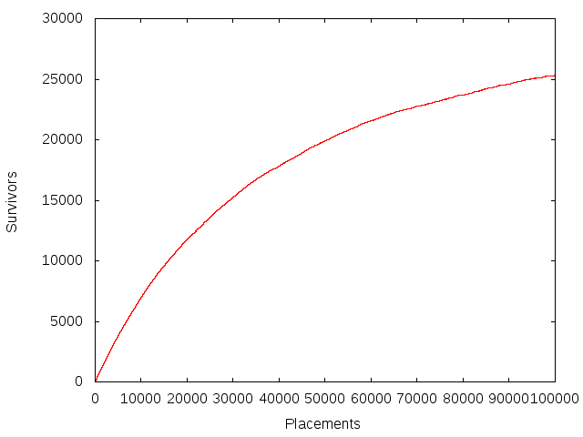

Why you should respect people’s space

### 11.6.4 Submitting your assignment

Submit your assignment as usual with

    /c/cs223/bin/submit 6

You can run the public test script in `/c/cs223/Hwk6/test.public` on your submitted files with

    /c/cs223/bin/testit 6 public

### 11.6.5 Provided source files

    #define HORIZONTAL (0)  /* place ship horizontally */
    #define VERTICAL (1)    /* place ship vertically */
    
    #define MAX_SHIP_LENGTH (17) /* length of longest ship (width is always 1) */
    
    #define NO_SHIP_NAME ('.') /* what to return when hitting no ship */
    
    /*
     * Type for coordinates, and their maximum possible value.
     *
     * Include <stdint.h> before this header file
     * to get the definition of uint32_t
     * and its maximum value UINT32_MAX.
     */
    typedef uint32_t coord;
    #define COORD_MAX (UINT32_MAX)
    
    /*
     * Non-opaque structs for passing around positions and ship placements.
     */
    struct position {
        coord x;
        coord y;
    };
    
    struct ship {
        struct position topLeft;  /* coordinates of top left corner */
        int direction;            /* HORIZONTAL or VERTICAL */
        unsigned int length;      /* length of ship */
        char name;                /* name of ship */
    };
    
    /*
     * Create a playing field for holding ships.
     */
    struct field *fieldCreate(void);
    
    /*
     * Free all space associated with a field.
     */
    void fieldDestroy(struct field *);
    
    /*
     * Place a ship in a field with given placement and name.
     *
     * If placement.length is less than one or greater than MAX_SHIP_LENGTH, 
     * or if some part of the ship would have a coordinate greater than COORD_MAX, 
     * or if the ship's name is NO_SHIP_NAME,
     * the function returns without placing a ship.
     *
     * Placing a new ship that intersects any previously-placed ships
     * sinks the previous ships, removing them from the field.
     */
    void fieldPlaceShip(struct field *f, struct ship s);
    
    /*
     * Attack!
     *
     * Drop a shell at given position.
     *
     * Returns NO_SHIP_NAME if attack misses (does not intersect any ship).
     *
     * Otherwise returns name of ship hit. 
     *
     * Hitting a ship sinks it, removing it from the field.
     */
    char fieldAttack(struct field *f, struct position p);
    
    /*
     * Return number of ships in the field.
     */
    size_t fieldCountShips(const struct field *f);

[examples/2015/hw/6/ships.h](examples/2015/hw/6/ships.h)

    #include <stdio.h>
    #include <stdlib.h>
    #include <assert.h>
    #include <stdint.h>
    #include <inttypes.h>
    
    #include "ships.h"
    
    #define PLACE_SHIP ('+')   /* command to place a new ship */
    #define ATTACK ('-')       /* command to attack a location */
    
    int
    main(int argc, char **argv)
    {
        struct field *f; /* where we keep our ships */
        int command;     /* command char */
        struct ship s;   /* ship we are placing */
        struct position p; /* location to attack */
        int sank;        /* ship we sank */
    
        if(argc != 1) {
            fprintf(stderr, "Usage: %s\n", argv[0]);
            return 1;
        }
    
        f = fieldCreate();
    
        while((command = getchar()) != EOF) {
            switch(command) {
                case PLACE_SHIP:
                    if(scanf("%" SCNu32 " %" SCNu32 "%d %u %c ", &s.topLeft.x, &s.topLeft.y, &s.direction, &s.length, &s.name) != 5) {
                        /* not enough args */
                        fprintf(stderr, "Not enough enough args to %c\n", PLACE_SHIP);
                        return 1;
                    }
                    /* else */
    
                    /* fix the direction to match actual definitions */
                    s.direction = s.direction ? VERTICAL : HORIZONTAL;
    
                    fieldPlaceShip(f, s);
                    sank = NO_SHIP_NAME;
    
                    break;
    
                case ATTACK:
                    if(scanf("%" SCNu32 " %" SCNu32 " ", &p.x, &p.y) != 2) {
                        fprintf(stderr, "Not enough enough args to %c\n", ATTACK);
                        return 1;
                    }
                    /* else */
                    sank = fieldAttack(f, p);
    
                    break;
    
                default:
                    /* bad command */
                    fprintf(stderr, "Bad command %c\n", command);
                    return 1;
                    break;
            }
    
            printf("%c %zu\n", sank, fieldCountShips(f));
        }
    
        fieldDestroy(f);
    
        return 0;
    }

[examples/2015/hw/6/testShips.c](examples/2015/hw/6/testShips.c)

### 11.6.6 Sample solution

    #include <stdlib.h>
    #include <assert.h>
    #include <string.h>
    #include <stdint.h>
    
    #include "ships.h"
    
    /* basic hash table */
    struct field {
        size_t size;         /* number of slots in table */
        size_t occupancy;    /* number of elements in table */
        struct elt **table;  /* hash table, malloc'd */
    };
    
    struct elt {
        struct elt *next;   /* pointer to next element in linked list */
        struct ship ship;       /* ship in this element */
    };
    
    /* picked more or less at whim from http://planetmath.org/goodhashtableprimes */
    #define X_HASH_FACTOR (201326611)
    #define Y_HASH_FACTOR (3145739)
    
    static size_t
    hash(struct position p)
    {
        return X_HASH_FACTOR * p.x + Y_HASH_FACTOR * p.y;
    }
    
    #define DEFAULT_INITIAL_SIZE (8)
    
    /* like fieldCreate, but argument gives initial size */
    static struct field *
    fieldCreateInternal(size_t initialSize)
    {
        struct field *f;
        size_t i;
    
        f = malloc(sizeof(struct field));
        assert(f);
    
        f->size = initialSize;
        f->occupancy = 0;
    
        f->table = malloc(sizeof(struct elt *) * f->size);
    
        for(i = 0; i < f->size; i++) {
            f->table[i] = 0;
        }
    
        return f;
    }
    
    struct field *
    fieldCreate(void)
    {
        return fieldCreateInternal(DEFAULT_INITIAL_SIZE);
    }
    
    /* destroy contents of f but don't free f itself */
    static void 
    fieldDestroyContents(struct field *f)
    {
        size_t i;
        struct elt *e;
        struct elt *next;
    
        for(i = 0; i < f->size; i++) {
            for(e = f->table[i]; e != 0; e = next) {
                next = e->next;
                free(e);
            }
        }
    
        free(f->table);
    }
    
    void
    fieldDestroy(struct field *f)
    {
        fieldDestroyContents(f);
        free(f);
    }
    
    /* when to grow field */
    #define MAX_ALPHA (1)
    
    /*
     * Helper for fieldPlaceShip.
     * 
     * This skips all the sanity-checking in fieldPlaceShip,
     * and just performs the hash table insertion.
     */
    static void
    fieldInsertShip(struct field *f, struct ship s)
    {
        size_t h;     /* hashed coordinates */
        struct elt *e;  /* new element to insert */
    
        h = hash(s.topLeft) % f->size;
    
        e = malloc(sizeof(struct elt));
        assert(e);
    
        e->ship = s;
        e->next = f->table[h];
        f->table[h] = e;
        f->occupancy++;
    }
    
    
    void 
    fieldPlaceShip(struct field *f, struct ship s)
    {
        struct field *f2;
        struct elt *e;
        struct position pos;
        size_t i;
    
        /* test if we can just throw this away */
        if(s.name == NO_SHIP_NAME 
                || s.length == 0
                || s.length > MAX_SHIP_LENGTH
                || (s.direction == HORIZONTAL && s.topLeft.x > COORD_MAX - (s.length - 1))
                || (s.direction == VERTICAL   && s.topLeft.y > COORD_MAX - (s.length - 1))
          )
        {
            return;
        }
        /* else */
    
        if(f->occupancy >= f->size * MAX_ALPHA) {
            /* grow the field */
            f2 = fieldCreateInternal(f->size * 2);
    
            /* copy to new field */
            for(i = 0; i < f->size; i++) {
                for(e = f->table[i]; e != 0; e = e->next) {
                    /* skip testing for occupancy or intersections */
                    fieldInsertShip(f2, e->ship);
                }
            }
    
            /* transplant new field into old field */
            fieldDestroyContents(f);
            *f = *f2;
    
            free(f2);
        }
    
        /* check for intersections */
        pos = s.topLeft;
        for(i = 0; i < s.length; i++) {
            if(s.direction == HORIZONTAL) {
                pos.x = s.topLeft.x + i;
            } else {
                pos.y = s.topLeft.y + i;
            } 
    
            fieldAttack(f, pos);
        }
    
        /* call helper to do the actual hash table insertion */
        fieldInsertShip(f, s);
    }
    
    /*
     * Helper for fieldAttack.
     *
     * If there is a ship with topLeft at given position, return pointer
     * to location in hash table that points to it (either table entry
     * or next component).
     *
     * If not, return null.
     */
    static struct elt **
    fieldShipAt(struct field *f, struct position p)
    {
        struct elt **prev;  /* previous pointer */
    
        for(prev = &f->table[hash(p) % f->size]; *prev != 0; prev = &((*prev)->next)) {
            if((*prev)->ship.topLeft.x == p.x && (*prev)->ship.topLeft.y == p.y) {
                return prev;
            }
        }
    
        /* didn't find anything */
        return 0;
    }
    
    /*
     * Attack!
     *
     * Drop a shell at given position.
     *
     * Returns 0 if attack misses (does not intersect any ship).
     *
     * Otherwise returns name of ship hit, 
     * which should be freed by caller when no longer needed.
     *
     * Hitting a ship sinks it, removing it from the field.
     */
    char
    fieldAttack(struct field *f, struct position p)
    {
        struct position p2;
        int i;
        int direction;
        struct elt **prev;
        struct elt *freeMe;
        char name;
    
        for(direction = 0; direction <= 1; direction++) {
            for(i = 0; i < MAX_SHIP_LENGTH && i <= (direction == HORIZONTAL ? p.x : p.y); i++) {
                if(direction == HORIZONTAL) {
                    p2.x = p.x - i;
                    p2.y = p.y;
                } else {
                    p2.x = p.x;
                    p2.y = p.y - i;
                }
    
                prev = fieldShipAt(f, p2);
    
                if(prev) {
                    /* if we sink anybody, it will be this ship */
                    /* but maybe it doesn't reach */
                    /* or points in the wrong direction */
                    if((*prev)->ship.length > i && (*prev)->ship.direction == direction) {
                        /* got it */
                        freeMe = *prev;
                        *prev = freeMe->next;
    
                        name = freeMe->ship.name;
                        free(freeMe);
    
                        f->occupancy--;
                        
                        return name;
                    } else {
                        /* didn't get it */
                        /* maybe try again in other direction */
                        break;
                    }
                }
            }
        }
    
        /* didn't get anything */
        return NO_SHIP_NAME;
    }
    
    /*
     * Return number of ships in the field.
     */
    size_t
    fieldCountShips(const struct field *f)
    {
        return f->occupancy;
    }

[examples/2015/hw/6/ships.c](examples/2015/hw/6/ships.c)

11.7 Assignment 7, due Wednesday 2015-04-01, at 11:00pm
-------------------------------------------------------

### 11.7.1 Solitaire with big cards

For this assignment you are to implement a strategy for playing a card game involving moving cards (represented by `uint64_t`s) down through a sequence of _n_ piles. The interface to your strategy is given in the file [`strategy.h`](examples/2015/hw/7/strategy.h), shown below:

    /*
     * Interface for card-playing strategy.
     *
     * The deal function supplies a new card to the strategy.  Each possible card will only be dealt once.
     *
     * The play function should return a card that has been dealt previously but not yet played.
     * If asked for a card when the hand is empty, its behavior is undefined.
     */
    
    #include <stdint.h>
    
    typedef uint64_t Card;   /* representation of a card */
    
    /* opaque type for strategy data */
    typedef struct strategy Strategy;
    
    /* set up a new strategy for numPiles many piles */
    Strategy *strategyCreate(int numPiles);
    
    /* clean up all space used by a strategy */
    void strategyDestroy(Strategy *);
    
    /* add a card to the current hand */
    void strategyDeal(Strategy *, Card);
    
    /* play a card from pile k */
    Card strategyPlay(Strategy *, int k);

[examples/2015/hw/7/strategy.h](examples/2015/hw/7/strategy.h)

Initially, the player has _n_ piles, numbered 1 through _n_. The `strategyDeal` function is called to indicate that a new card has been dealt to pile _n_. The `strategyPlay` function is called to indicate that a card should be moved from pile `k` to pile `k-1`; this function should return the card to move. Cards moved to pile 0 leave the game and are not used again. Each card is unique: once a card is dealt, the same card will never be dealt again during the same play of the game.

The choice of when to deal and when to play from pile is controlled by some external entity, which at some point will stop and compute the smallest card in each pile. The goal of the strategy is to make these smallest cards be as large as possible, giving priority to the highest-numbered piles: given two runs of the game, the better-scoring one is the one that has the larger smallest card in pile _n_, or, if both have the same smallest card in pile _n_, the one that has the larger smallest card in pile _n_ − 1, and so forth. A tie would require that both runs end with the same smallest card in every pile. An empty pile counts as `UINT64_MAX` for this purpose (although note that a strategy has no control over which piles are empty).

Your job is to implement a strategy that produces the best possible result for any sequence of calls to `strategyDeal` and `strategyPlay`. Your strategy implementation will most likely need to keep track of which cards are available in each pile, as this information is not provided by the caller. Your `strategyPlay` function should only make legal moves: that is, it should only play cards that are actually present in the appropriate pile. You may assume that `strategyPlay` is never called on an empty pile.

Your implementation should consist of a file `strategy.c` and any supporting source and header files that you need other than `strategy.h`, which we have provided for you. You should also supply a file `Makefile` that generates a program `testStrategy` when `make` is called with no arguments, using your implementation and the [`testStrategy.c`](examples/2015/hw/7/testStrategy.c) file that you can find in `/c/cs223/Hwk7/sourceFiles/testStrategy.c`.

### 11.7.2 Explanation of the testing program

The `testStrategy` program implements one of four rules for when you can play from each pile. The arguments to `testStrategy` are a character indicating which rule to apply, the number of cards to deal (which can be pretty big), and the number of piles (which is much more limited, because `testStrategy.c` tracks the pile each card is in using a `char` to save space). The actual cards dealt are generated deterministically and will be the same in every execution with the same arguments. The test files in `/c/cs223/Hwk7/testFiles` give the expected output when `testStrategy` is run with the arguments specified in the filename (after removing the `-` characters); this will always be the value, in hexadecimal, of the smallest card in each pile, starting with the top pile.

For example, running the _harmonic_ rule `h` with 1000 cards and 4 piles (not counting the 0 pile) gives the output

    $ ./testStrategy h 1000 4
    5462035faf0d6fa1
    501ebb6268d39af3
    25732b5fee7c8ad7
    301e0f608d124ede

This output would appear in a filename `h-1000-4`, if this particular combination of parameters were one of the test cases.

### 11.7.3 Submitting your assignment

Submit your assignment as usual with `/c/cs223/bin/submit 7`. You should submit your source file(s), your `Makefile`, and any other files needed to build your program other than `strategy.h` and `testStrategy.c`, which will be supplied by the test script. You can test your submission using the public test script in `/c/cs223/Hwk7/test.public` using the command `/c/cs223/bin/testit 7 public`.

### 11.7.4 Sample solution

I implemented a heap with `uint64_t` elements as a separate module ([heap.h](examples/2015/hw/7/heap.h), [heap.c](examples/2015/hw/7/heap.c)) and then used it in a main module [strategy.c](examples/2015/hw/7/strategy.c) that allocates a separate heap for each pile and manages the translation between `strategyDeal` and `strategyPlay` and the heap functions. The [Makefile](examples/2015/hw/7/Makefile) is pretty much the usual.

11.8 Assignment 8, due Wednesday 2015-04-08, at 11:00pm
-------------------------------------------------------

### 11.8.1 An ordered set

For this assignment, you are to implement an ordered set data type for holding null-terminated strings. The interface to this data type is given in the file [orderedSet.h](examples/2015/hw/8/orderedSet.h), shown below.

    /*
     * Ordered set data structure.
     */
    
    /* Make a new empty set */
    struct orderedSet *orderedSetCreate(void);
    
    /* Destroy a set */
    void orderedSetDestroy(struct orderedSet *);
    
    /* How many elements in this set? */
    size_t orderedSetSize(const struct orderedSet *);
    
    /* Insert a new element.  Has no effect if element is already present. */
    void orderedSetInsert(struct orderedSet *, const char *);
    
    /* Delete an element.  Has no effect if element is not already present. */
    void orderedSetDelete(struct orderedSet *, const char *);
    
    /* Return a new ordered set containing all elements e
     * for which predicate(arg, x) != 0.
     * The predicate function should be applied to the elements in increasing order. */
    struct orderedSet *orderedSetFilter(const struct orderedSet *, int (*predicate)(void *arg, const char *), void *arg);

[examples/2015/hw/8/orderedSet.h](examples/2015/hw/8/orderedSet.h)

In addition to the usual create and destroy functions, an ordered set supports inserting and deleting elements, counting the number of distinct elements in the set, and filtering the set based on a predicate function passed in as an argument. This filtering operation does not modify the input set, but instead generates a new ordered set containing only those elements on which the predicate returns a nonzero value.

The filtering operation is where most of the excitement happens; because the predicate function takes an argument of type `void *` that is also passed to the filter function, it is possible for the predicate to compute an arbitrary function on the elements of the set as a side-effect of processing each element to decide whether to put it in the output set. This allows predicates to be abused to perform all sorts of computations, including printing out all elements of the set or computing a hash of all the strings in the set concatenated together. These features are used by the test program [testOrderedSet.c](examples/2015/hw/8) that we have provided. To ensure that these traversals give consistent results, it is required that when your implementation of `orderedSetFilter` is executed, it calls the predicate function exactly once on each element of the set in increasing order as determined by `strcmp`.

### 11.8.2 The `testOrderedSet` wrapper

The test program is a fairly thin wrapper over the implementation that allows you to call the various functions using one-line commands on standard input. A command is given as the first character of the line, and the rest of the line contains the argument to the command if needed. The `+` and `-` commands add or remove an element from the set, respectively, while the `p`, `s`, and `h` commands print the contents of the set, the size of the set, and a hash of the set (these commands ignore any argument). The `f` command removes all elements of the set that do not contain a particular substring.

Here is a simple input to the program that inserts four strings, filters out the ones that don’t contain `ee`, then prints various information about the results.

    +feed
    +the
    +bees
    +please
    fee
    s
    h
    p

This should produce the output

    2
    15082778b3db8cb3
    bees
    feed

### 11.8.3 Submitting your assignment

Submit, with the usual `/c/cs223/bin/submit 8 filename`, your `Makefile` and any supporting files needed to build the program `testOrderedSet` from `testOrderedSet.c` and `orderedSet.h` when `make` is called with no arguments. These last two files will be provided by the test script and you do not need to submit them.

You can test your submission against the public test script in `/c/cs223/Hwk8/test.public` with `/c/cs223/bin/testit 8`.

### 11.8.4 Sample solution

There were a lot of ways to do this. For the sample solution, I decided to do something unusual, and store the set as a hash table. This is not ordered, but since the only operation that requires the set to be ordered is `orderedSetFilter`, which will take _Ω_(_n_) time no matter how you implement it, the _O_(_n_log _n_) cost to call `qsort` to sort the elements as needed does not add much overhead.

    #include <stdio.h>
    #include <stdlib.h>
    #include <assert.h>
    #include <stdint.h>
    #include <string.h>
    
    #include "orderedSet.h"
    
    /* We'll use a hash table with linear probing.
     * This is not actually ordered, but the only operations that
     * depend on order a linear-time anyway, so we can afford to sort as needed */
    struct orderedSet {
        size_t n;     /* number of elements */
        size_t size;  /* size of the table */
        char **table; /* hash table */
    };
    
    #define INITIAL_SIZE (16)
    #define MAX_ALPHA (0.75)
    
    /* Make a new empty set with given size */
    static struct orderedSet *
    orderedSetCreateInternal(size_t size)
    {
        struct orderedSet *s;
    
        s = malloc(sizeof(*s));
        assert(s);
    
        s->n = 0;
        s->size = size;
        s->table = calloc(s->size, sizeof(char *));
    
        return s;
    }
    
    struct orderedSet *
    orderedSetCreate(void)
    {
        return orderedSetCreateInternal(INITIAL_SIZE);
    }
    
    /* Destroy a set */
    void 
    orderedSetDestroy(struct orderedSet *s)
    {
        size_t i;
    
        for(i = 0; i < s->size; i++) {
            if(s->table[i]) {
                free(s->table[i]);
            }
        }
    
        free(s->table);
        free(s);
    }
    
    /* How many elements in this set? */
    size_t 
    orderedSetSize(const struct orderedSet *s)
    {
        return s->n;
    }
    
    static size_t
    hash(const char *s)
    {
        size_t h;
    
        /* usual crummy hash function */
        for(h = 0; *s; h = h * 97 + *s++);
    
        return h;
    }
    
    static char *
    strMalloc(const char *s)
    {
        char *s2;
    
        s2 = malloc(strlen(s)+1);
        strcpy(s2, s);
    
        return s2;
    }
    
    /* Insert and element without doing size check or malloc */
    /* Frees element if already present */
    static void
    orderedSetInsertInternal(struct orderedSet *s, char *elt)
    {
        size_t h;
    
        assert(elt);
    
        /* skip over non-empty slots with different values */
        for(h = hash(elt) % s->size; s->table[h] && strcmp(s->table[h], elt); h = (h+1) % s->size);
    
        /* check if not already present */
        if(s->table[h] == 0) {
            s->table[h] = elt;
            s->n++;
        } else {
            free(elt);
        }
    }
    
    /* Insert a new element.  Has no effect if element is already present. */
    void 
    orderedSetInsert(struct orderedSet *s, const char *elt)
    {
        size_t h;
        struct orderedSet *s2;
    
        if(s->n >= s->size * MAX_ALPHA) {
            /* rebuild the table */
            s2 = orderedSetCreateInternal(s->size * 2);
    
            /* copy all the elements */
            for(h = 0; h < s->size; h++) {
                if(s->table[h]) {
                    orderedSetInsertInternal(s2, s->table[h]);
                }
            }
    
            /* free the table and then do a brain transplant */
            free(s->table);
            *s = *s2;
            free(s2);
        }
    
        orderedSetInsertInternal(s, strMalloc(elt));
    }
    
    /* Delete an element.  Has no effect if element is not already present. */
    void 
    orderedSetDelete(struct orderedSet *s, const char *elt)
    {
        size_t h;
        char *later;
    
        /* skip over non-empty slots with different values */
        for(h = hash(elt) % s->size; s->table[h] && strcmp(s->table[h], elt); h = (h+1) % s->size);
        
        /* if we reached a nonempty slot, it must be our target */
        if(s->table[h] != 0) {
            /* remove the initial element */
            free(s->table[h]);
            s->table[h] = 0;
            s->n--;
    
            /* remove and reinsert any elements up to the next hole, in case they wanted to be earlier */
            for(h = (h+1) % s->size; s->table[h] ; h = (h+1) % s->size) {
                later = s->table[h];
                s->table[h] = 0;
                s->n--;
                orderedSetInsertInternal(s, later);
            }
        }
    }
    
    static int
    compare(const void *s1, const void *s2)
    {
        return strcmp(*((const char **) s1), *((const char **) s2));
    }
    
    /* Return a new ordered set containing all elements e
     * for which predicate(arg, x) != 0.
     * The predicate function should be applied to the elements in increasing order. */
    struct orderedSet *
    orderedSetFilter(const struct orderedSet *s, int (*predicate)(void *arg, const char *), void *arg)
    {
        size_t h;
        const char **a;   /* temporary array to sort */
        size_t top;       /* where to put things in a */
        size_t i;
        struct orderedSet *s2;
    
        a = malloc(sizeof(const char *) * s->size);
        assert(a);
        
        top = 0;
    
        for(h = 0; h < s->size; h++) {
            if(s->table[h]) {
                a[top++] = s->table[h];
            }
        }
    
        qsort(a, top, sizeof(const char *), compare);
    
        s2 = orderedSetCreate();
    
        for(i = 0; i < top; i++) {
            if(predicate(arg, a[i])) {
                orderedSetInsert(s2, a[i]);
            }
        }
    
        free(a);
    
        return s2;
    }

[examples/2015/hw/8/orderedSet.c](examples/2015/hw/8/orderedSet.c)

[Makefile](#Makefile-1){examples/2015/hw/8/Makefile}

11.9 Assignment 9, due Wednesday 2015-04-15, at 11:00pm
-------------------------------------------------------

### 11.9.1 Finding a cycle in a maze

For this problem, you are given a rectangular maze consisting of _wall_ squares (represented by 0) and _path_ squares (represented by 1). Two path squares are considered to be adjacent if they are at most one square away orthogonally or diagonally; in chess terms, two path squares are adjacent if a king can move from one to the other in one turn. The input to your program is a maze in which the graph consisting of all path squares is connected and contains at most one cycle, where a cycle is a sequence of distinct squares _s_1, _s_2, …, _s__k_ where each _s__i_ is adjacent to _s__i_ + 1 and _s__n_ is adjacent to _s_1. Your job is to write a program `maze` that finds this cycle if it exists, and marks all of its squares as _cycle_ squares (represented by 2).

For example, here is a picture of a 200-by-100 maze that contains a small cycle:

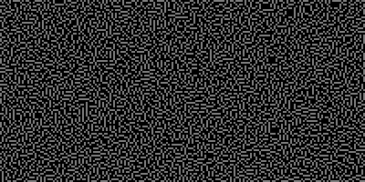

200 by 100 maze

and here is the same maze with the cycle highlighted in white:

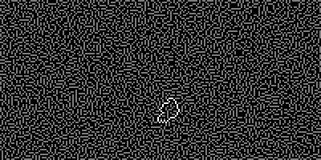

200 by 100 maze, showing cycle

### 11.9.2 Input and output format

The input to your program should be taken from `stdin`, in a restricted version of [raw PGM format](http://netpbm.sourceforge.net/doc/pgm.html), an old image format designed to be particularly easy to parse. The input file header will be a line that looks like it was generated by the `printf` conversion string `"P5 %d %d 255\n"`, where the first `int` value is the width of the image in columns and the second is the height of the image in rows; the same conversion string can be given to `scanf` to parse this line. Following the newline will be a long sequence of bytes, each representing one pixel of the image, with each row following immediately after the previous one. These bytes will be either 0 or 1 depending on whether that position in the maze is a wall or a path.

The output to your program should be in the same format, with the difference that now some of the bytes in the image data may be 2, indicating the cycle. If there is no cycle, the output should be identical to the input. Your program is not required to detect or respond in any particular way to input mazes that violate the format or do not contain a connected graph of path squares, although you are encouraged to put in reasonable error checking for your own benefit during testing.

For example, the maze depicted above is stored in the file [200-100-4.in.pgm](examples/2015/hw/9/200-100-4.in.pgm); the corresponding output is stored in the file [200-100-4.out.pgm](examples/2015/hw/9/200-100-4.out.pgm). Other sample inputs and outputs can be found in `/c/cs223/Hwk9/testFiles`.

This file format is hard to read with the naked eye, even after loading into a text editor. The script `/c/cs223/Hwk9/toPng` will generate a PNG file that doubles the pixel size and rescales the 0, 1, 2 pixel values to more reasonable values for display. This can be called as `/c/cs223/Hwk9/toPng filename.pgm` to produce a new file `filename.pgm.png`. This works best if `filename.pgm` is already in a directory you can write to. PNG files can be displayed using most web browsers and image manipulation tools.

### 11.9.3 Submitting and testing your program

Submit whatever files you need to build `maze` (including a `Makefile` that generates `maze` when called with no arguments) using `/c/cs223/bin/submit 9`. You can apply the public test script in `/c/cs223/Hwk9/test.public` to your submitted files using `/c/cs223/bin/testit 9 public`.

### 11.9.4 Sample solution

This uses breadth-first search, which makes the search a bit simpler than depth-first search but requires some more effort to compute the cycle. The program also includes code for generating random mazes.

    #include <stdio.h>
    #include <stdlib.h>
    #include <assert.h>
    #include <math.h>
    #include <limits.h>
    
    struct direction {
        signed char x;
        signed char y;
    };
    
    #define DIRECTIONS (8)
    
    const struct direction directions[DIRECTIONS] = {
        { -1, -1 },
        { -1,  0 },
        { -1,  1 },
        {  0, -1 },
        {  0,  1 },
        {  1, -1 },
        {  1,  0 },
        {  1,  1 }
    };
    
    struct position {
        int x;
        int y;
    };
    
    const struct position NO_POSITION = { -1, -1 };
    
    static inline int
    eqPosition(struct position p, struct position q)
    {
        return p.x == q.x && p.y == q.y;
    }
    
    #define WALL (0)
    #define PATH (1)
    #define CYCLE (2)
    
    struct square {
        int contents;
        struct position parent; /* used by search routine */
    };
    
    struct maze {
        struct position size;   /* rows = size.x, columns = size.y */
        struct square *a;       /* packed array of squares */
    };
    
    /* look up a position in a maze */
    #define Mref(m, pos) ((m)->a[(pos).y * (m)->size.x + (pos).x])
    #define Mget(m, pos) (assert((pos).x >= 0 && (pos).y >= 0 && (pos).x < (m)->size.x && (pos).y < (m)->size.y), Mref((m), (pos)))
    
    /* add direction to source to get target */
    /* returns 1 if target is in range */
    int
    offset(const struct maze *m, struct position *target, struct position source, struct direction dir)
    {
        target->x = source.x + dir.x;
        target->y = source.y + dir.y;
    
        return target->x >= 0 && target->y >= 0 && target->x < m->size.x && target->y < m->size.y;
    }
    
    /* free a maze */
    void
    destroyMaze(struct maze *m)
    {
        free(m->a);
        free(m);
    }
    
    /* load a maze in restricted PGM format */
    struct maze *
    loadMaze(FILE *f)
    {
        struct maze *m;
        struct position i;
    
        m = malloc(sizeof(*m));
        assert(m);
    
        fscanf(f, "P5 %d %d 255\n", &m->size.x, &m->size.y);
    
        m->a = malloc(sizeof(struct square) * m->size.y * m->size.x);
    
        for(i.y = 0; i.y < m->size.y; i.y++) {
            for(i.x = 0; i.x < m->size.x; i.x++) {
                Mref(m, i).contents = getchar();
                assert(Mref(m, i).contents == 0 || Mref(m, i).contents == 1);
            }
        }
    
        return m;
    }
    
    void
    saveMaze(struct maze *m, FILE *f)
    {
        struct position i;
    
        fprintf(f, "P5 %d %d 255\n", m->size.x, m->size.y);
    
        for(i.y = 0; i.y < m->size.y; i.y++) {
            for(i.x = 0; i.x < m->size.x; i.x++) {
                putc(Mref(m, i).contents, f);
            }
        }
    }
    
    /* how many neighbors of position are PATH? */
    int 
    countNeighbors(const struct maze *m, struct position p)
    {
        struct position q;
        int i;
        int count = 0;
    
        for(i = 0; i < DIRECTIONS; i++) {
            if(offset(m, &q, p, directions[i]) && Mget(m, q).contents == PATH) {
                count++;
            }
        }
    
        return count;
    }
    
    struct position
    randomPosition(const struct maze *m)
    {
        struct position r;
    
        r.x = rand() % m->size.x;
        r.y = rand() % m->size.y;
    
        return r;
    }
    
    #define PATIENCE_MULTIPLIER (4)
    
    /* generate a random connected maze with no cycles */
    struct maze *
    generateMaze(struct position size)
    {
        struct maze *m;
        struct position r;
        struct position i;
        size_t countdown;    /* how long to run before we get tired of not making progress */
        size_t maxCountdown; /* value to reset countdown to when we make progress */
    
        m = malloc(sizeof(struct maze));
        assert(m);
    
        m->size = size;
        m->a = malloc(sizeof(struct square) * m->size.x * m->size.y);
        assert(m->a);
    
        /* start with all WALL */
        for(i.y = 0; i.y < m->size.y; i.y++) {
            for(i.x = 0; i.x < m->size.x; i.x++) {
                Mref(m, i).contents = WALL;
            }
        }
    
        /* place a PATH on a random square */
        r = randomPosition(m);
        Mref(m, r).contents = PATH;
    
        maxCountdown = PATIENCE_MULTIPLIER * size.x * size.y * log(size.x * size.y);
    
        for(countdown = maxCountdown; countdown > 0; countdown--) {
            /* pick a random square */
            r = randomPosition(m);
    
            /* add if we have exactly one neighbor already in the maze */
            if(Mget(m, r).contents == WALL && countNeighbors(m, r) == 1) {
                Mref(m, r).contents = PATH;
    
                /* reset countdown */
                countdown = maxCountdown;
            }
        }
    
        return m;
    }
    
    /* create a cycle by adding one extra PATH square
     * that connects two existing squares */
    void
    mazeAddCycle(struct maze *m)
    {
        struct position r;
    
        do {
            r = randomPosition(m);
        } while(Mget(m, r).contents != WALL || countNeighbors(m, r) != 2);
    
        Mref(m, r).contents = PATH;
    }
    
    /* Search for a cycle of PATH nodes.
     * If found, mark all nodes on the cycle as CYCLE. */
    void
    mazeSearchForCycle(struct maze *m)
    {
        struct position root;     /* root of tree */
        struct position current;  /* what we just popped */
        struct position parent ;  /* current's parent */
        struct position neighbor; /* neighbor to push */
        struct position ancestor; /* for filling in CYCLE */
        int i;
        struct position *queue;
        size_t head;    /* where to dequeue */
        size_t tail;    /* where to enqueue */
    
        /* this is probably more space than we need */
        queue = malloc(sizeof(struct position) * m->size.x * m->size.y);
        assert(queue);
    
        head = tail = 0;
    
        /* clear out bookkeeping data */
        for(current.y = 0; current.y < m->size.y; current.y++) {
            for(current.x = 0; current.x < m->size.x; current.x++) {
                Mref(m, current).parent = NO_POSITION;
    
                /* probably not necessary but will avoid trouble
                 * if somebody calls this twice */
                if(Mget(m, current).contents != WALL) {
                    Mref(m, current).contents = PATH;
                }
            }
        }
    
        /* find a root */
        /* we don't care what this is, but it can't be a WALL */
        do {
            root = randomPosition(m);
        } while(Mget(m, root).contents != PATH);
    
        /* push root */
        Mref(m, root).parent = root;
        queue[tail++] = root;
    
        /* now perform the BFS */
        /* if we ever find a neighbor that is already in the tree and not our parent,
         * we have found our cycle */
        while(head < tail) {
            current = queue[head++];
            parent = Mget(m, current).parent;
    
            /* push all neighbors not already in tree */
            /* if one is in the tree, we win */
            for(i = 0; i < DIRECTIONS; i++) {
                if(offset(m, &neighbor, current, directions[i]) && Mget(m, neighbor).contents == PATH && !eqPosition(neighbor, parent)) {
                    /* is it already in the tree? */
                    if(!eqPosition(Mget(m, neighbor).parent, NO_POSITION)) {
                        /* we win */
                        /* cycle consists of all ancestors of neighbor and current
                         * up to common ancestor */
                        for(ancestor = neighbor; !eqPosition(ancestor, root); ancestor = Mget(m, ancestor).parent) {
                            Mref(m, ancestor).contents = CYCLE;
                        }
    
                        /* also mark root */
                        Mref(m, root).contents = CYCLE;
    
                        /* now work up from current */
                        for(ancestor = current; !eqPosition(ancestor, root); ancestor = Mget(m, ancestor).parent) {
                            if(Mget(m, ancestor).contents == PATH) {
                                /* add to the cycle */
                                Mref(m, ancestor).contents = CYCLE;
                            } else {
                                /* this is the common ancestor, which is not root */
                                /* mark all proper ancestors as PATH */
                                do {
                                    ancestor = Mget(m, ancestor).parent;
                                    Mref(m, ancestor).contents = PATH;
                                } while(!eqPosition(ancestor, root));
    
                                /* can't just break, too many loops */
                                goto doneWithSearch;
                            }
                        }
                    } else {
                        Mref(m, neighbor).parent = current;
                        queue[tail++] = neighbor;
                    }
                }
            }
        }
    
    doneWithSearch:
        free(queue);
    }
    
    int
    main(int argc, char **argv)
    {
        struct maze *m;
        struct position size = { 80, 60 };
        int seed;
    
        switch(argc) {
            case 1:
                /* sample solution for the assignment */
                m = loadMaze(stdin);
                mazeSearchForCycle(m);
                saveMaze(m, stdout);
                destroyMaze(m);
                break;
            case 4:
                /* generate a new test image */
                /* usage is ./maze width height seed */
                /* if seed is negative, use absolute value and don't put in cycle */
                size.x = atoi(argv[1]);
                size.y = atoi(argv[2]);
                seed = atoi(argv[3]);
    
                srand(seed < 0 ? -seed : seed);
                m = generateMaze(size);
                if(seed >= 0) { mazeAddCycle(m); }
                saveMaze(m, stdout);
                destroyMaze(m);
                break;
            default:
                fprintf(stderr, "Usage %s or %s width height seed\n", argv[0], argv[0]);
                return 1;
        }
    
        return 0;
    }

[examples/2015/hw/9/maze.c](examples/2015/hw/9/maze.c)

And the [Makefile](examples/2015/hw/9/Makefile).

12 Various student contributions
================================

12.1 Common C coding and debugging issues
-----------------------------------------

Here are some notes from a helpful Zoo denizen about debugging programs in 223. (Note: these have been edited slightly from the original.)

    Date: Thu, 10 Feb 2005 06:02:23 -0500 (EST)
    From: James Terry <james.c.terry@yale.edu>
    Subject: 223 coding feedback
    
    Hi Jim,
    
    Several of your students for 223 were up late last night in the Zoo
    working on their assignments, and they seemed to be getting hung up on
    some coding issues.  They were pretty frustrated with some standard
    language/debugging issues, so I helped them get the type-checker and
    Valgrind to stop yelling at them.  I noticed some recurring problems and I
    thought I'd pass them on to you.  They're pretty standard mistakes, and
    I've made most of them myself at some point, either in your class or in
    Stan's.  It occurred to me that there might be more confused people than
    were around last night, and they'd probably appreciate it if someone told
    them about these sort of things.  I'm not trying to intrude on how you
    teach the class; I just thought this feedback would be helpful and I
    wasn't sure that it would find its way to you otherwise.  I'm sure you've
    already taught them several of these, and I understand that sometimes
    students just don't pay attention.  Still, these seem like good points to
    hammer down:
    
    Recurring debugging/coding problems:
    
    1.  If you want a debugger/Valgrind to give you line numbers, you must 
    compile with debugging info turned on, i. e. using the -g[level] flag.
    2.  On the Zoo, pointers and int's are 4 bytes; char's are 1.  (Some 
    people didn't seem to realize that a char* is 4 bytes rather than 1.)
    3.  I think it would be helpful if you explained why, when using 
    realloc(), it's a good idea to increase the allocated size 
    multiplicatively rather than additively.  Besides, everyone loves the 
    "tearing down the hotel" metaphor.  :) 
    4.  If they use call-by-reference, they had better make sure that they 
    keep the same reference.  So if they pass in a pointer as an argument to a 
    function, they shouldn't call malloc() or realloc() on that function.  
    (Mention the double pointer as another option.)  Most people will make 
    this mistake eventually if no one warns them about it.  When I was 
    learning C, I sort of viewed malloc() and realloc() as magical 
    memory-increasing functions; that is to say, I didn't think very hard 
    about the meaning of assigning a pointer to malloc()'s return value.  I 
    suspect some of your students would benefit from having the details 
    spelled out.  (Or spelled out again, if you've already done that.)  
    5.  It's possible to get through a lot (but not all) of the CS major 
    without learning basic Unix shell syntax, but that's really just wasted 
    time.  Pipes, backgrounding, man, scp, and grep really help even at the 
    intro level.  I realize the purpose of the class isn't to teach Unix, but 
    in past years I think there was a TA help session on these things.  They 
    don't need to know how to write their own Emacs modes, but the basics 
    would definitely be helpful.  
    6.  malloc/free -- If Valgrind/gdb reports a problem inside of malloc() or 
    free(), chances are that the student has *not* discovered a bug in gcc.  
    (I just heard how one of Zhong's students' proved the correctness of the 
    libraries for his thesis; that's pretty cool.)  Explain why you can't 
    malloc() twice on the same pointer.  Explain how with multidimensional 
    pointers, you must malloc/free each dimension separately.  Drill down the 
    one-to-one correspondence between malloc'ing and free'ing.
    7.  Null characters: It's not obvious to newbies that some library functions 
    require them, particularly null-terminated strings.  Tell them that 
    char*'s must be null terminated in order for <string.h> 
    functions to work.
    8.  Off-by-one errors: Tell people that when all else fails, take a hard 
    look at their comparison operators; i. e. make sure that > shouldn't 
    really be a >=.
    9.  This is probably another thing for a help session or workshop, but I 
    feel almost everyone could benefit from basic software engineering 
    methodology.  Stylistic awkwardness I noticed: 
            --Using a mess of if-then-else's instead of nested control 
    structures.  
            --Using while-loops with iterators that get initialized right 
    before the beginning of the loop and get incremented with each iteration, 
    when they could be using for-loops.  
            --Doing the setup work for a loop right before the beginning of 
    the loop and then at the end of every iteration, instead of at the 
    beginning of every iteration.  Conversely: doing the cleanup work at the 
    beginning of every iteration and then after the loop has completed.
    10.  Tell them to use assert().  (Frequently.)  When you cover binary 
    search, using placement of debugging statements in code in order to pin 
    down an error might be an instructive example.  
    11.  Tell them to use either printf statements or a debugger to debug. I 
    think they can figure out how to do this on their own, they just need to 
    be told it's a good idea.
    
    Hopefully some of these suggestions will be helpful.  I won't be offended 
    if you don't pass them on to your students, and I understand if you put a 
    higher teaching priority on non-coding subjects, but all the things I 
    mentioned were things I wish someone had told me.  I'd be happy to run a 
    help session on this stuff if you and the TAs are too busy, but otherwise 
    I wouldn't presume.  
    
    Best,
    Jim

12.2 223 Office Hours Bingo
---------------------------

This was posted to Piazza by an anonymous student the day before the [2018 Assignment 7](#hw7-2018) was due. The 223 staff do not necessarily endorse any of the sentiments hinted at in this document.

223 Office Hours Bingo

* * *

1.  I would like to thank David Galles for making this site available and Xiao Shi for pointing me to it.[↩](#fnref1)
    
2.  If anybody would like to send me more detailed advice on any of these topics, I’d be happy to paste it in below.[↩](#fnref2)
    
3.  The compiler is GCC version 4.8.2-19ubuntu1 running on a Linux 3.13.0-44-generic kernel running inside VirtualBox on a Windows 8.1 machine with a 3.30-Ghz AMD FX-6100 CPU, so don’t be surprised if you get different numbers on a real machine.[↩](#fnref3)
    
4.  The pattern here is that `HEAD` is the most recent commit, `HEAD^` the one before it, `HEAD^^` the one before that, and so on. This is sometimes nicer than having to pull hex gibberish out of the output of `git log`.[↩](#fnref4)
    
5.  Technically I can use `git reset` to get rid of the commit, but `git reset` can be dangerous, since it throws away information.[↩](#fnref5)
    
6.  This convention was not always followed in the early days of computing. For example, the [PDP-7](http://www.linfo.org/pdp-7.html) on which UNIX was first developed used 18-bit words, which conveniently translated into six octal digits back in the pre-hexadecimal era.[↩](#fnref6)
    
7.  Certain ancient versions of C ran on machines with a different character set encoding, like [EBCDIC](http://en.wikipedia.org/wiki/EBCDIC "WikiPedia"). The C standard does not guarantee ASCII encoding.[↩](#fnref7)
    
8.  C++ programmers will prefer `++x` if they are not otherwise using the return value, because if `x` is some very complicated type with overloaded `++`, using preincrement avoids having to save a copy of the old value.[↩](#fnref8)
    
9.  Exception: Global variables and static local variables are guaranteed to be initialized to an all-0 pattern, which will give the value 0 for most types.[↩](#fnref9)
    
10.  The reason for excluding `char *` and `void *` is that these are often used to represent pointers to objects with arbitrary types.[↩](#fnref10)
    
11.  In this case you will get lucky most of the time, since the odds are that malloc will give you a block that is slightly bigger than `strlen(s)` anyway. But bugs that only manifest themselves occasionally are even worse than bugs that break your program every time, because they are much harder to track down.[↩](#fnref11)
    
12.  Some programs (e.g. `/c/cs223/bin/submit`) will use this to change their behavior depending on what name you call them with.[↩](#fnref12)
    
13.  There are various ways to work around this. The simplest is to put a `union` inside a larger `struct` that includes an explicit type tag.[↩](#fnref13)
    
14.  Arguably, this is a bug in the design of the language: if the compiler knows that `sp` has type `struct string *`, there is no particular reason why it can’t interpret `sp.length` as `sp->length`. But it doesn’t do this, so you will have to remember to write `sp->length` instead.[↩](#fnref14)
    
15.  This is also the simplest way to deal with the inconsistencies between different compilers in how they handle inline functions. For an extensive discussion of the terrifying portability issues that arise in pre-C99 C compilers, see [http://www.greenend.org.uk/rjk/tech/inline.html](http://www.greenend.org.uk/rjk/tech/inline.html).[↩](#fnref15)
    
16.  To make the example work, we are violating our usual rule of always using braces in `if` statements.[↩](#fnref16)
    
17.  The `#` operator looks like it ought to be useful here, but it only works for expanding arguments to macros and not for expanding macros themselves. Attempting to get around this by wrapping `MESSAGE` in a macro that applies the `#` operator to its first argument will end in tears if `MESSAGE` contains any special characters like commas or right parentheses. The C preprocessor has many unfortunate limitations.[↩](#fnref17)
    
18.  This is an abuse of notation, where the equals sign is really acting like set membership. The general rule is that an expression _O_(_f_(_n_)) = _O_(_g_(_n_)) is true if for any choice of a function in _O_(_f_(_n_)), that function is in _O_(_g_(_n_)). This relation is transitive and symmetric, but unlike real equality it’s not symmetric.[↩](#fnref18)
    
19.  A small child of my acquaintance once explained that this wouldn’t work, because you would hit your head on the ceiling.[↩](#fnref19)
    
20.  The example below uses the `offsetof` macro, defined in `stddef.h`, to allocate a truncated head that doesn’t include this extra space. This is probably more trouble than it is worth in this case, but might be useful if we were creating a lot of empty heads and the contents were more than 4 bytes long.[↩](#fnref20)
    
21.  A summary of the state of this problem as of 2013 can be found in [http://arxiv.org/pdf/1306.0207v1.pdf](http://arxiv.org/pdf/1306.0207v1.pdf).[↩](#fnref21)
    
22.  This only works if the graph is undirected, which means that for every edge _u__v_ there is a matching edge _v__u_ with the same weight.[↩](#fnref22)
    
23.  But it’s linear in the numerical value of the output, which means that `fib(n)` will actually terminate in a reasonable amount of time on a typical modern computer when run on any _n_ small enough that _F_(_n_) fits in 32 bits. Running it using 64-bit (or larger) integer representations will be slower.[↩](#fnref23)
    
24.  The actual analysis is pretty complicated, since we are more likely to land in a bigger pile, but it’s not hard to show that on average even the bigger pile has no more than 3/4 of the elements.[↩](#fnref24)
    
25.  This otherwise bizarre-looking modification is useful for modeling scheduling problems, where `a+b` is the time to do `a` and `b` in parallel, and `a*b` is the time to do `a` and `b` sequentially. The reason for making the first case `+` and the second case `*` is because this makes the distributive law `a*(b+c) = (a*b)+(a*c)` work. It also allows tricks like matrix multiplication using the standard definition. See [http://maxplus.org](http://maxplus.org) for more than you probably want to know about this.[↩](#fnref25)
    
26.  Vaughn, M. (director), _Kick-Ass_, 2010.[↩](#fnref26)
    
27.  Not intended as legal advice.[↩](#fnref27)
    
28.  Stratfordians, Oxfordians, and other conspiracy theorists might object that these results depend critically on the precise formatting of the text. We counter this objection by observing that we used the [Project Gutenberg e-text of _The Tempest_](http://www.gutenberg.org/ebooks/2235), which, while not necessarily the most favored by academic Shakespeare scholars, is the easiest version to obtain on-line. We consider it further evidence of Sir Francis Bacon’s genius that not only was he able to subtly encode his name throughout his many brilliant plays, but he was even able to anticipate the effects of modern spelling and punctuation on this encoding.[↩](#fnref28)
    
29.  Normally this is a dangerous thing to assume, but this assignment is complicated enough already.[↩](#fnref29)